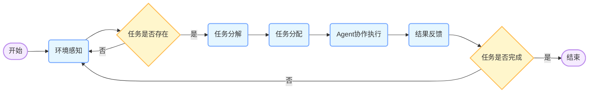

# 实现AI Agent的多Agent协作能力

> 关键词：AI Agent、多Agent协作、协作算法、数学模型、项目实战

> 摘要：本文围绕实现AI Agent的多Agent协作能力展开深入探讨。首先介绍了相关背景知识，包括目的范围、预期读者等。接着阐述了核心概念及联系，通过文本示意图和Mermaid流程图进行直观展示。详细讲解了核心算法原理，并给出Python源代码示例。对数学模型和公式进行了详细推导与举例说明。通过项目实战展示了如何搭建开发环境、实现源代码并进行解读分析。探讨了多Agent协作的实际应用场景，推荐了相关的学习资源、开发工具框架以及论文著作。最后总结了未来发展趋势与挑战，提供了常见问题解答和扩展阅读参考资料，旨在为读者全面呈现多Agent协作能力的实现方法和技术要点。

## 1. 背景介绍 
### 1.1 目的和范围
在当今复杂的计算环境和应用场景中，单个AI Agent的能力往往受到限制。实现AI Agent的多Agent协作能力的目的在于通过多个Agent之间的协同工作，充分发挥各自的优势，提高整体系统的性能和效率，以解决更为复杂的问题。本文章的范围涵盖了多Agent协作的核心概念、算法原理、数学模型、项目实战以及实际应用场景等方面，旨在为读者提供全面且深入的技术指导。

### 1.2 预期读者
本文预期读者包括人工智能领域的研究者、程序员、软件架构师、CTO等专业人士，以及对多Agent系统感兴趣的学生和爱好者。无论是希望深入了解多Agent协作技术原理的理论研究者，还是想要将多Agent协作应用到实际项目中的开发者，都能从本文中获得有价值的信息。

### 1.3 文档结构概述
本文将按照以下结构进行阐述：首先介绍多Agent协作的背景知识，包括目的范围、预期读者和文档结构等；接着详细讲解核心概念与联系，通过文本示意图和Mermaid流程图帮助读者理解；然后阐述核心算法原理并给出Python源代码示例；对涉及的数学模型和公式进行详细推导和举例说明；通过项目实战展示具体的开发过程和代码解读；探讨多Agent协作的实际应用场景；推荐相关的学习资源、开发工具框架和论文著作；最后总结未来发展趋势与挑战，提供常见问题解答和扩展阅读参考资料。

### 1.4 术语表
#### 1.4.1 核心术语定义
- **AI Agent**：人工智能代理，是一种能够感知环境、自主决策并采取行动以实现特定目标的实体。
- **多Agent协作**：多个AI Agent之间通过信息交互和协调合作，共同完成一个或多个任务的过程。
- **协作算法**：用于实现多Agent之间协作的算法，如合同网协议、拍卖算法等。
- **环境感知**：AI Agent对其所处环境的信息进行获取和理解的能力。
- **通信协议**：多Agent之间进行信息交换所遵循的规则和标准。

#### 1.4.2 相关概念解释
- **分布式系统**：多Agent系统通常是分布式的，意味着Agent分布在不同的物理或逻辑节点上，通过网络进行通信和协作。
- **智能体架构**：定义了AI Agent的内部结构和功能模块，如感知模块、决策模块和执行模块等。
- **任务分配**：将一个复杂的任务分解为多个子任务，并分配给不同的Agent来完成的过程。

#### 1.4.3 缩略词列表
- **MAS**：Multi-Agent System，多Agent系统
- **RPC**：Remote Procedure Call，远程过程调用
- **JSON**：JavaScript Object Notation，一种轻量级的数据交换格式

## 2. 核心概念与联系 
### 核心概念原理
多Agent协作的核心原理在于多个AI Agent通过相互通信和协调，实现信息共享和任务分配，以达到共同的目标。每个AI Agent具有一定的自主性和智能性，能够根据自身的能力和环境信息做出决策。在协作过程中，Agent之间通过交换消息来协调行动，避免冲突和重复工作。

例如，在一个物流配送场景中，多个配送Agent可以根据实时交通信息和订单情况，通过协作算法分配配送任务，提高配送效率。

### 架构的文本示意图
多Agent协作系统的架构通常包括以下几个部分：
- **Agent层**：包含多个AI Agent，每个Agent具有感知、决策和执行能力。
- **通信层**：负责Agent之间的信息交换，采用合适的通信协议，如HTTP、TCP等。
- **协调层**：实现Agent之间的任务分配和冲突解决，采用协作算法进行协调。
- **环境层**：Agent所处的外部环境，提供Agent所需的感知信息。

以下是一个简单的文本示意图：
```
+-------------------+
|    环境层         |
+-------------------+
       |
       v
+-------------------+
|    通信层         |
+-------------------+
       |
       v
+-------------------+
|    协调层         |
+-------------------+
       |
       v
+-------------------+
|    Agent层        |
|  Agent 1  Agent 2 |
|  Agent 3 ...     |
+-------------------+
```

### Mermaid流程图


这个流程图展示了多Agent协作的基本流程：首先进行环境感知，判断是否存在任务；如果存在任务，则进行任务分解和分配；Agent协作执行任务并反馈结果；最后判断任务是否完成，如果未完成则继续进行环境感知。

## 3. 核心算法原理 & 具体操作步骤 
### 合同网协议
合同网协议是一种经典的多Agent协作算法，其核心思想是通过招标、投标和中标过程来实现任务分配。具体步骤如下：
1. **任务发布**：当有任务需要完成时，一个Agent（称为管理者）将任务信息发布出去，作为招标信息。
2. **投标**：其他Agent（称为投标者）收到招标信息后，根据自身能力和资源评估是否能够完成任务，并向管理者发送投标信息。
3. **中标选择**：管理者收到所有投标信息后，根据一定的评估标准（如成本、时间等）选择最合适的投标者作为中标者，并发送中标通知。
4. **任务执行**：中标者收到中标通知后，开始执行任务，并在任务完成后向管理者反馈结果。

### Python源代码实现
```python
import random

# 定义Agent类
class Agent:
    def __init__(self, id):
        self.id = id
        self.capability = random.randint(1, 10)  # 随机生成Agent的能力值

    def bid(self, task):
        # 根据任务和自身能力进行投标
        if self.capability >= task:
            return random.randint(1, 10)  # 随机生成投标价格
        else:
            return None

    def execute_task(self, task):
        # 执行任务
        print(f"Agent {self.id} 正在执行任务 {task}")

# 定义管理者Agent类
class ManagerAgent(Agent):
    def __init__(self, id):
        super().__init__(id)
        self.agents = []

    def add_agent(self, agent):
        # 添加投标者Agent
        self.agents.append(agent)

    def publish_task(self, task):
        # 发布任务
        bids = {}
        for agent in self.agents:
            bid = agent.bid(task)
            if bid is not None:
                bids[agent.id] = bid

        if bids:
            # 选择中标者
            winner_id = min(bids, key=bids.get)
            winner = next(agent for agent in self.agents if agent.id == winner_id)
            winner.execute_task(task)
        else:
            print("没有合适的Agent可以完成任务")

# 创建管理者Agent和投标者Agent
manager = ManagerAgent(0)
agent1 = Agent(1)
agent2 = Agent(2)
agent3 = Agent(3)

# 添加投标者Agent到管理者Agent
manager.add_agent(agent1)
manager.add_agent(agent2)
manager.add_agent(agent3)

# 发布任务
task = random.randint(1, 10)
manager.publish_task(task)
```

### 代码解释
1. **Agent类**：表示一个普通的AI Agent，具有`bid`方法用于投标和`execute_task`方法用于执行任务。
2. **ManagerAgent类**：继承自`Agent`类，表示管理者Agent，具有`add_agent`方法用于添加投标者Agent和`publish_task`方法用于发布任务和选择中标者。
3. **主程序**：创建管理者Agent和投标者Agent，将投标者Agent添加到管理者Agent中，然后发布一个随机任务。

## 4. 数学模型和公式 & 详细讲解 & 举例说明 
### 任务分配模型
在多Agent协作中，任务分配是一个关键问题。可以使用线性规划模型来解决任务分配问题，以最小化总成本或最大化总收益。

假设有 $n$ 个任务 $T = \{t_1, t_2, \cdots, t_n\}$ 和 $m$ 个Agent $A = \{a_1, a_2, \cdots, a_m\}$，$c_{ij}$ 表示Agent $a_i$ 完成任务 $t_j$ 的成本。我们的目标是找到一个任务分配方案 $x_{ij}$，使得总成本最小。

#### 数学模型
$$
\begin{align*}
\min &\sum_{i=1}^{m}\sum_{j=1}^{n} c_{ij}x_{ij}\\
\text{s.t.} &\sum_{i=1}^{m} x_{ij} = 1, \quad j = 1, 2, \cdots, n\\
&\sum_{j=1}^{n} x_{ij} \leq 1, \quad i = 1, 2, \cdots, m\\
&x_{ij} \in \{0, 1\}, \quad i = 1, 2, \cdots, m; j = 1, 2, \cdots, n
\end{align*}
$$

#### 公式解释
- **目标函数**：$\sum_{i=1}^{m}\sum_{j=1}^{n} c_{ij}x_{ij}$ 表示总成本，其中 $x_{ij}$ 是一个二进制变量，如果Agent $a_i$ 分配到任务 $t_j$，则 $x_{ij} = 1$，否则 $x_{ij} = 0$。
- **约束条件**：
  - $\sum_{i=1}^{m} x_{ij} = 1$ 表示每个任务必须分配给一个Agent。
  - $\sum_{j=1}^{n} x_{ij} \leq 1$ 表示每个Agent最多只能分配一个任务。
  - $x_{ij} \in \{0, 1\}$ 表示 $x_{ij}$ 是一个二进制变量。

#### 举例说明
假设有 3 个任务 $T = \{t_1, t_2, t_3\}$ 和 2 个Agent $A = \{a_1, a_2\}$，成本矩阵 $C$ 如下：
$$
C = \begin{bmatrix}
3 & 2 & 4\\
1 & 5 & 3
\end{bmatrix}
$$

我们可以使用Python的`pulp`库来求解这个线性规划问题：
```python
from pulp import LpMinimize, LpProblem, LpVariable

# 定义任务和Agent的数量
n_tasks = 3
n_agents = 2

# 定义成本矩阵
cost_matrix = [
    [3, 2, 4],
    [1, 5, 3]
]

# 创建线性规划问题
prob = LpProblem("Task_Assignment", LpMinimize)

# 定义决策变量
x = [[LpVariable(f"x_{i}_{j}", cat='Binary') for j in range(n_tasks)] for i in range(n_agents)]

# 定义目标函数
prob += sum(cost_matrix[i][j] * x[i][j] for i in range(n_agents) for j in range(n_tasks))

# 定义约束条件
for j in range(n_tasks):
    prob += sum(x[i][j] for i in range(n_agents)) == 1

for i in range(n_agents):
    prob += sum(x[i][j] for j in range(n_tasks)) <= 1

# 求解线性规划问题
prob.solve()

# 输出结果
print("最优总成本:", prob.objective.value())
for i in range(n_agents):
    for j in range(n_tasks):
        if x[i][j].value() == 1:
            print(f"Agent {i} 分配到任务 {j}")
```

运行上述代码，我们可以得到最优的任务分配方案和最小总成本。

## 5. 项目实战：代码实际案例和详细解释说明 
### 5.1  开发环境搭建
#### 安装Python
首先，确保你已经安装了Python 3.x版本。可以从Python官方网站（https://www.python.org/downloads/）下载并安装。

#### 安装必要的库
在本项目中，我们需要使用`pulp`库来求解线性规划问题，使用`networkx`库来进行图的操作和可视化。可以使用以下命令进行安装：
```sh
pip install pulp networkx matplotlib
```

### 5.2  源代码详细实现和代码解读
#### 项目概述
我们将实现一个简单的多Agent协作项目，模拟多个机器人在一个地图上进行任务分配和协作。机器人可以移动到不同的位置执行任务，每个任务有不同的优先级和难度。

#### 源代码实现
```python
import networkx as nx
import matplotlib.pyplot as plt
from pulp import LpMinimize, LpProblem, LpVariable

# 定义地图
map_graph = nx.Graph()
map_graph.add_nodes_from([(0, 0), (0, 1), (1, 0), (1, 1)])
map_graph.add_edges_from([((0, 0), (0, 1)), ((0, 0), (1, 0)), ((0, 1), (1, 1)), ((1, 0), (1, 1))])

# 定义机器人和任务
robots = [(0, 0), (1, 1)]
tasks = [(0, 1), (1, 0)]
task_priorities = [2, 1]
task_difficulties = [3, 2]

# 计算成本矩阵
cost_matrix = []
for robot in robots:
    row = []
    for task in tasks:
        distance = nx.shortest_path_length(map_graph, robot, task)
        cost = distance * task_difficulties[tasks.index(task)] / task_priorities[tasks.index(task)]
        row.append(cost)
    cost_matrix.append(row)

# 创建线性规划问题
prob = LpProblem("Task_Assignment", LpMinimize)

# 定义决策变量
n_robots = len(robots)
n_tasks = len(tasks)
x = [[LpVariable(f"x_{i}_{j}", cat='Binary') for j in range(n_tasks)] for i in range(n_robots)]

# 定义目标函数
prob += sum(cost_matrix[i][j] * x[i][j] for i in range(n_robots) for j in range(n_tasks))

# 定义约束条件
for j in range(n_tasks):
    prob += sum(x[i][j] for i in range(n_robots)) == 1

for i in range(n_robots):
    prob += sum(x[i][j] for j in range(n_tasks)) <= 1

# 求解线性规划问题
prob.solve()

# 输出结果
print("最优总成本:", prob.objective.value())
for i in range(n_robots):
    for j in range(n_tasks):
        if x[i][j].value() == 1:
            print(f"机器人 {i} 分配到任务 {j}")

# 可视化地图
pos = {node: node for node in map_graph.nodes()}
nx.draw(map_graph, pos, with_labels=True)
nx.draw_networkx_nodes(map_graph, pos, nodelist=robots, node_color='r')
nx.draw_networkx_nodes(map_graph, pos, nodelist=tasks, node_color='g')
plt.show()
```

#### 代码解读
1. **地图定义**：使用`networkx`库创建一个简单的地图图，包含节点和边。
2. **机器人和任务定义**：定义机器人的初始位置和任务的位置，以及任务的优先级和难度。
3. **成本矩阵计算**：计算每个机器人执行每个任务的成本，成本考虑了距离、任务难度和优先级。
4. **线性规划问题求解**：使用`pulp`库创建线性规划问题，定义目标函数和约束条件，求解最优任务分配方案。
5. **结果输出**：输出最优总成本和任务分配方案。
6. **可视化**：使用`matplotlib`库将地图和机器人、任务的位置可视化。

### 5.3  代码解读与分析
#### 成本计算
成本矩阵的计算考虑了机器人到任务的距离、任务的难度和优先级。距离使用`networkx`库的`shortest_path_length`函数计算，成本计算公式为：
$$
\text{cost} = \text{distance} \times \frac{\text{task_difficulty}}{\text{task_priority}}
$$

#### 线性规划问题
线性规划问题的目标是最小化总成本，约束条件包括每个任务必须分配给一个机器人，每个机器人最多只能分配一个任务。

#### 可视化
通过可视化地图，我们可以直观地看到机器人和任务的位置，以及任务分配结果。

## 6. 实际应用场景 
### 物流配送
在物流配送领域，多Agent协作可以用于优化配送路线和任务分配。多个配送车辆（Agent）可以根据实时交通信息和订单情况，通过协作算法分配配送任务，避免重复路线和拥堵，提高配送效率。

### 智能电网
在智能电网中，多个分布式电源（Agent）可以通过协作实现电力的优化调度。每个电源根据自身的发电能力和实时电价，与其他电源进行信息交换和协调，以最大化电网的整体效益。

### 交通控制
在交通控制领域，多Agent协作可以用于优化交通信号控制。多个交通路口的信号控制器（Agent）可以根据实时交通流量和拥堵情况，通过协作算法调整信号配时，减少交通拥堵。

### 工业制造
在工业制造中，多个机器人（Agent）可以通过协作完成复杂的生产任务。每个机器人根据自身的功能和位置，与其他机器人进行信息交互和协调，提高生产效率和质量。

## 7. 工具和资源推荐
### 7.1 学习资源推荐
#### 7.1.1 书籍推荐
- 《多Agent系统引论》：全面介绍了多Agent系统的基本概念、理论和方法，是学习多Agent协作的经典教材。
- 《人工智能：一种现代的方法》：涵盖了人工智能的各个领域，包括多Agent系统，对多Agent协作的算法和应用有详细的介绍。
- 《分布式人工智能》：专注于分布式系统中的人工智能技术，对多Agent协作的分布式算法和架构进行了深入探讨。

#### 7.1.2 在线课程
- Coursera上的“Multi-Agent Systems”课程：由知名教授授课，系统地介绍了多Agent系统的理论和实践。
- edX上的“Artificial Intelligence: Foundations of Computational Agents”课程：涵盖了多Agent系统的基础知识和算法，适合初学者学习。

#### 7.1.3 技术博客和网站
- AI社区：提供了丰富的人工智能技术文章和案例，包括多Agent协作的最新研究成果和应用经验。
- 开源中国：有很多开发者分享的多Agent系统相关的技术博客和代码示例。

### 7.2 开发工具框架推荐
#### 7.2.1 IDE和编辑器
- PyCharm：是一款专业的Python集成开发环境，提供了丰富的代码编辑、调试和测试功能，适合开发多Agent系统的Python代码。
- Visual Studio Code：轻量级的代码编辑器，支持多种编程语言和插件，可用于快速开发和调试多Agent系统。

#### 7.2.2 调试和性能分析工具
- pdb：Python自带的调试器，可以帮助开发者定位和解决代码中的问题。
- cProfile：Python的性能分析工具，可以分析代码的运行时间和资源消耗，帮助优化代码性能。

#### 7.2.3 相关框架和库
- JADE：Java Agent Development Framework，是一个开源的多Agent系统开发框架，提供了丰富的API和工具，支持多种通信协议和协作算法。
- Mesa：Python的多Agent模拟库，可用于快速开发和模拟多Agent系统，提供了可视化和数据分析功能。

### 7.3 相关论文著作推荐
#### 7.3.1 经典论文
- “Contract Net Protocol: High-Level Communication and Control in a Distributed Problem Solver”：介绍了合同网协议的基本原理和实现方法，是多Agent协作领域的经典论文。
- “Distributed Problem Solving and Expert Systems”：探讨了分布式问题求解和专家系统在多Agent协作中的应用，对多Agent系统的发展产生了重要影响。

#### 7.3.2 最新研究成果
- 每年在人工智能领域的顶级会议（如AAAI、IJCAI等）上都会有很多关于多Agent协作的最新研究成果发表，可以关注这些会议的论文集。
- 相关学术期刊（如Artificial Intelligence、Journal of Artificial Intelligence Research等）也会刊登多Agent协作的前沿研究论文。

#### 7.3.3 应用案例分析
- 一些实际应用领域的案例分析文章可以帮助我们了解多Agent协作在不同场景下的具体应用和实现方法，如物流配送、智能电网等领域的案例研究。

## 8. 总结：未来发展趋势与挑战
### 未来发展趋势
- **与其他技术的融合**：多Agent协作将与人工智能的其他技术（如深度学习、强化学习等）深度融合，提高Agent的智能水平和协作能力。
- **大规模多Agent系统**：随着计算能力的提升和网络技术的发展，将出现更大规模的多Agent系统，应用于更复杂的场景，如智慧城市、太空探索等。
- **跨领域应用**：多Agent协作将在更多领域得到应用，如医疗、教育、金融等，为这些领域带来新的解决方案和创新模式。

### 挑战
- **通信与协调**：在大规模多Agent系统中，Agent之间的通信和协调将变得更加复杂，需要设计高效的通信协议和协作算法。
- **安全性与可靠性**：多Agent系统的安全性和可靠性是一个重要挑战，需要采取有效的安全措施来防止Agent受到攻击和故障。
- **智能水平提升**：提高Agent的智能水平，使其能够更好地理解环境和其他Agent的意图，是多Agent协作发展的关键。

## 9. 附录：常见问题与解答
### 问题1：多Agent协作和分布式系统有什么区别？
多Agent协作强调多个具有智能的Agent之间的协同工作，每个Agent具有一定的自主性和决策能力；而分布式系统更侧重于将任务分布在不同的节点上进行处理，节点之间的协作通常是基于预先定义的规则和协议。

### 问题2：如何选择合适的协作算法？
选择合适的协作算法需要考虑多个因素，如任务的性质、Agent的数量和能力、通信成本等。对于简单的任务分配问题，可以使用合同网协议等经典算法；对于复杂的优化问题，可以使用线性规划、遗传算法等优化算法。

### 问题3：多Agent系统的通信协议有哪些？
常见的多Agent系统通信协议包括HTTP、TCP、UDP等网络协议，以及一些专门为多Agent系统设计的协议，如FIPA ACL（Foundation for Intelligent Physical Agents Agent Communication Language）。

### 问题4：如何评估多Agent协作系统的性能？
可以从多个方面评估多Agent协作系统的性能，如任务完成时间、成本、效率、可靠性等。可以使用模拟实验和实际应用测试等方法来评估系统的性能。

## 10. 扩展阅读 & 参考资料
### 扩展阅读
- 《多智能体系统：原理与编程》：深入介绍了多智能体系统的原理和编程实现，对多Agent协作的编程技巧有详细的讲解。
- 《人工智能中的知识表示与推理》：知识表示和推理是多Agent协作的重要基础，该书对相关理论和方法进行了系统的阐述。

### 参考资料
- FIPA官方网站（https://www.fipa.org/）：提供了多Agent系统的标准和规范，包括通信协议、本体等。
- JADE官方文档（https://jade.tilab.com/）：JADE开发框架的官方文档，包含了详细的API文档和示例代码。

作者：AI天才研究院/AI Genius Institute & 禅与计算机程序设计艺术 /Zen And The Art of Computer Programming