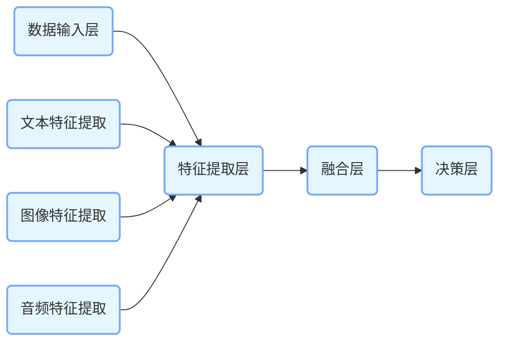

# 实现AI Agent的多模态知识融合

> 关键词：AI Agent、多模态知识融合、深度学习、计算机视觉、自然语言处理

> 摘要：本文聚焦于实现AI Agent的多模态知识融合这一核心主题。首先介绍了多模态知识融合在AI领域的背景和重要性，详细阐述了相关核心概念及其联系。接着深入探讨了实现多模态知识融合的核心算法原理，通过Python代码进行了具体操作步骤的说明，并给出了相应的数学模型和公式。在项目实战部分，提供了开发环境搭建的方法、源代码的详细实现及解读。此外，还列举了多模态知识融合的实际应用场景，推荐了相关的学习资源、开发工具框架以及论文著作。最后对未来发展趋势与挑战进行了总结，并提供了常见问题的解答和扩展阅读及参考资料，旨在为读者全面呈现AI Agent多模态知识融合的相关内容和技术要点。

## 1. 背景介绍 
### 1.1 目的和范围
多模态知识融合在当今人工智能领域具有至关重要的意义。随着技术的发展，单一模态的数据已经难以满足复杂任务的需求。AI Agent需要处理多种类型的数据，如文本、图像、音频等，以更全面、准确地理解和应对现实世界的问题。本文章的目的在于深入探讨如何实现AI Agent的多模态知识融合，涵盖从核心概念的讲解到具体算法的实现，再到实际项目的应用等多个方面。范围包括对常见多模态数据类型的融合方法，以及在不同应用场景下的实践案例分析。

### 1.2 预期读者
本文预期读者主要包括对人工智能、深度学习等领域感兴趣的科研人员、工程师和开发者。对于正在研究多模态学习、AI Agent相关课题的学生和研究人员，本文可以提供理论和实践的指导；对于从事相关技术开发的工程师和开发者，文章中的算法实现和项目实战部分将具有一定的参考价值。

### 1.3 文档结构概述
本文将按照以下结构进行阐述：首先介绍多模态知识融合的背景信息，包括目的、预期读者和文档结构等；接着详细讲解核心概念以及它们之间的联系，并通过文本示意图和Mermaid流程图进行直观展示；然后深入分析核心算法原理，结合Python代码说明具体操作步骤；再给出相关的数学模型和公式，并进行详细讲解和举例；之后通过项目实战部分，介绍开发环境搭建、源代码实现和代码解读；随后列举多模态知识融合的实际应用场景；接着推荐相关的学习资源、开发工具框架和论文著作；最后对未来发展趋势与挑战进行总结，并提供常见问题解答和扩展阅读及参考资料。

### 1.4 术语表
#### 1.4.1 核心术语定义
- **AI Agent**：人工智能代理，是一种能够感知环境、做出决策并采取行动以实现特定目标的智能实体。
- **多模态知识融合**：将来自不同模态（如文本、图像、音频等）的数据和知识进行整合，以获得更全面、准确的信息表示和理解。
- **模态**：指数据的不同类型或形式，如视觉模态（图像、视频）、听觉模态（音频）、语言模态（文本）等。

#### 1.4.2 相关概念解释
- **特征提取**：从原始数据中提取具有代表性的特征，以便后续处理和分析。例如，从图像中提取边缘、纹理等特征，从文本中提取关键词、词向量等特征。
- **融合策略**：用于将不同模态的特征进行整合的方法，常见的融合策略包括早期融合、晚期融合和混合融合等。

#### 1.4.3 缩略词列表
- **CNN**：Convolutional Neural Network，卷积神经网络，常用于图像和视频数据的特征提取。
- **RNN**：Recurrent Neural Network，循环神经网络，常用于处理序列数据，如文本和音频。
- **LSTM**：Long Short-Term Memory，长短期记忆网络，是一种特殊的RNN，能够有效处理长序列数据。

## 2. 核心概念与联系 

### 核心概念原理
多模态知识融合的核心在于将不同模态的数据所包含的信息进行整合，以获得更全面、准确的知识表示。不同模态的数据具有各自的特点和优势，例如文本数据能够提供详细的语义信息，图像数据能够直观地展示视觉特征，音频数据则包含了声音的特征。通过融合这些不同模态的数据，可以弥补单一模态数据的局限性，提高AI Agent对环境的理解和决策能力。

### 架构的文本示意图
多模态知识融合的架构通常包括以下几个主要部分：
1. **数据输入层**：接收来自不同模态的原始数据，如文本、图像、音频等。
2. **特征提取层**：对不同模态的原始数据进行特征提取，将其转换为适合后续处理的特征表示。
3. **融合层**：将不同模态的特征进行融合，得到统一的特征表示。
4. **决策层**：基于融合后的特征进行决策和推理，实现具体的任务目标，如分类、预测等。

### Mermaid流程图


## 3. 核心算法原理 & 具体操作步骤 

### 核心算法原理
在多模态知识融合中，常用的算法包括深度学习算法，如卷积神经网络（CNN）用于图像特征提取，循环神经网络（RNN）及其变体（如LSTM）用于文本和音频特征提取。下面以早期融合为例，介绍多模态知识融合的核心算法原理。

早期融合是指在特征提取阶段之前将不同模态的原始数据进行拼接，然后一起输入到一个统一的模型中进行特征提取和处理。具体步骤如下：
1. 对不同模态的原始数据进行预处理，使其具有相同的格式和维度。
2. 将预处理后的不同模态数据进行拼接，得到一个统一的输入数据。
3. 使用一个统一的模型（如深度神经网络）对拼接后的数据进行特征提取和处理。

### 具体操作步骤及Python源代码
以下是一个简单的示例，演示如何使用早期融合方法实现图像和文本数据的多模态知识融合。假设我们使用MNIST图像数据集和对应的文本标签作为示例数据。

```python
import numpy as np
import tensorflow as tf
from tensorflow.keras.datasets import mnist
from tensorflow.keras.models import Model
from tensorflow.keras.layers import Input, Dense, Flatten, Concatenate

# 加载MNIST数据集
(x_train, y_train), (x_test, y_test) = mnist.load_data()

# 图像数据预处理
x_train = x_train.reshape(-1, 28, 28, 1).astype('float32') / 255.0
x_test = x_test.reshape(-1, 28, 28, 1).astype('float32') / 255.0

# 文本数据生成（简单示例，将标签转换为独热编码）
y_train_text = tf.keras.utils.to_categorical(y_train, num_classes=10)
y_test_text = tf.keras.utils.to_categorical(y_test, num_classes=10)

# 定义图像输入层
image_input = Input(shape=(28, 28, 1))
image_flatten = Flatten()(image_input)

# 定义文本输入层
text_input = Input(shape=(10,))

# 拼接图像和文本特征
concatenated = Concatenate()([image_flatten, text_input])

# 定义全连接层
output = Dense(10, activation='softmax')(concatenated)

# 构建模型
model = Model(inputs=[image_input, text_input], outputs=output)

# 编译模型
model.compile(optimizer='adam', loss='categorical_crossentropy', metrics=['accuracy'])

# 训练模型
model.fit([x_train, y_train_text], tf.keras.utils.to_categorical(y_train, num_classes=10),
          epochs=5, batch_size=32, validation_data=([x_test, y_test_text], tf.keras.utils.to_categorical(y_test, num_classes=10)))
```

## 4. 数学模型和公式 & 详细讲解 & 举例说明 

### 数学模型和公式
在多模态知识融合中，我们可以使用向量空间模型来表示不同模态的数据。假设我们有两种模态的数据：图像数据 $\mathbf{X}_i$ 和文本数据 $\mathbf{X}_t$，它们分别可以表示为向量 $\mathbf{x}_i \in \mathbb{R}^{d_i}$ 和 $\mathbf{x}_t \in \mathbb{R}^{d_t}$，其中 $d_i$ 和 $d_t$ 分别是图像和文本数据的特征维度。

早期融合的数学模型可以表示为：
$$
\mathbf{x}_{fused} = \left[\begin{array}{c}
\mathbf{x}_i \\
\mathbf{x}_t
\end{array}\right] \in \mathbb{R}^{d_i + d_t}
$$
其中 $\mathbf{x}_{fused}$ 是融合后的特征向量。

在深度学习模型中，我们通常使用神经网络来对融合后的特征进行处理。假设我们有一个全连接层，其输入为 $\mathbf{x}_{fused}$，输出为 $\mathbf{y}$，则全连接层的数学公式可以表示为：
$$
\mathbf{y} = \sigma(\mathbf{W} \mathbf{x}_{fused} + \mathbf{b})
$$
其中 $\mathbf{W} \in \mathbb{R}^{k \times (d_i + d_t)}$ 是权重矩阵，$\mathbf{b} \in \mathbb{R}^{k}$ 是偏置向量，$\sigma$ 是激活函数（如sigmoid、ReLU等），$k$ 是输出的维度。

### 详细讲解
上述公式的含义是，首先将图像和文本特征向量进行拼接，得到一个更高维度的融合特征向量。然后，将融合特征向量输入到全连接层中，通过矩阵乘法和加法运算得到一个中间结果，最后通过激活函数进行非线性变换得到输出。

### 举例说明
假设我们有一个图像特征向量 $\mathbf{x}_i = [0.1, 0.2, 0.3]$，文本特征向量 $\mathbf{x}_t = [0.4, 0.5]$，则融合后的特征向量为：
$$
\mathbf{x}_{fused} = \left[\begin{array}{c}
0.1 \\
0.2 \\
0.3 \\
0.4 \\
0.5
\end{array}\right]
$$
假设我们有一个全连接层，其权重矩阵 $\mathbf{W} = \begin{bmatrix}
0.1 & 0.2 & 0.3 & 0.4 & 0.5 \\
0.6 & 0.7 & 0.8 & 0.9 & 1.0
\end{bmatrix}$，偏置向量 $\mathbf{b} = [0.1, 0.2]$，激活函数为ReLU，则：
$$
\mathbf{W} \mathbf{x}_{fused} + \mathbf{b} = \begin{bmatrix}
0.1 & 0.2 & 0.3 & 0.4 & 0.5 \\
0.6 & 0.7 & 0.8 & 0.9 & 1.0
\end{bmatrix} \left[\begin{array}{c}
0.1 \\
0.2 \\
0.3 \\
0.4 \\
0.5
\end{array}\right] + \left[\begin{array}{c}
0.1 \\
0.2
\end{array}\right] = \left[\begin{array}{c}
0.55 \\
1.6
\end{array}\right]
$$
经过ReLU激活函数处理后，输出为：
$$
\mathbf{y} = \left[\begin{array}{c}
\max(0, 0.55) \\
\max(0, 1.6)
\end{array}\right] = \left[\begin{array}{c}
0.55 \\
1.6
\end{array}\right]
$$

## 5. 项目实战：代码实际案例和详细解释说明 

### 5.1  开发环境搭建
为了实现AI Agent的多模态知识融合，我们需要搭建相应的开发环境。以下是具体的搭建步骤：

#### 安装Python
首先，确保你已经安装了Python 3.x版本。可以从Python官方网站（https://www.python.org/downloads/）下载并安装适合你操作系统的Python版本。

#### 安装深度学习框架
我们将使用TensorFlow作为深度学习框架。可以使用以下命令安装TensorFlow：
```bash
pip install tensorflow
```

#### 安装其他依赖库
还需要安装一些其他的依赖库，如NumPy、Pandas等。可以使用以下命令进行安装：
```bash
pip install numpy pandas
```

### 5.2  源代码详细实现和代码解读
以下是一个更完整的项目实战示例，实现图像和文本数据的多模态知识融合，用于图像分类任务。

```python
import numpy as np
import tensorflow as tf
from tensorflow.keras.datasets import cifar10
from tensorflow.keras.models import Model
from tensorflow.keras.layers import Input, Dense, Flatten, Conv2D, MaxPooling2D, Concatenate
from tensorflow.keras.utils import to_categorical

# 加载CIFAR-10数据集
(x_train, y_train), (x_test, y_test) = cifar10.load_data()

# 图像数据预处理
x_train = x_train.astype('float32') / 255.0
x_test = x_test.astype('float32') / 255.0

# 文本数据生成（简单示例，将标签转换为独热编码）
y_train_text = to_categorical(y_train, num_classes=10)
y_test_text = to_categorical(y_test, num_classes=10)

# 定义图像输入层
image_input = Input(shape=(32, 32, 3))
# 构建图像特征提取网络
conv1 = Conv2D(32, (3, 3), activation='relu')(image_input)
pool1 = MaxPooling2D((2, 2))(conv1)
conv2 = Conv2D(64, (3, 3), activation='relu')(pool1)
pool2 = MaxPooling2D((2, 2))(conv2)
image_flatten = Flatten()(pool2)

# 定义文本输入层
text_input = Input(shape=(10,))

# 拼接图像和文本特征
concatenated = Concatenate()([image_flatten, text_input])

# 定义全连接层
hidden = Dense(128, activation='relu')(concatenated)
output = Dense(10, activation='softmax')(hidden)

# 构建模型
model = Model(inputs=[image_input, text_input], outputs=output)

# 编译模型
model.compile(optimizer='adam', loss='categorical_crossentropy', metrics=['accuracy'])

# 训练模型
model.fit([x_train, y_train_text], to_categorical(y_train, num_classes=10),
          epochs=10, batch_size=32, validation_data=([x_test, y_test_text], to_categorical(y_test, num_classes=10)))
```

### 代码解读与分析
1. **数据加载和预处理**：使用`cifar10.load_data()`加载CIFAR-10数据集，并将图像数据进行归一化处理。同时，将标签转换为独热编码作为文本数据的简单示例。
2. **图像特征提取网络**：使用卷积神经网络（CNN）对图像数据进行特征提取。通过卷积层和池化层逐步提取图像的特征，最后将特征图展平为一维向量。
3. **文本输入层**：定义文本输入层，接收独热编码的文本数据。
4. **特征融合**：使用`Concatenate`层将图像特征向量和文本特征向量进行拼接，得到融合后的特征向量。
5. **全连接层**：构建全连接层，对融合后的特征向量进行进一步处理，并使用softmax激活函数输出分类结果。
6. **模型编译和训练**：使用`adam`优化器和`categorical_crossentropy`损失函数编译模型，并进行训练。

## 6. 实际应用场景 
AI Agent的多模态知识融合在许多实际应用场景中都有广泛的应用，以下是一些常见的应用场景：

### 智能安防
在智能安防系统中，AI Agent可以融合视频监控数据（视觉模态）和传感器数据（如声音、温度等）来实现更准确的安全监测。例如，通过分析视频中的人员行为和声音信息，可以及时发现异常情况并发出警报。

### 智能医疗
在智能医疗领域，多模态知识融合可以将医学影像（如X光、CT等）和病历文本信息进行融合，帮助医生更准确地进行疾病诊断和治疗方案制定。例如，结合影像中的病变特征和病历中的症状描述，可以提高疾病诊断的准确性。

### 智能客服
智能客服系统可以融合用户的语音输入（听觉模态）和文本输入（语言模态），更好地理解用户的需求并提供准确的回答。例如，当用户通过语音提出问题时，系统可以同时分析语音内容和之前的文本对话历史，提供更个性化的服务。

### 自动驾驶
在自动驾驶领域，AI Agent需要融合多种传感器数据，如摄像头图像（视觉模态）、激光雷达数据（距离信息）和毫米波雷达数据（速度信息），以实现准确的环境感知和决策。例如，通过融合不同传感器的数据，可以更准确地识别道路、障碍物和其他车辆，提高自动驾驶的安全性。

## 7. 工具和资源推荐
### 7.1 学习资源推荐
#### 7.1.1 书籍推荐
- 《深度学习》（Deep Learning）：由Ian Goodfellow、Yoshua Bengio和Aaron Courville所著，是深度学习领域的经典教材，涵盖了深度学习的基本原理、算法和应用。
- 《Python深度学习》（Deep Learning with Python）：由Francois Chollet所著，介绍了如何使用Python和Keras库进行深度学习开发，适合初学者入门。
- 《多模态机器学习：基础与应用》（Multimodal Machine Learning: Foundations and Applications）：全面介绍了多模态机器学习的理论和方法，包括多模态数据处理、特征融合和模型构建等方面。

#### 7.1.2 在线课程
- Coursera上的“深度学习专项课程”（Deep Learning Specialization）：由Andrew Ng教授主讲，涵盖了深度学习的各个方面，包括神经网络、卷积神经网络、循环神经网络等。
- edX上的“人工智能基础”（Introduction to Artificial Intelligence）：介绍了人工智能的基本概念、算法和应用，适合初学者了解人工智能的全貌。
- Udemy上的“多模态机器学习实战”（Multimodal Machine Learning in Practice）：通过实际项目案例，讲解了多模态机器学习的实现方法和技巧。

#### 7.1.3 技术博客和网站
- Medium：是一个技术博客平台，上面有许多关于人工智能、深度学习和多模态学习的优秀文章。
- arXiv：是一个预印本服务器，提供了大量最新的学术论文，包括多模态学习领域的研究成果。
- Towards Data Science：是一个专注于数据科学和机器学习的技术博客，有许多关于多模态知识融合的实践经验分享。

### 7.2 开发工具框架推荐
#### 7.2.1 IDE和编辑器
- PyCharm：是一款专业的Python集成开发环境，提供了丰富的代码编辑、调试和项目管理功能。
- Jupyter Notebook：是一个交互式的开发环境，适合进行数据分析、模型训练和实验验证。
- Visual Studio Code：是一款轻量级的代码编辑器，支持多种编程语言和插件扩展，可用于Python开发。

#### 7.2.2 调试和性能分析工具
- TensorBoard：是TensorFlow提供的可视化工具，可以用于监控模型训练过程、可视化模型结构和分析性能指标。
- Py-Spy：是一个Python性能分析工具，可以帮助开发者找出代码中的性能瓶颈。
- NVIDIA Nsight Systems：是NVIDIA提供的性能分析工具，可用于GPU加速的深度学习模型的性能优化。

#### 7.2.3 相关框架和库
- TensorFlow：是一个开源的深度学习框架，提供了丰富的神经网络模型和工具，支持多模态数据处理和模型训练。
- PyTorch：是另一个流行的深度学习框架，具有动态图机制，适合快速原型开发和研究。
- scikit-learn：是一个常用的机器学习库，提供了多种机器学习算法和工具，可用于数据预处理、特征提取和模型评估。

### 7.3 相关论文著作推荐
#### 7.3.1 经典论文
- "Multimodal Machine Learning: A Survey and Taxonomy"：对多模态机器学习的研究进行了全面的综述和分类，介绍了多模态数据处理、特征融合和模型构建等方面的方法。
- "Deep Multimodal Learning: A Survey on Recent Advances"：综述了深度学习在多模态学习中的应用，包括多模态深度神经网络的架构设计和训练方法。
- "Fusion of Heterogeneous Data Sources in Machine Learning: A Survey"：探讨了机器学习中异构数据源融合的方法和挑战，对多模态知识融合有一定的参考价值。

#### 7.3.2 最新研究成果
- 关注arXiv上关于多模态学习的最新论文，了解该领域的最新研究动态和技术进展。
- 参加国际学术会议，如CVPR（计算机视觉与模式识别会议）、ICML（国际机器学习会议）和ACL（计算语言学协会会议）等，获取最新的研究成果和前沿技术。

#### 7.3.3 应用案例分析
- 查阅相关的行业报告和研究论文，了解多模态知识融合在智能安防、智能医疗、智能客服等领域的实际应用案例和效果评估。
- 分析开源项目和竞赛中的多模态学习案例，学习他人的实践经验和技巧。

## 8. 总结：未来发展趋势与挑战
### 未来发展趋势
- **更复杂的多模态融合方法**：未来的研究将致力于开发更复杂、更有效的多模态融合方法，以更好地处理不同模态数据之间的复杂关系和相互作用。例如，探索基于注意力机制的多模态融合方法，能够自适应地分配不同模态数据的权重。
- **跨领域应用拓展**：多模态知识融合将在更多的领域得到应用，如教育、金融、娱乐等。例如，在教育领域，融合视频教学、文本教材和学生反馈等多模态数据，实现个性化的学习方案推荐。
- **与其他技术的融合**：多模态知识融合将与其他技术，如区块链、物联网等进行深度融合。例如，结合物联网的传感器数据和多模态知识融合技术，实现更智能的城市管理和工业自动化。

### 挑战
- **数据的多样性和复杂性**：不同模态的数据具有不同的特点和格式，如何有效地处理和融合这些多样化的数据是一个挑战。例如，图像数据和文本数据的特征维度和分布差异很大，需要开发专门的方法来进行处理。
- **计算资源和效率**：多模态知识融合通常需要处理大量的数据，对计算资源的要求较高。如何在有限的计算资源下提高融合效率是一个亟待解决的问题。
- **模型的可解释性**：深度学习模型在多模态知识融合中取得了很好的效果，但这些模型通常是黑盒模型，缺乏可解释性。如何提高模型的可解释性，让用户更好地理解模型的决策过程是一个重要的挑战。

## 9. 附录：常见问题与解答
### 问题1：多模态知识融合和单模态学习有什么区别？
解答：单模态学习只使用一种类型的数据进行学习，而多模态知识融合则是将多种不同模态的数据进行整合，以获得更全面、准确的信息表示和理解。多模态知识融合可以弥补单一模态数据的局限性，提高模型的性能和泛化能力。

### 问题2：如何选择合适的融合策略？
解答：选择合适的融合策略需要考虑数据的特点、任务的需求和模型的结构等因素。早期融合适用于不同模态数据之间存在较强相关性的情况；晚期融合则适用于不同模态数据之间相关性较弱的情况；混合融合结合了早期融合和晚期融合的优点，可以根据具体情况进行选择。

### 问题3：多模态知识融合对数据质量有什么要求？
解答：多模态知识融合对数据质量有较高的要求。不同模态的数据需要具有一致性和准确性，并且需要进行适当的预处理，如归一化、降噪等。此外，数据的标注质量也会影响融合的效果，需要确保标注的准确性和一致性。

### 问题4：如何评估多模态知识融合模型的性能？
解答：可以使用多种指标来评估多模态知识融合模型的性能，如准确率、召回率、F1值等。此外，还可以使用可视化方法来直观地展示模型的决策过程和融合效果。同时，需要在不同的数据集和任务上进行评估，以确保模型的泛化能力。

## 10. 扩展阅读 & 参考资料
### 扩展阅读
- 《人工智能：现代方法》（Artificial Intelligence: A Modern Approach）：全面介绍了人工智能的基本概念、算法和应用，是人工智能领域的经典教材。
- 《计算机视觉：算法与应用》（Computer Vision: Algorithms and Applications）：详细介绍了计算机视觉的基本算法和应用，包括图像特征提取、目标检测和图像分割等方面。
- 《自然语言处理入门》（Natural Language Processing with Python）：介绍了自然语言处理的基本概念和方法，包括文本分类、情感分析和机器翻译等方面。

### 参考资料
- 相关学术论文和研究报告，如IEEE Transactions on Pattern Analysis and Machine Intelligence、ACM Transactions on Intelligent Systems and Technology等期刊上的论文。
- 开源项目和代码库，如GitHub上的多模态学习相关项目。
- 官方文档和教程，如TensorFlow、PyTorch等深度学习框架的官方文档和教程。

作者：AI天才研究院/AI Genius Institute & 禅与计算机程序设计艺术 /Zen And The Art of Computer Programming