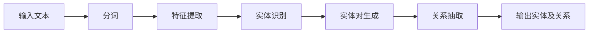

# 实现AI Agent的实体识别与关系抽取

> 关键词：AI Agent、实体识别、关系抽取、自然语言处理、深度学习

> 摘要：本文围绕实现AI Agent的实体识别与关系抽取展开深入探讨。首先介绍了相关背景，包括目的范围、预期读者等内容。接着阐述了核心概念及联系，给出了原理和架构的文本示意图与Mermaid流程图。详细讲解了核心算法原理，通过Python源代码进行阐述，还给出了数学模型和公式并举例说明。以实际项目为案例，介绍了开发环境搭建、源代码实现及代码解读。分析了实体识别与关系抽取在多个领域的实际应用场景，推荐了学习资源、开发工具框架以及相关论文著作。最后总结了未来发展趋势与挑战，提供了常见问题解答和扩展阅读参考资料，旨在为相关技术人员提供全面且深入的技术指导。

## 1. 背景介绍 
### 1.1 目的和范围
实体识别与关系抽取是自然语言处理（NLP）中的关键任务，对于AI Agent而言，准确地识别文本中的实体以及它们之间的关系至关重要。本文的目的在于详细阐述如何实现AI Agent的实体识别与关系抽取功能，涵盖从基础概念到具体算法实现，再到实际项目应用的整个流程。范围包括主流的算法原理、开发环境搭建、代码实现以及相关工具和资源的推荐。

### 1.2 预期读者
本文预期读者为对自然语言处理、人工智能领域感兴趣的技术人员，包括但不限于程序员、软件架构师、数据科学家等。对于有一定编程基础，希望深入了解实体识别与关系抽取技术的人员也具有很高的参考价值。

### 1.3 文档结构概述
本文将按照以下结构进行组织：首先介绍核心概念与联系，包括实体识别和关系抽取的原理及架构；接着详细讲解核心算法原理，并给出Python源代码示例；然后介绍相关的数学模型和公式，并举例说明；之后通过一个实际项目案例，介绍开发环境搭建、源代码实现和代码解读；分析实际应用场景；推荐相关的工具和资源；总结未来发展趋势与挑战；提供常见问题解答和扩展阅读参考资料。

### 1.4 术语表
#### 1.4.1 核心术语定义
- **AI Agent**：人工智能代理，是一种能够感知环境、做出决策并采取行动以实现特定目标的软件或硬件系统。
- **实体识别（Named Entity Recognition，NER）**：是指从文本中识别出具有特定意义的实体，如人名、地名、组织机构名等。
- **关系抽取（Relation Extraction）**：是指从文本中识别出实体之间的语义关系，如“张三是李四的父亲”中“张三”和“李四”之间的“父子”关系。

#### 1.4.2 相关概念解释
- **自然语言处理（Natural Language Processing，NLP）**：是一门研究如何让计算机理解、处理和生成人类语言的学科，实体识别与关系抽取是其重要的子任务。
- **深度学习（Deep Learning）**：是一种基于人工神经网络的机器学习方法，在实体识别与关系抽取任务中取得了很好的效果。

#### 1.4.3 缩略词列表
- **NER**：Named Entity Recognition（实体识别）
- **RE**：Relation Extraction（关系抽取）
- **NLP**：Natural Language Processing（自然语言处理）
- **RNN**：Recurrent Neural Network（循环神经网络）
- **LSTM**：Long Short-Term Memory（长短期记忆网络）
- **GRU**：Gated Recurrent Unit（门控循环单元）
- **BERT**：Bidirectional Encoder Representations from Transformers（基于变换器的双向编码器表示）

## 2. 核心概念与联系 
### 实体识别原理
实体识别的目标是将文本中的每个词标记为相应的实体类别或非实体类别。常见的实体类别包括人名（PER）、地名（LOC）、组织机构名（ORG）等。例如，在句子“张三去了北京”中，“张三”应被标记为PER，“北京”应被标记为LOC。

### 关系抽取原理
关系抽取的任务是在已经识别出实体的基础上，判断实体之间的关系。通常需要先确定实体对，然后对每个实体对进行分类，判断它们之间的关系类型。例如，在句子“苹果公司由乔布斯创立”中，“苹果公司”和“乔布斯”是一个实体对，它们之间的关系是“创立者”。

### 架构的文本示意图
```plaintext
输入文本 -> 分词 -> 特征提取 -> 实体识别 -> 实体对生成 -> 关系抽取 -> 输出实体及关系
```

### Mermaid流程图


## 3. 核心算法原理 & 具体操作步骤 
### 基于深度学习的实体识别算法
一种常用的实体识别算法是基于双向长短期记忆网络（BiLSTM）和条件随机场（CRF）的模型。以下是使用Python和PyTorch实现的示例代码：

```python
import torch
import torch.nn as nn
import torch.optim as optim
from torch.utils.data import Dataset, DataLoader

# 定义数据集类
class NERDataset(Dataset):
    def __init__(self, texts, labels):
        self.texts = texts
        self.labels = labels

    def __len__(self):
        return len(self.texts)

    def __getitem__(self, idx):
        text = self.texts[idx]
        label = self.labels[idx]
        return text, label

# 定义BiLSTM-CRF模型
class BiLSTM_CRF(nn.Module):
    def __init__(self, vocab_size, embedding_dim, hidden_dim, tag_to_ix):
        super(BiLSTM_CRF, self).__init__()
        self.embedding = nn.Embedding(vocab_size, embedding_dim)
        self.lstm = nn.LSTM(embedding_dim, hidden_dim // 2,
                            num_layers=1, bidirectional=True)
        self.hidden2tag = nn.Linear(hidden_dim, len(tag_to_ix))
        self.transitions = nn.Parameter(
            torch.randn(len(tag_to_ix), len(tag_to_ix)))
        self.tag_to_ix = tag_to_ix
        self.ix_to_tag = {v: k for k, v in tag_to_ix.items()}

    def _forward_alg(self, feats):
        # 前向算法计算分区函数
        init_alphas = torch.full((1, len(self.tag_to_ix)), -10000.)
        init_alphas[0][self.tag_to_ix["<START>"]] = 0.
        forward_var = init_alphas
        for feat in feats:
            alphas_t = []
            for next_tag in range(len(self.tag_to_ix)):
                emit_score = feat[next_tag].view(
                    1, -1).expand(1, len(self.tag_to_ix))
                trans_score = self.transitions[next_tag].view(1, -1)
                next_tag_var = forward_var + trans_score + emit_score
                alphas_t.append(log_sum_exp(next_tag_var).view(1))
            forward_var = torch.cat(alphas_t).view(1, -1)
        terminal_var = forward_var + self.transitions[self.tag_to_ix["<STOP>"]]
        alpha = log_sum_exp(terminal_var)
        return alpha

    def _get_lstm_features(self, sentence):
        embeds = self.embedding(sentence).view(len(sentence), 1, -1)
        lstm_out, _ = self.lstm(embeds)
        lstm_out = lstm_out.view(len(sentence), self.hidden_dim)
        lstm_feats = self.hidden2tag(lstm_out)
        return lstm_feats

    def _score_sentence(self, feats, tags):
        # 计算给定标签序列的得分
        score = torch.zeros(1)
        tags = torch.cat([torch.tensor([self.tag_to_ix["<START>"]], dtype=torch.long), tags])
        for i, feat in enumerate(feats):
            score = score + \
                    self.transitions[tags[i + 1], tags[i]] + feat[tags[i + 1]]
        score = score + self.transitions[self.tag_to_ix["<STOP>"], tags[-1]]
        return score

    def _viterbi_decode(self, feats):
        backpointers = []
        init_vvars = torch.full((1, len(self.tag_to_ix)), -10000.)
        init_vvars[0][self.tag_to_ix["<START>"]] = 0
        forward_var = init_vvars
        for feat in feats:
            bptrs_t = []
            viterbivars_t = []
            for next_tag in range(len(self.tag_to_ix)):
                next_tag_var = forward_var + self.transitions[next_tag]
                best_tag_id = argmax(next_tag_var)
                bptrs_t.append(best_tag_id)
                viterbivars_t.append(next_tag_var[0][best_tag_id].view(1))
            forward_var = (torch.cat(viterbivars_t) + feat).view(1, -1)
            backpointers.append(bptrs_t)
        terminal_var = forward_var + self.transitions[self.tag_to_ix["<STOP>"]]
        best_tag_id = argmax(terminal_var)
        path_score = terminal_var[0][best_tag_id]
        best_path = [best_tag_id]
        for bptrs_t in reversed(backpointers):
            best_tag_id = bptrs_t[best_tag_id]
            best_path.append(best_tag_id)
        start = best_path.pop()
        assert start == self.tag_to_ix["<START>"]
        best_path.reverse()
        return path_score, best_path

    def neg_log_likelihood(self, sentence, tags):
        feats = self._get_lstm_features(sentence)
        forward_score = self._forward_alg(feats)
        gold_score = self._score_sentence(feats, tags)
        return forward_score - gold_score

    def forward(self, sentence):
        lstm_feats = self._get_lstm_features(sentence)
        score, tag_seq = self._viterbi_decode(lstm_feats)
        return tag_seq

def argmax(vec):
    _, idx = torch.max(vec, 1)
    return idx.item()

def log_sum_exp(vec):
    max_score = vec[0, argmax(vec)]
    return max_score + \
           torch.log(torch.sum(torch.exp(vec - max_score)))

# 示例数据
training_data = [
    ("the wall street journal reported today that apple corporation made money".split(),
     "B-ORG I-ORG I-ORG O O O B-ORG O O".split())
]

# 构建词汇表和标签表
word_to_ix = {}
tag_to_ix = {"B-ORG": 0, "I-ORG": 1, "O": 2, "<START>": 3, "<STOP>": 4}
for sent, tags in training_data:
    for word in sent:
        if word not in word_to_ix:
            word_to_ix[word] = len(word_to_ix)

# 创建数据集和数据加载器
texts = [[word_to_ix[word] for word in sent] for sent, _ in training_data]
labels = [[tag_to_ix[tag] for tag in tags] for _, tags in training_data]
dataset = NERDataset(texts, labels)
dataloader = DataLoader(dataset, batch_size=1, shuffle=True)

# 初始化模型、优化器和损失函数
model = BiLSTM_CRF(len(word_to_ix), 5, 4, tag_to_ix)
optimizer = optim.SGD(model.parameters(), lr=0.01, weight_decay=1e-4)

# 训练模型
for epoch in range(300):
    for text, label in dataloader:
        model.zero_grad()
        text = text.squeeze(0)
        label = label.squeeze(0)
        loss = model.neg_log_likelihood(text, label)
        loss.backward()
        optimizer.step()

# 测试模型
with torch.no_grad():
    precheck_sent = torch.tensor([word_to_ix[t] for t in training_data[0][0]], dtype=torch.long)
    print(model(precheck_sent))
```

### 基于注意力机制的关系抽取算法
关系抽取可以使用基于注意力机制的模型，以下是一个简单的示例代码：

```python
import torch
import torch.nn as nn
import torch.optim as optim

# 定义关系抽取模型
class RelationExtractionModel(nn.Module):
    def __init__(self, vocab_size, embedding_dim, hidden_dim, num_relations):
        super(RelationExtractionModel, self).__init__()
        self.embedding = nn.Embedding(vocab_size, embedding_dim)
        self.lstm = nn.LSTM(embedding_dim, hidden_dim, num_layers=1, bidirectional=True)
        self.attention = nn.Linear(2 * hidden_dim, 1)
        self.fc = nn.Linear(2 * hidden_dim, num_relations)

    def forward(self, sentence, entity_positions):
        embeds = self.embedding(sentence).view(len(sentence), 1, -1)
        lstm_out, _ = self.lstm(embeds)
        lstm_out = lstm_out.view(len(sentence), 2 * self.hidden_dim)

        attn_weights = torch.softmax(self.attention(lstm_out), dim=0)
        weighted_sum = torch.sum(attn_weights * lstm_out, dim=0)

        entity_1 = lstm_out[entity_positions[0]]
        entity_2 = lstm_out[entity_positions[1]]
        combined = torch.cat((entity_1, entity_2), dim=0)

        output = self.fc(combined)
        return output

# 示例数据
vocab_size = 100
embedding_dim = 20
hidden_dim = 30
num_relations = 5
model = RelationExtractionModel(vocab_size, embedding_dim, hidden_dim, num_relations)
sentence = torch.randint(0, vocab_size, (10,))
entity_positions = [2, 5]
output = model(sentence, entity_positions)
print(output)
```

### 具体操作步骤
1. **数据预处理**：对输入文本进行分词、标注等处理，构建词汇表和标签表。
2. **模型训练**：使用训练数据对实体识别和关系抽取模型进行训练，调整模型参数。
3. **模型评估**：使用测试数据对训练好的模型进行评估，计算准确率、召回率等指标。
4. **模型应用**：将训练好的模型应用到实际任务中，对新的文本进行实体识别和关系抽取。

## 4. 数学模型和公式 & 详细讲解 & 举例说明 
### 实体识别的数学模型
#### 条件随机场（CRF）
条件随机场是一种用于序列标注的概率图模型，在实体识别中常用于对标记序列进行建模。给定输入序列 $x = (x_1, x_2, \cdots, x_n)$ 和标记序列 $y = (y_1, y_2, \cdots, y_n)$，CRF模型的条件概率为：

$$P(y|x) = \frac{1}{Z(x)} \exp \left( \sum_{i=1}^{n} \sum_{k=1}^{K} \lambda_k f_k(y_{i-1}, y_i, x, i) \right)$$

其中，$Z(x)$ 是归一化因子，定义为：

$$Z(x) = \sum_{y'} \exp \left( \sum_{i=1}^{n} \sum_{k=1}^{K} \lambda_k f_k(y_{i-1}', y_i', x, i) \right)$$

$f_k(y_{i-1}, y_i, x, i)$ 是特征函数，$\lambda_k$ 是对应的权重。

#### 举例说明
假设我们有一个简单的句子 “John lives in New York”，我们要对其进行实体识别。特征函数可以定义为：

- $f_1(y_{i-1}, y_i, x, i)$：如果 $y_i$ 是 “PER”（人名）且 $x_i$ 以大写字母开头，则返回 1，否则返回 0。
- $f_2(y_{i-1}, y_i, x, i)$：如果 $y_i$ 是 “LOC”（地名）且 $x_i$ 是 “New” 或 “York”，则返回 1，否则返回 0。

通过训练，我们可以学习到这些特征函数的权重 $\lambda_k$，从而计算出每个可能的标记序列的概率，选择概率最大的标记序列作为最终结果。

### 关系抽取的数学模型
#### 基于注意力机制的模型
在基于注意力机制的关系抽取模型中，注意力机制用于计算输入序列中每个词的重要性。假设输入序列为 $h = (h_1, h_2, \cdots, h_n)$，注意力权重计算如下：

$$\alpha_i = \frac{\exp(e_i)}{\sum_{j=1}^{n} \exp(e_j)}$$

其中，$e_i$ 是第 $i$ 个词的注意力得分，通常通过一个线性变换计算得到：

$$e_i = \mathbf{w}^T \tanh(\mathbf{W} h_i + \mathbf{b})$$

$\mathbf{w}$、$\mathbf{W}$ 和 $\mathbf{b}$ 是可学习的参数。

#### 举例说明
假设我们有一个句子 “Apple was founded by Steve Jobs”，我们要抽取 “Apple” 和 “Steve Jobs” 之间的关系。通过注意力机制，我们可以计算出每个词在确定这两个实体之间关系时的重要性。例如，“founded” 这个词的注意力权重可能会比较高，因为它对表达 “创立” 关系起到了关键作用。

## 5. 项目实战：代码实际案例和详细解释说明 
### 5.1  开发环境搭建
#### 安装Python和相关库
首先，确保你已经安装了Python 3.x。然后，使用以下命令安装所需的库：

```bash
pip install torch
pip install numpy
```

#### 准备数据集
可以使用公开的实体识别和关系抽取数据集，如CoNLL-2003、ACE 2005等。将数据集下载到本地，并进行必要的预处理。

### 5.2  源代码详细实现和代码解读
#### 实体识别部分
我们使用之前实现的BiLSTM-CRF模型。以下是对代码的详细解读：

```python
# 定义数据集类
class NERDataset(Dataset):
    def __init__(self, texts, labels):
        self.texts = texts
        self.labels = labels

    def __len__(self):
        return len(self.texts)

    def __getitem__(self, idx):
        text = self.texts[idx]
        label = self.labels[idx]
        return text, label
```
这个类用于封装数据集，方便后续的数据加载和处理。

```python
# 定义BiLSTM-CRF模型
class BiLSTM_CRF(nn.Module):
    def __init__(self, vocab_size, embedding_dim, hidden_dim, tag_to_ix):
        super(BiLSTM_CRF, self).__init__()
        self.embedding = nn.Embedding(vocab_size, embedding_dim)
        self.lstm = nn.LSTM(embedding_dim, hidden_dim // 2,
                            num_layers=1, bidirectional=True)
        self.hidden2tag = nn.Linear(hidden_dim, len(tag_to_ix))
        self.transitions = nn.Parameter(
            torch.randn(len(tag_to_ix), len(tag_to_ix)))
        self.tag_to_ix = tag_to_ix
        self.ix_to_tag = {v: k for k, v in tag_to_ix.items()}
```
这个类定义了BiLSTM-CRF模型的结构，包括嵌入层、双向LSTM层、线性层和转移矩阵。

```python
# 训练模型
for epoch in range(300):
    for text, label in dataloader:
        model.zero_grad()
        text = text.squeeze(0)
        label = label.squeeze(0)
        loss = model.neg_log_likelihood(text, label)
        loss.backward()
        optimizer.step()
```
这部分代码用于训练模型，通过多次迭代更新模型参数，最小化损失函数。

#### 关系抽取部分
```python
# 定义关系抽取模型
class RelationExtractionModel(nn.Module):
    def __init__(self, vocab_size, embedding_dim, hidden_dim, num_relations):
        super(RelationExtractionModel, self).__init__()
        self.embedding = nn.Embedding(vocab_size, embedding_dim)
        self.lstm = nn.LSTM(embedding_dim, hidden_dim, num_layers=1, bidirectional=True)
        self.attention = nn.Linear(2 * hidden_dim, 1)
        self.fc = nn.Linear(2 * hidden_dim, num_relations)

    def forward(self, sentence, entity_positions):
        embeds = self.embedding(sentence).view(len(sentence), 1, -1)
        lstm_out, _ = self.lstm(embeds)
        lstm_out = lstm_out.view(len(sentence), 2 * self.hidden_dim)

        attn_weights = torch.softmax(self.attention(lstm_out), dim=0)
        weighted_sum = torch.sum(attn_weights * lstm_out, dim=0)

        entity_1 = lstm_out[entity_positions[0]]
        entity_2 = lstm_out[entity_positions[1]]
        combined = torch.cat((entity_1, entity_2), dim=0)

        output = self.fc(combined)
        return output
```
这个类定义了基于注意力机制的关系抽取模型，包括嵌入层、双向LSTM层、注意力层和全连接层。

### 5.3  代码解读与分析
#### 实体识别代码分析
- **数据集类**：通过继承 `torch.utils.data.Dataset` 类，我们可以方便地对数据集进行封装和管理。
- **BiLSTM-CRF模型**：使用双向LSTM层提取文本特征，然后通过CRF层进行序列标注。CRF层的转移矩阵可以学习到标记之间的依赖关系，提高实体识别的准确率。
- **训练过程**：使用负对数似然损失函数，通过反向传播更新模型参数。

#### 关系抽取代码分析
- **模型结构**：使用双向LSTM层提取文本特征，通过注意力机制计算每个词的重要性，然后将实体的特征向量拼接起来，通过全连接层进行关系分类。
- **注意力机制**：注意力机制可以帮助模型聚焦于与实体关系相关的词，提高关系抽取的性能。

## 6. 实际应用场景 
### 信息检索
在信息检索系统中，实体识别与关系抽取可以帮助提高检索的准确性。例如，用户查询 “苹果公司的创始人是谁”，系统可以通过实体识别识别出 “苹果公司” 这个实体，通过关系抽取找出与之相关的 “创始人” 关系，从而准确地返回答案。

### 知识图谱构建
知识图谱是一种以图的形式表示知识的方法，实体识别与关系抽取是构建知识图谱的关键步骤。通过从文本中识别实体和关系，可以将这些信息添加到知识图谱中，丰富知识图谱的内容。

### 智能客服
在智能客服系统中，实体识别与关系抽取可以帮助理解用户的问题。例如，用户询问 “我在你们这里买的手机坏了怎么办”，系统可以通过实体识别识别出 “手机” 这个实体，通过关系抽取理解用户与手机之间的 “购买” 关系，从而更准确地为用户提供解决方案。

### 金融风控
在金融风控领域，实体识别与关系抽取可以用于分析企业之间的关联关系、人物之间的关系等。例如，通过分析企业之间的股权关系、高管任职关系等，可以发现潜在的风险。

## 7. 工具和资源推荐
### 7.1 学习资源推荐
#### 7.1.1 书籍推荐
- 《自然语言处理入门》：这本书适合初学者，详细介绍了自然语言处理的基本概念和方法，包括实体识别和关系抽取。
- 《深度学习》：由Ian Goodfellow、Yoshua Bengio和Aaron Courville合著，是深度学习领域的经典教材，对理解深度学习模型在实体识别和关系抽取中的应用有很大帮助。

#### 7.1.2 在线课程
- Coursera上的 “Natural Language Processing Specialization”：由斯坦福大学的教授授课，涵盖了自然语言处理的多个方面，包括实体识别和关系抽取。
- edX上的 “Deep Learning for Natural Language Processing”：介绍了深度学习在自然语言处理中的应用，包括相关的算法和模型。

#### 7.1.3 技术博客和网站
- 博客园：有很多自然语言处理领域的技术博客，分享了实体识别和关系抽取的最新研究成果和实践经验。
- arXiv：是一个预印本服务器，提供了大量的自然语言处理相关的研究论文。

### 7.2 开发工具框架推荐
#### 7.2.1 IDE和编辑器
- PyCharm：是一款专门为Python开发设计的集成开发环境，提供了丰富的代码编辑、调试和项目管理功能。
- Jupyter Notebook：是一个交互式的开发环境，适合进行数据分析和模型实验。

#### 7.2.2 调试和性能分析工具
- TensorBoard：是TensorFlow提供的可视化工具，可以用于可视化模型的训练过程和性能指标。
- PyTorch Profiler：可以帮助分析PyTorch模型的性能瓶颈，优化模型的运行效率。

#### 7.2.3 相关框架和库
- NLTK（Natural Language Toolkit）：是一个Python库，提供了丰富的自然语言处理工具和数据集，方便进行实体识别和关系抽取的实验。
- SpaCy：是一个高效的自然语言处理库，支持多种语言的实体识别和关系抽取任务。

### 7.3 相关论文著作推荐
#### 7.3.1 经典论文
- “Bidirectional LSTM-CRF Models for Sequence Tagging”：介绍了BiLSTM-CRF模型在序列标注任务中的应用，是实体识别领域的经典论文。
- “Attention Is All You Need”：提出了Transformer模型，为自然语言处理领域带来了革命性的变化，也被广泛应用于关系抽取任务中。

#### 7.3.2 最新研究成果
- 可以关注ACL（Association for Computational Linguistics）、EMNLP（Conference on Empirical Methods in Natural Language Processing）等自然语言处理领域的顶级会议，了解最新的研究成果。

#### 7.3.3 应用案例分析
- 《自然语言处理实战：基于Scikit-Learn、Keras和TensorFlow》：这本书包含了多个自然语言处理的应用案例，包括实体识别和关系抽取的案例分析。

## 8. 总结：未来发展趋势与挑战
### 未来发展趋势
#### 多模态融合
未来的实体识别与关系抽取将不仅仅局限于文本数据，还会融合图像、语音等多模态数据。例如，在一个视频中，通过结合视频中的图像、语音和字幕信息，更准确地识别实体和关系。

#### 无监督和少监督学习
目前的实体识别与关系抽取方法大多依赖于大量的标注数据，而标注数据的成本较高。未来，无监督和少监督学习方法将得到更多的关注，通过利用未标注数据和少量标注数据进行模型训练。

#### 知识增强
将外部知识融入到实体识别与关系抽取模型中，如知识图谱、词典等，可以提高模型的性能和泛化能力。例如，利用知识图谱中的实体关系信息，帮助模型更好地理解文本中的实体关系。

### 挑战
#### 数据质量和标注问题
数据质量对模型的性能有很大影响，而标注数据的质量和一致性也很难保证。此外，标注数据的成本较高，如何高效地获取高质量的标注数据是一个挑战。

#### 语义理解和歧义处理
自然语言具有丰富的语义和歧义性，如何准确地理解文本的语义，处理歧义问题是实体识别与关系抽取面临的挑战之一。例如，“苹果” 既可以指水果，也可以指苹果公司，模型需要根据上下文进行准确的判断。

#### 可解释性和可靠性
深度学习模型在实体识别与关系抽取中取得了很好的效果，但这些模型往往是黑盒模型，缺乏可解释性和可靠性。如何提高模型的可解释性和可靠性，让用户更好地理解模型的决策过程，是未来需要解决的问题。

## 9. 附录：常见问题与解答
### 实体识别的准确率不高怎么办？
- **检查数据集**：确保数据集的质量和标注的准确性。可以对数据集进行清洗和预处理，去除噪声数据。
- **调整模型参数**：尝试调整模型的超参数，如学习率、隐藏层维度等，以找到最优的参数组合。
- **增加特征**：可以考虑增加更多的特征，如词性、词向量等，提高模型的表达能力。

### 关系抽取中如何处理复杂的关系？
- **使用更复杂的模型**：可以尝试使用基于Transformer的模型，如BERT、RoBERTa等，这些模型具有更强的语义理解能力。
- **引入外部知识**：利用知识图谱、词典等外部知识，帮助模型更好地理解复杂的关系。
- **进行多阶段处理**：可以将关系抽取任务分解为多个子任务，逐步处理复杂的关系。

### 如何评估实体识别和关系抽取模型的性能？
- **准确率（Accuracy）**：预测正确的实体或关系占总预测数的比例。
- **召回率（Recall）**：预测正确的实体或关系占实际存在的实体或关系的比例。
- **F1值（F1-score）**：综合考虑准确率和召回率的指标，计算公式为 $F1 = 2 \times \frac{Accuracy \times Recall}{Accuracy + Recall}$。

## 10. 扩展阅读 & 参考资料
### 扩展阅读
- 《人工智能：现代方法》：这本书全面介绍了人工智能的各个领域，包括自然语言处理，对理解实体识别与关系抽取的背景和应用有很大帮助。
- 《Python自然语言处理实战：核心技术与算法》：详细介绍了Python在自然语言处理中的应用，包括实体识别和关系抽取的具体实现。

### 参考资料
- CoNLL-2003数据集：https://www.clips.uantwerpen.be/conll2003/ner/
- ACE 2005数据集：https://catalog.ldc.upenn.edu/LDC2006T06

作者：AI天才研究院/AI Genius Institute & 禅与计算机程序设计艺术 /Zen And The Art of Computer Programming