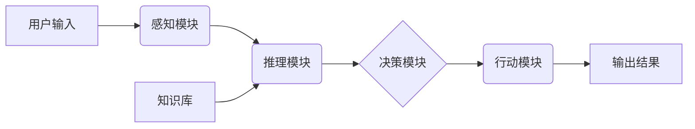

# 实现基于AI Agent的个人助理系统

> 关键词：AI Agent、个人助理系统、人工智能、自然语言处理、任务执行

> 摘要：本文旨在深入探讨如何实现基于AI Agent的个人助理系统。详细介绍了该系统的背景知识，包括目的、预期读者、文档结构和相关术语。阐述了核心概念与联系，分析了核心算法原理并给出Python代码示例，同时介绍了相关数学模型和公式。通过项目实战展示了系统的开发环境搭建、源代码实现和代码解读。探讨了系统的实际应用场景，推荐了学习资源、开发工具框架和相关论文著作。最后总结了系统的未来发展趋势与挑战，并提供了常见问题解答和扩展阅读参考资料，为开发者构建基于AI Agent的个人助理系统提供全面且深入的指导。

## 1. 背景介绍 
### 1.1 目的和范围
随着人工智能技术的飞速发展，人们对于智能化、个性化的服务需求日益增长。基于AI Agent的个人助理系统旨在为用户提供便捷、高效、个性化的服务，帮助用户处理各种日常事务，如信息查询、日程安排、任务提醒等。本文章的范围涵盖了从系统的核心概念、算法原理到实际项目开发的全过程，旨在为开发者提供一个全面的实现指南。

### 1.2 预期读者
本文主要面向对人工智能、自然语言处理和软件开发感兴趣的开发者、研究人员和技术爱好者。无论是初学者希望了解基于AI Agent的个人助理系统的基本原理，还是有一定经验的开发者想要深入研究系统的实现细节，都能从本文中获得有价值的信息。

### 1.3 文档结构概述
本文将按照以下结构进行组织：首先介绍相关背景知识，包括目的、读者群体和文档结构等；接着阐述核心概念与联系，展示核心概念原理和架构的文本示意图以及Mermaid流程图；然后详细讲解核心算法原理和具体操作步骤，并给出Python源代码；之后介绍数学模型和公式，并举例说明；通过项目实战展示系统的开发环境搭建、源代码实现和代码解读；探讨系统的实际应用场景；推荐学习资源、开发工具框架和相关论文著作；最后总结系统的未来发展趋势与挑战，提供常见问题解答和扩展阅读参考资料。

### 1.4 术语表
#### 1.4.1 核心术语定义
- **AI Agent**：人工智能代理，是一种能够感知环境、进行推理和决策，并采取行动以实现特定目标的智能实体。
- **个人助理系统**：为用户提供个性化服务，帮助用户处理各种日常事务的软件系统。
- **自然语言处理（NLP）**：研究如何让计算机理解、处理和生成人类语言的技术。
- **知识图谱**：一种以图形结构表示知识的方式，用于存储和管理实体之间的关系。

#### 1.4.2 相关概念解释
- **感知**：AI Agent通过各种传感器（如麦克风、摄像头等）获取环境信息的过程。
- **推理**：AI Agent根据感知到的信息和自身的知识进行逻辑推导，得出结论的过程。
- **决策**：AI Agent在推理的基础上，选择合适的行动方案的过程。
- **行动**：AI Agent根据决策结果，采取具体的操作以实现目标的过程。

#### 1.4.3 缩略词列表
- **NLP**：Natural Language Processing（自然语言处理）
- **API**：Application Programming Interface（应用程序编程接口）
- **SDK**：Software Development Kit（软件开发工具包）

## 2. 核心概念与联系 

### 核心概念原理
基于AI Agent的个人助理系统主要由感知模块、推理模块、决策模块和行动模块组成。感知模块负责收集用户的输入信息，如语音、文本等；推理模块对感知到的信息进行分析和处理，结合知识图谱等知识库进行推理；决策模块根据推理结果选择合适的行动方案；行动模块则执行决策模块选择的行动，如查询信息、发送提醒等。

### 架构的文本示意图
```plaintext
用户输入（语音、文本等） -> 感知模块 -> 推理模块（结合知识库） -> 决策模块 -> 行动模块 -> 输出结果（语音、文本、操作等）
```

### Mermaid流程图


## 3. 核心算法原理 & 具体操作步骤 

### 核心算法原理
在基于AI Agent的个人助理系统中，自然语言处理是核心算法之一。其中，文本分类、命名实体识别和意图识别是关键的子任务。以下是使用Python和常见的自然语言处理库`nltk`和`sklearn`实现简单文本分类的示例代码：

```python
import nltk
from nltk.corpus import stopwords
from sklearn.feature_extraction.text import TfidfVectorizer
from sklearn.naive_bayes import MultinomialNB
from sklearn.model_selection import train_test_split
from sklearn.metrics import accuracy_score

# 下载停用词
nltk.download('stopwords')

# 示例数据
documents = [
    ("这是一个关于科技的文章，介绍了最新的人工智能技术。", "科技"),
    ("足球比赛非常精彩，双方球员都表现出色。", "体育"),
    ("新上映的电影口碑很好，值得一看。", "娱乐"),
    ("政府出台了新的经济政策，促进经济发展。", "经济")
]

# 分离文本和标签
texts = [doc[0] for doc in documents]
labels = [doc[1] for doc in documents]

# 文本预处理
stop_words = set(stopwords.words('chinese'))
vectorizer = TfidfVectorizer(stop_words=stop_words)
X = vectorizer.fit_transform(texts)

# 划分训练集和测试集
X_train, X_test, y_train, y_test = train_test_split(X, labels, test_size=0.2, random_state=42)

# 训练模型
clf = MultinomialNB()
clf.fit(X_train, y_train)

# 预测
y_pred = clf.predict(X_test)

# 评估模型
accuracy = accuracy_score(y_test, y_pred)
print(f"模型准确率: {accuracy}")
```

### 具体操作步骤
1. **数据收集**：收集大量的文本数据，并为每个文本标注相应的类别标签。
2. **文本预处理**：去除停用词、标点符号等噪声信息，将文本转换为向量表示。
3. **模型训练**：选择合适的机器学习算法（如朴素贝叶斯、支持向量机等），使用训练数据对模型进行训练。
4. **模型评估**：使用测试数据对训练好的模型进行评估，计算准确率、召回率等指标。
5. **模型应用**：将训练好的模型应用到实际的个人助理系统中，对用户输入的文本进行分类。

## 4. 数学模型和公式 & 详细讲解 & 举例说明 

### 文本分类的数学模型
在文本分类中，常用的数学模型是朴素贝叶斯分类器。朴素贝叶斯分类器基于贝叶斯定理，假设特征之间相互独立。贝叶斯定理的公式如下：

$$P(c|x) = \frac{P(x|c)P(c)}{P(x)}$$

其中，$P(c|x)$ 表示在给定特征 $x$ 的情况下，类别 $c$ 的后验概率；$P(x|c)$ 表示在类别 $c$ 的情况下，特征 $x$ 的似然概率；$P(c)$ 表示类别 $c$ 的先验概率；$P(x)$ 表示特征 $x$ 的概率。

### 详细讲解
在文本分类中，特征 $x$ 通常是文本中的单词或词组，类别 $c$ 是文本的分类标签。朴素贝叶斯分类器的目标是找到后验概率 $P(c|x)$ 最大的类别 $c$，即：

$$\hat{c} = \arg\max_{c \in C} P(c|x)$$

由于 $P(x)$ 对于所有类别 $c$ 都是相同的，因此可以忽略 $P(x)$，得到：

$$\hat{c} = \arg\max_{c \in C} P(x|c)P(c)$$

### 举例说明
假设我们有一个文本分类任务，要将文本分为“科技”和“体育”两类。我们已经收集了一些训练数据，并计算出了先验概率 $P(科技) = 0.6$ 和 $P(体育) = 0.4$。对于一个新的文本“最新的人工智能技术”，我们可以计算出似然概率 $P(最新的人工智能技术|科技) = 0.8$ 和 $P(最新的人工智能技术|体育) = 0.2$。根据朴素贝叶斯分类器的公式，我们可以计算出后验概率：

$$P(科技|最新的人工智能技术) = \frac{P(最新的人工智能技术|科技)P(科技)}{P(最新的人工智能技术)} \approx \frac{0.8 \times 0.6}{P(最新的人工智能技术)}$$

$$P(体育|最新的人工智能技术) = \frac{P(最新的人工智能技术|体育)P(体育)}{P(最新的人工智能技术)} \approx \frac{0.2 \times 0.4}{P(最新的人工智能技术)}$$

由于 $P(科技|最新的人工智能技术) > P(体育|最新的人工智能技术)$，因此我们可以将这个文本分类为“科技”类。

## 5. 项目实战：代码实际案例和详细解释说明 

### 5.1  开发环境搭建
#### 安装Python
首先，确保你已经安装了Python 3.x版本。可以从Python官方网站（https://www.python.org/downloads/）下载并安装适合你操作系统的Python版本。

#### 安装必要的库
使用`pip`命令安装以下必要的库：
```bash
pip install nltk sklearn SpeechRecognition pyttsx3
```

### 5.2  源代码详细实现和代码解读
以下是一个简单的基于AI Agent的个人助理系统的实现代码：

```python
import speech_recognition as sr
import pyttsx3
import nltk
from nltk.corpus import stopwords
from sklearn.feature_extraction.text import TfidfVectorizer
from sklearn.naive_bayes import MultinomialNB

# 下载停用词
nltk.download('stopwords')

# 示例训练数据
documents = [
    ("查询天气", "天气查询"),
    ("设置提醒", "提醒设置"),
    ("播放音乐", "音乐播放")
]

# 分离文本和标签
texts = [doc[0] for doc in documents]
labels = [doc[1] for doc in documents]

# 文本预处理
stop_words = set(stopwords.words('chinese'))
vectorizer = TfidfVectorizer(stop_words=stop_words)
X = vectorizer.fit_transform(texts)

# 训练模型
clf = MultinomialNB()
clf.fit(X, labels)

# 初始化语音识别和语音合成引擎
r = sr.Recognizer()
engine = pyttsx3.init()

def recognize_speech():
    with sr.Microphone() as source:
        print("请说话...")
        audio = r.listen(source)
    try:
        text = r.recognize_google(audio, language='zh-CN')
        print(f"你说的是: {text}")
        return text
    except sr.UnknownValueError:
        print("无法识别语音")
    except sr.RequestError as e:
        print(f"请求错误; {e}")
    return None

def speak(text):
    engine.say(text)
    engine.runAndWait()

def main():
    while True:
        text = recognize_speech()
        if text:
            # 对用户输入进行分类
            X_test = vectorizer.transform([text])
            prediction = clf.predict(X_test)[0]
            print(f"预测结果: {prediction}")
            if prediction == "天气查询":
                speak("正在为你查询天气...")
            elif prediction == "提醒设置":
                speak("正在为你设置提醒...")
            elif prediction == "音乐播放":
                speak("正在为你播放音乐...")

if __name__ == "__main__":
    main()
```

### 5.3  代码解读与分析
- **数据准备**：定义了一些示例训练数据，包括用户的查询文本和对应的类别标签。
- **文本预处理**：使用`TfidfVectorizer`将文本转换为向量表示，并去除停用词。
- **模型训练**：使用朴素贝叶斯分类器对训练数据进行训练。
- **语音识别**：使用`SpeechRecognition`库实现语音识别功能，将用户的语音转换为文本。
- **语音合成**：使用`pyttsx3`库实现语音合成功能，将系统的回复转换为语音输出。
- **主循环**：不断监听用户的语音输入，对输入的文本进行分类，并根据分类结果执行相应的操作。

## 6. 实际应用场景 
### 日常生活
基于AI Agent的个人助理系统可以帮助用户处理各种日常事务，如查询天气、设置日程提醒、查询交通信息等。用户只需要通过语音或文本输入指令，系统就可以自动完成相应的任务，提高生活效率。

### 工作场景
在工作场景中，个人助理系统可以帮助用户管理邮件、安排会议、查询文档等。例如，用户可以通过语音指令让系统自动发送邮件、查询会议时间等，减少手动操作的时间和工作量。

### 教育领域
在教育领域，个人助理系统可以作为学习助手，帮助学生解答问题、提供学习资料、进行学习规划等。例如，学生可以通过语音提问，系统可以自动搜索相关的知识点并进行解答。

### 医疗保健
在医疗保健领域，个人助理系统可以帮助患者管理健康信息、提醒服药时间、提供健康建议等。例如，患者可以通过语音输入自己的症状，系统可以根据症状提供相应的诊断建议和治疗方案。

## 7. 工具和资源推荐
### 7.1 学习资源推荐
#### 7.1.1 书籍推荐
- 《Python自然语言处理》：介绍了Python在自然语言处理领域的应用，包括文本分类、命名实体识别、情感分析等。
- 《人工智能：一种现代的方法》：全面介绍了人工智能的基本概念、算法和应用，是人工智能领域的经典教材。
- 《机器学习》：详细讲解了机器学习的基本算法和模型，包括决策树、神经网络、支持向量机等。

#### 7.1.2 在线课程
- Coursera上的“自然语言处理专项课程”：由斯坦福大学教授授课，系统介绍了自然语言处理的理论和实践。
- edX上的“人工智能基础”：涵盖了人工智能的基本概念、算法和应用，适合初学者学习。
- 中国大学MOOC上的“Python语言程序设计”：介绍了Python语言的基本语法和应用，是学习Python的入门课程。

#### 7.1.3 技术博客和网站
- Medium：有许多关于人工智能、自然语言处理的技术博客文章，作者来自世界各地的技术专家。
- 开源中国：提供了丰富的开源项目和技术文章，涵盖了人工智能、软件开发等多个领域。
- 知乎：有很多关于人工智能、自然语言处理的讨论和分享，用户可以从中获取最新的技术动态和经验。

### 7.2 开发工具框架推荐
#### 7.2.1 IDE和编辑器
- PyCharm：是一款专门为Python开发设计的集成开发环境，提供了代码编辑、调试、版本控制等功能。
- Visual Studio Code：是一款轻量级的代码编辑器，支持多种编程语言，有丰富的插件可以扩展功能。
- Jupyter Notebook：是一个交互式的编程环境，适合进行数据探索、模型训练和可视化等工作。

#### 7.2.2 调试和性能分析工具
- PDB：Python自带的调试工具，可以帮助开发者定位代码中的错误。
- cProfile：Python自带的性能分析工具，可以分析代码的运行时间和函数调用次数。
- Py-Spy：一个轻量级的Python性能分析工具，可以实时监测Python程序的性能。

#### 7.2.3 相关框架和库
- NLTK：是Python中最常用的自然语言处理库，提供了丰富的工具和数据集，用于文本处理、分类、标记等任务。
- SpaCy：是一个快速、高效的自然语言处理库，支持多种语言，提供了预训练的模型和管道。
- TensorFlow：是一个开源的机器学习框架，广泛应用于深度学习领域，提供了丰富的工具和模型。

### 7.3 相关论文著作推荐
#### 7.3.1 经典论文
- "A Mathematical Theory of Communication"：由克劳德·香农（Claude Shannon）发表，奠定了信息论的基础。
- "Speech Recognition with Deep Recurrent Neural Networks"：提出了使用深度循环神经网络进行语音识别的方法。
- "Attention Is All You Need"：介绍了Transformer模型，是自然语言处理领域的重要突破。

#### 7.3.2 最新研究成果
- 关注顶级学术会议（如ACL、EMNLP、ICML等）的论文，了解自然语言处理和人工智能领域的最新研究动态。
- 关注知名研究机构（如OpenAI、Google Research等）的研究成果，学习他们的最新技术和方法。

#### 7.3.3 应用案例分析
- 阅读相关的技术博客和行业报告，了解基于AI Agent的个人助理系统在不同领域的应用案例和实践经验。
- 分析开源项目中的代码和文档，学习其他开发者的实现思路和技巧。

## 8. 总结：未来发展趋势与挑战
### 未来发展趋势
- **多模态交互**：未来的个人助理系统将支持多种模态的交互方式，如语音、手势、表情等，提供更加自然、便捷的用户体验。
- **个性化服务**：系统将更加注重用户的个性化需求，根据用户的历史行为和偏好提供更加精准、个性化的服务。
- **与物联网的融合**：个人助理系统将与物联网设备深度融合，实现对智能家居、智能汽车等设备的远程控制和管理。
- **知识增强**：系统将利用知识图谱等技术，增强自身的知识储备和推理能力，提供更加智能、准确的回答和建议。

### 挑战
- **数据隐私和安全**：个人助理系统需要收集和处理大量的用户数据，如何保障数据的隐私和安全是一个重要的挑战。
- **自然语言理解的准确性**：尽管自然语言处理技术取得了很大的进展，但在处理复杂的语言表达和语义理解方面仍然存在一定的困难。
- **系统的可扩展性和性能**：随着用户数量的增加和业务需求的不断变化，如何保证系统的可扩展性和性能是一个需要解决的问题。
- **伦理和法律问题**：人工智能技术的应用可能会带来一些伦理和法律问题，如算法偏见、责任归属等，需要制定相应的规范和法律来解决。

## 9. 附录：常见问题与解答
### 1. 如何提高语音识别的准确率？
可以通过以下方法提高语音识别的准确率：
- 使用高质量的麦克风，减少环境噪音的干扰。
- 训练特定领域的语音模型，提高对特定词汇和语言的识别能力。
- 增加训练数据的多样性和数量，提高模型的泛化能力。

### 2. 如何处理用户输入的模糊指令？
可以采用以下策略处理用户输入的模糊指令：
- 询问用户进一步的信息，以明确指令的意图。
- 根据用户的历史行为和偏好进行推测，提供可能的选项供用户选择。
- 使用上下文信息来理解指令的含义，提高识别的准确性。

### 3. 如何保证系统的安全性？
可以采取以下措施保证系统的安全性：
- 对用户数据进行加密处理，防止数据泄露。
- 实施访问控制，限制对系统和数据的访问权限。
- 定期进行安全审计和漏洞扫描，及时发现和修复安全问题。

## 10. 扩展阅读 & 参考资料
### 扩展阅读
- 《深度学习》：详细介绍了深度学习的基本原理和算法，适合深入学习人工智能的读者。
- 《智能时代》：探讨了人工智能对社会和经济的影响，以及未来的发展趋势。
- 《未来简史：从智人到智神》：从人类历史的角度探讨了人工智能和生物技术的发展对人类未来的影响。

### 参考资料
- 相关的学术论文和研究报告，如ACL、EMNLP、ICML等会议的论文。
- 开源项目的文档和代码，如NLTK、SpaCy、TensorFlow等项目的官方文档。
- 技术博客和网站上的文章，如Medium、开源中国、知乎等平台上的相关文章。

作者：AI天才研究院/AI Genius Institute & 禅与计算机程序设计艺术 /Zen And The Art of Computer Programming