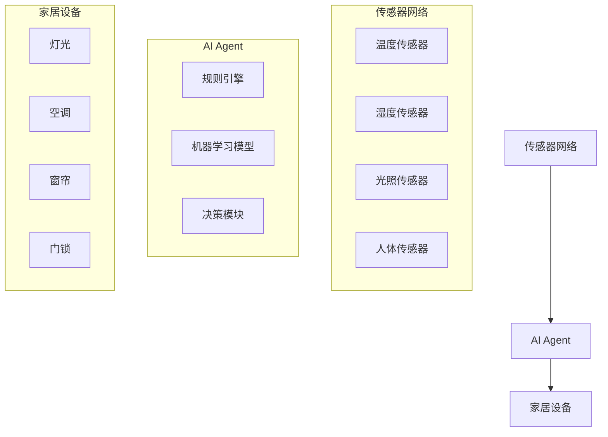

# 实现基于AI Agent的智能家居控制系统

> 关键词：AI Agent、智能家居控制系统、智能交互、自动化控制、传感器网络

> 摘要：本文围绕实现基于AI Agent的智能家居控制系统展开深入探讨。详细介绍了该系统的背景知识，包括目的、预期读者等。阐述了核心概念及联系，通过文本示意图和Mermaid流程图进行清晰展示。深入剖析核心算法原理，结合Python源代码详细说明具体操作步骤。同时给出数学模型和公式，并举例讲解。通过项目实战，展示开发环境搭建、源代码实现与解读。探讨了系统的实际应用场景，推荐了学习资源、开发工具框架以及相关论文著作。最后总结未来发展趋势与挑战，还设置了常见问题解答和扩展阅读参考资料，为读者全面呈现基于AI Agent的智能家居控制系统的技术全貌。

## 1. 背景介绍 
### 1.1 目的和范围
随着科技的飞速发展，智能家居成为了人们追求高品质生活的重要组成部分。基于AI Agent的智能家居控制系统旨在利用先进的人工智能技术，实现家居设备的智能化管理和自动化控制。该系统的范围涵盖了常见的家居设备，如灯光、空调、窗帘、门锁等，通过传感器网络收集环境信息，AI Agent根据这些信息做出决策，实现对家居设备的智能控制。其目的不仅是为用户提供更加便捷、舒适的生活体验，还能实现能源的高效利用，降低家居能耗。

### 1.2 预期读者
本文的预期读者主要包括对智能家居技术感兴趣的技术爱好者、从事智能家居相关开发的程序员和软件工程师、研究人工智能在物联网领域应用的科研人员，以及希望了解智能家居系统原理和实现方法的企业管理人员和创业者。

### 1.3 文档结构概述
本文将按照以下结构进行阐述：首先介绍核心概念与联系，让读者了解基于AI Agent的智能家居控制系统的基本原理和架构；接着详细讲解核心算法原理和具体操作步骤，并结合Python源代码进行说明；然后给出系统的数学模型和公式，并举例进行详细讲解；通过项目实战部分，展示开发环境搭建、源代码实现和代码解读；探讨系统的实际应用场景；推荐学习资源、开发工具框架和相关论文著作；最后总结未来发展趋势与挑战，设置常见问题解答和扩展阅读参考资料。

### 1.4 术语表
#### 1.4.1 核心术语定义
- **AI Agent**：人工智能代理，是一种能够感知环境、做出决策并执行相应动作的智能实体。在智能家居控制系统中，AI Agent可以根据传感器收集的信息，对家居设备进行智能控制。
- **智能家居控制系统**：通过计算机技术、网络通信技术、传感器技术等，实现对家居设备的集中管理和自动化控制的系统。
- **传感器网络**：由多个传感器节点组成的网络，用于收集环境信息，如温度、湿度、光照强度等。
- **智能交互**：用户与智能家居系统之间通过语音、手势、手机应用等方式进行的自然、便捷的交互。

#### 1.4.2 相关概念解释
- **自动化控制**：系统根据预设的规则或算法，自动对家居设备进行控制，无需用户手动干预。例如，当室内温度高于设定值时，系统自动开启空调。
- **机器学习**：一种让计算机通过数据学习模式和规律的技术。在智能家居控制系统中，机器学习算法可以根据用户的使用习惯和环境数据，优化控制策略。
- **物联网（IoT）**：将各种设备通过网络连接起来，实现设备之间的信息交换和远程控制的技术。智能家居控制系统是物联网技术在家庭领域的典型应用。

#### 1.4.3 缩略词列表
- **AI**：Artificial Intelligence，人工智能
- **IoT**：Internet of Things，物联网
- **API**：Application Programming Interface，应用程序编程接口

## 2. 核心概念与联系 
### 核心概念原理
基于AI Agent的智能家居控制系统主要由传感器网络、AI Agent和家居设备三个核心部分组成。传感器网络负责收集环境信息，如温度、湿度、光照强度、人体活动等。这些信息被发送到AI Agent，AI Agent根据预设的规则和机器学习算法对信息进行分析和处理，做出决策并生成相应的控制指令。最后，控制指令被发送到家居设备，实现对设备的智能控制。

### 架构的文本示意图
```plaintext
+-------------------+
| 传感器网络         |
|  - 温度传感器      |
|  - 湿度传感器      |
|  - 光照传感器      |
|  - 人体传感器      |
+-------------------+
        |
        v
+-------------------+
|  AI Agent         |
|  - 规则引擎        |
|  - 机器学习模型    |
|  - 决策模块        |
+-------------------+
        |
        v
+-------------------+
| 家居设备           |
|  - 灯光            |
|  - 空调            |
|  - 窗帘            |
|  - 门锁            |
+-------------------+
```

### Mermaid流程图


## 3. 核心算法原理 & 具体操作步骤 
### 核心算法原理
在基于AI Agent的智能家居控制系统中，核心算法主要包括规则引擎和机器学习算法。规则引擎是一种基于规则的推理系统，它根据预设的规则对传感器数据进行匹配和推理，生成相应的控制指令。机器学习算法则可以根据历史数据学习用户的使用习惯和环境模式，优化控制策略。

### 具体操作步骤
#### 步骤1：数据收集
传感器网络实时收集环境信息，如温度、湿度、光照强度等，并将这些数据发送到AI Agent。

#### 步骤2：数据预处理
AI Agent接收到传感器数据后，对数据进行预处理，包括数据清洗、归一化等操作，以提高数据的质量和可用性。

#### 步骤3：规则匹配
规则引擎根据预设的规则对预处理后的数据进行匹配。例如，当室内温度高于28℃时，规则引擎生成开启空调的指令。

#### 步骤4：机器学习预测
机器学习模型根据历史数据和当前环境信息，预测用户的需求和设备的最佳状态。例如，根据用户的日常习惯，预测晚上睡觉时的室内温度偏好。

#### 步骤5：决策生成
决策模块综合规则匹配结果和机器学习预测结果，生成最终的控制指令。

#### 步骤6：指令执行
控制指令被发送到相应的家居设备，实现对设备的智能控制。

### Python源代码详细阐述
```python
import random

# 模拟传感器数据收集
def collect_sensor_data():
    temperature = random.uniform(20, 30)  # 模拟温度传感器数据
    humidity = random.uniform(30, 70)  # 模拟湿度传感器数据
    light = random.uniform(0, 1000)  # 模拟光照传感器数据
    return temperature, humidity, light

# 规则引擎
def rule_engine(temperature, humidity, light):
    commands = []
    if temperature > 28:
        commands.append("Turn on the air conditioner")
    if humidity > 60:
        commands.append("Turn on the dehumidifier")
    if light < 100:
        commands.append("Turn on the lights")
    return commands

# 机器学习模型（简单示例）
def machine_learning_model(temperature, humidity, light):
    # 这里只是简单模拟，实际中需要训练模型
    if temperature > 25 and light < 200:
        return ["Adjust the curtain to block sunlight"]
    return []

# 决策模块
def decision_making(rule_commands, ml_commands):
    all_commands = rule_commands + ml_commands
    return all_commands

# 主函数
def main():
    temperature, humidity, light = collect_sensor_data()
    rule_commands = rule_engine(temperature, humidity, light)
    ml_commands = machine_learning_model(temperature, humidity, light)
    final_commands = decision_making(rule_commands, ml_commands)
    print("Final commands:", final_commands)

if __name__ == "__main__":
    main()
```

## 4. 数学模型和公式 & 详细讲解 & 举例说明 
### 数学模型
在基于AI Agent的智能家居控制系统中，可以使用马尔可夫决策过程（MDP）作为数学模型。马尔可夫决策过程是一种用于描述在不确定环境中进行决策的数学框架，它由状态空间 $S$、动作空间 $A$、状态转移概率 $P(s'|s,a)$、奖励函数 $R(s,a)$ 和折扣因子 $\gamma$ 组成。

### 数学公式
- **状态转移概率**：$P(s'|s,a)$ 表示在状态 $s$ 下执行动作 $a$ 后转移到状态 $s'$ 的概率。
- **奖励函数**：$R(s,a)$ 表示在状态 $s$ 下执行动作 $a$ 所获得的即时奖励。
- **价值函数**：$V(s)$ 表示从状态 $s$ 开始，遵循最优策略所能获得的期望累计折扣奖励，其递归公式为：
$$V(s) = \max_{a \in A} \left[ R(s,a) + \gamma \sum_{s' \in S} P(s'|s,a) V(s') \right]$$
- **策略**：$\pi(s)$ 表示在状态 $s$ 下应该采取的最优动作。

### 详细讲解
在智能家居控制系统中，状态空间 $S$ 可以表示为环境信息和设备状态的组合，例如 $S = \{(T, H, L, D_1, D_2, \cdots)\}$，其中 $T$ 表示温度，$H$ 表示湿度，$L$ 表示光照强度，$D_i$ 表示第 $i$ 个设备的状态。动作空间 $A$ 表示可以对设备执行的操作，例如开启、关闭、调节温度等。状态转移概率 $P(s'|s,a)$ 描述了在当前状态 $s$ 下执行动作 $a$ 后，系统转移到下一个状态 $s'$ 的可能性。奖励函数 $R(s,a)$ 用于评估在状态 $s$ 下执行动作 $a$ 的优劣，例如，如果动作 $a$ 使得室内温度达到了用户的舒适范围，则给予正奖励；否则给予负奖励。折扣因子 $\gamma$ 用于平衡即时奖励和未来奖励的重要性。

### 举例说明
假设当前状态 $s = (26^{\circ}C, 50\%, 300lux, \text{AC off}, \text{Light off})$，即室内温度为26℃，湿度为50%，光照强度为300lux，空调关闭，灯光关闭。动作空间 $A = \{\text{Turn on AC}, \text{Turn on Light}, \text{Do nothing}\}$。如果执行动作 $\text{Turn on AC}$，系统转移到状态 $s' = (24^{\circ}C, 50\%, 300lux, \text{AC on}, \text{Light off})$ 的概率为 $P(s'|s, \text{Turn on AC}) = 0.8$，奖励函数 $R(s, \text{Turn on AC}) = -10$（因为开启空调会消耗能源）。通过计算价值函数 $V(s)$，可以确定在状态 $s$ 下的最优动作。

## 5. 项目实战：代码实际案例和详细解释说明 
### 5.1  开发环境搭建
#### 硬件环境
- **传感器节点**：选择合适的传感器，如DHT11温度湿度传感器、光敏电阻光照传感器、人体红外传感器等，并将它们连接到微控制器，如Arduino或Raspberry Pi。
- **微控制器**：Arduino或Raspberry Pi用于读取传感器数据，并通过网络将数据发送到服务器。
- **家居设备**：选择支持智能控制的家居设备，如智能灯泡、智能插座、智能空调等，并确保它们可以通过网络进行远程控制。

#### 软件环境
- **操作系统**：可以选择Linux系统，如Raspbian（适用于Raspberry Pi）或Ubuntu。
- **编程语言**：Python是一个不错的选择，因为它具有丰富的库和易于学习的语法。
- **开发框架**：可以使用Flask或Django等Web框架来搭建服务器，处理传感器数据和控制指令。
- **数据库**：选择合适的数据库，如MySQL或MongoDB，用于存储传感器数据和用户配置信息。

### 5.2  源代码详细实现和代码解读
```python
from flask import Flask, request
import mysql.connector

app = Flask(__name__)

# 连接数据库
mydb = mysql.connector.connect(
    host="localhost",
    user="your_username",
    password="your_password",
    database="smart_home"
)
mycursor = mydb.cursor()

# 接收传感器数据
@app.route('/sensor_data', methods=['POST'])
def receive_sensor_data():
    data = request.get_json()
    temperature = data.get('temperature')
    humidity = data.get('humidity')
    light = data.get('light')
    # 插入数据到数据库
    sql = "INSERT INTO sensor_data (temperature, humidity, light) VALUES (%s, %s, %s)"
    val = (temperature, humidity, light)
    mycursor.execute(sql, val)
    mydb.commit()
    return "Data received and saved successfully"

# 处理控制指令
@app.route('/control_command', methods=['GET'])
def send_control_command():
    # 查询数据库获取最新传感器数据
    mycursor.execute("SELECT temperature, humidity, light FROM sensor_data ORDER BY id DESC LIMIT 1")
    result = mycursor.fetchone()
    temperature = result[0]
    humidity = result[1]
    light = result[2]
    commands = []
    if temperature > 28:
        commands.append("Turn on the air conditioner")
    if humidity > 60:
        commands.append("Turn on the dehumidifier")
    if light < 100:
        commands.append("Turn on the lights")
    return str(commands)

if __name__ == '__main__':
    app.run(host='0.0.0.0', port=5000)
```
### 代码解读与分析
- **数据库连接**：使用 `mysql.connector` 库连接到MySQL数据库，用于存储传感器数据。
- **接收传感器数据**：定义了一个 `/sensor_data` 的POST接口，用于接收传感器发送的数据。接收到数据后，将数据插入到数据库中。
- **处理控制指令**：定义了一个 `/control_command` 的GET接口，用于根据最新的传感器数据生成控制指令。首先从数据库中查询最新的传感器数据，然后根据规则生成控制指令并返回。
- **Flask应用**：使用Flask框架搭建了一个简单的Web服务器，监听 `0.0.0.0:5000` 端口，处理传感器数据接收和控制指令生成的请求。

## 6. 实际应用场景 
### 家庭自动化
在家庭环境中，基于AI Agent的智能家居控制系统可以实现家居设备的自动化控制。例如，当用户离开家时，系统自动关闭所有灯光、空调和电器设备，以节省能源；当用户回家时，系统自动打开灯光和空调，调节到用户习惯的温度和亮度。

### 能源管理
通过实时监测环境信息和设备能耗，系统可以优化能源使用。例如，根据室外光照强度自动调节窗帘的开合，减少室内照明和空调的能耗；根据用户的使用习惯，合理安排电器设备的开启和关闭时间。

### 安全监控
系统可以集成安防设备，如摄像头、门锁、烟雾报警器等。当检测到异常情况时，如有人闯入或烟雾报警，系统自动发送警报信息到用户的手机，并采取相应的措施，如开启灯光、录制视频等。

### 健康关怀
通过传感器监测用户的健康信息，如体温、心率、睡眠质量等。系统可以根据这些信息提供个性化的健康建议，如提醒用户运动、休息或就医。

## 7. 工具和资源推荐
### 7.1 学习资源推荐
#### 7.1.1 书籍推荐
- 《人工智能：一种现代的方法》：全面介绍了人工智能的基本概念、算法和应用，是人工智能领域的经典教材。
- 《Python数据分析实战》：详细介绍了Python在数据分析领域的应用，包括数据处理、可视化和机器学习等方面的内容。
- 《智能家居系统设计与实现》：专门介绍智能家居系统的设计原理、技术和实践案例，对学习智能家居控制系统有很大的帮助。

#### 7.1.2 在线课程
- Coursera上的“人工智能基础”课程：由知名大学的教授授课，系统地介绍了人工智能的基础知识和算法。
- edX上的“Python编程入门”课程：适合初学者学习Python编程语言，为后续的智能家居开发打下基础。
- Udemy上的“智能家居开发实战”课程：通过实际项目案例，详细讲解智能家居系统的开发过程和技术要点。

#### 7.1.3 技术博客和网站
- 博客园：有很多技术爱好者分享智能家居开发的经验和技巧。
- 开源中国：提供了丰富的开源项目和技术文章，包括智能家居相关的内容。
- 物联网世界：专注于物联网领域的新闻、技术和应用案例，对了解智能家居行业动态有很大的帮助。

### 7.2 开发工具框架推荐
#### 7.2.1 IDE和编辑器
- PyCharm：一款专业的Python集成开发环境，提供了丰富的代码编辑、调试和部署功能。
- Visual Studio Code：一款轻量级的代码编辑器，支持多种编程语言，并且有丰富的插件可以扩展功能。
- Arduino IDE：专门用于Arduino开发的集成开发环境，简单易用，适合初学者。

#### 7.2.2 调试和性能分析工具
- Postman：一款强大的API调试工具，可以用于测试智能家居系统的接口。
- Wireshark：一款网络协议分析工具，可以用于分析传感器数据和控制指令的传输过程。
- cProfile：Python自带的性能分析工具，可以用于分析代码的性能瓶颈。

#### 7.2.3 相关框架和库
- Flask：一个轻量级的Python Web框架，适合快速搭建智能家居系统的服务器。
- Django：一个功能强大的Python Web框架，提供了丰富的功能和工具，适合开发大型的智能家居系统。
- TensorFlow：一个开源的机器学习框架，可以用于训练智能家居系统中的机器学习模型。

### 7.3 相关论文著作推荐
#### 7.3.1 经典论文
- “Markov Decision Processes: Discrete Stochastic Dynamic Programming”：详细介绍了马尔可夫决策过程的理论和算法，是该领域的经典论文。
- “Artificial Intelligence for Home Automation: A Survey”：对人工智能在家庭自动化领域的应用进行了全面的综述，分析了当前的研究现状和发展趋势。

#### 7.3.2 最新研究成果
- 在IEEE Xplore、ACM Digital Library等学术数据库中，可以搜索到关于基于AI Agent的智能家居控制系统的最新研究成果。这些研究成果通常涉及到新的算法、技术和应用场景。

#### 7.3.3 应用案例分析
- 一些知名企业和研究机构会发布智能家居系统的应用案例分析报告，如Google Nest、Amazon Echo等。这些案例分析可以帮助我们了解实际应用中的技术方案和经验教训。

## 8. 总结：未来发展趋势与挑战
### 未来发展趋势
- **更加智能化**：随着人工智能技术的不断发展，智能家居系统将更加智能化，能够更好地理解用户的需求和意图，提供更加个性化的服务。
- **集成化程度更高**：未来的智能家居系统将集成更多的设备和功能，如家庭影院、智能厨房、健康监测等，实现家庭生活的全方位智能化。
- **与其他领域融合**：智能家居系统将与物联网、大数据、云计算等技术深度融合，实现数据的共享和协同，提高系统的性能和效率。
- **增强安全性能**：随着智能家居系统的普及，安全问题将越来越受到关注。未来的系统将采用更加先进的安全技术，如加密通信、身份认证等，保障用户的隐私和数据安全。

### 挑战
- **标准不统一**：目前智能家居行业缺乏统一的标准和规范，不同品牌和厂家的设备之间兼容性较差，给用户的使用和管理带来了不便。
- **数据隐私和安全**：智能家居系统收集了大量的用户数据，如家庭环境信息、用户行为习惯等。如何保护这些数据的隐私和安全，防止数据泄露和滥用，是一个亟待解决的问题。
- **技术复杂度高**：基于AI Agent的智能家居控制系统涉及到人工智能、传感器技术、网络通信等多个领域的知识和技术，开发和维护的难度较大。
- **用户接受度**：一些用户对智能家居系统的可靠性和稳定性存在疑虑，担心系统出现故障或被黑客攻击。如何提高用户的接受度，是推广智能家居系统的关键。

## 9. 附录：常见问题与解答
### 问题1：如何选择合适的传感器？
解答：选择传感器时，需要考虑传感器的精度、灵敏度、稳定性、响应时间等性能指标，以及传感器的适用范围、安装方式和成本等因素。根据智能家居系统的具体需求，选择合适类型和规格的传感器。

### 问题2：如何保证智能家居系统的安全性？
解答：可以采取以下措施保证智能家居系统的安全性：使用加密通信协议，如SSL/TLS，保护数据传输的安全；采用身份认证和授权机制，确保只有授权用户可以访问系统；定期更新系统软件和固件，修复安全漏洞；安装防火墙和入侵检测系统，防止黑客攻击。

### 问题3：智能家居系统可以与手机应用集成吗？
解答：可以。大多数智能家居系统都提供了手机应用程序，用户可以通过手机应用远程控制家居设备、查看传感器数据和设置系统参数。通过与手机应用集成，用户可以更加方便地使用智能家居系统。

### 问题4：如何优化智能家居系统的性能？
解答：可以从以下几个方面优化智能家居系统的性能：合理设计传感器网络的布局，提高数据采集的准确性和实时性；优化AI Agent的算法和模型，提高决策的准确性和效率；选择高性能的硬件设备，如服务器、微控制器等；采用分布式架构和云计算技术，提高系统的处理能力和扩展性。

## 10. 扩展阅读 & 参考资料
### 扩展阅读
- 《智能建筑与智慧城市》杂志：提供了智能建筑和智能家居领域的最新技术和应用案例。
- 《物联网技术》杂志：专注于物联网技术的研究和应用，对了解智能家居系统的技术背景有很大的帮助。
- 相关的技术论坛和社区，如Stack Overflow、Reddit的智能家居板块等，可以与其他开发者和爱好者交流经验和心得。

### 参考资料
- IEEE标准协会发布的智能家居相关标准。
- 各智能家居设备厂商的产品文档和技术手册。
- 相关的学术论文和研究报告，如在ACM、IEEE等学术数据库中搜索到的关于智能家居系统的研究成果。

作者：AI天才研究院/AI Genius Institute & 禅与计算机程序设计艺术 /Zen And The Art of Computer Programming