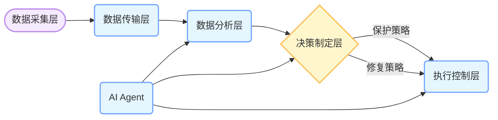

# 实现基于AI Agent的智能文化遗产保护系统

> 关键词：AI Agent、智能文化遗产保护系统、文化遗产监测、文化遗产修复、数据分析

> 摘要：本文旨在探讨如何实现基于AI Agent的智能文化遗产保护系统。通过对文化遗产保护领域的需求分析，结合AI Agent的特性，阐述了系统的核心概念、算法原理、数学模型等内容。同时，给出了项目实战案例，介绍了系统的开发环境搭建、源代码实现及解读。还探讨了系统的实际应用场景，推荐了相关的工具和资源。最后总结了系统的未来发展趋势与挑战，并对常见问题进行了解答。

## 1. 背景介绍 
### 1.1 目的和范围
文化遗产是人类历史和文明的重要见证，然而，随着时间的推移和自然环境、人为因素的影响，许多文化遗产面临着损坏、消失的风险。本项目的目的是开发一个基于AI Agent的智能文化遗产保护系统，利用先进的人工智能技术，实现对文化遗产的全面监测、精准修复和高效管理。系统的范围涵盖了从文化遗产的数据采集、处理、分析到决策制定和执行的全过程，适用于各种类型的文化遗产，如古建筑、文物、壁画等。

### 1.2 预期读者
本文的预期读者包括文化遗产保护领域的专业人员，如文物保护工作者、考古学家等，他们可以通过本文了解如何利用先进的AI技术提升文化遗产保护的效率和质量；人工智能领域的研究者和开发者，他们可以从本文中获取关于AI Agent在特定领域应用的思路和方法；以及对文化遗产保护和人工智能技术感兴趣的普通读者，帮助他们了解这两个领域的结合所带来的创新和发展。

### 1.3 文档结构概述
本文将按照以下结构进行阐述：首先介绍系统的核心概念和相关联系，包括AI Agent和文化遗产保护系统的基本原理和架构；接着详细讲解核心算法原理和具体操作步骤，并用Python源代码进行说明；然后介绍系统所涉及的数学模型和公式，并通过举例进行详细讲解；之后给出项目实战案例，包括开发环境搭建、源代码实现和代码解读；再探讨系统的实际应用场景；推荐相关的工具和资源；最后总结系统的未来发展趋势与挑战，解答常见问题，并提供扩展阅读和参考资料。

### 1.4 术语表
#### 1.4.1 核心术语定义
- **AI Agent**：人工智能代理，是一种能够感知环境、进行推理和决策，并采取行动以实现特定目标的智能实体。在本系统中，AI Agent可以根据文化遗产的状态和环境信息，自主地进行监测、分析和修复等操作。
- **文化遗产**：指人类在社会历史发展过程中所创造的具有历史、艺术、科学价值的物质和非物质遗产，如古建筑、文物、传统技艺等。
- **智能文化遗产保护系统**：利用人工智能技术，对文化遗产进行全面监测、分析、修复和管理的系统。

#### 1.4.2 相关概念解释
- **数据采集**：通过各种传感器和设备，收集文化遗产的相关数据，如温度、湿度、图像、结构信息等。
- **数据分析**：对采集到的数据进行处理和分析，提取有用的信息，如判断文化遗产是否存在损坏、预测其未来的状态等。
- **决策制定**：根据数据分析的结果，制定相应的保护和修复策略。
- **执行控制**：将决策转化为具体的行动，如启动修复设备、调整环境参数等。

#### 1.4.3 缩略词列表
- **AI**：Artificial Intelligence，人工智能
- **ML**：Machine Learning，机器学习
- **DL**：Deep Learning，深度学习

## 2. 核心概念与联系 

### 2.1 AI Agent原理
AI Agent是一种具有自主性、反应性、社会性和主动性的智能实体。自主性意味着它能够在没有人类干预的情况下，独立地感知环境、进行推理和决策；反应性表示它能够及时对环境的变化做出响应；社会性体现为它可以与其他Agent或人类进行交互；主动性则是指它能够主动地追求自己的目标。

AI Agent通常由感知模块、推理模块、决策模块和执行模块组成。感知模块负责收集环境信息，推理模块对信息进行处理和分析，决策模块根据推理结果制定行动方案，执行模块将方案转化为实际行动。

### 2.2 智能文化遗产保护系统架构
智能文化遗产保护系统主要由数据采集层、数据传输层、数据分析层、决策制定层和执行控制层组成。

- **数据采集层**：通过各种传感器和设备，如温度传感器、湿度传感器、摄像头、激光扫描仪等，收集文化遗产的相关数据。
- **数据传输层**：将采集到的数据传输到数据分析中心，可采用有线或无线传输方式。
- **数据分析层**：利用机器学习、深度学习等算法对数据进行处理和分析，提取有用的信息。
- **决策制定层**：根据数据分析的结果，制定相应的保护和修复策略。
- **执行控制层**：将决策转化为具体的行动，如启动修复设备、调整环境参数等。

### 2.3 核心概念联系示意图


在这个系统中，AI Agent贯穿于各个层次。在数据采集层，AI Agent可以根据环境情况自动调整传感器的采集频率和范围；在数据分析层，AI Agent利用自身的推理能力对数据进行深度挖掘；在决策制定层，AI Agent结合历史数据和实时信息制定最优策略；在执行控制层，AI Agent控制设备执行具体的行动。

## 3. 核心算法原理 & 具体操作步骤 

### 3.1 数据预处理算法
在对文化遗产数据进行分析之前，需要对采集到的数据进行预处理，以提高数据的质量和可用性。常见的数据预处理算法包括数据清洗、数据归一化和特征提取。

```python
import numpy as np
from sklearn.preprocessing import MinMaxScaler

# 数据清洗：去除缺失值
def data_cleaning(data):
    cleaned_data = data[~np.isnan(data).any(axis=1)]
    return cleaned_data

# 数据归一化
def data_normalization(data):
    scaler = MinMaxScaler()
    normalized_data = scaler.fit_transform(data)
    return normalized_data

# 特征提取：以主成分分析为例
from sklearn.decomposition import PCA
def feature_extraction(data, n_components=2):
    pca = PCA(n_components=n_components)
    extracted_features = pca.fit_transform(data)
    return extracted_features

# 示例数据
data = np.array([[1, 2, np.nan], [4, 5, 6], [7, 8, 9]])
cleaned = data_cleaning(data)
normalized = data_normalization(cleaned)
features = feature_extraction(normalized)

print("Cleaned data:", cleaned)
print("Normalized data:", normalized)
print("Extracted features:", features)
```

### 3.2 损坏检测算法
损坏检测是文化遗产保护的重要环节，可采用机器学习和深度学习算法进行检测。这里以支持向量机（SVM）为例。

```python
from sklearn import svm
from sklearn.model_selection import train_test_split
from sklearn.metrics import accuracy_score

# 生成示例数据
X = np.random.rand(100, 10)  # 特征数据
y = np.random.randint(0, 2, 100)  # 标签数据

# 划分训练集和测试集
X_train, X_test, y_train, y_test = train_test_split(X, y, test_size=0.2, random_state=42)

# 创建SVM分类器
clf = svm.SVC(kernel='linear')

# 训练模型
clf.fit(X_train, y_train)

# 预测
y_pred = clf.predict(X_test)

# 计算准确率
accuracy = accuracy_score(y_test, y_pred)
print("Accuracy:", accuracy)
```

### 3.3 修复策略制定算法
根据损坏检测的结果，制定相应的修复策略。可以采用基于规则的方法或强化学习方法。这里以基于规则的方法为例。

```python
def repair_strategy(damage_level):
    if damage_level == 0:
        return "无需修复"
    elif damage_level == 1:
        return "轻度修复，采用简单的材料进行修补"
    elif damage_level == 2:
        return "中度修复，需要专业人员进行处理"
    else:
        return "重度修复，制定详细的修复方案并组织专家团队进行修复"

# 示例损坏等级
damage_level = 1
strategy = repair_strategy(damage_level)
print("Repair strategy:", strategy)
```

## 4. 数学模型和公式 & 详细讲解 & 举例说明 

### 4.1 主成分分析（PCA）数学模型
主成分分析是一种常用的数据降维方法，其目标是找到一组正交的投影方向，使得数据在这些方向上的投影方差最大。

设原始数据矩阵为 $X \in \mathbb{R}^{n \times p}$，其中 $n$ 是样本数量，$p$ 是特征数量。PCA的步骤如下：

1. 数据中心化：计算样本均值 $\bar{x} = \frac{1}{n} \sum_{i=1}^{n} x_i$，并将数据矩阵 $X$ 减去均值得到 $X_c = X - \bar{x}$。
2. 计算协方差矩阵 $S = \frac{1}{n-1} X_c^T X_c$。
3. 对协方差矩阵 $S$ 进行特征值分解：$S = U \Lambda U^T$，其中 $U$ 是特征向量矩阵，$\Lambda$ 是特征值对角矩阵。
4. 选择前 $k$ 个最大的特征值对应的特征向量 $U_k$，将数据投影到这些特征向量上得到降维后的数据 $Z = X_c U_k$。

### 4.2 支持向量机（SVM）数学模型
支持向量机是一种二分类模型，其目标是找到一个最优的超平面，使得不同类别的样本能够被最大程度地分开。

对于线性可分的数据，SVM的优化问题可以表示为：

$$
\begin{aligned}
\min_{w, b} &\quad \frac{1}{2} \|w\|^2 \\
\text{s.t.} &\quad y_i (w^T x_i + b) \geq 1, \quad i = 1, \cdots, n
\end{aligned}
$$

其中 $w$ 是超平面的法向量，$b$ 是偏置项，$x_i$ 是样本点，$y_i \in \{-1, 1\}$ 是样本的标签。

引入拉格朗日乘子 $\alpha_i \geq 0$，得到拉格朗日函数：

$$
L(w, b, \alpha) = \frac{1}{2} \|w\|^2 - \sum_{i=1}^{n} \alpha_i (y_i (w^T x_i + b) - 1)
$$

对 $w$ 和 $b$ 求偏导并令其为零，得到：

$$
\begin{aligned}
w &= \sum_{i=1}^{n} \alpha_i y_i x_i \\
\sum_{i=1}^{n} \alpha_i y_i &= 0
\end{aligned}
$$

将其代入拉格朗日函数，得到对偶问题：

$$
\begin{aligned}
\max_{\alpha} &\quad \sum_{i=1}^{n} \alpha_i - \frac{1}{2} \sum_{i=1}^{n} \sum_{j=1}^{n} \alpha_i \alpha_j y_i y_j x_i^T x_j \\
\text{s.t.} &\quad \sum_{i=1}^{n} \alpha_i y_i = 0 \\
&\quad \alpha_i \geq 0, \quad i = 1, \cdots, n
\end{aligned}
$$

求解对偶问题得到最优的拉格朗日乘子 $\alpha^*$，进而得到最优的 $w^*$ 和 $b^*$。

### 4.3 举例说明
假设我们有一个二维数据集，包含两个类别的样本。我们可以使用PCA将数据降维到一维，然后使用SVM对降维后的数据进行分类。

```python
import numpy as np
from sklearn.decomposition import PCA
from sklearn.svm import SVC
import matplotlib.pyplot as plt

# 生成示例数据
np.random.seed(42)
X1 = np.random.randn(50, 2) + [2, 2]
X2 = np.random.randn(50, 2) + [-2, -2]
X = np.vstack((X1, X2))
y = np.hstack((np.ones(50), -np.ones(50)))

# PCA降维
pca = PCA(n_components=1)
X_pca = pca.fit_transform(X)

# SVM分类
clf = SVC(kernel='linear')
clf.fit(X_pca, y)

# 绘制原始数据和降维后的数据
plt.figure(figsize=(12, 6))
plt.subplot(1, 2, 1)
plt.scatter(X[:, 0], X[:, 1], c=y, cmap='viridis')
plt.title('Original Data')
plt.subplot(1, 2, 2)
plt.scatter(X_pca, np.zeros_like(X_pca), c=y, cmap='viridis')
plt.title('PCA Reduced Data')
plt.show()
```

在这个例子中，我们首先生成了一个二维数据集，然后使用PCA将其降维到一维，最后使用SVM对降维后的数据进行分类。通过可视化可以直观地看到数据的降维效果和分类结果。

## 5. 项目实战：代码实际案例和详细解释说明 

### 5.1  开发环境搭建
#### 5.1.1 操作系统
建议使用Linux系统，如Ubuntu 18.04或更高版本，因为Linux系统具有良好的稳定性和开源生态。

#### 5.1.2 Python环境
安装Python 3.7或更高版本，可以使用Anaconda来管理Python环境。

```bash
# 下载Anaconda安装包
wget https://repo.anaconda.com/archive/Anaconda3-2023.03-1-Linux-x86_64.sh

# 安装Anaconda
bash Anaconda3-2023.03-1-Linux-x86_64.sh

# 创建虚拟环境
conda create -n heritage python=3.8

# 激活虚拟环境
conda activate heritage
```

#### 5.1.3 安装依赖库
安装项目所需的Python库，如NumPy、Pandas、Scikit-learn、TensorFlow等。

```bash
pip install numpy pandas scikit-learn tensorflow matplotlib
```

### 5.2  源代码详细实现和代码解读
#### 5.2.1 数据采集模拟
```python
import numpy as np

# 模拟数据采集
def data_collection():
    temperature = np.random.uniform(10, 30)
    humidity = np.random.uniform(30, 80)
    image = np.random.rand(100, 100, 3)
    return temperature, humidity, image

# 采集数据
temp, hum, img = data_collection()
print("Temperature:", temp)
print("Humidity:", hum)
```

这段代码模拟了数据采集的过程，随机生成了温度、湿度和图像数据。

#### 5.2.2 数据预处理
```python
import numpy as np
from sklearn.preprocessing import MinMaxScaler

# 数据清洗：去除缺失值
def data_cleaning(data):
    cleaned_data = data[~np.isnan(data).any(axis=1)]
    return cleaned_data

# 数据归一化
def data_normalization(data):
    scaler = MinMaxScaler()
    normalized_data = scaler.fit_transform(data)
    return normalized_data

# 示例数据
data = np.array([[1, 2, np.nan], [4, 5, 6], [7, 8, 9]])
cleaned = data_cleaning(data)
normalized = data_normalization(cleaned)
print("Cleaned data:", cleaned)
print("Normalized data:", normalized)
```

这段代码实现了数据清洗和归一化的功能，去除了数据中的缺失值，并将数据归一化到[0, 1]范围内。

#### 5.2.3 损坏检测
```python
from sklearn import svm
from sklearn.model_selection import train_test_split
from sklearn.metrics import accuracy_score

# 生成示例数据
X = np.random.rand(100, 10)  # 特征数据
y = np.random.randint(0, 2, 100)  # 标签数据

# 划分训练集和测试集
X_train, X_test, y_train, y_test = train_test_split(X, y, test_size=0.2, random_state=42)

# 创建SVM分类器
clf = svm.SVC(kernel='linear')

# 训练模型
clf.fit(X_train, y_train)

# 预测
y_pred = clf.predict(X_test)

# 计算准确率
accuracy = accuracy_score(y_test, y_pred)
print("Accuracy:", accuracy)
```

这段代码使用支持向量机对文化遗产的损坏情况进行检测，通过训练模型并在测试集上进行预测，计算了模型的准确率。

#### 5.2.4 修复策略制定
```python
def repair_strategy(damage_level):
    if damage_level == 0:
        return "无需修复"
    elif damage_level == 1:
        return "轻度修复，采用简单的材料进行修补"
    elif damage_level == 2:
        return "中度修复，需要专业人员进行处理"
    else:
        return "重度修复，制定详细的修复方案并组织专家团队进行修复"

# 示例损坏等级
damage_level = 1
strategy = repair_strategy(damage_level)
print("Repair strategy:", strategy)
```

这段代码根据损坏等级制定了相应的修复策略。

### 5.3  代码解读与分析
- **数据采集模拟**：通过随机生成数据模拟了实际的数据采集过程，在实际应用中，需要使用真实的传感器和设备来采集数据。
- **数据预处理**：数据清洗和归一化是数据处理的重要步骤，能够提高数据的质量和可用性，为后续的分析和建模提供更好的基础。
- **损坏检测**：使用支持向量机进行损坏检测，是一种简单有效的分类方法。在实际应用中，可以根据数据的特点和需求选择更合适的模型，如深度学习模型。
- **修复策略制定**：基于规则的修复策略制定方法简单直观，但缺乏灵活性。在实际应用中，可以结合机器学习和专家知识，制定更加智能和个性化的修复策略。

## 6. 实际应用场景 
### 6.1 古建筑保护
在古建筑保护中，基于AI Agent的智能文化遗产保护系统可以实时监测古建筑的结构安全、环境参数等信息。通过安装在古建筑上的传感器，采集温度、湿度、振动等数据，AI Agent对这些数据进行分析，判断古建筑是否存在潜在的安全隐患。如果发现问题，系统可以及时发出警报，并制定相应的修复策略，如调整通风设备、进行局部加固等。

### 6.2 文物修复
对于文物修复，系统可以利用高分辨率摄像头和三维扫描仪采集文物的图像和结构信息。AI Agent通过对这些信息的分析，识别文物的损坏情况和材质特征，制定精确的修复方案。在修复过程中，系统可以实时监测修复进度和效果，根据反馈信息调整修复策略，提高修复的质量和效率。

### 6.3 文化遗产数字化保护
在文化遗产数字化保护方面，系统可以对文化遗产的图像、音频、视频等数据进行处理和分析，实现文化遗产的数字化存档和展示。AI Agent可以对数字化数据进行分类、标注和检索，方便用户快速查找和使用相关信息。同时，系统还可以利用虚拟现实和增强现实技术，为用户提供沉浸式的文化遗产体验。

## 7. 工具和资源推荐
### 7.1 学习资源推荐
#### 7.1.1 书籍推荐
- 《人工智能：一种现代的方法》：全面介绍了人工智能的基本概念、算法和应用，是人工智能领域的经典教材。
- 《机器学习》：由周志华教授编写，系统地介绍了机器学习的基本原理和常用算法。
- 《深度学习》：作者是Ian Goodfellow、Yoshua Bengio和Aaron Courville，是深度学习领域的权威著作。

#### 7.1.2 在线课程
- Coursera上的“人工智能基础”：由知名教授授课，内容涵盖人工智能的各个方面。
- edX上的“机器学习”：提供了丰富的教学资源和实践项目，帮助学习者掌握机器学习的基本技能。
- 中国大学MOOC上的“深度学习”：国内高校的优质课程，适合初学者入门。

#### 7.1.3 技术博客和网站
- Medium：有许多人工智能领域的专业博客，提供了最新的技术动态和实践经验。
- arXiv：是一个预印本平台，包含了大量的人工智能研究论文。
- 机器之心：专注于人工智能领域的资讯和技术分享，提供了丰富的行业动态和技术文章。

### 7.2 开发工具框架推荐
#### 7.2.1 IDE和编辑器
- PyCharm：是一款专业的Python集成开发环境，提供了丰富的代码编辑、调试和部署功能。
- Jupyter Notebook：是一个交互式的开发环境，适合进行数据探索和模型实验。
- Visual Studio Code：是一款轻量级的代码编辑器，支持多种编程语言和插件扩展。

#### 7.2.2 调试和性能分析工具
- TensorBoard：是TensorFlow提供的可视化工具，可用于监控模型的训练过程和性能指标。
- Py-Spy：是一个Python性能分析工具，能够实时监测Python程序的CPU使用率和函数调用情况。
- cProfile：是Python标准库中的性能分析模块，可用于分析Python程序的时间复杂度和内存使用情况。

#### 7.2.3 相关框架和库
- TensorFlow：是一个开源的深度学习框架，提供了丰富的工具和库，可用于构建和训练各种深度学习模型。
- PyTorch：是另一个流行的深度学习框架，具有动态图和易于使用的特点。
- Scikit-learn：是一个用于机器学习的Python库，提供了各种常用的机器学习算法和工具。

### 7.3 相关论文著作推荐
#### 7.3.1 经典论文
- “Support-Vector Networks”：介绍了支持向量机的基本原理和算法，是机器学习领域的经典论文。
- “ImageNet Classification with Deep Convolutional Neural Networks”：提出了AlexNet，开启了深度学习在计算机视觉领域的新纪元。
- “Attention Is All You Need”：提出了Transformer模型，在自然语言处理领域取得了巨大的成功。

#### 7.3.2 最新研究成果
- 在IEEE Transactions on Pattern Analysis and Machine Intelligence、ACM Transactions on Intelligent Systems and Technology等顶级期刊上，有许多关于人工智能在文化遗产保护领域的最新研究成果。
- 在CVPR、ICCV、NeurIPS等顶级学术会议上，也会发布相关的研究论文。

#### 7.3.3 应用案例分析
- 可以关注一些文化遗产保护机构和科研团队的官方网站，他们会发布一些基于人工智能技术的文化遗产保护应用案例，从中可以学习到实际应用中的经验和方法。

## 8. 总结：未来发展趋势与挑战
### 8.1 未来发展趋势
- **多模态数据融合**：未来的智能文化遗产保护系统将融合更多类型的数据，如图像、音频、视频、传感器数据等，实现更全面、准确的文化遗产监测和分析。
- **智能决策与自动化修复**：随着人工智能技术的不断发展，系统将具备更强的智能决策能力，能够自动制定最优的保护和修复策略，并通过自动化设备实现快速修复。
- **虚拟现实与增强现实应用**：虚拟现实和增强现实技术将在文化遗产保护和展示中得到更广泛的应用，为用户提供更加沉浸式的体验。
- **跨领域合作**：文化遗产保护将与计算机科学、材料科学、建筑学等多个领域进行更深入的合作，推动智能文化遗产保护系统的不断创新和发展。

### 8.2 挑战
- **数据质量和数量**：获取高质量、大规模的文化遗产数据是一个挑战，需要投入大量的人力、物力和时间。同时，数据的标注和管理也需要专业的知识和技能。
- **算法复杂度和可解释性**：一些先进的人工智能算法，如深度学习算法，具有较高的复杂度，难以理解和解释。在文化遗产保护领域，需要保证算法的可解释性，以便专业人员能够信任和应用这些算法。
- **技术成本和应用推广**：智能文化遗产保护系统的开发和部署需要较高的技术成本，包括硬件设备、软件系统和人员培训等方面。如何降低成本，提高系统的性价比，并推动系统的广泛应用，是一个亟待解决的问题。
- **文化遗产保护的专业性**：文化遗产保护是一个专业性很强的领域，需要专业的知识和经验。如何将人工智能技术与文化遗产保护的专业知识相结合，是系统开发和应用的关键。

## 9. 附录：常见问题与解答
### 9.1 如何保证数据的安全性？
在数据采集、传输和存储过程中，采用加密技术对数据进行加密处理，防止数据泄露。同时，建立严格的访问控制机制，只有授权人员才能访问和处理数据。

### 9.2 系统的可靠性如何保障？
通过采用冗余设计、备份恢复机制和故障诊断技术，提高系统的可靠性。定期对系统进行维护和更新，及时修复系统中的漏洞和故障。

### 9.3 如何评估系统的性能？
可以从数据采集的准确性、数据分析的精度、决策制定的合理性和执行控制的有效性等方面对系统的性能进行评估。同时，结合实际应用效果和用户反馈，不断优化系统的性能。

### 9.4 系统是否可以扩展？
系统采用模块化设计，具有良好的扩展性。可以根据实际需求，添加新的功能模块和传感器设备，以满足不同类型文化遗产保护的需求。

## 10. 扩展阅读 & 参考资料
### 10.1 扩展阅读
- 《文化遗产保护与修复技术》：介绍了文化遗产保护和修复的基本理论和方法。
- 《人工智能与文化遗产》：探讨了人工智能技术在文化遗产领域的应用和发展趋势。
- 《数字文化遗产保护》：介绍了数字技术在文化遗产保护中的应用和实践。

### 10.2 参考资料
- 相关的学术论文和研究报告，如IEEE、ACM等学术组织发表的关于人工智能和文化遗产保护的论文。
- 文化遗产保护机构和科研团队的官方网站，如故宫博物院、中国文化遗产研究院等发布的相关资料。
- 人工智能和机器学习领域的开源项目和代码库，如GitHub上的相关项目。

作者：AI天才研究院/AI Genius Institute & 禅与计算机程序设计艺术 /Zen And The Art of Computer Programming