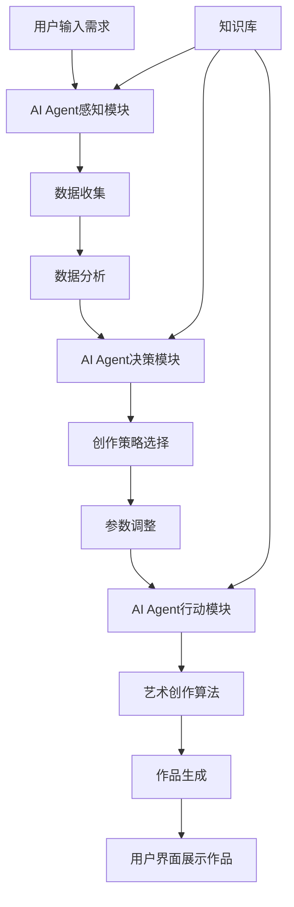

# 实现基于AI Agent的智能艺术创作系统

> 关键词：AI Agent、智能艺术创作系统、算法原理、数学模型、项目实战

> 摘要：本文聚焦于实现基于AI Agent的智能艺术创作系统。首先介绍了该系统开发的背景，包括目的、预期读者、文档结构和相关术语。接着阐述了核心概念与联系，通过文本示意图和Mermaid流程图展示其架构。详细讲解了核心算法原理及具体操作步骤，用Python代码进行说明。给出了系统涉及的数学模型和公式，并举例解释。通过项目实战，从开发环境搭建到源代码实现与解读，深入剖析系统实现过程。探讨了系统的实际应用场景，推荐了学习资源、开发工具框架和相关论文著作。最后总结了系统未来发展趋势与挑战，并提供常见问题解答和扩展阅读参考资料，旨在为开发者和研究者提供全面的技术指导。

## 1. 背景介绍 
### 1.1 目的和范围
本项目旨在构建一个基于AI Agent的智能艺术创作系统，充分利用人工智能技术的优势，让系统能够自主进行艺术创作，如绘画、音乐创作、诗歌写作等。该系统将融合多种先进的人工智能算法，模拟人类艺术家的创作思维和过程，为用户提供多样化、高质量的艺术作品。

系统的范围涵盖了从艺术创作的灵感获取、素材收集，到具体创作过程的算法实现，以及最终作品的输出和展示。同时，系统还将支持用户与AI Agent进行交互，用户可以根据自己的需求和喜好对创作过程进行干预和调整，以获得符合自己期望的艺术作品。

### 1.2 预期读者
本文的预期读者主要包括以下几类人群：
- **人工智能开发者**：对AI Agent技术和艺术创作相结合感兴趣，希望通过实际项目来提升自己的开发能力和创新思维。
- **艺术创作者**：想了解人工智能在艺术创作领域的应用，借助智能系统拓展自己的创作思路和方法，实现更具创意的艺术作品。
- **研究人员**：关注人工智能和艺术交叉领域的研究，通过本文可以深入了解基于AI Agent的智能艺术创作系统的原理、技术和应用前景。
- **科技爱好者**：对新兴技术和创新应用充满好奇，希望通过阅读本文了解智能艺术创作系统的工作原理和实现方式。

### 1.3 文档结构概述
本文将按照以下结构进行组织：
- **核心概念与联系**：介绍AI Agent和智能艺术创作系统的核心概念，以及它们之间的联系，并通过文本示意图和Mermaid流程图展示系统的架构。
- **核心算法原理 & 具体操作步骤**：详细讲解实现智能艺术创作系统所使用的核心算法原理，并用Python代码实现具体的操作步骤。
- **数学模型和公式 & 详细讲解 & 举例说明**：给出系统涉及的数学模型和公式，并通过具体的例子进行详细解释。
- **项目实战：代码实际案例和详细解释说明**：从开发环境搭建开始，逐步实现智能艺术创作系统的源代码，并对代码进行详细解读。
- **实际应用场景**：探讨基于AI Agent的智能艺术创作系统在不同领域的实际应用场景。
- **工具和资源推荐**：推荐学习人工智能和艺术创作相关的书籍、在线课程、技术博客和网站，以及开发工具框架和相关论文著作。
- **总结：未来发展趋势与挑战**：总结系统的发展现状，分析未来的发展趋势和可能面临的挑战。
- **附录：常见问题与解答**：对读者可能遇到的常见问题进行解答。
- **扩展阅读 & 参考资料**：提供相关的扩展阅读材料和参考资料，方便读者进一步深入学习。

### 1.4 术语表
#### 1.4.1 核心术语定义
- **AI Agent**：人工智能代理，是一种能够感知环境、进行决策并采取行动以实现特定目标的智能实体。在本系统中，AI Agent负责模拟人类艺术家的创作过程，进行艺术作品的创作。
- **智能艺术创作系统**：利用人工智能技术实现艺术创作功能的系统，该系统通过AI Agent的自主学习和决策能力，生成具有一定艺术价值的作品。
- **生成对抗网络（GAN）**：一种深度学习模型，由生成器和判别器组成，通过两者之间的对抗训练来生成逼真的数据，在艺术创作中可用于生成图像、音乐等作品。
- **循环神经网络（RNN）**：一种能够处理序列数据的神经网络，常用于自然语言处理和音乐创作等领域，在本系统中可用于生成诗歌、歌词等文本内容。

#### 1.4.2 相关概念解释
- **艺术创作灵感**：指艺术家在创作过程中产生的创意和想法，是艺术作品的核心和灵魂。在智能艺术创作系统中，灵感可以通过对大量艺术作品的学习和分析，以及对用户需求的理解来获取。
- **艺术风格**：指艺术家在创作过程中所表现出的独特的艺术特征和表现手法，如油画的写实风格、抽象风格，音乐的古典风格、流行风格等。智能艺术创作系统可以通过学习不同的艺术风格，生成具有相应风格的艺术作品。
- **创作过程模拟**：指通过算法和模型模拟人类艺术家的创作过程，包括灵感获取、素材选择、构图设计、色彩搭配等环节。在本系统中，AI Agent将按照一定的创作流程进行艺术作品的创作。

#### 1.4.3 缩略词列表
- **AI**：Artificial Intelligence，人工智能
- **GAN**：Generative Adversarial Network，生成对抗网络
- **RNN**：Recurrent Neural Network，循环神经网络
- **CNN**：Convolutional Neural Network，卷积神经网络

## 2. 核心概念与联系 
### 核心概念原理
#### AI Agent
AI Agent是本系统的核心组成部分，它具有感知、决策和行动的能力。在智能艺术创作系统中，AI Agent的感知能力体现在对艺术创作相关信息的收集和分析上，如艺术作品的风格、主题、色彩等。决策能力则是根据感知到的信息和用户的需求，选择合适的创作方法和策略。行动能力就是根据决策结果进行艺术作品的创作，生成具体的艺术作品。

#### 智能艺术创作系统
智能艺术创作系统是一个综合性的系统，它整合了AI Agent、各种人工智能算法和艺术创作相关的知识。系统通过AI Agent与用户进行交互，了解用户的需求和喜好，然后利用人工智能算法进行艺术创作。系统的输出可以是各种形式的艺术作品，如绘画、音乐、诗歌等。

### 架构的文本示意图
```plaintext
智能艺术创作系统
├── 用户界面
│   ├── 需求输入
│   ├── 作品展示
├── AI Agent
│   ├── 感知模块
│   │   ├── 数据收集
│   │   ├── 数据分析
│   ├── 决策模块
│   │   ├── 创作策略选择
│   │   ├── 参数调整
│   ├── 行动模块
│   │   ├── 艺术创作算法
│   │   ├── 作品生成
├── 知识库
│   ├── 艺术风格知识
│   ├── 创作技巧知识
│   ├── 素材库
```

### Mermaid流程图


## 3. 核心算法原理 & 具体操作步骤 
### 核心算法原理
#### 生成对抗网络（GAN）
生成对抗网络由生成器和判别器组成。生成器的目标是生成逼真的数据，而判别器的目标是区分生成的数据和真实的数据。两者通过对抗训练不断提高自己的能力，最终生成器能够生成非常逼真的数据。

在智能艺术创作系统中，GAN可以用于生成图像作品。生成器将随机噪声作为输入，生成一幅图像，判别器则判断这幅图像是生成的还是真实的。通过不断的训练，生成器能够生成具有不同风格和主题的图像。

#### 循环神经网络（RNN）
循环神经网络是一种能够处理序列数据的神经网络，它通过在网络中引入循环结构，使得网络能够记住之前的输入信息。在自然语言处理和音乐创作中，RNN可以用于生成文本和音乐序列。

在智能艺术创作系统中，RNN可以用于生成诗歌、歌词等文本内容。网络将前面的文本作为输入，预测下一个单词或字符，从而逐步生成完整的文本。

### 具体操作步骤及Python代码实现
#### 生成对抗网络（GAN）实现图像生成
```python
import tensorflow as tf
from tensorflow.keras import layers

# 定义生成器
def make_generator_model():
    model = tf.keras.Sequential()
    model.add(layers.Dense(7*7*256, use_bias=False, input_shape=(100,)))
    model.add(layers.BatchNormalization())
    model.add(layers.LeakyReLU())

    model.add(layers.Reshape((7, 7, 256)))
    assert model.output_shape == (None, 7, 7, 256)

    model.add(layers.Conv2DTranspose(128, (5, 5), strides=(1, 1), padding='same', use_bias=False))
    assert model.output_shape == (None, 7, 7, 128)
    model.add(layers.BatchNormalization())
    model.add(layers.LeakyReLU())

    model.add(layers.Conv2DTranspose(64, (5, 5), strides=(2, 2), padding='same', use_bias=False))
    assert model.output_shape == (None, 14, 14, 64)
    model.add(layers.BatchNormalization())
    model.add(layers.LeakyReLU())

    model.add(layers.Conv2DTranspose(1, (5, 5), strides=(2, 2), padding='same', use_bias=False, activation='tanh'))
    assert model.output_shape == (None, 28, 28, 1)

    return model

# 定义判别器
def make_discriminator_model():
    model = tf.keras.Sequential()
    model.add(layers.Conv2D(64, (5, 5), strides=(2, 2), padding='same',
                                     input_shape=[28, 28, 1]))
    model.add(layers.LeakyReLU())
    model.add(layers.Dropout(0.3))

    model.add(layers.Conv2D(128, (5, 5), strides=(2, 2), padding='same'))
    model.add(layers.LeakyReLU())
    model.add(layers.Dropout(0.3))

    model.add(layers.Flatten())
    model.add(layers.Dense(1))

    return model

# 定义损失函数
cross_entropy = tf.keras.losses.BinaryCrossentropy(from_logits=True)

def discriminator_loss(real_output, fake_output):
    real_loss = cross_entropy(tf.ones_like(real_output), real_output)
    fake_loss = cross_entropy(tf.zeros_like(fake_output), fake_output)
    total_loss = real_loss + fake_loss
    return total_loss

def generator_loss(fake_output):
    return cross_entropy(tf.ones_like(fake_output), fake_output)

# 定义优化器
generator_optimizer = tf.keras.optimizers.Adam(1e-4)
discriminator_optimizer = tf.keras.optimizers.Adam(1e-4)

# 训练循环
@tf.function
def train_step(images):
    noise = tf.random.normal([BATCH_SIZE, 100])

    with tf.GradientTape() as gen_tape, tf.GradientTape() as disc_tape:
      generated_images = generator(noise, training=True)

      real_output = discriminator(images, training=True)
      fake_output = discriminator(generated_images, training=True)

      gen_loss = generator_loss(fake_output)
      disc_loss = discriminator_loss(real_output, fake_output)

    gradients_of_generator = gen_tape.gradient(gen_loss, generator.trainable_variables)
    gradients_of_discriminator = disc_tape.gradient(disc_loss, discriminator.trainable_variables)

    generator_optimizer.apply_gradients(zip(gradients_of_generator, generator.trainable_variables))
    discriminator_optimizer.apply_gradients(zip(gradients_of_discriminator, discriminator.trainable_variables))

# 训练模型
def train(dataset, epochs):
  for epoch in range(epochs):
    start = time.time()

    for image_batch in dataset:
      train_step(image_batch)

    print ('Time for epoch {} is {} sec'.format(epoch + 1, time.time()-start))

# 创建生成器和判别器实例
generator = make_generator_model()
discriminator = make_discriminator_model()

# 加载数据集
(train_images, train_labels), (_, _) = tf.keras.datasets.mnist.load_data()
train_images = train_images.reshape(train_images.shape[0], 28, 28, 1).astype('float32')
train_images = (train_images - 127.5) / 127.5  # 归一化到 [-1, 1] 范围

BUFFER_SIZE = 60000
BATCH_SIZE = 256

# 打乱数据集
train_dataset = tf.data.Dataset.from_tensor_slices(train_images).shuffle(BUFFER_SIZE).batch(BATCH_SIZE)

# 训练模型
EPOCHS = 50
train(train_dataset, EPOCHS)
```

#### 循环神经网络（RNN）实现文本生成
```python
import numpy as np
import tensorflow as tf
from tensorflow.keras.preprocessing.text import Tokenizer
from tensorflow.keras.preprocessing.sequence import pad_sequences
from tensorflow.keras.models import Sequential
from tensorflow.keras.layers import Embedding, SimpleRNN, Dense

# 示例文本数据
texts = [
    "Twinkle, twinkle, little star",
    "How I wonder what you are",
    "Up above the world so high",
    "Like a diamond in the sky"
]

# 分词
tokenizer = Tokenizer()
tokenizer.fit_on_texts(texts)
total_words = len(tokenizer.word_index) + 1

# 生成输入序列
input_sequences = []
for line in texts:
    token_list = tokenizer.texts_to_sequences([line])[0]
    for i in range(1, len(token_list)):
        n_gram_sequence = token_list[:i+1]
        input_sequences.append(n_gram_sequence)

# 填充序列
max_sequence_len = max([len(x) for x in input_sequences])
input_sequences = np.array(pad_sequences(input_sequences, maxlen=max_sequence_len, padding='pre'))

# 划分输入和标签
xs, labels = input_sequences[:,:-1],input_sequences[:,-1]
ys = tf.keras.utils.to_categorical(labels, num_classes=total_words)

# 构建RNN模型
model = Sequential()
model.add(Embedding(total_words, 100, input_length=max_sequence_len-1))
model.add(SimpleRNN(100))
model.add(Dense(total_words, activation='softmax'))
model.compile(loss='categorical_crossentropy', optimizer='adam', metrics=['accuracy'])

# 训练模型
model.fit(xs, ys, epochs=500, verbose=1)

# 生成文本
seed_text = "Twinkle, twinkle"
next_words = 10

for _ in range(next_words):
    token_list = tokenizer.texts_to_sequences([seed_text])[0]
    token_list = pad_sequences([token_list], maxlen=max_sequence_len-1, padding='pre')
    predicted = model.predict_classes(token_list, verbose=0)
    output_word = ""
    for word, index in tokenizer.word_index.items():
        if index == predicted:
            output_word = word
            break
    seed_text += " " + output_word

print(seed_text)
```

## 4. 数学模型和公式 & 详细讲解 & 举例说明 
### 生成对抗网络（GAN）的数学模型和公式
#### 数学模型
GAN的目标是通过对抗训练来学习数据的分布。设生成器为 $G(z)$，其中 $z$ 是随机噪声，判别器为 $D(x)$，其中 $x$ 是输入的数据。生成器的目标是生成逼真的数据，使得判别器无法区分生成的数据和真实的数据；判别器的目标是正确区分生成的数据和真实的数据。

#### 损失函数
GAN的损失函数可以表示为：
$$
\min_G \max_D V(D, G)=\mathbb{E}_{x \sim p_{data}(x)}[\log D(x)]+\mathbb{E}_{z \sim p_z(z)}[\log (1 - D(G(z)))]
$$
其中，$p_{data}(x)$ 是真实数据的分布，$p_z(z)$ 是随机噪声的分布。

#### 详细讲解
- 对于判别器 $D$，它的目标是最大化 $V(D, G)$。当输入真实数据 $x$ 时，$D(x)$ 应该尽量接近 1，即 $\log D(x)$ 尽量大；当输入生成的数据 $G(z)$ 时，$D(G(z))$ 应该尽量接近 0，即 $\log (1 - D(G(z)))$ 尽量大。
- 对于生成器 $G$，它的目标是最小化 $V(D, G)$。当生成的数据 $G(z)$ 被判别器判断为真实数据时，$D(G(z))$ 应该尽量接近 1，即 $\log (1 - D(G(z)))$ 尽量小。

#### 举例说明
假设我们要生成手写数字图像。真实数据 $x$ 是从MNIST数据集中选取的手写数字图像，随机噪声 $z$ 是一个100维的向量。生成器 $G$ 将 $z$ 作为输入，生成一幅手写数字图像 $G(z)$。判别器 $D$ 接收真实图像 $x$ 和生成图像 $G(z)$ 作为输入，判断它们是真实的还是生成的。通过不断的训练，生成器能够生成越来越逼真的手写数字图像。

### 循环神经网络（RNN）的数学模型和公式
#### 数学模型
RNN的核心是循环单元，它能够记住之前的输入信息。设 $x_t$ 是时刻 $t$ 的输入，$h_t$ 是时刻 $t$ 的隐藏状态，$y_t$ 是时刻 $t$ 的输出。RNN的循环单元可以表示为：
$$
h_t = \tanh(W_{xh}x_t + W_{hh}h_{t-1} + b_h)
$$
$$
y_t = W_{hy}h_t + b_y
$$
其中，$W_{xh}$、$W_{hh}$ 和 $W_{hy}$ 是权重矩阵，$b_h$ 和 $b_y$ 是偏置向量。

#### 损失函数
对于文本生成任务，通常使用交叉熵损失函数。设 $y_t$ 是真实的标签，$\hat{y}_t$ 是模型的预测输出，则交叉熵损失函数可以表示为：
$$
L = -\sum_{t=1}^{T} y_t \log \hat{y}_t
$$
其中，$T$ 是序列的长度。

#### 详细讲解
- 在每个时刻 $t$，RNN接收输入 $x_t$ 和上一时刻的隐藏状态 $h_{t-1}$，通过循环单元计算当前时刻的隐藏状态 $h_t$。
- 隐藏状态 $h_t$ 包含了之前所有时刻的输入信息，通过线性变换得到当前时刻的输出 $y_t$。
- 损失函数 $L$ 衡量了模型的预测输出 $\hat{y}_t$ 与真实标签 $y_t$ 之间的差异，通过最小化损失函数来训练模型。

#### 举例说明
假设我们要生成诗歌。输入 $x_t$ 是当前时刻的单词，隐藏状态 $h_t$ 表示到当前时刻为止的诗歌信息，输出 $y_t$ 是下一个单词的预测概率分布。通过不断的训练，模型能够学习到诗歌的语言模式和规律，从而生成合理的诗歌。

## 5. 项目实战：代码实际案例和详细解释说明 
### 5.1  开发环境搭建
#### 安装Python
首先需要安装Python，建议使用Python 3.7及以上版本。可以从Python官方网站（https://www.python.org/downloads/）下载安装包，按照安装向导进行安装。

#### 安装深度学习框架
本项目使用TensorFlow作为深度学习框架，可以使用以下命令进行安装：
```sh
pip install tensorflow
```

#### 安装其他依赖库
还需要安装一些其他的依赖库，如NumPy、Matplotlib等，可以使用以下命令进行安装：
```sh
pip install numpy matplotlib
```

### 5.2  源代码详细实现和代码解读
#### 实现一个简单的基于GAN的图像生成系统
```python
import tensorflow as tf
from tensorflow.keras import layers
import numpy as np
import matplotlib.pyplot as plt

# 定义生成器
def make_generator_model():
    model = tf.keras.Sequential()
    model.add(layers.Dense(7*7*256, use_bias=False, input_shape=(100,)))
    model.add(layers.BatchNormalization())
    model.add(layers.LeakyReLU())

    model.add(layers.Reshape((7, 7, 256)))
    assert model.output_shape == (None, 7, 7, 256)

    model.add(layers.Conv2DTranspose(128, (5, 5), strides=(1, 1), padding='same', use_bias=False))
    assert model.output_shape == (None, 7, 7, 128)
    model.add(layers.BatchNormalization())
    model.add(layers.LeakyReLU())

    model.add(layers.Conv2DTranspose(64, (5, 5), strides=(2, 2), padding='same', use_bias=False))
    assert model.output_shape == (None, 14, 14, 64)
    model.add(layers.BatchNormalization())
    model.add(layers.LeakyReLU())

    model.add(layers.Conv2DTranspose(1, (5, 5), strides=(2, 2), padding='same', use_bias=False, activation='tanh'))
    assert model.output_shape == (None, 28, 28, 1)

    return model

# 定义判别器
def make_discriminator_model():
    model = tf.keras.Sequential()
    model.add(layers.Conv2D(64, (5, 5), strides=(2, 2), padding='same',
                                     input_shape=[28, 28, 1]))
    model.add(layers.LeakyReLU())
    model.add(layers.Dropout(0.3))

    model.add(layers.Conv2D(128, (5, 5), strides=(2, 2), padding='same'))
    model.add(layers.LeakyReLU())
    model.add(layers.Dropout(0.3))

    model.add(layers.Flatten())
    model.add(layers.Dense(1))

    return model

# 定义损失函数
cross_entropy = tf.keras.losses.BinaryCrossentropy(from_logits=True)

def discriminator_loss(real_output, fake_output):
    real_loss = cross_entropy(tf.ones_like(real_output), real_output)
    fake_loss = cross_entropy(tf.zeros_like(fake_output), fake_output)
    total_loss = real_loss + fake_loss
    return total_loss

def generator_loss(fake_output):
    return cross_entropy(tf.ones_like(fake_output), fake_output)

# 定义优化器
generator_optimizer = tf.keras.optimizers.Adam(1e-4)
discriminator_optimizer = tf.keras.optimizers.Adam(1e-4)

# 训练循环
@tf.function
def train_step(images):
    noise = tf.random.normal([BATCH_SIZE, 100])

    with tf.GradientTape() as gen_tape, tf.GradientTape() as disc_tape:
      generated_images = generator(noise, training=True)

      real_output = discriminator(images, training=True)
      fake_output = discriminator(generated_images, training=True)

      gen_loss = generator_loss(fake_output)
      disc_loss = discriminator_loss(real_output, fake_output)

    gradients_of_generator = gen_tape.gradient(gen_loss, generator.trainable_variables)
    gradients_of_discriminator = disc_tape.gradient(disc_loss, discriminator.trainable_variables)

    generator_optimizer.apply_gradients(zip(gradients_of_generator, generator.trainable_variables))
    discriminator_optimizer.apply_gradients(zip(gradients_of_discriminator, discriminator.trainable_variables))

# 训练模型
def train(dataset, epochs):
  for epoch in range(epochs):
    start = time.time()

    for image_batch in dataset:
      train_step(image_batch)

    print ('Time for epoch {} is {} sec'.format(epoch + 1, time.time()-start))

# 创建生成器和判别器实例
generator = make_generator_model()
discriminator = make_discriminator_model()

# 加载数据集
(train_images, train_labels), (_, _) = tf.keras.datasets.mnist.load_data()
train_images = train_images.reshape(train_images.shape[0], 28, 28, 1).astype('float32')
train_images = (train_images - 127.5) / 127.5  # 归一化到 [-1, 1] 范围

BUFFER_SIZE = 60000
BATCH_SIZE = 256

# 打乱数据集
train_dataset = tf.data.Dataset.from_tensor_slices(train_images).shuffle(BUFFER_SIZE).batch(BATCH_SIZE)

# 训练模型
EPOCHS = 50
train(train_dataset, EPOCHS)

# 生成图像
num_examples_to_generate = 16
seed = tf.random.normal([num_examples_to_generate, 100])
predictions = generator(seed, training=False)

fig = plt.figure(figsize=(4, 4))
for i in range(predictions.shape[0]):
    plt.subplot(4, 4, i+1)
    plt.imshow(predictions[i, :, :, 0] * 127.5 + 127.5, cmap='gray')
    plt.axis('off')
plt.show()
```

#### 代码解读
- **生成器（Generator）**：生成器是一个反卷积神经网络，它将随机噪声作为输入，逐步生成图像。通过多次反卷积操作，将低维的噪声向量转换为高维的图像。
- **判别器（Discriminator）**：判别器是一个卷积神经网络，它接收真实图像和生成图像作为输入，判断它们是真实的还是生成的。通过卷积操作提取图像的特征，最后通过全连接层输出判断结果。
- **损失函数（Loss Function）**：使用交叉熵损失函数来衡量判别器和生成器的性能。判别器的目标是最大化真实图像的判断概率和最小化生成图像的判断概率；生成器的目标是最大化生成图像被判别为真实图像的概率。
- **优化器（Optimizer）**：使用Adam优化器来更新生成器和判别器的参数。Adam优化器结合了Adagrad和RMSProp的优点，能够自适应地调整学习率。
- **训练循环（Training Loop）**：在每个训练步骤中，首先生成随机噪声，通过生成器生成图像。然后将真实图像和生成图像输入判别器，计算判别器的损失。接着计算生成器的损失，并更新生成器和判别器的参数。

### 5.3  代码解读与分析
#### 生成器的结构分析
生成器的输入是一个100维的随机噪声向量，通过一系列的全连接层和反卷积层，逐步将噪声向量转换为28x28的图像。在每个反卷积层之后，使用批量归一化（Batch Normalization）和LeakyReLU激活函数来提高模型的稳定性和性能。

#### 判别器的结构分析
判别器的输入是28x28的图像，通过一系列的卷积层和全连接层，判断图像是真实的还是生成的。在每个卷积层之后，使用LeakyReLU激活函数和Dropout层来防止过拟合。

#### 损失函数和优化器的选择
交叉熵损失函数是一种常用的损失函数，适用于二分类问题。Adam优化器具有自适应学习率的特点，能够在训练过程中自动调整学习率，提高训练效率。

#### 训练过程的分析
在训练过程中，生成器和判别器相互对抗，不断提高自己的性能。判别器试图正确区分真实图像和生成图像，而生成器试图生成能够骗过判别器的图像。通过多次迭代训练，生成器能够生成越来越逼真的图像。

## 6. 实际应用场景 
### 艺术创作辅助
对于艺术家来说，基于AI Agent的智能艺术创作系统可以作为一个强大的创作辅助工具。艺术家可以利用系统提供的灵感和创意，拓展自己的创作思路。例如，在绘画创作中，系统可以根据艺术家输入的主题和风格，生成一些初步的构图和色彩搭配方案，艺术家可以在此基础上进行进一步的创作和修改。在音乐创作中，系统可以生成一些旋律和节奏片段，供艺术家参考和使用。

### 广告设计
在广告设计领域，智能艺术创作系统可以快速生成各种风格的广告素材。广告设计师可以根据产品的特点和目标受众，输入相关的关键词和要求，系统可以生成相应的海报、视频广告等素材。这样可以大大提高广告设计的效率，降低设计成本。

### 游戏开发
在游戏开发中，智能艺术创作系统可以用于生成游戏中的场景、角色、道具等美术资源。游戏开发者可以通过系统快速生成大量的美术素材，丰富游戏的内容和视觉效果。同时，系统还可以根据游戏的剧情和玩法，生成相应的音乐和音效，增强游戏的沉浸感。

### 教育领域
在教育领域，智能艺术创作系统可以作为一种教学工具，帮助学生提高艺术创作能力。学生可以通过与系统交互，学习不同的艺术风格和创作技巧。例如，在美术课上，学生可以使用系统生成自己的绘画作品，并与其他同学分享和交流。在音乐课上，学生可以使用系统创作自己的音乐作品，培养音乐素养和创造力。

## 7. 工具和资源推荐
### 7.1 学习资源推荐
#### 7.1.1 书籍推荐
- 《深度学习》（Deep Learning）：由Ian Goodfellow、Yoshua Bengio和Aaron Courville合著，是深度学习领域的经典教材，涵盖了深度学习的基本概念、算法和应用。
- 《Python深度学习》（Deep Learning with Python）：由Francois Chollet所著，介绍了如何使用Python和Keras库进行深度学习开发，包含了大量的代码示例和实践项目。
- 《人工智能：一种现代的方法》（Artificial Intelligence: A Modern Approach）：由Stuart Russell和Peter Norvig合著，是人工智能领域的权威教材，全面介绍了人工智能的各个方面。

#### 7.1.2 在线课程
- Coursera上的“深度学习专项课程”（Deep Learning Specialization）：由Andrew Ng教授主讲，包括五门课程，涵盖了深度学习的基础知识、卷积神经网络、循环神经网络等内容。
- edX上的“人工智能导论”（Introduction to Artificial Intelligence）：由麻省理工学院（MIT）提供，介绍了人工智能的基本概念、算法和应用。
- Udemy上的“Python for Data Science and Machine Learning Bootcamp”：该课程介绍了如何使用Python进行数据科学和机器学习开发，包含了大量的实践项目。

#### 7.1.3 技术博客和网站
- Medium：一个技术博客平台，上面有很多关于人工智能、深度学习和艺术创作的文章和教程。
- Towards Data Science：专注于数据科学和机器学习领域的技术博客，提供了很多高质量的文章和教程。
- arXiv：一个预印本平台，上面有很多最新的人工智能和深度学习研究论文。

### 7.2 开发工具框架推荐
#### 7.2.1 IDE和编辑器
- PyCharm：一款专业的Python集成开发环境（IDE），提供了丰富的代码编辑、调试和项目管理功能。
- Jupyter Notebook：一个交互式的开发环境，适合进行数据分析、机器学习和深度学习的实验和开发。
- Visual Studio Code：一款轻量级的代码编辑器，支持多种编程语言和插件扩展，非常适合Python开发。

#### 7.2.2 调试和性能分析工具
- TensorBoard：TensorFlow提供的可视化工具，可以用于监控模型的训练过程、查看模型的结构和性能指标。
- PyTorch Profiler：PyTorch提供的性能分析工具，可以帮助开发者分析模型的性能瓶颈和优化模型。
- cProfile：Python内置的性能分析工具，可以用于分析Python代码的运行时间和内存使用情况。

#### 7.2.3 相关框架和库
- TensorFlow：一个开源的深度学习框架，提供了丰富的工具和库，支持各种深度学习模型的开发和训练。
- PyTorch：另一个开源的深度学习框架，具有简洁易用的接口和动态计算图的特点，适合快速开发和实验。
- Keras：一个高级神经网络API，可以在TensorFlow、Theano等后端上运行，简化了深度学习模型的开发过程。

### 7.3 相关论文著作推荐
#### 7.3.1 经典论文
- “Generative Adversarial Nets”：Ian Goodfellow等人于2014年发表的论文，首次提出了生成对抗网络（GAN）的概念。
- “Long Short-Term Memory”：Sepp Hochreiter和Jürgen Schmidhuber于1997年发表的论文，提出了长短期记忆网络（LSTM），解决了传统循环神经网络的梯度消失问题。
- “ImageNet Classification with Deep Convolutional Neural Networks”：Alex Krizhevsky等人于2012年发表的论文，介绍了AlexNet卷积神经网络，开启了深度学习在计算机视觉领域的应用热潮。

#### 7.3.2 最新研究成果
- 关注arXiv和顶级学术会议（如NeurIPS、ICML、CVPR等）上的最新研究论文，了解基于AI Agent的智能艺术创作系统的最新研究进展。

#### 7.3.3 应用案例分析
- 一些学术期刊和会议论文集上会有关于智能艺术创作系统在实际应用中的案例分析，通过阅读这些案例可以了解系统的实际应用效果和存在的问题。

## 8. 总结：未来发展趋势与挑战
### 未来发展趋势
#### 多模态融合创作
未来的智能艺术创作系统将不仅仅局限于单一的艺术形式，而是实现多模态融合创作。例如，系统可以同时生成图像、音乐和文本，创作出具有丰富表现力的综合艺术作品。通过多模态融合，能够更好地满足用户多样化的创作需求，创造出更加新颖和独特的艺术体验。

#### 个性化创作
随着人工智能技术的不断发展，智能艺术创作系统将能够更好地理解用户的个性化需求和偏好。系统可以根据用户的历史创作记录、兴趣爱好等信息，为用户提供更加个性化的创作建议和作品生成。例如，在绘画创作中，系统可以根据用户喜欢的画家风格和色彩偏好，生成符合用户口味的绘画作品。

#### 与人类艺术家的深度合作
未来的智能艺术创作系统将不再是简单的辅助工具，而是与人类艺术家进行深度合作。AI Agent可以与人类艺术家共同探讨创作思路，提供创意和灵感，在创作过程中实时与人类艺术家进行交互和协作。这种人机合作的模式将创造出更加优秀和具有创新性的艺术作品。

### 挑战
#### 艺术创造力的评估
目前，对于智能艺术创作系统生成的作品，如何评估其艺术创造力是一个挑战。艺术创造力是一个主观的概念，不同的人对艺术作品的评价标准可能不同。因此，需要建立一套科学合理的评估指标和方法，来评估智能艺术创作系统的艺术创造力。

#### 伦理和法律问题
智能艺术创作系统的发展也带来了一系列伦理和法律问题。例如，系统生成的作品的版权归属问题，以及系统是否会取代人类艺术家的工作等问题。需要制定相应的法律法规和伦理准则，来规范智能艺术创作系统的发展和应用。

#### 数据隐私和安全
智能艺术创作系统需要大量的艺术作品数据进行训练，这些数据可能包含用户的个人隐私信息。因此，需要加强数据隐私和安全保护，防止数据泄露和滥用。同时，还需要确保系统的安全性，防止恶意攻击和破坏。

## 9. 附录：常见问题与解答
### 问题1：智能艺术创作系统生成的作品是否具有艺术价值？
答：智能艺术创作系统生成的作品具有一定的艺术价值。虽然系统是基于算法和模型生成作品，但通过对大量艺术作品的学习和分析，系统能够掌握一定的艺术规律和技巧，生成具有美感和创意的作品。然而，与人类艺术家的作品相比，系统生成的作品可能缺乏人类的情感和思想内涵。

### 问题2：如何提高智能艺术创作系统的创作水平？
答：可以从以下几个方面提高智能艺术创作系统的创作水平：
- **增加训练数据**：使用更多、更丰富的艺术作品数据进行训练，让系统学习到更多的艺术风格和创作技巧。
- **优化算法和模型**：不断改进和优化系统所使用的算法和模型，提高系统的学习能力和创作能力。
- **引入人类反馈**：在创作过程中引入人类艺术家的反馈和指导，让系统学习到人类的艺术思维和创作方法。

### 问题3：智能艺术创作系统是否会取代人类艺术家？
答：智能艺术创作系统不会完全取代人类艺术家。虽然系统能够生成具有一定艺术价值的作品，但人类艺术家具有独特的情感、思想和创造力，能够创作出更加深刻和有内涵的艺术作品。智能艺术创作系统可以作为人类艺术家的辅助工具，帮助他们提高创作效率和拓展创作思路。

### 问题4：智能艺术创作系统的开发难度大吗？
答：智能艺术创作系统的开发具有一定的难度，需要掌握人工智能、深度学习、艺术创作等多方面的知识和技能。开发过程中需要处理大量的数据，设计和优化复杂的算法和模型，同时还需要考虑系统的用户体验和性能。然而，随着人工智能技术的不断发展和开源工具的不断完善，开发难度也在逐渐降低。

## 10. 扩展阅读 & 参考资料
### 扩展阅读
- 《艺术与人工智能》：探讨了人工智能在艺术领域的应用和发展，以及对艺术创作和欣赏的影响。
- 《人工智能时代的艺术》：分析了人工智能时代艺术创作的新趋势和新挑战，以及人类艺术家如何应对这些变化。
- 《深度艺术：人工智能如何改变艺术创作》：介绍了人工智能在艺术创作中的具体应用案例和技术原理。

### 参考资料
- Goodfellow, I. J., Bengio, Y., & Courville, A. (2016). Deep Learning. MIT Press.
- Chollet, F. (2017). Deep Learning with Python. Manning Publications.
- Russell, S. J., & Norvig, P. (2009). Artificial Intelligence: A Modern Approach. Prentice Hall.

作者：AI天才研究院/AI Genius Institute & 禅与计算机程序设计艺术 /Zen And The Art of Computer Programming