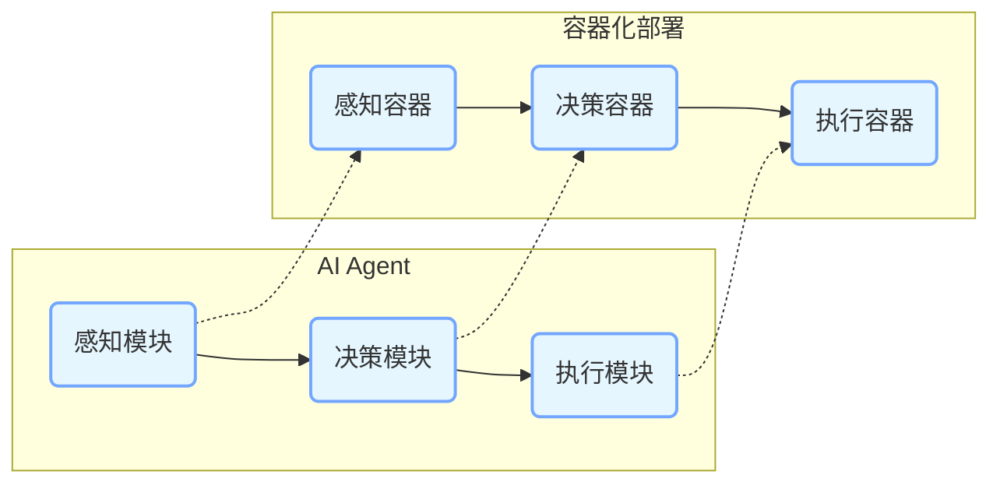

# 容器化部署：简化AI Agent的运维管理

> 关键词：容器化部署、AI Agent、运维管理、Docker、Kubernetes

> 摘要：本文围绕容器化部署在简化AI Agent运维管理方面展开深入探讨。首先介绍了容器化部署和AI Agent的背景知识，包括目的、预期读者、文档结构和相关术语。接着阐述了核心概念与联系，给出了相应的原理和架构示意图及流程图。详细讲解了核心算法原理，并用Python代码进行说明，同时介绍了相关的数学模型和公式。通过项目实战，展示了开发环境搭建、源代码实现与解读。分析了容器化部署在AI Agent中的实际应用场景，推荐了学习资源、开发工具框架和相关论文著作。最后总结了未来发展趋势与挑战，并给出常见问题解答和扩展阅读参考资料，旨在帮助读者全面了解如何利用容器化部署简化AI Agent的运维管理。

## 1. 背景介绍 
### 1.1 目的和范围
随着人工智能技术的飞速发展，AI Agent在各个领域得到了广泛应用。然而，AI Agent的运维管理面临着诸多挑战，如环境配置复杂、资源管理困难、部署和扩展不灵活等。容器化部署作为一种轻量级的虚拟化技术，为解决这些问题提供了有效的解决方案。本文的目的是深入探讨容器化部署如何简化AI Agent的运维管理，涵盖容器化部署的基本原理、核心算法、数学模型、项目实战以及实际应用场景等方面。

### 1.2 预期读者
本文适合对人工智能和容器化技术感兴趣的技术人员，包括AI开发者、运维工程师、软件架构师等。同时，对于希望了解如何优化AI Agent运维管理的企业管理人员和技术决策者也具有一定的参考价值。

### 1.3 文档结构概述
本文将按照以下结构进行组织：首先介绍相关背景知识，包括目的、预期读者和文档结构；接着阐述容器化部署和AI Agent的核心概念与联系，给出原理和架构示意图及流程图；详细讲解核心算法原理，并用Python代码进行说明；介绍相关的数学模型和公式；通过项目实战展示开发环境搭建、源代码实现与解读；分析实际应用场景；推荐学习资源、开发工具框架和相关论文著作；最后总结未来发展趋势与挑战，给出常见问题解答和扩展阅读参考资料。

### 1.4 术语表
#### 1.4.1 核心术语定义
- **容器化部署**：将应用程序及其依赖项打包成一个独立的容器，实现应用程序在不同环境中的一致性部署。
- **AI Agent**：一种能够感知环境、自主决策并采取行动的人工智能程序。
- **Docker**：一种开源的容器化平台，用于创建、部署和运行容器。
- **Kubernetes**：一个开源的容器编排系统，用于自动化容器的部署、扩展和管理。

#### 1.4.2 相关概念解释
- **容器**：是一种轻量级的虚拟化技术，它将应用程序及其依赖项打包成一个独立的运行单元，与宿主机和其他容器隔离。
- **镜像**：是容器的模板，包含了应用程序及其依赖项的文件系统和配置信息。
- **编排**：是指对多个容器进行自动化管理，包括容器的部署、扩展、调度和监控等。

#### 1.4.3 缩略词列表
- **AI**：Artificial Intelligence，人工智能
- **CI/CD**：Continuous Integration/Continuous Deployment，持续集成/持续部署
- **API**：Application Programming Interface，应用程序编程接口

## 2. 核心概念与联系 
### 核心概念原理
容器化部署的核心原理是将应用程序及其依赖项打包成一个独立的容器，每个容器都有自己的文件系统、进程空间和网络配置，与宿主机和其他容器隔离。这样可以确保应用程序在不同的环境中都能以相同的方式运行，避免了环境配置不一致带来的问题。

AI Agent是一种能够感知环境、自主决策并采取行动的人工智能程序。它通常由多个组件组成，包括感知模块、决策模块和执行模块。每个组件都可以独立开发和部署，通过容器化部署可以将这些组件打包成不同的容器，实现组件之间的解耦和独立管理。

### 架构示意图


### 架构说明
从架构示意图可以看出，AI Agent的各个模块（感知模块、决策模块和执行模块）分别对应容器化部署中的不同容器（感知容器、决策容器和执行容器）。这种架构使得每个模块可以独立开发、测试和部署，提高了开发效率和可维护性。同时，容器化部署还可以实现资源的隔离和管理，确保每个模块都能在独立的环境中运行，避免了模块之间的相互干扰。

## 3. 核心算法原理 & 具体操作步骤 
### 核心算法原理
在容器化部署中，核心算法主要涉及容器的创建、启动、停止和销毁等操作。下面以Docker为例，介绍这些操作的核心算法原理。

#### 容器创建
容器创建的核心算法原理是根据镜像创建一个新的容器实例。具体步骤如下：
1. 检查镜像是否存在，如果不存在则从镜像仓库中拉取。
2. 创建一个新的容器实例，分配唯一的容器ID。
3. 为容器实例分配资源，如CPU、内存和磁盘空间等。
4. 初始化容器的文件系统和网络配置。

#### 容器启动
容器启动的核心算法原理是启动容器内的主进程。具体步骤如下：
1. 检查容器是否处于停止状态。
2. 启动容器内的主进程。
3. 监控容器的运行状态。

#### 容器停止
容器停止的核心算法原理是停止容器内的主进程。具体步骤如下：
1. 发送停止信号给容器内的主进程。
2. 等待主进程正常退出。
3. 如果主进程在规定时间内没有退出，则强制终止。

#### 容器销毁
容器销毁的核心算法原理是删除容器实例和相关的资源。具体步骤如下：
1. 停止容器内的主进程。
2. 删除容器实例。
3. 释放容器占用的资源。

### 具体操作步骤（Python代码实现）
```python
import docker

# 创建Docker客户端
client = docker.from_env()

# 容器创建
def create_container(image_name, container_name):
    try:
        # 检查镜像是否存在
        client.images.get(image_name)
    except docker.errors.ImageNotFound:
        # 从镜像仓库中拉取镜像
        client.images.pull(image_name)
    
    # 创建容器实例
    container = client.containers.create(
        image=image_name,
        name=container_name,
        detach=True
    )
    return container

# 容器启动
def start_container(container):
    container.start()

# 容器停止
def stop_container(container):
    container.stop()

# 容器销毁
def remove_container(container):
    container.remove()

# 示例使用
if __name__ == "__main__":
    image_name = "nginx:latest"
    container_name = "my_nginx_container"
    
    # 创建容器
    container = create_container(image_name, container_name)
    
    # 启动容器
    start_container(container)
    
    # 停止容器
    stop_container(container)
    
    # 销毁容器
    remove_container(container)
```

### 代码解释
上述代码使用Python的`docker`库实现了容器的创建、启动、停止和销毁操作。具体解释如下：
1. **创建Docker客户端**：使用`docker.from_env()`创建一个Docker客户端，用于与Docker守护进程进行通信。
2. **容器创建**：`create_container`函数首先检查镜像是否存在，如果不存在则从镜像仓库中拉取。然后使用`client.containers.create`方法创建一个新的容器实例。
3. **容器启动**：`start_container`函数使用`container.start()`方法启动容器内的主进程。
4. **容器停止**：`stop_container`函数使用`container.stop()`方法停止容器内的主进程。
5. **容器销毁**：`remove_container`函数使用`container.remove()`方法删除容器实例。

## 4. 数学模型和公式 & 详细讲解 & 举例说明 
### 资源分配模型
在容器化部署中，资源分配是一个重要的问题。为了实现资源的高效利用，需要建立一个合理的资源分配模型。下面介绍一个简单的资源分配模型。

#### 数学模型
假设存在 $n$ 个容器，每个容器的资源需求为 $r_i$（$i = 1, 2, \cdots, n$），宿主机的总资源为 $R$。目标是将宿主机的资源分配给各个容器，使得所有容器的资源需求得到满足，同时尽量减少资源的浪费。

可以将这个问题转化为一个线性规划问题：

$$
\begin{aligned}
\min &\sum_{i=1}^{n} (x_i r_i - r_i)^2 \\
\text{s.t.} &\sum_{i=1}^{n} x_i r_i \leq R \\
&0 \leq x_i \leq 1, \quad i = 1, 2, \cdots, n
\end{aligned}
$$

其中，$x_i$ 表示第 $i$ 个容器的资源分配比例。

#### 详细讲解
上述数学模型的目标是最小化所有容器的资源分配误差的平方和。约束条件表示所有容器分配的资源总和不能超过宿主机的总资源，并且每个容器的资源分配比例在 $0$ 到 $1$ 之间。

#### 举例说明
假设存在 $3$ 个容器，资源需求分别为 $r_1 = 2$，$r_2 = 3$，$r_3 = 4$，宿主机的总资源为 $R = 8$。使用Python的`scipy.optimize`库求解上述线性规划问题：

```python
import numpy as np
from scipy.optimize import minimize

# 资源需求
r = np.array([2, 3, 4])

# 目标函数
def objective(x):
    return np.sum((x * r - r) ** 2)

# 约束条件
constraints = [
    {'type': 'ineq', 'fun': lambda x: 8 - np.sum(x * r)},
    {'type': 'ineq', 'fun': lambda x: x[0]},
    {'type': 'ineq', 'fun': lambda x: 1 - x[0]},
    {'type': 'ineq', 'fun': lambda x: x[1]},
    {'type': 'ineq', 'fun': lambda x: 1 - x[1]},
    {'type': 'ineq', 'fun': lambda x: x[2]},
    {'type': 'ineq', 'fun': lambda x: 1 - x[2]}
]

# 初始猜测
x0 = np.array([0.5, 0.5, 0.5])

# 求解线性规划问题
result = minimize(objective, x0, constraints=constraints)

# 输出结果
print("最优资源分配比例:", result.x)
```

运行上述代码，得到的最优资源分配比例为 $x_1 \approx 0.8$，$x_2 \approx 0.667$，$x_3 \approx 0.5$。

## 5. 项目实战：代码实际案例和详细解释说明 
### 5.1  开发环境搭建
#### 安装Docker
Docker是一种开源的容器化平台，用于创建、部署和运行容器。可以按照以下步骤安装Docker：
1. **Ubuntu系统**：
```bash
# 更新系统软件包
sudo apt-get update

# 安装必要的依赖包
sudo apt-get install apt-transport-https ca-certificates curl software-properties-common

# 添加Docker官方GPG密钥
curl -fsSL https://download.docker.com/linux/ubuntu/gpg | sudo apt-key add -

# 添加Docker软件源
sudo add-apt-repository "deb [arch=amd64] https://download.docker.com/linux/ubuntu $(lsb_release -cs) stable"

# 更新软件包索引
sudo apt-get update

# 安装Docker CE
sudo apt-get install docker-ce
```
2. **CentOS系统**：
```bash
# 卸载旧版本的Docker
sudo yum remove docker docker-client docker-client-latest docker-common docker-latest docker-latest-logrotate docker-logrotate docker-engine

# 安装必要的依赖包
sudo yum install -y yum-utils device-mapper-persistent-data lvm2

# 添加Docker软件源
sudo yum-config-manager --add-repo https://download.docker.com/linux/centos/docker-ce.repo

# 安装Docker CE
sudo yum install docker-ce docker-ce-cli containerd.io
```

#### 安装Docker Compose
Docker Compose是一个用于定义和运行多容器Docker应用的工具。可以按照以下步骤安装Docker Compose：
```bash
# 下载Docker Compose二进制文件
sudo curl -L "https://github.com/docker/compose/releases/download/1.29.2/docker-compose-$(uname -s)-$(uname -m)" -o /usr/local/bin/docker-compose

# 添加执行权限
sudo chmod +x /usr/local/bin/docker-compose

# 验证安装
docker-compose --version
```

### 5.2  源代码详细实现和代码解读
#### 项目结构
假设我们要开发一个简单的AI Agent应用，包含一个感知模块、一个决策模块和一个执行模块。项目结构如下：
```
ai_agent_project/
├── perception_module/
│   ├── Dockerfile
│   └── app.py
├── decision_module/
│   ├── Dockerfile
│   └── app.py
├── execution_module/
│   ├── Dockerfile
│   └── app.py
└── docker-compose.yml
```

#### 感知模块代码实现
`perception_module/app.py`：
```python
import time

def perceive():
    while True:
        print("Perceiving environment...")
        time.sleep(5)

if __name__ == "__main__":
    perceive()
```

`perception_module/Dockerfile`：
```Dockerfile
# 基础镜像
FROM python:3.8-slim

# 设置工作目录
WORKDIR /app

# 复制应用代码
COPY..

# 安装依赖
RUN pip install --no-cache-dir -r requirements.txt

# 运行应用
CMD ["python", "app.py"]
```

#### 决策模块代码实现
`decision_module/app.py`：
```python
import time

def decide():
    while True:
        print("Making decisions...")
        time.sleep(5)

if __name__ == "__main__":
    decide()
```

`decision_module/Dockerfile`：
```Dockerfile
# 基础镜像
FROM python:3.8-slim

# 设置工作目录
WORKDIR /app

# 复制应用代码
COPY..

# 安装依赖
RUN pip install --no-cache-dir -r requirements.txt

# 运行应用
CMD ["python", "app.py"]
```

#### 执行模块代码实现
`execution_module/app.py`：
```python
import time

def execute():
    while True:
        print("Executing actions...")
        time.sleep(5)

if __name__ == "__main__":
    execute()
```

`execution_module/Dockerfile`：
```Dockerfile
# 基础镜像
FROM python:3.8-slim

# 设置工作目录
WORKDIR /app

# 复制应用代码
COPY..

# 安装依赖
RUN pip install --no-cache-dir -r requirements.txt

# 运行应用
CMD ["python", "app.py"]
```

#### Docker Compose文件
`docker-compose.yml`：
```yaml
version: '3'
services:
  perception:
    build:./perception_module
    restart: always
  decision:
    build:./decision_module
    restart: always
  execution:
    build:./execution_module
    restart: always
```

### 5.3  代码解读与分析
#### 感知模块
感知模块的主要功能是感知环境信息。在`app.py`中，定义了一个`perceive`函数，该函数会不断地打印“Perceiving environment...”信息。在`Dockerfile`中，使用`python:3.8-slim`作为基础镜像，将应用代码复制到容器中，安装依赖并运行应用。

#### 决策模块
决策模块的主要功能是根据感知到的环境信息做出决策。在`app.py`中，定义了一个`decide`函数，该函数会不断地打印“Making decisions...”信息。在`Dockerfile`中，同样使用`python:3.8-slim`作为基础镜像，将应用代码复制到容器中，安装依赖并运行应用。

#### 执行模块
执行模块的主要功能是根据决策结果执行相应的行动。在`app.py`中，定义了一个`execute`函数，该函数会不断地打印“Executing actions...”信息。在`Dockerfile`中，也是使用`python:3.8-slim`作为基础镜像，将应用代码复制到容器中，安装依赖并运行应用。

#### Docker Compose文件
`docker-compose.yml`文件用于定义和运行多容器Docker应用。在该文件中，定义了三个服务：`perception`、`decision`和`execution`，分别对应感知模块、决策模块和执行模块。使用`build`指令指定每个服务的Dockerfile所在目录，`restart: always`表示容器在退出时会自动重启。

## 6. 实际应用场景 
### 智能客服系统
在智能客服系统中，AI Agent可以通过容器化部署实现快速迭代和弹性扩展。感知模块可以通过容器化部署实现对用户输入的实时感知，决策模块可以根据用户输入做出相应的决策，执行模块可以将决策结果返回给用户。通过容器化部署，可以将每个模块独立开发和部署，提高开发效率和可维护性。同时，当用户流量增加时，可以通过扩展容器实例的数量来满足需求。

### 智能物流系统
在智能物流系统中，AI Agent可以用于货物的调度和配送。感知模块可以通过传感器实时感知货物的位置和状态，决策模块可以根据货物的位置和状态做出最优的调度决策，执行模块可以控制机器人或车辆进行货物的搬运和配送。通过容器化部署，可以实现各个模块的独立运行和管理，提高系统的可靠性和稳定性。

### 智能医疗系统
在智能医疗系统中，AI Agent可以用于疾病的诊断和治疗建议。感知模块可以通过医疗设备采集患者的生理数据，决策模块可以根据患者的生理数据和病历信息做出疾病诊断和治疗建议，执行模块可以将诊断和建议反馈给医生和患者。通过容器化部署，可以确保各个模块在不同的医疗环境中都能稳定运行，提高医疗服务的质量和效率。

## 7. 工具和资源推荐
### 7.1 学习资源推荐
#### 7.1.1 书籍推荐
- 《Docker实战》：全面介绍了Docker的基本概念、使用方法和实践案例，适合初学者学习。
- 《Kubernetes实战》：详细讲解了Kubernetes的核心原理、架构和实际应用，是学习Kubernetes的经典书籍。
- 《Python人工智能实战》：通过实际案例介绍了Python在人工智能领域的应用，包括机器学习、深度学习等方面。

#### 7.1.2 在线课程
- Coursera上的“Docker and Kubernetes: The Complete Guide”：由知名讲师授课，系统地介绍了Docker和Kubernetes的使用方法和实践技巧。
- Udemy上的“Artificial Intelligence A-Z™: Learn How To Build An AI”：涵盖了人工智能的各个方面，包括AI Agent的开发和应用。
- edX上的“Introduction to Artificial Intelligence”：由麻省理工学院的教授授课，是一门经典的人工智能入门课程。

#### 7.1.3 技术博客和网站
- Docker官方博客：提供了Docker的最新动态、技术文章和实践案例。
- Kubernetes官方博客：发布了Kubernetes的最新版本信息、技术文档和使用教程。
- Medium上的人工智能相关博客：汇聚了众多人工智能领域的专家和开发者，分享了最新的技术和研究成果。

### 7.2 开发工具框架推荐
#### 7.2.1 IDE和编辑器
- Visual Studio Code：一款轻量级的代码编辑器，支持多种编程语言和插件扩展，适合开发容器化应用。
- PyCharm：专业的Python集成开发环境，提供了丰富的代码编辑、调试和测试功能，适合Python开发。
- IntelliJ IDEA：一款功能强大的Java集成开发环境，也支持多种其他编程语言，适合开发大型的容器化应用。

#### 7.2.2 调试和性能分析工具
- Docker Desktop：提供了图形化的界面，方便用户管理和调试Docker容器。
- Kubernetes Dashboard：是Kubernetes的官方Web界面，用于监控和管理Kubernetes集群。
- cAdvisor：用于收集和分析容器的性能指标，帮助用户优化容器的资源使用。

#### 7.2.3 相关框架和库
- TensorFlow：一个开源的机器学习框架，广泛应用于人工智能领域，支持容器化部署。
- PyTorch：另一个流行的深度学习框架，具有简洁易用的特点，也可以在容器中运行。
- Flask：一个轻量级的Python Web框架，适合开发AI Agent的Web接口。

### 7.3 相关论文著作推荐
#### 7.3.1 经典论文
- “Containerization: A Step Forward in Virtualization”：介绍了容器化技术的基本原理和优势，是容器化领域的经典论文。
- “Kubernetes: A Distributed Operating System for Containerized Applications”：阐述了Kubernetes的核心架构和设计理念，对理解Kubernetes有重要的参考价值。
- “Artificial Intelligence: A Modern Approach”：是人工智能领域的经典教材，系统地介绍了人工智能的各个方面。

#### 7.3.2 最新研究成果
- 每年的ACM SIGKDD、NeurIPS等顶级学术会议上都会发表大量关于人工智能和容器化技术的最新研究成果，可以关注这些会议的论文。
- arXiv.org是一个预印本平台，上面有很多关于人工智能和容器化技术的最新研究论文，可以及时了解该领域的最新动态。

#### 7.3.3 应用案例分析
- Google、Amazon等科技巨头经常会分享他们在人工智能和容器化技术方面的应用案例，可以关注这些公司的技术博客和官方网站。
- 一些开源项目，如OpenAI Gym、TensorFlow Serving等，也提供了丰富的应用案例和文档，可以学习借鉴。

## 8. 总结：未来发展趋势与挑战
### 未来发展趋势
- **智能化升级**：随着人工智能技术的不断发展，AI Agent将变得更加智能，能够处理更加复杂的任务。容器化部署将为AI Agent的智能化升级提供有力的支持，使得AI Agent可以更加灵活地部署和运行。
- **混合云部署**：越来越多的企业开始采用混合云架构，将容器化部署应用于混合云环境中。通过容器化部署，AI Agent可以在公有云、私有云和边缘计算设备之间自由迁移，实现资源的最优配置。
- **安全性能提升**：容器化部署的安全问题一直是人们关注的焦点。未来，将会有更多的安全技术和解决方案应用于容器化部署中，提高AI Agent的安全性能。

### 挑战
- **资源管理难度大**：随着AI Agent的规模不断扩大，容器化部署的资源管理难度也会增加。如何实现资源的高效分配和调度，是一个亟待解决的问题。
- **网络通信复杂性**：AI Agent通常需要与多个组件进行通信，容器化部署会增加网络通信的复杂性。如何优化网络通信，提高系统的性能和可靠性，是一个挑战。
- **安全漏洞风险**：容器化部署虽然提供了一定的隔离性，但仍然存在安全漏洞风险。如何及时发现和修复安全漏洞，保障AI Agent的安全运行，是一个重要的问题。

## 9. 附录：常见问题与解答
### 容器化部署和虚拟机部署有什么区别？
容器化部署和虚拟机部署都是虚拟化技术，但它们有以下区别：
- **隔离级别**：容器化部署的隔离级别相对较低，容器共享宿主机的操作系统内核；而虚拟机部署的隔离级别较高，每个虚拟机都有自己独立的操作系统。
- **资源占用**：容器化部署的资源占用较小，启动速度快；而虚拟机部署的资源占用较大，启动速度慢。
- **部署灵活性**：容器化部署的部署灵活性较高，可以快速创建、启动和销毁容器；而虚拟机部署的部署灵活性较低，创建和销毁虚拟机需要较长的时间。

### 如何监控容器化部署的AI Agent？
可以使用以下工具来监控容器化部署的AI Agent：
- **Docker自带的监控工具**：Docker提供了一些命令行工具，如`docker stats`和`docker top`，可以实时监控容器的资源使用情况和进程信息。
- **第三方监控工具**：如Prometheus和Grafana，可以收集和展示容器的性能指标，帮助用户监控AI Agent的运行状态。
- **Kubernetes的监控功能**：如果使用Kubernetes进行容器编排，可以使用Kubernetes的内置监控功能，如Heapster和Metrics Server，来监控容器化部署的AI Agent。

### 容器化部署的AI Agent如何进行故障排查？
可以按照以下步骤进行故障排查：
1. **查看容器日志**：使用`docker logs`命令查看容器的日志信息，了解容器的运行情况和错误信息。
2. **检查容器状态**：使用`docker ps`命令检查容器的状态，确保容器正在运行。
3. **查看网络配置**：检查容器的网络配置，确保容器可以正常通信。
4. **检查资源使用情况**：使用`docker stats`命令查看容器的资源使用情况，确保容器没有出现资源瓶颈。
5. **使用调试工具**：如果以上方法无法解决问题，可以使用调试工具，如`docker exec`命令进入容器内部进行调试。

## 10. 扩展阅读 & 参考资料
### 扩展阅读
- 《微服务架构设计模式》：介绍了微服务架构的设计原则和实践经验，对于理解容器化部署和AI Agent的架构设计有一定的帮助。
- 《人工智能简史》：回顾了人工智能的发展历程，了解人工智能的发展趋势和未来方向。
- 《云计算与分布式系统：从并行处理到物联网》：介绍了云计算和分布式系统的基本概念和技术，对于理解容器化部署的底层原理有一定的帮助。

### 参考资料
- Docker官方文档：https://docs.docker.com/
- Kubernetes官方文档：https://kubernetes.io/docs/
- TensorFlow官方文档：https://www.tensorflow.org/
- PyTorch官方文档：https://pytorch.org/docs/

作者：AI天才研究院/AI Genius Institute & 禅与计算机程序设计艺术 /Zen And The Art of Computer Programming