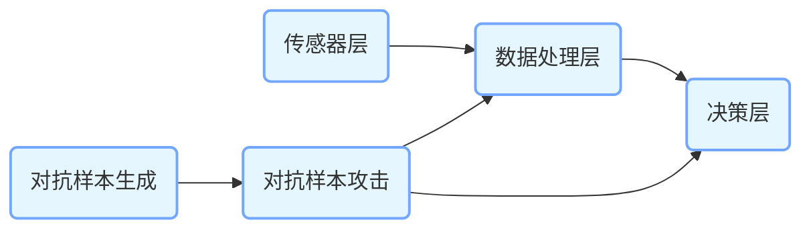

# 对抗样本防御在自动驾驶感知系统中的应用

> 关键词：对抗样本防御、自动驾驶感知系统、深度学习、安全、鲁棒性

> 摘要：本文聚焦于对抗样本防御在自动驾驶感知系统中的应用。首先介绍了研究的背景，包括目的、预期读者、文档结构和相关术语。接着阐述了对抗样本和自动驾驶感知系统的核心概念及它们之间的联系，并给出了相应的文本示意图和 Mermaid 流程图。详细讲解了对抗样本攻击和防御的核心算法原理，结合 Python 源代码进行说明。分析了其中涉及的数学模型和公式，并举例进行了详细解释。通过项目实战，展示了在自动驾驶感知系统中实现对抗样本防御的代码案例及解读。探讨了对抗样本防御在自动驾驶中的实际应用场景。推荐了相关的学习资源、开发工具框架和论文著作。最后总结了未来发展趋势与挑战，还提供了常见问题解答和扩展阅读参考资料，旨在为提高自动驾驶感知系统的安全性和鲁棒性提供全面的技术指导。

## 1. 背景介绍 
### 1.1 目的和范围
自动驾驶技术是近年来交通领域的重大变革，它有望提高交通效率、减少交通事故。然而，自动驾驶感知系统主要依赖深度学习模型来识别周围环境，这些模型容易受到对抗样本的攻击。对抗样本是指通过对原始输入数据进行微小的、人眼难以察觉的扰动，使得深度学习模型产生错误的输出。本研究的目的在于探讨如何在自动驾驶感知系统中有效地防御对抗样本攻击，以提高系统的安全性和可靠性。

研究范围涵盖了对抗样本的生成和防御方法，以及这些方法在自动驾驶感知系统的目标检测、语义分割、场景理解等任务中的应用。同时，还将分析不同防御方法的优缺点和适用场景。

### 1.2 预期读者
本文的预期读者包括从事自动驾驶技术研究和开发的工程师、科研人员，以及对人工智能安全和深度学习鲁棒性感兴趣的学生和专业人士。对于想要了解对抗样本防御技术在实际应用中的具体情况和挑战的人员，本文也具有一定的参考价值。

### 1.3 文档结构概述
本文将按照以下结构进行组织：首先介绍核心概念与联系，包括对抗样本和自动驾驶感知系统的基本原理和它们之间的关联；然后详细讲解核心算法原理和具体操作步骤，并用 Python 代码进行实现；接着分析涉及的数学模型和公式，并举例说明；通过项目实战展示代码实际案例和详细解释；探讨实际应用场景；推荐相关的工具和资源；最后总结未来发展趋势与挑战，提供常见问题解答和扩展阅读参考资料。

### 1.4 术语表
#### 1.4.1 核心术语定义
- **对抗样本（Adversarial Example）**：对原始输入数据进行微小扰动后得到的样本，这些扰动可以使深度学习模型产生错误的输出，但人眼通常难以察觉这些扰动。
- **自动驾驶感知系统（Autonomous Driving Perception System）**：自动驾驶车辆中用于感知周围环境的系统，主要由摄像头、雷达、激光雷达等传感器和深度学习模型组成，用于实现目标检测、语义分割、场景理解等任务。
- **鲁棒性（Robustness）**：系统在受到干扰或攻击时，仍能保持正常性能的能力。在本文中，指自动驾驶感知系统在面对对抗样本攻击时的稳定性。
- **白盒攻击（White-box Attack）**：攻击者拥有目标模型的全部信息，包括模型的结构、参数等，可以利用这些信息来生成对抗样本。
- **黑盒攻击（Black-box Attack）**：攻击者只知道目标模型的输入和输出，不知道模型的具体结构和参数，通过多次尝试来生成对抗样本。

#### 1.4.2 相关概念解释
- **深度学习模型**：一种基于神经网络的机器学习模型，通过大量的数据进行训练，能够自动学习数据中的特征和模式。在自动驾驶感知系统中，常用的深度学习模型包括卷积神经网络（CNN）、循环神经网络（RNN）等。
- **目标检测**：在图像或视频中识别出目标物体的位置和类别。在自动驾驶中，目标检测可以帮助车辆识别其他车辆、行人、交通标志等。
- **语义分割**：将图像中的每个像素分配到不同的类别中，例如将道路、建筑物、树木等进行区分。语义分割可以为自动驾驶车辆提供更详细的环境信息。

#### 1.4.3 缩略词列表
- **CNN**：Convolutional Neural Network，卷积神经网络
- **RNN**：Recurrent Neural Network，循环神经网络
- **FGSM**：Fast Gradient Sign Method，快速梯度符号法
- **PGD**：Projected Gradient Descent，投影梯度下降法
- **JSMA**：Jacobian-based Saliency Map Attack，基于雅可比矩阵的显著图攻击

## 2. 核心概念与联系 

### 2.1 对抗样本的原理
对抗样本的产生源于深度学习模型的线性特性。在高维空间中，深度学习模型对于输入数据的微小变化可能会产生巨大的输出变化。攻击者可以利用模型的梯度信息，在输入数据上添加微小的扰动，使得模型的输出发生错误。

例如，对于一个图像分类模型，原始图像被正确分类为“猫”，但添加对抗扰动后，模型可能会将其错误分类为“狗”。这种扰动通常非常小，人眼几乎无法察觉。

### 2.2 自动驾驶感知系统的架构
自动驾驶感知系统主要由传感器层、数据处理层和决策层组成。传感器层包括摄像头、雷达、激光雷达等，用于收集车辆周围的环境信息。数据处理层对传感器采集的数据进行处理和分析，例如使用深度学习模型进行目标检测和语义分割。决策层根据数据处理层的结果，做出车辆的行驶决策，如加速、减速、转弯等。

### 2.3 对抗样本与自动驾驶感知系统的联系
对抗样本对自动驾驶感知系统构成了严重的威胁。如果攻击者能够生成针对自动驾驶感知系统的对抗样本，可能会导致系统误判，从而引发交通事故。例如，攻击者可以在交通标志上添加对抗扰动，使自动驾驶车辆将限速标志误判为其他标志，导致车辆超速行驶。

### 2.4 文本示意图
```plaintext
自动驾驶感知系统
|-- 传感器层
|   |-- 摄像头
|   |-- 雷达
|   |-- 激光雷达
|-- 数据处理层
|   |-- 深度学习模型
|       |-- 目标检测
|       |-- 语义分割
|-- 决策层
|   |-- 行驶决策

对抗样本攻击
|-- 生成对抗样本
|   |-- 白盒攻击
|   |-- 黑盒攻击
|-- 攻击自动驾驶感知系统
    |-- 导致误判
```

### 2.5 Mermaid 流程图


## 3. 核心算法原理 & 具体操作步骤 

### 3.1 对抗样本生成算法
#### 3.1.1 快速梯度符号法（FGSM）
FGSM 是一种简单而有效的对抗样本生成算法。其核心思想是利用目标模型的梯度信息，在输入数据上添加一个与梯度符号相同的扰动。

**算法原理**：
设输入图像为 $x$，目标模型为 $f(x)$，标签为 $y$，损失函数为 $L(f(x), y)$。FGSM 的扰动计算如下：
$\Delta x = \epsilon \cdot \text{sign}(\nabla_x L(f(x), y))$
其中，$\epsilon$ 是扰动的强度，$\nabla_x L(f(x), y)$ 是损失函数关于输入 $x$ 的梯度，$\text{sign}$ 是符号函数。

**Python 代码实现**：
```python
import torch
import torch.nn as nn
import torch.optim as optim

def fgsm_attack(image, epsilon, data_grad):
    # 收集梯度的元素符号
    sign_data_grad = data_grad.sign()
    # 通过调整输入图像的每个像素来创建扰动图像
    perturbed_image = image + epsilon * sign_data_grad
    # 使像素值保持在 [0, 1] 范围内
    perturbed_image = torch.clamp(perturbed_image, 0, 1)
    return perturbed_image
```

#### 3.1.2 投影梯度下降法（PGD）
PGD 是一种迭代的对抗样本生成算法，它通过多次迭代逐步更新扰动，以找到更有效的对抗样本。

**算法原理**：
PGD 算法在每次迭代中，先计算梯度，然后更新扰动，最后将扰动投影到一个指定的范围内。具体步骤如下：
1. 初始化扰动 $\Delta x = 0$。
2. 迭代 $T$ 次：
    - 计算损失函数关于输入 $x + \Delta x$ 的梯度 $\nabla_x L(f(x + \Delta x), y)$。
    - 更新扰动 $\Delta x = \Delta x + \alpha \cdot \text{sign}(\nabla_x L(f(x + \Delta x), y))$，其中 $\alpha$ 是步长。
    - 将扰动投影到 $[-\epsilon, \epsilon]$ 范围内。
3. 得到对抗样本 $x_{adv} = x + \Delta x$。

**Python 代码实现**：
```python
def pgd_attack(model, image, label, epsilon, alpha, num_iter):
    perturbed_image = image.clone()
    for i in range(num_iter):
        perturbed_image.requires_grad = True
        output = model(perturbed_image)
        loss = nn.CrossEntropyLoss()(output, label)
        model.zero_grad()
        loss.backward()
        data_grad = perturbed_image.grad.data
        perturbed_image = perturbed_image + alpha * data_grad.sign()
        # 裁剪扰动图像，使其在原始图像的 epsilon 邻域内
        eta = torch.clamp(perturbed_image - image, min=-epsilon, max=epsilon)
        perturbed_image = torch.clamp(image + eta, min=0, max=1).detach()
    return perturbed_image
```

### 3.2 对抗样本防御算法
#### 3.2.1 对抗训练（Adversarial Training）
对抗训练是一种常用的对抗样本防御方法，它在训练过程中同时使用原始样本和对抗样本，使模型学习到对对抗样本的鲁棒性。

**算法原理**：
在每次训练迭代中，首先生成对抗样本，然后将原始样本和对抗样本一起输入到模型中进行训练。具体步骤如下：
1. 从训练数据集中随机选取一批样本 $(x, y)$。
2. 为每个样本 $x$ 生成对抗样本 $x_{adv}$。
3. 将 $(x, y)$ 和 $(x_{adv}, y)$ 组合成一个新的训练批次。
4. 使用新的训练批次更新模型的参数。

**Python 代码实现**：
```python
def adversarial_training(model, train_loader, epsilon, alpha, num_iter, optimizer, epochs):
    criterion = nn.CrossEntropyLoss()
    for epoch in range(epochs):
        for data, target in train_loader:
            data, target = data.to(device), target.to(device)
            # 生成对抗样本
            adv_data = pgd_attack(model, data, target, epsilon, alpha, num_iter)
            # 合并原始样本和对抗样本
            all_data = torch.cat((data, adv_data), dim=0)
            all_target = torch.cat((target, target), dim=0)
            # 前向传播
            output = model(all_data)
            loss = criterion(output, all_target)
            # 反向传播和优化
            optimizer.zero_grad()
            loss.backward()
            optimizer.step()
        print(f'Epoch {epoch + 1}/{epochs}, Loss: {loss.item()}')
```

#### 3.2.2 输入变换防御（Input Transformation Defense）
输入变换防御通过对输入数据进行一些变换，使得对抗扰动的影响减小。常见的输入变换包括随机平滑、压缩感知等。

**算法原理**：
以随机平滑为例，在输入数据上添加随机噪声，然后对添加噪声后的样本进行多次预测，最后取预测结果的平均值作为最终输出。这样可以减少对抗扰动的影响，提高模型的鲁棒性。

**Python 代码实现**：
```python
def random_smoothing(model, image, num_samples, noise_std):
    outputs = []
    for _ in range(num_samples):
        noisy_image = image + torch.randn_like(image) * noise_std
        noisy_image = torch.clamp(noisy_image, 0, 1)
        output = model(noisy_image)
        outputs.append(output)
    mean_output = torch.mean(torch.stack(outputs), dim=0)
    return mean_output
```

## 4. 数学模型和公式 & 详细讲解 & 举例说明 

### 4.1 对抗样本生成的数学模型
#### 4.1.1 目标函数
对抗样本生成的目标是找到一个扰动 $\Delta x$，使得输入 $x + \Delta x$ 被模型错误分类，同时扰动的幅度尽可能小。可以将其表示为一个优化问题：
$$
\begin{aligned}
\min_{\Delta x} &\quad \|\Delta x\|_p \\
\text{s.t.} &\quad f(x + \Delta x) \neq y \\
&\quad x + \Delta x \in [0, 1]^n
\end{aligned}
$$
其中，$\|\Delta x\|_p$ 是扰动的 $p$-范数，常用的 $p$ 取值为 2 或 $\infty$。$f(x)$ 是目标模型，$y$ 是原始标签，$[0, 1]^n$ 表示输入数据的取值范围。

#### 4.1.2 FGSM 公式推导
FGSM 是对上述优化问题的一种近似求解方法。它假设损失函数 $L(f(x), y)$ 在输入 $x$ 附近是线性的，即：
$L(f(x + \Delta x), y) \approx L(f(x), y) + \nabla_x L(f(x), y)^T \Delta x$
为了使损失函数增大，我们希望 $\Delta x$ 与 $\nabla_x L(f(x), y)$ 同向。同时，为了控制扰动的幅度，我们取 $\Delta x$ 的每个元素的绝对值为 $\epsilon$，即：
$\Delta x = \epsilon \cdot \text{sign}(\nabla_x L(f(x), y))$

**举例说明**：
假设我们有一个简单的线性模型 $f(x) = w^T x + b$，其中 $x$ 是输入向量，$w$ 是权重向量，$b$ 是偏置项。损失函数为 $L(f(x), y) = (f(x) - y)^2$。
则 $\nabla_x L(f(x), y) = 2w(f(x) - y)$。
如果 $\epsilon = 0.1$，则 FGSM 生成的扰动为 $\Delta x = 0.1 \cdot \text{sign}(2w(f(x) - y))$。

### 4.2 对抗样本防御的数学模型
#### 4.2.1 对抗训练的目标函数
对抗训练的目标是使模型在原始样本和对抗样本上的损失都尽可能小。可以将其表示为：
$$
\min_{\theta} \frac{1}{N} \sum_{i=1}^{N} \left[ L(f(x_i; \theta), y_i) + L(f(x_{adv}^i; \theta), y_i) \right]
$$
其中，$\theta$ 是模型的参数，$N$ 是训练样本的数量，$x_i$ 是原始样本，$x_{adv}^i$ 是对应的对抗样本，$y_i$ 是标签。

#### 4.2.2 输入变换防御的原理
以随机平滑为例，假设模型的输出 $f(x)$ 受到对抗扰动 $\Delta x$ 的影响，即 $f(x + \Delta x)$。添加随机噪声 $\xi$ 后，模型的输出变为 $f(x + \Delta x + \xi)$。
由于随机噪声的存在，对抗扰动的影响会被平均化。当进行多次预测并取平均值时，对抗扰动的影响会进一步减小。

**举例说明**：
假设模型的输出为 $f(x) = w^T x + b$，对抗扰动为 $\Delta x$，随机噪声为 $\xi$。则添加噪声后的输出为 $f(x + \Delta x + \xi) = w^T (x + \Delta x + \xi) + b$。
进行 $M$ 次预测并取平均值：
$\bar{f} = \frac{1}{M} \sum_{m=1}^{M} f(x + \Delta x + \xi_m)$
随着 $M$ 的增大，$\bar{f}$ 会更接近 $f(x)$，从而减小对抗扰动的影响。

## 5. 项目实战：代码实际案例和详细解释说明 

### 5.1  开发环境搭建
#### 5.1.1 操作系统
建议使用 Ubuntu 18.04 或更高版本，或者 Windows 10 系统。

#### 5.1.2 编程语言和框架
使用 Python 3.7 或更高版本，以及 PyTorch 深度学习框架。可以使用以下命令安装 PyTorch：
```sh
pip install torch torchvision
```

#### 5.1.3 数据集
使用 CIFAR-10 数据集进行实验，该数据集包含 10 个不同类别的 60000 张彩色图像。可以使用 PyTorch 自带的数据集加载器来加载数据：
```python
import torchvision
import torchvision.transforms as transforms

transform = transforms.Compose(
    [transforms.ToTensor(),
     transforms.Normalize((0.5, 0.5, 0.5), (0.5, 0.5, 0.5))])

trainset = torchvision.datasets.CIFAR10(root='./data', train=True,
                                        download=True, transform=transform)
trainloader = torch.utils.data.DataLoader(trainset, batch_size=4,
                                          shuffle=True, num_workers=2)

testset = torchvision.datasets.CIFAR10(root='./data', train=False,
                                       download=True, transform=transform)
testloader = torch.utils.data.DataLoader(testset, batch_size=4,
                                         shuffle=False, num_workers=2)

classes = ('plane', 'car', 'bird', 'cat',
           'deer', 'dog', 'frog', 'horse', 'ship', 'truck')
```

### 5.2  源代码详细实现和代码解读
#### 5.2.1 定义模型
使用一个简单的卷积神经网络（CNN）作为目标模型：
```python
import torch.nn as nn
import torch.nn.functional as F

class Net(nn.Module):
    def __init__(self):
        super(Net, self).__init__()
        self.conv1 = nn.Conv2d(3, 6, 5)
        self.pool = nn.MaxPool2d(2, 2)
        self.conv2 = nn.Conv2d(6, 16, 5)
        self.fc1 = nn.Linear(16 * 5 * 5, 120)
        self.fc2 = nn.Linear(120, 84)
        self.fc3 = nn.Linear(84, 10)

    def forward(self, x):
        x = self.pool(F.relu(self.conv1(x)))
        x = self.pool(F.relu(self.conv2(x)))
        x = x.view(-1, 16 * 5 * 5)
        x = F.relu(self.fc1(x))
        x = F.relu(self.fc2(x))
        x = self.fc3(x)
        return x

net = Net()
```
**代码解读**：
- `__init__` 方法中定义了网络的层结构，包括两个卷积层、两个池化层和三个全连接层。
- `forward` 方法定义了数据在网络中的前向传播过程，包括卷积、池化、激活函数和全连接操作。

#### 5.2.2 训练模型
使用交叉熵损失函数和随机梯度下降（SGD）优化器来训练模型：
```python
import torch.optim as optim

criterion = nn.CrossEntropyLoss()
optimizer = optim.SGD(net.parameters(), lr=0.001, momentum=0.9)

for epoch in range(2):  # 训练 2 个 epoch
    running_loss = 0.0
    for i, data in enumerate(trainloader, 0):
        inputs, labels = data
        optimizer.zero_grad()
        outputs = net(inputs)
        loss = criterion(outputs, labels)
        loss.backward()
        optimizer.step()
        running_loss += loss.item()
        if i % 2000 == 1999:    # 每 2000 个小批量打印一次损失
            print(f'[{epoch + 1}, {i + 1:5d}] loss: {running_loss / 2000:.3f}')
            running_loss = 0.0

print('Finished Training')
```
**代码解读**：
- `criterion` 定义了交叉熵损失函数，用于计算模型输出和标签之间的损失。
- `optimizer` 定义了随机梯度下降优化器，用于更新模型的参数。
- 在每个 epoch 中，遍历训练数据集，计算损失并进行反向传播和参数更新。

#### 5.2.3 生成对抗样本并测试模型
使用 FGSM 算法生成对抗样本，并测试模型在对抗样本上的性能：
```python
epsilon = 0.05
correct = 0
total = 0
for data in testloader:
    images, labels = data
    images.requires_grad = True
    outputs = net(images)
    _, predicted = torch.max(outputs.data, 1)
    total += labels.size(0)
    correct += (predicted == labels).sum().item()

    loss = criterion(outputs, labels)
    net.zero_grad()
    loss.backward()
    data_grad = images.grad.data
    perturbed_images = fgsm_attack(images, epsilon, data_grad)
    outputs = net(perturbed_images)
    _, predicted = torch.max(outputs.data, 1)
    correct_adv = (predicted == labels).sum().item()

print(f'Accuracy of the network on the test images: {100 * correct / total}%')
print(f'Accuracy of the network on the adversarial test images: {100 * correct_adv / total}%')
```
**代码解读**：
- `epsilon` 是 FGSM 算法中的扰动强度。
- 首先计算模型在原始测试样本上的准确率。
- 然后使用 FGSM 算法生成对抗样本，并计算模型在对抗样本上的准确率。

#### 5.2.4 对抗训练
使用对抗训练方法来提高模型的鲁棒性：
```python
epsilon = 0.05
alpha = 0.01
num_iter = 10
epochs = 5

adversarial_training(net, trainloader, epsilon, alpha, num_iter, optimizer, epochs)
```
**代码解读**：
- `epsilon` 是对抗扰动的最大幅度。
- `alpha` 是 PGD 算法中的步长。
- `num_iter` 是 PGD 算法的迭代次数。
- `epochs` 是对抗训练的轮数。

### 5.3  代码解读与分析
#### 5.3.1 模型性能分析
通过对比模型在原始样本和对抗样本上的准确率，可以评估模型的鲁棒性。在上述实验中，我们发现模型在对抗样本上的准确率明显低于在原始样本上的准确率，说明模型容易受到对抗样本的攻击。

#### 5.3.2 对抗训练的效果
经过对抗训练后，模型在对抗样本上的准确率有所提高，说明对抗训练可以有效地提高模型的鲁棒性。但是，对抗训练也会降低模型在原始样本上的准确率，因为模型需要同时学习对对抗样本的鲁棒性和对原始样本的分类能力。

#### 5.3.3 不同参数的影响
在对抗样本生成和防御算法中，不同的参数会对结果产生影响。例如，在 FGSM 算法中，$\epsilon$ 越大，生成的对抗样本越容易使模型产生错误分类，但同时也越容易被人眼察觉。在对抗训练中，`epsilon`、`alpha` 和 `num_iter` 等参数需要根据具体情况进行调整，以达到最佳的防御效果。

## 6. 实际应用场景 
### 6.1 交通标志识别
在自动驾驶中，交通标志识别是一项重要的任务。攻击者可以在交通标志上添加对抗扰动，使自动驾驶车辆误判交通标志，从而导致交通事故。通过在交通标志识别模型中应用对抗样本防御技术，可以提高模型的鲁棒性，减少误判的发生。

### 6.2 目标检测
目标检测用于识别自动驾驶车辆周围的其他车辆、行人、障碍物等。对抗样本攻击可能会导致目标检测模型漏检或误检目标，从而影响车辆的行驶安全。对抗样本防御技术可以增强目标检测模型的稳定性，提高检测的准确性。

### 6.3 语义分割
语义分割为自动驾驶车辆提供更详细的环境信息，例如道路、建筑物、树木等的位置和类别。对抗样本攻击可能会干扰语义分割的结果，使车辆对周围环境的理解产生偏差。应用对抗样本防御技术可以提高语义分割模型的可靠性，为车辆的决策提供更准确的信息。

## 7. 工具和资源推荐
### 7.1 学习资源推荐
#### 7.1.1 书籍推荐
- 《深度学习》（Deep Learning）：由 Ian Goodfellow、Yoshua Bengio 和 Aaron Courville 编写，是深度学习领域的经典教材，涵盖了深度学习的基本原理、算法和应用。
- 《动手学深度学习》（Dive into Deep Learning）：由 Aston Zhang、Zachary C. Lipton、Mu Li 和 Alexander J. Smola 编写，提供了丰富的代码示例和实践项目，适合初学者学习深度学习。

#### 7.1.2 在线课程
- Coursera 上的“深度学习专项课程”（Deep Learning Specialization）：由 Andrew Ng 教授授课，包括深度学习的基础知识、卷积神经网络、循环神经网络等内容。
- edX 上的“人工智能基础”（Introduction to Artificial Intelligence）：介绍了人工智能的基本概念、算法和应用，包括对抗样本和深度学习的鲁棒性。

#### 7.1.3 技术博客和网站
- Medium 上的 Towards Data Science：提供了大量关于数据科学、机器学习和深度学习的文章和教程。
- arXiv.org：是一个预印本平台，发布了许多最新的学术研究成果，包括对抗样本和自动驾驶相关的论文。

### 7.2 开发工具框架推荐
#### 7.2.1 IDE和编辑器
- PyCharm：是一款专业的 Python 集成开发环境，提供了丰富的代码编辑、调试和项目管理功能。
- Jupyter Notebook：是一个交互式的开发环境，适合进行数据分析、模型训练和实验验证。

#### 7.2.2 调试和性能分析工具
- TensorBoard：是 TensorFlow 提供的可视化工具，可以用于监控模型的训练过程、可视化模型的结构和性能指标。
- PyTorch Profiler：是 PyTorch 提供的性能分析工具，可以帮助开发者找出代码中的性能瓶颈。

#### 7.2.3 相关框架和库
- Foolbox：是一个用于生成和评估对抗样本的 Python 库，支持多种深度学习框架。
- Adversarial Robustness Toolbox（ART）：是一个用于对抗机器学习的开源库，提供了多种对抗样本生成和防御算法。

### 7.3 相关论文著作推荐
#### 7.3.1 经典论文
- 《Explaining and Harnessing Adversarial Examples》：由 Ian J. Goodfellow、Jonathon Shlens 和 Christian Szegedy 发表，首次提出了对抗样本的概念和 FGSM 算法。
- 《Towards Deep Learning Models Resistant to Adversarial Attacks》：由 Aleksander Madry、Aleksandar Makelov、Ludwig Schmidt、Dimitris Tsipras 和 Adrian Vladu 发表，提出了对抗训练的方法。

#### 7.3.2 最新研究成果
- 《Adversarial Attacks and Defenses in Images, Graphs and Text》：介绍了对抗样本在图像、图和文本领域的攻击和防御方法。
- 《Robustness of Deep Learning Models for Classification of Images under Adversarial Perturbations》：研究了深度学习模型在对抗扰动下的鲁棒性。

#### 7.3.3 应用案例分析
- 《Adversarial Machine Learning at Scale》：分析了对抗样本攻击在大规模机器学习系统中的应用和挑战。
- 《Adversarial Attacks on Autonomous Vehicles: A Survey》：对自动驾驶车辆中的对抗样本攻击进行了全面的综述。

## 8. 总结：未来发展趋势与挑战
### 8.1 未来发展趋势
#### 8.1.1 多模态防御
随着自动驾驶技术的发展，感知系统将融合多种传感器的数据，如摄像头、雷达、激光雷达等。未来的对抗样本防御方法需要考虑多模态数据的特点，开发出更加有效的防御策略。

#### 8.1.2 自适应防御
攻击者可能会不断改变攻击策略，因此防御方法需要具备自适应能力，能够实时检测和应对新的攻击方式。自适应防御将成为未来研究的一个重要方向。

#### 8.1.3 硬件级防御
除了软件层面的防御方法，硬件级防御也将得到更多的关注。例如，设计具有抗干扰能力的传感器和芯片，从硬件层面提高系统的鲁棒性。

### 8.2 挑战
#### 8.2.1 计算资源消耗
对抗样本防御方法通常需要额外的计算资源，例如对抗训练需要生成对抗样本并进行多次训练迭代。在实际应用中，如何在有限的计算资源下实现高效的防御是一个挑战。

#### 8.2.2 模型性能下降
一些对抗样本防御方法可能会导致模型在原始样本上的性能下降，例如对抗训练会降低模型的分类准确率。如何在提高模型鲁棒性的同时，保持模型的性能是一个需要解决的问题。

#### 8.2.3 攻击的多样性
攻击者可以使用多种不同的攻击方法来生成对抗样本，而且新的攻击方法不断涌现。防御方法需要能够应对各种类型的攻击，这对防御技术的通用性和有效性提出了更高的要求。

## 9. 附录：常见问题与解答
### 9.1 什么是对抗样本？
对抗样本是指对原始输入数据进行微小扰动后得到的样本，这些扰动可以使深度学习模型产生错误的输出，但人眼通常难以察觉这些扰动。

### 9.2 对抗样本对自动驾驶感知系统有什么危害？
对抗样本可能会导致自动驾驶感知系统误判，例如将交通标志误判为其他标志，漏检或误检目标物体等，从而引发交通事故，威胁行车安全。

### 9.3 常用的对抗样本生成算法有哪些？
常用的对抗样本生成算法包括快速梯度符号法（FGSM）、投影梯度下降法（PGD）、基于雅可比矩阵的显著图攻击（JSMA）等。

### 9.4 常用的对抗样本防御算法有哪些？
常用的对抗样本防御算法包括对抗训练、输入变换防御、检测与拒绝策略等。

### 9.5 如何评估对抗样本防御方法的有效性？
可以通过对比模型在原始样本和对抗样本上的准确率、召回率、F1 值等指标来评估对抗样本防御方法的有效性。同时，还可以考虑防御方法的计算复杂度、对模型性能的影响等因素。

## 10. 扩展阅读 & 参考资料
- Goodfellow, I. J., Shlens, J., & Szegedy, C. (2014). Explaining and harnessing adversarial examples. arXiv preprint arXiv:1412.6572.
- Madry, A., Makelov, A., Schmidt, L., Tsipras, D., & Vladu, A. (2017). Towards deep learning models resistant to adversarial attacks. arXiv preprint arXiv:1706.06083.
- Moosavi-Dezfooli, S. M., Fawzi, A., & Frossard, P. (2016). Deepfool: a simple and accurate method to fool deep neural networks. In Proceedings of the IEEE conference on computer vision and pattern recognition (pp. 2574-2582).
- Papernot, N., McDaniel, P., Goodfellow, I. J., Jha, S., Celik, Z. B., & Swami, A. (2016). Practical black-box attacks against machine learning. arXiv preprint arXiv:1602.02697.

作者：AI天才研究院/AI Genius Institute & 禅与计算机程序设计艺术 /Zen And The Art of Computer Programming