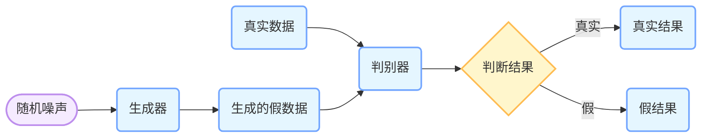

# 对抗生成网络在AI Agent开发中的应用

> 关键词：对抗生成网络、AI Agent、生成模型、判别模型、深度强化学习

> 摘要：本文深入探讨了对抗生成网络（GAN）在AI Agent开发中的应用。首先介绍了对抗生成网络和AI Agent的背景知识，阐述了核心概念及它们之间的联系。详细讲解了对抗生成网络的核心算法原理，给出了具体的Python实现步骤。接着介绍了相关的数学模型和公式，并通过举例进行说明。通过项目实战，展示了在AI Agent开发中应用GAN的具体代码实现和解读。分析了GAN在AI Agent开发中的实际应用场景，推荐了相关的学习资源、开发工具框架以及论文著作。最后总结了未来的发展趋势与挑战，并提供了常见问题的解答和扩展阅读参考资料，旨在为相关领域的研究和开发者提供全面而深入的技术指导。

## 1. 背景介绍 
### 1.1 目的和范围
本文章的目的在于全面且深入地探讨对抗生成网络（GAN）在AI Agent开发中的应用。随着人工智能技术的不断发展，AI Agent在各个领域的应用越来越广泛，而对抗生成网络作为一种强大的生成模型，为AI Agent的开发提供了新的思路和方法。本文将详细介绍对抗生成网络的原理、算法实现，以及如何将其应用到AI Agent的开发中，同时通过实际案例和代码展示具体的应用过程。范围涵盖了从理论基础到实际应用的各个方面，旨在为研究人员和开发者提供一个全面的参考。

### 1.2 预期读者
本文预期读者包括对人工智能、机器学习、深度学习等领域感兴趣的研究人员、开发者，以及相关专业的学生。无论是初学者想要了解对抗生成网络和AI Agent的基本概念，还是有一定经验的开发者希望深入研究其在实际应用中的技术细节，都能从本文中获得有价值的信息。

### 1.3 文档结构概述
本文首先介绍对抗生成网络和AI Agent的背景知识，包括目的、预期读者和文档结构概述等内容。接着阐述核心概念及它们之间的联系，通过文本示意图和Mermaid流程图进行说明。然后详细讲解对抗生成网络的核心算法原理，给出Python源代码实现步骤。再介绍相关的数学模型和公式，并举例说明。通过项目实战展示在AI Agent开发中应用GAN的具体代码实现和解读。分析GAN在AI Agent开发中的实际应用场景，推荐相关的学习资源、开发工具框架以及论文著作。最后总结未来的发展趋势与挑战，提供常见问题的解答和扩展阅读参考资料。

### 1.4 术语表
#### 1.4.1 核心术语定义
- **对抗生成网络（Generative Adversarial Networks，GAN）**：由生成器（Generator）和判别器（Discriminator）两个神经网络组成，通过对抗训练的方式，使生成器能够生成与真实数据分布相似的数据。
- **AI Agent**：能够感知环境、做出决策并采取行动的智能实体，它可以在不同的环境中执行特定的任务。
- **生成器（Generator）**：GAN中的一个神经网络，负责从随机噪声中生成数据。
- **判别器（Discriminator）**：GAN中的另一个神经网络，负责判断输入的数据是真实数据还是生成器生成的假数据。
- **深度强化学习（Deep Reinforcement Learning）**：结合了深度学习和强化学习的方法，用于训练AI Agent在环境中学习最优策略。

#### 1.4.2 相关概念解释
- **生成模型**：用于学习数据的概率分布，从而生成与真实数据相似的新数据。GAN是一种典型的生成模型。
- **判别模型**：用于判断输入数据的类别，例如判断数据是真实的还是生成的。
- **对抗训练**：生成器和判别器通过相互对抗的方式进行训练，生成器试图生成能够欺骗判别器的假数据，判别器则试图准确区分真实数据和假数据。

#### 1.4.3 缩略词列表
- **GAN**：Generative Adversarial Networks（对抗生成网络）
- **RL**：Reinforcement Learning（强化学习）
- **DRL**：Deep Reinforcement Learning（深度强化学习）

## 2. 核心概念与联系 
### 2.1 对抗生成网络的原理
对抗生成网络由生成器和判别器两个神经网络组成。生成器接收随机噪声作为输入，通过一系列的变换生成数据。判别器则接收真实数据和生成器生成的假数据作为输入，判断其是真实数据还是假数据。在训练过程中，生成器和判别器进行对抗训练，生成器试图生成能够欺骗判别器的假数据，判别器则试图准确区分真实数据和假数据。

### 2.2 AI Agent的概念
AI Agent是能够感知环境、做出决策并采取行动的智能实体。它可以在不同的环境中执行特定的任务，例如游戏、机器人控制等。AI Agent通常通过强化学习的方法进行训练，学习在不同环境状态下采取最优的行动策略。

### 2.3 对抗生成网络与AI Agent的联系
对抗生成网络可以为AI Agent的开发提供多种帮助。例如，在数据生成方面，GAN可以生成大量的训练数据，用于训练AI Agent，从而提高其性能。在环境建模方面，GAN可以学习环境的真实分布，帮助AI Agent更好地理解环境。此外，GAN还可以用于生成对抗样本，用于测试和提高AI Agent的鲁棒性。

### 2.4 文本示意图
```plaintext
             随机噪声
                |
                v
           生成器（Generator）
                |
                v
         生成的假数据  <---->  真实数据
                |
                v
           判别器（Discriminator）
                |
                v
        判断结果（真实或假）
```

### 2.5 Mermaid流程图


## 3. 核心算法原理 & 具体操作步骤 
### 3.1 对抗生成网络的核心算法原理
对抗生成网络的核心算法是基于博弈论的思想，通过生成器和判别器的对抗训练来学习数据的分布。生成器的目标是生成能够欺骗判别器的假数据，判别器的目标是准确区分真实数据和假数据。在训练过程中，生成器和判别器交替更新参数，直到达到一个纳什均衡。

### 3.2 具体操作步骤
以下是使用Python和PyTorch实现一个简单的对抗生成网络的具体步骤：

```python
import torch
import torch.nn as nn
import torch.optim as optim
import numpy as np
import matplotlib.pyplot as plt

# 定义生成器
class Generator(nn.Module):
    def __init__(self, input_size, output_size):
        super(Generator, self).__init__()
        self.fc1 = nn.Linear(input_size, 128)
        self.relu = nn.ReLU()
        self.fc2 = nn.Linear(128, output_size)
        self.tanh = nn.Tanh()

    def forward(self, x):
        x = self.fc1(x)
        x = self.relu(x)
        x = self.fc2(x)
        x = self.tanh(x)
        return x

# 定义判别器
class Discriminator(nn.Module):
    def __init__(self, input_size):
        super(Discriminator, self).__init__()
        self.fc1 = nn.Linear(input_size, 128)
        self.relu = nn.ReLU()
        self.fc2 = nn.Linear(128, 1)
        self.sigmoid = nn.Sigmoid()

    def forward(self, x):
        x = self.fc1(x)
        x = self.relu(x)
        x = self.fc2(x)
        x = self.sigmoid(x)
        return x

# 超参数设置
input_size = 100
output_size = 1
batch_size = 32
num_epochs = 1000
learning_rate = 0.001

# 初始化生成器和判别器
generator = Generator(input_size, output_size)
discriminator = Discriminator(output_size)

# 定义损失函数和优化器
criterion = nn.BCELoss()
g_optimizer = optim.Adam(generator.parameters(), lr=learning_rate)
d_optimizer = optim.Adam(discriminator.parameters(), lr=learning_rate)

# 训练过程
for epoch in range(num_epochs):
    # 训练判别器
    discriminator.zero_grad()

    # 生成真实数据
    real_data = torch.FloatTensor(np.random.normal(0, 1, (batch_size, output_size)))
    real_labels = torch.ones((batch_size, 1))

    # 生成假数据
    noise = torch.FloatTensor(np.random.normal(0, 1, (batch_size, input_size)))
    fake_data = generator(noise)
    fake_labels = torch.zeros((batch_size, 1))

    # 计算判别器对真实数据的损失
    real_output = discriminator(real_data)
    d_real_loss = criterion(real_output, real_labels)

    # 计算判别器对假数据的损失
    fake_output = discriminator(fake_data.detach())
    d_fake_loss = criterion(fake_output, fake_labels)

    # 判别器的总损失
    d_loss = d_real_loss + d_fake_loss
    d_loss.backward()
    d_optimizer.step()

    # 训练生成器
    generator.zero_grad()
    fake_labels = torch.ones((batch_size, 1))
    fake_output = discriminator(fake_data)
    g_loss = criterion(fake_output, fake_labels)
    g_loss.backward()
    g_optimizer.step()

    if epoch % 100 == 0:
        print(f'Epoch [{epoch}/{num_epochs}], D_loss: {d_loss.item():.4f}, G_loss: {g_loss.item():.4f}')

# 生成一些样本进行可视化
noise = torch.FloatTensor(np.random.normal(0, 1, (100, input_size)))
generated_samples = generator(noise).detach().numpy()
plt.hist(generated_samples, bins=20)
plt.show()
```

### 3.3 代码解释
1. **定义生成器和判别器**：生成器接收随机噪声作为输入，通过全连接层和激活函数生成数据。判别器接收数据作为输入，通过全连接层和激活函数输出一个概率值，表示该数据是真实数据的概率。
2. **定义损失函数和优化器**：使用二元交叉熵损失函数（BCELoss）来计算判别器和生成器的损失。使用Adam优化器来更新生成器和判别器的参数。
3. **训练过程**：在每个训练周期中，首先训练判别器，计算判别器对真实数据和假数据的损失，然后更新判别器的参数。接着训练生成器，计算生成器生成的假数据被判别器判断为真实数据的损失，然后更新生成器的参数。
4. **可视化**：训练完成后，生成一些样本并进行可视化，观察生成器的效果。

## 4. 数学模型和公式 & 详细讲解 & 举例说明 
### 4.1 对抗生成网络的数学模型
对抗生成网络的目标是学习数据的真实分布 $p_{data}(x)$。生成器通过一个映射 $G(z;\theta_g)$ 将随机噪声 $z$ 映射到数据空间，其中 $\theta_g$ 是生成器的参数。判别器通过一个映射 $D(x;\theta_d)$ 判断输入数据 $x$ 是真实数据还是生成器生成的假数据，其中 $\theta_d$ 是判别器的参数。

### 4.2 对抗生成网络的损失函数
对抗生成网络的损失函数可以表示为一个极小极大博弈问题：
$$
\min_G \max_D V(D, G) = \mathbb{E}_{x \sim p_{data}(x)}[\log D(x)] + \mathbb{E}_{z \sim p_z(z)}[\log(1 - D(G(z)))]
$$
其中，$V(D, G)$ 是判别器和生成器的价值函数，$\mathbb{E}_{x \sim p_{data}(x)}$ 表示对真实数据分布的期望，$\mathbb{E}_{z \sim p_z(z)}$ 表示对随机噪声分布的期望。

### 4.3 详细讲解
- **判别器的目标**：判别器的目标是最大化 $V(D, G)$，即准确区分真实数据和假数据。当判别器看到真实数据时，希望 $D(x)$ 接近 1；当判别器看到假数据时，希望 $D(G(z))$ 接近 0。
- **生成器的目标**：生成器的目标是最小化 $V(D, G)$，即生成能够欺骗判别器的假数据。当生成器生成的假数据被判别器判断为真实数据时，$D(G(z))$ 接近 1，此时生成器的损失最小。

### 4.4 举例说明
假设我们有一个简单的一维数据分布，真实数据服从正态分布 $N(0, 1)$。生成器接收一个 100 维的随机噪声作为输入，通过全连接层生成一个一维的数据。判别器接收一个一维的数据作为输入，输出一个概率值，表示该数据是真实数据的概率。在训练过程中，生成器和判别器不断对抗训练，直到生成器能够生成与真实数据分布相似的数据。

## 5. 项目实战：代码实际案例和详细解释说明 
### 5.1  开发环境搭建
1. **安装Python**：建议使用Python 3.7及以上版本。
2. **安装PyTorch**：根据自己的操作系统和CUDA版本选择合适的PyTorch版本进行安装。可以参考PyTorch官方网站的安装指南。
3. **安装其他依赖库**：安装`numpy`、`matplotlib`等常用的Python库。可以使用`pip`命令进行安装：
```sh
pip install numpy matplotlib
```

### 5.2  源代码详细实现和代码解读
以下是一个将对抗生成网络应用到AI Agent开发中的实际案例，我们将使用GAN来生成训练数据，帮助AI Agent学习更好的策略。

```python
import torch
import torch.nn as nn
import torch.optim as optim
import numpy as np
import gym

# 定义生成器
class Generator(nn.Module):
    def __init__(self, input_size, output_size):
        super(Generator, self).__init__()
        self.fc1 = nn.Linear(input_size, 128)
        self.relu = nn.ReLU()
        self.fc2 = nn.Linear(128, output_size)
        self.tanh = nn.Tanh()

    def forward(self, x):
        x = self.fc1(x)
        x = self.relu(x)
        x = self.fc2(x)
        x = self.tanh(x)
        return x

# 定义判别器
class Discriminator(nn.Module):
    def __init__(self, input_size):
        super(Discriminator, self).__init__()
        self.fc1 = nn.Linear(input_size, 128)
        self.relu = nn.ReLU()
        self.fc2 = nn.Linear(128, 1)
        self.sigmoid = nn.Sigmoid()

    def forward(self, x):
        x = self.fc1(x)
        x = self.relu(x)
        x = self.fc2(x)
        x = self.sigmoid(x)
        return x

# 定义AI Agent
class Agent(nn.Module):
    def __init__(self, input_size, output_size):
        super(Agent, self).__init__()
        self.fc1 = nn.Linear(input_size, 128)
        self.relu = nn.ReLU()
        self.fc2 = nn.Linear(128, output_size)

    def forward(self, x):
        x = self.fc1(x)
        x = self.relu(x)
        x = self.fc2(x)
        return x

# 超参数设置
input_size = 100
output_size = 4  # 环境的动作空间维度
batch_size = 32
num_epochs = 1000
learning_rate = 0.001

# 初始化生成器、判别器和AI Agent
generator = Generator(input_size, output_size)
discriminator = Discriminator(output_size)
agent = Agent(output_size, output_size)

# 定义损失函数和优化器
criterion = nn.BCELoss()
g_optimizer = optim.Adam(generator.parameters(), lr=learning_rate)
d_optimizer = optim.Adam(discriminator.parameters(), lr=learning_rate)
a_optimizer = optim.Adam(agent.parameters(), lr=learning_rate)

# 初始化环境
env = gym.make('CartPole-v1')

# 训练过程
for epoch in range(num_epochs):
    # 训练判别器
    discriminator.zero_grad()

    # 生成真实数据
    real_data = []
    for _ in range(batch_size):
        state = env.reset()