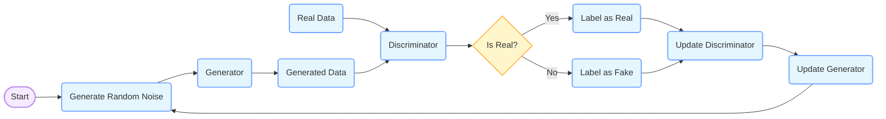

# 对抗生成网络在金融数据增强中的应用

> 关键词：对抗生成网络、金融数据增强、生成器、判别器、数据质量

> 摘要：本文聚焦于对抗生成网络（GAN）在金融数据增强领域的应用。首先介绍了研究的背景、目的和范围，明确预期读者与文档结构。接着详细阐述了对抗生成网络的核心概念，包括生成器和判别器的原理及架构，并通过Mermaid流程图展示其工作流程。深入分析了核心算法原理，给出Python源代码示例。讲解了相关的数学模型和公式，并举例说明。通过项目实战，从开发环境搭建到源代码实现及解读，展示了如何将GAN应用于金融数据增强。探讨了实际应用场景，推荐了学习资源、开发工具框架和相关论文著作。最后总结了未来发展趋势与挑战，并给出常见问题解答和扩展阅读参考资料，旨在为相关领域的研究者和从业者提供全面的技术指导。

## 1. 背景介绍 
### 1.1 目的和范围
在金融领域，数据的质量和数量对于各种分析和决策至关重要。然而，实际中常常面临金融数据不足、不平衡或者存在噪声等问题，这给金融模型的训练和预测带来了挑战。对抗生成网络（GAN）作为一种强大的生成模型，具有生成逼真数据的能力，其在金融数据增强方面具有巨大的潜力。本文章的目的在于深入探讨对抗生成网络在金融数据增强中的应用，详细介绍相关技术原理、算法实现和实际应用案例，范围涵盖对抗生成网络的基本概念、核心算法、数学模型、项目实战以及相关工具资源等方面。

### 1.2 预期读者
本文预期读者包括金融科技领域的从业者，如数据分析师、量化交易员、风险评估师等，他们希望通过数据增强技术提升金融模型的性能；计算机科学领域的研究人员和开发者，尤其是对深度学习、生成模型感兴趣，想要探索其在金融领域应用的人群；高校相关专业的学生，如金融工程、计算机科学等专业，希望通过学习本文了解跨学科的知识和技术应用。

### 1.3 文档结构概述
本文首先介绍对抗生成网络在金融数据增强应用的背景信息，包括目的、预期读者和文档结构。接着阐述对抗生成网络的核心概念，包括生成器和判别器的原理及架构，并给出示意图和流程图。然后详细讲解核心算法原理，通过Python代码进行说明。介绍相关的数学模型和公式，并举例分析。通过项目实战，展示如何将对抗生成网络应用于金融数据增强，包括开发环境搭建、源代码实现和代码解读。探讨对抗生成网络在金融领域的实际应用场景。推荐学习资源、开发工具框架和相关论文著作。最后总结未来发展趋势与挑战，给出常见问题解答和扩展阅读参考资料。

### 1.4 术语表
#### 1.4.1 核心术语定义
- **对抗生成网络（Generative Adversarial Networks，GAN）**：由生成器和判别器组成的深度学习模型，通过两者的对抗训练来学习数据的分布并生成新的数据样本。
- **生成器（Generator）**：GAN中的一部分，接收随机噪声作为输入，尝试生成与真实数据分布相似的数据样本。
- **判别器（Discriminator）**：GAN中的另一部分，接收真实数据样本和生成器生成的假数据样本作为输入，判断输入数据是真实的还是假的。
- **金融数据增强（Financial Data Augmentation）**：通过一定的方法增加金融数据的数量和多样性，以提高金融模型的性能和泛化能力。

#### 1.4.2 相关概念解释
- **数据分布**：指数据在特征空间中的概率分布情况，反映了数据的内在规律和特征。
- **对抗训练**：生成器和判别器之间进行的一种博弈过程，生成器试图欺骗判别器，而判别器试图准确区分真实数据和生成数据。
- **过拟合**：模型在训练数据上表现良好，但在测试数据上表现不佳的现象，通常是由于模型过于复杂或训练数据不足导致的。

#### 1.4.3 缩略词列表
- **GAN**：Generative Adversarial Networks（对抗生成网络）
- **MLP**：Multi - Layer Perceptron（多层感知机）

## 2. 核心概念与联系 

### 核心概念原理
对抗生成网络（GAN）由生成器（Generator）和判别器（Discriminator）两个主要部分组成。其基本思想是通过生成器和判别器之间的对抗训练来学习数据的分布。

生成器接收一个随机噪声向量作为输入，通过一系列的神经网络层将其转换为一个与真实数据具有相似特征的数据样本。生成器的目标是生成尽可能逼真的数据，使得判别器难以区分生成的数据和真实数据。

判别器接收真实数据样本和生成器生成的假数据样本作为输入，通过神经网络对输入数据进行分类，判断其是真实数据还是假数据。判别器的目标是准确区分真实数据和假数据。

在训练过程中，生成器和判别器相互博弈。生成器不断调整自身的参数以生成更逼真的数据，而判别器不断调整自身的参数以提高区分能力。最终，当生成器生成的数据能够以假乱真，判别器无法准确区分时，整个GAN达到一种平衡状态。

### 架构的文本示意图
```plaintext
             +----------------+
             |  Random Noise  |
             +----------------+
                    |
                    v
             +----------------+
             |    Generator   |
             |  (Neural Net)  |
             +----------------+
                    |
                    v
             +----------------+
             | Generated Data |
             +----------------+
                    |
                    v
             +----------------+
             |   Discriminator|
             |  (Neural Net)  |
             +----------------+
                    |
                    v
           +----------------------+
           |  Classification Result |
           | (Real or Fake)         |
           +----------------------+
```

### Mermaid流程图


## 3. 核心算法原理 & 具体操作步骤 

### 算法原理
对抗生成网络的训练过程可以看作是一个最小 - 最大博弈问题。生成器的目标是最小化判别器将其生成的数据判断为假数据的概率，而判别器的目标是最大化区分真实数据和假数据的能力。

具体来说，GAN的目标函数可以表示为：

$$\min_G \max_D V(D, G)=\mathbb{E}_{x \sim p_{data}(x)}[\log D(x)]+\mathbb{E}_{z \sim p_z(z)}[\log(1 - D(G(z)))]$$

其中，$p_{data}(x)$ 是真实数据的分布，$p_z(z)$ 是随机噪声的分布，$G(z)$ 是生成器根据随机噪声 $z$ 生成的数据，$D(x)$ 是判别器对数据 $x$ 的判断概率（输出值在 $[0, 1]$ 之间，$1$ 表示真实数据，$0$ 表示假数据）。

### 具体操作步骤
1. **初始化**：初始化生成器 $G$ 和判别器 $D$ 的参数。
2. **训练判别器**：
    - 从真实数据分布 $p_{data}(x)$ 中采样一批真实数据 $x$。
    - 从随机噪声分布 $p_z(z)$ 中采样一批随机噪声 $z$，通过生成器 $G$ 生成一批假数据 $G(z)$。
    - 计算判别器的损失函数：
      - 对于真实数据 $x$，损失为 $-\log D(x)$。
      - 对于假数据 $G(z)$，损失为 $-\log(1 - D(G(z)))$。
      - 总的判别器损失为两者之和：$L_D=-\frac{1}{m}\sum_{i = 1}^{m}[\log D(x^{(i)})+\log(1 - D(G(z^{(i)})))]$，其中 $m$ 是批量大小。
    - 使用梯度下降法更新判别器 $D$ 的参数，以最大化 $L_D$。
3. **训练生成器**：
    - 从随机噪声分布 $p_z(z)$ 中采样一批随机噪声 $z$。
    - 计算生成器的损失函数：$L_G=-\frac{1}{m}\sum_{i = 1}^{m}\log D(G(z^{(i)}))$。
    - 使用梯度下降法更新生成器 $G$ 的参数，以最小化 $L_G$。
4. **重复步骤2和3**：直到生成器和判别器达到收敛状态。

### Python源代码示例
```python
import torch
import torch.nn as nn
import torch.optim as optim
import numpy as np

# 定义生成器
class Generator(nn.Module):
    def __init__(self, input_dim, output_dim):
        super(Generator, self).__init__()
        self.model = nn.Sequential(
            nn.Linear(input_dim, 128),
            nn.LeakyReLU(0.2),
            nn.Linear(128, 256),
            nn.BatchNorm1d(256),
            nn.LeakyReLU(0.2),
            nn.Linear(256, 512),
            nn.BatchNorm1d(512),
            nn.LeakyReLU(0.2),
            nn.Linear(512, output_dim),
            nn.Tanh()
        )

    def forward(self, z):
        return self.model(z)

# 定义判别器
class Discriminator(nn.Module):
    def __init__(self, input_dim):
        super(Discriminator, self).__init__()
        self.model = nn.Sequential(
            nn.Linear(input_dim, 512),
            nn.LeakyReLU(0.2),
            nn.Linear(512, 256),
            nn.LeakyReLU(0.2),
            nn.Linear(256, 1),
            nn.Sigmoid()
        )

    def forward(self, x):
        return self.model(x)

# 超参数设置
input_dim = 100
output_dim = 784  # 假设金融数据维度为784
batch_size = 32
epochs = 100
lr = 0.0002

# 初始化生成器和判别器
generator = Generator(input_dim, output_dim)
discriminator = Discriminator(output_dim)

# 定义损失函数和优化器
criterion = nn.BCELoss()
optimizer_G = optim.Adam(generator.parameters(), lr=lr)
optimizer_D = optim.Adam(discriminator.parameters(), lr=lr)

# 模拟金融数据
real_data = torch.randn(1000, output_dim)

for epoch in range(epochs):
    for i in range(0, len(real_data), batch_size):
        # 训练判别器
        optimizer_D.zero_grad()

        # 真实数据
        real_batch = real_data[i:i+batch_size]
        real_labels = torch.ones((real_batch.size(0), 1))
        real_output = discriminator(real_batch)
        d_real_loss = criterion(real_output, real_labels)

        # 生成假数据
        z = torch.randn(batch_size, input_dim)
        fake_batch = generator(z)
        fake_labels = torch.zeros((fake_batch.size(0), 1))
        fake_output = discriminator(fake_batch.detach())
        d_fake_loss = criterion(fake_output, fake_labels)

        # 判别器总损失
        d_loss = d_real_loss + d_fake_loss
        d_loss.backward()
        optimizer_D.step()

        # 训练生成器
        optimizer_G.zero_grad()
        z = torch.randn(batch_size, input_dim)
        fake_batch = generator(z)
        real_labels = torch.ones((fake_batch.size(0), 1))
        output = discriminator(fake_batch)
        g_loss = criterion(output, real_labels)
        g_loss.backward()
        optimizer_G.step()

    print(f'Epoch [{epoch+1}/{epochs}], D_loss: {d_loss.item():.4f}, G_loss: {g_loss.item():.4f}')
```

## 4. 数学模型和公式 & 详细讲解 & 举例说明 

### 数学模型和公式
#### 目标函数
如前面所述，GAN的目标函数为：

$$\min_G \max_D V(D, G)=\mathbb{E}_{x \sim p_{data}(x)}[\log D(x)]+\mathbb{E}_{z \sim p_z(z)}[\log(1 - D(G(z)))]$$

#### 详细讲解
- **$\mathbb{E}_{x \sim p_{data}(x)}[\log D(x)]$**：这一项表示判别器对真实数据的判断能力。当判别器能够准确地将真实数据判断为真实数据时，$D(x)$ 接近 $1$，$\log D(x)$ 接近 $0$。因此，判别器的目标是最大化这一项。
- **$\mathbb{E}_{z \sim p_z(z)}[\log(1 - D(G(z)))]$**：这一项表示判别器对生成器生成的假数据的判断能力。当判别器能够准确地将假数据判断为假数据时，$D(G(z))$ 接近 $0$，$\log(1 - D(G(z)))$ 接近 $0$。因此，判别器的目标也是最大化这一项。
- **生成器的目标**：生成器的目标是最小化 $\mathbb{E}_{z \sim p_z(z)}[\log(1 - D(G(z)))]$，即让判别器难以区分生成的数据和真实数据。

### 举例说明
假设我们有一个简单的二维金融数据分布，真实数据分布 $p_{data}(x)$ 是一个高斯分布，随机噪声分布 $p_z(z)$ 是一个均匀分布。

生成器 $G$ 接收一个二维的随机噪声向量 $z$，通过神经网络将其转换为一个二维的数据向量 $G(z)$。判别器 $D$ 接收二维的数据向量 $x$，输出一个在 $[0, 1]$ 之间的概率值，表示 $x$ 是真实数据的概率。

在训练过程中，判别器会尝试将从真实数据分布中采样的点判断为真实数据，将生成器生成的点判断为假数据。生成器则会不断调整自身的参数，使得生成的点越来越接近真实数据分布。

例如，初始时，生成器可能会生成一些远离真实数据分布的点，判别器很容易将其判断为假数据。随着训练的进行，生成器会学习到真实数据的分布特征，生成的点会逐渐靠近真实数据分布，判别器的区分能力也会受到挑战。

## 5. 项目实战：代码实际案例和详细解释说明 

### 5.1  开发环境搭建
#### 操作系统
可以选择常见的操作系统，如Windows、Linux（如Ubuntu）或macOS。不同操作系统的安装步骤略有不同，但基本原理是相似的。

#### Python环境
建议使用Python 3.6及以上版本。可以通过以下几种方式安装Python：
- **Anaconda**：Anaconda是一个包含Python和许多常用科学计算库的发行版，安装方便，还可以管理虚拟环境。可以从Anaconda官方网站（https://www.anaconda.com/products/individual）下载适合自己操作系统的安装包进行安装。
- **Python官网**：从Python官方网站（https://www.python.org/downloads/）下载对应版本的Python安装包，按照安装向导进行安装。

#### 安装必要的库
使用pip或conda安装以下必要的库：
```bash
# 使用pip安装
pip install torch torchvision numpy matplotlib

# 使用conda安装
conda install pytorch torchvision numpy matplotlib -c pytorch
```

### 5.2  源代码详细实现和代码解读
以下是一个完整的使用GAN进行金融数据增强的Python代码示例，并对代码进行详细解读。

```python
import torch
import torch.nn as nn
import torch.optim as optim
import numpy as np
import matplotlib.pyplot as plt

# 定义生成器
class Generator(nn.Module):
    def __init__(self, input_dim, output_dim):
        super(Generator, self).__init__()
        self.model = nn.Sequential(
            nn.Linear(input_dim, 128),
            nn.LeakyReLU(0.2),
            nn.Linear(128, 256),
            nn.BatchNorm1d(256),
            nn.LeakyReLU(0.2),
            nn.Linear(256, 512),
            nn.BatchNorm1d(512),
            nn.LeakyReLU(0.2),
            nn.Linear(512, output_dim),
            nn.Tanh()
        )

    def forward(self, z):
        return self.model(z)

# 定义判别器
class Discriminator(nn.Module):
    def __init__(self, input_dim):
        super(Discriminator, self).__init__()
        self.model = nn.Sequential(
            nn.Linear(input_dim, 512),
            nn.LeakyReLU(0.2),
            nn.Linear(512, 256),
            nn.LeakyReLU(0.2),
            nn.Linear(256, 1),
            nn.Sigmoid()
        )

    def forward(self, x):
        return self.model(x)

# 超参数设置
input_dim = 100
output_dim = 784  # 假设金融数据维度为784
batch_size = 32
epochs = 100
lr = 0.0002

# 初始化生成器和判别器
generator = Generator(input_dim, output_dim)
discriminator = Discriminator(output_dim)

# 定义损失函数和优化器
criterion = nn.BCELoss()
optimizer_G = optim.Adam(generator.parameters(), lr=lr)
optimizer_D = optim.Adam(discriminator.parameters(), lr=lr)

# 模拟金融数据
real_data = torch.randn(1000, output_dim)

# 训练过程
d_losses = []
g_losses = []

for epoch in range(epochs):
    d_epoch_loss = 0
    g_epoch_loss = 0
    for i in range(0, len(real_data), batch_size):
        # 训练判别器
        optimizer_D.zero_grad()

        # 真实数据
        real_batch = real_data[i:i+batch_size]
        real_labels = torch.ones((real_batch.size(0), 1))
        real_output = discriminator(real_batch)
        d_real_loss = criterion(real_output, real_labels)

        # 生成假数据
        z = torch.randn(batch_size, input_dim)
        fake_batch = generator(z)
        fake_labels = torch.zeros((fake_batch.size(0), 1))
        fake_output = discriminator(fake_batch.detach())
        d_fake_loss = criterion(fake_output, fake_labels)

        # 判别器总损失
        d_loss = d_real_loss + d_fake_loss
        d_loss.backward()
        optimizer_D.step()
        d_epoch_loss += d_loss.item()

        # 训练生成器
        optimizer_G.zero_grad()
        z = torch.randn(batch_size, input_dim)
        fake_batch = generator(z)
        real_labels = torch.ones((fake_batch.size(0), 1))
        output = discriminator(fake_batch)
        g_loss = criterion(output, real_labels)
        g_loss.backward()
        optimizer_G.step()
        g_epoch_loss += g_loss.item()

    d_epoch_loss /= (len(real_data) // batch_size)
    g_epoch_loss /= (len(real_data) // batch_size)
    d_losses.append(d_epoch_loss)
    g_losses.append(g_epoch_loss)
    print(f'Epoch [{epoch+1}/{epochs}], D_loss: {d_epoch_loss:.4f}, G_loss: {g_epoch_loss:.4f}')

# 绘制损失曲线
plt.plot(d_losses, label='Discriminator Loss')
plt.plot(g_losses, label='Generator Loss')
plt.xlabel('Epoch')
plt.ylabel('Loss')
plt.legend()
plt.show()

# 生成一些新的金融数据
z = torch.randn(10, input_dim)
generated_data = generator(z).detach().numpy()
print(generated_data)
```

### 代码解读与分析
#### 生成器（Generator）
- **初始化**：在 `__init__` 方法中，定义了一个多层感知机（MLP）作为生成器的模型。输入维度为 `input_dim`，输出维度为 `output_dim`。使用 `LeakyReLU` 作为激活函数，`BatchNorm1d` 进行批量归一化，最后使用 `Tanh` 激活函数将输出值限制在 $[-1, 1]$ 之间。
- **前向传播**：`forward` 方法实现了生成器的前向传播过程，将输入的随机噪声向量 $z$ 转换为生成的数据。

#### 判别器（Discriminator）
- **初始化**：在 `__init__` 方法中，定义了一个多层感知机作为判别器的模型。输入维度为 `input_dim`，输出维度为 $1$。使用 `LeakyReLU` 作为激活函数，最后使用 `Sigmoid` 激活函数将输出值限制在 $[0, 1]$ 之间，表示输入数据是真实数据的概率。
- **前向传播**：`forward` 方法实现了判别器的前向传播过程，对输入的数据进行分类。

#### 训练过程
- **判别器训练**：首先从真实数据中采样一批数据，将其输入判别器得到输出，计算判别器对真实数据的损失。然后从随机噪声中生成一批假数据，将其输入判别器得到输出，计算判别器对假数据的损失。将两者损失相加得到判别器的总损失，使用反向传播更新判别器的参数。
- **生成器训练**：从随机噪声中生成一批假数据，将其输入判别器得到输出，计算生成器的损失。使用反向传播更新生成器的参数，使得生成器生成的数据能够欺骗判别器。

#### 损失曲线绘制
使用 `matplotlib` 库绘制判别器和生成器的损失曲线，帮助我们观察训练过程中损失的变化情况。

#### 生成新数据
训练完成后，从随机噪声中生成一批新的金融数据，并将其打印输出。

## 6. 实际应用场景 
### 金融风险评估
在金融风险评估中，数据的多样性和充足性对于准确评估风险至关重要。然而，实际中可能会面临某些类型风险数据不足的问题。对抗生成网络可以用于生成这些稀缺风险类型的数据，从而增强训练数据的多样性。例如，在信用风险评估中，对于一些罕见的违约情况，可能没有足够的数据来训练模型。通过GAN生成这些罕见违约情况的数据，可以帮助模型更好地学习这些风险特征，提高风险评估的准确性。

### 量化交易策略优化
量化交易策略的性能很大程度上依赖于历史数据的质量和数量。使用对抗生成网络可以生成更多的模拟金融市场数据，包括不同市场行情下的价格走势、交易量等信息。这些生成的数据可以用于训练和测试量化交易策略，帮助策略开发者发现更多的市场规律和交易机会，优化交易策略，提高策略的鲁棒性和盈利能力。

### 金融欺诈检测
金融欺诈行为通常具有一定的隐蔽性和多样性，而且真实的欺诈数据往往非常有限。对抗生成网络可以生成各种类型的模拟欺诈数据，用于扩充训练数据集。通过使用这些增强后的数据训练欺诈检测模型，可以提高模型对不同欺诈模式的识别能力，从而更有效地检测和防范金融欺诈行为。

### 投资组合优化
在投资组合优化中，需要考虑各种资产的收益和风险特征。然而，实际的资产数据可能存在缺失或不完整的情况。GAN可以生成模拟的资产数据，补充缺失的信息，帮助投资者更全面地了解不同资产的表现。同时，通过生成不同市场情景下的资产数据，可以评估投资组合在各种情况下的表现，优化投资组合的配置，降低投资风险。

## 7. 工具和资源推荐
### 7.1 学习资源推荐
#### 7.1.1 书籍推荐
- 《深度学习》（Deep Learning）：由Ian Goodfellow、Yoshua Bengio和Aaron Courville所著，是深度学习领域的经典教材，涵盖了对抗生成网络等各种深度学习模型的原理和算法。
- 《Python深度学习》（Deep Learning with Python）：作者是Francois Chollet，这本书以Python和Keras为工具，详细介绍了深度学习的实践应用，包括GAN的实现。
- 《生成对抗网络实战》（GANs in Action）：由Jakub Langr和Vladimir Bok所著，专注于对抗生成网络的实际应用，通过大量的代码示例和案例帮助读者理解和掌握GAN。

#### 7.1.2 在线课程
- Coursera上的“深度学习专项课程”（Deep Learning Specialization）：由Andrew Ng教授授课，包含了深度学习的多个方面，其中有关于生成模型的内容，包括GAN。
- Udemy上的“生成对抗网络实战：从零到英雄”（GANs: From Zero to Hero）：该课程通过实际项目带领学员学习GAN的原理和实现，适合有一定编程基础的学习者。
- edX上的“人工智能基础”（Fundamentals of Artificial Intelligence）：课程涵盖了人工智能的基本概念和技术，包括GAN等生成模型的介绍。

#### 7.1.3 技术博客和网站
- Medium：上面有很多关于深度学习和GAN的技术文章，作者们会分享自己的研究成果和实践经验。
- arXiv：是一个预印本平台，提供了大量关于GAN的最新研究论文，读者可以及时了解该领域的前沿动态。
- Towards Data Science：专注于数据科学和机器学习领域，有很多关于GAN在不同领域应用的文章。

### 7.2 开发工具框架推荐
#### 7.2.1 IDE和编辑器
- PyCharm：是一款功能强大的Python集成开发环境，提供了代码编辑、调试、版本控制等一系列功能，适合开发大型的Python项目，包括GAN的实现。
- Jupyter Notebook：以交互式的方式编写和运行代码，方便进行数据分析和模型实验。可以在Jupyter Notebook中逐步实现GAN的代码，并实时查看结果。
- Visual Studio Code：是一个轻量级的代码编辑器，支持多种编程语言和插件扩展。可以安装Python相关的插件，实现高效的代码编写和调试。

#### 7.2.2 调试和性能分析工具
- TensorBoard：是TensorFlow的可视化工具，可以用于可视化GAN的训练过程，包括损失曲线、生成数据的可视化等。通过TensorBoard可以直观地观察模型的训练情况，及时发现问题并进行调整。
- PyTorch Profiler：是PyTorch提供的性能分析工具，可以帮助开发者分析模型的性能瓶颈，优化代码的运行效率。在训练GAN时，可以使用PyTorch Profiler来分析生成器和判别器的计算时间和内存使用情况。
- NVIDIA Nsight Systems：是一款用于GPU性能分析的工具，可以帮助开发者深入了解GAN在GPU上的运行情况，优化GPU的使用效率。

#### 7.2.3 相关框架和库
- PyTorch：是一个开源的深度学习框架，提供了丰富的神经网络层和优化器，方便实现GAN。PyTorch的动态图机制使得代码编写更加灵活，易于调试和修改。
- TensorFlow：是另一个广泛使用的深度学习框架，具有强大的分布式训练和部署能力。TensorFlow提供了高级API和低级API，适合不同水平的开发者实现GAN。
- Keras：是一个简单易用的深度学习库，基于TensorFlow或Theano等后端。Keras的代码简洁，易于上手，适合初学者快速实现GAN的原型。

### 7.3 相关论文著作推荐
#### 7.3.1 经典论文
- “Generative Adversarial Nets”：由Ian Goodfellow等人发表，是对抗生成网络的开山之作，详细介绍了GAN的基本原理和训练算法。
- “Unsupervised Representation Learning with Deep Convolutional Generative Adversarial Networks”：提出了深度卷积生成对抗网络（DCGAN），通过引入卷积层和反卷积层，提高了GAN生成图像的质量。
- “Conditional Generative Adversarial Nets”：介绍了条件生成对抗网络（CGAN），通过引入额外的条件信息，使得GAN可以生成特定条件下的数据。

#### 7.3.2 最新研究成果
- 可以关注NeurIPS、ICML、CVPR等顶级机器学习和计算机视觉会议上关于GAN的最新研究论文，了解该领域的最新技术和发展趋势。
- 定期浏览arXiv上关于GAN的预印本论文，获取最新的研究成果。

#### 7.3.3 应用案例分析
- 一些金融科技公司和研究机构会发表关于GAN在金融领域应用的案例分析报告，可以通过搜索相关公司的官方网站或学术数据库获取这些报告，了解GAN在实际金融场景中的应用效果和经验。

## 8. 总结：未来发展趋势与挑战
### 未来发展趋势
#### 模型结构创新
未来，对抗生成网络的模型结构可能会不断创新。例如，引入更多的注意力机制、强化学习等技术，提高生成器和判别器的性能和表达能力。同时，可能会出现更加复杂和高效的网络架构，以更好地适应金融数据的特点和需求。

#### 多模态数据融合
金融数据往往包含多种模态的信息，如文本、图像、时间序列等。未来的研究可能会聚焦于如何将对抗生成网络应用于多模态金融数据的增强，通过融合不同模态的数据，生成更加丰富和准确的金融数据，为金融分析和决策提供更全面的支持。

#### 与其他技术结合
对抗生成网络可能会与其他人工智能技术，如深度学习、机器学习、自然语言处理等进行更深入的结合。例如，将GAN与强化学习结合，用于优化金融交易策略；将GAN与自然语言处理结合，用于生成金融新闻和报告等。

#### 行业应用拓展
随着对抗生成网络技术的不断发展和成熟，其在金融领域的应用范围可能会进一步拓展。除了现有的风险评估、量化交易、欺诈检测等领域，还可能会应用于金融产品设计、客户细分、市场预测等更多的金融业务场景。

### 挑战
#### 数据质量和隐私问题
金融数据通常涉及到用户的隐私和敏感信息，在使用对抗生成网络进行数据增强时，需要确保生成的数据不会泄露用户的隐私。同时，金融数据的质量也会影响GAN的训练效果，如何处理数据中的噪声、缺失值等问题，是一个需要解决的挑战。

#### 模型稳定性和收敛性
对抗生成网络的训练过程往往不稳定，容易出现梯度消失、梯度爆炸等问题，导致模型难以收敛。在金融数据增强中，由于金融数据的复杂性和不确定性，这些问题可能会更加突出。如何提高模型的稳定性和收敛性，是应用GAN的一个关键挑战。

#### 评估指标不完善
目前，对于对抗生成网络生成的数据质量的评估指标还不够完善。在金融领域，需要更加准确和有效的评估指标来衡量生成数据的质量和可用性，以确保生成的数据能够真正应用于金融分析和决策。

#### 合规性和监管问题
金融行业受到严格的监管，使用对抗生成网络进行数据增强需要符合相关的法律法规和监管要求。如何确保GAN的应用过程和生成的数据符合合规性要求，是金融机构和监管部门需要共同面对的挑战。

## 9. 附录：常见问题与解答
### 1. 对抗生成网络生成的数据是否可以直接用于金融决策？
对抗生成网络生成的数据通常不能直接用于金融决策。虽然GAN可以生成与真实数据分布相似的数据，但生成的数据仍然是模拟的，可能存在一定的偏差。在实际应用中，需要对生成的数据进行进一步的验证和评估，结合真实数据和专业知识进行综合分析，才能用于金融决策。

### 2. 如何选择合适的GAN模型结构？
选择合适的GAN模型结构需要考虑多个因素，如数据的特点、任务的需求、计算资源等。对于简单的金融数据，可以选择基本的GAN模型；对于复杂的金融数据，如高维时间序列数据，可以考虑使用更复杂的模型，如循环生成对抗网络（RGAN）。同时，还可以参考相关的研究论文和实践经验，选择适合自己任务的模型结构。

### 3. 训练GAN时出现损失不稳定的情况怎么办？
训练GAN时损失不稳定是一个常见的问题。可以尝试以下方法来解决：
- 调整学习率：学习率过大可能会导致损失波动过大，学习率过小可能会导致训练速度过慢。可以尝试使用学习率调度器，动态调整学习率。
- 增加训练数据：更多的训练数据可以帮助模型更好地学习数据的分布，减少损失的波动。
- 优化模型结构：可以尝试调整生成器和判别器的网络结构，增加或减少层数、神经元数量等。
- 使用正则化方法：如L1、L2正则化，可以防止模型过拟合，提高模型的稳定性。

### 4. 如何评估GAN生成的金融数据的质量？
可以从以下几个方面评估GAN生成的金融数据的质量：
- 统计特征：比较生成数据和真实数据的统计特征，如均值、方差、相关性等，看是否相似。
- 可视化：通过可视化的方式观察生成数据和真实数据的分布情况，如绘制直方图、散点图等。
- 模型性能：使用生成的数据和真实数据分别训练同一个金融模型，比较模型的性能指标，如准确率、召回率等。
- 领域知识：结合金融领域的专业知识，判断生成的数据是否符合实际的金融规律和业务逻辑。

## 10. 扩展阅读 & 参考资料
### 扩展阅读
- Goodfellow, I. J., Bengio, Y., & Courville, A. (2016). Deep Learning. MIT Press.
- Chollet, F. (2017). Deep Learning with Python. Manning Publications.
- Langr, J., & Bok, V. (2019). GANs in Action. Manning Publications.

### 参考资料
- Goodfellow, I. J., et al. (2014). Generative Adversarial Nets. Advances in Neural Information Processing Systems.
- Radford, A., Metz, L., & Chintala, S. (2015). Unsupervised Representation Learning with Deep Convolutional Generative Adversarial Networks. arXiv preprint arXiv:1511.06434.
- Mirza, M., & Osindero, S. (2014). Conditional Generative Adversarial Nets. arXiv preprint arXiv:1411.1784.

作者：AI天才研究院/AI Genius Institute & 禅与计算机程序设计艺术 /Zen And The Art of Computer Programming