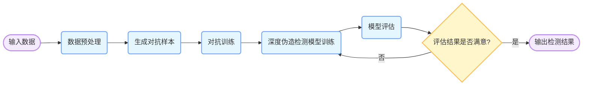

# 对抗训练在深度伪造检测中的应用与挑战

> 关键词：对抗训练、深度伪造检测、生成对抗网络、鲁棒性、深度学习

> 摘要：本文深入探讨了对抗训练在深度伪造检测中的应用与挑战。首先介绍了对抗训练和深度伪造检测的背景知识，包括目的、预期读者、文档结构和相关术语。接着阐述了核心概念，通过文本示意图和 Mermaid 流程图展示了其原理和架构。详细讲解了核心算法原理，使用 Python 源代码进行了示例。分析了相关的数学模型和公式，并举例说明。通过项目实战，给出了开发环境搭建、源代码实现和代码解读。探讨了实际应用场景，推荐了学习资源、开发工具框架和相关论文著作。最后总结了未来发展趋势与挑战，提供了常见问题解答和扩展阅读参考资料，旨在为该领域的研究和实践提供全面的指导。

## 1. 背景介绍 
### 1.1 目的和范围
随着人工智能技术的飞速发展，深度伪造技术也日益成熟。深度伪造通过深度学习算法合成高度逼真的虚假图像、视频和音频，这对社会的各个方面，如政治、娱乐、安全等都带来了严重的威胁。因此，深度伪造检测技术变得至关重要。对抗训练作为一种提高模型鲁棒性和泛化能力的技术，在深度伪造检测中展现出了巨大的潜力。本文的目的是深入研究对抗训练在深度伪造检测中的应用原理、算法实现、实际应用场景以及面临的挑战，为相关研究人员和从业者提供全面的技术参考。范围涵盖了对抗训练和深度伪造检测的基本概念、核心算法、数学模型、项目实战、应用场景以及未来发展趋势等方面。

### 1.2 预期读者
本文预期读者包括人工智能、计算机视觉、机器学习等领域的研究人员、开发者和学生。对于那些对深度伪造检测技术感兴趣，希望了解对抗训练在其中应用的专业人士，本文提供了深入的技术分析和实践指导。同时，对于关注信息安全、媒体真实性等社会问题的人士，也可以通过本文了解深度伪造的危害以及检测技术的发展现状。

### 1.3 文档结构概述
本文共分为十个部分。第一部分为背景介绍，阐述了文章的目的、预期读者、文档结构和相关术语。第二部分介绍了对抗训练和深度伪造检测的核心概念，通过文本示意图和 Mermaid 流程图展示其原理和架构。第三部分详细讲解了核心算法原理，并使用 Python 源代码进行了示例。第四部分分析了相关的数学模型和公式，并举例说明。第五部分通过项目实战，介绍了开发环境搭建、源代码实现和代码解读。第六部分探讨了对抗训练在深度伪造检测中的实际应用场景。第七部分推荐了学习资源、开发工具框架和相关论文著作。第八部分总结了未来发展趋势与挑战。第九部分提供了常见问题解答。第十部分为扩展阅读和参考资料。

### 1.4 术语表
#### 1.4.1 核心术语定义
- **对抗训练（Adversarial Training）**：通过在训练过程中引入对抗样本，使模型学习到更鲁棒的特征表示，提高模型在面对对抗攻击时的性能。
- **深度伪造（Deepfake）**：利用深度学习算法合成虚假的图像、视频或音频，使其看起来或听起来与真实的内容非常相似。
- **生成对抗网络（Generative Adversarial Networks，GANs）**：由生成器和判别器组成的神经网络模型，生成器负责生成虚假数据，判别器负责区分真实数据和虚假数据，两者通过对抗训练不断提高性能。
- **鲁棒性（Robustness）**：模型在面对噪声、对抗攻击等不利条件时，仍能保持较好的性能。
- **泛化能力（Generalization Ability）**：模型在未见过的数据上的表现能力，即模型能够从训练数据中学习到普遍的规律，并应用到新的数据上。

#### 1.4.2 相关概念解释
- **对抗样本（Adversarial Examples）**：在原始数据上添加微小的扰动，使得人类难以察觉，但却能导致模型做出错误的预测。对抗样本可以用于攻击模型，也可以用于对抗训练来提高模型的鲁棒性。
- **过拟合（Overfitting）**：模型在训练数据上表现很好，但在未见过的数据上表现不佳。过拟合通常是由于模型过于复杂，学习到了训练数据中的噪声和细节，而没有学习到普遍的规律。
- **欠拟合（Underfitting）**：模型在训练数据上表现不佳，无法学习到数据中的规律。欠拟合通常是由于模型过于简单，无法捕捉到数据的复杂特征。

#### 1.4.3 缩略词列表
- **GANs**：Generative Adversarial Networks（生成对抗网络）
- **CNN**：Convolutional Neural Network（卷积神经网络）
- **DNN**：Deep Neural Network（深度神经网络）
- **RNN**：Recurrent Neural Network（循环神经网络）

## 2. 核心概念与联系 

### 2.1 对抗训练原理
对抗训练的核心思想是通过引入对抗样本，使模型学习到更鲁棒的特征表示。在训练过程中，生成器生成对抗样本，判别器则尝试区分真实样本和对抗样本。通过不断的对抗训练，生成器生成的对抗样本越来越逼真，判别器的判别能力也越来越强。最终，模型能够学习到数据的本质特征，提高在面对对抗攻击时的性能。

### 2.2 深度伪造检测原理
深度伪造检测的目标是区分真实的图像、视频或音频和深度伪造的内容。通常，检测模型会学习真实数据和伪造数据之间的特征差异，通过对输入数据的特征提取和分析，判断其是否为深度伪造。常见的检测方法包括基于传统机器学习的方法和基于深度学习的方法，其中基于深度学习的方法由于其强大的特征学习能力，在深度伪造检测中取得了较好的效果。

### 2.3 对抗训练与深度伪造检测的联系
对抗训练可以用于提高深度伪造检测模型的鲁棒性和泛化能力。通过在训练过程中引入对抗样本，检测模型可以学习到更丰富的特征，更好地应对各种类型的深度伪造攻击。同时，对抗训练也可以帮助检测模型发现新的深度伪造特征，提高检测的准确性。

### 2.4 文本示意图
```plaintext
对抗训练在深度伪造检测中的应用流程：
输入数据 -> 数据预处理 -> 生成对抗样本 -> 对抗训练（生成器与判别器对抗） -> 深度伪造检测模型训练 -> 模型评估 -> 输出检测结果
```

### 2.5 Mermaid 流程图


## 3. 核心算法原理 & 具体操作步骤 

### 3.1 对抗训练算法原理
对抗训练通常基于生成对抗网络（GANs）实现。GANs 由生成器（Generator）和判别器（Discriminator）组成。生成器的目标是生成与真实数据相似的虚假数据，判别器的目标是区分真实数据和虚假数据。两者通过对抗训练不断提高性能。

以下是一个简单的 GANs 训练过程的 Python 代码示例：
```python
import torch
import torch.nn as nn
import torch.optim as optim
import numpy as np

# 定义生成器
class Generator(nn.Module):
    def __init__(self, input_dim, output_dim):
        super(Generator, self).__init__()
        self.model = nn.Sequential(
            nn.Linear(input_dim, 128),
            nn.LeakyReLU(0.2),
            nn.Linear(128, 256),
            nn.BatchNorm1d(256),
            nn.LeakyReLU(0.2),
            nn.Linear(256, output_dim),
            nn.Tanh()
        )

    def forward(self, z):
        return self.model(z)

# 定义判别器
class Discriminator(nn.Module):
    def __init__(self, input_dim):
        super(Discriminator, self).__init__()
        self.model = nn.Sequential(
            nn.Linear(input_dim, 128),
            nn.LeakyReLU(0.2),
            nn.Linear(128, 64),
            nn.LeakyReLU(0.2),
            nn.Linear(64, 1),
            nn.Sigmoid()
        )

    def forward(self, x):
        return self.model(x)

# 训练参数
input_dim = 100
output_dim = 784
batch_size = 32
epochs = 100
lr = 0.0002

# 初始化生成器和判别器
generator = Generator(input_dim, output_dim)
discriminator = Discriminator(output_dim)

# 定义损失函数和优化器
criterion = nn.BCELoss()
g_optimizer = optim.Adam(generator.parameters(), lr=lr)
d_optimizer = optim.Adam(discriminator.parameters(), lr=lr)

# 训练过程
for epoch in range(epochs):
    # 假设这里有真实数据 real_data
    real_data = torch.randn(batch_size, output_dim)
    z = torch.randn(batch_size, input_dim)
    fake_data = generator(z)

    # 训练判别器
    d_optimizer.zero_grad()
    real_labels = torch.ones(batch_size, 1)
    fake_labels = torch.zeros(batch_size, 1)

    real_output = discriminator(real_data)
    d_real_loss = criterion(real_output, real_labels)

    fake_output = discriminator(fake_data.detach())
    d_fake_loss = criterion(fake_output, fake_labels)

    d_loss = d_real_loss + d_fake_loss
    d_loss.backward()
    d_optimizer.step()

    # 训练生成器
    g_optimizer.zero_grad()
    fake_output = discriminator(fake_data)
    g_loss = criterion(fake_output, real_labels)
    g_loss.backward()
    g_optimizer.step()

    if epoch % 10 == 0:
        print(f'Epoch [{epoch}/{epochs}], D_loss: {d_loss.item():.4f}, G_loss: {g_loss.item():.4f}')
```

### 3.2 深度伪造检测算法原理
深度伪造检测算法通常基于深度学习模型，如卷积神经网络（CNN）、循环神经网络（RNN）等。这些模型通过学习真实数据和伪造数据之间的特征差异，对输入数据进行分类。

以下是一个简单的基于 CNN 的深度伪造检测模型的 Python 代码示例：
```python
import torch
import torch.nn as nn
import torch.optim as optim
import torchvision
import torchvision.transforms as transforms

# 定义 CNN 模型
class DeepfakeDetector(nn.Module):
    def __init__(self):
        super(DeepfakeDetector, self).__init__()
        self.conv1 = nn.Conv2d(3, 16, kernel_size=3, padding=1)
        self.relu1 = nn.ReLU()
        self.pool1 = nn.MaxPool2d(2)
        self.conv2 = nn.Conv2d(16, 32, kernel_size=3, padding=1)
        self.relu2 = nn.ReLU()
        self.pool2 = nn.MaxPool2d(2)
        self.fc1 = nn.Linear(32 * 8 * 8, 128)
        self.relu3 = nn.ReLU()
        self.fc2 = nn.Linear(128, 1)
        self.sigmoid = nn.Sigmoid()

    def forward(self, x):
        x = self.pool1(self.relu1(self.conv1(x)))
        x = self.pool2(self.relu2(self.conv2(x)))
        x = x.view(-1, 32 * 8 * 8)
        x = self.relu3(self.fc1(x))
        x = self.sigmoid(self.fc2(x))
        return x

# 数据预处理
transform = transforms.Compose([
    transforms.Resize((32, 32)),
    transforms.ToTensor(),
    transforms.Normalize((0.5, 0.5, 0.5), (0.5, 0.5, 0.5))
])

# 加载数据集（假设这里有真实和伪造的图像数据集）
trainset = torchvision.datasets.ImageFolder(root='./data/train', transform=transform)
trainloader = torch.utils.data.DataLoader(trainset, batch_size=32, shuffle=True)

# 初始化模型、损失函数和优化器
model = DeepfakeDetector()
criterion = nn.BCELoss()
optimizer = optim.Adam(model.parameters(), lr=0.001)

# 训练模型
epochs = 10
for epoch in range(epochs):
    running_loss = 0.0
    for i, data in enumerate(trainloader, 0):
        inputs, labels = data
        optimizer.zero_grad()
        outputs = model(inputs)
        loss = criterion(outputs, labels.unsqueeze(1).float())
        loss.backward()
        optimizer.step()
        running_loss += loss.item()
    print(f'Epoch {epoch + 1}, Loss: {running_loss / len(trainloader):.4f}')
```

### 3.3 结合对抗训练的深度伪造检测算法步骤
1. **数据准备**：收集真实的图像、视频或音频数据以及深度伪造的数据，并进行预处理，如归一化、裁剪等。
2. **生成对抗样本**：使用生成器生成与真实数据相似的对抗样本。
3. **对抗训练**：将真实数据、伪造数据和对抗样本一起输入到判别器中进行对抗训练，更新判别器和生成器的参数。
4. **深度伪造检测模型训练**：使用经过对抗训练的判别器作为深度伪造检测模型，对训练数据进行训练。
5. **模型评估**：使用测试数据对训练好的深度伪造检测模型进行评估，计算准确率、召回率等指标。
6. **模型优化**：根据评估结果，调整模型的参数和结构，提高模型的性能。

## 4. 数学模型和公式 & 详细讲解 & 举例说明 

### 4.1 生成对抗网络（GANs）的数学模型
GANs 的目标是通过对抗训练，使生成器生成的虚假数据与真实数据的分布尽可能接近。GANs 的目标函数可以表示为：
$$
\min_G \max_D V(D, G) = \mathbb{E}_{x \sim p_{data}(x)}[\log D(x)] + \mathbb{E}_{z \sim p_z(z)}[\log(1 - D(G(z)))]
$$
其中，$G$ 是生成器，$D$ 是判别器，$p_{data}(x)$ 是真实数据的分布，$p_z(z)$ 是噪声的分布，$x$ 是真实数据，$z$ 是噪声，$G(z)$ 是生成器生成的虚假数据，$D(x)$ 是判别器对真实数据的判断结果，$D(G(z))$ 是判别器对虚假数据的判断结果。

### 4.2 详细讲解
- **判别器的目标**：判别器的目标是最大化目标函数 $V(D, G)$，即尽可能准确地区分真实数据和虚假数据。当判别器看到真实数据时，希望 $D(x)$ 接近 1；当判别器看到虚假数据时，希望 $D(G(z))$ 接近 0。
- **生成器的目标**：生成器的目标是最小化目标函数 $V(D, G)$，即生成的虚假数据能够欺骗判别器，使 $D(G(z))$ 接近 1。

### 4.3 举例说明
假设我们有一个简单的一维数据分布 $p_{data}(x)$，生成器 $G(z)$ 接受一个随机噪声 $z$ 作为输入，输出一个一维的虚假数据。判别器 $D(x)$ 接受一个一维数据作为输入，输出一个介于 0 和 1 之间的概率值，表示该数据是真实数据的概率。

在训练过程中，判别器会不断学习如何区分真实数据和虚假数据，生成器会不断学习如何生成更逼真的虚假数据。最终，当达到纳什均衡时，生成器生成的虚假数据的分布将与真实数据的分布非常接近。

### 4.4 深度伪造检测模型的损失函数
深度伪造检测模型通常使用交叉熵损失函数，其公式为：
$$
L = -\frac{1}{N} \sum_{i=1}^{N} [y_i \log(\hat{y}_i) + (1 - y_i) \log(1 - \hat{y}_i)]
$$
其中，$N$ 是样本数量，$y_i$ 是真实标签（0 表示伪造数据，1 表示真实数据），$\hat{y}_i$ 是模型的预测概率。

### 4.5 详细讲解
交叉熵损失函数衡量了模型预测结果与真实标签之间的差异。当模型的预测结果与真实标签一致时，损失函数的值较小；当模型的预测结果与真实标签不一致时，损失函数的值较大。通过最小化损失函数，模型可以学习到更准确的分类规则。

### 4.6 举例说明
假设我们有一个深度伪造检测模型，输入一张图像，模型输出该图像是真实图像的概率 $\hat{y}$。如果真实标签 $y = 1$（表示真实图像），则损失函数为 $-\log(\hat{y})$；如果真实标签 $y = 0$（表示伪造图像），则损失函数为 $-\log(1 - \hat{y})$。当 $\hat{y}$ 接近 1 时，$-\log(\hat{y})$ 接近 0；当 $\hat{y}$ 接近 0 时，$-\log(1 - \hat{y})$ 接近 0。因此，模型会通过调整参数，使预测结果尽可能接近真实标签。

## 5. 项目实战：代码实际案例和详细解释说明 

### 5.1  开发环境搭建
#### 5.1.1 安装 Python
首先，确保你已经安装了 Python 3.x 版本。可以从 Python 官方网站（https://www.python.org/downloads/）下载并安装。

#### 5.1.2 安装深度学习框架
我们使用 PyTorch 作为深度学习框架。可以通过以下命令安装 PyTorch：
```bash
pip install torch torchvision
```

#### 5.1.3 安装其他依赖库
还需要安装一些其他的依赖库，如 NumPy、Matplotlib 等。可以通过以下命令安装：
```bash
pip install numpy matplotlib
```

### 5.2  源代码详细实现和代码解读
#### 5.2.1 数据加载和预处理
```python
import torch
import torchvision
import torchvision.transforms as transforms

# 数据预处理
transform = transforms.Compose([
    transforms.Resize((32, 32)),
    transforms.ToTensor(),
    transforms.Normalize((0.5, 0.5, 0.5), (0.5, 0.5, 0.5))
])

# 加载数据集（假设这里有真实和伪造的图像数据集）
trainset = torchvision.datasets.ImageFolder(root='./data/train', transform=transform)
trainloader = torch.utils.data.DataLoader(trainset, batch_size=32, shuffle=True)

testset = torchvision.datasets.ImageFolder(root='./data/test', transform=transform)
testloader = torch.utils.data.DataLoader(testset, batch_size=32, shuffle=False)
```
**代码解读**：
- `transforms.Compose` 用于组合多个数据预处理操作，包括调整图像大小、转换为张量和归一化。
- `torchvision.datasets.ImageFolder` 用于加载图像数据集，根据文件夹名称自动分配标签。
- `torch.utils.data.DataLoader` 用于批量加载数据，提高训练效率。

#### 5.2.2 定义生成器和判别器
```python
import torch.nn as nn

# 定义生成器
class Generator(nn.Module):
    def __init__(self, input_dim, output_dim):
        super(Generator, self).__init__()
        self.model = nn.Sequential(
            nn.Linear(input_dim, 128),
            nn.LeakyReLU(0.2),
            nn.Linear(128, 256),
            nn.BatchNorm1d(256),
            nn.LeakyReLU(0.2),
            nn.Linear(256, output_dim),
            nn.Tanh()
        )

    def forward(self, z):
        return self.model(z)

# 定义判别器
class Discriminator(nn.Module):
    def __init__(self, input_dim):
        super(Discriminator, self).__init__()
        self.model = nn.Sequential(
            nn.Linear(input_dim, 128),
            nn.LeakyReLU(0.2),
            nn.Linear(128, 64),
            nn.LeakyReLU(0.2),
            nn.Linear(64, 1),
            nn.Sigmoid()
        )

    def forward(self, x):
        return self.model(x)
```
**代码解读**：
- `Generator` 类定义了生成器模型，使用线性层和激活函数构建网络。
- `Discriminator` 类定义了判别器模型，同样使用线性层和激活函数构建网络。

#### 5.2.3 训练生成对抗网络
```python
import torch.optim as optim
import numpy as np

# 训练参数
input_dim = 100
output_dim = 3 * 32 * 32
batch_size = 32
epochs = 100
lr = 0.0002

# 初始化生成器和判别器
generator = Generator(input_dim, output_dim)
discriminator = Discriminator(output_dim)

# 定义损失函数和优化器
criterion = nn.BCELoss()
g_optimizer = optim.Adam(generator.parameters(), lr=lr)
d_optimizer = optim.Adam(discriminator.parameters(), lr=lr)

# 训练过程
for epoch in range(epochs):
    for i, data in enumerate(trainloader, 0):
        real_data = data[0].view(-1, output_dim)
        z = torch.randn(batch_size, input_dim)
        fake_data = generator(z)

        # 训练判别器
        d_optimizer.zero_grad()
        real_labels = torch.ones(batch_size, 1)
        fake_labels = torch.zeros(batch_size, 1)

        real_output = discriminator(real_data)
        d_real_loss = criterion(real_output, real_labels)

        fake_output = discriminator(fake_data.detach())
        d_fake_loss = criterion(fake_output, fake_labels)

        d_loss = d_real_loss + d_fake_loss
        d_loss.backward()
        d_optimizer.step()

        # 训练生成器
        g_optimizer.zero_grad()
        fake_output = discriminator(fake_data)
        g_loss = criterion(fake_output, real_labels)
        g_loss.backward()
        g_optimizer.step()

    if epoch % 10 == 0:
        print(f'Epoch [{epoch}/{epochs}], D_loss: {d_loss.item():.4f}, G_loss: {g_loss.item():.4f}')
```
**代码解读**：
- 在每个 epoch 中，依次训练判别器和生成器。
- 判别器的训练目标是区分真实数据和虚假数据，计算真实数据和虚假数据的损失并求和。
- 生成器的训练目标是生成能够欺骗判别器的虚假数据，计算虚假数据被判别为真实数据的损失。

#### 5.2.4 训练深度伪造检测模型
```python
# 定义深度伪造检测模型
class DeepfakeDetector(nn.Module):
    def __init__(self):
        super(DeepfakeDetector, self).__init__()
        self.conv1 = nn.Conv2d(3, 16, kernel_size=3, padding=1)
        self.relu1 = nn.ReLU()
        self.pool1 = nn.MaxPool2d(2)
        self.conv2 = nn.Conv2d(16, 32, kernel_size=3, padding=1)
        self.relu2 = nn.ReLU()
        self.pool2 = nn.MaxPool2d(2)
        self.fc1 = nn.Linear(32 * 8 * 8, 128)
        self.relu3 = nn.ReLU()
        self.fc2 = nn.Linear(128, 1)
        self.sigmoid = nn.Sigmoid()

    def forward(self, x):
        x = self.pool1(self.relu1(self.conv1(x)))
        x = self.pool2(self.relu2(self.conv2(x)))
        x = x.view(-1, 32 * 8 * 8)
        x = self.relu3(self.fc1(x))
        x = self.sigmoid(self.fc2(x))
        return x

# 初始化模型、损失函数和优化器
model = DeepfakeDetector()
criterion = nn.BCELoss()
optimizer = optim.Adam(model.parameters(), lr=0.001)

# 训练模型
epochs = 10
for epoch in range(epochs):
    running_loss = 0.0
    for i, data in enumerate(trainloader, 0):
        inputs, labels = data
        optimizer.zero_grad()
        outputs = model(inputs)
        loss = criterion(outputs, labels.unsqueeze(1).float())
        loss.backward()
        optimizer.step()
        running_loss += loss.item()
    print(f'Epoch {epoch + 1}, Loss: {running_loss / len(trainloader):.4f}')
```
**代码解读**：
- `DeepfakeDetector` 类定义了深度伪造检测模型，使用卷积层、池化层和全连接层构建网络。
- 在训练过程中，计算模型的预测结果与真实标签之间的损失，并进行反向传播更新模型参数。

### 5.3  代码解读与分析
#### 5.3.1 生成对抗网络训练分析
- **判别器训练**：判别器的训练目标是最大化区分真实数据和虚假数据的能力。通过计算真实数据和虚假数据的损失并求和，更新判别器的参数。
- **生成器训练**：生成器的训练目标是生成能够欺骗判别器的虚假数据。通过计算虚假数据被判别为真实数据的损失，更新生成器的参数。

#### 5.3.2 深度伪造检测模型训练分析
- **模型结构**：深度伪造检测模型使用卷积神经网络，通过卷积层提取图像的特征，池化层降低特征维度，全连接层进行分类。
- **损失函数**：使用交叉熵损失函数衡量模型的预测结果与真实标签之间的差异。
- **优化器**：使用 Adam 优化器更新模型的参数，提高训练效率。

## 6. 实际应用场景 
### 6.1 社交媒体平台
社交媒体平台是深度伪造内容传播的主要渠道之一。对抗训练可以帮助社交媒体平台提高深度伪造检测的准确性，及时发现和删除虚假内容，保护用户的权益和平台的信誉。例如，Facebook、Twitter 等平台已经开始采用深度伪造检测技术，对抗训练可以进一步增强这些技术的性能。

### 6.2 新闻媒体行业
新闻媒体行业的真实性和可靠性至关重要。深度伪造技术可能会被用于制造虚假新闻，误导公众。通过在深度伪造检测中应用对抗训练，新闻媒体可以更准确地判断新闻内容的真实性，避免传播虚假信息。

### 6.3 司法领域
在司法领域，证据的真实性是关键。深度伪造的图像、视频或音频可能会被用于伪造证据，干扰司法公正。对抗训练可以帮助司法机关提高对深度伪造证据的检测能力，确保司法审判的公正性。

### 6.4 金融领域
金融领域对信息的真实性和安全性要求极高。深度伪造技术可能会被用于伪造金融文件、身份信息等，造成金融诈骗。通过在深度伪造检测中应用对抗训练，金融机构可以更有效地防范金融诈骗风险，保障客户的资金安全。

## 7. 工具和资源推荐
### 7.1 学习资源推荐
#### 7.1.1 书籍推荐
- 《深度学习》（Deep Learning）：由 Ian Goodfellow、Yoshua Bengio 和 Aaron Courville 撰写，是深度学习领域的经典教材，涵盖了深度学习的基本原理、算法和应用。
- 《Python 深度学习》（Deep Learning with Python）：由 Francois Chollet 撰写，以 Keras 为框架，介绍了深度学习的实践方法，适合初学者入门。
- 《生成对抗网络实战》（GANs in Action）：由 Jakub Langr 和 Vladimir Bok 撰写，详细介绍了生成对抗网络的原理和应用，包括深度伪造检测等领域。

#### 7.1.2 在线课程
- Coursera 上的“深度学习专项课程”（Deep Learning Specialization）：由 Andrew Ng 教授授课，涵盖了深度学习的多个方面，包括卷积神经网络、循环神经网络、生成对抗网络等。
- edX 上的“人工智能基础”（Fundamentals of Artificial Intelligence）：由 MIT 教授授课，介绍了人工智能的基本概念、算法和应用，包括深度伪造检测的相关内容。
- Udemy 上的“深度伪造检测实战”（Deepfake Detection in Practice）：专门介绍了深度伪造检测的技术和方法，包括对抗训练在其中的应用。

#### 7.1.3 技术博客和网站
- Medium：有许多关于深度学习、深度伪造检测和对抗训练的技术博客文章，作者来自不同的领域和机构。
- arXiv：提供了大量的学术论文，包括深度伪造检测和对抗训练的最新研究成果。
- Kaggle：是一个数据科学竞赛平台，有许多关于深度伪造检测的竞赛和数据集，可以学习到其他选手的优秀解决方案。

### 7.2 开发工具框架推荐
#### 7.2.1 IDE和编辑器
- PyCharm：是一款专门为 Python 开发设计的集成开发环境，提供了丰富的功能，如代码编辑、调试、版本控制等。
- Jupyter Notebook：是一个交互式的开发环境，适合进行数据探索、模型训练和可视化。
- Visual Studio Code：是一款轻量级的代码编辑器，支持多种编程语言和插件，具有强大的代码编辑和调试功能。

#### 7.2.2 调试和性能分析工具
- TensorBoard：是 TensorFlow 提供的可视化工具，可以用于监控模型的训练过程、查看模型的结构和性能指标。
- PyTorch Profiler：是 PyTorch 提供的性能分析工具，可以帮助用户分析模型的运行时间、内存使用等情况，优化模型性能。
- NVIDIA Nsight Systems：是 NVIDIA 提供的性能分析工具，适用于 GPU 加速的深度学习模型，可以帮助用户分析 GPU 的使用情况和性能瓶颈。

#### 7.2.3 相关框架和库
- PyTorch：是一个开源的深度学习框架，具有动态图、易于使用等特点，广泛应用于深度学习研究和开发。
- TensorFlow：是另一个开源的深度学习框架，具有强大的分布式训练和部署能力，被许多企业和研究机构使用。
- OpenCV：是一个开源的计算机视觉库，提供了丰富的图像处理和计算机视觉算法，可用于深度伪造检测中的数据预处理和特征提取。

### 7.3 相关论文著作推荐
#### 7.3.1 经典论文
- “Generative Adversarial Nets”：由 Ian Goodfellow 等人发表，首次提出了生成对抗网络的概念，为对抗训练和深度伪造检测奠定了基础。
- “DeepFakes: A New Threat to Face Recognition? Assessment and Detection”：研究了深度伪造对人脸识别技术的威胁，并提出了相应的检测方法。
- “Adversarial Machine Learning at Scale”：探讨了对抗训练在大规模数据集上的应用，提出了一些有效的训练策略。

#### 7.3.2 最新研究成果
- “Detecting DeepFakes: A Survey”：对深度伪造检测技术进行了全面的综述，介绍了最新的研究成果和发展趋势。
- “Adversarial Training for Free!”：提出了一种无需额外计算成本的对抗训练方法，提高了对抗训练的效率。
- “Meta-SGD: Learning to Learn Quickly for Few-Shot Learning”：将元学习与对抗训练相结合，提高了模型在少样本情况下的学习能力。

#### 7.3.3 应用案例分析
- “Deepfake Detection in the Wild”：介绍了在实际应用场景中进行深度伪造检测的方法和经验，包括数据采集、模型训练和部署等方面。
- “Using Adversarial Training to Improve the Robustness of Deepfake Detectors”：通过实验验证了对抗训练在提高深度伪造检测模型鲁棒性方面的有效性。
- “Case Studies in Deepfake Detection for Social Media”：分析了社交媒体平台上深度伪造检测的应用案例，提出了一些针对性的解决方案。

## 8. 总结：未来发展趋势与挑战
### 8.1 未来发展趋势
#### 8.1.1 多模态融合
未来的深度伪造检测将不仅仅局限于图像和视频，还将融合音频、文本等多种模态的信息。通过综合分析多种模态的数据，可以提高深度伪造检测的准确性和鲁棒性。

#### 8.1.2 自适应对抗训练
随着深度伪造技术的不断发展，对抗训练方法也需要不断自适应。未来的对抗训练将更加注重模型的实时更新和自适应能力，能够及时应对新出现的深度伪造攻击。

#### 8.1.3 跨领域合作
深度伪造检测是一个涉及计算机科学、信息安全、法学等多个领域的问题。未来需要加强跨领域的合作，整合不同领域的资源和技术，共同应对深度伪造带来的挑战。

### 8.2 挑战
#### 8.2.1 数据缺乏
深度伪造检测需要大量的真实数据和伪造数据进行训练。然而，目前公开的深度伪造数据集相对较少，且数据的质量和多样性也存在一定的问题。如何获取更多高质量、多样化的数据集是未来需要解决的一个重要问题。

#### 8.2.2 对抗攻击的复杂性
随着深度伪造技术的不断发展，对抗攻击的手段也越来越复杂。未来的深度伪造检测模型需要能够应对更加复杂的对抗攻击，提高模型的鲁棒性和安全性。

#### 8.2.3 隐私和法律问题
在深度伪造检测过程中，需要处理大量的个人数据，这涉及到隐私和法律问题。如何在保护个人隐私的前提下，有效地进行深度伪造检测，是未来需要解决的另一个重要问题。

## 9. 附录：常见问题与解答
### 9.1 什么是对抗训练？
对抗训练是一种通过引入对抗样本，使模型学习到更鲁棒的特征表示的训练方法。在训练过程中，生成器生成对抗样本，判别器则尝试区分真实样本和对抗样本。通过不断的对抗训练，模型能够学习到数据的本质特征，提高在面对对抗攻击时的性能。

### 9.2 对抗训练在深度伪造检测中有什么作用？
对抗训练可以提高深度伪造检测模型的鲁棒性和泛化能力。通过在训练过程中引入对抗样本，检测模型可以学习到更丰富的特征，更好地应对各种类型的深度伪造攻击。同时，对抗训练也可以帮助检测模型发现新的深度伪造特征，提高检测的准确性。

### 9.3 如何选择合适的对抗训练方法？
选择合适的对抗训练方法需要考虑多个因素，如数据集的特点、模型的结构、计算资源等。一般来说，可以根据具体的应用场景和需求，选择不同的对抗训练算法，如基于生成对抗网络的方法、基于对抗样本生成的方法等。同时，也可以通过实验比较不同方法的性能，选择最优的方法。

### 9.4 深度伪造检测模型的评估指标有哪些？
深度伪造检测模型的评估指标主要包括准确率、召回率、F1 值、ROC 曲线、AUC 值等。准确率表示模型正确分类的样本占总样本的比例；召回率表示模型正确检测出的伪造样本占所有伪造样本的比例；F1 值是准确率和召回率的调和平均值；ROC 曲线是描述模型在不同阈值下的真阳性率和假阳性率之间的关系；AUC 值是 ROC 曲线下的面积，反映了模型的整体性能。

### 9.5 如何提高深度伪造检测模型的性能？
提高深度伪造检测模型的性能可以从多个方面入手，如优化模型结构、增加训练数据、使用对抗训练、调整超参数等。同时，也可以结合多模态信息，如音频、文本等，提高模型的准确性和鲁棒性。此外，还可以关注最新的研究成果，不断引入新的技术和方法。

## 10. 扩展阅读 & 参考资料
### 10.1 扩展阅读
- 《人工智能安全》（Artificial Intelligence Security）：介绍了人工智能领域的安全问题，包括深度伪造、对抗攻击等方面的内容。
- 《计算机视觉：算法与应用》（Computer Vision: Algorithms and Applications）：详细介绍了计算机视觉的基本算法和应用，包括图像识别、目标检测等，对深度伪造检测有一定的参考价值。
- 《信息安全技术》（Information Security Technology）：涵盖了信息安全的各个方面，如密码学、网络安全等，有助于理解深度伪造检测中的安全问题。

### 10.2 参考资料
- Goodfellow, I. J., et al. (2014). Generative adversarial nets. Advances in neural information processing systems.
- Roessler, A., et al. (2019). FaceForensics++: Learning to detect manipulated facial images. IEEE Transactions on Information Forensics and Security, 15, 196-209.
- Madry, A., et al. (2017). Towards deep learning models resistant to adversarial attacks. arXiv preprint arXiv:1706.06083.

作者：AI天才研究院/AI Genius Institute & 禅与计算机程序设计艺术 /Zen And The Art of Computer Programming