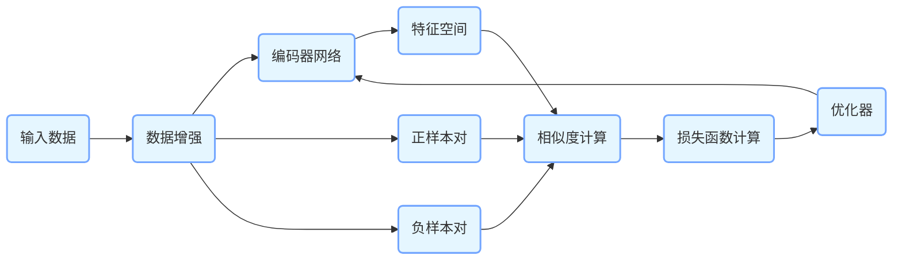

# 对比学习：增强AI Agent的特征表示能力

> 关键词：对比学习、AI Agent、特征表示能力、自监督学习、深度学习

> 摘要：本文围绕对比学习如何增强AI Agent的特征表示能力展开深入探讨。首先介绍了对比学习及AI Agent特征表示的背景知识，包括目的、预期读者、文档结构和相关术语。接着详细阐述了对比学习的核心概念、算法原理，结合Python代码进行说明，并给出了数学模型和公式。通过项目实战展示了对比学习在实际中的应用，分析了开发环境搭建、代码实现和解读。还探讨了对比学习在不同领域的实际应用场景，推荐了相关的学习资源、开发工具和论文著作。最后总结了对比学习的未来发展趋势与挑战，提供了常见问题解答和扩展阅读参考资料，旨在帮助读者全面了解对比学习对增强AI Agent特征表示能力的重要作用。

## 1. 背景介绍 
### 1.1 目的和范围
在人工智能领域，AI Agent需要从复杂的环境中提取有价值的信息，而特征表示能力是其关键。对比学习作为一种自监督学习方法，能够有效增强AI Agent的特征表示能力。本文的目的在于深入剖析对比学习的原理、算法和应用，详细探讨其如何帮助AI Agent更好地理解和处理数据，涵盖对比学习的基本概念、核心算法、数学模型、实际应用案例以及相关工具和资源等方面。

### 1.2 预期读者
本文预期读者包括人工智能领域的研究人员、开发者、学生，以及对对比学习和AI Agent特征表示感兴趣的技术爱好者。他们希望通过本文系统地学习对比学习的相关知识，了解其在增强AI Agent特征表示能力方面的应用，为进一步的研究和实践提供参考。

### 1.3 文档结构概述
本文将按照以下结构进行阐述：首先介绍对比学习和AI Agent特征表示的相关背景知识，包括术语定义；接着详细讲解对比学习的核心概念和联系，给出原理和架构的文本示意图以及Mermaid流程图；然后介绍核心算法原理并结合Python源代码进行说明，同时给出数学模型和公式；通过项目实战展示对比学习的实际应用，包括开发环境搭建、代码实现和解读；探讨对比学习在不同领域的实际应用场景；推荐相关的学习资源、开发工具和论文著作；最后总结对比学习的未来发展趋势与挑战，提供常见问题解答和扩展阅读参考资料。

### 1.4 术语表
#### 1.4.1 核心术语定义
- **对比学习（Contrastive Learning）**：一种自监督学习方法，通过对比正样本对和负样本对的方式，学习数据的特征表示，使得相似的数据在特征空间中距离更近，不相似的数据距离更远。
- **AI Agent（人工智能智能体）**：能够感知环境、做出决策并采取行动以实现特定目标的人工智能实体。
- **特征表示（Feature Representation）**：将原始数据转换为具有代表性的特征向量，以便AI Agent更好地理解和处理数据。
- **正样本对（Positive Pairs）**：由相似的数据组成的样本对，例如同一物体的不同视角图像。
- **负样本对（Negative Pairs）**：由不相似的数据组成的样本对，例如不同物体的图像。

#### 1.4.2 相关概念解释
- **自监督学习（Self-Supervised Learning）**：一种无监督学习方法，通过从数据本身自动生成监督信号来学习数据的特征表示，无需人工标注。
- **特征空间（Feature Space）**：将数据的特征向量映射到的空间，在该空间中可以衡量数据之间的相似度。

#### 1.4.3 缩略词列表
- **CNN（Convolutional Neural Network）**：卷积神经网络
- **MLP（Multi-Layer Perceptron）**：多层感知机
- **SVM（Support Vector Machine）**：支持向量机

## 2. 核心概念与联系 

### 对比学习的核心概念
对比学习的核心思想是通过对比正样本对和负样本对，学习数据的特征表示。具体来说，给定一个输入数据，通过某种变换生成多个视图（例如图像的不同裁剪、旋转等），将这些视图作为正样本对；同时，从数据集中随机选择其他数据作为负样本对。通过设计合适的损失函数，使得正样本对在特征空间中的距离尽可能小，负样本对的距离尽可能大。

### 对比学习与AI Agent特征表示的联系
AI Agent需要从环境中获取信息并进行决策，而特征表示是其理解和处理信息的基础。对比学习可以帮助AI Agent学习到更具区分性和鲁棒性的特征表示，从而提高其在各种任务中的性能。例如，在图像识别任务中，对比学习可以使AI Agent更好地捕捉图像的关键特征，提高识别准确率。

### 原理和架构的文本示意图
对比学习的基本原理架构可以描述为：输入数据经过数据增强模块生成多个视图，这些视图通过编码器网络映射到特征空间，然后计算正样本对和负样本对在特征空间中的相似度，根据相似度计算损失函数，最后通过优化器更新编码器网络的参数。

### Mermaid流程图


## 3. 核心算法原理 & 具体操作步骤 

### 核心算法原理
对比学习的核心算法通常基于对比损失函数，最常见的是InfoNCE（Info Noise Contrastive Estimation）损失函数。InfoNCE损失函数的目标是最大化正样本对之间的互信息，同时最小化负样本对之间的互信息。

### 具体操作步骤
1. **数据准备**：收集原始数据，并进行预处理，例如归一化、裁剪等。
2. **数据增强**：对输入数据进行随机变换，生成多个视图作为正样本对。同时，从数据集中随机选择其他数据作为负样本对。
3. **编码器网络**：使用一个神经网络（如CNN）作为编码器，将输入数据映射到特征空间。
4. **相似度计算**：计算正样本对和负样本对在特征空间中的相似度，通常使用余弦相似度。
5. **损失函数计算**：使用InfoNCE损失函数计算损失值。
6. **参数更新**：使用优化器（如Adam）更新编码器网络的参数，最小化损失函数。

### Python源代码实现
```python
import torch
import torch.nn as nn
import torch.optim as optim
import torch.nn.functional as F

# 定义编码器网络
class Encoder(nn.Module):
    def __init__(self, input_dim, hidden_dim, output_dim):
        super(Encoder, self).__init__()
        self.fc1 = nn.Linear(input_dim, hidden_dim)
        self.fc2 = nn.Linear(hidden_dim, output_dim)

    def forward(self, x):
        x = F.relu(self.fc1(x))
        x = self.fc2(x)
        return x

# 定义InfoNCE损失函数
def info_nce_loss(features, temperature=0.1):
    batch_size = features.shape[0]
    labels = torch.arange(batch_size).to(features.device)
    similarity_matrix = F.cosine_similarity(features.unsqueeze(1), features.unsqueeze(0), dim=2)
    positive_mask = torch.eye(batch_size, dtype=torch.bool).to(features.device)
    negative_mask = ~positive_mask
    positives = similarity_matrix[positive_mask].view(batch_size, -1)
    negatives = similarity_matrix[negative_mask].view(batch_size, -1)
    logits = torch.cat([positives, negatives], dim=1)
    logits /= temperature
    loss = F.cross_entropy(logits, labels)
    return loss

# 训练过程
input_dim = 10
hidden_dim = 20
output_dim = 10
batch_size = 32
num_epochs = 10

encoder = Encoder(input_dim, hidden_dim, output_dim)
optimizer = optim.Adam(encoder.parameters(), lr=0.001)

for epoch in range(num_epochs):
    # 模拟输入数据
    inputs = torch.randn(batch_size, input_dim)
    features = encoder(inputs)
    loss = info_nce_loss(features)
    optimizer.zero_grad()
    loss.backward()
    optimizer.step()
    print(f'Epoch {epoch+1}/{num_epochs}, Loss: {loss.item()}')
```

## 4. 数学模型和公式 & 详细讲解 & 举例说明 

### InfoNCE损失函数的数学模型和公式
InfoNCE损失函数的数学表达式如下：
$$
L_{InfoNCE} = -\log \frac{\exp(sim(z_i, z_j)/\tau)}{\sum_{k=1}^{N} \exp(sim(z_i, z_k)/\tau)}
$$
其中，$z_i$ 和 $z_j$ 是正样本对的特征向量，$sim(\cdot, \cdot)$ 表示相似度计算函数（通常为余弦相似度），$\tau$ 是温度参数，$N$ 是样本总数。

### 详细讲解
InfoNCE损失函数的核心思想是最大化正样本对之间的相似度，同时最小化负样本对之间的相似度。具体来说，通过计算正样本对的相似度得分并进行指数变换，然后除以所有样本对的相似度得分的指数变换之和，最后取负对数得到损失值。温度参数 $\tau$ 用于控制相似度得分的分布，较小的 $\tau$ 会使得正样本对的得分更加突出，从而增强对比效果。

### 举例说明
假设我们有一个样本对 $(z_1, z_2)$ 作为正样本对，另外还有两个负样本对 $(z_1, z_3)$ 和 $(z_1, z_4)$。假设相似度得分分别为 $sim(z_1, z_2) = 0.8$，$sim(z_1, z_3) = 0.2$，$sim(z_1, z_4) = 0.1$，温度参数 $\tau = 0.1$。则正样本对的指数变换得分 $\exp(sim(z_1, z_2)/\tau) = \exp(0.8/0.1) = \exp(8)$，所有样本对的指数变换得分之和为 $\exp(0.8/0.1) + \exp(0.2/0.1) + \exp(0.1/0.1) = \exp(8) + \exp(2) + \exp(1)$。则损失值为：
$$
L_{InfoNCE} = -\log \frac{\exp(8)}{\exp(8) + \exp(2) + \exp(1)}
$$

## 5. 项目实战：代码实际案例和详细解释说明 

### 5.1  开发环境搭建
为了实现对比学习的项目实战，我们需要搭建以下开发环境：
- **操作系统**：推荐使用Linux系统，如Ubuntu 18.04或更高版本。
- **Python环境**：安装Python 3.7或更高版本。
- **深度学习框架**：使用PyTorch深度学习框架，可通过以下命令安装：
```bash
pip install torch torchvision
```
- **其他依赖库**：安装NumPy、Matplotlib等常用库，可通过以下命令安装：
```bash
pip install numpy matplotlib
```

### 5.2  源代码详细实现和代码解读
以下是一个基于CIFAR-10数据集的对比学习项目实战代码：
```python
import torch
import torch.nn as nn
import torch.optim as optim
import torchvision
import torchvision.transforms as transforms
from torch.utils.data import DataLoader

# 定义编码器网络
class Encoder(nn.Module):
    def __init__(self):
        super(Encoder, self).__init__()
        self.conv1 = nn.Conv2d(3, 64, kernel_size=3, stride=1, padding=1)
        self.relu1 = nn.ReLU()
        self.pool1 = nn.MaxPool2d(kernel_size=2, stride=2)
        self.conv2 = nn.Conv2d(64, 128, kernel_size=3, stride=1, padding=1)
        self.relu2 = nn.ReLU()
        self.pool2 = nn.MaxPool2d(kernel_size=2, stride=2)
        self.fc1 = nn.Linear(128 * 8 * 8, 256)
        self.relu3 = nn.ReLU()
        self.fc2 = nn.Linear(256, 128)

    def forward(self, x):
        x = self.pool1(self.relu1(self.conv1(x)))
        x = self.pool2(self.relu2(self.conv2(x)))
        x = x.view(-1, 128 * 8 * 8)
        x = self.relu3(self.fc1(x))
        x = self.fc2(x)
        return x

# 定义InfoNCE损失函数
def info_nce_loss(features, temperature=0.1):
    batch_size = features.shape[0]
    labels = torch.arange(batch_size).to(features.device)
    similarity_matrix = F.cosine_similarity(features.unsqueeze(1), features.unsqueeze(0), dim=2)
    positive_mask = torch.eye(batch_size, dtype=torch.bool).to(features.device)
    negative_mask = ~positive_mask
    positives = similarity_matrix[positive_mask].view(batch_size, -1)
    negatives = similarity_matrix[negative_mask].view(batch_size, -1)
    logits = torch.cat([positives, negatives], dim=1)
    logits /= temperature
    loss = F.cross_entropy(logits, labels)
    return loss

# 数据预处理
transform = transforms.Compose([
    transforms.RandomResizedCrop(32),
    transforms.RandomHorizontalFlip(),
    transforms.ToTensor(),
    transforms.Normalize((0.5, 0.5, 0.5), (0.5, 0.5, 0.5))
])

# 加载CIFAR-10数据集
trainset = torchvision.datasets.CIFAR10(root='./data', train=True,
                                        download=True, transform=transform)
trainloader = DataLoader(trainset, batch_size=32, shuffle=True)

# 初始化编码器网络和优化器
encoder = Encoder()
optimizer = optim.Adam(encoder.parameters(), lr=0.001)

# 训练过程
num_epochs = 10
for epoch in range(num_epochs):
    running_loss = 0.0
    for i, data in enumerate(trainloader, 0):
        inputs, _ = data
        features = encoder(inputs)
        loss = info_nce_loss(features)
        optimizer.zero_grad()
        loss.backward()
        optimizer.step()
        running_loss += loss.item()
    print(f'Epoch {epoch+1}/{num_epochs}, Loss: {running_loss / len(trainloader)}')
```

### 代码解读与分析
1. **编码器网络**：定义了一个简单的卷积神经网络作为编码器，将输入的图像数据映射到特征空间。
2. **InfoNCE损失函数**：计算正样本对和负样本对的相似度得分，并根据InfoNCE损失函数计算损失值。
3. **数据预处理**：使用随机裁剪、水平翻转等数据增强方法对输入图像进行处理，生成多个视图作为正样本对。
4. **数据加载**：使用PyTorch的DataLoader加载CIFAR-10数据集。
5. **训练过程**：在每个epoch中，遍历训练数据集，计算特征向量和损失值，然后使用优化器更新编码器网络的参数。

## 6. 实际应用场景 
### 图像识别
在图像识别任务中，对比学习可以帮助AI Agent学习到更具区分性的图像特征表示。通过对比同一物体的不同视角、光照条件下的图像，以及不同物体的图像，AI Agent可以更好地捕捉图像的关键特征，提高识别准确率。例如，在人脸识别任务中，对比学习可以使模型更好地处理不同姿态、表情下的人脸图像。

### 自然语言处理
在自然语言处理领域，对比学习可以用于学习文本的语义表示。通过对比语义相似的句子和语义不同的句子，模型可以学习到更准确的文本特征表示，从而提高在文本分类、情感分析、机器翻译等任务中的性能。例如，在问答系统中，对比学习可以帮助模型更好地理解问题和答案之间的语义关系。

### 推荐系统
在推荐系统中，对比学习可以用于学习用户和物品的特征表示。通过对比用户喜欢的物品和不喜欢的物品，模型可以学习到用户的兴趣偏好，从而为用户提供更个性化的推荐。例如，在电商推荐系统中，对比学习可以帮助模型更好地理解用户的购买行为和商品的特征，提高推荐的准确性和多样性。

### 强化学习
在强化学习中，对比学习可以帮助AI Agent学习到更有效的策略表示。通过对比不同状态下的最优动作和非最优动作，AI Agent可以学习到更好的策略，从而提高在复杂环境中的决策能力。例如，在机器人导航任务中，对比学习可以帮助机器人更好地理解环境信息，选择最优的导航路径。

## 7. 工具和资源推荐
### 7.1 学习资源推荐
#### 7.1.1 书籍推荐
- 《深度学习》（Deep Learning）：由Ian Goodfellow、Yoshua Bengio和Aaron Courville所著，是深度学习领域的经典教材，涵盖了对比学习等多种深度学习方法的原理和应用。
- 《Python深度学习》（Deep Learning with Python）：由Francois Chollet所著，通过Python代码示例详细介绍了深度学习的实践方法，包括对比学习的实现。

#### 7.1.2 在线课程
- Coursera上的“深度学习专项课程”（Deep Learning Specialization）：由Andrew Ng教授授课，系统地介绍了深度学习的各个方面，包括对比学习的原理和应用。
- edX上的“强化学习基础”（Fundamentals of Reinforcement Learning）：涵盖了强化学习中的对比学习方法，适合对强化学习和对比学习感兴趣的学习者。

#### 7.1.3 技术博客和网站
- Medium上的“Towards Data Science”：有许多关于对比学习和人工智能的技术文章，涵盖了最新的研究成果和实践经验。
- arXiv.org：是一个预印本平台，提供了大量关于对比学习的研究论文，可及时了解该领域的最新研究动态。

### 7.2 开发工具框架推荐
#### 7.2.1 IDE和编辑器
- PyCharm：是一款专门为Python开发设计的集成开发环境，提供了丰富的代码编辑、调试和分析功能，适合开发对比学习相关的项目。
- Jupyter Notebook：是一个交互式的开发环境，支持Python代码的实时运行和可视化，方便进行对比学习的实验和调试。

#### 7.2.2 调试和性能分析工具
- TensorBoard：是TensorFlow提供的可视化工具，也可以用于PyTorch项目。它可以帮助开发者可视化模型的训练过程、损失曲线、特征表示等，方便进行调试和性能分析。
- PyTorch Profiler：是PyTorch提供的性能分析工具，可以帮助开发者分析模型的计算性能、内存使用情况等，优化模型的性能。

#### 7.2.3 相关框架和库
- PyTorch：是一个开源的深度学习框架，提供了丰富的神经网络层和优化算法，方便实现对比学习的模型。
- torchvision：是PyTorch的计算机视觉库，提供了常用的图像数据集、数据增强方法和预训练模型，可用于对比学习在图像领域的应用。

### 7.3 相关论文著作推荐
#### 7.3.1 经典论文
- “A Simple Framework for Contrastive Learning of Visual Representations”（SimCLR）：提出了一种简单而有效的对比学习框架，在图像表示学习中取得了很好的效果。
- “Momentum Contrast for Unsupervised Visual Representation Learning”（MoCo）：引入了动量编码器和队列机制，提高了对比学习的效率和性能。

#### 7.3.2 最新研究成果
- 关注NeurIPS、ICML、CVPR等顶级学术会议的论文，了解对比学习领域的最新研究成果和发展趋势。

#### 7.3.3 应用案例分析
- 可以在ACM Digital Library、IEEE Xplore等学术数据库中查找对比学习在不同领域的应用案例分析论文，深入了解其实际应用效果和挑战。

## 8. 总结：未来发展趋势与挑战
### 未来发展趋势
- **与其他学习方法的融合**：对比学习可能会与强化学习、迁移学习等其他学习方法相结合，形成更强大的学习框架，提高AI Agent在复杂环境中的学习和决策能力。
- **在多模态数据中的应用**：随着多模态数据（如图像、文本、音频等）的日益丰富，对比学习将在多模态数据的特征表示学习中发挥重要作用，促进多模态人工智能的发展。
- **可解释性研究**：为了更好地理解对比学习的决策过程和结果，未来将加强对对比学习模型的可解释性研究，提高模型的可信度和可靠性。

### 挑战
- **计算资源需求**：对比学习通常需要大量的计算资源和时间来训练模型，尤其是在处理大规模数据集时，如何降低计算成本是一个挑战。
- **负样本选择**：负样本的选择对对比学习的性能有重要影响，如何选择合适的负样本是一个需要进一步研究的问题。
- **泛化能力**：虽然对比学习在许多任务中取得了很好的效果，但在一些复杂的实际场景中，模型的泛化能力仍然有待提高。

## 9. 附录：常见问题与解答
### 对比学习与监督学习有什么区别？
监督学习需要大量的人工标注数据，通过标注信息来学习模型的参数。而对比学习是一种自监督学习方法，无需人工标注，通过对比正样本对和负样本对来学习数据的特征表示。

### 如何选择合适的温度参数 $\tau$？
温度参数 $\tau$ 通常需要通过实验来选择。较小的 $\tau$ 会使得正样本对的得分更加突出，增强对比效果，但可能会导致模型过拟合；较大的 $\tau$ 会使得得分分布更加平滑，但可能会降低对比效果。一般可以从0.1开始尝试，根据实验结果进行调整。

### 对比学习在小数据集上的效果如何？
对比学习在小数据集上的效果可能不如在大数据集上的效果好。因为对比学习需要足够的样本多样性来学习到有效的特征表示，小数据集可能无法提供足够的信息。可以考虑使用数据增强、预训练模型等方法来提高在小数据集上的性能。

## 10. 扩展阅读 & 参考资料
- Goodfellow, I., Bengio, Y., & Courville, A. (2016). Deep Learning. MIT Press.
- Chollet, F. (2017). Deep Learning with Python. Manning Publications.
- Chen, T., Kornblith, S., Norouzi, M., & Hinton, G. (2020). A Simple Framework for Contrastive Learning of Visual Representations. arXiv preprint arXiv:2002.05709.
- He, K., Fan, H., Wu, Y., Xie, S., & Girshick, R. (2020). Momentum Contrast for Unsupervised Visual Representation Learning. In Proceedings of the IEEE/CVF Conference on Computer Vision and Pattern Recognition (pp. 9729-9738).

作者：AI天才研究院/AI Genius Institute & 禅与计算机程序设计艺术 /Zen And The Art of Computer Programming