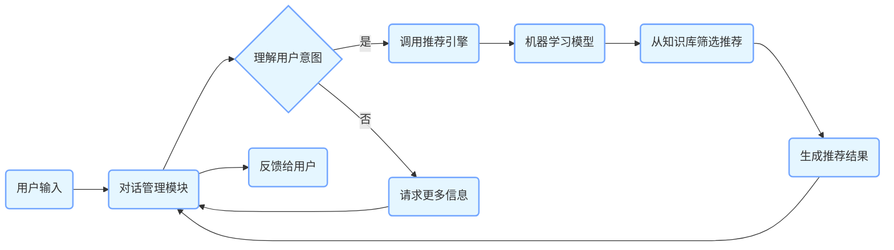

# 对话式推荐：个性化AI Agent的建议

> 关键词：对话式推荐、个性化AI Agent、推荐系统、自然语言处理、用户交互

> 摘要：本文聚焦于对话式推荐这一前沿领域，深入探讨了个性化AI Agent在其中的作用与应用。通过介绍对话式推荐的背景，详细阐述其核心概念、算法原理、数学模型等内容，并结合实际案例展示具体实现过程。同时，分析了对话式推荐的实际应用场景，推荐了相关的学习资源、开发工具和研究论文。最后，对对话式推荐的未来发展趋势与挑战进行总结，为该领域的研究和实践提供了全面且深入的参考。

## 1. 背景介绍 
### 1.1 目的和范围
随着互联网信息的爆炸式增长，用户在面对海量信息时往往感到无所适从。传统的推荐系统虽然在一定程度上能够为用户提供相关的推荐内容，但缺乏与用户的有效交互，难以满足用户个性化的需求。对话式推荐作为一种新兴的推荐方式，通过引入自然语言处理技术，实现了与用户的实时交互，能够根据用户的反馈动态调整推荐策略，为用户提供更加个性化、精准的推荐。

本文的目的在于全面介绍对话式推荐的相关知识，包括其核心概念、算法原理、数学模型、实际应用等方面。同时，通过实际案例展示对话式推荐系统的开发过程，为读者提供一个完整的技术实现参考。文章的范围涵盖了对话式推荐的基本原理、关键技术以及实际应用场景，旨在帮助读者深入理解对话式推荐，并掌握相关的开发技能。

### 1.2 预期读者
本文预期读者包括但不限于以下几类人群：
- **技术开发者**：对推荐系统、自然语言处理等领域感兴趣，希望了解对话式推荐的技术原理和实现方法，以便在实际项目中应用。
- **研究人员**：从事人工智能、信息检索等相关领域的研究工作，希望深入研究对话式推荐的理论和算法，推动该领域的发展。
- **产品经理**：负责设计和开发推荐类产品，希望了解对话式推荐的特点和优势，以便为产品引入新的功能和体验。
- **普通用户**：对人工智能和个性化推荐感兴趣，希望了解对话式推荐的工作原理和应用场景，以便更好地使用相关的产品和服务。

### 1.3 文档结构概述
本文将按照以下结构进行组织：
- **核心概念与联系**：介绍对话式推荐和个性化AI Agent的核心概念，以及它们之间的联系，并通过文本示意图和Mermaid流程图进行可视化展示。
- **核心算法原理 & 具体操作步骤**：详细讲解对话式推荐中常用的算法原理，并使用Python源代码进行具体实现。
- **数学模型和公式 & 详细讲解 & 举例说明**：介绍对话式推荐的数学模型和相关公式，并通过具体例子进行详细解释。
- **项目实战：代码实际案例和详细解释说明**：通过一个实际的对话式推荐项目，展示开发环境搭建、源代码实现和代码解读的过程。
- **实际应用场景**：分析对话式推荐在不同领域的实际应用场景。
- **工具和资源推荐**：推荐相关的学习资源、开发工具和研究论文。
- **总结：未来发展趋势与挑战**：对对话式推荐的未来发展趋势进行展望，并分析可能面临的挑战。
- **附录：常见问题与解答**：解答读者在学习和实践过程中可能遇到的常见问题。
- **扩展阅读 & 参考资料**：提供相关的扩展阅读材料和参考资料，方便读者进一步深入学习。

### 1.4 术语表
#### 1.4.1 核心术语定义
- **对话式推荐**：一种基于自然语言交互的推荐方式，通过与用户进行实时对话，了解用户的需求和偏好，从而为用户提供个性化的推荐。
- **个性化AI Agent**：具有智能交互能力的人工智能代理，能够根据用户的个性化特征和历史行为，为用户提供定制化的服务和建议。
- **推荐系统**：一种信息过滤系统，通过分析用户的历史行为、兴趣爱好等信息，为用户推荐可能感兴趣的物品或内容。
- **自然语言处理（NLP）**：计算机科学与语言学的交叉领域，旨在让计算机理解和处理人类语言，实现人与计算机之间的自然语言交互。

#### 1.4.2 相关概念解释
- **用户画像**：对用户的特征、兴趣、行为等信息进行建模和描述，以便更好地了解用户需求，为用户提供个性化的服务。
- **上下文感知**：在对话过程中，能够理解当前对话的上下文信息，从而更准确地理解用户的意图和需求。
- **多轮对话**：用户与系统之间进行多次交互的对话过程，系统能够根据用户的历史对话信息进行推理和决策。

#### 1.4.3 缩略词列表
- **NLP**：Natural Language Processing（自然语言处理）
- **AI**：Artificial Intelligence（人工智能）
- **ML**：Machine Learning（机器学习）
- **DL**：Deep Learning（深度学习）

## 2. 核心概念与联系 

### 核心概念原理
#### 对话式推荐
对话式推荐的核心原理是通过与用户进行自然语言交互，获取用户的需求信息，并根据这些信息为用户提供个性化的推荐。在对话过程中，系统需要理解用户的意图，分析用户的偏好，同时考虑对话的上下文信息，以实现更加精准的推荐。

#### 个性化AI Agent
个性化AI Agent是一种智能代理，它能够根据用户的个性化特征和历史行为，为用户提供定制化的服务和建议。个性化AI Agent通常具备自然语言处理能力、知识推理能力和学习能力，能够与用户进行自然流畅的对话，并根据用户的反馈不断优化推荐策略。

### 架构的文本示意图
```plaintext
用户 <-> 对话管理模块 <-> 推荐引擎 <-> 知识库
       |                   |
       |                   |
    自然语言处理       机器学习模型
```
解释：用户通过自然语言与对话管理模块进行交互，对话管理模块利用自然语言处理技术理解用户的意图，并将其转化为推荐引擎能够处理的格式。推荐引擎根据用户的需求和偏好，结合机器学习模型从知识库中筛选出合适的推荐内容，并将结果返回给对话管理模块。对话管理模块再将推荐结果以自然语言的形式反馈给用户。

### Mermaid流程图


## 3. 核心算法原理 & 具体操作步骤 

### 算法原理
#### 意图识别算法
意图识别是对话式推荐的关键步骤之一，其目的是理解用户的输入意图。常用的意图识别算法包括基于规则的方法、机器学习方法和深度学习方法。

基于规则的方法通过预定义的规则来匹配用户的输入，判断用户的意图。这种方法简单直接，但对于复杂的语言表达和多样化的用户需求，规则的覆盖范围有限。

机器学习方法则通过训练分类模型来识别用户的意图。常见的机器学习算法包括决策树、支持向量机、朴素贝叶斯等。这些算法需要大量的标注数据进行训练，以提高识别的准确性。

深度学习方法利用神经网络模型来学习语言的语义信息，从而实现更准确的意图识别。例如，使用卷积神经网络（CNN）、循环神经网络（RNN）及其变体（如LSTM、GRU）等模型。

#### 推荐算法
推荐算法用于根据用户的需求和偏好，从候选物品中筛选出合适的推荐内容。常见的推荐算法包括基于内容的推荐、协同过滤推荐和混合推荐。

基于内容的推荐通过分析物品的特征和用户的历史行为，推荐与用户感兴趣的物品具有相似特征的其他物品。

协同过滤推荐则通过分析用户之间的行为相似度，推荐与目标用户行为相似的其他用户喜欢的物品。

混合推荐结合了基于内容的推荐和协同过滤推荐的优点，以提高推荐的准确性和多样性。

### 具体操作步骤
#### 意图识别步骤
```python
import nltk
from sklearn.feature_extraction.text import TfidfVectorizer
from sklearn.svm import SVC

# 步骤1：数据准备
train_data = [
    ("我想看科幻电影", "科幻电影推荐"),
    ("给我推荐几本悬疑小说", "悬疑小说推荐"),
    ("有没有好吃的西餐厅", "西餐厅推荐")
]

train_texts = [text for text, _ in train_data]
train_labels = [label for _, label in train_data]

# 步骤2：文本特征提取
vectorizer = TfidfVectorizer()
X_train = vectorizer.fit_transform(train_texts)

# 步骤3：模型训练
model = SVC()
model.fit(X_train, train_labels)

# 步骤4：意图识别
user_input = "我想看恐怖电影"
X_test = vectorizer.transform([user_input])
predicted_intent = model.predict(X_test)[0]

print(f"用户意图: {predicted_intent}")
```
#### 推荐步骤
```python
# 假设我们有一个电影数据集
movies = [
    {"title": "星际穿越", "genre": "科幻"},
    {"title": "盗梦空间", "genre": "科幻"},
    {"title": "电锯惊魂", "genre": "恐怖"},
    {"title": "招魂", "genre": "恐怖"}
]

# 根据意图进行推荐
if predicted_intent == "科幻电影推荐":
    recommended_movies = [movie["title"] for movie in movies if movie["genre"] == "科幻"]
elif predicted_intent == "恐怖电影推荐":
    recommended_movies = [movie["title"] for movie in movies if movie["genre"] == "恐怖"]

print(f"推荐电影: {recommended_movies}")
```

## 4. 数学模型和公式 & 详细讲解 & 举例说明 

### 意图识别的数学模型
#### 基于机器学习的意图识别
假设我们有一个训练数据集 $D = \{(x_1, y_1), (x_2, y_2), \cdots, (x_n, y_n)\}$，其中 $x_i$ 是用户输入的文本特征向量，$y_i$ 是对应的意图标签。我们的目标是学习一个分类函数 $f(x)$，使得对于新的输入 $x$，能够预测其意图标签 $\hat{y} = f(x)$。

常用的分类模型如支持向量机（SVM），其目标是找到一个最优的超平面 $w^T x + b = 0$，将不同类别的样本分开。SVM的优化目标可以表示为：
$$
\begin{aligned}
\min_{w, b, \xi} &\quad \frac{1}{2} w^T w + C \sum_{i=1}^{n} \xi_i \\
\text{s.t.} &\quad y_i (w^T x_i + b) \geq 1 - \xi_i, \quad i = 1, 2, \cdots, n \\
&\quad \xi_i \geq 0, \quad i = 1, 2, \cdots, n
\end{aligned}
$$
其中，$w$ 是超平面的法向量，$b$ 是偏置项，$\xi_i$ 是松弛变量，用于处理线性不可分的情况，$C$ 是惩罚参数。

#### 举例说明
假设我们有一个简单的二分类问题，训练数据如下：
| 文本特征向量 $x$ | 意图标签 $y$ |
| --- | --- |
| $[1, 2]$ | $1$ |
| $[2, 3]$ | $1$ |
| $[-1, -2]$ | $-1$ |
| $[-2, -3]$ | $-1$ |

我们使用SVM进行训练，通过求解上述优化问题，得到最优的超平面 $w^T x + b = 0$。对于新的输入 $x = [3, 4]$，我们可以通过计算 $w^T x + b$ 的值来预测其意图标签。如果 $w^T x + b > 0$，则预测标签为 $1$；否则，预测标签为 $-1$。

### 推荐算法的数学模型
#### 基于内容的推荐
假设我们有一个物品集合 $I = \{i_1, i_2, \cdots, i_m\}$，每个物品 $i_j$ 有一个特征向量 $v_j$。用户的历史行为可以表示为一个物品集合 $H$。我们的目标是计算每个物品 $i_j$ 与用户历史行为的相似度，然后根据相似度进行排序，推荐相似度较高的物品。

常用的相似度计算方法是余弦相似度，其计算公式为：
$$
\text{sim}(v_i, v_j) = \frac{v_i^T v_j}{\|v_i\| \|v_j\|}
$$
其中，$\|v_i\|$ 和 $\|v_j\|$ 分别是向量 $v_i$ 和 $v_j$ 的模。

#### 举例说明
假设我们有两个电影，其特征向量分别为 $v_1 = [1, 2, 3]$ 和 $v_2 = [2, 4, 6]$。我们可以计算它们之间的余弦相似度：
$$
\text{sim}(v_1, v_2) = \frac{[1, 2, 3]^T [2, 4, 6]}{\sqrt{1^2 + 2^2 + 3^2} \sqrt{2^2 + 4^2 + 6^2}} = \frac{2 + 8 + 18}{\sqrt{14} \sqrt{56}} = 1
$$
由于余弦相似度为 $1$，说明这两个电影的特征非常相似。

## 5. 项目实战：代码实际案例和详细解释说明 

### 5.1  开发环境搭建
#### 安装Python
首先，确保你已经安装了Python 3.x版本。你可以从Python官方网站（https://www.python.org/downloads/）下载并安装适合你操作系统的Python版本。

#### 安装必要的库
我们需要安装一些必要的Python库，包括`nltk`、`sklearn`等。可以使用以下命令进行安装：
```sh
pip install nltk scikit-learn
```
同时，还需要下载`nltk`的相关数据：
```python
import nltk
nltk.download('punkt')
```

### 5.2  源代码详细实现和代码解读
```python
import nltk
from sklearn.feature_extraction.text import TfidfVectorizer
from sklearn.svm import SVC

# 步骤1：数据准备
train_data = [
    ("我想听流行音乐", "流行音乐推荐"),
    ("给我推荐一些摇滚歌曲", "摇滚歌曲推荐"),
    ("有没有好听的古典音乐", "古典音乐推荐")
]

train_texts = [text for text, _ in train_data]
train_labels = [label for _, label in train_data]

# 步骤2：文本特征提取
vectorizer = TfidfVectorizer()
X_train = vectorizer.fit_transform(train_texts)

# 步骤3：模型训练
model = SVC()
model.fit(X_train, train_labels)

# 步骤4：对话式推荐系统主循环
while True:
    user_input = input("请输入你的需求（输入 '退出' 结束对话）：")
    if user_input == "退出":
        break
    
    # 意图识别
    X_test = vectorizer.transform([user_input])
    predicted_intent = model.predict(X_test)[0]
    
    # 简单的推荐逻辑
    if predicted_intent == "流行音乐推荐":
        recommended_music = ["周杰伦 - 青花瓷", "林俊杰 - 江南"]
    elif predicted_intent == "摇滚歌曲推荐":
        recommended_music = ["黑豹乐队 - 无地自容", "唐朝乐队 - 梦回唐朝"]
    elif predicted_intent == "古典音乐推荐":
        recommended_music = ["巴赫 - 哥德堡变奏曲", "贝多芬 - 月光奏鸣曲"]
    
    print(f"推荐意图: {predicted_intent}")
    print(f"推荐音乐: {recommended_music}")
```

### 5.3  代码解读与分析
- **数据准备**：我们定义了一个训练数据集，包含用户的输入文本和对应的意图标签。通过将文本和标签分离，为后续的特征提取和模型训练做准备。
- **文本特征提取**：使用`TfidfVectorizer`将文本转换为特征向量。TF-IDF（词频 - 逆文档频率）是一种常用的文本特征表示方法，能够反映一个词在文档中的重要程度。
- **模型训练**：使用支持向量机（SVM）作为分类模型，对训练数据进行训练。SVM是一种强大的分类算法，能够在高维空间中找到最优的分类超平面。
- **对话式推荐系统主循环**：通过一个无限循环，不断接收用户的输入。当用户输入“退出”时，循环结束。对于用户的输入，首先进行意图识别，然后根据识别结果进行简单的推荐。

## 6. 实际应用场景 
### 电商领域
在电商平台中，对话式推荐可以帮助用户快速找到他们想要的商品。用户可以通过与AI Agent进行对话，描述自己的需求，如商品的类型、价格范围、品牌等。AI Agent根据用户的描述，从商品库中筛选出合适的商品进行推荐，并可以进一步与用户交互，了解用户的更多偏好，优化推荐结果。

### 娱乐领域
在音乐、电影、游戏等娱乐领域，对话式推荐可以为用户提供个性化的娱乐内容推荐。用户可以与AI Agent交流自己喜欢的音乐风格、电影类型、游戏玩法等，AI Agent根据用户的喜好推荐相关的音乐、电影或游戏。同时，AI Agent还可以根据用户的历史消费记录和评价，提供更加精准的推荐。

### 旅游领域
在旅游领域，对话式推荐可以帮助用户规划旅游行程。用户可以告诉AI Agent自己的旅游目的地、旅游时间、预算等信息，AI Agent根据这些信息为用户推荐合适的旅游景点、酒店、交通方式等，并可以提供详细的旅游攻略和建议。

### 金融领域
在金融领域，对话式推荐可以为用户提供个性化的投资建议。用户可以与AI Agent交流自己的投资目标、风险承受能力等信息，AI Agent根据用户的情况推荐合适的投资产品，如股票、基金、债券等，并可以实时跟踪市场动态，为用户提供投资决策支持。

## 7. 工具和资源推荐
### 7.1 学习资源推荐
#### 7.1.1 书籍推荐
- 《自然语言处理入门》：这本书系统地介绍了自然语言处理的基本概念、算法和技术，适合初学者入门。
- 《推荐系统实践》：详细讲解了推荐系统的原理、算法和实现方法，包含了大量的实际案例和代码示例。
- 《Python机器学习》：全面介绍了Python在机器学习领域的应用，包括各种机器学习算法的原理和实现。

#### 7.1.2 在线课程
- Coursera上的“自然语言处理专项课程”：由顶尖高校的教授授课，涵盖了自然语言处理的各个方面，包括词法分析、句法分析、语义理解等。
- edX上的“推荐系统基础”：系统地介绍了推荐系统的基本概念、算法和评估方法，适合初学者学习。
- 网易云课堂上的“Python深度学习实战”：通过实际项目，讲解了Python在深度学习领域的应用，包括神经网络的构建、训练和优化。

#### 7.1.3 技术博客和网站
- 机器之心：提供了大量关于人工智能、机器学习、自然语言处理等领域的最新技术文章和研究成果。
- 博客园：有很多技术开发者分享自己的学习经验和项目实践，对于学习对话式推荐和相关技术有很大的帮助。
- Kaggle：一个数据科学竞赛平台，上面有很多关于推荐系统和自然语言处理的竞赛和数据集，可以通过参与竞赛来提高自己的实践能力。

### 7.2 开发工具框架推荐
#### 7.2.1 IDE和编辑器
- PyCharm：一款专业的Python集成开发环境，提供了丰富的代码编辑、调试、版本控制等功能，适合开发Python项目。
- Jupyter Notebook：一种交互式的开发环境，支持代码、文本、图像等多种形式的展示，非常适合进行数据分析和模型训练。
- Visual Studio Code：一款轻量级的代码编辑器，支持多种编程语言和插件扩展，具有良好的开发体验。

#### 7.2.2 调试和性能分析工具
- PDB：Python自带的调试器，可以帮助开发者在代码中设置断点、单步执行、查看变量值等，方便调试代码。
- cProfile：Python的性能分析工具，可以统计代码中各个函数的执行时间和调用次数，帮助开发者找出性能瓶颈。
- TensorBoard：TensorFlow的可视化工具，可以用于可视化模型的训练过程、损失函数变化、网络结构等，方便开发者进行模型调优。

#### 7.2.3 相关框架和库
- NLTK：一个强大的自然语言处理库，提供了丰富的文本处理工具和数据集，如分词、词性标注、命名实体识别等。
- Scikit-learn：一个常用的机器学习库，包含了各种机器学习算法和工具，如分类、回归、聚类等，方便开发者进行模型训练和评估。
- PyTorch：一个深度学习框架，具有动态图机制，易于使用和调试，广泛应用于自然语言处理、计算机视觉等领域。

### 7.3 相关论文著作推荐
#### 7.3.1 经典论文
- "Item-based Collaborative Filtering Recommendation Algorithms"：提出了基于物品的协同过滤推荐算法，是协同过滤推荐领域的经典论文。
- "Deep Neural Networks for YouTube Recommendations"：介绍了YouTube使用深度学习模型进行推荐的方法和经验，对于理解深度学习在推荐系统中的应用具有重要意义。
- "Natural Language Processing (Almost) from Scratch"：详细介绍了自然语言处理的基本原理和算法，是自然语言处理领域的经典综述论文。

#### 7.3.2 最新研究成果
- 在ACM SIGIR、WWW、NeurIPS等顶级学术会议上，每年都会有很多关于对话式推荐和个性化AI Agent的最新研究成果发表。可以关注这些会议的论文集，了解该领域的最新发展动态。
- arXiv是一个预印本平台，上面有很多关于人工智能、机器学习等领域的最新研究论文。可以通过搜索相关关键词，获取最新的研究成果。

#### 7.3.3 应用案例分析
- 《智能商业》：介绍了很多企业在人工智能和大数据领域的应用案例，包括对话式推荐在电商、金融等领域的实际应用，对于理解对话式推荐的商业价值具有参考意义。
- 一些知名科技公司的技术博客，如Google、Facebook、Amazon等，会分享他们在推荐系统和自然语言处理方面的实践经验和应用案例，可以从中学习到很多实际的开发技巧和方法。

## 8. 总结：未来发展趋势与挑战
### 未来发展趋势
#### 多模态融合
未来的对话式推荐系统将不仅仅局限于文本交互，还会融合语音、图像、视频等多种模态信息。例如，用户可以通过语音描述自己的需求，同时上传相关的图片，系统根据多模态信息进行更加精准的推荐。

#### 强化学习的应用
强化学习可以让对话式推荐系统在与用户的交互过程中不断学习和优化推荐策略。通过奖励机制，系统可以根据用户的反馈调整推荐行为，以获得更好的推荐效果。

#### 跨领域推荐
随着用户需求的多样化，对话式推荐系统将逐渐实现跨领域推荐。例如，用户在询问旅游信息的同时，系统还可以推荐相关的美食、购物等信息，为用户提供更加全面的服务。

#### 个性化程度的提升
未来的对话式推荐系统将更加注重用户的个性化需求，不仅考虑用户的历史行为和偏好，还会结合用户的实时状态、情绪等因素，提供更加个性化、贴心的推荐服务。

### 挑战
#### 数据隐私和安全
对话式推荐系统需要收集和处理大量的用户数据，这涉及到用户的隐私和数据安全问题。如何在保证推荐效果的同时，保护用户的隐私和数据安全，是一个亟待解决的问题。

#### 自然语言理解的准确性
虽然自然语言处理技术取得了很大的进展，但在处理复杂的语言表达和语义理解方面，仍然存在一定的挑战。如何提高自然语言理解的准确性，是对话式推荐系统面临的重要问题。

#### 可解释性和透明度
对话式推荐系统的推荐结果往往是基于复杂的机器学习模型和算法，缺乏可解释性和透明度。用户往往不知道系统为什么会推荐这些内容，这可能会影响用户对系统的信任度。如何提高推荐结果的可解释性和透明度，是未来研究的一个重要方向。

#### 计算资源和效率
随着数据量的不断增加和模型复杂度的提高，对话式推荐系统需要消耗大量的计算资源和时间。如何在保证推荐效果的同时，提高系统的计算效率，降低计算成本，是一个需要解决的实际问题。

## 9. 附录：常见问题与解答
### 问题1：对话式推荐系统与传统推荐系统有什么区别？
解答：传统推荐系统主要基于用户的历史行为数据进行推荐，缺乏与用户的实时交互。而对话式推荐系统通过自然语言交互，能够实时了解用户的需求和偏好，动态调整推荐策略，为用户提供更加个性化、精准的推荐。

### 问题2：如何提高意图识别的准确性？
解答：可以从以下几个方面提高意图识别的准确性：
- 增加训练数据：使用更多的标注数据进行模型训练，提高模型的泛化能力。
- 选择合适的算法：根据具体的应用场景和数据特点，选择合适的意图识别算法，如深度学习算法通常在处理复杂的语言表达时具有更好的效果。
- 结合上下文信息：在对话过程中，考虑对话的上下文信息，以更准确地理解用户的意图。

### 问题3：如何评估对话式推荐系统的性能？
解答：可以从以下几个方面评估对话式推荐系统的性能：
- 推荐准确率：衡量推荐结果与用户实际需求的匹配程度。
- 召回率：衡量系统能够推荐出所有相关物品的比例。
- 用户满意度：通过用户反馈和问卷调查等方式，了解用户对推荐结果的满意度。
- 对话流畅度：评估系统与用户之间的对话是否自然流畅，是否能够准确理解用户的意图。

### 问题4：对话式推荐系统需要哪些技术支持？
解答：对话式推荐系统需要以下技术支持：
- 自然语言处理技术：用于理解用户的输入意图，包括分词、词性标注、命名实体识别、语义理解等。
- 机器学习和深度学习技术：用于构建推荐模型和意图识别模型，如协同过滤、深度学习神经网络等。
- 知识图谱技术：用于存储和管理领域知识，为推荐提供更丰富的信息。
- 对话管理技术：用于管理对话流程，处理多轮对话和上下文信息。

## 10. 扩展阅读 & 参考资料
### 扩展阅读
- 《人工智能：现代方法》：全面介绍了人工智能的基本概念、算法和应用，对于深入理解对话式推荐的相关技术有很大的帮助。
- 《深度学习》：由深度学习领域的三位顶尖专家撰写，系统地介绍了深度学习的原理、算法和应用，是深度学习领域的经典著作。
- 《大数据时代：生活、工作与思维的大变革》：探讨了大数据对社会、经济和生活的影响，对于理解对话式推荐系统中数据的重要性具有启示作用。

### 参考资料
- 相关学术论文：在ACM SIGIR、WWW、NeurIPS等学术会议和期刊上发表的关于对话式推荐、个性化AI Agent、自然语言处理、推荐系统等方面的论文。
- 开源代码库：如GitHub上的相关项目，例如基于Python实现的对话式推荐系统代码库，可以参考其实现思路和代码结构。
- 行业报告：如艾瑞咨询、Gartner等机构发布的关于人工智能、推荐系统等领域的行业报告，了解行业的发展趋势和市场需求。

作者：AI天才研究院/AI Genius Institute & 禅与计算机程序设计艺术 /Zen And The Art of Computer Programming