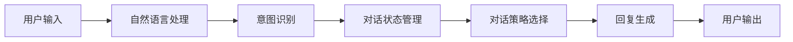

# 对话策略优化：提升AI Agent的交互质量

> 关键词：对话策略优化、AI Agent、交互质量、自然语言处理、机器学习

> 摘要：本文聚焦于对话策略优化以提升AI Agent的交互质量这一核心主题。首先介绍了相关背景，包括目的、预期读者等内容。接着阐述了核心概念与联系，深入剖析了对话策略优化的原理和架构，并以示意图和流程图展示。详细讲解了核心算法原理及具体操作步骤，结合Python代码进行说明。同时给出了数学模型和公式，通过举例让读者更好理解。在项目实战部分，从开发环境搭建到源代码实现及解读，进行了全面分析。探讨了实际应用场景，推荐了学习资源、开发工具框架和相关论文著作。最后总结了未来发展趋势与挑战，并给出常见问题解答和扩展阅读参考资料，旨在为读者全面深入地了解对话策略优化提供指引。

## 1. 背景介绍 
### 1.1 目的和范围
随着人工智能技术的飞速发展，AI Agent在各个领域的应用越来越广泛，如智能客服、虚拟助手等。然而，当前很多AI Agent的交互质量仍有待提高，存在回答不准确、对话流程不顺畅等问题。本文的目的在于深入探讨对话策略优化的方法和技术，以提升AI Agent的交互质量。范围涵盖了对话策略优化的核心概念、算法原理、数学模型、项目实战以及实际应用场景等多个方面。

### 1.2 预期读者
本文预期读者包括人工智能领域的研究人员、开发者、软件架构师，以及对AI Agent交互质量提升感兴趣的技术爱好者。对于想要深入了解对话策略优化技术的初学者，本文可以作为一个系统的学习资料；对于有一定经验的专业人士，也可以从中获取新的思路和方法。

### 1.3 文档结构概述
本文首先介绍背景信息，让读者了解对话策略优化的重要性和本文的目标。接着阐述核心概念与联系，使读者对相关概念有清晰的认识。然后详细讲解核心算法原理和具体操作步骤，结合Python代码进行说明。随后给出数学模型和公式，并举例说明其应用。在项目实战部分，从开发环境搭建到源代码实现及解读，进行全面分析。之后探讨实际应用场景，推荐相关的工具和资源。最后总结未来发展趋势与挑战，给出常见问题解答和扩展阅读参考资料。

### 1.4 术语表
#### 1.4.1 核心术语定义
- **AI Agent**：指能够感知环境、自主决策并采取行动以实现特定目标的人工智能实体，在对话场景中可理解为能够与用户进行交互的智能程序。
- **对话策略**：是AI Agent在对话过程中选择回复内容和引导对话流程的规则和方法。
- **交互质量**：衡量AI Agent与用户交互效果的指标，包括回答的准确性、相关性、流畅性等方面。

#### 1.4.2 相关概念解释
- **自然语言处理（NLP）**：是人工智能的一个重要分支，主要研究如何让计算机理解和处理人类语言。在对话策略优化中，NLP技术用于对用户输入的文本进行分析和理解。
- **机器学习**：是一门多领域交叉学科，涉及概率论、统计学、逼近论等多门学科。在对话策略优化中，机器学习算法用于训练AI Agent，使其能够根据不同的对话场景做出合适的决策。

#### 1.4.3 缩略词列表
- **NLP**：Natural Language Processing（自然语言处理）
- **ML**：Machine Learning（机器学习）
- **RL**：Reinforcement Learning（强化学习）

## 2. 核心概念与联系 

### 核心概念原理
对话策略优化的核心目标是让AI Agent在与用户的交互中提供高质量的回复，引导对话朝着有益的方向发展。其原理基于对用户输入的理解和对对话历史的分析，结合预先设定的规则或通过机器学习训练得到的模型，选择最合适的回复内容和对话动作。

例如，当用户询问一个问题时，AI Agent首先需要通过自然语言处理技术对问题进行解析，提取关键信息，理解用户的意图。然后根据对话策略，从知识库或模型中查找相关的答案。如果知识库中没有直接匹配的答案，AI Agent可能需要通过推理或引导用户提供更多信息来继续对话。

### 架构的文本示意图
```plaintext
用户输入 -> 自然语言处理模块 -> 意图识别 -> 对话状态管理 -> 对话策略选择 -> 回复生成 -> 用户输出
```
在这个架构中，用户输入的文本首先经过自然语言处理模块进行处理，包括分词、词性标注、命名实体识别等操作。意图识别模块根据处理后的文本确定用户的意图。对话状态管理模块记录对话的历史信息和当前状态。对话策略选择模块根据用户意图和对话状态选择合适的对话策略。回复生成模块根据选择的策略生成回复内容，并输出给用户。

### Mermaid流程图


## 3. 核心算法原理 & 具体操作步骤 

### 核心算法原理
在对话策略优化中，常用的算法包括基于规则的算法、机器学习算法和强化学习算法。这里我们重点介绍强化学习算法，因为它能够在动态的对话环境中不断学习和优化对话策略。

强化学习是一种通过智能体与环境进行交互并根据环境反馈的奖励信号来学习最优策略的机器学习方法。在对话场景中，AI Agent可以看作是智能体，对话环境是用户和对话历史，奖励信号可以根据对话的质量来定义，如回答的准确性、用户满意度等。

### 具体操作步骤

#### 步骤1：定义状态空间
状态空间表示对话的当前状态，包括用户的最新输入、对话历史等信息。例如，可以将用户输入的文本和对话轮数作为状态的一部分。

```python
# 示例代码：定义状态空间
user_input = "今天天气怎么样？"
dialogue_history = ["你好", "有什么可以帮助你的？"]
state = (user_input, dialogue_history)
```

#### 步骤2：定义动作空间
动作空间表示AI Agent可以采取的所有可能的行动，如回复不同的文本、询问用户更多信息等。

```python
# 示例代码：定义动作空间
action_space = ["今天天气很好", "我不太清楚，你可以查看天气预报", "你想了解哪个城市的天气？"]
```

#### 步骤3：定义奖励函数
奖励函数用于评估AI Agent的每个动作的好坏，根据对话的质量给予相应的奖励。例如，如果AI Agent的回复准确且满足用户需求，则给予正奖励；如果回复不准确或导致对话陷入僵局，则给予负奖励。

```python
# 示例代码：定义奖励函数
def reward_function(state, action):
    user_input = state[0]
    if "天气" in user_input and "天气" in action:
        return 1
    else:
        return -1
```

#### 步骤4：选择动作
AI Agent根据当前状态和策略选择一个动作。在强化学习中，常用的策略选择方法包括贪婪策略和ε - 贪婪策略。

```python
import random

# 示例代码：使用ε - 贪婪策略选择动作
epsilon = 0.1
if random.uniform(0, 1) < epsilon:
    action = random.choice(action_space)
else:
    # 这里可以使用更复杂的方法选择最优动作，如基于Q - 学习的方法
    action = action_space[0]
```

#### 步骤5：更新策略
根据环境反馈的奖励信号，更新AI Agent的策略，使其在未来的对话中能够做出更好的决策。

```python
# 示例代码：简单的策略更新（这里只是示例，实际的更新方法更复杂）
def update_policy(state, action, reward):
    # 这里可以实现具体的更新逻辑
    pass

reward = reward_function(state, action)
update_policy(state, action, reward)
```

## 4. 数学模型和公式 & 详细讲解 & 举例说明 

### 数学模型
在强化学习中，常用的数学模型是马尔可夫决策过程（MDP）。MDP可以用一个五元组 $<S, A, P, R, \gamma>$ 表示，其中：
- $S$ 是状态空间，表示所有可能的状态。
- $A$ 是动作空间，表示所有可能的动作。
- $P$ 是状态转移概率函数，表示在状态 $s$ 采取动作 $a$ 后转移到状态 $s'$ 的概率，即 $P(s'|s, a)$。
- $R$ 是奖励函数，表示在状态 $s$ 采取动作 $a$ 后获得的即时奖励，即 $R(s, a)$。
- $\gamma$ 是折扣因子，用于平衡即时奖励和未来奖励，取值范围是 $[0, 1]$。

### 详细讲解
AI Agent的目标是在MDP中找到一个最优策略 $\pi^*$，使得长期累积奖励最大化。长期累积奖励可以用下面的公式表示：
$$G_t = R_{t + 1} + \gamma R_{t + 2} + \gamma^2 R_{t + 3} + \cdots$$
其中，$G_t$ 是从时间步 $t$ 开始的长期累积奖励，$R_{t + i}$ 是在时间步 $t + i$ 获得的即时奖励。

为了评估策略 $\pi$ 的好坏，可以定义状态价值函数 $V^{\pi}(s)$ 和动作价值函数 $Q^{\pi}(s, a)$：
- 状态价值函数 $V^{\pi}(s)$ 表示在策略 $\pi$ 下从状态 $s$ 开始的长期累积奖励的期望：
$$V^{\pi}(s) = \mathbb{E}_{\pi}[G_t|S_t = s]$$
- 动作价值函数 $Q^{\pi}(s, a)$ 表示在策略 $\pi$ 下从状态 $s$ 采取动作 $a$ 后开始的长期累积奖励的期望：
$$Q^{\pi}(s, a) = \mathbb{E}_{\pi}[G_t|S_t = s, A_t = a]$$

### 举例说明
假设我们有一个简单的对话场景，状态空间 $S = \{s_1, s_2\}$，动作空间 $A = \{a_1, a_2\}$，状态转移概率函数 $P$ 和奖励函数 $R$ 如下：
- $P(s_1|s_1, a_1) = 0.8$，$P(s_2|s_1, a_1) = 0.2$
- $P(s_1|s_1, a_2) = 0.3$，$P(s_2|s_1, a_2) = 0.7$
- $R(s_1, a_1) = 1$，$R(s_1, a_2) = -1$

折扣因子 $\gamma = 0.9$。我们可以计算在策略 $\pi$ 下状态 $s_1$ 的状态价值函数 $V^{\pi}(s_1)$：
假设策略 $\pi$ 是在状态 $s_1$ 总是选择动作 $a_1$，则：
$$V^{\pi}(s_1) = R(s_1, a_1) + \gamma (0.8V^{\pi}(s_1) + 0.2V^{\pi}(s_2))$$
如果我们知道 $V^{\pi}(s_2)$ 的值，就可以通过迭代的方法求解 $V^{\pi}(s_1)$。

## 5. 项目实战：代码实际案例和详细解释说明 

### 5.1  开发环境搭建
#### 步骤1：安装Python
首先，确保你已经安装了Python 3.x版本。可以从Python官方网站（https://www.python.org/downloads/）下载并安装。

#### 步骤2：安装必要的库
在命令行中使用以下命令安装必要的库：
```sh
pip install numpy scikit-learn tensorflow
```
- `numpy`：用于数值计算。
- `scikit-learn`：提供了许多机器学习算法和工具。
- `tensorflow`：一个开源的机器学习框架，用于构建和训练深度学习模型。

### 5.2  源代码详细实现和代码解读

```python
import numpy as np
import random

# 定义状态空间
states = ["state1", "state2"]
# 定义动作空间
actions = ["action1", "action2"]
# 定义奖励函数
reward_matrix = {
    ("state1", "action1"): 1,
    ("state1", "action2"): -1,
    ("state2", "action1"): 0,
    ("state2", "action2"): 2
}
# 定义状态转移概率矩阵
transition_matrix = {
    ("state1", "action1"): {"state1": 0.8, "state2": 0.2},
    ("state1", "action2"): {"state1": 0.3, "state2": 0.7},
    ("state2", "action1"): {"state1": 0.5, "state2": 0.5},
    ("state2", "action2"): {"state1": 0.1, "state2": 0.9}
}
# 折扣因子
gamma = 0.9
# 初始化Q - 表
Q = np.zeros((len(states), len(actions)))

# ε - 贪婪策略
def epsilon_greedy(state_index, epsilon):
    if random.uniform(0, 1) < epsilon:
        action_index = random.randint(0, len(actions) - 1)
    else:
        action_index = np.argmax(Q[state_index])
    return action_index

# Q - 学习算法
def q_learning(num_episodes, epsilon, alpha):
    for episode in range(num_episodes):
        state_index = random.randint(0, len(states) - 1)
        for _ in range(10):
            action_index = epsilon_greedy(state_index, epsilon)
            state = states[state_index]
            action = actions[action_index]
            reward = reward_matrix[(state, action)]
            next_state_probs = transition_matrix[(state, action)]
            next_state_index = random.choices(range(len(states)), weights=list(next_state_probs.values()))[0]
            next_state = states[next_state_index]
            # Q - 学习更新公式
            Q[state_index, action_index] += alpha * (reward + gamma * np.max(Q[next_state_index]) - Q[state_index, action_index])
            state_index = next_state_index

# 训练模型
q_learning(num_episodes=1000, epsilon=0.1, alpha=0.1)

# 输出最优策略
for state_index, state in enumerate(states):
    action_index = np.argmax(Q[state_index])
    action = actions[action_index]
    print(f"在状态 {state} 下的最优动作是 {action}")
```

### 5.3  代码解读与分析
#### 代码功能概述
这段代码实现了一个简单的Q - 学习算法，用于优化对话策略。通过定义状态空间、动作空间、奖励函数和状态转移概率矩阵，使用Q - 学习算法训练一个Q - 表，最终得到每个状态下的最优动作。

#### 代码详细解读
1. **状态空间和动作空间定义**：定义了两个状态 `state1` 和 `state2`，以及两个动作 `action1` 和 `action2`。
2. **奖励函数和状态转移概率矩阵**：使用字典 `reward_matrix` 和 `transition_matrix` 分别存储奖励函数和状态转移概率。
3. **Q - 表初始化**：使用 `numpy` 数组 `Q` 初始化Q - 表，初始值都为0。
4. **ε - 贪婪策略**：`epsilon_greedy` 函数实现了ε - 贪婪策略，以一定的概率随机选择动作，否则选择Q - 表中值最大的动作。
5. **Q - 学习算法**：`q_learning` 函数实现了Q - 学习算法的核心逻辑，通过不断地与环境交互，更新Q - 表的值。
6. **训练模型**：调用 `q_learning` 函数进行1000次训练。
7. **输出最优策略**：根据训练好的Q - 表，输出每个状态下的最优动作。

## 6. 实际应用场景 
### 智能客服
在智能客服场景中，对话策略优化可以帮助AI Agent更好地理解用户的问题，提供准确、详细的解答。例如，当用户询问产品的使用方法时，AI Agent可以根据对话策略选择最合适的回复，引导用户完成操作。如果用户的问题比较复杂，AI Agent可以通过多轮对话逐步了解用户的需求，提供个性化的解决方案。

### 虚拟助手
虚拟助手如Siri、小爱同学等，需要与用户进行自然流畅的对话。对话策略优化可以提升虚拟助手的交互质量，使其能够更好地适应用户的语言习惯和需求。例如，当用户询问天气时，虚拟助手可以根据用户的位置信息提供准确的天气情况，并可以进一步询问用户是否需要了解未来几天的天气。

### 智能教育
在智能教育领域，AI Agent可以作为学习伙伴与学生进行交互。对话策略优化可以让AI Agent根据学生的学习情况和问题，提供有针对性的学习建议和辅导。例如，当学生在学习数学时遇到困难，AI Agent可以通过逐步引导的方式帮助学生理解问题，提供解题思路。

## 7. 工具和资源推荐
### 7.1 学习资源推荐
#### 7.1.1 书籍推荐
- 《自然语言处理入门》：这本书适合初学者，系统地介绍了自然语言处理的基本概念、方法和技术，包括分词、词性标注、命名实体识别等内容。
- 《强化学习：原理与Python实现》：详细讲解了强化学习的理论和算法，通过Python代码实现了多个强化学习案例，有助于读者深入理解强化学习在对话策略优化中的应用。
- 《深度学习》：由Ian Goodfellow、Yoshua Bengio和Aaron Courville撰写，是深度学习领域的经典教材，涵盖了深度学习的基本原理、模型和应用。

#### 7.1.2 在线课程
- Coursera上的“Natural Language Processing Specialization”：由斯坦福大学的教授授课，提供了自然语言处理的全面课程，包括词嵌入、序列模型、问答系统等内容。
- edX上的“Reinforcement Learning”：由加州大学伯克利分校的教授授课，深入讲解了强化学习的理论和算法，通过实际案例帮助学生掌握强化学习的应用。
- 网易云课堂上的“人工智能基础课程”：适合初学者，介绍了人工智能的基本概念、算法和应用，包括自然语言处理和强化学习的基础知识。

#### 7.1.3 技术博客和网站
- Medium：上面有很多关于人工智能、自然语言处理和强化学习的技术文章，作者来自世界各地的专业人士和研究者。
- arXiv：提供了大量的学术论文，涵盖了人工智能领域的最新研究成果，可以及时了解对话策略优化的前沿技术。
- Hugging Face Blog：专注于自然语言处理和深度学习，提供了很多关于预训练模型、对话系统等方面的技术分享和教程。

### 7.2 开发工具框架推荐
#### 7.2.1 IDE和编辑器
- PyCharm：是一款专门为Python开发设计的集成开发环境，提供了代码编辑、调试、版本控制等功能，适合开发大型的Python项目。
- Visual Studio Code：是一款轻量级的代码编辑器，支持多种编程语言，通过安装插件可以实现Python开发的各种功能，如代码提示、调试等。
- Jupyter Notebook：是一个交互式的开发环境，适合进行数据分析和模型训练。可以在浏览器中编写和运行Python代码，方便展示和分享代码和结果。

#### 7.2.2 调试和性能分析工具
- PDB：Python自带的调试器，可以在代码中设置断点，逐步执行代码，查看变量的值和程序的执行流程。
- TensorBoard：是TensorFlow提供的可视化工具，可以用于监控模型的训练过程，如损失函数的变化、准确率的变化等，还可以查看模型的结构和参数。
- cProfile：Python标准库中的性能分析工具，可以分析代码的执行时间和函数调用情况，帮助找出代码中的性能瓶颈。

#### 7.2.3 相关框架和库
- NLTK：Natural Language Toolkit，是Python中常用的自然语言处理库，提供了分词、词性标注、命名实体识别等多种自然语言处理工具和数据集。
- SpaCy：是一个快速、高效的自然语言处理库，提供了预训练的语言模型和各种自然语言处理管道，适合处理大规模的文本数据。
- OpenAI Gym：是一个用于开发和比较强化学习算法的工具包，提供了多种环境和任务，方便开发者测试和验证强化学习算法。

### 7.3 相关论文著作推荐
#### 7.3.1 经典论文
- “Attention Is All You Need”：提出了Transformer模型，是自然语言处理领域的重要突破，为后续的预训练模型如BERT、GPT等奠定了基础。
- “Q - learning”：由Chris Watkins和Peter Dayan发表，是强化学习领域的经典论文，首次提出了Q - 学习算法。
- “A Survey on Dialogue Systems: Recent Advances and New Frontiers”：对对话系统的研究现状进行了全面的综述，介绍了对话系统的各种技术和应用。

#### 7.3.2 最新研究成果
- 在ACL（Association for Computational Linguistics）、EMNLP（Conference on Empirical Methods in Natural Language Processing）等自然语言处理领域的顶级会议上，每年都会有很多关于对话策略优化的最新研究成果发表。
- 在NeurIPS（Conference on Neural Information Processing Systems）、ICML（International Conference on Machine Learning）等机器学习领域的顶级会议上，也会有一些与强化学习在对话系统中的应用相关的研究成果。

#### 7.3.3 应用案例分析
- 很多科技公司会在自己的技术博客上分享对话策略优化的应用案例，如Google、Microsoft、Facebook等。这些案例可以帮助我们了解实际应用中遇到的问题和解决方案。
- 一些开源项目如Rasa、Dialogflow等也提供了丰富的文档和示例代码，展示了如何使用这些框架构建高效的对话系统。

## 8. 总结：未来发展趋势与挑战
### 未来发展趋势
#### 多模态交互
未来的AI Agent将不仅仅局限于文本交互，还会支持语音、图像、手势等多模态交互方式。对话策略优化需要考虑如何整合多模态信息，提供更加自然、流畅的交互体验。

#### 个性化对话
随着用户数据的积累，AI Agent将能够根据用户的个性化特征和历史对话记录，提供更加个性化的对话策略。例如，针对不同年龄、性别、兴趣爱好的用户，提供不同风格和内容的回复。

#### 与知识图谱的结合
知识图谱可以为AI Agent提供丰富的背景知识，对话策略优化可以利用知识图谱进行推理和回答生成，提高回答的准确性和深度。

### 挑战
#### 数据质量和标注
对话策略优化需要大量高质量的数据进行训练，然而数据的收集和标注是一项艰巨的任务。如何保证数据的准确性、一致性和多样性是一个挑战。

#### 复杂语义理解
人类语言具有丰富的语义和语境，理解复杂的语义和语境仍然是自然语言处理领域的一个难题。在对话策略优化中，如何准确理解用户的意图和情感，是提高交互质量的关键。

#### 可解释性和安全性
随着AI Agent在各个领域的广泛应用，其决策的可解释性和安全性变得越来越重要。在对话策略优化中，如何让AI Agent的决策过程可解释，以及如何防止恶意攻击和滥用，是需要解决的问题。

## 9. 附录：常见问题与解答
### 问题1：如何选择合适的奖励函数？
解答：选择合适的奖励函数需要根据具体的应用场景和目标来确定。一般来说，奖励函数应该能够反映对话的质量，如回答的准确性、用户满意度等。可以通过专家知识、用户反馈或实验来设计和调整奖励函数。

### 问题2：强化学习算法在对话策略优化中的收敛速度如何提高？
解答：可以通过以下方法提高强化学习算法的收敛速度：
- 合理选择学习率和折扣因子。
- 使用经验回放机制，提高数据的利用率。
- 采用探索与利用的平衡策略，如ε - 贪婪策略。

### 问题3：如何处理对话中的不确定性？
解答：可以采用以下方法处理对话中的不确定性：
- 使用概率模型，如贝叶斯网络，对不确定性进行建模。
- 在对话策略中引入模糊推理和决策方法。
- 通过多轮对话逐步获取更多信息，减少不确定性。

## 10. 扩展阅读 & 参考资料
### 扩展阅读
- 《人工智能：现代方法》：全面介绍了人工智能的各个领域，包括自然语言处理、机器学习、知识表示等内容，适合深入学习人工智能的读者。
- 《Python自然语言处理实战：核心技术与算法》：通过实际案例介绍了Python在自然语言处理中的应用，包括分词、词性标注、情感分析等技术。
- 《深度强化学习实战》：详细讲解了深度强化学习的算法和应用，通过Python代码实现了多个深度强化学习案例。

### 参考资料
- 自然语言处理相关的学术论文和研究报告。
- 强化学习相关的开源项目和代码库。
- 各大科技公司的技术博客和官方文档。

作者：AI天才研究院/AI Genius Institute & 禅与计算机程序设计艺术 /Zen And The Art of Computer Programming