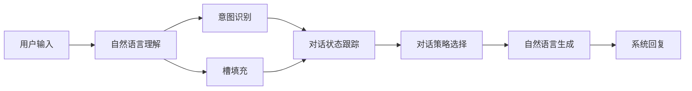

# 对话管理：设计流畅的人机交互体验

> 关键词：对话管理、人机交互、流畅体验、对话策略、自然语言处理

> 摘要：本文围绕对话管理展开，旨在探讨如何设计流畅的人机交互体验。首先介绍了对话管理的背景知识，包括目的、预期读者、文档结构和相关术语。接着阐述了对话管理的核心概念、联系以及架构原理，通过 Mermaid 流程图进行直观展示。详细讲解了核心算法原理，并给出 Python 源代码示例。同时，介绍了对话管理的数学模型和公式，辅以举例说明。在项目实战部分，从开发环境搭建、源代码实现与解读等方面进行了详细分析。此外，还探讨了对话管理的实际应用场景，推荐了相关的学习资源、开发工具框架和论文著作。最后总结了对话管理的未来发展趋势与挑战，并提供常见问题解答和扩展阅读参考资料。

## 1. 背景介绍 
### 1.1 目的和范围
对话管理在人机交互领域中扮演着至关重要的角色。其主要目的是设计出能够实现流畅人机交互体验的系统。流畅的人机交互意味着用户在与机器进行对话时，能够感受到自然、高效、准确的交互过程，仿佛在与人类进行交流一样。本文章的范围涵盖了对话管理的核心概念、算法原理、数学模型、实际应用场景等多个方面，旨在为读者提供全面且深入的了解。

### 1.2 预期读者
本文的预期读者包括对人机交互、自然语言处理、人工智能等领域感兴趣的开发者、研究人员、学生以及相关从业者。对于希望提升自己在对话系统设计方面能力的开发者来说，本文可以提供系统的技术指导和实践经验；对于研究人员，本文可以作为进一步研究对话管理理论和方法的参考；对于学生，本文能够帮助他们建立对话管理的知识体系，为后续的学习和研究打下基础。

### 1.3 文档结构概述
本文将按照以下结构进行阐述：首先介绍对话管理的背景知识，包括目的、预期读者、文档结构和术语表；接着详细讲解对话管理的核心概念、联系以及架构原理；然后介绍核心算法原理，并给出 Python 源代码示例；之后阐述对话管理的数学模型和公式，辅以举例说明；在项目实战部分，从开发环境搭建、源代码实现与解读等方面进行详细分析；还会探讨对话管理的实际应用场景；推荐相关的学习资源、开发工具框架和论文著作；最后总结对话管理的未来发展趋势与挑战，并提供常见问题解答和扩展阅读参考资料。

### 1.4 术语表
#### 1.4.1 核心术语定义
- **对话管理**：是指在人机对话系统中，对对话的流程、状态、策略等进行管理和控制，以实现流畅、有效的人机交互的技术。
- **对话状态**：表示在对话过程中某一时刻系统和用户所处的状态，包括用户的意图、系统的回复历史、当前话题等信息。
- **对话策略**：是指系统根据对话状态选择合适回复的规则和方法，它决定了系统如何与用户进行交互。
- **自然语言处理（NLP）**：是计算机科学与语言学的交叉领域，主要研究如何让计算机处理和理解人类语言，在对话管理中起着关键作用。

#### 1.4.2 相关概念解释
- **意图识别**：是自然语言处理的一个重要任务，旨在确定用户话语背后的真实意图，例如查询信息、请求服务、表达情感等。在对话管理中，准确的意图识别是系统做出正确回复的基础。
- **槽填充**：当用户表达的意图需要一些具体的信息来完成时，槽填充就是从用户的话语中提取这些信息的过程。例如，用户说“我想订一张明天从北京到上海的机票”，槽填充就需要从这句话中提取出“时间”（明天）、“出发地”（北京）、“目的地”（上海）等信息。

#### 1.4.3 缩略词列表
- **NLP**：Natural Language Processing，自然语言处理
- **ML**：Machine Learning，机器学习
- **DL**：Deep Learning，深度学习

## 2. 核心概念与联系 
### 核心概念原理
对话管理的核心在于对对话状态的维护和对话策略的选择。对话状态可以看作是一个包含多个信息项的向量，这些信息项反映了对话的历史和当前状态。例如，在一个旅游预订对话系统中，对话状态可能包括用户的旅游目的地、出发时间、返回时间、预算等信息。

对话策略则是根据对话状态来决定系统的回复。常见的对话策略包括基于规则的策略和基于机器学习的策略。基于规则的策略是通过预先定义的规则来选择回复，例如如果用户询问某个景点的开放时间，系统就按照预设的规则返回该景点的开放时间信息。基于机器学习的策略则是通过训练模型来学习不同对话状态下的最佳回复，例如使用强化学习算法来优化对话策略。

### 架构的文本示意图
```plaintext
用户输入 -> 自然语言理解（意图识别、槽填充） -> 对话状态跟踪 -> 对话策略选择 -> 自然语言生成 -> 系统回复
```

### Mermaid 流程图


## 3. 核心算法原理 & 具体操作步骤 
### 基于规则的对话管理算法原理
基于规则的对话管理算法是通过预先定义的规则来处理对话。这些规则可以是条件-动作对，即当满足某个条件时，执行相应的动作。例如，以下是一个简单的基于规则的对话管理算法的 Python 代码示例：

```python
# 定义规则
rules = [
    {
        "condition": lambda intent: intent == "问候",
        "action": lambda: "您好！有什么可以帮助您？"
    },
    {
        "condition": lambda intent: intent == "查询天气",
        "action": lambda: "请您提供具体的城市，我来为您查询天气。"
    }
]

def rule_based_dialogue_manager(user_intent):
    for rule in rules:
        if rule["condition"](user_intent):
            return rule["action"]()
    return "抱歉，我不太理解您的意思。"

# 模拟用户输入
user_intent = "问候"
response = rule_based_dialogue_manager(user_intent)
print(response)
```

### 操作步骤
1. **规则定义**：首先需要定义一系列的规则，每个规则包含一个条件和一个动作。条件是一个函数，用于判断是否满足该规则；动作是一个函数，用于生成系统的回复。
2. **用户意图识别**：对用户的输入进行处理，识别出用户的意图。
3. **规则匹配**：遍历规则列表，找到满足条件的规则。
4. **执行动作**：如果找到匹配的规则，则执行该规则对应的动作，生成系统的回复；如果没有找到匹配的规则，则返回默认回复。

### 基于机器学习的对话管理算法原理
基于机器学习的对话管理算法通常使用强化学习来优化对话策略。强化学习是一种通过智能体与环境进行交互，不断尝试不同的动作并根据奖励信号来学习最优策略的方法。在对话管理中，智能体就是对话系统，环境就是用户，动作就是系统的回复，奖励信号则表示用户对系统回复的满意度。

以下是一个简单的基于 Q - learning 算法的对话管理示例代码：

```python
import numpy as np

# 定义状态和动作空间
states = ["S1", "S2", "S3"]
actions = ["A1", "A2", "A3"]

# 初始化 Q 表
Q = np.zeros((len(states), len(actions)))

# 定义超参数
alpha = 0.1  # 学习率
gamma = 0.9  # 折扣因子
epsilon = 0.1  # 探索率

# 定义奖励函数
def get_reward(state, action):
    # 这里简单模拟奖励，实际应用中需要根据用户反馈来确定
    if state == "S1" and action == "A1":
        return 1
    return 0

# Q - learning 算法
def q_learning(state_index, action_index, next_state_index):
    reward = get_reward(states[state_index], actions[action_index])
    max_q_next = np.max(Q[next_state_index])
    Q[state_index, action_index] = (1 - alpha) * Q[state_index, action_index] + alpha * (reward + gamma * max_q_next)

# 模拟对话过程
state_index = 0
for _ in range(10):
    if np.random.uniform(0, 1) < epsilon:
        action_index = np.random.randint(0, len(actions))
    else:
        action_index = np.argmax(Q[state_index])
    next_state_index = (state_index + 1) % len(states)
    q_learning(state_index, action_index, next_state_index)
    state_index = next_state_index

print(Q)
```

### 操作步骤
1. **定义状态和动作空间**：确定对话系统可能处于的状态和可以采取的动作。
2. **初始化 Q 表**：Q 表是一个二维数组，用于存储每个状态下每个动作的 Q 值。
3. **选择动作**：根据当前状态，使用 epsilon - greedy 策略选择一个动作。
4. **执行动作并获取奖励**：执行选择的动作，与用户进行交互，并根据用户的反馈获取奖励。
5. **更新 Q 表**：使用 Q - learning 算法更新 Q 表中的 Q 值。
6. **更新状态**：根据用户的回复更新当前状态。

## 4. 数学模型和公式 & 详细讲解 & 举例说明 
### 基于规则的对话管理数学模型
基于规则的对话管理可以看作是一个映射函数 $f: I \to R$，其中 $I$ 是用户意图的集合，$R$ 是系统回复的集合。对于每个用户意图 $i \in I$，存在一个规则 $r$，使得 $f(i) = r.action$，其中 $r.condition(i) = True$。

例如，假设用户意图集合 $I = \{"问候", "查询天气"\}$，系统回复集合 $R = \{"您好！有什么可以帮助您？", "请您提供具体的城市，我来为您查询天气。"\}$，规则如下：
- $r_1$: $condition(i) = (i == "问候")$，$action = "您好！有什么可以帮助您？"$
- $r_2$: $condition(i) = (i == "查询天气")$，$action = "请您提供具体的城市，我来为您查询天气。"$

则 $f("问候") = "您好！有什么可以帮助您？"$，$f("查询天气") = "请您提供具体的城市，我来为您查询天气。"$。

### 基于强化学习的对话管理数学模型
在强化学习中，常用的数学模型是马尔可夫决策过程（MDP）。一个 MDP 可以用一个五元组 $(S, A, P, R, \gamma)$ 来表示，其中：
- $S$ 是状态集合，表示对话系统可能处于的所有状态。
- $A$ 是动作集合，表示对话系统可以采取的所有动作。
- $P: S \times A \times S \to [0, 1]$ 是状态转移概率函数，表示在状态 $s$ 采取动作 $a$ 后转移到状态 $s'$ 的概率。
- $R: S \times A \to \mathbb{R}$ 是奖励函数，表示在状态 $s$ 采取动作 $a$ 后获得的奖励。
- $\gamma \in [0, 1]$ 是折扣因子，用于权衡当前奖励和未来奖励。

Q - learning 算法的更新公式为：
$$Q(s, a) \leftarrow (1 - \alpha)Q(s, a) + \alpha\left[R(s, a) + \gamma \max_{a'} Q(s', a')\right]$$
其中：
- $Q(s, a)$ 是状态 $s$ 下采取动作 $a$ 的 Q 值。
- $\alpha$ 是学习率，控制 Q 值更新的步长。
- $R(s, a)$ 是在状态 $s$ 采取动作 $a$ 后获得的奖励。
- $\gamma$ 是折扣因子。
- $s'$ 是在状态 $s$ 采取动作 $a$ 后转移到的下一个状态。
- $\max_{a'} Q(s', a')$ 是下一个状态 $s'$ 下所有动作的最大 Q 值。

例如，假设在状态 $s_1$ 采取动作 $a_1$ 后转移到状态 $s_2$，获得奖励 $R(s_1, a_1) = 1$，$Q(s_1, a_1) = 0$，$Q(s_2, a_1) = 0.5$，$Q(s_2, a_2) = 0.3$，$\alpha = 0.1$，$\gamma = 0.9$，则更新后的 $Q(s_1, a_1)$ 为：
$$Q(s_1, a_1) = (1 - 0.1) \times 0 + 0.1\times(1 + 0.9\times 0.5) = 0.145$$

## 5. 项目实战：代码实际案例和详细解释说明 
### 5.1  开发环境搭建
#### 安装 Python
首先需要安装 Python 环境，建议使用 Python 3.7 及以上版本。可以从 Python 官方网站（https://www.python.org/downloads/）下载安装包，按照安装向导进行安装。

#### 安装必要的库
在对话管理项目中，可能需要使用到一些自然语言处理相关的库，如 `nltk`、`sklearn` 等。可以使用 `pip` 来安装这些库：
```sh
pip install nltk sklearn
```

### 5.2  源代码详细实现和代码解读
以下是一个简单的基于规则的对话管理系统的完整代码示例：

```python
import nltk
from nltk.tokenize import word_tokenize
from sklearn.feature_extraction.text import TfidfVectorizer
from sklearn.metrics.pairwise import cosine_similarity

# 下载必要的 nltk 数据
nltk.download('punkt')

# 定义规则
rules = [
    {
        "keywords": ["你好", "您好"],
        "response": "您好！有什么可以帮助您？"
    },
    {
        "keywords": ["天气", "气温"],
        "response": "请您提供具体的城市，我来为您查询天气。"
    }
]

# 意图识别函数
def recognize_intent(user_input):
    for rule in rules:
        for keyword in rule["keywords"]:
            if keyword in user_input:
                return rule["response"]
    return "抱歉，我不太理解您的意思。"

# 主函数
def main():
    while True:
        user_input = input("您的输入：")
        if user_input.lower() == "退出":
            break
        response = recognize_intent(user_input)
        print("系统回复：", response)

if __name__ == "__main__":
    main()
```

### 代码解读与分析
1. **导入必要的库**：导入 `nltk` 用于自然语言处理，`word_tokenize` 用于分词，`TfidfVectorizer` 和 `cosine_similarity` 用于文本相似度计算。
2. **下载必要的 nltk 数据**：使用 `nltk.download('punkt')` 下载分词所需的数据。
3. **定义规则**：规则是一个列表，每个规则包含一组关键词和对应的回复。
4. **意图识别函数**：`recognize_intent` 函数遍历规则列表，检查用户输入中是否包含规则中的关键词。如果包含，则返回该规则对应的回复；否则返回默认回复。
5. **主函数**：`main` 函数实现了一个简单的对话循环，不断接收用户输入，调用意图识别函数生成回复，并输出回复。当用户输入“退出”时，退出对话循环。

## 6. 实际应用场景 
### 智能客服
在智能客服领域，对话管理可以帮助客服系统更好地理解用户的问题，并提供准确、及时的回复。例如，电商平台的智能客服可以根据用户的咨询内容，如商品信息、订单状态、售后服务等，使用对话管理技术进行意图识别和回复选择，提高客服效率和用户满意度。

### 语音助手
语音助手如 Siri、小爱同学等，都离不开对话管理技术。通过对话管理，语音助手可以处理用户的语音指令，如查询信息、设置提醒、控制设备等，实现流畅的人机交互。例如，用户说“帮我查询明天北京的天气”，语音助手可以识别用户的意图，调用天气查询接口获取信息，并以自然语言的方式回复用户。

### 智能教育
在智能教育领域，对话管理可以应用于智能辅导系统。系统可以根据学生的问题和学习状态，提供个性化的辅导和建议。例如，当学生询问数学题的解法时，智能辅导系统可以通过对话管理技术理解学生的问题，提供详细的解题思路和步骤。

### 智能家居控制
智能家居系统可以通过对话管理实现语音控制。用户可以通过语音指令控制家中的智能设备，如开灯、关灯、调节温度等。对话管理系统可以准确识别用户的指令，将其转换为相应的控制信号发送给智能设备。

## 7. 工具和资源推荐
### 7.1 学习资源推荐
#### 7.1.1 书籍推荐
- 《自然语言处理入门》：这本书适合初学者，详细介绍了自然语言处理的基本概念、方法和技术，包括分词、词性标注、命名实体识别等，对理解对话管理中的自然语言处理部分有很大帮助。
- 《强化学习：原理与Python实现》：如果想深入学习基于强化学习的对话管理算法，这本书是一个很好的选择。它系统地介绍了强化学习的理论和实践，通过 Python 代码示例帮助读者理解和应用强化学习算法。

#### 7.1.2 在线课程
- Coursera 上的“Natural Language Processing Specialization”：这是一个由顶尖大学教授授课的自然语言处理专项课程，涵盖了自然语言处理的各个方面，包括对话管理。课程内容丰富，有视频讲解、编程作业和测验，适合系统学习。
- edX 上的“Reinforcement Learning”：该课程专门介绍强化学习的理论和应用，对于学习基于强化学习的对话管理算法非常有帮助。课程中有很多实际案例和编程练习，帮助学生掌握强化学习的核心知识。

#### 7.1.3 技术博客和网站
- Medium 上有很多关于自然语言处理和对话管理的技术博客文章，作者们会分享他们的研究成果、实践经验和最新技术动态。
- arXiv 是一个预印本服务器，上面有很多关于对话管理的学术论文，可以及时了解该领域的最新研究进展。

### 7.2 开发工具框架推荐
#### 7.2.1 IDE和编辑器
- PyCharm：是一款专业的 Python 集成开发环境，具有强大的代码编辑、调试和自动补全功能，非常适合开发对话管理系统。
- Visual Studio Code：是一款轻量级的代码编辑器，支持多种编程语言，有丰富的插件扩展。可以通过安装 Python 相关插件来进行对话管理系统的开发。

#### 7.2.2 调试和性能分析工具
- pdb：是 Python 自带的调试器，可以帮助开发者在代码中设置断点、单步执行代码，方便调试程序。
- cProfile：是 Python 的性能分析工具，可以分析代码的运行时间和函数调用情况，帮助开发者找出代码中的性能瓶颈。

#### 7.2.3 相关框架和库
- Rasa：是一个开源的对话管理框架，提供了对话状态跟踪、意图识别、对话策略选择等功能，支持基于规则和机器学习的对话管理方法。
- Dialogflow：是 Google 推出的对话式 AI 平台，提供了图形化界面和 API，方便开发者快速创建和部署对话系统。

### 7.3 相关论文著作推荐
#### 7.3.1 经典论文
- “A Survey of Available Techniques and Datasets for Spoken Dialogue Systems”：这篇论文对口语对话系统的可用技术和数据集进行了全面的调查，对于了解对话管理的发展历程和现状有很大帮助。
- “Deep Reinforcement Learning for Dialogue Generation”：该论文介绍了如何使用深度强化学习来生成对话，是基于强化学习的对话管理领域的经典之作。

#### 7.3.2 最新研究成果
可以关注每年在 ACL（Association for Computational Linguistics）、EMNLP（Conference on Empirical Methods in Natural Language Processing）等自然语言处理顶级会议上发表的论文，了解对话管理领域的最新研究成果。

#### 7.3.3 应用案例分析
一些科技公司会在自己的技术博客上分享对话管理系统的应用案例，例如 Google、Microsoft 等。这些案例分析可以帮助开发者了解实际应用中对话管理系统的设计和实现方法。

## 8. 总结：未来发展趋势与挑战
### 未来发展趋势
- **多模态交互**：未来的对话管理系统将不仅仅局限于文本和语音交互，还将支持图像、视频等多模态交互方式。例如，用户可以通过上传图片来询问相关信息，系统可以结合图像识别和自然语言处理技术进行回复。
- **个性化交互**：对话管理系统将更加注重个性化交互，根据用户的历史对话记录、偏好、兴趣等信息，为用户提供更加个性化的回复和服务。例如，智能客服可以根据用户的购买历史和偏好，推荐适合用户的商品。
- **跨领域对话**：对话管理系统将能够处理跨领域的对话，例如用户在一个对话中可以同时询问旅游、美食、娱乐等多个领域的信息。系统需要具备更好的知识融合和推理能力，以满足用户的多样化需求。

### 挑战
- **自然语言理解的准确性**：虽然自然语言处理技术取得了很大的进展，但在处理复杂的自然语言表达时，仍然存在理解不准确的问题。例如，一些模糊、歧义的表述可能会导致系统误解用户的意图。
- **对话策略的优化**：设计高效、合理的对话策略是对话管理的核心挑战之一。如何在不同的对话场景下选择最佳的回复，以提高用户满意度和系统性能，仍然是一个需要深入研究的问题。
- **数据隐私和安全**：对话管理系统需要处理大量的用户数据，包括用户的对话内容、个人信息等。如何保障这些数据的隐私和安全，防止数据泄露和滥用，是一个重要的挑战。

## 9. 附录：常见问题与解答
### 问题 1：如何提高对话管理系统的自然语言理解能力？
解答：可以采用以下方法提高自然语言理解能力：
- 使用大规模的标注数据集进行训练，让模型学习更多的语言模式和语义信息。
- 结合多种自然语言处理技术，如词法分析、句法分析、语义分析等，从多个层面理解用户的输入。
- 不断更新和优化模型，采用最新的自然语言处理算法和技术。

### 问题 2：基于规则的对话管理和基于机器学习的对话管理各有什么优缺点？
解答：
- 基于规则的对话管理
    - 优点：规则明确，易于理解和维护；在特定领域和简单场景下可以快速实现。
    - 缺点：规则编写需要大量的人工成本，难以覆盖所有的情况；缺乏灵活性，对于新的情况需要手动添加规则。
- 基于机器学习的对话管理
    - 优点：可以自动学习对话模式和策略，具有较好的泛化能力；能够处理复杂的对话场景。
    - 缺点：需要大量的训练数据，训练过程复杂，计算资源消耗大；模型的可解释性较差。

### 问题 3：如何评估对话管理系统的性能？
解答：可以从以下几个方面评估对话管理系统的性能：
- **准确率**：系统正确理解用户意图和生成正确回复的比例。
- **召回率**：系统能够识别出的用户意图和回复的比例。
- **F1 值**：综合考虑准确率和召回率的指标，用于衡量系统的整体性能。
- **用户满意度**：通过用户调查和反馈来评估用户对系统的满意度，这是评估系统性能的重要指标之一。

## 10. 扩展阅读 & 参考资料
### 扩展阅读
- 《深度学习》（Deep Learning）：这本书深入介绍了深度学习的理论和应用，对于理解基于深度学习的对话管理算法有很大帮助。
- 《人工智能：一种现代的方法》（Artificial Intelligence: A Modern Approach）：是人工智能领域的经典教材，涵盖了自然语言处理、机器学习等多个方面的内容，可以帮助读者建立全面的人工智能知识体系。

### 参考资料
- NLTK 官方文档：https://www.nltk.org/
- Scikit - learn 官方文档：https://scikit - learn.org/
- Rasa 官方文档：https://rasa.com/docs/rasa/
- Dialogflow 官方文档：https://cloud.google.com/dialogflow/docs

作者：AI天才研究院/AI Genius Institute & 禅与计算机程序设计艺术 /Zen And The Art of Computer Programming