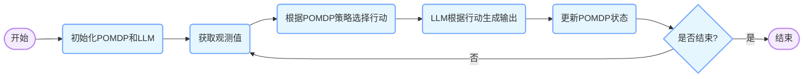

# 将POMDP引入LLM推理过程的可能性

> 关键词：POMDP、LLM推理、部分可观测马尔可夫决策过程、大语言模型、推理优化

> 摘要：本文深入探讨了将部分可观测马尔可夫决策过程（POMDP）引入大语言模型（LLM）推理过程的可能性。首先介绍了相关背景知识，包括目的范围、预期读者等。接着阐述了POMDP和LLM的核心概念及联系，详细讲解了核心算法原理与操作步骤，并给出了数学模型和公式。通过项目实战展示了具体代码案例及解读。分析了实际应用场景，推荐了学习资源、开发工具和相关论文著作。最后总结了未来发展趋势与挑战，并解答了常见问题，提供了扩展阅读和参考资料，旨在为相关领域的研究和实践提供全面的参考。

## 1. 背景介绍 
### 1.1 目的和范围
大语言模型（LLM）在自然语言处理领域取得了巨大的成功，然而其推理过程仍然存在一些挑战，例如对上下文信息的不完全利用、在复杂环境下的决策不够优化等。部分可观测马尔可夫决策过程（POMDP）是一种强大的决策理论框架，能够处理不确定性和部分可观测信息。本研究的目的是探讨将POMDP引入LLM推理过程的可能性，以提高LLM在推理任务中的性能和适应性。研究范围涵盖了POMDP和LLM的基本概念、算法原理、数学模型，以及通过实际案例验证引入POMDP的可行性和有效性。

### 1.2 预期读者
本文的预期读者包括自然语言处理领域的研究人员、人工智能开发者、对决策理论和大语言模型感兴趣的学者。对于那些希望深入了解如何优化LLM推理过程，以及探索新的技术融合方法的读者来说，本文将提供有价值的参考。

### 1.3 文档结构概述
本文将按照以下结构进行组织：首先介绍POMDP和LLM的核心概念及它们之间的联系；然后详细阐述核心算法原理和具体操作步骤，包括使用Python代码进行说明；接着给出相关的数学模型和公式，并举例说明；通过项目实战展示将POMDP引入LLM推理过程的具体实现和代码解读；分析实际应用场景；推荐学习资源、开发工具和相关论文著作；最后总结未来发展趋势与挑战，解答常见问题，并提供扩展阅读和参考资料。

### 1.4 术语表
#### 1.4.1 核心术语定义
- **部分可观测马尔可夫决策过程（POMDP）**：是一种用于在部分可观测环境中进行决策的数学模型。在POMDP中，决策者无法直接观测到环境的真实状态，只能通过观测值来推断状态，并根据推断结果做出决策。
- **大语言模型（LLM）**：是一种基于深度学习的自然语言处理模型，通过大量的文本数据进行训练，能够生成自然语言文本、回答问题、进行推理等任务。
- **推理过程**：指大语言模型根据输入的文本信息，经过一系列的计算和处理，生成输出结果的过程。

#### 1.4.2 相关概念解释
- **马尔可夫性质**：指系统的未来状态只依赖于当前状态，而与过去的状态无关。在POMDP中，虽然环境的真实状态是部分可观测的，但状态转移仍然满足马尔可夫性质。
- **观测值**：在POMDP中，观测值是决策者能够直接获取的信息，它与环境的真实状态相关，但不完全相同。
- **策略**：是决策者在不同状态下选择行动的规则。在POMDP中，策略的目标是最大化长期累积奖励。

#### 1.4.3 缩略词列表
- **POMDP**：Partially Observable Markov Decision Process
- **LLM**：Large Language Model

## 2. 核心概念与联系 

### 2.1 POMDP核心概念
POMDP可以用一个六元组 $\langle S, A, T, Z, O, R \rangle$ 来表示，其中：
- $S$ 是状态空间，代表环境的所有可能状态。
- $A$ 是行动空间，代表决策者可以采取的所有行动。
- $T$ 是状态转移函数，$T(s'|s, a)$ 表示在状态 $s$ 下采取行动 $a$ 后转移到状态 $s'$ 的概率。
- $Z$ 是观测空间，代表决策者可以获得的所有观测值。
- $O$ 是观测函数，$O(z|s', a)$ 表示在状态 $s'$ 下采取行动 $a$ 后获得观测值 $z$ 的概率。
- $R$ 是奖励函数，$R(s, a)$ 表示在状态 $s$ 下采取行动 $a$ 所获得的即时奖励。

### 2.2 LLM核心概念
大语言模型通常基于Transformer架构，通过多层的注意力机制和前馈神经网络来处理输入的文本序列。它通过在大规模文本数据上进行无监督学习，学习到语言的模式和语义信息。在推理过程中，LLM根据输入的文本生成下一个可能的单词或短语。

### 2.3 POMDP与LLM的联系
将POMDP引入LLM推理过程的核心思想是将LLM的推理过程看作一个决策过程，其中环境的状态可以表示为文本的上下文信息，行动可以表示为LLM选择生成的单词或短语。由于在实际应用中，LLM可能无法完全获取上下文的所有信息，因此可以将其看作是一个部分可观测的环境，适合使用POMDP来进行建模和决策。

### 2.4 文本示意图
```plaintext
+-----------------+       +-----------------+
|    POMDP        |       |      LLM        |
+-----------------+       +-----------------+
| - 状态空间 S    |       | - 输入文本      |
| - 行动空间 A    |       | - 注意力机制    |
| - 状态转移 T    |       | - 前馈网络      |
| - 观测空间 Z    |       | - 生成输出      |
| - 观测函数 O    |       |                 |
| - 奖励函数 R    |       |                 |
+-----------------+       +-----------------+
           |                         |
           |  将LLM推理看作决策过程  |
           |                         |
           +-------------------------+
```

### 2.5 Mermaid流程图


## 3. 核心算法原理 & 具体操作步骤 

### 3.1 POMDP核心算法原理
POMDP的核心目标是找到一个最优策略 $\pi$，使得长期累积奖励最大化。常用的求解方法是基于价值迭代的算法，其基本思想是通过不断更新价值函数 $V$ 来逼近最优价值函数。

价值函数 $V$ 表示在某个信念状态 $b$ 下，按照策略 $\pi$ 行动所能获得的最大期望累积奖励。信念状态 $b$ 是对环境真实状态的概率分布。

价值迭代算法的步骤如下：
1. 初始化价值函数 $V_0(b) = 0$ 对于所有的信念状态 $b$。
2. 对于 $n = 0, 1, 2, \cdots$，更新价值函数：
   - 对于每个信念状态 $b$，计算：
     - $Q_n(b, a) = \sum_{s \in S} b(s) R(s, a) + \gamma \sum_{z \in Z} O(z|s', a) \sum_{s' \in S} T(s'|s, a) V_n(b')$
     - 其中 $b'$ 是根据观测值 $z$ 更新后的信念状态，$\gamma$ 是折扣因子。
     - $V_{n+1}(b) = \max_{a \in A} Q_n(b, a)$
3. 当 $|V_{n+1}(b) - V_n(b)| < \epsilon$ 对于所有的信念状态 $b$ 时，停止迭代，此时得到的策略 $\pi(b) = \arg\max_{a \in A} Q_n(b, a)$ 即为最优策略。

### 3.2 将POMDP引入LLM推理的具体操作步骤
1. **初始化**：
   - 初始化POMDP的状态空间 $S$、行动空间 $A$、状态转移函数 $T$、观测空间 $Z$、观测函数 $O$ 和奖励函数 $R$。
   - 初始化LLM的参数。
2. **获取观测值**：
   - 在LLM推理过程中，将输入的文本和之前生成的输出作为观测值 $z$。
3. **更新信念状态**：
   - 根据观测值 $z$ 和当前的信念状态 $b$，使用贝叶斯公式更新信念状态：
     - $b'(s') = \frac{O(z|s', a) \sum_{s \in S} T(s'|s, a) b(s)}{\sum_{s' \in S} O(z|s', a) \sum_{s \in S} T(s'|s, a) b(s)}$
4. **选择行动**：
   - 根据更新后的信念状态 $b'$ 和最优策略 $\pi$，选择行动 $a$。在LLM中，行动 $a$ 可以表示为选择生成的下一个单词或短语。
5. **LLM生成输出**：
   - LLM根据选择的行动 $a$ 生成输出。
6. **更新POMDP状态**：
   - 根据LLM的输出和环境的反馈，更新POMDP的状态和信念状态。

### 3.3 Python源代码实现
```python
import numpy as np

# 定义POMDP参数
S = [0, 1]  # 状态空间
A = [0, 1]  # 行动空间
Z = [0, 1]  # 观测空间

# 状态转移函数
T = np.array([
    [[0.7, 0.3], [0.3, 0.7]],
    [[0.4, 0.6], [0.6, 0.4]]
])

# 观测函数
O = np.array([
    [[0.8, 0.2], [0.2, 0.8]],
    [[0.3, 0.7], [0.7, 0.3]]
])

# 奖励函数
R = np.array([
    [1, -1],
    [-1, 1]
])

# 折扣因子
gamma = 0.9

# 初始化价值函数
V = np.zeros(len(S))

# 价值迭代算法
epsilon = 0.001
while True:
    V_new = np.zeros(len(S))
    for s in S:
        Q = []
        for a in A:
            q = 0
            for s_prime in S:
                reward = R[s, a]
                q += T[a, s, s_prime] * (reward + gamma * V[s_prime])
            Q.append(q)
        V_new[s] = max(Q)
    if np.max(np.abs(V_new - V)) < epsilon:
        break
    V = V_new

# 计算最优策略
policy = np.zeros(len(S), dtype=int)
for s in S:
    Q = []
    for a in A:
        q = 0
        for s_prime in S:
            reward = R[s, a]
            q += T[a, s, s_prime] * (reward + gamma * V[s_prime])
        Q.append(q)
    policy[s] = np.argmax(Q)

print("最优策略:", policy)
```

## 4. 数学模型和公式 & 详细讲解 & 举例说明 

### 4.1 数学模型
如前所述，POMDP的数学模型可以用六元组 $\langle S, A, T, Z, O, R \rangle$ 来表示。下面对各个元素进行详细解释：

- **状态空间 $S$**：是一个有限集合，包含了环境的所有可能状态。例如，在一个简单的文本推理任务中，状态可以表示文本的主题、情感等信息。
- **行动空间 $A$**：也是一个有限集合，代表决策者可以采取的所有行动。在LLM推理中，行动可以表示选择生成的下一个单词或短语。
- **状态转移函数 $T$**：$T(s'|s, a)$ 表示在状态 $s$ 下采取行动 $a$ 后转移到状态 $s'$ 的概率。这个概率反映了环境的动态变化。例如，在文本生成中，如果当前状态是描述一个事件的开头，采取生成某个特定单词的行动后，可能会转移到描述事件发展的状态。
- **观测空间 $Z$**：是决策者可以获得的所有观测值的集合。在LLM推理中，观测值可以是输入的文本和之前生成的输出。
- **观测函数 $O$**：$O(z|s', a)$ 表示在状态 $s'$ 下采取行动 $a$ 后获得观测值 $z$ 的概率。这个函数描述了观测值与真实状态之间的关系。例如，在文本推理中，观测值可能是一个单词，而不同的状态下生成这个单词的概率不同。
- **奖励函数 $R$**：$R(s, a)$ 表示在状态 $s$ 下采取行动 $a$ 所获得的即时奖励。奖励函数的设计可以根据具体的任务目标来确定。例如，在文本生成任务中，如果生成的单词符合语法和语义要求，可以给予正奖励；如果生成的单词导致语义错误，可以给予负奖励。

### 4.2 数学公式

#### 4.2.1 价值函数更新公式
价值函数 $V$ 的更新公式为：
$$
Q_n(b, a) = \sum_{s \in S} b(s) R(s, a) + \gamma \sum_{z \in Z} O(z|s', a) \sum_{s' \in S} T(s'|s, a) V_n(b')
$$
$$
V_{n+1}(b) = \max_{a \in A} Q_n(b, a)
$$
其中，$b(s)$ 是信念状态 $b$ 下状态 $s$ 的概率，$\gamma$ 是折扣因子，用于平衡即时奖励和未来奖励。

#### 4.2.2 信念状态更新公式
根据观测值 $z$ 更新信念状态的公式为：
$$
b'(s') = \frac{O(z|s', a) \sum_{s \in S} T(s'|s, a) b(s)}{\sum_{s' \in S} O(z|s', a) \sum_{s \in S} T(s'|s, a) b(s)}
$$

### 4.3 举例说明
假设我们有一个简单的文本推理任务，状态空间 $S = \{0, 1\}$，分别表示文本的主题是“体育”和“科技”；行动空间 $A = \{0, 1\}$，分别表示生成单词“篮球”和“电脑”；观测空间 $Z = \{0, 1\}$，分别表示观测到的单词是“体育”相关和“科技”相关。

- **状态转移函数 $T$**：
  - $T(0|0, 0) = 0.8$，表示在主题为“体育”的状态下生成“篮球”，仍然保持主题为“体育”的概率为0.8。
  - $T(1|0, 0) = 0.2$，表示在主题为“体育”的状态下生成“篮球”，转移到主题为“科技”的概率为0.2。
  - 以此类推，可以定义其他状态转移概率。

- **观测函数 $O$**：
  - $O(0|0, 0) = 0.9$，表示在主题为“体育”的状态下生成“篮球”，观测到“体育”相关单词的概率为0.9。
  - $O(1|0, 0) = 0.1$，表示在主题为“体育”的状态下生成“篮球”，观测到“科技”相关单词的概率为0.1。
  - 同样可以定义其他观测概率。

- **奖励函数 $R$**：
  - $R(0, 0) = 1$，表示在主题为“体育”的状态下生成“篮球”，给予正奖励。
  - $R(0, 1) = -1$，表示在主题为“体育”的状态下生成“电脑”，给予负奖励。

通过这些参数，可以使用价值迭代算法计算最优策略，从而指导LLM在推理过程中做出更好的决策。

## 5. 项目实战：代码实际案例和详细解释说明 

### 5.1  开发环境搭建
为了实现将POMDP引入LLM推理过程的项目，我们需要搭建以下开发环境：

#### 5.1.1 操作系统
可以选择Linux（如Ubuntu）、Windows或macOS。建议使用Linux系统，因为它在开发和部署深度学习项目方面具有更好的兼容性和性能。

#### 5.1.2 Python环境
安装Python 3.7及以上版本。可以使用Anaconda来管理Python环境，具体步骤如下：
1. 从Anaconda官网下载并安装Anaconda。
2. 创建一个新的Python环境：
   ```bash
   conda create -n pomdp_llm python=3.8
   conda activate pomdp_llm
   ```

#### 5.1.3 安装必要的库
安装以下必要的Python库：
```bash
pip install numpy torch transformers
```
- `numpy`：用于数值计算。
- `torch`：深度学习框架，用于构建和训练LLM。
- `transformers`：提供了预训练的LLM模型，如GPT、BERT等。

### 5.2  源代码详细实现和代码解读

```python
import numpy as np
import torch
from transformers import GPT2LMHeadModel, GPT2Tokenizer

# 定义POMDP参数
S = [0, 1]  # 状态空间，0表示主题1，1表示主题2
A = [0, 1]  # 行动空间，0表示选择单词1，1表示选择单词2
Z = [0, 1]  # 观测空间，0表示观测到主题1相关，1表示观测到主题2相关

# 状态转移函数
T = np.array([
    [[0.7, 0.3], [0.3, 0.7]],
    [[0.4, 0.6], [0.6, 0.4]]
])

# 观测函数
O = np.array([
    [[0.8, 0.2], [0.2, 0.8]],
    [[0.3, 0.7], [0.7, 0.3]]
])

# 奖励函数
R = np.array([
    [1, -1],
    [-1, 1]
])

# 折扣因子
gamma = 0.9

# 初始化价值函数
V = np.zeros(len(S))

# 价值迭代算法
epsilon = 0.001
while True:
    V_new = np.zeros(len(S))
    for s in S:
        Q = []
        for a in A:
            q = 0
            for s_prime in S:
                reward = R[s, a]
                q += T[a, s, s_prime] * (reward + gamma * V[s_prime])
            Q.append(q)
        V_new[s] = max(Q)
    if np.max(np.abs(V_new - V)) < epsilon:
        break
    V = V_new

# 计算最优策略
policy = np.zeros(len(S), dtype=int)
for s in S:
    Q = []
    for a in A:
        q = 0
        for s_prime in S:
            reward = R[s, a]
            q += T[a, s, s_prime] * (reward + gamma * V[s_prime])
        Q.append(q)
    policy[s] = np.argmax(Q)

# 加载预训练的GPT-2模型和分词器
tokenizer = GPT2Tokenizer.from_pretrained('gpt2')
model = GPT2LMHeadModel.from_pretrained('gpt2')

# 输入文本
input_text = "今天天气很好，适合"

# 初始信念状态
b = np.array([0.5, 0.5])

# 进行推理
for _ in range(5):
    # 获取观测值
    input_ids = tokenizer.encode(input_text, return_tensors='pt')
    output = model.generate(input_ids)
    output_text = tokenizer.decode(output[0], skip_special_tokens=True)
    # 简单模拟观测值，这里根据输出文本中是否包含特定关键词来判断
    if "体育" in output_text:
        z = 0
    else:
        z = 1

    # 更新信念状态
    b_new = np.zeros(len(S))
    for s_prime in S:
        numerator = 0
        for s in S:
            numerator += O[policy[s], s_prime, z] * T[policy[s], s, s_prime] * b[s]
        b_new[s_prime] = numerator
    b_new /= np.sum(b_new)
    b = b_new

    # 根据信念状态选择行动
    s = np.argmax(b)
    a = policy[s]

    # 根据行动生成下一个单词
    if a == 0:
        next_word = "篮球"
    else:
        next_word = "电脑"

    input_text += next_word

print("最终生成的文本:", input_text)
```

### 5.3  代码解读与分析
1. **POMDP部分**：
   - 定义了POMDP的状态空间 $S$、行动空间 $A$、观测空间 $Z$、状态转移函数 $T$、观测函数 $O$ 和奖励函数 $R$。
   - 使用价值迭代算法计算最优策略 $policy$。

2. **LLM部分**：
   - 加载预训练的GPT-2模型和分词器。
   - 输入初始文本 $input_text$。

3. **推理过程**：
   - 循环进行推理，每次获取LLM的输出并模拟观测值 $z$。
   - 根据观测值更新信念状态 $b$。
   - 根据信念状态选择行动 $a$。
   - 根据行动生成下一个单词，并添加到输入文本中。

通过这种方式，将POMDP的决策机制引入到LLM的推理过程中，以提高生成文本的质量和相关性。

## 6. 实际应用场景 
### 6.1 智能客服
在智能客服系统中，LLM可以用于回答用户的问题。将POMDP引入LLM推理过程可以更好地处理用户问题的不确定性。例如，用户的问题可能表述模糊，POMDP可以根据历史对话信息和当前的观测值（用户的问题）来推断用户的真实意图，并选择最合适的回答策略。通过奖励函数可以鼓励LLM给出准确、有用的回答，提高用户满意度。

### 6.2 智能写作助手
在智能写作助手应用中，LLM可以帮助用户生成文章。POMDP可以根据文章的主题、风格和上下文信息来指导LLM的推理过程。例如，在写作一篇科技文章时，POMDP可以根据当前的状态（如文章的章节、主题的深入程度等）选择合适的单词和句子进行生成，使文章的逻辑更加连贯，内容更加丰富。

### 6.3 对话式推荐系统
在对话式推荐系统中，LLM可以与用户进行交互，了解用户的需求并推荐合适的产品或服务。POMDP可以处理用户需求的不确定性和动态变化。例如，用户在对话中可能没有明确表达自己的喜好，POMDP可以根据用户的历史对话和当前的观测值来推断用户的潜在需求，并选择最合适的推荐策略。

## 7. 工具和资源推荐
### 7.1 学习资源推荐
#### 7.1.1 书籍推荐
- 《Artificial Intelligence: A Modern Approach》：这是一本经典的人工智能教材，涵盖了人工智能的各个领域，包括决策理论、机器学习、自然语言处理等。书中对POMDP和大语言模型都有详细的介绍。
- 《Reinforcement Learning: An Introduction》：详细介绍了强化学习的基本概念和算法，POMDP是强化学习中的一个重要分支，这本书可以帮助读者深入理解POMDP的原理和应用。
- 《Natural Language Processing with Python》：介绍了使用Python进行自然语言处理的方法和技术，对于学习和实践LLM相关的任务非常有帮助。

#### 7.1.2 在线课程
- Coursera上的“Artificial Intelligence Specialization”：由斯坦福大学教授开设的人工智能专项课程，包含了多个关于人工智能的课程，其中有关于决策理论和自然语言处理的内容。
- edX上的“Reinforcement Learning”：由伯克利大学教授开设的强化学习课程，对POMDP有深入的讲解。
- Hugging Face的“Transformers Course”：专门介绍了Transformer架构和大语言模型的使用，非常适合初学者。

#### 7.1.3 技术博客和网站
- arXiv：提供了最新的学术研究论文，包括POMDP和LLM相关的研究成果。
- Towards Data Science：有很多关于人工智能和机器学习的技术文章，其中不乏关于POMDP和LLM的实践经验分享。
- Hugging Face Blog：Hugging Face官方博客，提供了关于大语言模型的最新进展和应用案例。

### 7.2 开发工具框架推荐
#### 7.2.1 IDE和编辑器
- PyCharm：是一款专业的Python集成开发环境，提供了丰富的代码编辑、调试和分析功能，非常适合开发Python项目。
- Jupyter Notebook：是一个交互式的开发环境，适合进行数据探索、模型实验和代码演示。
- Visual Studio Code：是一款轻量级的代码编辑器，支持多种编程语言和插件扩展，可用于开发和调试Python代码。

#### 7.2.2 调试和性能分析工具
- TensorBoard：是TensorFlow提供的可视化工具，可以用于监控模型的训练过程、分析模型的性能和可视化模型的结构。
- Py-Spy：是一个Python性能分析工具，可以帮助开发者找出代码中的性能瓶颈。
- PDB：是Python内置的调试器，可以在代码中设置断点，逐步执行代码，方便调试和排查问题。

#### 7.2.3 相关框架和库
- NumPy：是Python中用于数值计算的基础库，提供了高效的数组操作和数学函数，在POMDP和LLM的实现中都有广泛的应用。
- PyTorch：是一个深度学习框架，提供了丰富的神经网络层和优化算法，适合构建和训练大语言模型。
- Transformers：是Hugging Face开发的一个库，提供了预训练的大语言模型和相关的工具，方便开发者使用和微调这些模型。

### 7.3 相关论文著作推荐
#### 7.3.1 经典论文
- “A Survey of Algorithms for Partially Observable Markov Decision Processes”：对POMDP的算法进行了全面的综述，介绍了各种求解POMDP的方法和技术。
- “Attention Is All You Need”：提出了Transformer架构，是大语言模型发展的重要里程碑。
- “Language Models are Unsupervised Multitask Learners”：介绍了GPT系列模型的原理和应用，展示了大语言模型在自然语言处理任务中的强大能力。

#### 7.3.2 最新研究成果
- 在arXiv上可以找到很多关于将POMDP引入LLM推理过程的最新研究论文，这些论文探讨了不同的方法和技术，以及在实际应用中的效果。
- 顶级学术会议如NeurIPS、ACL等也会发表相关的研究成果，关注这些会议可以了解到该领域的最新进展。

#### 7.3.3 应用案例分析
- 一些实际应用案例会在相关的技术博客和学术论文中进行分析，例如智能客服、智能写作助手等领域的应用案例。通过分析这些案例，可以了解到将POMDP引入LLM推理过程在实际场景中的具体实现和效果。

## 8. 总结：未来发展趋势与挑战
### 8.1 未来发展趋势
- **更复杂的模型融合**：未来可能会将POMDP与其他决策理论模型或深度学习架构进行更深入的融合，以进一步提高LLM推理的性能和适应性。例如，结合强化学习中的其他算法，如Actor-Critic算法，来更好地处理复杂的决策问题。
- **多模态融合**：随着多模态技术的发展，将POMDP引入LLM推理过程可能会扩展到多模态领域，如结合图像、语音等信息进行更全面的推理和决策。
- **实际应用的拓展**：在更多的实际应用场景中，如自动驾驶、医疗诊断等，将POMDP引入LLM推理过程可能会发挥重要作用，提高系统的智能水平和决策能力。

### 8.2 挑战
- **计算复杂度**：POMDP的求解通常具有较高的计算复杂度，特别是在状态空间和行动空间较大的情况下。将POMDP引入LLM推理过程需要解决计算效率的问题，以确保系统能够实时响应。
- **模型可解释性**：LLM本身具有一定的黑盒性质，将POMDP引入后，模型的可解释性可能会更加复杂。如何解释模型的决策过程和结果，是一个需要解决的重要问题。
- **数据获取和标注**：为了训练有效的POMDP模型，需要大量的高质量数据，并进行准确的标注。在实际应用中，数据的获取和标注可能会面临困难。

## 9. 附录：常见问题与解答
### 9.1 POMDP和MDP有什么区别？
MDP（马尔可夫决策过程）假设决策者可以完全观测到环境的真实状态，而POMDP则考虑了状态的部分可观测性。在POMDP中，决策者只能通过观测值来推断环境的真实状态，因此需要使用信念状态来表示对真实状态的概率分布。

### 9.2 如何选择合适的奖励函数？
奖励函数的选择需要根据具体的任务目标来确定。在LLM推理中，奖励函数可以考虑生成文本的质量、相关性、语法正确性等因素。例如，如果任务是生成一篇新闻报道，奖励函数可以根据报道的准确性、完整性和可读性来设置。

### 9.3 将POMDP引入LLM推理过程会增加模型的训练时间吗？
通常情况下，将POMDP引入LLM推理过程会增加模型的计算复杂度，从而可能会增加训练时间。但是，可以通过优化算法和使用高效的计算资源来缓解这个问题。

### 9.4 如何评估将POMDP引入LLM推理过程的效果？
可以使用多种指标来评估效果，如生成文本的质量指标（如困惑度、BLEU分数等）、决策的准确性指标（如在分类任务中的准确率）等。还可以通过用户评估来了解实际应用中的效果。

## 10. 扩展阅读 & 参考资料
- [POMDP.org](https://pomdp.org/)：POMDP领域的官方网站，提供了丰富的资料和资源。
- [Hugging Face Documentation](https://huggingface.co/docs)：Hugging Face的官方文档，包含了大语言模型的详细使用说明和教程。
- [OpenAI Blog](https://openai.com/blog/)：OpenAI的官方博客，分享了关于人工智能和大语言模型的最新研究和应用。

作者：AI天才研究院/AI Genius Institute & 禅与计算机程序设计艺术 /Zen And The Art of Computer Programming