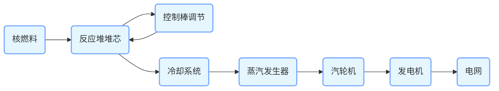

# 小型核反应堆技术的发展与能源投资策略

> 关键词：小型核反应堆技术、技术发展、能源投资策略、核能应用、能源市场

> 摘要：本文聚焦于小型核反应堆技术的发展以及与之相关的能源投资策略。首先对小型核反应堆技术的背景进行全面介绍，包括目的范围、预期读者等内容。接着深入剖析核心概念与联系，详细阐述核心算法原理和具体操作步骤，结合数学模型和公式进行说明。通过项目实战案例，展示该技术在实际中的应用和代码实现。探讨小型核反应堆技术的实际应用场景，推荐相关的工具和资源。最后总结其未来发展趋势与挑战，解答常见问题，并提供扩展阅读和参考资料，旨在为读者全面呈现小型核反应堆技术及其投资策略的全貌，为能源领域的技术研究和投资决策提供有价值的参考。

## 1. 背景介绍 
### 1.1 目的和范围
小型核反应堆技术近年来受到了广泛关注，其目的在于提供一种更加灵活、安全且高效的核能解决方案。相较于传统大型核反应堆，小型核反应堆具有体积小、建设周期短、可模块化生产等优势，能够适应不同的能源需求场景，如偏远地区供电、工业供热等。本文的范围将涵盖小型核反应堆技术的原理、发展现状、核心算法、数学模型，以及与之相关的能源投资策略分析。通过对这些方面的研究，帮助读者全面了解小型核反应堆技术及其在能源市场中的投资价值。

### 1.2 预期读者
本文预期读者包括能源领域的投资者、核能技术研究人员、能源政策制定者以及对核能技术和能源投资感兴趣的普通读者。对于投资者而言，希望通过本文了解小型核反应堆技术的投资潜力和风险，以便做出合理的投资决策；对于研究人员，本文提供了技术原理和发展趋势的分析，有助于他们深入开展相关研究；政策制定者可以从本文中获取关于小型核反应堆技术在能源结构中的定位和发展建议；普通读者则可以通过本文对小型核反应堆技术有一个初步的认识和了解。

### 1.3 文档结构概述
本文将按照以下结构进行阐述：首先介绍小型核反应堆技术的背景信息，包括目的范围、预期读者和文档结构概述等；接着详细讲解核心概念与联系，通过文本示意图和 Mermaid 流程图展示技术原理和架构；然后深入分析核心算法原理和具体操作步骤，使用 Python 源代码进行详细阐述；随后介绍数学模型和公式，并结合具体例子进行说明；通过项目实战案例，展示代码实际应用和详细解释；探讨小型核反应堆技术的实际应用场景；推荐相关的工具和资源，包括学习资源、开发工具框架和相关论文著作；最后总结未来发展趋势与挑战，解答常见问题，并提供扩展阅读和参考资料。

### 1.4 术语表
#### 1.4.1 核心术语定义
- **小型核反应堆（Small Modular Reactor, SMR）**：一种相对传统大型核反应堆而言，功率较小、设计更加紧凑的核反应堆。通常采用模块化设计，可以在工厂进行预制，然后运输到现场进行组装。
- **核能**：通过核反应从原子核释放的能量，包括核裂变能和核聚变能。在小型核反应堆中，主要利用核裂变反应释放能量。
- **核燃料**：用于核反应堆中进行核反应的物质，常见的核燃料有铀 - 235、钚 - 239 等。
- **热功率**：核反应堆在运行过程中释放的热能功率，单位通常为兆瓦（MW）。
- **电功率**：核反应堆产生的热能通过能量转换装置转化为电能的功率，单位同样为兆瓦（MW）。

#### 1.4.2 相关概念解释
- **模块化设计**：将核反应堆的各个部件设计成标准的模块，在工厂进行批量生产，然后运输到现场进行组装。这种设计方式可以提高生产效率、降低成本、缩短建设周期。
- **固有安全性**：小型核反应堆通过设计上的改进，使其在发生事故时能够依靠自身的物理特性自动停止核反应，无需外部干预，从而提高反应堆的安全性。
- **多用途应用**：小型核反应堆不仅可以用于发电，还可以用于工业供热、海水淡化、区域供暖等多种领域，具有更广泛的应用前景。

#### 1.4.3 缩略词列表
- **SMR**：Small Modular Reactor，小型核反应堆
- **MW**：MegaWatt，兆瓦
- **IAEA**：International Atomic Energy Agency，国际原子能机构

## 2. 核心概念与联系 
### 核心概念原理
小型核反应堆的核心原理是基于核裂变反应。核裂变是指重原子核（如铀 - 235）在吸收一个中子后分裂成两个或多个较轻的原子核，并释放出大量的能量和中子。这些释放出的中子又可以继续引发其他铀 - 235 原子核的裂变，从而形成链式反应。在小型核反应堆中，通过控制棒来控制链式反应的速率，控制棒由能够吸收中子的材料（如硼、镉等）制成，插入或抽出控制棒可以调节反应堆内中子的数量，进而控制核反应的强度。

反应堆产生的热能通过冷却剂（如水、液态金属等）传递给蒸汽发生器，在蒸汽发生器中，冷却剂将热量传递给二次侧的水，使其变成蒸汽。蒸汽推动汽轮机旋转，汽轮机带动发电机发电，将热能转化为电能。

### 架构的文本示意图
小型核反应堆的架构主要包括以下几个部分：
- **反应堆堆芯**：是核反应发生的核心区域，包含核燃料组件和控制棒等部件。
- **冷却系统**：用于将反应堆堆芯产生的热量带走，保证反应堆的正常运行。冷却系统通常包括主冷却剂回路和二次冷却回路。
- **蒸汽发生器**：实现热量从主冷却剂回路传递到二次冷却回路的设备，将水加热成蒸汽。
- **汽轮机 - 发电机系统**：利用蒸汽的能量推动汽轮机旋转，进而带动发电机发电。
- **控制系统**：对反应堆的运行参数进行监测和控制，确保反应堆的安全稳定运行。

### Mermaid 流程图

该流程图展示了小型核反应堆从核燃料进入反应堆堆芯，经过核反应产生热量，通过冷却系统将热量传递给蒸汽发生器，蒸汽推动汽轮机旋转，带动发电机发电，最终将电能输送到电网的整个过程。同时，控制棒对反应堆堆芯的反应速率进行调节，形成一个闭环控制系统。

## 3. 核心算法原理 & 具体操作步骤 
### 核心算法原理
在小型核反应堆的运行过程中，需要对反应堆的功率、温度、中子通量等参数进行精确控制。其中，中子通量的控制是关键，因为它直接影响核反应的强度和反应堆的功率输出。以下是一个简化的基于点堆动力学模型的中子通量控制算法原理。

点堆动力学模型描述了反应堆内中子通量随时间的变化关系，其基本方程为：
$$\frac{dN(t)}{dt}=\frac{\rho(t)-\beta}{\Lambda}N(t)+\sum_{i = 1}^{6}\lambda_{i}C_{i}(t)$$
$$\frac{dC_{i}(t)}{dt}=\frac{\beta_{i}}{\Lambda}N(t)-\lambda_{i}C_{i}(t),\quad i = 1,2,\cdots,6$$
其中，$N(t)$ 是中子通量，$\rho(t)$ 是反应性，$\beta$ 是缓发中子份额，$\Lambda$ 是中子代时间，$C_{i}(t)$ 是第 $i$ 组缓发中子先驱核浓度，$\lambda_{i}$ 是第 $i$ 组缓发中子先驱核的衰变常数，$\beta_{i}$ 是第 $i$ 组缓发中子份额。

### 具体操作步骤
以下是使用 Python 实现基于点堆动力学模型的中子通量控制算法的具体操作步骤：

```python
import numpy as np
from scipy.integrate import odeint

# 定义点堆动力学模型的参数
beta = 0.0065  # 缓发中子份额
Lambda = 1e-4  # 中子代时间
beta_i = np.array([0.000215, 0.001424, 0.001274, 0.002568, 0.000748, 0.000225])  # 各组缓发中子份额
lambda_i = np.array([0.0124, 0.0305, 0.111, 0.301, 1.14, 3.01])  # 各组缓发中子先驱核的衰变常数

# 定义点堆动力学模型的微分方程
def point_reactor_dynamics(y, t, rho):
    N = y[0]
    C = y[1:]
    dNdt = ((rho - beta) / Lambda) * N + np.sum(lambda_i * C)
    dCdt = (beta_i / Lambda) * N - lambda_i * C
    return np.concatenate(([dNdt], dCdt))

# 初始条件
N0 = 1.0  # 初始中子通量
C0 = np.zeros(6)  # 初始缓发中子先驱核浓度
y0 = np.concatenate(([N0], C0))

# 反应性随时间的变化
t = np.linspace(0, 10, 1000)  # 时间范围
rho = np.zeros_like(t)  # 初始反应性为 0
rho[100:] = 0.001  # 在 t = 1 秒后引入一个小的正反应性

# 求解微分方程
solution = odeint(point_reactor_dynamics, y0, t, args=(rho,))
N = solution[:, 0]  # 中子通量随时间的变化

# 绘制中子通量随时间的变化曲线
import matplotlib.pyplot as plt
plt.plot(t, N)
plt.xlabel('Time (s)')
plt.ylabel('Neutron Flux')
plt.title('Neutron Flux Evolution in a Point Reactor')
plt.grid(True)
plt.show()
```
### 代码解释
1. **参数定义**：首先定义了点堆动力学模型所需的参数，包括缓发中子份额 $\beta$、中子代时间 $\Lambda$、各组缓发中子份额 $\beta_i$ 和各组缓发中子先驱核的衰变常数 $\lambda_i$。
2. **微分方程定义**：定义了点堆动力学模型的微分方程 `point_reactor_dynamics`，该函数接受当前状态向量 $y$、时间 $t$ 和反应性 $\rho$ 作为输入，返回状态向量的导数。
3. **初始条件设置**：设置了初始中子通量 $N_0$ 和初始缓发中子先驱核浓度 $C_0$，并将它们组合成初始状态向量 $y_0$。
4. **反应性设置**：定义了时间范围 $t$，并设置初始反应性为 0，在 $t = 1$ 秒后引入一个小的正反应性。
5. **求解微分方程**：使用 `scipy.integrate.odeint` 函数求解点堆动力学模型的微分方程，得到中子通量随时间的变化。
6. **绘制曲线**：使用 `matplotlib` 库绘制中子通量随时间的变化曲线，直观展示反应堆内中子通量的演化过程。

## 4. 数学模型和公式 & 详细讲解 & 举例说明 
### 点堆动力学模型
点堆动力学模型是描述反应堆内中子通量随时间变化的基本数学模型。其核心方程为：
$$\frac{dN(t)}{dt}=\frac{\rho(t)-\beta}{\Lambda}N(t)+\sum_{i = 1}^{6}\lambda_{i}C_{i}(t)$$
$$\frac{dC_{i}(t)}{dt}=\frac{\beta_{i}}{\Lambda}N(t)-\lambda_{i}C_{i}(t),\quad i = 1,2,\cdots,6$$

#### 详细讲解
- **中子通量方程**：$\frac{dN(t)}{dt}$ 表示中子通量随时间的变化率。等式右边第一项 $\frac{\rho(t)-\beta}{\Lambda}N(t)$ 描述了瞬发中子对中子通量变化的贡献，其中 $\rho(t)$ 是反应性，$\beta$ 是缓发中子份额，$\Lambda$ 是中子代时间。当反应性 $\rho(t)$ 大于缓发中子份额 $\beta$ 时，中子通量将迅速增加；当 $\rho(t)$ 小于 $\beta$ 时，中子通量将逐渐减少。第二项 $\sum_{i = 1}^{6}\lambda_{i}C_{i}(t)$ 表示缓发中子对中子通量变化的贡献，$C_{i}(t)$ 是第 $i$ 组缓发中子先驱核浓度，$\lambda_{i}$ 是第 $i$ 组缓发中子先驱核的衰变常数。
- **缓发中子先驱核浓度方程**：$\frac{dC_{i}(t)}{dt}$ 表示第 $i$ 组缓发中子先驱核浓度随时间的变化率。等式右边第一项 $\frac{\beta_{i}}{\Lambda}N(t)$ 表示第 $i$ 组缓发中子先驱核的产生率，与中子通量 $N(t)$ 成正比；第二项 $-\lambda_{i}C_{i}(t)$ 表示第 $i$ 组缓发中子先驱核的衰变率，与自身浓度 $C_{i}(t)$ 成正比。

### 举例说明
假设一个小型核反应堆在初始时刻处于临界状态，即反应性 $\rho(0) = 0$，中子通量 $N(0) = 1$，缓发中子先驱核浓度 $C_{i}(0) = 0$。在 $t = 1$ 秒时，引入一个小的正反应性 $\rho(1) = 0.001$。使用上述点堆动力学模型和 Python 代码，可以计算出中子通量随时间的变化。

从计算结果的曲线可以看出，在引入正反应性之前，中子通量保持稳定；引入正反应性后，中子通量开始逐渐增加。这是因为正反应性使得核反应的速率加快，产生更多的中子，从而导致中子通量上升。

### 其他相关数学模型
除了点堆动力学模型，还有其他一些数学模型用于描述小型核反应堆的运行特性，如热工水力模型、燃料燃耗模型等。

#### 热工水力模型
热工水力模型主要描述反应堆内冷却剂的流动和传热过程，其基本方程包括质量守恒方程、动量守恒方程和能量守恒方程。

- **质量守恒方程**：
$$\frac{\partial \rho}{\partial t}+\nabla \cdot (\rho \vec{v}) = 0$$
其中，$\rho$ 是冷却剂的密度，$\vec{v}$ 是冷却剂的速度矢量。该方程表示在一个控制体内，冷却剂质量的变化率等于流入和流出该控制体的质量流量之差。

- **动量守恒方程**：
$$\frac{\partial (\rho \vec{v})}{\partial t}+\nabla \cdot (\rho \vec{v} \vec{v}) = -\nabla p + \nabla \cdot \tau + \rho \vec{g}$$
其中，$p$ 是压力，$\tau$ 是粘性应力张量，$\vec{g}$ 是重力加速度。该方程描述了冷却剂动量的变化率等于作用在冷却剂上的压力梯度力、粘性力和重力之和。

- **能量守恒方程**：
$$\frac{\partial (\rho h)}{\partial t}+\nabla \cdot (\rho \vec{v} h) = \frac{\partial p}{\partial t}+\nabla \cdot (k \nabla T) + q_{gen}$$
其中，$h$ 是比焓，$k$ 是热导率，$T$ 是温度，$q_{gen}$ 是热源项（如核反应产生的热量）。该方程表示冷却剂内能的变化率等于压力变化率、热传导率和热源项之和。

#### 燃料燃耗模型
燃料燃耗模型用于描述核燃料在反应堆运行过程中的消耗和嬗变过程。核燃料的燃耗通常用燃耗深度来表示，其定义为单位质量核燃料所释放的能量。燃料燃耗模型可以通过求解一系列的核反应方程来计算燃料中各种核素的浓度随时间的变化。

例如，对于铀 - 235 燃料，其主要的核反应包括裂变反应和中子俘获反应。铀 - 235 吸收一个中子后可能发生裂变反应，也可能发生中子俘获反应生成铀 - 236。燃料燃耗模型可以根据这些核反应的反应率和初始燃料成分，计算出不同时刻燃料中铀 - 235、铀 - 236 等核素的浓度。

## 5. 项目实战：代码实际案例和详细解释说明 
### 5.1  开发环境搭建
#### 安装 Python
首先需要安装 Python 环境，建议使用 Python 3.7 及以上版本。可以从 Python 官方网站（https://www.python.org/downloads/）下载适合自己操作系统的安装包，按照安装向导进行安装。

#### 安装必要的库
在项目中，我们使用了 `numpy`、`scipy` 和 `matplotlib` 等库。可以使用 `pip` 命令进行安装：
```sh
pip install numpy scipy matplotlib
```

### 5.2  源代码详细实现和代码解读
以下是一个更完整的小型核反应堆点堆动力学模拟的 Python 代码：

```python
import numpy as np
from scipy.integrate import odeint
import matplotlib.pyplot as plt

# 定义点堆动力学模型的参数
beta = 0.0065  # 缓发中子份额
Lambda = 1e-4  # 中子代时间
beta_i = np.array([0.000215, 0.001424, 0.001274, 0.002568, 0.000748, 0.000225])  # 各组缓发中子份额
lambda_i = np.array([0.0124, 0.0305, 0.111, 0.301, 1.14, 3.01])  # 各组缓发中子先驱核的衰变常数

# 定义点堆动力学模型的微分方程
def point_reactor_dynamics(y, t, rho_func):
    N = y[0]
    C = y[1:]
    rho = rho_func(t)  # 获取当前时刻的反应性
    dNdt = ((rho - beta) / Lambda) * N + np.sum(lambda_i * C)
    dCdt = (beta_i / Lambda) * N - lambda_i * C
    return np.concatenate(([dNdt], dCdt))

# 定义反应性随时间的变化函数
def reactivity_function(t):
    if t < 1:
        return 0  # 初始反应性为 0
    elif t < 5:
        return 0.001  # 在 t = 1 到 t = 5 秒之间引入正反应性
    else:
        return -0.001  # 在 t = 5 秒之后引入负反应性

# 初始条件
N0 = 1.0  # 初始中子通量
C0 = np.zeros(6)  # 初始缓发中子先驱核浓度
y0 = np.concatenate(([N0], C0))

# 时间范围
t = np.linspace(0, 10, 1000)

# 求解微分方程
solution = odeint(point_reactor_dynamics, y0, t, args=(reactivity_function,))
N = solution[:, 0]  # 中子通量随时间的变化

# 绘制中子通量随时间的变化曲线
plt.plot(t, N)
plt.xlabel('Time (s)')
plt.ylabel('Neutron Flux')
plt.title('Neutron Flux Evolution in a Point Reactor')
plt.grid(True)
plt.show()
```

### 代码解读与分析
1. **参数定义**：定义了点堆动力学模型所需的参数，包括缓发中子份额 $\beta$、中子代时间 $\Lambda$、各组缓发中子份额 $\beta_i$ 和各组缓发中子先驱核的衰变常数 $\lambda_i$。
2. **微分方程定义**：定义了点堆动力学模型的微分方程 `point_reactor_dynamics`，该函数接受当前状态向量 $y$、时间 $t$ 和反应性函数 `rho_func` 作为输入，通过调用 `rho_func(t)` 获取当前时刻的反应性，然后计算状态向量的导数。
3. **反应性函数定义**：定义了反应性随时间的变化函数 `reactivity_function`，在不同的时间区间设置不同的反应性值，模拟反应堆的不同运行状态。
4. **初始条件设置**：设置了初始中子通量 $N_0$ 和初始缓发中子先驱核浓度 $C_0$，并将它们组合成初始状态向量 $y_0$。
5. **时间范围设置**：定义了时间范围 $t$，用于求解微分方程。
6. **求解微分方程**：使用 `scipy.integrate.odeint` 函数求解点堆动力学模型的微分方程，得到中子通量随时间的变化。
7. **绘制曲线**：使用 `matplotlib` 库绘制中子通量随时间的变化曲线，直观展示反应堆内中子通量的演化过程。

从曲线可以看出，在初始阶段，反应性为 0，中子通量保持稳定；在 $t = 1$ 秒后引入正反应性，中子通量开始上升；在 $t = 5$ 秒后引入负反应性，中子通量开始下降。这与我们对反应堆运行原理的理解是一致的，即正反应性会使核反应加剧，中子通量增加；负反应性会使核反应减弱，中子通量减少。

## 6. 实际应用场景 
### 偏远地区供电
小型核反应堆具有体积小、可模块化运输和安装的特点，非常适合为偏远地区提供电力。这些地区通常远离电网，传统的发电方式（如化石燃料发电、水力发电等）面临着运输成本高、建设难度大等问题。小型核反应堆可以在工厂预制，然后运输到偏远地区进行组装，能够快速建立起稳定的电力供应系统。例如，在一些偏远的岛屿、矿山或军事基地，小型核反应堆可以作为主要的电源，满足当地的用电需求。

### 工业供热
许多工业生产过程需要大量的热能，如化工、炼油、钢铁等行业。小型核反应堆可以提供高温高压的蒸汽，用于工业供热。与传统的化石燃料供热方式相比，核能供热具有清洁、高效、稳定等优点，能够减少碳排放，降低环境污染。同时，小型核反应堆的灵活性可以根据工业生产的需求调整供热功率，提高能源利用效率。

### 海水淡化
海水淡化是解决水资源短缺问题的重要途径之一。小型核反应堆可以为海水淡化厂提供所需的热能和电能，驱动海水淡化设备运行。通过将核能与海水淡化技术相结合，可以实现大规模、低成本的海水淡化生产。在一些沿海地区，特别是水资源匮乏的地区，小型核反应堆海水淡化系统具有广阔的应用前景。

### 区域供暖
在一些寒冷地区，冬季需要大量的热量用于区域供暖。小型核反应堆可以作为区域供暖系统的热源，为居民和商业建筑提供温暖。与传统的集中供暖方式（如燃煤锅炉、燃气锅炉等）相比，核能供暖具有环保、节能、安全等优势。同时，小型核反应堆的分布式布局可以减少供热管网的建设成本和热损失，提高供暖效率。

## 7. 工具和资源推荐
### 7.1 学习资源推荐
#### 7.1.1 书籍推荐
- 《核反应堆物理分析》：本书系统地介绍了核反应堆物理的基本原理、方法和应用，包括核反应、中子扩散理论、反应性控制等内容，是学习核反应堆物理的经典教材。
- 《核能系统分析》：全面阐述了核能系统的各个方面，包括核燃料循环、反应堆设计、热工水力、安全分析等，对于深入了解核能系统的运行和设计具有重要的参考价值。
- 《小型模块化反应堆技术》：专门介绍了小型模块化反应堆的技术特点、设计原理、应用前景等内容，是了解小型核反应堆技术的权威书籍。

#### 7.1.2 在线课程
- Coursera 平台上的 “Nuclear Energy Systems” 课程：由国际知名大学的教授授课，涵盖了核能系统的基础知识、反应堆设计、安全分析等方面的内容，通过视频讲座、作业和讨论等形式进行教学。
- edX 平台上的 “Introduction to Nuclear Power” 课程：该课程介绍了核能的基本原理、核反应堆的类型、核燃料循环等内容，适合对核能技术感兴趣的初学者。

#### 7.1.3 技术博客和网站
- 国际原子能机构（IAEA）官方网站（https://www.iaea.org/）：提供了关于核能技术、核安全、核法规等方面的最新信息和研究成果，是了解全球核能发展动态的重要渠道。
- 美国核学会（ANS）官方网站（https://www.ans.org/）：发布了大量关于核科学、核工程的技术文章、会议信息和研究报告，对于深入研究核能技术具有重要的参考价值。
- 中国核能行业协会官方网站（http://www.cnnea.org.cn/）：聚焦于中国核能行业的发展，提供了国内核能政策、技术进展、项目动态等方面的信息。

### 7.2 开发工具框架推荐
#### 7.2.1 IDE和编辑器
- PyCharm：一款专业的 Python 集成开发环境，具有代码编辑、调试、代码分析等功能，非常适合开发基于 Python 的核反应堆模拟程序。
- Visual Studio Code：一款轻量级的代码编辑器，支持多种编程语言，具有丰富的插件扩展功能，可以方便地进行代码编写和调试。

#### 7.2.2 调试和性能分析工具
- gdb：一款强大的调试工具，可用于调试 C、C++ 等编程语言编写的核反应堆模拟程序，帮助开发人员定位和解决程序中的错误。
- cProfile：Python 自带的性能分析工具，可以分析 Python 程序的运行时间和函数调用情况，帮助优化程序性能。

#### 7.2.3 相关框架和库
- OpenMC：一个开源的蒙特卡罗粒子输运模拟框架，可用于模拟核反应堆内的中子输运过程，具有高精度和高效率的特点。
- RELAP5：一款广泛应用于核反应堆热工水力分析的软件，可模拟反应堆内冷却剂的流动和传热过程，评估反应堆的热工水力性能。

### 7.3 相关论文著作推荐
#### 7.3.1 经典论文
- “The Physics of Nuclear Reactors” by J. J. Duderstadt and L. J. Hamilton：该论文系统地阐述了核反应堆物理的基本原理和方法，是核反应堆物理领域的经典之作。
- “Small Modular Reactors: Technology Status and Future Directions” by the International Atomic Energy Agency：全面介绍了小型模块化反应堆的技术现状、发展趋势和应用前景，为小型核反应堆技术的研究和开发提供了重要的参考。

#### 7.3.2 最新研究成果
- 在《Nuclear Science and Engineering》《Annals of Nuclear Energy》等学术期刊上发表的关于小型核反应堆技术的最新研究论文，涵盖了反应堆设计优化、安全分析、燃料技术等方面的内容。

#### 7.3.3 应用案例分析
- 一些关于小型核反应堆在偏远地区供电、工业供热、海水淡化等实际应用案例的研究报告，通过对实际项目的分析，总结经验教训，为小型核反应堆的推广应用提供参考。

## 8. 总结：未来发展趋势与挑战
### 未来发展趋势
#### 技术创新
未来小型核反应堆技术将不断创新，例如采用更先进的核燃料技术，提高核燃料的利用率和安全性；研发新型的冷却剂和反应堆材料，提高反应堆的热效率和可靠性；探索新的反应堆设计理念，如高温气冷堆、液态金属堆等，以满足不同的应用需求。

#### 多用途应用拓展
小型核反应堆将不仅仅局限于发电领域，还将在工业供热、海水淡化、区域供暖等多个领域得到更广泛的应用。通过与其他能源系统的耦合，实现能源的梯级利用，提高能源利用效率。

#### 国际合作加强
小型核反应堆技术的研发和应用需要大量的资金、技术和人才投入，国际合作将成为未来的发展趋势。各国之间可以通过合作研发、技术共享、项目共建等方式，共同推动小型核反应堆技术的发展和应用。

### 挑战
#### 安全问题
虽然小型核反应堆在设计上具有更高的安全性，但核安全始终是人们关注的焦点。如何确保反应堆在运行过程中的安全，防止核事故的发生，以及在事故发生后如何进行有效的应急处理，是小型核反应堆技术发展面临的重要挑战。

#### 公众接受度
由于核能的特殊性，公众对核能的接受度相对较低。如何提高公众对小型核反应堆的认知和信任，消除公众对核安全的担忧，是推广小型核反应堆技术的关键。

#### 法规和监管
目前，针对小型核反应堆的法规和监管体系还不够完善。如何建立健全相关的法规和监管制度，确保小型核反应堆的设计、建设、运行和退役等各个环节都符合安全标准，是小型核反应堆技术发展的重要保障。

## 9. 附录：常见问题与解答
### 小型核反应堆的安全性如何？
小型核反应堆在设计上采用了许多先进的安全技术，如固有安全性设计、非能动安全系统等，能够在发生事故时依靠自身的物理特性自动停止核反应，无需外部干预，从而提高反应堆的安全性。同时，严格的法规和监管制度也确保了小型核反应堆的设计、建设和运行符合安全标准。

### 小型核反应堆的成本如何？
小型核反应堆的成本受到多种因素的影响，如反应堆的类型、功率、建设地点、建设周期等。一般来说，小型核反应堆的建设成本相对较低，因为其可以采用模块化设计和工厂预制的方式，提高生产效率，降低建设成本。此外，小型核反应堆的运行成本也相对较低，因为其燃料利用率高，维护简单。

### 小型核反应堆的核废料如何处理？
小型核反应堆产生的核废料可以采用多种处理方式，如地质处置、再处理等。地质处置是将核废料深埋在地下稳定的地质构造中，使其与人类环境隔离；再处理是将核废料中的有用核素提取出来，进行再利用，减少核废料的体积和放射性。

### 小型核反应堆的建设周期需要多长时间？
小型核反应堆的建设周期相对较短，一般为 3 - 5 年。这是因为小型核反应堆采用模块化设计，可以在工厂进行预制，然后运输到现场进行组装，大大缩短了建设周期。

## 10. 扩展阅读 & 参考资料
### 扩展阅读
- 《核工程与技术》：深入探讨了核工程的各个方面，包括反应堆设计、核燃料循环、辐射防护等内容，对于进一步了解核工程技术具有重要的参考价值。
- 《能源转型与可持续发展》：分析了全球能源转型的趋势和挑战，以及核能在可持续能源体系中的作用，有助于读者从宏观角度理解小型核反应堆技术的发展背景。

### 参考资料
- International Atomic Energy Agency. “Small Modular Reactors: Technology Status and Future Directions”.
- Duderstadt, J. J., & Hamilton, L. J. “The Physics of Nuclear Reactors”.
- 中国核能行业协会相关报告和资料。

作者：AI天才研究院/AI Genius Institute & 禅与计算机程序设计艺术 /Zen And The Art of Computer Programming