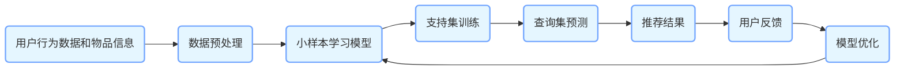

# 小样本学习在个性化推荐系统中的应用

> 关键词：小样本学习、个性化推荐系统、机器学习、数据稀缺、模型泛化

> 摘要：本文深入探讨了小样本学习在个性化推荐系统中的应用。首先介绍了研究背景、目的、预期读者、文档结构和相关术语。接着阐述了小样本学习和个性化推荐系统的核心概念及它们之间的联系，并给出了相应的原理和架构示意图以及Mermaid流程图。详细讲解了核心算法原理，包括基于元学习的方法，并给出Python代码示例。分析了相关数学模型和公式，通过具体例子进行说明。进行了项目实战，涵盖开发环境搭建、源代码实现与解读。探讨了小样本学习在个性化推荐系统中的实际应用场景。推荐了学习资源、开发工具框架和相关论文著作。最后总结了未来发展趋势与挑战，提供了常见问题解答和扩展阅读参考资料，旨在为研究者和开发者提供全面的技术指导。

## 1. 背景介绍 
### 1.1 目的和范围
在当今数字化时代，个性化推荐系统已成为众多互联网应用的核心组成部分，如电商平台、社交媒体、在线视频等。然而，传统的个性化推荐系统往往依赖大量的用户数据来训练模型，以实现准确的推荐。但在实际应用中，常常会遇到数据稀缺的情况，例如新用户的冷启动问题、小众物品的推荐等。小样本学习作为一种新兴的机器学习技术，旨在解决在少量样本数据下模型的学习和泛化问题。本文的目的就是探讨如何将小样本学习应用于个性化推荐系统，以提高系统在数据稀缺情况下的推荐性能。本文的范围涵盖小样本学习的核心概念、算法原理、数学模型，以及在个性化推荐系统中的实际应用案例和相关工具资源推荐。

### 1.2 预期读者
本文预期读者包括机器学习、数据挖掘、推荐系统领域的研究者、开发者，以及对个性化推荐技术和小样本学习感兴趣的技术爱好者。无论是从事学术研究，还是进行实际项目开发，读者都可以从本文中获取关于小样本学习在个性化推荐系统中应用的全面知识和技术指导。

### 1.3 文档结构概述
本文将按照以下结构进行组织：首先介绍小样本学习和个性化推荐系统的核心概念及它们之间的联系；接着详细讲解小样本学习的核心算法原理和具体操作步骤，并给出Python代码示例；然后分析相关的数学模型和公式，通过具体例子进行说明；进行项目实战，包括开发环境搭建、源代码实现与解读；探讨小样本学习在个性化推荐系统中的实际应用场景；推荐学习资源、开发工具框架和相关论文著作；最后总结未来发展趋势与挑战，提供常见问题解答和扩展阅读参考资料。

### 1.4 术语表
#### 1.4.1 核心术语定义
- **小样本学习（Few - Shot Learning）**：指在只有少量样本数据的情况下，模型能够快速学习并对新的样本进行准确分类或预测的机器学习技术。
- **个性化推荐系统（Personalized Recommendation System）**：根据用户的历史行为、偏好等信息，为用户提供个性化的物品推荐服务的系统。
- **元学习（Meta - Learning）**：一种学习如何学习的方法，通过在多个任务上进行训练，使模型能够快速适应新的任务，是小样本学习中常用的技术。
- **冷启动问题（Cold - Start Problem）**：在个性化推荐系统中，当新用户加入或新物品引入时，由于缺乏足够的历史数据，导致无法准确为用户进行推荐的问题。

#### 1.4.2 相关概念解释
- **支持集（Support Set）**：在小样本学习中，用于模型训练的少量样本集合。
- **查询集（Query Set）**：用于测试模型性能的样本集合。
- **嵌入空间（Embedding Space）**：将原始数据映射到一个低维向量空间，使得相似的数据在该空间中距离较近，便于模型进行学习和比较。

#### 1.4.3 缩略词列表
- **MAML（Model - Agnostic Meta - Learning）**：模型无关元学习，一种常用的元学习算法。
- **CNN（Convolutional Neural Network）**：卷积神经网络，常用于图像和序列数据的特征提取。
- **RNN（Recurrent Neural Network）**：循环神经网络，适用于处理序列数据。

## 2. 核心概念与联系 

### 小样本学习核心概念
小样本学习的核心目标是在只有少量样本的情况下，让模型能够快速学习并泛化到新的类别或任务中。传统的机器学习方法通常需要大量的样本数据来训练模型，以避免过拟合问题。而小样本学习通过利用先验知识、元学习等技术，使得模型能够在有限的样本下学习到有效的特征和模式。

常见的小样本学习方法包括基于度量的方法、基于模型的方法和基于优化的方法。基于度量的方法通过学习一个度量函数，来衡量样本之间的相似度，从而进行分类或预测。基于模型的方法则是设计特殊的模型结构，使其能够在少量样本下快速学习。基于优化的方法，如元学习，通过在多个任务上进行训练，学习到一个通用的初始化参数，使得模型能够在新任务上快速收敛。

### 个性化推荐系统核心概念
个性化推荐系统的主要功能是根据用户的历史行为、偏好等信息，为用户提供个性化的物品推荐。其基本原理是通过对用户数据的分析和挖掘，构建用户画像和物品特征表示，然后利用推荐算法计算用户与物品之间的匹配度，从而推荐出符合用户兴趣的物品。

常见的个性化推荐算法包括基于内容的推荐、协同过滤推荐、深度学习推荐等。基于内容的推荐根据物品的属性和用户的历史偏好进行推荐；协同过滤推荐通过分析用户之间的相似性或物品之间的相似性来进行推荐；深度学习推荐则利用神经网络模型对用户和物品的特征进行学习和表示。

### 核心概念联系
小样本学习与个性化推荐系统的联系在于解决个性化推荐系统中的数据稀缺问题。在个性化推荐系统中，新用户的冷启动问题和小众物品的推荐问题是常见的数据稀缺场景。小样本学习技术可以帮助推荐系统在少量用户行为数据或物品信息的情况下，快速学习到用户的偏好和物品的特征，从而提供准确的推荐。例如，通过元学习方法，推荐系统可以在多个用户群体或物品类别上进行训练，学习到通用的推荐模式，然后在新用户或小众物品上进行快速适应和推荐。

### 原理和架构的文本示意图
下面是小样本学习在个性化推荐系统中的原理和架构示意图：

用户行为数据和物品信息经过预处理后，被输入到小样本学习模型中。小样本学习模型可以采用元学习等方法，在多个任务（如不同用户群体或物品类别）上进行训练，学习到通用的特征表示和推荐模式。对于新用户或小众物品，模型可以利用支持集（少量样本数据）进行快速调整和学习，然后对查询集（待推荐的物品或用户）进行预测和推荐。推荐结果反馈给用户，用户的反馈信息又可以用于模型的进一步优化。

### Mermaid流程图


## 3. 核心算法原理 & 具体操作步骤 

### 基于元学习的小样本学习算法原理
元学习的核心思想是学习如何学习，即通过在多个任务上进行训练，让模型能够快速适应新的任务。在小样本学习中，常用的元学习算法是模型无关元学习（MAML）。

MAML的基本原理是在多个任务上进行训练，找到一个通用的初始化参数，使得模型在新任务上只需要进行少量的梯度更新就能达到较好的性能。具体来说，MAML的训练过程包括两个阶段：元训练阶段和元测试阶段。

在元训练阶段，从任务分布中采样多个任务，对于每个任务，将其样本分为支持集和查询集。模型首先在支持集上进行一次或多次梯度更新，得到一个临时参数。然后，使用临时参数在查询集上计算损失，并根据该损失对模型的初始化参数进行更新。

在元测试阶段，对于新的任务，使用训练好的初始化参数，在支持集上进行少量的梯度更新，然后在查询集上进行预测。

### 具体操作步骤
1. **数据准备**：将数据集划分为多个任务，每个任务包含支持集和查询集。支持集用于模型的快速学习，查询集用于评估模型的性能。
2. **模型初始化**：初始化一个神经网络模型，如卷积神经网络（CNN）或多层感知机（MLP）。
3. **元训练阶段**：
    - 从任务分布中采样一个任务。
    - 在支持集上进行一次或多次梯度更新，得到临时参数。
    - 使用临时参数在查询集上计算损失。
    - 根据查询集的损失对模型的初始化参数进行更新。
4. **元测试阶段**：
    - 对于新的任务，使用训练好的初始化参数。
    - 在支持集上进行少量的梯度更新。
    - 在查询集上进行预测。

### Python源代码实现
```python
import torch
import torch.nn as nn
import torch.optim as optim

# 定义一个简单的神经网络模型
class SimpleModel(nn.Module):
    def __init__(self, input_size, hidden_size, output_size):
        super(SimpleModel, self).__init__()
        self.fc1 = nn.Linear(input_size, hidden_size)
        self.relu = nn.ReLU()
        self.fc2 = nn.Linear(hidden_size, output_size)

    def forward(self, x):
        out = self.fc1(x)
        out = self.relu(out)
        out = self.fc2(out)
        return out

# 元训练函数
def meta_train(model, meta_optimizer, tasks, num_inner_steps, inner_lr):
    meta_loss = 0
    for task in tasks:
        support_x, support_y, query_x, query_y = task
        # 复制模型参数
        fast_weights = list(model.parameters())
        # 内循环训练
        for _ in range(num_inner_steps):
            support_logits = model(support_x)
            support_loss = nn.CrossEntropyLoss()(support_logits, support_y)
            gradients = torch.autograd.grad(support_loss, fast_weights)
            fast_weights = [w - inner_lr * g for w, g in zip(fast_weights, gradients)]
        # 外循环计算损失
        query_logits = model.forward_with_weights(query_x, fast_weights)
        query_loss = nn.CrossEntropyLoss()(query_logits, query_y)
        meta_loss += query_loss
    meta_loss /= len(tasks)
    # 元优化器更新
    meta_optimizer.zero_grad()
    meta_loss.backward()
    meta_optimizer.step()
    return meta_loss.item()

# 元测试函数
def meta_test(model, task, num_inner_steps, inner_lr):
    support_x, support_y, query_x, query_y = task
    fast_weights = list(model.parameters())
    for _ in range(num_inner_steps):
        support_logits = model(support_x)
        support_loss = nn.CrossEntropyLoss()(support_logits, support_y)
        gradients = torch.autograd.grad(support_loss, fast_weights)
        fast_weights = [w - inner_lr * g for w, g in zip(fast_weights, gradients)]
    query_logits = model.forward_with_weights(query_x, fast_weights)
    _, predicted = torch.max(query_logits.data, 1)
    correct = (predicted == query_y).sum().item()
    total = query_y.size(0)
    accuracy = correct / total
    return accuracy

# 示例参数
input_size = 10
hidden_size = 20
output_size = 5
num_tasks = 10
num_inner_steps = 3
inner_lr = 0.01
meta_lr = 0.001
num_epochs = 10

# 初始化模型和优化器
model = SimpleModel(input_size, hidden_size, output_size)
meta_optimizer = optim.Adam(model.parameters(), lr=meta_lr)

# 模拟任务数据
tasks = []
for _ in range(num_tasks):
    support_x = torch.randn(5, input_size)
    support_y = torch.randint(0, output_size, (5,))
    query_x = torch.randn(10, input_size)
    query_y = torch.randint(0, output_size, (10,))
    tasks.append((support_x, support_y, query_x, query_y))

# 元训练
for epoch in range(num_epochs):
    meta_loss = meta_train(model, meta_optimizer, tasks, num_inner_steps, inner_lr)
    print(f'Epoch {epoch + 1}/{num_epochs}, Meta Loss: {meta_loss}')

# 元测试
test_task = tasks[0]
accuracy = meta_test(model, test_task, num_inner_steps, inner_lr)
print(f'Test Accuracy: {accuracy}')
```

## 4. 数学模型和公式 & 详细讲解 & 举例说明 

### 元学习的数学模型
设 $\mathcal{T}$ 是任务的分布，每个任务 $T \in \mathcal{T}$ 包含一个支持集 $S_T$ 和一个查询集 $Q_T$。模型的参数为 $\theta$，对于任务 $T$，在支持集上的损失函数为 $L_T^{S}(\theta)$，在查询集上的损失函数为 $L_T^{Q}(\theta)$。

元学习的目标是找到一个初始化参数 $\theta^*$，使得在新任务上进行少量的梯度更新后，模型在查询集上的损失最小。具体来说，元学习的优化目标可以表示为：

$$\theta^* = \arg\min_{\theta} \sum_{T \in \mathcal{T}} L_T^{Q}(\theta - \alpha \nabla_{\theta} L_T^{S}(\theta))$$

其中，$\alpha$ 是内循环的学习率，用于在支持集上更新模型参数；$\nabla_{\theta} L_T^{S}(\theta)$ 是支持集上的损失函数关于参数 $\theta$ 的梯度。

### 详细讲解
在元训练阶段，对于每个采样的任务 $T$，首先在支持集上进行一次或多次梯度更新，得到临时参数 $\theta' = \theta - \alpha \nabla_{\theta} L_T^{S}(\theta)$。然后，使用临时参数 $\theta'$ 在查询集上计算损失 $L_T^{Q}(\theta')$。最后，根据所有任务的查询集损失之和，对模型的初始化参数 $\theta$ 进行更新。

在元测试阶段，对于新的任务 $T_{new}$，使用训练好的初始化参数 $\theta^*$，在支持集上进行少量的梯度更新，得到新的参数 $\theta_{new} = \theta^* - \alpha \nabla_{\theta^*} L_{T_{new}}^{S}(\theta^*)$。然后，使用 $\theta_{new}$ 在查询集上进行预测。

### 举例说明
假设我们有一个图像分类任务，任务分布 $\mathcal{T}$ 包含多个不同类别的图像分类子任务。每个子任务 $T$ 的支持集 $S_T$ 包含少量的图像样本和对应的标签，查询集 $Q_T$ 包含更多的图像样本和标签。

模型的参数 $\theta$ 是一个卷积神经网络的权重。在元训练阶段，对于每个采样的任务 $T$，我们首先在支持集 $S_T$ 上计算损失 $L_T^{S}(\theta)$，并根据该损失更新参数得到 $\theta'$。然后，在查询集 $Q_T$ 上计算损失 $L_T^{Q}(\theta')$。通过多次迭代，不断调整初始化参数 $\theta$，使得在新任务上能够快速收敛。

在元测试阶段，对于一个新的图像分类任务 $T_{new}$，我们使用训练好的初始化参数 $\theta^*$，在支持集上进行少量的梯度更新，得到新的参数 $\theta_{new}$。最后，使用 $\theta_{new}$ 对查询集上的图像进行分类预测。

## 5. 项目实战：代码实际案例和详细解释说明 

### 5.1  开发环境搭建
为了实现小样本学习在个性化推荐系统中的应用，我们需要搭建相应的开发环境。以下是具体的步骤：

#### 安装Python
首先，确保你已经安装了Python 3.6或更高版本。可以从Python官方网站（https://www.python.org/downloads/）下载并安装。

#### 安装深度学习框架
我们选择使用PyTorch作为深度学习框架。可以使用以下命令安装：
```sh
pip install torch torchvision
```

#### 安装其他依赖库
还需要安装一些其他的依赖库，如NumPy、Pandas等：
```sh
pip install numpy pandas
```

### 5.2  源代码详细实现和代码解读
以下是一个简单的小样本学习在个性化推荐系统中的应用示例。假设我们有一个用户-物品评分数据集，我们的目标是为新用户推荐物品。

```python
import torch
import torch.nn as nn
import torch.optim as optim
import numpy as np

# 定义用户-物品评分矩阵
ratings = np.array([
    [5, 3, 0, 1],
    [4, 0, 0, 1],
    [1, 1, 0, 5],
    [1, 0, 0, 4],
    [0, 1, 5, 4]
])

# 数据预处理
num_users, num_items = ratings.shape
user_features = torch.randn(num_users, 10)
item_features = torch.randn(num_items, 10)

# 定义推荐模型
class RecommendationModel(nn.Module):
    def __init__(self, user_feature_size, item_feature_size, hidden_size):
        super(RecommendationModel, self).__init__()
        self.fc1 = nn.Linear(user_feature_size + item_feature_size, hidden_size)
        self.relu = nn.ReLU()
        self.fc2 = nn.Linear(hidden_size, 1)

    def forward(self, user_feat, item_feat):
        combined_feat = torch.cat((user_feat, item_feat), dim=1)
        out = self.fc1(combined_feat)
        out = self.relu(out)
        out = self.fc2(out)
        return out

# 初始化模型和优化器
model = RecommendationModel(10, 10, 20)
optimizer = optim.Adam(model.parameters(), lr=0.001)
criterion = nn.MSELoss()

# 小样本学习训练
num_epochs = 100
for epoch in range(num_epochs):
    total_loss = 0
    for user_idx in range(num_users):
        for item_idx in range(num_items):
            if ratings[user_idx, item_idx] > 0:
                user_feat = user_features[user_idx].unsqueeze(0)
                item_feat = item_features[item_idx].unsqueeze(0)
                target = torch.tensor([ratings[user_idx, item_idx]], dtype=torch.float32).unsqueeze(0)

                optimizer.zero_grad()
                output = model(user_feat, item_feat)
                loss = criterion(output, target)
                loss.backward()
                optimizer.step()

                total_loss += loss.item()
    print(f'Epoch {epoch + 1}/{num_epochs}, Loss: {total_loss}')

# 为新用户推荐物品
new_user_feature = torch.randn(1, 10)
item_scores = []
for item_idx in range(num_items):
    item_feat = item_features[item_idx].unsqueeze(0)
    score = model(new_user_feature, item_feat).item()
    item_scores.append(score)

recommended_items = np.argsort(item_scores)[::-1]
print('Recommended items:', recommended_items)
```

### 5.3  代码解读与分析
1. **数据预处理**：我们使用一个简单的用户-物品评分矩阵 `ratings` 来表示用户对物品的评分。同时，随机初始化用户特征 `user_features` 和物品特征 `item_features`。
2. **推荐模型定义**：定义了一个简单的神经网络模型 `RecommendationModel`，该模型接受用户特征和物品特征作为输入，通过两层全连接层输出一个评分预测值。
3. **训练过程**：在训练过程中，遍历所有的用户-物品对，如果该用户对该物品有评分，则将用户特征和物品特征输入到模型中，计算预测评分与真实评分之间的均方误差损失，并进行反向传播和参数更新。
4. **推荐过程**：对于新用户，随机生成其特征向量，然后计算该用户对所有物品的评分预测值，根据评分预测值对物品进行排序，推荐评分较高的物品。

## 6. 实际应用场景 
### 新用户冷启动问题
在个性化推荐系统中，新用户冷启动是一个常见的问题。由于新用户没有历史行为数据，传统的推荐算法很难为其提供准确的推荐。小样本学习可以在新用户只有少量行为数据（如注册信息、初始浏览记录等）的情况下，快速学习到用户的偏好，从而为其提供个性化的推荐。例如，电商平台可以利用小样本学习技术，根据新用户填写的性别、年龄、兴趣爱好等信息，快速为其推荐相关的商品。

### 小众物品推荐
小众物品由于其受众较少，相关的用户行为数据也比较稀缺。传统的推荐算法可能无法准确地捕捉到小众物品的特征和用户对其的兴趣。小样本学习可以在少量用户对小众物品的行为数据下，学习到小众物品的特征和用户的偏好，从而将小众物品推荐给可能感兴趣的用户。例如，音乐推荐平台可以利用小样本学习技术，为用户推荐一些小众的音乐作品。

### 个性化内容推荐
在新闻、文章、视频等内容推荐领域，新的内容不断涌现，而这些新内容往往缺乏足够的用户反馈数据。小样本学习可以帮助推荐系统在少量用户对新内容的行为数据下，快速学习到内容的特征和用户的偏好，从而为用户推荐符合其兴趣的新内容。例如，新闻推荐平台可以利用小样本学习技术，根据用户对少量新闻文章的阅读行为，为其推荐其他相关的新闻文章。

## 7. 工具和资源推荐
### 7.1 学习资源推荐
#### 7.1.1 书籍推荐
- 《机器学习》（周志华）：全面介绍了机器学习的基本概念、算法和应用，是机器学习领域的经典教材。
- 《深度学习》（Ian Goodfellow、Yoshua Bengio、Aaron Courville）：详细介绍了深度学习的理论和实践，包括神经网络、卷积神经网络、循环神经网络等。
- 《Python机器学习》（Sebastian Raschka）：通过Python代码示例，介绍了机器学习的常用算法和工具，适合初学者。

#### 7.1.2 在线课程
- Coursera上的“机器学习”课程（Andrew Ng）：由机器学习领域的知名专家Andrew Ng教授授课，是学习机器学习的经典课程。
- edX上的“深度学习基础”课程：介绍了深度学习的基本概念和算法，包括神经网络、卷积神经网络等。
- 吴恩达的深度学习专项课程：涵盖了深度学习的各个方面，包括卷积神经网络、循环神经网络、生成对抗网络等。

#### 7.1.3 技术博客和网站
- Medium：有许多机器学习和深度学习领域的优秀博客文章，涵盖了最新的研究成果和技术应用。
- arXiv：提供了大量的学术论文，包括机器学习、深度学习、小样本学习等领域的最新研究成果。
- Kaggle：一个数据科学竞赛平台，有许多关于机器学习和推荐系统的案例和代码分享。

### 7.2 开发工具框架推荐
#### 7.2.1 IDE和编辑器
- PyCharm：一款专门为Python开发设计的集成开发环境，提供了丰富的代码编辑、调试和版本控制功能。
- Jupyter Notebook：一个交互式的开发环境，适合进行数据分析、模型训练和可视化展示。
- Visual Studio Code：一款轻量级的代码编辑器，支持多种编程语言和插件扩展，可用于Python开发。

#### 7.2.2 调试和性能分析工具
- PyTorch Profiler：PyTorch提供的性能分析工具，可以帮助开发者分析模型的训练和推理性能。
- TensorBoard：一个可视化工具，可用于查看模型的训练过程、损失曲线、准确率等指标。
- cProfile：Python内置的性能分析工具，可以分析Python代码的运行时间和函数调用情况。

#### 7.2.3 相关框架和库
- PyTorch：一个开源的深度学习框架，提供了丰富的神经网络层和优化算法，易于使用和扩展。
- TensorFlow：另一个广泛使用的深度学习框架，具有强大的分布式训练和部署能力。
- Scikit - learn：一个机器学习库，提供了多种机器学习算法和工具，如分类、回归、聚类等。

### 7.3 相关论文著作推荐
#### 7.3.1 经典论文
- "Model - Agnostic Meta - Learning for Fast Adaptation of Deep Networks"（Chelsea Finn等）：介绍了模型无关元学习（MAML）算法，是小样本学习领域的经典论文。
- "Matching Networks for One Shot Learning"（Oriol Vinyals等）：提出了基于匹配网络的小样本学习方法。
- "Prototypical Networks for Few - Shot Learning"（Jake Snell等）：介绍了原型网络在小样本学习中的应用。

#### 7.3.2 最新研究成果
可以关注机器学习和人工智能领域的顶级会议，如NeurIPS、ICML、CVPR等，这些会议上会有关于小样本学习和个性化推荐系统的最新研究成果。

#### 7.3.3 应用案例分析
可以参考一些实际应用案例，如电商平台、社交媒体平台的推荐系统，了解小样本学习在实际场景中的应用和优化方法。

## 8. 总结：未来发展趋势与挑战
### 未来发展趋势
- **与其他技术的融合**：小样本学习可能会与强化学习、迁移学习等技术进一步融合，以提高推荐系统的性能和适应性。例如，结合强化学习可以让推荐系统根据用户的实时反馈动态调整推荐策略。
- **跨领域应用**：小样本学习在个性化推荐系统中的应用可能会扩展到更多领域，如医疗、金融等。在医疗领域，可以根据少量患者的病历数据为新患者提供个性化的治疗建议。
- **模型的轻量化和高效化**：随着移动设备和物联网的发展，需要开发更加轻量化和高效的小样本学习模型，以满足实时推荐的需求。

### 挑战
- **数据质量和多样性**：小样本学习对数据的质量和多样性要求较高。在实际应用中，可能会遇到数据噪声、数据偏差等问题，影响模型的性能。
- **模型的可解释性**：小样本学习模型通常比较复杂，缺乏可解释性。在一些对解释性要求较高的场景中，如医疗推荐，需要提高模型的可解释性。
- **计算资源和时间成本**：小样本学习的训练过程通常需要大量的计算资源和时间，特别是在处理大规模数据集时。需要开发更加高效的算法和优化方法，降低计算成本。

## 9. 附录：常见问题与解答
### 问题1：小样本学习在个性化推荐系统中的应用效果如何？
小样本学习可以有效解决个性化推荐系统中的数据稀缺问题，如新用户冷启动和小众物品推荐。在少量样本数据下，小样本学习模型可以快速学习到用户的偏好和物品的特征，从而提供较为准确的推荐。但具体的应用效果还受到数据质量、模型选择和参数调整等因素的影响。

### 问题2：小样本学习与传统机器学习方法有什么区别？
传统机器学习方法通常需要大量的样本数据来训练模型，以避免过拟合问题。而小样本学习旨在解决在少量样本数据下模型的学习和泛化问题。小样本学习通过利用先验知识、元学习等技术，使得模型能够在有限的样本下学习到有效的特征和模式。

### 问题3：如何选择适合的小样本学习算法？
选择适合的小样本学习算法需要考虑多个因素，如数据类型、任务类型、样本数量等。基于度量的方法适用于数据具有明确的度量空间的情况；基于模型的方法适合对模型结构有特殊要求的场景；基于优化的方法，如元学习，适用于需要快速适应新任务的情况。

### 问题4：小样本学习在实际应用中需要注意什么？
在实际应用中，需要注意数据的质量和多样性，避免数据噪声和偏差对模型性能的影响。同时，需要对模型进行合理的评估和调优，选择合适的评估指标和参数。此外，还需要考虑计算资源和时间成本，确保模型能够在实际场景中高效运行。

## 10. 扩展阅读 & 参考资料
### 扩展阅读
- 《人工智能：现代方法》（Stuart Russell、Peter Norvig）：全面介绍了人工智能的各个领域，包括机器学习、自然语言处理、计算机视觉等。
- 《数据挖掘：概念与技术》（Jiawei Han、Jian Pei、Jianwen Yin）：介绍了数据挖掘的基本概念、算法和应用，适合深入学习推荐系统的数据挖掘技术。

### 参考资料
- 相关的学术论文和研究报告，可以在学术数据库如IEEE Xplore、ACM Digital Library等中查找。
- 开源代码库如GitHub，有许多关于小样本学习和个性化推荐系统的开源项目，可以参考学习。

作者：AI天才研究院/AI Genius Institute & 禅与计算机程序设计艺术 /Zen And The Art of Computer Programming