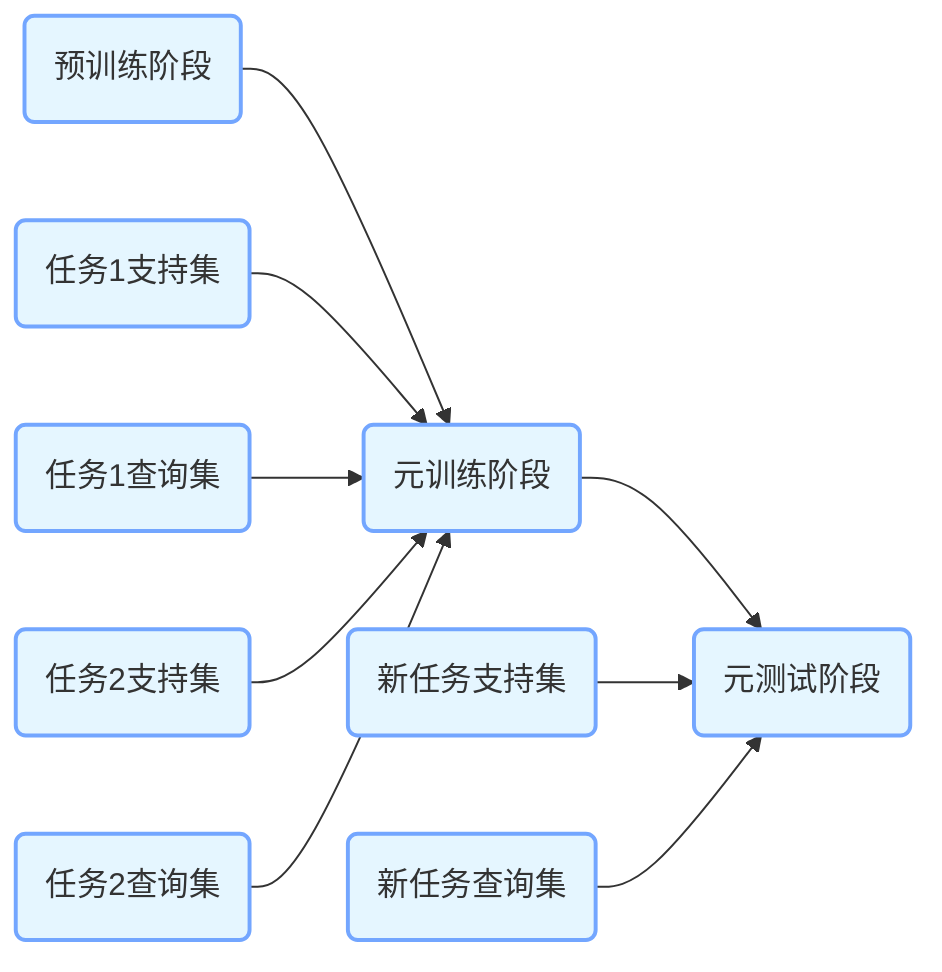

# 少样本学习：在有限数据下快速适应

> 关键词：少样本学习、有限数据、快速适应、元学习、迁移学习

> 摘要：本文围绕少样本学习展开，旨在探讨在有限数据条件下实现快速适应的技术方法。详细介绍了少样本学习的背景知识，包括目的、预期读者等，深入剖析了核心概念、算法原理、数学模型。通过项目实战展示具体代码实现及解读，阐述了其实际应用场景，推荐了相关的学习资源、开发工具和论文著作。最后总结了少样本学习的未来发展趋势与挑战，并提供常见问题解答和扩展阅读参考资料。

## 1. 背景介绍 
### 1.1 目的和范围
在传统的机器学习和深度学习任务中，往往需要大量的标注数据来训练模型，以保证模型具有良好的泛化能力。然而，在实际应用场景中，获取大量标注数据可能面临诸多困难，例如数据收集成本高、标注过程耗时费力、某些领域的数据本身就非常稀缺等。少样本学习（Few-Shot Learning）正是为了解决这一问题而提出的，其目的是让模型在仅有少量标注样本的情况下，依然能够快速学习并对新的类别进行准确分类或完成其他相关任务。

本文的范围涵盖少样本学习的基本概念、核心算法原理、数学模型、实际应用案例，以及相关的学习资源和工具推荐等方面。通过对这些内容的详细介绍，帮助读者全面了解少样本学习，并能够在实际项目中应用相关技术。

### 1.2 预期读者
本文的预期读者包括对机器学习、深度学习领域感兴趣的研究人员、工程师和学生。对于初学者来说，可以通过本文了解少样本学习的基础知识和基本原理；对于有一定经验的从业者，本文提供了深入的算法分析、代码实现和实际应用案例，有助于他们在实际项目中应用少样本学习技术。

### 1.3 文档结构概述
本文将按照以下结构进行组织：首先介绍少样本学习的背景知识，包括目的、预期读者和文档结构概述；接着详细阐述少样本学习的核心概念和相关联系，并通过文本示意图和 Mermaid 流程图进行直观展示；然后介绍核心算法原理和具体操作步骤，使用 Python 源代码进行详细阐述；之后讲解少样本学习的数学模型和公式，并通过举例进行说明；再通过项目实战展示代码实际案例和详细解释；随后介绍少样本学习的实际应用场景；接着推荐相关的学习资源、开发工具和论文著作；最后总结少样本学习的未来发展趋势与挑战，并提供常见问题解答和扩展阅读参考资料。

### 1.4 术语表
#### 1.4.1 核心术语定义
- **少样本学习（Few-Shot Learning）**：指在仅有少量标注样本的情况下，模型能够快速学习并对新的类别进行准确分类或完成其他相关任务的学习方法。
- **元学习（Meta-Learning）**：也称为“学习如何学习”，是一种让模型学会快速学习新知识的方法，在少样本学习中经常被使用。
- **支持集（Support Set）**：在少样本学习中，用于模型快速学习新类别的少量标注样本集合。
- **查询集（Query Set）**：在少样本学习中，用于测试模型对新类别分类能力的样本集合。

#### 1.4.2 相关概念解释
- **迁移学习（Transfer Learning）**：将在一个任务上学习到的知识迁移到另一个相关任务上的学习方法。少样本学习中常常会借助迁移学习的思想，利用在大规模数据集上学习到的知识来帮助在少量样本上进行学习。
- **度量学习（Metric Learning）**：通过学习样本之间的距离度量，使得同一类别的样本在特征空间中距离较近，不同类别的样本距离较远。在少样本学习中，度量学习可以用于判断查询集中样本与支持集中样本的相似度，从而进行分类。

#### 1.4.3 缩略词列表
- **CNN（Convolutional Neural Network）**：卷积神经网络，一种常用于图像识别和处理的深度学习模型。
- **MAML（Model-Agnostic Meta-Learning）**：模型无关元学习，一种经典的少样本学习元学习算法。
- **Siamese Network**：孪生网络，一种用于度量学习的神经网络结构。

## 2. 核心概念与联系 

少样本学习的核心目标是在有限的数据下，让模型能够快速适应新的任务。为了实现这一目标，常常会结合元学习、迁移学习和度量学习等方法。

### 核心概念原理

#### 元学习
元学习的核心思想是让模型学会如何学习。在少样本学习中，元学习通常通过在多个任务上进行训练，使得模型能够快速调整参数以适应新的任务。例如，在训练阶段，模型会在一系列不同的少样本学习任务上进行训练，每个任务都有自己的支持集和查询集。通过在这些任务上的训练，模型学习到一种通用的学习策略，当遇到新的少样本学习任务时，能够利用这种学习策略快速学习。

#### 迁移学习
迁移学习利用在大规模数据集上学习到的知识来帮助在少量样本上进行学习。在少样本学习中，可以先在大规模的预训练数据集上训练一个模型，然后将其参数作为初始化参数，在少样本数据集上进行微调。这样可以利用预训练模型学习到的通用特征，减少对少样本数据的依赖。

#### 度量学习
度量学习通过学习样本之间的距离度量，使得同一类别的样本在特征空间中距离较近，不同类别的样本距离较远。在少样本学习中，度量学习可以用于判断查询集中样本与支持集中样本的相似度，从而进行分类。例如，孪生网络就是一种常用的度量学习方法，它通过比较两个样本的特征向量来判断它们是否属于同一类别。

### 架构的文本示意图

少样本学习的整体架构可以描述如下：

1. **预训练阶段（可选）**：如果使用迁移学习，首先在大规模数据集上训练一个基础模型，例如使用 CNN 在 ImageNet 数据集上进行预训练。
2. **元训练阶段**：在多个少样本学习任务上进行训练，每个任务包括一个支持集和一个查询集。模型通过在这些任务上的训练，学习到一种通用的学习策略。
3. **元测试阶段**：当遇到新的少样本学习任务时，使用支持集对模型进行快速调整，然后在查询集上进行测试，评估模型的性能。

### Mermaid 流程图



## 3. 核心算法原理 & 具体操作步骤 

### 核心算法原理 - MAML

MAML（Model-Agnostic Meta-Learning）是一种经典的少样本学习元学习算法，其核心思想是找到一组通用的初始化参数，使得模型在遇到新的少样本学习任务时，能够通过少量的梯度更新快速适应。

#### 算法步骤

1. **初始化参数**：随机初始化模型的参数 $\theta$。
2. **元训练阶段**：
    - 从任务分布 $\mathcal{T}$ 中采样一个任务 $T_i$，该任务包括支持集 $S_i$ 和查询集 $Q_i$。
    - 在支持集 $S_i$ 上进行一次或多次梯度更新，得到临时参数 $\theta'_i$：
      - 计算损失函数 $L(S_i; \theta)$。
      - 根据损失函数计算梯度 $\nabla_{\theta} L(S_i; \theta)$。
      - 使用梯度更新参数：$\theta'_i = \theta - \alpha \nabla_{\theta} L(S_i; \theta)$，其中 $\alpha$ 是内循环学习率。
    - 在查询集 $Q_i$ 上计算损失函数 $L(Q_i; \theta'_i)$，并根据该损失函数计算梯度 $\nabla_{\theta} L(Q_i; \theta'_i)$。
    - 使用梯度更新原始参数 $\theta$：$\theta = \theta - \beta \nabla_{\theta} L(Q_i; \theta'_i)$，其中 $\beta$ 是外循环学习率。
3. **元测试阶段**：
    - 当遇到新的少样本学习任务时，使用支持集对模型的参数 $\theta$ 进行一次或多次梯度更新，得到适应新任务的参数 $\theta'$。
    - 在查询集上使用参数 $\theta'$ 进行预测。

### Python 源代码实现

```python
import torch
import torch.nn as nn
import torch.optim as optim

# 定义一个简单的神经网络模型
class SimpleNet(nn.Module):
    def __init__(self, input_size, hidden_size, output_size):
        super(SimpleNet, self).__init__()
        self.fc1 = nn.Linear(input_size, hidden_size)
        self.relu = nn.ReLU()
        self.fc2 = nn.Linear(hidden_size, output_size)

    def forward(self, x):
        out = self.fc1(x)
        out = self.relu(out)
        out = self.fc2(out)
        return out

# 定义 MAML 算法类
class MAML:
    def __init__(self, model, inner_lr, outer_lr):
        self.model = model
        self.inner_lr = inner_lr
        self.outer_lr = outer_lr
        self.outer_optimizer = optim.Adam(self.model.parameters(), lr=outer_lr)

    def inner_update(self, support_x, support_y):
        # 保存原始参数
        fast_weights = [p.clone() for p in self.model.parameters()]
        # 计算支持集上的损失
        logits = self.model(support_x)
        loss = nn.CrossEntropyLoss()(logits, support_y)
        # 计算梯度
        grads = torch.autograd.grad(loss, fast_weights)
        # 更新参数
        fast_weights = [w - self.inner_lr * g for w, g in zip(fast_weights, grads)]
        return fast_weights

    def outer_update(self, tasks):
        meta_loss = 0
        for support_x, support_y, query_x, query_y in tasks:
            # 内循环更新
            fast_weights = self.inner_update(support_x, support_y)
            # 在查询集上计算损失
            logits = self.model.forward_with_weights(query_x, fast_weights)
            loss = nn.CrossEntropyLoss()(logits, query_y)
            meta_loss += loss
        # 外循环更新
        self.outer_optimizer.zero_grad()
        meta_loss.backward()
        self.outer_optimizer.step()
        return meta_loss.item()

# 示例使用
input_size = 10
hidden_size = 20
output_size = 5
model = SimpleNet(input_size, hidden_size, output_size)
maml = MAML(model, inner_lr=0.01, outer_lr=0.001)

# 模拟一些任务
tasks = []
for _ in range(10):
    support_x = torch.randn(5, input_size)
    support_y = torch.randint(0, output_size, (5,))
    query_x = torch.randn(10, input_size)
    query_y = torch.randint(0, output_size, (10,))
    tasks.append((support_x, support_y, query_x, query_y))

# 元训练
for epoch in range(100):
    loss = maml.outer_update(tasks)
    if (epoch + 1) % 10 == 0:
        print(f'Epoch {epoch + 1}, Loss: {loss}')
```

### 具体操作步骤

1. **定义模型**：根据具体任务的需求，定义一个合适的神经网络模型。
2. **初始化 MAML 类**：设置内循环学习率和外循环学习率，并初始化 MAML 类。
3. **生成任务数据**：模拟或收集多个少样本学习任务的数据，每个任务包括支持集和查询集。
4. **元训练**：在多个任务上进行元训练，不断更新模型的参数。
5. **元测试**：当遇到新的少样本学习任务时，使用支持集对模型进行快速调整，然后在查询集上进行预测。

## 4. 数学模型和公式 & 详细讲解 & 举例说明 

### 数学模型和公式

#### MAML 算法的数学模型

在 MAML 算法中，核心的目标是找到一组初始化参数 $\theta$，使得模型在遇到新的少样本学习任务时，能够通过少量的梯度更新快速适应。具体来说，MAML 的优化目标可以表示为：

$$\min_{\theta} \sum_{T_i \sim \mathcal{T}} L(Q_i; \theta'_i)$$

其中，$\mathcal{T}$ 是任务分布，$T_i$ 是从任务分布中采样得到的一个任务，$Q_i$ 是任务 $T_i$ 的查询集，$\theta'_i$ 是在任务 $T_i$ 的支持集 $S_i$ 上进行一次或多次梯度更新后得到的临时参数。

临时参数 $\theta'_i$ 的更新公式为：

$$\theta'_i = \theta - \alpha \nabla_{\theta} L(S_i; \theta)$$

其中，$\alpha$ 是内循环学习率，$L(S_i; \theta)$ 是在支持集 $S_i$ 上的损失函数。

### 详细讲解

MAML 算法的核心思想是通过在多个任务上进行训练，找到一组通用的初始化参数 $\theta$。在每个任务上，首先使用支持集对模型的参数进行一次或多次梯度更新，得到临时参数 $\theta'_i$。然后，在查询集上计算损失函数 $L(Q_i; \theta'_i)$，并根据该损失函数更新原始参数 $\theta$。这样，模型就能够学习到一种通用的学习策略，使得在遇到新的少样本学习任务时，能够通过少量的梯度更新快速适应。

### 举例说明

假设我们有一个简单的分类任务，输入是一个 10 维的向量，输出是 5 个类别之一。我们使用一个简单的两层神经网络作为模型，内循环学习率 $\alpha = 0.01$，外循环学习率 $\beta = 0.001$。

在元训练阶段，我们从任务分布中采样一个任务，该任务的支持集有 5 个样本，查询集有 10 个样本。首先，在支持集上计算损失函数 $L(S_i; \theta)$，并根据该损失函数更新参数得到临时参数 $\theta'_i$。然后，在查询集上计算损失函数 $L(Q_i; \theta'_i)$，并根据该损失函数更新原始参数 $\theta$。

经过多次元训练后，当遇到新的少样本学习任务时，我们使用支持集对模型的参数 $\theta$ 进行一次或多次梯度更新，得到适应新任务的参数 $\theta'$。然后，在查询集上使用参数 $\theta'$ 进行预测，评估模型的性能。

## 5. 项目实战：代码实际案例和详细解释说明 

### 5.1  开发环境搭建

#### 安装 Python
首先，确保你已经安装了 Python 3.6 或更高版本。你可以从 Python 官方网站（https://www.python.org/downloads/）下载并安装 Python。

#### 安装深度学习框架
本文使用 PyTorch 作为深度学习框架，你可以使用以下命令安装 PyTorch：

```bash
pip install torch torchvision
```

#### 安装其他依赖库
还需要安装一些其他的依赖库，如 NumPy、Matplotlib 等，可以使用以下命令安装：

```bash
pip install numpy matplotlib
```

### 5.2  源代码详细实现和代码解读

```python
import torch
import torch.nn as nn
import torch.optim as optim
import numpy as np
import matplotlib.pyplot as plt

# 定义一个简单的卷积神经网络模型
class SimpleCNN(nn.Module):
    def __init__(self, num_classes):
        super(SimpleCNN, self).__init__()
        self.conv1 = nn.Conv2d(3, 16, kernel_size=3, padding=1)
        self.relu1 = nn.ReLU()
        self.pool1 = nn.MaxPool2d(2)
        self.conv2 = nn.Conv2d(16, 32, kernel_size=3, padding=1)
        self.relu2 = nn.ReLU()
        self.pool2 = nn.MaxPool2d(2)
        self.fc1 = nn.Linear(32 * 8 * 8, 128)
        self.relu3 = nn.ReLU()
        self.fc2 = nn.Linear(128, num_classes)

    def forward(self, x):
        x = self.pool1(self.relu1(self.conv1(x)))
        x = self.pool2(self.relu2(self.conv2(x)))
        x = x.view(-1, 32 * 8 * 8)
        x = self.relu3(self.fc1(x))
        x = self.fc2(x)
        return x

# 定义 MAML 算法类
class MAML:
    def __init__(self, model, inner_lr, outer_lr):
        self.model = model
        self.inner_lr = inner_lr
        self.outer_lr = outer_lr
        self.outer_optimizer = optim.Adam(self.model.parameters(), lr=outer_lr)

    def inner_update(self, support_x, support_y):
        # 保存原始参数
        fast_weights = [p.clone() for p in self.model.parameters()]
        # 计算支持集上的损失
        logits = self.model(support_x)
        loss = nn.CrossEntropyLoss()(logits, support_y)
        # 计算梯度
        grads = torch.autograd.grad(loss, fast_weights)
        # 更新参数
        fast_weights = [w - self.inner_lr * g for w, g in zip(fast_weights, grads)]
        return fast_weights

    def outer_update(self, tasks):
        meta_loss = 0
        for support_x, support_y, query_x, query_y in tasks:
            # 内循环更新
            fast_weights = self.inner_update(support_x, support_y)
            # 在查询集上计算损失
            logits = self.model.forward_with_weights(query_x, fast_weights)
            loss = nn.CrossEntropyLoss()(logits, query_y)
            meta_loss += loss
        # 外循环更新
        self.outer_optimizer.zero_grad()
        meta_loss.backward()
        self.outer_optimizer.step()
        return meta_loss.item()

# 生成模拟数据
def generate_data(num_tasks, num_support, num_query, num_classes, image_size):
    tasks = []
    for _ in range(num_tasks):
        support_x = torch.randn(num_support, 3, image_size, image_size)
        support_y = torch.randint(0, num_classes, (num_support,))
        query_x = torch.randn(num_query, 3, image_size, image_size)
        query_y = torch.randint(0, num_classes, (num_query,))
        tasks.append((support_x, support_y, query_x, query_y))
    return tasks

# 示例使用
num_classes = 5
image_size = 32
model = SimpleCNN(num_classes)
maml = MAML(model, inner_lr=0.01, outer_lr=0.001)

# 生成任务数据
num_tasks = 10
num_support = 5
num_query = 10
tasks = generate_data(num_tasks, num_support, num_query, num_classes, image_size)

# 元训练
num_epochs = 100
losses = []
for epoch in range(num_epochs):
    loss = maml.outer_update(tasks)
    losses.append(loss)
    if (epoch + 1) % 10 == 0:
        print(f'Epoch {epoch + 1}, Loss: {loss}')

# 绘制损失曲线
plt.plot(losses)
plt.xlabel('Epoch')
plt.ylabel('Loss')
plt.title('MAML Training Loss')
plt.show()
```

### 代码解读与分析

#### 模型定义
`SimpleCNN` 类定义了一个简单的卷积神经网络模型，包括两个卷积层、两个池化层和两个全连接层。该模型用于对图像进行分类。

#### MAML 类
`MAML` 类实现了 MAML 算法的核心逻辑，包括内循环更新和外循环更新。`inner_update` 方法用于在支持集上进行一次梯度更新，得到临时参数；`outer_update` 方法用于在多个任务上进行元训练，更新模型的原始参数。

#### 数据生成
`generate_data` 函数用于生成模拟的少样本学习任务数据，每个任务包括支持集和查询集。

#### 元训练
在主程序中，首先定义了模型和 MAML 类，然后生成任务数据。接着进行元训练，不断更新模型的参数，并记录每个 epoch 的损失值。最后，绘制损失曲线，直观地展示训练过程。

通过这个项目实战，我们可以看到如何使用 MAML 算法在有限的数据下进行少样本学习，以及如何实现和训练一个简单的少样本学习模型。

## 6. 实际应用场景 

少样本学习在许多实际应用场景中都具有重要的价值，以下是一些常见的应用场景：

### 医疗领域
在医疗诊断中，某些疾病的样本数据可能非常稀缺，例如罕见病。少样本学习可以帮助医生在仅有少量病例数据的情况下，快速训练出诊断模型，对新的病例进行准确诊断。此外，在医学影像分析中，如X光、CT 等图像的分类和检测任务，少样本学习也可以提高模型在有限数据下的性能。

### 自然语言处理
在自然语言处理中，某些特定领域的文本数据可能非常有限，例如法律、医学等领域的文本。少样本学习可以用于在这些领域进行文本分类、命名实体识别等任务，使得模型能够在有限的数据下快速适应新的领域。

### 机器人领域
在机器人的学习和决策过程中，获取大量的标注数据可能非常困难。少样本学习可以帮助机器人在仅有少量样本的情况下，快速学习新的技能和任务，例如物体识别、动作规划等。

### 安全领域
在网络安全和信息安全领域，新的攻击模式和恶意软件不断涌现，而这些新的威胁的样本数据往往非常有限。少样本学习可以用于快速检测和识别这些新的威胁，提高系统的安全性。

### 工业制造
在工业制造中，对新产品的质量检测和故障诊断可能缺乏大量的样本数据。少样本学习可以帮助建立快速有效的检测和诊断模型，提高生产效率和产品质量。

## 7. 工具和资源推荐
### 7.1 学习资源推荐
#### 7.1.1 书籍推荐
- 《深度学习》（Deep Learning）：由 Ian Goodfellow、Yoshua Bengio 和 Aaron Courville 所著，是深度学习领域的经典教材，涵盖了深度学习的基本概念、算法和应用。
- 《机器学习》（Machine Learning: A Probabilistic Perspective）：由 Kevin P. Murphy 所著，从概率的角度介绍了机器学习的基本理论和算法，对理解少样本学习的理论基础有很大帮助。
- 《少样本学习：原理、算法与应用》：专门介绍少样本学习的书籍，详细讲解了少样本学习的核心概念、算法和实际应用。

#### 7.1.2 在线课程
- Coursera 上的“深度学习专项课程”（Deep Learning Specialization）：由 Andrew Ng 教授讲授，包括深度学习的基础知识、卷积神经网络、循环神经网络等内容，对学习少样本学习有很好的基础铺垫作用。
- edX 上的“机器学习基础”（Fundamentals of Machine Learning）：介绍了机器学习的基本概念和算法，适合初学者入门。
- 哔哩哔哩上有许多关于少样本学习的讲解视频，一些高校教师和研究人员会分享他们的研究成果和教学经验。

#### 7.1.3 技术博客和网站
- Medium 上有许多关于机器学习和少样本学习的技术博客，如 Towards Data Science 等，作者们会分享最新的研究成果和实践经验。
- arXiv 是一个预印本数据库，包含了大量的学术论文，你可以在上面找到关于少样本学习的最新研究论文。
- GitHub 上有许多开源的少样本学习项目，你可以通过查看这些项目的代码和文档，深入了解少样本学习的实现细节。

### 7.2 开发工具框架推荐
#### 7.2.1 IDE和编辑器
- PyCharm：是一款专门为 Python 开发设计的集成开发环境，具有代码自动补全、调试、版本控制等功能，非常适合开发少样本学习项目。
- Jupyter Notebook：是一个交互式的开发环境，可以将代码、文本、图表等内容整合在一起，方便进行数据分析和模型实验。
- Visual Studio Code：是一款轻量级的代码编辑器，支持多种编程语言和插件扩展，也可以用于开发少样本学习项目。

#### 7.2.2 调试和性能分析工具
- PyTorch Profiler：是 PyTorch 自带的性能分析工具，可以帮助你分析模型的运行时间、内存使用等情况，优化模型的性能。
- TensorBoard：是 TensorFlow 提供的可视化工具，也可以与 PyTorch 结合使用，用于可视化模型的训练过程、损失曲线等信息。
- PDB（Python Debugger）：是 Python 自带的调试工具，可以帮助你在代码中设置断点，逐步调试程序，找出问题所在。

#### 7.2.3 相关框架和库
- PyTorch：是一个开源的深度学习框架，具有动态图和静态图两种模式，易于使用和调试，在少样本学习领域得到了广泛的应用。
- TensorFlow：是另一个流行的深度学习框架，具有强大的分布式训练和部署能力，也有许多少样本学习的实现代码。
- Scikit-learn：是一个常用的机器学习库，提供了许多经典的机器学习算法和工具，可用于少样本学习的预处理和特征工程。

### 7.3 相关论文著作推荐
#### 7.3.1 经典论文
- "Model-Agnostic Meta-Learning for Fast Adaptation of Deep Networks"：提出了 MAML 算法，是少样本学习领域的经典论文之一。
- "Matching Networks for One Shot Learning"：介绍了匹配网络（Matching Networks），是一种基于度量学习的少样本学习方法。
- "Prototypical Networks for Few-shot Learning"：提出了原型网络（Prototypical Networks），通过学习每个类别的原型来进行少样本分类。

#### 7.3.2 最新研究成果
- 可以关注顶级学术会议如 NeurIPS、ICML、CVPR 等上的最新论文，这些会议上会有许多关于少样本学习的最新研究成果。
- 一些知名的学术期刊如 Journal of Machine Learning Research、Artificial Intelligence 等也会发表少样本学习领域的高质量论文。

#### 7.3.3 应用案例分析
- 可以在 IEEE Xplore、ACM Digital Library 等数据库中搜索少样本学习在各个领域的应用案例分析论文，了解少样本学习在实际应用中的效果和挑战。

## 8. 总结：未来发展趋势与挑战

### 未来发展趋势

#### 与其他技术的融合
少样本学习将与强化学习、迁移学习、生成对抗网络等技术进一步融合，以提高模型在有限数据下的学习能力和适应性。例如，将少样本学习与强化学习相结合，可以让智能体在少量样本的情况下快速学习新的策略。

#### 跨领域应用拓展
随着少样本学习技术的不断发展，它将在更多的领域得到应用，如农业、教育、金融等。在农业领域，少样本学习可以用于农作物病虫害的快速诊断；在教育领域，可以用于个性化学习方案的制定。

#### 理论基础的完善
少样本学习的理论基础将不断完善，例如对少样本学习的泛化能力、收敛性等方面的研究将更加深入。这将有助于更好地理解少样本学习的本质，为算法的设计和优化提供理论支持。

### 挑战

#### 数据质量和多样性
少样本学习对数据的质量和多样性要求较高。在有限的数据下，如果数据质量不佳或缺乏多样性，模型容易出现过拟合的问题。因此，如何在有限的数据下提高数据的质量和多样性是一个挑战。

#### 模型复杂度和计算资源
一些复杂的少样本学习算法需要大量的计算资源和时间进行训练，这在实际应用中可能会受到限制。如何设计高效的少样本学习算法，降低模型的复杂度和计算成本，是需要解决的问题。

#### 评估指标的不完善
目前少样本学习的评估指标还不够完善，不能全面准确地评估模型的性能。例如，传统的准确率、召回率等指标在少样本学习中可能不能很好地反映模型的实际表现。因此，需要研究和开发更合适的评估指标。

## 9. 附录：常见问题与解答

### 问题 1：少样本学习和传统机器学习有什么区别？
传统机器学习通常需要大量的标注数据来训练模型，以保证模型具有良好的泛化能力。而少样本学习的目标是在仅有少量标注样本的情况下，让模型能够快速学习并对新的类别进行准确分类或完成其他相关任务。少样本学习通常会结合元学习、迁移学习和度量学习等方法，以提高模型在有限数据下的学习能力。

### 问题 2：少样本学习一定需要元学习吗？
不一定。虽然元学习是少样本学习中常用的方法之一，但不是唯一的方法。除了元学习，还可以使用迁移学习、度量学习等方法来实现少样本学习。例如，在一些简单的少样本学习任务中，可以直接使用预训练模型进行微调，而不需要使用元学习。

### 问题 3：少样本学习的性能受哪些因素影响？
少样本学习的性能受多种因素影响，包括数据的质量和多样性、模型的复杂度、算法的选择、学习率的设置等。数据的质量和多样性越高，模型的性能通常越好；模型的复杂度需要根据具体任务进行合理选择，过复杂的模型容易出现过拟合问题；不同的算法适用于不同的任务，需要根据实际情况进行选择；学习率的设置也会影响模型的收敛速度和性能。

### 问题 4：如何选择合适的少样本学习算法？
选择合适的少样本学习算法需要考虑多个因素，包括任务的类型、数据的特点、计算资源等。如果任务是分类任务，可以考虑使用基于度量学习的算法，如原型网络、匹配网络等；如果任务需要快速适应新的任务，可以考虑使用元学习算法，如 MAML。同时，还需要根据数据的特点和计算资源选择合适的算法，避免使用过于复杂的算法导致计算成本过高。

## 10. 扩展阅读 & 参考资料

### 扩展阅读
- 《元学习：原理、算法与应用》：深入介绍了元学习的相关知识，对理解少样本学习中的元学习方法有很大帮助。
- 《深度学习实战：基于 PyTorch》：通过实际案例介绍了如何使用 PyTorch 进行深度学习开发，包括少样本学习的实现。
- 《人工智能：现代方法》：全面介绍了人工智能的各个领域，包括机器学习、少样本学习等，对拓宽知识面有很大帮助。

### 参考资料
- Goodfellow, I., Bengio, Y., & Courville, A. (2016). Deep Learning. MIT Press.
- Murphy, K. P. (2012). Machine Learning: A Probabilistic Perspective. MIT Press.
- Finn, C., Abbeel, P., & Levine, S. (2017). Model-Agnostic Meta-Learning for Fast Adaptation of Deep Networks. arXiv preprint arXiv:1703.03400.
- Vinyals, O., Blundell, C., Lillicrap, T., Wierstra, D., & others. (2016). Matching Networks for One Shot Learning. Advances in neural information processing systems.
- Snell, J., Swersky, K., & Zemel, R. S. (2017). Prototypical Networks for Few-shot Learning. arXiv preprint arXiv:1703.05175.

作者：AI天才研究院/AI Genius Institute & 禅与计算机程序设计艺术 /Zen And The Art of Computer Programming