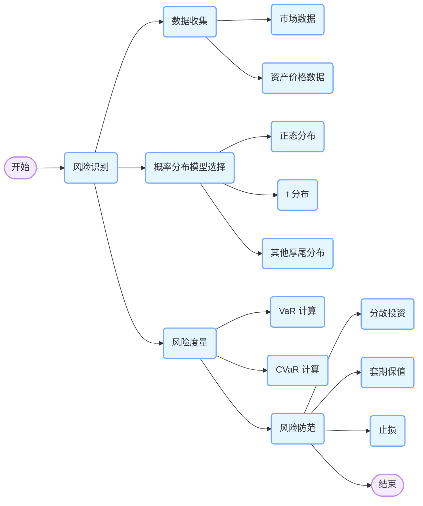

# 尾部风险管理：防范极端市场事件

> 关键词：尾部风险管理、极端市场事件、风险度量、风险防范策略、金融市场

> 摘要：本文聚焦于尾部风险管理，旨在深入探讨如何有效防范极端市场事件带来的风险。首先介绍了尾部风险管理的背景知识，包括目的、预期读者和文档结构等。接着阐述了核心概念及其联系，通过示意图和流程图展示其原理架构。详细讲解了核心算法原理和具体操作步骤，运用 Python 代码进行说明。同时给出了相关数学模型和公式，并举例分析。通过项目实战案例，展示了开发环境搭建、代码实现与解读。探讨了尾部风险管理在实际金融市场中的应用场景，推荐了学习资源、开发工具框架和相关论文著作。最后总结了未来发展趋势与挑战，解答了常见问题，并提供了扩展阅读和参考资料。

## 1. 背景介绍 
### 1.1 目的和范围
在金融市场中，极端市场事件虽然发生的概率较低，但一旦发生，往往会对投资者、金融机构乃至整个经济体系造成巨大的冲击。例如，2008 年的全球金融危机，给全球金融市场带来了灾难性的后果，众多金融机构倒闭，经济陷入衰退。尾部风险管理的目的就是识别、度量和应对这些极端市场事件所带来的风险，帮助投资者和金融机构在复杂多变的市场环境中更好地保护资产、稳定运营。

本文的范围涵盖了尾部风险管理的基本概念、核心算法、数学模型、实际应用案例以及相关的工具和资源推荐等方面。通过全面深入的探讨，为读者提供一个系统的尾部风险管理知识体系。

### 1.2 预期读者
本文的预期读者包括金融行业的从业者，如投资经理、风险分析师、交易员等，他们需要深入了解尾部风险管理的方法和技术，以更好地管理投资组合和控制风险。同时，也适合对金融市场风险感兴趣的学者和研究人员，为他们的学术研究提供参考。此外，对于有一定金融知识基础的个人投资者，本文也能帮助他们提高风险意识，学会运用科学的方法管理投资风险。

### 1.3 文档结构概述
本文共分为十个部分。第一部分是背景介绍，阐述了尾部风险管理的目的、预期读者和文档结构。第二部分介绍核心概念与联系，通过示意图和流程图展示尾部风险管理的原理架构。第三部分讲解核心算法原理和具体操作步骤，并用 Python 代码进行详细说明。第四部分给出相关数学模型和公式，并举例分析。第五部分是项目实战，包括开发环境搭建、代码实现与解读。第六部分探讨尾部风险管理在实际金融市场中的应用场景。第七部分推荐学习资源、开发工具框架和相关论文著作。第八部分总结未来发展趋势与挑战。第九部分是附录，解答常见问题。第十部分提供扩展阅读和参考资料。

### 1.4 术语表
#### 1.4.1 核心术语定义
- **尾部风险**：指在金融市场中，发生极端市场事件的风险。这些极端事件通常处于概率分布的尾部，发生的概率较低，但一旦发生，会对资产价值产生巨大的负面影响。
- **风险度量**：是指对风险进行量化的过程，通过各种指标和方法来衡量风险的大小。常见的风险度量指标包括标准差、VaR（Value at Risk，在险价值）、CVaR（Conditional Value at Risk，条件在险价值）等。
- **极端市场事件**：指金融市场中发生的罕见的、具有重大影响的事件，如股市暴跌、利率大幅波动、汇率急剧变化等。
- **风险防范策略**：为了降低尾部风险而采取的一系列措施，包括分散投资、套期保值、止损等。

#### 1.4.2 相关概念解释
- **概率分布**：描述随机变量取值的概率规律。在金融市场中，资产收益率通常可以用概率分布来表示。常见的概率分布有正态分布、t 分布等。
- **肥尾现象**：指概率分布的尾部比正态分布更厚，即极端事件发生的概率比正态分布所预测的要高。金融市场中的资产收益率往往存在肥尾现象，这意味着极端市场事件发生的可能性更大。
- **风险分散**：通过投资多种不同的资产来降低投资组合的风险。根据现代投资组合理论，不同资产之间的相关性越低，风险分散的效果越好。

#### 1.4.3 缩略词列表
- **VaR**：Value at Risk，在险价值，是一种常用的风险度量指标，表示在一定的置信水平下，投资组合在未来一段时间内可能遭受的最大损失。
- **CVaR**：Conditional Value at Risk，条件在险价值，也称为预期尾部损失，是指在投资组合的损失超过 VaR 的条件下，损失的期望值。
- **ETF**：Exchange Traded Fund，交易型开放式指数基金，是一种在证券交易所上市交易的开放式基金，通常跟踪特定的指数。

## 2. 核心概念与联系 

### 核心概念原理
尾部风险管理的核心在于对极端市场事件的识别、度量和应对。其原理基于对金融市场中资产收益率概率分布的研究。传统的风险管理方法通常假设资产收益率服从正态分布，但实际金融市场中，资产收益率往往存在肥尾现象，即极端事件发生的概率比正态分布所预测的要高。因此，尾部风险管理需要采用更合适的概率分布模型来描述资产收益率，以准确度量尾部风险。

风险度量是尾部风险管理的关键环节。常用的风险度量指标包括 VaR 和 CVaR。VaR 表示在一定的置信水平下，投资组合在未来一段时间内可能遭受的最大损失。例如，在 95%的置信水平下，某投资组合的 1 天 VaR 为 100 万元，表示在未来 1 天内，该投资组合有 95%的可能性损失不超过 100 万元。CVaR 则是在投资组合的损失超过 VaR 的条件下，损失的期望值，它能更全面地反映尾部风险。

风险防范策略是根据风险度量的结果制定的。常见的风险防范策略包括分散投资、套期保值、止损等。分散投资通过投资多种不同的资产来降低投资组合的风险；套期保值则是通过建立相反的头寸来对冲风险；止损是在投资组合的损失达到一定程度时，及时平仓以控制损失。

### 架构的文本示意图
```plaintext
尾部风险管理
|-- 风险识别
|   |-- 数据收集
|   |   |-- 市场数据
|   |   |-- 资产价格数据
|   |-- 概率分布模型选择
|       |-- 正态分布
|       |-- t 分布
|       |-- 其他厚尾分布
|-- 风险度量
|   |-- VaR 计算
|   |-- CVaR 计算
|-- 风险防范
|   |-- 分散投资
|   |-- 套期保值
|   |-- 止损
```

### Mermaid 流程图


## 3. 核心算法原理 & 具体操作步骤 

### VaR 计算原理
VaR 是一种常用的风险度量指标，其计算原理基于资产收益率的概率分布。假设资产收益率 $R$ 服从某种概率分布 $F(R)$，在一定的置信水平 $\alpha$ 下，VaR 可以定义为满足以下条件的损失值 $V$：

$$P(R \leq -V) = 1 - \alpha$$

即资产收益率小于等于 $-V$ 的概率为 $1 - \alpha$。

### 历史模拟法计算 VaR 的 Python 代码实现
```python
import numpy as np

def historical_var(returns, alpha=0.95):
    """
    使用历史模拟法计算 VaR
    :param returns: 资产收益率序列
    :param alpha: 置信水平
    :return: VaR 值
    """
    sorted_returns = np.sort(returns)
    index = int((1 - alpha) * len(sorted_returns))
    var = -sorted_returns[index]
    return var

# 示例数据
returns = np.random.normal(0, 0.01, 1000)  # 生成 1000 个正态分布的收益率数据
var = historical_var(returns, alpha=0.95)
print(f"95% 置信水平下的 VaR: {var}")
```
### 代码解释
1. **函数定义**：`historical_var` 函数接受两个参数，`returns` 是资产收益率序列，`alpha` 是置信水平，默认值为 0.95。
2. **收益率排序**：使用 `np.sort` 函数对收益率序列进行排序。
3. **确定 VaR 位置**：根据置信水平 $\alpha$ 计算出对应的索引 `index`。
4. **计算 VaR**：取排序后收益率序列中索引为 `index` 的值的相反数作为 VaR 值。

### CVaR 计算原理
CVaR 是在投资组合的损失超过 VaR 的条件下，损失的期望值。其计算公式为：

$$CVaR_{\alpha} = E[R | R \leq -VaR_{\alpha}]$$

### 历史模拟法计算 CVaR 的 Python 代码实现
```python
def historical_cvar(returns, alpha=0.95):
    """
    使用历史模拟法计算 CVaR
    :param returns: 资产收益率序列
    :param alpha: 置信水平
    :return: CVaR 值
    """
    sorted_returns = np.sort(returns)
    index = int((1 - alpha) * len(sorted_returns))
    tail_returns = sorted_returns[:index]
    cvar = -np.mean(tail_returns)
    return cvar

# 示例数据
returns = np.random.normal(0, 0.01, 1000)  # 生成 1000 个正态分布的收益率数据
cvar = historical_cvar(returns, alpha=0.95)
print(f"95% 置信水平下的 CVaR: {cvar}")
```
### 代码解释
1. **函数定义**：`historical_cvar` 函数接受两个参数，`returns` 是资产收益率序列，`alpha` 是置信水平，默认值为 0.95。
2. **收益率排序**：使用 `np.sort` 函数对收益率序列进行排序。
3. **确定尾部收益率**：根据置信水平 $\alpha$ 计算出对应的索引 `index`，取排序后收益率序列中前 `index` 个值作为尾部收益率。
4. **计算 CVaR**：计算尾部收益率的平均值，并取其相反数作为 CVaR 值。

## 4. 数学模型和公式 & 详细讲解 & 举例说明 

### 正态分布下的 VaR 计算
假设资产收益率 $R$ 服从正态分布 $N(\mu, \sigma^2)$，其中 $\mu$ 是均值，$\sigma$ 是标准差。在置信水平 $\alpha$ 下，VaR 可以通过以下公式计算：

$$VaR_{\alpha} = -\mu - z_{\alpha} \sigma$$

其中 $z_{\alpha}$ 是标准正态分布的分位数，满足 $P(Z \leq z_{\alpha}) = \alpha$，$Z$ 是标准正态分布随机变量。

#### 举例说明
假设某资产的收益率服从正态分布 $N(0.001, 0.01^2)$，置信水平 $\alpha = 0.95$。首先，查标准正态分布表可得 $z_{0.95} = 1.645$。然后，根据公式计算 VaR：

$$VaR_{0.95} = -0.001 - 1.645 \times 0.01 = -0.01745$$

这意味着在 95%的置信水平下，该资产在未来一段时间内可能遭受的最大损失为 1.745%。

### t 分布下的 VaR 计算
t 分布比正态分布更适合描述金融市场中资产收益率的肥尾现象。假设资产收益率 $R$ 服从自由度为 $v$ 的 t 分布 $t(v, \mu, \sigma^2)$，在置信水平 $\alpha$ 下，VaR 可以通过以下公式计算：

$$VaR_{\alpha} = -\mu - t_{\alpha}(v) \sigma$$

其中 $t_{\alpha}(v)$ 是自由度为 $v$ 的 t 分布的分位数，满足 $P(T \leq t_{\alpha}(v)) = \alpha$，$T$ 是自由度为 $v$ 的 t 分布随机变量。

#### 举例说明
假设某资产的收益率服从自由度为 5 的 t 分布 $t(5, 0.001, 0.01^2)$，置信水平 $\alpha = 0.95$。使用 Python 的 `scipy.stats` 库可以计算 t 分布的分位数：

```python
from scipy.stats import t

v = 5
alpha = 0.95
mu = 0.001
sigma = 0.01

t_alpha = t.ppf(alpha, v)
var = -mu - t_alpha * sigma
print(f"95% 置信水平下的 VaR: {var}")
```

### CVaR 的数学推导
对于正态分布，CVaR 可以通过以下公式计算：

$$CVaR_{\alpha} = -\mu + \frac{\phi(z_{\alpha})}{1 - \alpha} \sigma$$

其中 $\phi(z)$ 是标准正态分布的概率密度函数。

#### 举例说明
继续使用上述正态分布的例子，计算 95% 置信水平下的 CVaR。首先，计算标准正态分布的概率密度函数值 $\phi(z_{0.95})$：

```python
from scipy.stats import norm

z_alpha = norm.ppf(0.95)
phi_z_alpha = norm.pdf(z_alpha)
mu = 0.001
sigma = 0.01
alpha = 0.95

cvar = -mu + (phi_z_alpha / (1 - alpha)) * sigma
print(f"95% 置信水平下的 CVaR: {cvar}")
```

## 5. 项目实战：代码实际案例和详细解释说明 

### 5.1  开发环境搭建
#### 安装 Python
首先，需要安装 Python 环境。可以从 Python 官方网站（https://www.python.org/downloads/）下载适合自己操作系统的 Python 安装包，并按照安装向导进行安装。建议安装 Python 3.7 及以上版本。

#### 安装必要的库
在项目中，需要使用一些 Python 库来进行数据处理、统计分析和绘图等操作。可以使用以下命令安装这些库：

```sh
pip install numpy pandas scipy matplotlib
```

- **numpy**：用于进行数值计算和数组操作。
- **pandas**：用于数据处理和分析。
- **scipy**：提供了丰富的科学计算和统计分析工具。
- **matplotlib**：用于绘制图表和可视化数据。

### 5.2  源代码详细实现和代码解读
#### 数据获取与处理
假设我们要分析某股票的尾部风险，首先需要获取该股票的历史价格数据。可以使用 `pandas-datareader` 库从雅虎财经获取数据：

```python
import pandas as pd
import pandas_datareader.data as web
import numpy as np

# 获取股票数据
start_date = '2020-01-01'
end_date = '2023-01-01'
ticker = 'AAPL'  # 苹果公司股票代码
data = web.DataReader(ticker, 'yahoo', start_date, end_date)

# 计算每日收益率
returns = data['Close'].pct_change().dropna()
```

#### 代码解读
1. **数据获取**：使用 `web.DataReader` 函数从雅虎财经获取苹果公司股票从 2020 年 1 月 1 日到 2023 年 1 月 1 日的历史价格数据。
2. **收益率计算**：使用 `pct_change` 函数计算每日收益率，并使用 `dropna` 函数去除缺失值。

#### 风险度量
接下来，使用历史模拟法计算该股票的 VaR 和 CVaR：

```python
def historical_var(returns, alpha=0.95):
    sorted_returns = np.sort(returns)
    index = int((1 - alpha) * len(sorted_returns))
    var = -sorted_returns[index]
    return var

def historical_cvar(returns, alpha=0.95):
    sorted_returns = np.sort(returns)
    index = int((1 - alpha) * len(sorted_returns))
    tail_returns = sorted_returns[:index]
    cvar = -np.mean(tail_returns)
    return cvar

# 计算 VaR 和 CVaR
var = historical_var(returns, alpha=0.95)
cvar = historical_cvar(returns, alpha=0.95)

print(f"95% 置信水平下的 VaR: {var}")
print(f"95% 置信水平下的 CVaR: {cvar}")
```

#### 代码解读
1. **VaR 计算**：定义 `historical_var` 函数，使用历史模拟法计算 VaR。
2. **CVaR 计算**：定义 `historical_cvar` 函数，使用历史模拟法计算 CVaR。
3. **结果输出**：调用上述函数计算 95% 置信水平下的 VaR 和 CVaR，并输出结果。

#### 可视化分析
最后，使用 `matplotlib` 库绘制收益率的直方图和 VaR、CVaR 的位置：

```python
import matplotlib.pyplot as plt

# 绘制收益率直方图
plt.hist(returns, bins=50, density=True, alpha=0.7)

# 绘制 VaR 和 CVaR 位置
plt.axvline(x=-var, color='r', linestyle='--', label='VaR')
plt.axvline(x=-cvar, color='g', linestyle='--', label='CVaR')

plt.xlabel('Returns')
plt.ylabel('Density')
plt.title('Returns Distribution with VaR and CVaR')
plt.legend()
plt.show()
```

#### 代码解读
1. **直方图绘制**：使用 `plt.hist` 函数绘制收益率的直方图。
2. **VaR 和 CVaR 位置绘制**：使用 `plt.axvline` 函数绘制 VaR 和 CVaR 的位置。
3. **图表设置**：设置图表的坐标轴标签、标题和图例，并使用 `plt.show` 函数显示图表。

### 5.3  代码解读与分析
通过上述代码，我们完成了从数据获取、收益率计算、风险度量到可视化分析的整个流程。从计算结果来看，VaR 和 CVaR 可以帮助我们量化股票投资的尾部风险。在可视化图表中，我们可以直观地看到 VaR 和 CVaR 的位置，以及收益率的分布情况。

需要注意的是，历史模拟法假设未来的收益率分布与过去相同，这在实际应用中可能存在一定的局限性。因此，在进行尾部风险管理时，还需要结合其他方法和模型进行综合分析。

## 6. 实际应用场景 
### 投资组合管理
在投资组合管理中，尾部风险管理至关重要。投资者可以通过计算投资组合的 VaR 和 CVaR，了解投资组合在极端市场事件下的潜在损失。根据风险度量结果，投资者可以调整投资组合的资产配置，选择相关性较低的资产进行分散投资，以降低尾部风险。例如，一个投资组合中既包含股票，又包含债券和黄金等资产，当股票市场出现极端下跌时，债券和黄金可能会起到一定的对冲作用，减少投资组合的损失。

### 金融机构风险管理
金融机构如银行、保险公司等面临着各种风险，包括市场风险、信用风险等。尾部风险管理可以帮助金融机构识别和度量潜在的极端市场事件风险，制定相应的风险防范策略。例如，银行在发放贷款时，可以根据借款人的信用状况和市场环境，计算贷款组合的 VaR 和 CVaR，评估贷款违约的风险。同时，银行可以通过套期保值等手段，降低市场风险对自身资产负债表的影响。

### 保险行业
在保险行业，尾部风险管理用于评估和管理巨灾风险。保险公司需要对可能发生的自然灾害、重大事故等极端事件进行风险评估，计算潜在的赔付金额。通过使用尾部风险管理技术，保险公司可以合理确定保险费率，确保自身在极端事件发生时有足够的资金进行赔付。例如，保险公司可以使用历史数据和概率模型，计算某地区发生地震、洪水等自然灾害的概率和可能造成的损失，从而制定相应的保险产品和风险管理策略。

### 监管合规
金融监管机构要求金融机构进行风险度量和管理，以确保金融体系的稳定。尾部风险管理是监管合规的重要组成部分。监管机构通常会规定金融机构必须计算和报告一定置信水平下的 VaR 和 CVaR 等风险指标，以评估金融机构的风险承受能力。例如，巴塞尔协议对银行的资本充足率提出了要求，银行需要根据自身的风险状况，计算风险加权资产，并确保资本充足率达到规定的标准。

## 7. 工具和资源推荐
### 7.1 学习资源推荐
#### 7.1.1 书籍推荐
- 《风险管理与金融机构》（John C. Hull 著）：本书全面介绍了风险管理的基本概念、方法和技术，包括市场风险、信用风险、操作风险等方面的内容。书中结合了实际案例和金融市场的最新发展，对金融机构的风险管理具有很强的指导意义。
- 《金融时间序列分析》（Ruey S. Tsay 著）：本书系统地介绍了金融时间序列的建模和分析方法，包括 ARIMA 模型、GARCH 模型、Copula 模型等。这些模型在尾部风险管理中具有重要的应用。
- 《期权、期货及其他衍生产品》（John C. Hull 著）：本书是金融衍生品领域的经典教材，介绍了期权、期货、互换等衍生产品的定价和风险管理方法。这些衍生产品可以用于套期保值和风险对冲，是尾部风险管理的重要工具。

#### 7.1.2 在线课程
- Coursera 上的“金融风险管理”课程：该课程由知名大学的教授授课，内容涵盖了市场风险、信用风险、操作风险等方面的风险管理知识和技术。课程采用视频讲解、案例分析和在线作业等形式，帮助学员深入理解和掌握风险管理的方法和技能。
- edX 上的“金融时间序列分析”课程：该课程系统地介绍了金融时间序列的建模和分析方法，包括线性和非线性模型、波动率建模、风险度量等内容。课程注重理论与实践相结合，通过实际案例和编程练习，帮助学员掌握金融时间序列分析的工具和技术。

#### 7.1.3 技术博客和网站
- 量化投资与机器学习（https://www.quantinfo.com/）：该网站提供了丰富的量化投资和机器学习相关的文章和教程，包括风险度量、资产定价、投资组合优化等方面的内容。网站还分享了一些开源的量化投资代码和工具，对尾部风险管理的学习和实践具有很大的帮助。
- 金融界（https://www.jrj.com.cn/）：该网站是国内知名的金融资讯网站，提供了丰富的金融市场新闻、数据和分析报告。通过关注金融界的资讯，投资者可以及时了解市场动态和极端市场事件的发生情况，为尾部风险管理提供参考。

### 7.2 开发工具框架推荐
#### 7.2.1 IDE和编辑器
- PyCharm：是一款专业的 Python 集成开发环境（IDE），具有强大的代码编辑、调试和自动补全功能。PyCharm 支持多种 Python 库和框架，适合用于开发和调试尾部风险管理相关的 Python 代码。
- Jupyter Notebook：是一种交互式的编程环境，支持多种编程语言，包括 Python、R 等。Jupyter Notebook 以笔记本的形式组织代码和文档，方便用户进行数据分析、模型开发和结果展示。在尾部风险管理的研究和实践中，Jupyter Notebook 可以用于数据探索、模型验证和可视化分析等工作。

#### 7.2.2 调试和性能分析工具
- PDB：是 Python 内置的调试器，可以帮助用户定位和解决代码中的错误。通过设置断点、单步执行等功能，PDB 可以让用户深入了解代码的执行过程，找出问题所在。
- cProfile：是 Python 标准库中的性能分析工具，可以帮助用户分析代码的运行时间和性能瓶颈。通过使用 cProfile，用户可以找出代码中耗时较长的部分，并进行优化。

#### 7.2.3 相关框架和库
- NumPy：是 Python 中用于科学计算的基础库，提供了高效的多维数组对象和各种数学函数。在尾部风险管理中，NumPy 可以用于数据处理、矩阵运算和统计分析等工作。
- Pandas：是 Python 中用于数据处理和分析的库，提供了丰富的数据结构和数据操作方法。Pandas 可以方便地读取、处理和分析金融市场数据，如股票价格、收益率等。
- Scikit-learn：是 Python 中用于机器学习的库，提供了各种机器学习算法和工具。在尾部风险管理中，Scikit-learn 可以用于建立风险预测模型、进行聚类分析和分类等工作。

### 7.3 相关论文著作推荐
#### 7.3.1 经典论文
- “Value at Risk: The New Benchmark for Managing Financial Risk”（Philippe Jorion 著）：该论文是 VaR 领域的经典之作，系统地介绍了 VaR 的概念、计算方法和应用。论文对 VaR 的优缺点进行了深入分析，并提出了一些改进和扩展的方法。
- “Conditional Value-at-Risk for General Loss Distributions”（Rockafellar 和 Uryasev 著）：该论文首次提出了 CVaR 的概念，并证明了 CVaR 是一种更有效的风险度量指标。论文还给出了 CVaR 的计算方法和优化模型，为尾部风险管理提供了重要的理论基础。

#### 7.3.2 最新研究成果
- 近年来，随着人工智能和机器学习技术的发展，越来越多的研究将这些技术应用于尾部风险管理。例如，一些研究使用深度学习模型来预测极端市场事件的发生概率，提高风险度量的准确性。另外，一些研究还探索了如何利用大数据和实时数据来进行尾部风险管理，以更好地应对市场的变化。

#### 7.3.3 应用案例分析
- 一些金融机构和研究机构会发布关于尾部风险管理的应用案例分析报告。这些报告通常结合实际的金融市场数据和业务场景，介绍如何使用尾部风险管理技术来识别、度量和应对极端市场事件风险。通过阅读这些应用案例分析报告，读者可以更好地理解尾部风险管理的实际应用和效果。

## 8. 总结：未来发展趋势与挑战
### 未来发展趋势
#### 数据驱动的风险管理
随着金融市场数据的不断丰富和信息技术的发展，数据驱动的风险管理将成为未来的发展趋势。通过收集和分析大量的市场数据、交易数据和宏观经济数据等，利用机器学习和人工智能算法，可以更准确地识别和度量尾部风险。例如，使用深度学习模型对金融市场的文本数据进行情感分析，以预测市场情绪的变化和极端事件的发生概率。

#### 多风险整合管理
金融市场中的风险是相互关联的，单一的风险度量和管理方法可能无法全面反映风险状况。未来，尾部风险管理将朝着多风险整合管理的方向发展，将市场风险、信用风险、操作风险等多种风险纳入统一的风险管理框架中。例如，使用 Copula 模型来描述不同风险之间的相关性，从而更准确地评估投资组合的整体风险。

#### 实时风险管理
在快速变化的金融市场中，实时风险管理变得越来越重要。未来的尾部风险管理系统将具备实时数据处理和分析能力，能够及时监测市场动态和风险变化，实时调整风险防范策略。例如，使用高频交易数据和实时市场行情，实时计算投资组合的 VaR 和 CVaR，并根据风险状况自动执行止损或套期保值操作。

### 挑战
#### 数据质量和可用性
数据是尾部风险管理的基础，但金融市场数据存在噪声、缺失值和异常值等问题，数据质量难以保证。此外，一些关键数据可能受到隐私和保密的限制，获取难度较大。因此，如何提高数据质量和可用性，是尾部风险管理面临的一个重要挑战。

#### 模型不确定性
尾部风险管理通常依赖于各种数学模型和统计方法，但这些模型存在一定的不确定性。例如，不同的概率分布模型对尾部风险的描述可能存在差异，模型参数的估计也可能存在误差。如何评估和控制模型不确定性，提高风险度量的准确性，是需要解决的问题。

#### 监管和合规要求
金融监管机构对尾部风险管理提出了越来越严格的要求，金融机构需要不断满足监管合规的要求。然而，监管政策的变化和更新较快，金融机构需要及时调整风险管理策略和方法，以适应监管要求。同时，不同国家和地区的监管政策存在差异，跨国金融机构需要面对更加复杂的监管环境。

## 9. 附录：常见问题与解答
### 问题 1：VaR 和 CVaR 有什么区别？
VaR 表示在一定的置信水平下，投资组合在未来一段时间内可能遭受的最大损失。它只考虑了损失的上限，没有考虑超过 VaR 的损失情况。而 CVaR 是在投资组合的损失超过 VaR 的条件下，损失的期望值，它能更全面地反映尾部风险。例如，在极端市场事件中，VaR 可能无法准确描述投资组合的实际损失，而 CVaR 可以提供更保守和准确的风险度量。

### 问题 2：历史模拟法有哪些优缺点？
#### 优点
- 简单易懂：历史模拟法不需要假设资产收益率的概率分布，直接使用历史数据进行计算，方法简单直观。
- 不需要参数估计：不需要估计概率分布的参数，避免了参数估计误差带来的影响。
- 考虑了历史数据的实际情况：能够反映历史上发生的极端市场事件，对未来极端事件的预测具有一定的参考价值。

#### 缺点
- 假设未来与过去相同：历史模拟法假设未来的收益率分布与过去相同，这在实际应用中可能存在一定的局限性。如果市场环境发生变化，历史数据可能无法准确反映未来的风险状况。
- 数据依赖性强：计算结果依赖于历史数据的质量和长度。如果历史数据不充分或存在异常值，可能会导致计算结果不准确。
- 无法处理新的市场情况：对于从未在历史数据中出现过的市场情况，历史模拟法无法进行有效的风险评估。

### 问题 3：如何选择合适的概率分布模型？
选择合适的概率分布模型需要考虑以下因素：
- 数据特征：观察资产收益率数据的分布特征，如是否存在肥尾现象、偏态等。如果数据存在肥尾现象，正态分布可能不适合，需要选择更厚尾的分布模型，如 t 分布、GARCH 模型等。
- 模型复杂度：不同的概率分布模型具有不同的复杂度。在选择模型时，需要权衡模型的复杂度和拟合效果。过于复杂的模型可能会导致过拟合，而过于简单的模型可能无法准确描述数据的特征。
- 应用场景：根据具体的应用场景选择合适的模型。例如，在风险度量中，需要选择能够准确度量尾部风险的模型；在资产定价中，需要选择能够反映市场价格变化规律的模型。

### 问题 4：尾部风险管理是否可以完全消除极端市场事件的风险？
尾部风险管理不能完全消除极端市场事件的风险。极端市场事件的发生具有不确定性，很难准确预测和防范。尾部风险管理的目的是识别、度量和应对这些风险，降低极端市场事件对投资组合和金融机构的影响。通过合理的资产配置、风险分散和套期保值等策略，可以在一定程度上降低尾部风险，但无法完全消除风险。

## 10. 扩展阅读 & 参考资料
### 扩展阅读
- 《行为金融学》：行为金融学研究投资者的心理和行为对金融市场的影响。了解行为金融学的知识可以帮助投资者更好地理解市场的非理性行为和极端市场事件的发生原因，从而提高尾部风险管理的能力。
- 《金融工程学》：金融工程学是将工程学的方法和技术应用于金融领域，创造和设计金融产品和风险管理策略。学习金融工程学的知识可以帮助投资者和金融机构开发更有效的尾部风险管理工具和方法。

### 参考资料
- Jorion, P. (2007). Value at Risk: The New Benchmark for Managing Financial Risk. McGraw-Hill.
- Rockafellar, R. T., & Uryasev, S. (2000). Conditional Value-at-Risk for General Loss Distributions. Journal of Banking & Finance, 24(7), 1443-1471.
- Tsay, R. S. (2010). Analysis of Financial Time Series. John Wiley & Sons.

作者：AI天才研究院/AI Genius Institute & 禅与计算机程序设计艺术 /Zen And The Art of Computer Programming