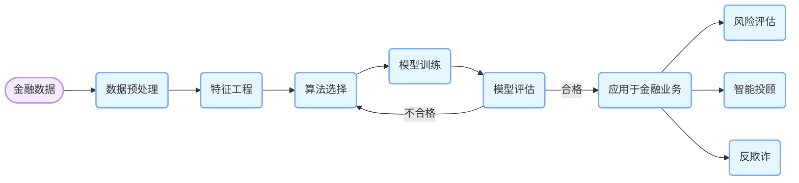

# 展望金融AI应用的未来发展趋势与挑战

> 关键词：金融AI、未来发展趋势、挑战、应用场景、技术创新

> 摘要：本文深入探讨了金融AI应用的相关内容，旨在剖析其未来的发展趋势以及面临的挑战。首先介绍了金融AI的背景知识，包括目的范围、预期读者、文档结构和术语表等。接着阐述了金融AI的核心概念、算法原理、数学模型等理论基础。通过项目实战案例展示了金融AI在实际中的应用和代码实现。分析了金融AI在多个场景中的实际应用，推荐了相关的学习资源、开发工具和论文著作。最后总结了金融AI未来的发展趋势和挑战，并对常见问题进行了解答，提供了扩展阅读和参考资料，帮助读者全面了解金融AI应用的现状和未来走向。

## 1. 背景介绍 
### 1.1 目的和范围
金融行业正处于快速变革的时期，人工智能（AI）技术的融入为其带来了巨大的机遇和挑战。本文的目的在于全面分析金融AI应用的未来发展趋势，深入探讨其可能面临的挑战，为金融机构、科技企业以及相关从业者提供有价值的参考。范围涵盖了金融AI在银行、证券、保险等多个细分领域的应用，以及与之相关的技术、市场、监管等方面。

### 1.2 预期读者
本文的预期读者包括金融行业的从业者，如银行家、投资经理、保险精算师等，他们可以通过本文了解如何利用AI技术提升业务效率和竞争力；科技企业的开发者和架构师，能够从中获取金融AI领域的技术趋势和应用场景；学术界的研究人员可以作为研究金融AI的参考资料；同时，对金融科技感兴趣的普通读者也能通过本文初步了解金融AI的相关知识。

### 1.3 文档结构概述
本文将按照以下结构展开：首先介绍金融AI的背景知识，包括术语和相关概念；接着阐述金融AI的核心概念、算法原理和数学模型；通过实际项目案例展示金融AI的代码实现和应用；分析金融AI在不同场景中的实际应用；推荐学习资源、开发工具和相关论文著作；最后总结金融AI的未来发展趋势和挑战，并解答常见问题，提供扩展阅读和参考资料。

### 1.4 术语表
#### 1.4.1 核心术语定义
- **金融AI（Financial AI）**：将人工智能技术应用于金融领域，通过机器学习、深度学习、自然语言处理等技术，实现金融业务的自动化、智能化和高效化。
- **机器学习（Machine Learning）**：让计算机通过数据学习模式和规律，从而做出预测和决策的技术。
- **深度学习（Deep Learning）**：机器学习的一个分支，通过构建多层神经网络来学习数据的深层次特征。
- **自然语言处理（Natural Language Processing）**：使计算机能够理解、处理和生成人类语言的技术。
- **风险评估（Risk Assessment）**：对金融业务中的各种风险进行评估和量化的过程。

#### 1.4.2 相关概念解释
- **智能投顾（Robo - Advisor）**：利用人工智能算法为客户提供个性化的投资建议和资产配置方案的服务。
- **信用评分（Credit Scoring）**：根据客户的信用历史、财务状况等信息，对其信用风险进行评估并给出评分的过程。
- **反欺诈（Anti - Fraud）**：利用技术手段识别和防范金融交易中的欺诈行为。

#### 1.4.3 缩略词列表
- **AI（Artificial Intelligence）**：人工智能
- **ML（Machine Learning）**：机器学习
- **DL（Deep Learning）**：深度学习
- **NLP（Natural Language Processing）**：自然语言处理

## 2. 核心概念与联系 
### 2.1 核心概念原理
金融AI的核心在于利用人工智能技术解决金融领域的各种问题。机器学习是金融AI的基础，它通过对大量金融数据的学习，发现数据中的模式和规律，从而实现预测和决策。例如，在信用评分中，机器学习算法可以根据客户的年龄、收入、信用历史等特征，预测客户的违约概率。

深度学习则进一步提升了金融AI的能力。深度学习模型，如卷积神经网络（CNN）和循环神经网络（RNN），能够自动提取数据的深层次特征，在处理复杂的金融数据，如图像化的财务报表、时间序列的股票价格等方面具有优势。

自然语言处理技术在金融AI中也有广泛应用。它可以处理金融新闻、研报、合同等文本数据，帮助金融从业者快速获取信息、进行情感分析和信息提取。

### 2.2 架构的文本示意图
金融AI的架构可以分为数据层、算法层和应用层。
- **数据层**：包括各种金融数据，如交易数据、客户信息、市场数据等。这些数据可以来自金融机构内部的数据库，也可以从外部数据源获取。
- **算法层**：包含各种机器学习和深度学习算法，如决策树、支持向量机、神经网络等。这些算法用于对数据进行处理和分析，挖掘数据中的价值。
- **应用层**：将算法层的结果应用于具体的金融业务，如风险评估、智能投顾、反欺诈等。

### 2.3 Mermaid流程图


## 3. 核心算法原理 & 具体操作步骤 
### 3.1 逻辑回归算法原理
逻辑回归是一种常用的分类算法，在金融风险评估中应用广泛。它的基本原理是通过对输入特征进行线性组合，然后通过逻辑函数将线性组合的结果映射到[0, 1]区间，得到样本属于某一类别的概率。

逻辑函数的表达式为：
$$\sigma(z)=\frac{1}{1 + e^{-z}}$$
其中，$z$ 是输入特征的线性组合：
$$z = \theta_0+\theta_1x_1+\theta_2x_2+\cdots+\theta_nx_n$$
$\theta$ 是模型的参数，$x$ 是输入特征。

### 3.2 Python源代码实现
```python
import numpy as np
from sklearn.linear_model import LogisticRegression
from sklearn.model_selection import train_test_split
from sklearn.metrics import accuracy_score

# 生成示例数据
np.random.seed(0)
X = np.random.randn(100, 2)
y = (X[:, 0] + X[:, 1] > 0).astype(int)

# 划分训练集和测试集
X_train, X_test, y_train, y_test = train_test_split(X, y, test_size=0.2, random_state=42)

# 创建逻辑回归模型
model = LogisticRegression()

# 训练模型
model.fit(X_train, y_train)

# 预测
y_pred = model.predict(X_test)

# 评估模型
accuracy = accuracy_score(y_test, y_pred)
print(f"模型准确率: {accuracy}")
```
### 3.3 具体操作步骤
1. **数据准备**：收集和整理金融数据，包括输入特征和对应的标签。
2. **数据预处理**：对数据进行清洗、归一化等处理，以提高模型的性能。
3. **划分数据集**：将数据划分为训练集和测试集，通常按照80:20或70:30的比例划分。
4. **模型选择**：选择合适的算法，如逻辑回归。
5. **模型训练**：使用训练集对模型进行训练，调整模型的参数。
6. **模型评估**：使用测试集对训练好的模型进行评估，计算评估指标，如准确率、召回率等。
7. **模型应用**：将评估合格的模型应用于实际的金融业务中。

## 4. 数学模型和公式 & 详细讲解 & 举例说明 
### 4.1 线性回归模型
线性回归是一种用于预测连续变量的模型，其数学表达式为：
$$y = \theta_0+\theta_1x_1+\theta_2x_2+\cdots+\theta_nx_n+\epsilon$$
其中，$y$ 是预测值，$x$ 是输入特征，$\theta$ 是模型的参数，$\epsilon$ 是误差项。

为了求解模型的参数 $\theta$，通常使用最小二乘法，即最小化预测值与真实值之间的平方误差和：
$$J(\theta)=\frac{1}{2m}\sum_{i = 1}^{m}(h_{\theta}(x^{(i)})-y^{(i)})^2$$
其中，$m$ 是样本数量，$h_{\theta}(x)$ 是预测函数。

### 4.2 举例说明
假设我们要预测股票的价格，我们可以选择一些相关的特征，如公司的财务指标、市场指数等。设 $x_1$ 为公司的净利润，$x_2$ 为市场指数，$y$ 为股票价格。我们可以建立线性回归模型：
$$y=\theta_0+\theta_1x_1+\theta_2x_2$$
通过收集历史数据，使用最小二乘法求解 $\theta_0$、$\theta_1$ 和 $\theta_2$ 的值，然后就可以根据新的 $x_1$ 和 $x_2$ 值预测股票价格。

### 4.3 神经网络模型
神经网络是一种强大的机器学习模型，它由多个神经元组成的层构成。一个简单的神经网络模型可以表示为：
$$h_{\theta}(x)=g(\theta^{(2)}g(\theta^{(1)}x))$$
其中，$g$ 是激活函数，如 sigmoid 函数或 ReLU 函数，$\theta^{(1)}$ 和 $\theta^{(2)}$ 是不同层的权重矩阵。

在训练神经网络时，通常使用反向传播算法来更新权重矩阵，以最小化损失函数。

## 5. 项目实战：代码实际案例和详细解释说明 
### 5.1 开发环境搭建
- **操作系统**：推荐使用 Linux 或 macOS 系统，也可以使用 Windows 系统。
- **编程语言**：Python 是金融AI开发的首选语言，因为它有丰富的机器学习和数据分析库。
- **开发工具**：推荐使用 Anaconda 来管理 Python 环境，使用 Jupyter Notebook 进行代码开发和调试。
- **安装必要的库**：使用以下命令安装必要的库：
```bash
pip install numpy pandas scikit-learn tensorflow keras
```

### 5.2 源代码详细实现和代码解读
```python
import pandas as pd
import numpy as np
from sklearn.model_selection import train_test_split
from sklearn.ensemble import RandomForestClassifier
from sklearn.metrics import classification_report

# 读取数据
data = pd.read_csv('credit_data.csv')

# 数据预处理
X = data.drop('default', axis=1)
y = data['default']

# 划分训练集和测试集
X_train, X_test, y_train, y_test = train_test_split(X, y, test_size=0.2, random_state=42)

# 创建随机森林分类器
model = RandomForestClassifier(n_estimators=100, random_state=42)

# 训练模型
model.fit(X_train, y_train)

# 预测
y_pred = model.predict(X_test)

# 评估模型
print(classification_report(y_test, y_pred))
```
### 5.3 代码解读与分析
1. **数据读取**：使用 `pandas` 库读取存储在 `credit_data.csv` 中的信用数据。
2. **数据预处理**：将特征和标签分离，`X` 是特征矩阵，`y` 是标签向量。
3. **划分数据集**：使用 `train_test_split` 函数将数据划分为训练集和测试集，测试集占比为 20%。
4. **模型创建**：创建一个随机森林分类器，设置树的数量为 100。
5. **模型训练**：使用训练集对模型进行训练。
6. **模型预测**：使用训练好的模型对测试集进行预测。
7. **模型评估**：使用 `classification_report` 函数输出模型的评估报告，包括准确率、召回率、F1 值等指标。

## 6. 实际应用场景 
### 6.1 银行领域
- **风险评估**：银行可以利用金融AI技术对贷款申请人的信用风险进行评估。通过分析申请人的信用历史、收入情况、负债情况等多维度数据，使用机器学习模型预测申请人的违约概率，从而决定是否批准贷款以及贷款的额度和利率。
- **客户服务**：智能客服系统可以使用自然语言处理技术理解客户的问题，并提供准确的回答和解决方案。同时，还可以根据客户的历史行为和偏好，提供个性化的服务推荐。

### 6.2 证券领域
- **智能投顾**：为投资者提供个性化的投资建议和资产配置方案。通过分析投资者的风险承受能力、投资目标、资产状况等因素，结合市场数据和金融模型，为投资者生成最优的投资组合。
- **市场预测**：利用机器学习和深度学习模型对股票价格、市场走势等进行预测。通过分析历史数据、新闻舆情、宏观经济指标等多源数据，挖掘市场的潜在规律和趋势。

### 6.3 保险领域
- **保险定价**：根据客户的风险特征，如年龄、性别、健康状况、职业等，使用数据分析和机器学习算法来确定保险产品的价格。这样可以实现更精准的定价，提高保险公司的风险控制能力。
- **理赔欺诈检测**：通过对理赔申请数据的分析，使用异常检测算法识别可能的欺诈行为。例如，分析理赔申请的时间、金额、理赔原因等信息，判断是否存在欺诈嫌疑。

## 7. 工具和资源推荐
### 7.1 学习资源推荐
#### 7.1.1 书籍推荐
- 《机器学习》（周志华）：全面介绍了机器学习的基本概念、算法和应用，是机器学习领域的经典教材。
- 《深度学习》（Ian Goodfellow、Yoshua Bengio 和 Aaron Courville）：深入探讨了深度学习的理论和实践，适合有一定机器学习基础的读者。
- 《Python 金融数据分析与挖掘实战》：结合 Python 语言和金融数据，介绍了金融数据分析和挖掘的方法和技巧。

#### 7.1.2 在线课程
- Coursera 上的《机器学习》课程（Andrew Ng 教授）：是一门非常经典的机器学习入门课程，涵盖了机器学习的基本算法和应用。
- edX 上的《深度学习》课程：由知名学者和专家授课，深入讲解深度学习的原理和实践。
- 网易云课堂上的《金融科技实战营》：结合金融业务场景，介绍金融AI的应用和开发。

#### 7.1.3 技术博客和网站
- Towards Data Science：是一个专注于数据科学和机器学习的博客平台，有很多优秀的技术文章和案例分享。
- Kaggle：是一个数据科学竞赛平台，上面有很多金融相关的数据集和竞赛项目，可以通过参与竞赛来提高自己的技能。
- 金融界网站：提供金融市场的实时数据、新闻资讯和分析报告，有助于了解金融行业的动态。

### 7.2 开发工具框架推荐
#### 7.2.1 IDE和编辑器
- PyCharm：是一款专业的 Python 集成开发环境，具有代码自动补全、调试、版本控制等功能，适合大型项目的开发。
- Jupyter Notebook：是一个交互式的开发环境，支持代码、文本、图像等多种元素的混合展示，适合数据探索和模型开发。
- Visual Studio Code：是一款轻量级的代码编辑器，支持多种编程语言和插件扩展，具有良好的用户体验。

#### 7.2.2 调试和性能分析工具
- TensorBoard：是 TensorFlow 提供的可视化工具，可以用于监控模型的训练过程、分析模型的性能指标。
- Scikit - learn 中的 `cross_val_score` 函数：可以用于交叉验证模型的性能，帮助选择最优的模型参数。
- Profiler：Python 自带的性能分析工具，可以分析代码的运行时间和内存使用情况，找出性能瓶颈。

#### 7.2.3 相关框架和库
- TensorFlow：是一个开源的深度学习框架，具有强大的计算能力和广泛的应用场景。
- PyTorch：是另一个流行的深度学习框架，以其简洁的 API 和动态计算图而受到开发者的喜爱。
- Scikit - learn：是一个常用的机器学习库，提供了丰富的机器学习算法和工具，如分类、回归、聚类等。

### 7.3 相关论文著作推荐
#### 7.3.1 经典论文
- 《A Mathematical Theory of Communication》（Claude E. Shannon）：奠定了信息论的基础，对机器学习和数据处理有重要的影响。
- 《Gradient - Based Learning Applied to Document Recognition》（Yann LeCun、Léon Bottou、Yoshua Bengio 和 Patrick Haffner）：介绍了卷积神经网络在手写字符识别中的应用，是深度学习领域的经典论文。

#### 7.3.2 最新研究成果
- 可以关注顶级学术会议，如 NeurIPS（神经信息处理系统大会）、ICML（国际机器学习会议）、KDD（知识发现与数据挖掘会议）等，这些会议上会发表很多关于金融AI的最新研究成果。

#### 7.3.3 应用案例分析
- 一些金融机构和科技企业会发布关于金融AI应用的案例分析报告，可以通过他们的官方网站或行业媒体获取这些报告，了解实际应用中的经验和教训。

## 8. 总结：未来发展趋势与挑战
### 8.1 未来发展趋势
- **技术融合**：金融AI将与区块链、物联网、云计算等技术深度融合。例如，区块链技术可以提高金融数据的安全性和透明度，物联网可以提供更多的金融场景数据，云计算可以提供强大的计算能力支持。
- **个性化服务**：随着数据的不断丰富和算法的不断优化，金融AI将能够为客户提供更加个性化的金融服务。例如，智能投顾可以根据客户的实时需求和市场变化，动态调整投资组合。
- **监管科技**：金融监管机构将越来越多地利用AI技术来加强对金融市场的监管。例如，通过机器学习算法监测金融交易中的异常行为，防范金融风险。

### 8.2 挑战
- **数据隐私和安全**：金融数据包含大量的敏感信息，如客户的个人信息、财务信息等。如何保护这些数据的隐私和安全，防止数据泄露和滥用，是金融AI面临的重要挑战。
- **算法可解释性**：一些深度学习模型，如神经网络，是黑盒模型，其决策过程难以解释。在金融领域，监管机构和客户通常需要了解模型的决策依据，因此提高算法的可解释性是一个亟待解决的问题。
- **人才短缺**：金融AI需要既懂金融业务又懂人工智能技术的复合型人才。目前，这类人才相对短缺，限制了金融AI的发展。

## 9. 附录：常见问题与解答
### 9.1 金融AI会取代金融从业者吗？
金融AI不会完全取代金融从业者，但会对金融行业的职业结构产生影响。一些重复性、规律性的工作可能会被自动化和智能化的系统所取代，如数据录入、简单的风险评估等。然而，金融从业者的专业知识、经验和判断力仍然是不可替代的，例如在复杂的金融决策、客户关系管理等方面。金融从业者可以通过学习和掌握AI技术，提升自己的竞争力，与金融AI协同工作。

### 9.2 如何评估金融AI模型的性能？
评估金融AI模型的性能可以从多个方面进行，常见的指标包括准确率、召回率、F1 值、均方误差（MSE）、均方根误差（RMSE）等。对于分类问题，准确率、召回率和 F1 值可以衡量模型对不同类别的分类能力；对于回归问题，MSE 和 RMSE 可以衡量模型的预测误差。此外，还可以使用交叉验证、ROC 曲线、AUC 值等方法来综合评估模型的性能。

### 9.3 金融AI在实际应用中面临哪些法律和监管问题？
金融AI在实际应用中面临着一系列法律和监管问题。例如，数据的收集和使用需要遵守相关的法律法规，确保数据的合法性和合规性；模型的决策过程需要具有可解释性，以满足监管机构和客户的要求；金融AI系统的安全性需要得到保障，防止黑客攻击和数据泄露。此外，金融监管机构还会对金融AI的应用进行监督和管理，确保其不会对金融市场的稳定和公平造成影响。

## 10. 扩展阅读 & 参考资料
### 10.1 扩展阅读
- 《金融科技前沿：人工智能与金融创新》：深入探讨了人工智能在金融领域的应用和创新，介绍了最新的研究成果和实践案例。
- 《大数据时代的金融风险管理》：结合大数据和AI技术，介绍了金融风险管理的新方法和新趋势。

### 10.2 参考资料
- 中国人民银行发布的金融科技相关政策文件。
- 国际金融机构，如国际货币基金组织（IMF）、世界银行等发布的关于金融科技的研究报告。

作者：AI天才研究院/AI Genius Institute & 禅与计算机程序设计艺术 /Zen And The Art of Computer Programming