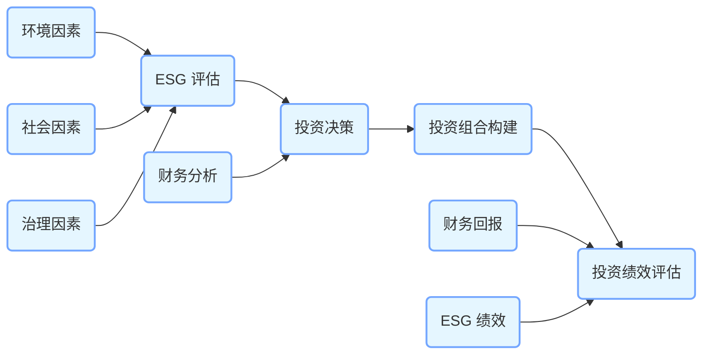

# 巴菲特 - 芒格的 ESG 投资观：平衡利润和社会责任

> 关键词：巴菲特；芒格；ESG 投资观；利润；社会责任

> 摘要：本文深入探讨了巴菲特 - 芒格的 ESG 投资观，旨在分析如何在投资过程中平衡利润和社会责任。首先介绍了相关背景，包括目的范围、预期读者等内容。接着阐述了 ESG 投资的核心概念与联系，通过原理、架构文本示意图以及 Mermaid 流程图进行清晰展示。详细讲解了 ESG 投资中可能涉及的核心算法原理及具体操作步骤，并给出 Python 源代码示例。对 ESG 投资的数学模型和公式进行了推导与举例说明。通过项目实战案例，从开发环境搭建到源代码实现与解读进行了全面分析。列举了 ESG 投资的实际应用场景，推荐了学习资源、开发工具框架以及相关论文著作。最后总结了 ESG 投资的未来发展趋势与挑战，并提供常见问题解答和扩展阅读参考资料，帮助读者全面理解巴菲特 - 芒格的 ESG 投资观。

## 1. 背景介绍 

### 1.1 目的和范围
在当今全球经济发展的大背景下，企业的经营活动不仅要追求利润最大化，还需要承担相应的社会责任。ESG（环境、社会和治理）投资理念应运而生，它强调在投资决策中综合考虑企业在环境、社会和治理方面的表现。巴菲特和芒格作为投资界的传奇人物，他们的投资理念一直备受关注。本文的目的是深入研究巴菲特 - 芒格的 ESG 投资观，探讨他们如何在追求投资利润的同时兼顾社会责任。范围涵盖了 ESG 投资的基本概念、核心算法、数学模型、实际应用案例等多个方面，旨在为投资者提供全面而深入的 ESG 投资知识和指导。

### 1.2 预期读者
本文的预期读者主要包括以下几类人群：
- **投资者**：无论是个人投资者还是机构投资者，都希望在投资过程中做出更明智的决策，了解巴菲特 - 芒格的 ESG 投资观可以帮助他们在追求利润的同时考虑社会责任因素，实现可持续投资。
- **企业管理者**：企业管理者需要了解市场对企业 ESG 表现的关注程度，以及如何通过改善 ESG 绩效来提升企业的竞争力和长期价值。
- **金融从业者**：如分析师、基金经理等，他们需要深入研究 ESG 投资策略，为客户提供专业的投资建议。
- **研究人员**：对投资理论、社会责任等领域感兴趣的研究人员，可以通过本文深入了解巴菲特 - 芒格的 ESG 投资观，为相关研究提供参考。

### 1.3 文档结构概述
本文将按照以下结构进行组织：
- **核心概念与联系**：介绍 ESG 投资的核心概念，包括环境、社会和治理三个方面的具体含义，以及它们之间的相互关系。通过文本示意图和 Mermaid 流程图展示 ESG 投资的原理和架构。
- **核心算法原理 & 具体操作步骤**：讲解 ESG 投资中可能涉及的核心算法，如 ESG 评分算法等，并给出具体的操作步骤。通过 Python 源代码详细阐述算法的实现过程。
- **数学模型和公式 & 详细讲解 & 举例说明**：推导 ESG 投资中的数学模型和公式，如投资组合优化模型等，并通过具体的例子进行说明。
- **项目实战：代码实际案例和详细解释说明**：通过一个实际的 ESG 投资项目案例，介绍开发环境的搭建、源代码的实现和解读，帮助读者更好地理解 ESG 投资的实际应用。
- **实际应用场景**：列举 ESG 投资在不同领域的实际应用场景，如能源、金融、制造业等。
- **工具和资源推荐**：推荐学习 ESG 投资的相关资源，包括书籍、在线课程、技术博客和网站等；介绍开发 ESG 投资系统可能用到的工具和框架，如 IDE 和编辑器、调试和性能分析工具、相关框架和库等；推荐相关的论文著作，包括经典论文、最新研究成果和应用案例分析等。
- **总结：未来发展趋势与挑战**：总结 ESG 投资的发展趋势，分析未来可能面临的挑战。
- **附录：常见问题与解答**：提供关于 ESG 投资的常见问题及解答，帮助读者解决在学习和实践过程中遇到的问题。
- **扩展阅读 & 参考资料**：列出扩展阅读的相关资料和参考书目，方便读者进一步深入研究。

### 1.4 术语表
#### 1.4.1 核心术语定义
- **ESG 投资**：指在投资决策过程中，除了考虑传统的财务因素外，还综合考虑企业在环境（Environmental）、社会（Social）和治理（Governance）方面的表现，以实现长期可持续的投资回报。
- **环境（Environmental）**：主要涉及企业在环境保护方面的表现，如气候变化应对、资源利用效率、污染防治等。
- **社会（Social）**：关注企业与员工、客户、社区等利益相关者之间的关系，包括员工权益保护、产品质量与安全、社区发展等。
- **治理（Governance）**：强调企业的治理结构和管理水平，如董事会独立性、高管薪酬政策、信息披露透明度等。
- **ESG 评分**：是对企业在环境、社会和治理方面表现的综合评估得分，用于衡量企业的 ESG 绩效。

#### 1.4.2 相关概念解释
- **可持续投资**：与 ESG 投资密切相关，强调投资活动不仅要追求经济回报，还要考虑对环境和社会的长期影响，以实现经济、环境和社会的可持续发展。
- **社会责任投资（SRI）**：是 ESG 投资的一种早期形式，更侧重于筛选出符合特定社会责任标准的投资标的，如避免投资于烟草、武器等行业。
- **影响力投资**：旨在通过投资产生积极的社会和环境影响，同时获得合理的财务回报，是 ESG 投资的一种更高层次的实践。

#### 1.4.3 缩略词列表
- **ESG**：Environmental, Social and Governance（环境、社会和治理）
- **SRI**：Socially Responsible Investment（社会责任投资）

## 2. 核心概念与联系 
### 核心概念原理
ESG 投资的核心原理是认为企业的环境、社会和治理表现与企业的长期财务绩效密切相关。从环境方面来看，注重环境保护和可持续发展的企业能够更好地应对气候变化、资源短缺等挑战，降低运营风险，提高资源利用效率，从而提升企业的竞争力。例如，一家积极采用清洁能源的企业，不仅可以减少对传统化石能源的依赖，降低能源成本，还可以避免因环境法规变化而面临的潜在罚款和声誉损失。

在社会方面，良好的社会表现有助于企业建立良好的品牌形象，吸引优秀人才，提高员工满意度和忠诚度，增强客户信任。例如，一家重视员工权益保护和社区发展的企业，能够营造积极的企业文化，提高员工的工作积极性和创造力，同时也能赢得社区的支持和认可，为企业的长期发展创造有利条件。

治理方面，健全的治理结构和有效的管理机制是企业稳定运营和可持续发展的基础。董事会的独立性、高管薪酬政策的合理性、信息披露的透明度等因素，都直接影响着企业的决策质量和投资者的信心。例如，一家治理良好的企业能够更好地防范内部腐败和利益冲突，提高决策的科学性和公正性，从而保障股东的利益。

### 架构文本示意图
```plaintext
ESG 投资架构
|-- 环境（Environmental）
|   |-- 气候变化应对
|   |-- 资源利用效率
|   |-- 污染防治
|-- 社会（Social）
|   |-- 员工权益保护
|   |-- 产品质量与安全
|   |-- 社区发展
|-- 治理（Governance）
|   |-- 董事会独立性
|   |-- 高管薪酬政策
|   |-- 信息披露透明度
|-- 投资决策
|   |-- 财务分析
|   |-- ESG 评估
|   |-- 综合考虑
|-- 投资组合构建
|   |-- 资产配置
|   |-- 风险控制
|-- 投资绩效评估
|   |-- 财务回报
|   |-- ESG 绩效
```

### Mermaid 流程图


## 3. 核心算法原理 & 具体操作步骤 
### ESG 评分算法原理
ESG 评分算法的核心是综合考虑企业在环境、社会和治理三个方面的多个指标，对企业的 ESG 表现进行量化评估。常见的 ESG 评分算法采用加权平均法，即将每个指标的得分乘以其对应的权重，然后将所有指标的加权得分相加，得到企业的 ESG 总得分。

### 具体操作步骤
1. **指标选取**：根据 ESG 投资的目标和重点，选取合适的环境、社会和治理指标。例如，环境指标可以包括温室气体排放、能源消耗、水资源利用等；社会指标可以包括员工满意度、劳动纠纷发生率、社区捐赠等；治理指标可以包括董事会成员的独立性、高管薪酬与绩效的挂钩程度等。
2. **数据收集**：通过各种渠道收集企业的 ESG 数据，如企业年报、社会责任报告、政府监管部门发布的数据、第三方研究机构的报告等。
3. **指标得分计算**：根据收集到的数据，对每个指标进行评分。评分方法可以采用定性与定量相结合的方式，例如，对于温室气体排放指标，可以根据企业的排放强度与行业平均水平进行比较，给出相应的得分。
4. **权重确定**：确定每个指标的权重，权重的确定可以根据投资机构的偏好和重点进行调整。例如，对于注重环境保护的投资机构，可以适当提高环境指标的权重。
5. **ESG 总得分计算**：将每个指标的得分乘以其对应的权重，然后将所有指标的加权得分相加，得到企业的 ESG 总得分。

### Python 源代码实现
```python
import pandas as pd

# 定义指标及其权重
esg_metrics = {
    '环境指标1': 0.2,
    '环境指标2': 0.1,
    '社会指标1': 0.2,
    '社会指标2': 0.1,
    '治理指标1': 0.2,
    '治理指标2': 0.2
}

# 示例企业 ESG 数据
company_data = {
    '环境指标1': 80,
    '环境指标2': 70,
    '社会指标1': 90,
    '社会指标2': 85,
    '治理指标1': 75,
    '治理指标2': 80
}

# 计算 ESG 总得分
def calculate_esg_score(data, metrics):
    total_score = 0
    for metric, weight in metrics.items():
        score = data.get(metric, 0)
        total_score += score * weight
    return total_score

# 调用函数计算 ESG 总得分
esg_score = calculate_esg_score(company_data, esg_metrics)
print(f"企业的 ESG 总得分: {esg_score}")
```

### 代码解释
1. **指标及其权重定义**：通过字典 `esg_metrics` 定义了各个 ESG 指标及其对应的权重。
2. **示例企业 ESG 数据**：通过字典 `company_data` 存储了示例企业的 ESG 数据。
3. **ESG 总得分计算函数**：定义了函数 `calculate_esg_score`，该函数接受企业的 ESG 数据和指标权重作为输入，通过遍历每个指标，将其得分乘以权重并累加，最终得到企业的 ESG 总得分。
4. **调用函数计算 ESG 总得分**：调用 `calculate_esg_score` 函数，传入示例企业的 ESG 数据和指标权重，计算并打印企业的 ESG 总得分。

## 4. 数学模型和公式 & 详细讲解 & 举例说明 
### ESG 投资组合优化模型
在 ESG 投资中，投资者希望在追求一定的财务回报的同时，最大化投资组合的 ESG 绩效。可以使用均值 - 方差优化模型的扩展形式来实现这一目标。

#### 数学模型
假设我们有 $n$ 个资产，投资组合的权重向量为 $\mathbf{w} = [w_1, w_2, \cdots, w_n]^T$，其中 $\sum_{i=1}^{n} w_i = 1$ 且 $w_i \geq 0$。资产的预期收益率向量为 $\mathbf{\mu} = [\mu_1, \mu_2, \cdots, \mu_n]^T$，资产收益率的协方差矩阵为 $\mathbf{\Sigma}$。每个资产的 ESG 得分向量为 $\mathbf{s} = [s_1, s_2, \cdots, s_n]^T$。

投资组合的预期收益率为 $R_p = \mathbf{w}^T \mathbf{\mu}$，投资组合的方差为 $\sigma_p^2 = \mathbf{w}^T \mathbf{\Sigma} \mathbf{w}$，投资组合的 ESG 得分可以表示为 $S_p = \mathbf{w}^T \mathbf{s}$。

我们的目标是在给定预期收益率 $R_0$ 的约束下，最大化投资组合的 ESG 得分，同时控制投资组合的风险。数学模型可以表示为：

$$
\begin{aligned}
\max_{\mathbf{w}} &\quad S_p = \mathbf{w}^T \mathbf{s} \\
\text{s.t.} &\quad \mathbf{w}^T \mathbf{\mu} = R_0 \\
&\quad \mathbf{w}^T \mathbf{\Sigma} \mathbf{w} \leq \sigma_0^2 \\
&\quad \sum_{i=1}^{n} w_i = 1 \\
&\quad w_i \geq 0, \quad i = 1, 2, \cdots, n
\end{aligned}
$$

其中，$\sigma_0^2$ 是允许的最大投资组合方差。

#### 详细讲解
- **目标函数**：最大化投资组合的 ESG 得分 $S_p$，表示我们希望在满足预期收益率和风险约束的前提下，选择 ESG 表现最好的投资组合。
- **约束条件**：
  - $\mathbf{w}^T \mathbf{\mu} = R_0$：保证投资组合的预期收益率达到给定的目标 $R_0$。
  - $\mathbf{w}^T \mathbf{\Sigma} \mathbf{w} \leq \sigma_0^2$：控制投资组合的风险，使其不超过允许的最大方差 $\sigma_0^2$。
  - $\sum_{i=1}^{n} w_i = 1$：保证投资组合的权重之和为 1，即所有资金都被投资。
  - $w_i \geq 0, \quad i = 1, 2, \cdots, n$：表示不允许卖空资产。

#### 举例说明
假设我们有三个资产，其预期收益率分别为 $\mu_1 = 0.1$，$\mu_2 = 0.12$，$\mu_3 = 0.15$，资产收益率的协方差矩阵为：

$$
\mathbf{\Sigma} = \begin{bmatrix}
0.04 & 0.01 & 0.02 \\
0.01 & 0.09 & 0.03 \\
0.02 & 0.03 & 0.16
\end{bmatrix}
$$

每个资产的 ESG 得分分别为 $s_1 = 70$，$s_2 = 80$，$s_3 = 90$。我们希望投资组合的预期收益率达到 $R_0 = 0.13$，允许的最大方差为 $\sigma_0^2 = 0.05$。

我们可以使用 Python 的 `cvxpy` 库来求解这个优化问题：

```python
import cvxpy as cp
import numpy as np

# 资产数量
n = 3

# 预期收益率向量
mu = np.array([0.1, 0.12, 0.15])

# 协方差矩阵
Sigma = np.array([[0.04, 0.01, 0.02],
                  [0.01, 0.09, 0.03],
                  [0.02, 0.03, 0.16]])

# ESG 得分向量
s = np.array([70, 80, 90])

# 目标预期收益率
R0 = 0.13

# 允许的最大方差
sigma0_squared = 0.05

# 定义决策变量
w = cp.Variable(n)

# 定义目标函数
objective = cp.Maximize(w.T @ s)

# 定义约束条件
constraints = [
    w.T @ mu == R0,
    cp.quad_form(w, Sigma) <= sigma0_squared,
    cp.sum(w) == 1,
    w >= 0
]

# 定义问题
prob = cp.Problem(objective, constraints)

# 求解问题
prob.solve()

# 输出结果
print("最优投资组合权重:", w.value)
print("最优投资组合的 ESG 得分:", prob.value)
```

### 代码解释
1. **参数定义**：定义了资产数量 $n$、预期收益率向量 $\mu$、协方差矩阵 $\Sigma$、ESG 得分向量 $s$、目标预期收益率 $R_0$ 和允许的最大方差 $\sigma_0^2$。
2. **决策变量定义**：使用 `cvxpy` 库的 `Variable` 函数定义决策变量 $\mathbf{w}$。
3. **目标函数定义**：使用 `cvxpy` 库的 `Maximize` 函数定义目标函数，即最大化投资组合的 ESG 得分。
4. **约束条件定义**：定义了四个约束条件，包括预期收益率约束、风险约束、权重之和为 1 约束和非负约束。
5. **问题定义与求解**：使用 `cvxpy` 库的 `Problem` 函数定义优化问题，并调用 `solve` 方法求解。
6. **结果输出**：打印最优投资组合的权重和 ESG 得分。

## 5. 项目实战：代码实际案例和详细解释说明 
### 5.1  开发环境搭建
#### 操作系统
本项目可以在 Windows、Linux 或 macOS 操作系统上进行开发。建议使用较新的操作系统版本，以确保兼容性和稳定性。

#### Python 环境
安装 Python 3.7 或更高版本。可以从 Python 官方网站（https://www.python.org/downloads/）下载并安装 Python。安装完成后，建议使用虚拟环境来管理项目的依赖包，避免不同项目之间的包冲突。可以使用 `venv` 或 `conda` 来创建虚拟环境。

例如，使用 `venv` 创建虚拟环境的命令如下：
```bash
python -m venv esg_project_env
```

激活虚拟环境：
- 在 Windows 上：
```bash
esg_project_env\Scripts\activate
```
- 在 Linux 或 macOS 上：
```bash
source esg_project_env/bin/activate
```

#### 依赖包安装
在激活的虚拟环境中，安装项目所需的依赖包。主要的依赖包包括 `pandas`、`numpy`、`cvxpy` 等。可以使用 `pip` 来安装这些包：
```bash
pip install pandas numpy cvxpy
```

### 5.2  源代码详细实现和代码解读
#### 数据准备
假设我们有一个包含多个企业的 ESG 数据和财务数据的 CSV 文件 `esg_data.csv`，文件格式如下：
| 企业名称 | 环境指标 1 | 环境指标 2 | 社会指标 1 | 社会指标 2 | 治理指标 1 | 治理指标 2 | 预期收益率 |
| ---- | ---- | ---- | ---- | ---- | ---- | ---- | ---- |
| 企业 1 | 80 | 70 | 90 | 85 | 75 | 80 | 0.1 |
| 企业 2 | 75 | 72 | 85 | 82 | 78 | 82 | 0.12 |
|... |... |... |... |... |... |... |... |

```python
import pandas as pd
import numpy as np
import cvxpy as cp

# 读取数据
data = pd.read_csv('esg_data.csv')

# 提取 ESG 指标数据
esg_metrics = data[['环境指标 1', '环境指标 2', '社会指标 1', '社会指标 2', '治理指标 1', '治理指标 2']]

# 提取预期收益率数据
expected_returns = data['预期收益率'].values

# 计算 ESG 得分
esg_weights = {
    '环境指标 1': 0.2,
    '环境指标 2': 0.1,
    '社会指标 1': 0.2,
    '社会指标 2': 0.1,
    '治理指标 1': 0.2,
    '治理指标 2': 0.2
}

esg_scores = []
for index, row in esg_metrics.iterrows():
    score = 0
    for metric, weight in esg_weights.items():
        score += row[metric] * weight
    esg_scores.append(score)

esg_scores = np.array(esg_scores)

# 计算协方差矩阵
returns_cov = np.cov(expected_returns)
```

#### 代码解读
1. **数据读取**：使用 `pandas` 库的 `read_csv` 函数读取 CSV 文件中的数据。
2. **ESG 指标数据提取**：从数据中提取 ESG 指标数据，存储在 `esg_metrics` 中。
3. **预期收益率数据提取**：提取预期收益率数据，存储在 `expected_returns` 中。
4. **ESG 得分计算**：根据前面定义的 ESG 指标权重，计算每个企业的 ESG 得分，存储在 `esg_scores` 中。
5. **协方差矩阵计算**：使用 `numpy` 库的 `cov` 函数计算预期收益率的协方差矩阵。

#### 投资组合优化
```python
# 资产数量
n = len(expected_returns)

# 目标预期收益率
R0 = 0.13

# 允许的最大方差
sigma0_squared = 0.05

# 定义决策变量
w = cp.Variable(n)

# 定义目标函数
objective = cp.Maximize(w.T @ esg_scores)

# 定义约束条件
constraints = [
    w.T @ expected_returns == R0,
    cp.quad_form(w, returns_cov) <= sigma0_squared,
    cp.sum(w) == 1,
    w >= 0
]

# 定义问题
prob = cp.Problem(objective, constraints)

# 求解问题
prob.solve()

# 输出结果
print("最优投资组合权重:", w.value)
print("最优投资组合的 ESG 得分:", prob.value)
```

#### 代码解读
1. **参数定义**：定义资产数量 $n$、目标预期收益率 $R_0$ 和允许的最大方差 $\sigma_0^2$。
2. **决策变量定义**：使用 `cvxpy` 库的 `Variable` 函数定义决策变量 $\mathbf{w}$。
3. **目标函数定义**：使用 `cvxpy` 库的 `Maximize` 函数定义目标函数，即最大化投资组合的 ESG 得分。
4. **约束条件定义**：定义了四个约束条件，包括预期收益率约束、风险约束、权重之和为 1 约束和非负约束。
5. **问题定义与求解**：使用 `cvxpy` 库的 `Problem` 函数定义优化问题，并调用 `solve` 方法求解。
6. **结果输出**：打印最优投资组合的权重和 ESG 得分。

### 5.3  代码解读与分析
#### 数据处理部分
通过 `pandas` 库读取 CSV 文件中的数据，并进行必要的处理和提取，将 ESG 指标数据和预期收益率数据分别存储在不同的变量中。然后根据 ESG 指标权重计算每个企业的 ESG 得分，最后使用 `numpy` 库计算预期收益率的协方差矩阵。这部分代码的主要目的是为投资组合优化提供必要的数据支持。

#### 投资组合优化部分
使用 `cvxpy` 库来求解投资组合优化问题。通过定义决策变量、目标函数和约束条件，将问题转化为一个凸优化问题，并调用 `cvxpy` 库的求解器进行求解。最终得到最优投资组合的权重和 ESG 得分。

#### 整体分析
整个项目通过结合 ESG 数据和财务数据，实现了在追求一定预期收益率的前提下，最大化投资组合的 ESG 得分的目标。通过这种方式，投资者可以在投资过程中更好地平衡利润和社会责任。

## 6. 实际应用场景 
### 能源行业
在能源行业，ESG 投资可以促使企业加大对清洁能源的研发和投资，减少对传统化石能源的依赖，降低碳排放。例如，投资者可以选择投资那些积极发展太阳能、风能、水能等清洁能源的企业，同时避免投资那些高污染、高能耗的煤炭、石油企业。这样不仅可以推动能源行业的可持续发展，还可以获得长期的投资回报。

### 金融行业
金融机构可以将 ESG 因素纳入投资决策和风险管理体系中。例如，银行在发放贷款时，可以对企业的 ESG 表现进行评估，优先支持那些 ESG 表现良好的企业，降低贷款风险。保险公司可以开发与 ESG 相关的保险产品，如气候变化保险、环境责任保险等，为企业提供风险保障。

### 制造业
制造业企业可以通过改善 ESG 绩效来提升自身的竞争力。例如，企业可以加强环境管理，减少生产过程中的污染排放，提高资源利用效率；关注员工权益保护，提供良好的工作环境和职业发展机会；完善治理结构，加强内部控制和信息披露。投资者可以选择投资那些 ESG 表现优秀的制造业企业，分享企业可持续发展带来的红利。

### 消费行业
消费者越来越关注企业的社会责任和环境表现，他们更愿意购买那些具有良好 ESG 形象的企业的产品和服务。因此，消费行业企业可以通过提升 ESG 绩效来吸引消费者，提高品牌忠诚度。投资者可以关注那些在可持续发展方面表现突出的消费企业，如有机食品企业、环保家居企业等。

## 7. 工具和资源推荐
### 7.1 学习资源推荐
#### 7.1.1 书籍推荐
- 《ESG 投资：从入门到精通》：全面介绍了 ESG 投资的概念、方法和实践，适合初学者阅读。
- 《可持续投资：创造长期价值》：深入探讨了可持续投资的理论和实践，提供了丰富的案例分析。
- 《社会责任投资：原理与实践》：系统阐述了社会责任投资的发展历程、理论基础和投资策略。

#### 7.1.2 在线课程
- Coursera 上的 “ESG Investing: Principles and Practice”：由知名教授授课，介绍了 ESG 投资的基本原理和实践方法。
- edX 上的 “Sustainable Finance and Investing”：涵盖了可持续金融和投资的多个方面，包括 ESG 投资、绿色金融等。

#### 7.1.3 技术博客和网站
- ESG Investor：提供最新的 ESG 投资资讯、研究报告和案例分析。
- Sustainalytics：全球领先的 ESG 研究和评级机构，其网站上有丰富的 ESG 数据和分析报告。

### 7.2 开发工具框架推荐
#### 7.2.1 IDE 和编辑器
- PyCharm：功能强大的 Python 集成开发环境，提供代码编辑、调试、版本控制等功能。
- Visual Studio Code：轻量级的代码编辑器，支持多种编程语言，有丰富的插件扩展。

#### 7.2.2 调试和性能分析工具
- PDB：Python 内置的调试器，可以帮助开发者定位和解决代码中的问题。
- cProfile：Python 标准库中的性能分析工具，可以分析代码的运行时间和函数调用情况。

#### 7.2.3 相关框架和库
- Pandas：用于数据处理和分析的 Python 库，提供了高效的数据结构和数据操作方法。
- Numpy：用于科学计算的 Python 库，提供了高性能的多维数组对象和数学函数。
- Cvxpy：用于凸优化问题求解的 Python 库，方便实现投资组合优化等问题。

### 7.3 相关论文著作推荐
#### 7.3.1 经典论文
- “Does the Stock Market Fully Value Intangibles? Employee Satisfaction and Equity Prices”：研究了员工满意度与股票价格之间的关系，为 ESG 投资中社会因素的重要性提供了理论支持。
- “Corporate Social Responsibility and Financial Performance: A Meta - analysis”：对企业社会责任与财务绩效之间的关系进行了元分析，为 ESG 投资提供了实证依据。

#### 7.3.2 最新研究成果
- 关注顶级金融期刊，如《Journal of Finance》、《Review of Financial Studies》等，其中会有关于 ESG 投资的最新研究成果发表。
- 参加国际金融学术会议，如美国金融协会年会（AFA）、西部金融协会年会（WFA）等，了解 ESG 投资领域的前沿研究动态。

#### 7.3.3 应用案例分析
- 各大投资机构发布的 ESG 投资报告，如贝莱德、先锋集团等，其中包含了大量的 ESG 投资应用案例和分析。
- 企业的社会责任报告和可持续发展报告，这些报告中会介绍企业在 ESG 方面的实践和成果，为投资者提供参考。

## 8. 总结：未来发展趋势与挑战
### 未来发展趋势
#### 市场规模持续增长
随着投资者对可持续发展的关注度不断提高，ESG 投资的市场规模将继续扩大。越来越多的机构投资者和个人投资者将把 ESG 因素纳入投资决策中，推动 ESG 投资市场的繁荣发展。

#### 监管要求不断加强
政府和监管机构将加大对 ESG 信息披露和投资监管的力度，要求企业更加透明地披露 ESG 相关信息，规范 ESG 投资市场秩序。这将促使企业更加重视 ESG 绩效，提高 ESG 投资的质量和可信度。

#### 科技应用不断深化
人工智能、大数据、区块链等技术将在 ESG 投资中得到更广泛的应用。例如，通过人工智能技术可以对企业的 ESG 数据进行更高效的分析和评估；利用区块链技术可以实现 ESG 数据的不可篡改和可追溯，提高数据的真实性和可靠性。

#### 投资策略不断创新
投资者将不断探索和创新 ESG 投资策略，如将 ESG 因素与量化投资、因子投资等相结合，开发出更加多元化和个性化的投资产品。同时，影响力投资等更高层次的 ESG 投资实践将得到更广泛的发展。

### 挑战
#### 数据质量和可比性问题
目前，企业的 ESG 数据质量参差不齐，缺乏统一的标准和规范，导致不同企业之间的 ESG 数据可比性较差。这给投资者的 ESG 评估和投资决策带来了困难。

#### 投资回报的不确定性
虽然越来越多的研究表明 ESG 投资与长期财务回报之间存在正相关关系，但在短期内，ESG 投资的回报可能受到多种因素的影响，存在一定的不确定性。投资者需要在追求社会责任的同时，平衡好投资回报和风险。

#### 专业人才短缺
ESG 投资涉及环境、社会、治理、金融等多个领域的知识，需要具备跨学科背景的专业人才。目前，市场上 ESG 投资专业人才短缺，制约了 ESG 投资市场的发展。

#### 认知差异和偏见
不同投资者对 ESG 因素的认知和重视程度存在差异，可能存在对 ESG 投资的误解和偏见。一些投资者认为 ESG 投资会牺牲投资回报，不愿意将 ESG 因素纳入投资决策中。需要加强对 ESG 投资的宣传和教育，提高投资者的认知水平。

## 9. 附录：常见问题与解答
### 问题 1：ESG 投资一定会降低投资回报吗？
答：不一定。虽然在短期内，ESG 投资可能会因为对某些行业或企业的筛选而错过一些投资机会，但从长期来看，越来越多的研究表明，注重 ESG 表现的企业往往具有更好的风险管理能力、创新能力和品牌形象，能够创造更高的长期价值，从而为投资者带来较好的投资回报。

### 问题 2：如何获取企业的 ESG 数据？
答：可以通过以下几种途径获取企业的 ESG 数据：
- 企业年报和社会责任报告：许多企业会在年报和社会责任报告中披露自身的 ESG 相关信息。
- 政府监管部门发布的数据：如环保部门发布的企业污染排放数据、劳动部门发布的企业劳动用工数据等。
- 第三方研究机构的报告：如 Sustainalytics、MSCI 等机构会对企业的 ESG 表现进行评估和评级，并发布相关报告。

### 问题 3：ESG 投资和传统投资有什么区别？
答：ESG 投资与传统投资的主要区别在于，传统投资主要关注企业的财务指标，如盈利能力、偿债能力等，而 ESG 投资在考虑财务指标的同时，还综合考虑企业在环境、社会和治理方面的表现。ESG 投资更注重企业的长期可持续发展，以及对社会和环境的影响。

### 问题 4：如何衡量 ESG 投资的绩效？
答：可以从以下几个方面衡量 ESG 投资的绩效：
- 财务回报：与传统投资一样，财务回报是衡量 ESG 投资绩效的重要指标之一。可以通过计算投资组合的收益率、夏普比率等指标来评估财务回报。
- ESG 绩效：可以使用 ESG 评分等指标来衡量投资组合的 ESG 绩效，评估投资组合中企业的整体 ESG 表现。
- 影响力评估：评估投资对环境和社会产生的积极影响，如减少碳排放、促进社会公平等。

## 10. 扩展阅读 & 参考资料
### 扩展阅读
- 《ESG 时代的投资新逻辑》
- 《可持续发展金融前沿问题研究》
- 《绿色金融与可持续发展》

### 参考资料
- 企业社会责任报告和可持续发展报告
- 金融机构发布的 ESG 投资研究报告
- 学术期刊上发表的关于 ESG 投资的研究论文

作者：AI天才研究院/AI Genius Institute & 禅与计算机程序设计艺术 /Zen And The Art of Computer Programming