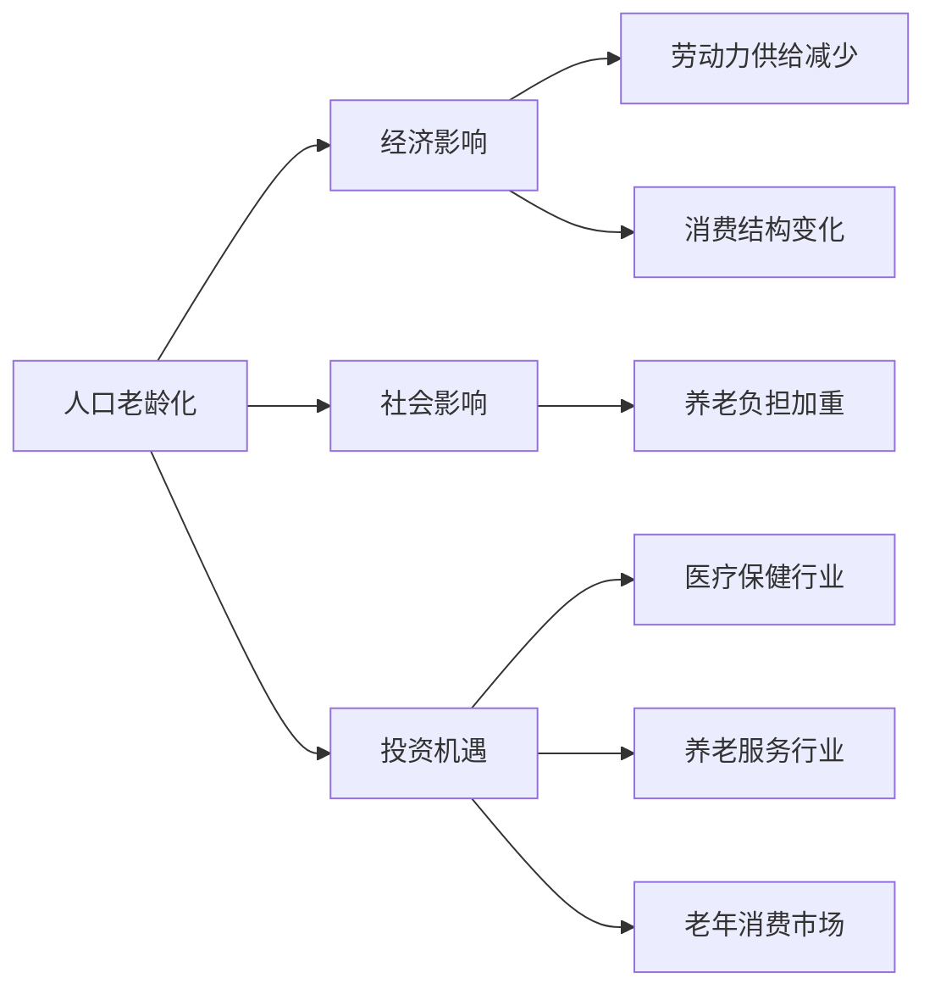

# 巴菲特 - 芒格的人口老龄化投资：社会变迁中的机遇

> 关键词：巴菲特；芒格；人口老龄化；投资机遇；社会变迁

> 摘要：本文聚焦于巴菲特和芒格在人口老龄化背景下的投资理念与策略。深入剖析人口老龄化这一社会变迁现象，探讨其中蕴含的投资机遇。通过对核心概念的阐述、相关算法原理的讲解、数学模型的分析以及实际案例的研究，揭示在人口老龄化趋势下如何进行有效的投资。同时介绍相关工具和资源，总结未来发展趋势与挑战，并对常见问题进行解答，为投资者在社会变迁中把握投资机遇提供全面的参考。

## 1. 背景介绍 
### 1.1 目的和范围
本文章旨在深入研究巴菲特和芒格在人口老龄化这一社会变迁背景下的投资思路和策略。探讨人口老龄化给经济、社会带来的多方面影响，以及如何从中发现潜在的投资机会。范围涵盖人口老龄化的各个相关领域，包括医疗保健、养老服务、消费等行业，分析在这些领域中具有投资价值的企业和项目。

### 1.2 预期读者
本文预期读者主要包括投资者，无论是专业的投资机构从业者，还是个人投资者，都可以从本文中获取关于人口老龄化投资的思路和方法。同时，对经济、社会发展趋势感兴趣的研究人员，以及关注巴菲特和芒格投资理念的爱好者也能从本文中得到有价值的信息。

### 1.3 文档结构概述
本文将首先介绍相关的核心概念，包括人口老龄化的定义、特征以及与投资的联系。接着详细阐述在人口老龄化背景下进行投资分析的核心算法原理和具体操作步骤，并运用数学模型和公式进行深入讲解和举例说明。然后通过实际项目案例展示如何在实际中应用这些投资理念和方法。之后探讨人口老龄化投资的实际应用场景，推荐相关的工具和资源。最后总结未来发展趋势与挑战，解答常见问题，并提供扩展阅读和参考资料。

### 1.4 术语表
#### 1.4.1 核心术语定义
- **人口老龄化**：指人口生育率降低和人均寿命延长导致的总人口中因年轻人口数量减少、年长人口数量增加而导致的老年人口比例相应增长的动态。国际上通常把60岁以上的人口占总人口比例达到10%，或65岁以上人口占总人口的比重达到7%作为国家或地区进入老龄化社会的标准。
- **投资机遇**：指在特定的经济、社会环境下，存在的能够为投资者带来收益的投资领域、项目或资产。
- **社会变迁**：指社会的结构和功能发生的变化，包括人口结构、经济结构、文化等方面的变化。

#### 1.4.2 相关概念解释
- **价值投资**：巴菲特和芒格所倡导的投资理念，强调通过分析企业的内在价值，以低于内在价值的价格买入股票，并长期持有，等待企业价值的增长。
- **护城河理论**：由巴菲特提出，指企业拥有的一种可持续的竞争优势，能够保护企业的市场份额和利润，就像城堡周围的护城河一样。

#### 1.4.3 缩略词列表
- **PEG**：市盈率相对盈利增长比率（Price/Earnings to Growth Ratio），用于衡量股票的估值是否合理。

## 2. 核心概念与联系 

### 人口老龄化的特征与影响
人口老龄化具有老年人口数量增加、老年人口比例上升、人口年龄中位数提高等特征。这一现象对社会和经济产生了多方面的影响。在经济方面，劳动力供给减少，可能导致经济增长放缓；消费结构发生变化，对老年相关产品和服务的需求增加。在社会方面，养老负担加重，对养老保障体系提出了更高的要求。

### 投资机遇与人口老龄化的联系
人口老龄化带来的消费结构变化为投资者提供了众多投资机遇。例如，医疗保健行业，随着老年人口的增加，对医疗服务、药品、医疗器械的需求将持续增长。养老服务行业，包括养老院、老年护理等领域也将迎来发展机遇。此外，老年消费市场，如老年旅游、老年食品等也具有较大的潜力。

### 文本示意图
```plaintext
人口老龄化
    |
    |-- 经济影响
    |   |-- 劳动力供给减少
    |   |-- 消费结构变化
    |
    |-- 社会影响
    |   |-- 养老负担加重
    |
    |-- 投资机遇
        |-- 医疗保健行业
        |-- 养老服务行业
        |-- 老年消费市场
```

### Mermaid 流程图


## 3. 核心算法原理 & 具体操作步骤 

### 价值评估算法原理
在人口老龄化投资中，价值评估是关键。常用的方法是基于现金流折现模型（DCF）来评估企业的内在价值。现金流折现模型的基本原理是将企业未来的现金流按照一定的折现率折现到当前，得到企业的内在价值。

以下是使用 Python 实现的简单现金流折现模型示例代码：
```python
def dcf_valuation(cash_flows, discount_rate):
    """
    现金流折现模型计算企业内在价值
    :param cash_flows: 未来各期的现金流列表
    :param discount_rate: 折现率
    :return: 企业内在价值
    """
    present_value = 0
    for i, cash_flow in enumerate(cash_flows):
        present_value += cash_flow / ((1 + discount_rate) ** (i + 1))
    return present_value

# 示例数据
cash_flows = [100, 120, 150, 180, 200]
discount_rate = 0.1

intrinsic_value = dcf_valuation(cash_flows, discount_rate)
print(f"企业内在价值: {intrinsic_value}")
```

### 具体操作步骤
1. **数据收集**：收集目标企业的财务报表、行业报告等数据，了解企业的历史业绩和未来发展前景。
2. **预测现金流**：根据企业的业务模式和市场趋势，预测企业未来的现金流。可以采用线性回归、时间序列分析等方法进行预测。
3. **确定折现率**：折现率反映了投资的风险和机会成本。可以参考市场利率、行业平均收益率等因素来确定折现率。
4. **计算内在价值**：使用现金流折现模型计算企业的内在价值。
5. **比较估值**：将计算得到的内在价值与企业的市场价格进行比较，如果内在价值大于市场价格，则认为该企业具有投资价值。

## 4. 数学模型和公式 & 详细讲解 & 举例说明 

### 现金流折现模型公式
现金流折现模型的基本公式为：
$$V = \sum_{t=1}^{n} \frac{CF_t}{(1 + r)^t}$$
其中，$V$ 表示企业的内在价值，$CF_t$ 表示第 $t$ 期的现金流，$r$ 表示折现率，$n$ 表示预测期数。

### 详细讲解
该公式的核心思想是将未来的现金流按照一定的折现率折现到当前。折现率 $r$ 反映了资金的时间价值和投资的风险。由于未来的现金流具有不确定性，因此需要通过折现率将其调整为当前的价值。预测期数 $n$ 通常根据企业的发展阶段和行业特点来确定。

### 举例说明
假设一家医疗保健企业，预计未来 5 年的现金流分别为 100 万元、120 万元、150 万元、180 万元和 200 万元，折现率为 10%。则该企业的内在价值为：
$$V = \frac{100}{(1 + 0.1)^1} + \frac{120}{(1 + 0.1)^2} + \frac{150}{(1 + 0.1)^3} + \frac{180}{(1 + 0.1)^4} + \frac{200}{(1 + 0.1)^5}$$
```python
cash_flows = [100, 120, 150, 180, 200]
discount_rate = 0.1
intrinsic_value = 0
for i, cash_flow in enumerate(cash_flows):
    intrinsic_value += cash_flow / ((1 + discount_rate) ** (i + 1))
print(f"企业内在价值: {intrinsic_value} 万元")
```
通过计算得到该企业的内在价值，投资者可以将其与企业的市场价格进行比较，从而判断是否具有投资价值。

## 5. 项目实战：代码实际案例和详细解释说明 

### 5.1  开发环境搭建
在进行人口老龄化投资项目实战时，我们可以使用 Python 进行数据分析和建模。以下是搭建开发环境的步骤：
1. **安装 Python**：从 Python 官方网站（https://www.python.org/downloads/）下载并安装 Python 3.x 版本。
2. **安装必要的库**：使用 pip 命令安装以下必要的库：
```sh
pip install pandas numpy matplotlib scikit-learn
```
- `pandas`：用于数据处理和分析。
- `numpy`：用于数值计算。
- `matplotlib`：用于数据可视化。
- `scikit-learn`：用于机器学习算法的实现。

### 5.2  源代码详细实现和代码解读
以下是一个简单的项目实战案例，通过分析医疗保健行业企业的财务数据，预测其未来的盈利能力，并评估其投资价值。

```python
import pandas as pd
import numpy as np
from sklearn.linear_model import LinearRegression
import matplotlib.pyplot as plt

# 读取数据
data = pd.read_csv('healthcare_company_data.csv')

# 提取特征和目标变量
X = data[['Revenue', 'ProfitMargin']]
y = data['NetProfit']

# 划分训练集和测试集
train_size = int(len(data) * 0.8)
X_train, X_test = X[:train_size], X[train_size:]
y_train, y_test = y[:train_size], y[train_size:]

# 训练线性回归模型
model = LinearRegression()
model.fit(X_train, y_train)

# 预测测试集
y_pred = model.predict(X_test)

# 可视化预测结果
plt.scatter(y_test, y_pred)
plt.xlabel('Actual Net Profit')
plt.ylabel('Predicted Net Profit')
plt.title('Actual vs Predicted Net Profit')
plt.show()

# 评估模型
from sklearn.metrics import mean_squared_error
mse = mean_squared_error(y_test, y_pred)
print(f"Mean Squared Error: {mse}")

# 预测未来盈利能力
future_revenue = 1000
future_profit_margin = 0.2
future_features = np.array([[future_revenue, future_profit_margin]])
future_net_profit = model.predict(future_features)
print(f"Predicted Future Net Profit: {future_net_profit[0]}")

# 评估投资价值
# 假设折现率为 10%，预测未来 5 年的现金流
cash_flows = [future_net_profit[0] * (1 + 0.1) ** i for i in range(5)]
discount_rate = 0.1
intrinsic_value = sum([cash_flow / ((1 + discount_rate) ** (i + 1)) for i, cash_flow in enumerate(cash_flows)])
print(f"Intrinsic Value: {intrinsic_value}")
```

### 5.3  代码解读与分析
1. **数据读取**：使用 `pandas` 库读取医疗保健行业企业的财务数据。
2. **特征提取**：选择营业收入（`Revenue`）和利润率（`ProfitMargin`）作为特征，净利润（`NetProfit`）作为目标变量。
3. **数据划分**：将数据划分为训练集和测试集，比例为 8:2。
4. **模型训练**：使用线性回归模型对训练集进行训练。
5. **预测和可视化**：使用训练好的模型对测试集进行预测，并将实际值和预测值进行可视化展示。
6. **模型评估**：使用均方误差（MSE）评估模型的性能。
7. **未来盈利能力预测**：根据给定的未来营业收入和利润率，预测企业的未来净利润。
8. **投资价值评估**：使用现金流折现模型评估企业的内在价值。

## 6. 实际应用场景 
### 医疗保健行业
在人口老龄化背景下，医疗保健行业是最直接受益的行业之一。投资者可以关注以下领域：
- **制药企业**：研发治疗老年疾病的药物，如心血管疾病、糖尿病、阿尔茨海默病等。
- **医疗器械企业**：生产适合老年人使用的医疗器械，如血糖仪、血压计、轮椅等。
- **医疗服务机构**：包括医院、诊所、体检中心等，提供老年医疗服务。

### 养老服务行业
随着老年人口的增加，养老服务需求也在不断增长。投资机会包括：
- **养老院**：提供住宿、餐饮、医疗护理等一站式养老服务。
- **老年护理机构**：提供上门护理、康复护理等服务。
- **养老社区**：打造集居住、休闲、娱乐、医疗于一体的养老社区。

### 老年消费市场
老年消费市场涵盖了多个领域，具有较大的发展潜力：
- **老年旅游**：针对老年人的旅游产品和服务，如夕阳红旅游团、康养旅游等。
- **老年食品**：开发适合老年人营养需求的食品，如低糖、低盐、高纤维食品。
- **老年教育**：提供老年大学、兴趣培训等教育服务。

## 7. 工具和资源推荐
### 7.1 学习资源推荐
#### 7.1.1 书籍推荐
- 《聪明的投资者》（The Intelligent Investor）：本杰明·格雷厄姆著，价值投资的经典之作，对巴菲特和芒格的投资理念产生了深远影响。
- 《穷查理宝典》（Poor Charlie's Almanack）：收录了查理·芒格的演讲和文章，深入阐述了他的投资哲学和思维方式。
- 《巴菲特致股东的信》（Letters to Shareholders）：沃伦·巴菲特每年写给股东的信，是学习巴菲特投资理念的重要资料。

#### 7.1.2 在线课程
- Coursera 上的“投资学原理”课程，由知名教授授课，系统介绍投资的基本原理和方法。
- edX 上的“价值投资分析”课程，深入讲解价值投资的理论和实践。

#### 7.1.3 技术博客和网站
- Seeking Alpha：提供专业的投资分析和研究报告，涵盖了各个行业的投资机会。
- Motley Fool：专注于个人投资，提供投资建议和市场分析。

### 7.2 开发工具框架推荐
#### 7.2.1 IDE和编辑器
- PyCharm：功能强大的 Python 集成开发环境，适合进行数据分析和建模。
- Jupyter Notebook：交互式的开发环境，方便进行数据探索和可视化。

#### 7.2.2 调试和性能分析工具
- PDB：Python 自带的调试器，用于调试 Python 代码。
- cProfile：Python 标准库中的性能分析工具，用于分析代码的运行时间和性能瓶颈。

#### 7.2.3 相关框架和库
- Pandas：用于数据处理和分析，提供了丰富的数据结构和函数。
- NumPy：用于数值计算，提供了高效的数组操作和数学函数。
- Scikit-learn：用于机器学习算法的实现，包括分类、回归、聚类等算法。

### 7.3 相关论文著作推荐
#### 7.3.1 经典论文
- “The Theory of Investment Value”（投资价值理论）：由约翰·伯尔·威廉姆斯撰写，提出了现金流折现模型的基本思想。
- “Security Analysis”（证券分析）：本杰明·格雷厄姆和戴维·多德合著，奠定了价值投资的理论基础。

#### 7.3.2 最新研究成果
- 关注学术期刊如《金融研究》《管理世界》等，了解人口老龄化投资领域的最新研究动态。
- 参加相关的学术会议和研讨会，与专家学者交流最新的研究成果。

#### 7.3.3 应用案例分析
- 阅读相关的商业案例书籍和报告，了解企业在人口老龄化背景下的投资策略和成功经验。
- 分析上市公司的年报和财务报告，了解其在应对人口老龄化方面的举措和业绩表现。

## 8. 总结：未来发展趋势与挑战
### 未来发展趋势
- **科技驱动**：随着科技的不断进步，人工智能、大数据、物联网等技术将在医疗保健、养老服务等领域得到广泛应用，提高服务质量和效率，创造更多的投资机会。
- **多元化发展**：除了传统的医疗保健、养老服务和老年消费市场，人口老龄化还将带动金融、房地产等行业的多元化发展，如老年金融产品、老年公寓等。
- **国际化合作**：人口老龄化是全球性的问题，各国将加强在养老服务、医疗技术等领域的合作，为投资者提供更广阔的国际市场。

### 挑战
- **政策不确定性**：人口老龄化涉及到社会保障、医疗改革等多个方面的政策，政策的变化可能会对投资产生影响。
- **竞争加剧**：随着人口老龄化投资市场的不断扩大，竞争也将日益激烈，投资者需要具备更强的分析能力和投资眼光。
- **技术风险**：科技的发展虽然带来了机遇，但也伴随着技术风险，如数据安全、隐私保护等问题。

## 9. 附录：常见问题与解答
### 问题 1：如何判断一个企业是否具有投资价值？
解答：可以从企业的基本面、财务状况、行业前景等方面进行分析。使用现金流折现模型等方法评估企业的内在价值，并与市场价格进行比较。同时，关注企业的竞争优势、管理团队等因素。

### 问题 2：人口老龄化投资是否只局限于医疗保健和养老服务行业？
解答：不是的。虽然医疗保健和养老服务行业是人口老龄化投资的重点领域，但还可以关注老年消费市场、金融、房地产等相关行业。例如，老年旅游、老年教育、老年金融产品等都具有投资潜力。

### 问题 3：如何降低人口老龄化投资的风险？
解答：可以通过分散投资、选择具有竞争优势的企业、关注政策变化等方式降低风险。同时，进行充分的市场调研和分析，了解行业趋势和企业的基本面。

## 10. 扩展阅读 & 参考资料
### 扩展阅读
- 《百岁人生：长寿时代的生活和工作》（The 100-Year Life: Living and Working in an Age of Longevity）：探讨了人口老龄化对个人生活和工作的影响。
- 《创新者的窘境》（The Innovator's Dilemma）：分析了企业在面对技术变革和市场变化时的挑战和机遇。

### 参考资料
- 各国政府发布的人口统计数据和相关政策文件。
- 行业协会发布的行业研究报告和统计数据。
- 上市公司的年报和财务报告。

作者：AI天才研究院/AI Genius Institute & 禅与计算机程序设计艺术 /Zen And The Art of Computer Programming