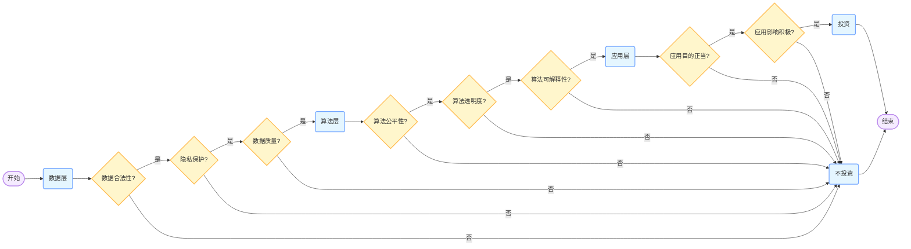

# 巴菲特 - 芒格的人工智能伦理投资：技术发展与社会影响

> 关键词：巴菲特、芒格、人工智能伦理投资、技术发展、社会影响

> 摘要：本文深入探讨了巴菲特 - 芒格的人工智能伦理投资理念，分析了人工智能技术发展的现状与趋势，以及其对社会产生的多方面影响。从核心概念出发，详细阐述了人工智能伦理投资的原理和具体操作步骤，通过数学模型和实际案例进行深入解读。同时，介绍了人工智能在不同场景的实际应用，推荐了相关的学习资源、开发工具和研究论文。最后，总结了未来人工智能伦理投资的发展趋势与挑战，并对常见问题进行了解答。

## 1. 背景介绍 
### 1.1 目的和范围
本文章的主要目的是探讨巴菲特 - 芒格的人工智能伦理投资理念，分析人工智能技术发展过程中伦理投资的重要性以及对社会产生的影响。研究范围涵盖人工智能技术的基本原理、伦理投资的核心概念、相关算法和数学模型，以及实际应用场景等方面。通过全面的分析，为投资者、技术开发者和社会公众提供关于人工智能伦理投资的深入理解和思考。

### 1.2 预期读者
本文预期读者包括对投资领域感兴趣的投资者，希望了解如何在人工智能领域进行符合伦理标准的投资；人工智能技术开发者和研究人员，以便他们在技术开发过程中考虑伦理因素；政策制定者和监管机构人员，为制定相关政策和监管措施提供参考；以及对科技与社会发展关系感兴趣的普通公众。

### 1.3 文档结构概述
本文将按照以下结构进行阐述：首先介绍核心概念与联系，明确人工智能伦理投资的基本原理和架构；接着详细讲解核心算法原理和具体操作步骤，通过 Python 代码进行演示；然后介绍数学模型和公式，并举例说明；之后通过项目实战展示代码实际案例并进行详细解释；再探讨人工智能伦理投资的实际应用场景；推荐相关的工具和资源；最后总结未来发展趋势与挑战，解答常见问题，并提供扩展阅读和参考资料。

### 1.4 术语表
#### 1.4.1 核心术语定义
- **人工智能（Artificial Intelligence，AI）**：是指计算机系统能够执行通常需要人类智能才能完成的任务，如学习、推理、解决问题、感知和语言理解等。
- **伦理投资（Ethical Investment）**：也称为社会责任投资，是指在投资决策过程中，不仅考虑财务回报，还考虑投资项目的社会、环境和道德影响。
- **人工智能伦理投资（Artificial Intelligence Ethical Investment）**：是指在人工智能领域进行投资时，综合考虑人工智能技术的发展是否符合伦理标准，包括隐私保护、公平性、透明度等方面。

#### 1.4.2 相关概念解释
- **隐私保护**：在人工智能应用中，确保个人数据不被非法获取、使用和披露的原则。例如，在人脸识别系统中，要保证用户的面部数据不被滥用。
- **公平性**：人工智能系统在决策过程中应避免对不同群体产生偏见，确保所有用户都能得到公平的对待。比如，招聘算法不应因性别、种族等因素对候选人产生不公平的评价。
- **透明度**：人工智能系统的决策过程和算法应具有可解释性，让用户能够理解系统是如何做出决策的。

#### 1.4.3 缩略词列表
- **AI**：Artificial Intelligence（人工智能）
- **ML**：Machine Learning（机器学习）
- **DL**：Deep Learning（深度学习）

## 2. 核心概念与联系 

### 人工智能伦理投资的核心概念原理
人工智能伦理投资的核心在于将伦理原则融入到人工智能技术的投资决策中。这意味着投资者在评估人工智能项目时，不仅要考虑其技术的创新性和商业潜力，还要关注该技术是否符合伦理标准。伦理标准包括但不限于尊重人权、保护隐私、避免歧视、确保公平性和透明度等。

例如，一个人脸识别技术公司，如果其技术被用于非法监控或侵犯个人隐私，那么即使该技术具有很高的商业价值，从伦理投资的角度来看，也不应该对其进行投资。相反，那些致力于开发符合伦理标准的人工智能技术的公司，如通过技术手段保障数据隐私、减少算法偏见的公司，更值得投资者关注。

### 架构的文本示意图
人工智能伦理投资的架构可以分为三个主要层次：数据层、算法层和应用层。

数据层：主要涉及数据的收集、存储和管理。在这一层，伦理问题主要集中在数据的合法性、隐私保护和数据质量上。例如，数据的收集是否得到了用户的明确同意，数据存储是否安全，数据是否存在偏差等。

算法层：包括机器学习、深度学习等各种算法。在这一层，伦理问题主要涉及算法的公平性、透明度和可解释性。例如，算法是否会对某些群体产生偏见，算法的决策过程是否能够被解释等。

应用层：是人工智能技术的具体应用场景，如医疗、金融、交通等。在这一层，伦理问题主要与应用的目的和影响有关。例如，人工智能在医疗领域的应用是否会导致医疗资源的不公平分配，在金融领域的应用是否会增加金融风险等。

### Mermaid 流程图


这个流程图展示了人工智能伦理投资的决策过程。从数据层开始，依次检查数据的合法性、隐私保护和质量；然后在算法层检查算法的公平性、透明度和可解释性；最后在应用层检查应用的目的和影响。只有当所有环节都符合伦理标准时，才会进行投资。

## 3. 核心算法原理 & 具体操作步骤 

### 算法原理讲解
在人工智能伦理投资中，一个重要的算法是用于评估算法公平性的算法。这里我们以一个简单的线性回归模型为例，说明如何检测算法是否存在性别偏见。

假设我们有一个预测员工薪资的线性回归模型，输入特征包括工作年限、教育程度和性别（用 0 表示男性，1 表示女性），输出为薪资。我们的目标是检查该模型是否对女性存在薪资歧视。

```python
import numpy as np
from sklearn.linear_model import LinearRegression

# 生成示例数据
np.random.seed(0)
n_samples = 100
work_experience = np.random.randint(1, 10, n_samples)
education_level = np.random.randint(1, 5, n_samples)
gender = np.random.randint(0, 2, n_samples)

# 模拟薪资数据，假设存在一定的性别偏见
salary = 1000 * work_experience + 500 * education_level + 200 * (1 - gender) + np.random.normal(0, 100, n_samples)

# 准备特征矩阵和目标向量
X = np.column_stack((work_experience, education_level, gender))
y = salary

# 训练线性回归模型
model = LinearRegression()
model.fit(X, y)

# 检查性别特征的系数
gender_coef = model.coef_[2]
if gender_coef < 0:
    print("模型可能存在对女性的薪资歧视")
else:
    print("模型未检测到明显的性别歧视")
```

### 具体操作步骤
1. **数据收集**：收集与投资项目相关的各种数据，包括人工智能系统使用的数据、模型的输入输出数据等。
2. **数据预处理**：对收集到的数据进行清洗、转换和归一化等操作，以确保数据的质量和一致性。
3. **模型训练**：使用预处理后的数据训练人工智能模型，如上述的线性回归模型。
4. **伦理评估**：使用特定的算法和指标对模型进行伦理评估，如检查算法的公平性、透明度等。
5. **决策制定**：根据伦理评估的结果，决定是否对该项目进行投资。

## 4. 数学模型和公式 & 详细讲解 & 举例说明 

### 线性回归模型公式
线性回归模型的基本公式为：

$$y = \beta_0 + \beta_1x_1 + \beta_2x_2 + \cdots + \beta_nx_n + \epsilon$$

其中，$y$ 是目标变量（如薪资），$x_1, x_2, \cdots, x_n$ 是输入特征（如工作年限、教育程度、性别等），$\beta_0, \beta_1, \beta_2, \cdots, \beta_n$ 是模型的系数，$\epsilon$ 是误差项。

在上述示例中，$n = 3$，$x_1$ 是工作年限，$x_2$ 是教育程度，$x_3$ 是性别。

### 公平性评估指标
一个常用的公平性评估指标是差异影响比（Disparate Impact Ratio，DIR）。DIR 定义为受保护群体（如女性）的正例率与非受保护群体（如男性）的正例率之比。

假设 $P_{protected}$ 是受保护群体的正例率，$P_{unprotected}$ 是非受保护群体的正例率，则 DIR 计算公式为：

$$DIR = \frac{P_{protected}}{P_{unprotected}}$$

一般来说，如果 $DIR$ 在 0.8 到 1.25 之间，则认为模型是公平的；否则，模型可能存在歧视。

### 举例说明
假设在一个招聘算法中，男性的录用率为 0.6，女性的录用率为 0.48，则 DIR 为：

$$DIR = \frac{0.48}{0.6} = 0.8$$

由于 $DIR$ 等于 0.8，说明该算法在性别方面基本是公平的。

## 5. 项目实战：代码实际案例和详细解释说明 

### 5.1  开发环境搭建
- **Python 安装**：建议使用 Python 3.7 及以上版本。可以从 Python 官方网站（https://www.python.org/downloads/）下载并安装。
- **依赖库安装**：使用 `pip` 安装所需的依赖库，如 `numpy`、`pandas`、`scikit-learn` 等。
```bash
pip install numpy pandas scikit-learn
```

### 5.2  源代码详细实现和代码解读
以下是一个更完整的项目实战案例，用于检测一个分类算法是否存在年龄歧视。

```python
import numpy as np
import pandas as pd
from sklearn.model_selection import train_test_split
from sklearn.linear_model import LogisticRegression
from sklearn.metrics import accuracy_score

# 生成示例数据
np.random.seed(0)
n_samples = 200
age = np.random.randint(20, 60, n_samples)
income = np.random.randint(20000, 100000, n_samples)
loan_approval = np.where((age > 40) & (income > 50000), 1, 0)

# 创建 DataFrame
data = pd.DataFrame({
    'age': age,
    'income': income,
    'loan_approval': loan_approval
})

# 划分特征和目标变量
X = data[['age', 'income']]
y = data['loan_approval']

# 划分训练集和测试集
X_train, X_test, y_train, y_test = train_test_split(X, y, test_size=0.2, random_state=42)

# 训练逻辑回归模型
model = LogisticRegression()
model.fit(X_train, y_train)

# 预测测试集
y_pred = model.predict(X_test)

# 计算准确率
accuracy = accuracy_score(y_test, y_pred)
print(f"模型准确率: {accuracy}")

# 检查年龄歧视
# 假设年龄大于 40 岁为受保护群体
protected_group = X_test[X_test['age'] > 40]
unprotected_group = X_test[X_test['age'] <= 40]

protected_pred = model.predict(protected_group)
unprotected_pred = model.predict(unprotected_group)

protected_positive_rate = np.mean(protected_pred)
unprotected_positive_rate = np.mean(unprotected_pred)

dir_value = protected_positive_rate / unprotected_positive_rate
print(f"差异影响比 (DIR): {dir_value}")

if 0.8 <= dir_value <= 1.25:
    print("模型未检测到明显的年龄歧视")
else:
    print("模型可能存在年龄歧视")
```

### 代码解读与分析
1. **数据生成**：使用 `numpy` 生成示例数据，包括年龄、收入和贷款审批结果。
2. **数据预处理**：将数据转换为 `pandas` 的 `DataFrame` 格式，并划分特征和目标变量。
3. **模型训练**：使用 `sklearn` 的 `LogisticRegression` 模型进行训练。
4. **模型评估**：计算模型的准确率，并使用差异影响比（DIR）检查模型是否存在年龄歧视。

通过这个案例，我们可以看到如何在实际项目中应用公平性评估指标来检测人工智能模型是否存在伦理问题。

## 6. 实际应用场景 
### 金融领域
在金融领域，人工智能被广泛应用于信贷审批、风险评估和投资决策等方面。人工智能伦理投资要求金融机构确保其使用的人工智能模型不会对某些群体产生歧视，如根据种族、性别或年龄拒绝贷款申请。同时，模型的决策过程应该具有透明度，让客户能够理解为什么他们的申请被批准或拒绝。

例如，一些银行使用机器学习模型来评估客户的信用风险。这些模型可能会使用大量的个人数据，如收入、信用历史等。在这个过程中，需要确保数据的收集和使用符合伦理标准，避免对弱势群体的不公平对待。

### 医疗领域
在医疗领域，人工智能可以帮助医生进行疾病诊断、治疗方案推荐和药物研发等。人工智能伦理投资要求医疗人工智能系统保护患者的隐私，确保数据的安全。同时，模型的诊断结果应该具有可靠性和可解释性，以便医生能够做出正确的决策。

例如，一个基于深度学习的医学影像诊断系统，需要确保其在不同种族、性别和年龄群体中的诊断准确率是一致的，避免因算法偏见导致某些群体的疾病被误诊或漏诊。

### 交通领域
在交通领域，人工智能被应用于自动驾驶、智能交通管理等方面。人工智能伦理投资要求自动驾驶系统确保乘客和行人的安全，避免因算法故障导致交通事故。同时，智能交通管理系统应该公平地分配交通资源，减少交通拥堵。

例如，自动驾驶汽车在遇到紧急情况时，应该如何做出决策是一个重要的伦理问题。是优先保护车内乘客的安全，还是优先保护行人的安全，需要在算法设计中进行权衡。

## 7. 工具和资源推荐
### 7.1 学习资源推荐
#### 7.1.1 书籍推荐
- 《人工智能：现代方法》（Artificial Intelligence: A Modern Approach）：这是一本经典的人工智能教材，涵盖了人工智能的各个方面，包括搜索算法、机器学习、自然语言处理等。
- 《深度学习》（Deep Learning）：由 Ian Goodfellow、Yoshua Bengio 和 Aaron Courville 撰写，是深度学习领域的权威著作，介绍了深度学习的基本原理和应用。
- 《道德算法：算法时代的道德工程》（The Ethical Algorithm: The Science of Socially Aware Algorithm Design）：探讨了算法设计中的伦理问题，以及如何设计符合伦理标准的算法。

#### 7.1.2 在线课程
- Coursera 上的“人工智能基础”（Foundations of Artificial Intelligence）课程：由哥伦比亚大学教授 Peter Norvig 讲授，介绍了人工智能的基本概念和算法。
- edX 上的“深度学习专项课程”（Deep Learning Specialization）：由 Andrew Ng 教授讲授，深入讲解了深度学习的理论和实践。
- Udemy 上的“人工智能伦理与社会影响”（Artificial Intelligence Ethics and Social Impact）课程：探讨了人工智能在社会中的伦理问题和影响。

#### 7.1.3 技术博客和网站
- Towards Data Science：一个专注于数据科学和人工智能的博客平台，上面有很多关于人工智能伦理的文章。
- Medium 上的 AI Ethics 专栏：汇集了关于人工智能伦理的最新研究和观点。
- OpenAI 的官方博客：提供了关于人工智能技术和伦理的最新信息。

### 7.2 开发工具框架推荐
#### 7.2.1 IDE和编辑器
- PyCharm：一款专业的 Python 集成开发环境，提供了丰富的代码编辑、调试和项目管理功能。
- Jupyter Notebook：一个交互式的编程环境，适合进行数据探索和模型开发，支持 Python、R 等多种编程语言。
- Visual Studio Code：一款轻量级的代码编辑器，支持多种编程语言，并且有丰富的插件扩展。

#### 7.2.2 调试和性能分析工具
- TensorBoard：TensorFlow 提供的可视化工具，可以用于监控模型的训练过程、查看模型的结构和性能指标。
- Py-Spy：一个 Python 性能分析工具，可以帮助开发者找出代码中的性能瓶颈。
- PDB：Python 自带的调试器，可以用于调试 Python 代码。

#### 7.2.3 相关框架和库
- TensorFlow：一个开源的机器学习框架，广泛应用于深度学习领域，提供了丰富的工具和库。
- PyTorch：另一个流行的深度学习框架，具有动态图的特点，易于使用和调试。
- Scikit-learn：一个用于机器学习的 Python 库，提供了各种机器学习算法和工具，如分类、回归、聚类等。

### 7.3 相关论文著作推荐
#### 7.3.1 经典论文
- “The Moral Machine Experiment”：探讨了自动驾驶汽车在面临道德困境时的决策问题。
- “Algorithmic Bias Detection and Mitigation: Best Practices and Policies to Reduce Consumer Harms”：介绍了检测和缓解算法偏见的最佳实践和政策。
- “Fairness in Machine Learning”：综述了机器学习中的公平性问题和相关的研究进展。

#### 7.3.2 最新研究成果
- 关注顶级学术会议如 NeurIPS、ICML、CVPR 等上关于人工智能伦理的最新研究论文。
- 一些知名学术期刊如 Journal of Artificial Intelligence Research、Artificial Intelligence 等也会发表关于人工智能伦理的研究成果。

#### 7.3.3 应用案例分析
- 可以参考一些实际应用案例分析报告，如金融机构、医疗企业等发布的关于人工智能伦理应用的案例。这些案例可以帮助我们更好地理解如何在实际项目中应用人工智能伦理投资的理念。

## 8. 总结：未来发展趋势与挑战
### 未来发展趋势
- **伦理标准的规范化**：随着人工智能技术的广泛应用，各国政府和国际组织将加强对人工智能伦理标准的制定和规范。未来可能会出现统一的国际伦理准则，指导人工智能技术的研发和应用。
- **伦理投资的普及化**：越来越多的投资者将认识到人工智能伦理投资的重要性，伦理投资将成为一种主流的投资理念。这将促使企业更加注重人工智能技术的伦理问题，推动行业的健康发展。
- **技术与伦理的融合**：未来的人工智能技术将更加注重与伦理的融合，开发出具有伦理意识的人工智能系统。例如，人工智能系统能够自动检测和纠正自身的伦理问题，提高系统的可靠性和安全性。

### 挑战
- **伦理标准的界定难题**：人工智能伦理标准的界定是一个复杂的问题，不同的文化、价值观和利益群体可能对伦理标准有不同的理解。如何制定出普遍认可的伦理标准是一个巨大的挑战。
- **技术的复杂性**：人工智能技术的复杂性使得伦理问题的检测和解决变得困难。例如，深度学习模型的黑盒性质使得很难理解模型的决策过程，从而难以检测和纠正其中的伦理问题。
- **监管的难度**：人工智能技术的发展速度非常快，监管机构很难及时跟上技术的步伐。如何建立有效的监管机制，确保人工智能技术的发展符合伦理标准是一个亟待解决的问题。

## 9. 附录：常见问题与解答
### 问题 1：人工智能伦理投资是否会影响投资回报？
解答：从短期来看，人工智能伦理投资可能会限制投资者的选择范围，从而在一定程度上影响投资回报。但从长期来看，符合伦理标准的人工智能项目往往具有更高的社会认可度和可持续性，能够减少潜在的法律风险和声誉风险，从而为投资者带来更稳定的回报。

### 问题 2：如何评估一个人工智能项目是否符合伦理标准？
解答：可以从多个方面进行评估，包括数据的合法性和隐私保护、算法的公平性和透明度、应用的目的和影响等。可以使用一些专业的评估指标和工具，如差异影响比（DIR）、可解释性评估等。

### 问题 3：人工智能伦理投资对企业有什么好处？
解答：对于企业来说，遵循人工智能伦理投资的理念可以提高企业的社会形象和声誉，增强消费者的信任。同时，符合伦理标准的人工智能技术可以减少法律风险，避免因伦理问题导致的损失。此外，注重伦理的企业更容易吸引优秀的人才和投资者，促进企业的长期发展。

## 10. 扩展阅读 & 参考资料
- 相关学术书籍和论文可以进一步深入研究人工智能伦理投资的理论和实践。
- 行业报告和新闻文章可以了解人工智能伦理投资的最新动态和趋势。
- 一些专业的论坛和社区，如 Reddit 上的人工智能伦理板块，可以与其他研究者和从业者交流经验和观点。

作者：AI天才研究院/AI Genius Institute & 禅与计算机程序设计艺术 /Zen And The Art of Computer Programming