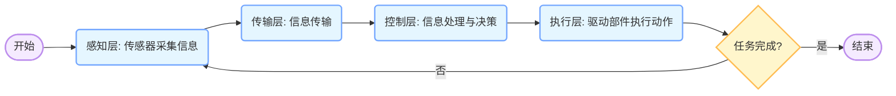

# 巴菲特 - 芒格的仿生机器人投资：未来劳动力的革命

> 关键词：巴菲特、芒格、仿生机器人、投资、未来劳动力、革命

> 摘要：本文深入探讨了巴菲特和芒格对仿生机器人领域的投资行为及其背后的深远意义。通过分析仿生机器人的核心概念、技术原理、数学模型，结合实际项目案例，阐述了仿生机器人作为未来劳动力的巨大潜力。同时，介绍了相关的工具和资源，讨论了该领域的未来发展趋势与挑战，并对常见问题进行解答，旨在为读者全面呈现仿生机器人投资这一新兴领域，以及其将如何引发未来劳动力的革命。

## 1. 背景介绍 
### 1.1 目的和范围
本文旨在全面剖析巴菲特 - 芒格对仿生机器人的投资决策，深入研究仿生机器人这一前沿技术在未来劳动力市场中所扮演的角色。从技术原理、应用场景到投资价值等多个维度进行探讨，为投资者、科技爱好者以及相关从业者提供有价值的参考。同时，也将分析这一投资行为可能带来的行业变革和社会影响。

### 1.2 预期读者
本文的预期读者包括对投资领域感兴趣的投资者，尤其是关注科技行业投资机会的人群；从事人工智能、机器人技术研究的科研人员和工程师；对未来劳动力市场变化趋势感兴趣的学者和社会观察家；以及希望了解新兴科技动态的普通科技爱好者。

### 1.3 文档结构概述
本文将按照以下结构展开：首先介绍仿生机器人的核心概念与联系，包括其原理和架构；接着详细阐述核心算法原理及具体操作步骤，并用 Python 代码进行说明；然后讲解相关的数学模型和公式，并举例说明；通过项目实战展示代码实际案例并进行详细解释；分析仿生机器人的实际应用场景；推荐相关的工具和资源；最后总结未来发展趋势与挑战，解答常见问题，并提供扩展阅读和参考资料。

### 1.4 术语表
#### 1.4.1 核心术语定义
- **仿生机器人**：是一种模仿生物的结构、功能和行为的机器人。它融合了生物学、机械工程、电子工程、控制理论等多学科知识，旨在实现类似于生物的运动、感知和决策能力。
- **人工智能**：是研究、开发用于模拟、延伸和扩展人的智能的理论、方法、技术及应用系统的一门新的技术科学。在仿生机器人中，人工智能用于实现机器人的自主决策和学习能力。
- **传感器**：是一种检测装置，能感受到被测量的信息，并能将感受到的信息，按一定规律变换成为电信号或其他所需形式的信息输出，以满足信息的传输、处理、存储、显示、记录和控制等要求。仿生机器人通过传感器来感知周围环境。

#### 1.4.2 相关概念解释
- **机器学习**：是一门多领域交叉学科，涉及概率论、统计学、逼近论、凸分析、算法复杂度理论等多门学科。它专门研究计算机怎样模拟或实现人类的学习行为，以获取新的知识或技能，重新组织已有的知识结构使之不断改善自身的性能。在仿生机器人中，机器学习可用于机器人的行为学习和优化。
- **深度学习**：是机器学习的一个分支领域，它是一种基于对数据进行表征学习的方法。深度学习通过构建具有很多层的神经网络模型，自动从大量数据中学习特征和模式，从而实现对复杂数据的处理和分析。在仿生机器人的视觉识别、语音识别等方面有广泛应用。

#### 1.4.3 缩略词列表
- **AI**：Artificial Intelligence，人工智能
- **ML**：Machine Learning，机器学习
- **DL**：Deep Learning，深度学习

## 2. 核心概念与联系 
### 核心概念原理
仿生机器人的核心原理是模仿生物的生理结构和行为模式。从结构上看，仿生机器人通常采用类似于生物骨骼和肌肉的机械结构，通过电机、液压装置等驱动部件实现运动。在感知方面，它配备了各种传感器，如视觉传感器、听觉传感器、触觉传感器等，以模拟生物的感官系统，获取周围环境的信息。

在决策和控制层面，仿生机器人运用人工智能技术，特别是机器学习和深度学习算法，对传感器采集的数据进行处理和分析，从而做出决策并控制机器人的行为。例如，通过深度学习算法对图像数据进行分析，机器人可以识别物体和场景，进而做出相应的动作。

### 架构的文本示意图
仿生机器人的架构主要包括以下几个部分：
1. **感知层**：由各种传感器组成，负责采集周围环境的信息，如视觉传感器获取图像信息，听觉传感器获取声音信息，触觉传感器获取接触力信息等。
2. **传输层**：将传感器采集到的信息传输到控制层。这可以通过有线或无线通信技术实现，如以太网、Wi-Fi、蓝牙等。
3. **控制层**：是仿生机器人的核心，它包含处理器和人工智能算法。处理器对传输过来的信息进行处理，人工智能算法根据处理结果做出决策，并生成控制指令。
4. **执行层**：由驱动部件和机械结构组成，根据控制层发出的指令实现机器人的运动和动作，如电机驱动关节运动，液压装置实现伸缩等。

### Mermaid 流程图


## 3. 核心算法原理 & 具体操作步骤 
### 核心算法原理
在仿生机器人中，常用的核心算法包括机器学习算法和深度学习算法。以机器学习中的强化学习算法为例，强化学习是一种通过智能体与环境进行交互，不断尝试不同的动作，并根据环境反馈的奖励信号来学习最优策略的算法。

智能体在环境中执行动作，环境会根据动作的效果给予相应的奖励或惩罚。智能体的目标是通过不断尝试，找到一种能够最大化累积奖励的策略。例如，在一个机器人导航任务中，机器人需要在一个未知的环境中找到目标位置。每次机器人移动到一个新的位置，环境会根据它与目标的距离给予奖励，如果靠近目标则给予正奖励，远离目标则给予负奖励。机器人通过不断尝试不同的移动方向，学习到如何最快地到达目标位置。

### 具体操作步骤及 Python 代码实现
以下是一个简单的强化学习示例，使用 OpenAI Gym 环境中的 CartPole 任务。CartPole 任务是让一个杆子保持平衡，通过控制小车的左右移动来实现。

```python
import gym
import numpy as np

# 创建 CartPole 环境
env = gym.make('CartPole-v1')

# 初始化 Q 表
state_space_size = env.observation_space.shape[0]
action_space_size = env.action_space.n
q_table = np.zeros([state_space_size, action_space_size])

# 超参数设置
learning_rate = 0.1
discount_rate = 0.99
exploration_rate = 1
max_exploration_rate = 1
min_exploration_rate = 0.01
exploration_decay_rate = 0.001

# 训练参数
num_episodes = 1000
max_steps_per_episode = 200

for episode in range(num_episodes):
    state = env.reset()
    done = False
    for step in range(max_steps_per_episode):
        # 探索与利用策略
        exploration_rate_threshold = np.random.uniform(0, 1)
        if exploration_rate_threshold > exploration_rate:
            action = np.argmax(q_table[state, :])
        else:
            action = env.action_space.sample()

        # 执行动作
        new_state, reward, done, info = env.step(action)

        # 更新 Q 表
        q_table[state, action] = q_table[state, action] * (1 - learning_rate) + \
                                 learning_rate * (reward + discount_rate * np.max(q_table[new_state, :]))

        state = new_state

        if done == True:
            break

    # 衰减探索率
    exploration_rate = min_exploration_rate + \
                       (max_exploration_rate - min_exploration_rate) * np.exp(-exploration_decay_rate * episode)

# 测试训练好的策略
state = env.reset()
done = False
for step in range(max_steps_per_episode):
    action = np.argmax(q_table[state, :])
    new_state, reward, done, info = env.step(action)
    env.render()
    state = new_state
    if done == True:
        break

env.close()
```

### 代码解释
1. **环境创建**：使用 `gym.make('CartPole-v1')` 创建 CartPole 环境。
2. **Q 表初始化**：Q 表用于存储每个状态 - 动作对的价值，初始化为全零。
3. **超参数设置**：设置学习率、折扣率、探索率等超参数。
4. **训练过程**：在每个episode中，智能体根据探索与利用策略选择动作，执行动作后更新 Q 表，直到任务完成或达到最大步数。
5. **探索率衰减**：随着训练的进行，逐渐降低探索率，增加利用已学习到的策略的概率。
6. **测试过程**：使用训练好的 Q 表进行测试，观察机器人的表现。

## 4. 数学模型和公式 & 详细讲解 & 举例说明 
### 强化学习的数学模型
强化学习的数学模型可以用马尔可夫决策过程（MDP）来描述。一个 MDP 由一个四元组 $(S, A, P, R)$ 组成，其中：
- $S$ 是状态空间，表示环境可能处于的所有状态的集合。
- $A$ 是动作空间，表示智能体可以执行的所有动作的集合。
- $P$ 是状态转移概率函数，$P(s'|s, a)$ 表示在状态 $s$ 执行动作 $a$ 后转移到状态 $s'$ 的概率。
- $R$ 是奖励函数，$R(s, a, s')$ 表示在状态 $s$ 执行动作 $a$ 转移到状态 $s'$ 时获得的奖励。

### Q 学习算法的公式
Q 学习算法是一种基于价值的强化学习算法，用于更新 Q 表。Q 表中的每个元素 $Q(s, a)$ 表示在状态 $s$ 执行动作 $a$ 的预期累积奖励。Q 学习的更新公式如下：

$$Q(s, a) \leftarrow Q(s, a) + \alpha [R(s, a, s') + \gamma \max_{a'} Q(s', a') - Q(s, a)]$$

其中：
- $\alpha$ 是学习率，控制每次更新的步长。
- $\gamma$ 是折扣率，用于权衡当前奖励和未来奖励的重要性。
- $R(s, a, s')$ 是在状态 $s$ 执行动作 $a$ 转移到状态 $s'$ 时获得的即时奖励。
- $\max_{a'} Q(s', a')$ 是在新状态 $s'$ 下所有可能动作中最大的 Q 值。

### 举例说明
假设一个简单的机器人导航任务，机器人在一个二维网格环境中移动，目标是到达网格中的一个特定位置。状态 $s$ 可以表示机器人在网格中的位置，动作 $a$ 可以是上下左右移动。当机器人移动到目标位置时，获得奖励 $R = 100$，否则获得奖励 $R = -1$。

假设当前状态 $s$ 下，执行动作 $a$ 后转移到新状态 $s'$，即时奖励 $R(s, a, s') = -1$。学习率 $\alpha = 0.1$，折扣率 $\gamma = 0.9$。当前 $Q(s, a) = 5$，在新状态 $s'$ 下，$\max_{a'} Q(s', a') = 10$。

根据 Q 学习公式，更新后的 $Q(s, a)$ 为：

$$Q(s, a) = 5 + 0.1 [-1 + 0.9 \times 10 - 5] = 5 + 0.1 [3] = 5.3$$

这样，Q 表中的值就得到了更新，机器人通过不断更新 Q 表，学习到最优的导航策略。

## 5. 项目实战：代码实际案例和详细解释说明 
### 5.1  开发环境搭建
#### 安装 Python
首先，确保你已经安装了 Python 3.x 版本。可以从 Python 官方网站（https://www.python.org/downloads/） 下载并安装适合你操作系统的版本。

#### 安装必要的库
在本项目中，我们需要安装 `gym` 库和 `numpy` 库。可以使用以下命令进行安装：

```bash
pip install gym
pip install numpy
```

### 5.2  源代码详细实现和代码解读
以下是一个完整的仿生机器人导航项目的代码示例，使用强化学习算法实现机器人在一个简单迷宫中的导航。

```python
import numpy as np
import random

# 迷宫环境定义
maze = [
    [0, 0, 0, 0],
    [0, 1, 1, 0],
    [0, 1, 0, 0],
    [0, 0, 0, 2]
]

# 状态空间和动作空间
state_space_size = len(maze) * len(maze[0])
action_space_size = 4  # 上、下、左、右

# Q 表初始化
q_table = np.zeros([state_space_size, action_space_size])

# 超参数设置
learning_rate = 0.1
discount_rate = 0.99
exploration_rate = 1
max_exploration_rate = 1
min_exploration_rate = 0.01
exploration_decay_rate = 0.001

# 训练参数
num_episodes = 1000
max_steps_per_episode = 100

# 将二维坐标转换为一维状态
def state_from_coords(x, y):
    return x * len(maze[0]) + y

# 获取当前状态下的有效动作
def get_valid_actions(state):
    x = state // len(maze[0])
    y = state % len(maze[0])
    valid_actions = []
    if x > 0 and maze[x - 1][y]!= 1:
        valid_actions.append(0)  # 上
    if x < len(maze) - 1 and maze[x + 1][y]!= 1:
        valid_actions.append(1)  # 下
    if y > 0 and maze[x][y - 1]!= 1:
        valid_actions.append(2)  # 左
    if y < len(maze[0]) - 1 and maze[x][y + 1]!= 1:
        valid_actions.append(3)  # 右
    return valid_actions

# 执行动作并返回新状态和奖励
def take_action(state, action):
    x = state // len(maze[0])
    y = state % len(maze[0])
    if action == 0:
        x -= 1
    elif action == 1:
        x += 1
    elif action == 2:
        y -= 1
    elif action == 3:
        y += 1
    new_state = state_from_coords(x, y)
    if maze[x][y] == 2:
        reward = 100
    else:
        reward = -1
    return new_state, reward

# 训练过程
for episode in range(num_episodes):
    # 初始化起始状态
    state = state_from_coords(0, 0)
    done = False
    for step in range(max_steps_per_episode):
        # 探索与利用策略
        exploration_rate_threshold = random.uniform(0, 1)
        valid_actions = get_valid_actions(state)
        if exploration_rate_threshold > exploration_rate:
            q_values = q_table[state, valid_actions]
            action_index = np.argmax(q_values)
            action = valid_actions[action_index]
        else:
            action = random.choice(valid_actions)

        # 执行动作
        new_state, reward = take_action(state, action)

        # 更新 Q 表
        q_table[state, action] = q_table[state, action] * (1 - learning_rate) + \
                                 learning_rate * (reward + discount_rate * np.max(q_table[new_state, :]))

        state = new_state

        if reward == 100:
            done = True
            break

    # 衰减探索率
    exploration_rate = min_exploration_rate + \
                       (max_exploration_rate - min_exploration_rate) * np.exp(-exploration_decay_rate * episode)

# 测试训练好的策略
state = state_from_coords(0, 0)
done = False
for step in range(max_steps_per_episode):
    valid_actions = get_valid_actions(state)
    q_values = q_table[state, valid_actions]
    action_index = np.argmax(q_values)
    action = valid_actions[action_index]
    new_state, reward = take_action(state, action)
    print(f"Step {step}: State {state}, Action {action}, New State {new_state}, Reward {reward}")
    state = new_state
    if reward == 100:
        print("Reached the goal!")
        break
```

### 5.3  代码解读与分析
#### 迷宫环境定义
使用二维数组 `maze` 表示迷宫，其中 `0` 表示可通行区域，`1` 表示障碍物，`2` 表示目标位置。

#### 状态空间和动作空间
状态空间的大小为迷宫中所有位置的总数，动作空间包括上、下、左、右四个方向的移动。

#### Q 表初始化
Q 表用于存储每个状态 - 动作对的价值，初始化为全零。

#### 超参数设置
设置学习率、折扣率、探索率等超参数，控制强化学习的训练过程。

#### 训练过程
在每个 episode 中，机器人从起始位置开始，根据探索与利用策略选择动作，执行动作后更新 Q 表，直到到达目标位置或达到最大步数。

#### 探索率衰减
随着训练的进行，逐渐降低探索率，增加利用已学习到的策略的概率。

#### 测试过程
使用训练好的 Q 表进行测试，观察机器人是否能够成功到达目标位置。

## 6. 实际应用场景 
### 工业制造
在工业制造领域，仿生机器人可以承担各种复杂的生产任务。例如，模仿人类手臂的机械臂可以进行高精度的装配工作，提高生产效率和产品质量。仿生机器人还可以在危险环境中工作，如高温、高压、有毒有害等环境，代替人类完成危险的操作，保障工人的安全。

### 医疗保健
在医疗保健领域，仿生机器人有广泛的应用前景。例如，仿生假肢可以模仿人类肢体的运动，帮助残疾人恢复部分运动能力。智能手术机器人可以通过精确的操作，减少手术创伤，提高手术的成功率。此外，仿生机器人还可以用于康复治疗，帮助患者进行康复训练。

### 物流配送
在物流配送领域，仿生机器人可以实现自动化的货物搬运和分拣。例如，模仿昆虫运动的小型机器人可以在仓库中快速穿梭，完成货物的搬运任务。无人驾驶的物流车辆也是一种仿生机器人的应用，它可以根据预设的路线自动行驶，提高物流配送的效率。

### 家庭服务
在家庭服务领域，仿生机器人可以为人们提供各种便利。例如，家庭清洁机器人可以自动打扫房间，智能陪伴机器人可以与人们进行交流和互动，为老年人和儿童提供陪伴服务。

## 7. 工具和资源推荐
### 7.1 学习资源推荐
#### 7.1.1 书籍推荐
- 《人工智能：一种现代的方法》：这本书是人工智能领域的经典教材，全面介绍了人工智能的各个方面，包括搜索算法、知识表示、机器学习、自然语言处理等。
- 《强化学习：原理与Python实现》：详细介绍了强化学习的基本原理和算法，并通过 Python 代码进行实现，适合初学者学习。
- 《机器人学导论》：系统介绍了机器人学的基本概念、运动学、动力学、控制理论等内容，是学习机器人技术的重要参考书籍。

#### 7.1.2 在线课程
- Coursera 上的 “人工智能基础” 课程：由知名高校的教授授课，系统介绍了人工智能的基本概念和算法。
- edX 上的 “强化学习” 课程：深入讲解了强化学习的理论和实践，提供了丰富的案例和代码练习。
- Udemy 上的 “仿生机器人设计与开发” 课程：专门针对仿生机器人领域，介绍了仿生机器人的设计原理和开发方法。

#### 7.1.3 技术博客和网站
- Towards Data Science：一个专注于数据科学和人工智能的博客平台，提供了大量的技术文章和案例分析。
- Medium：一个综合性的博客平台，有很多关于人工智能和机器人技术的优质文章。
- IEEE Xplore：电气和电子工程师协会（IEEE）的数字图书馆，包含了大量的学术论文和技术报告，是获取最新技术动态的重要来源。

### 7.2 开发工具框架推荐
#### 7.2.1 IDE和编辑器
- PyCharm：一款专业的 Python 集成开发环境，提供了丰富的代码编辑、调试和分析功能，适合开发 Python 项目。
- Visual Studio Code：一款轻量级的代码编辑器，支持多种编程语言，具有丰富的插件扩展功能，可以用于开发仿生机器人相关的项目。
- Jupyter Notebook：一个交互式的开发环境，适合进行数据分析和模型实验，在机器学习和深度学习领域广泛应用。

#### 7.2.2 调试和性能分析工具
- TensorBoard：TensorFlow 提供的可视化工具，可以用于监控模型的训练过程，分析模型的性能指标。
- Py-Spy：一个用于 Python 程序性能分析的工具，可以帮助开发者找出程序中的性能瓶颈。
- GDB：一个强大的调试工具，支持多种编程语言，可以用于调试机器人控制程序。

#### 7.2.3 相关框架和库
- TensorFlow：一个开源的机器学习框架，提供了丰富的工具和库，用于构建和训练深度学习模型。
- PyTorch：另一个流行的深度学习框架，具有简洁易用的接口和高效的计算性能，在学术界和工业界广泛应用。
- ROS（Robot Operating System）：一个用于机器人开发的开源操作系统，提供了丰富的工具和库，用于机器人的感知、决策和控制。

### 7.3 相关论文著作推荐
#### 7.3.1 经典论文
- “Q - Learning” by Christopher J.C.H. Watkins and Peter Dayan：这篇论文首次提出了 Q 学习算法，是强化学习领域的经典之作。
- “A Fast Learning Algorithm for Deep Belief Nets” by Geoffrey E. Hinton, Simon Osindero, and Yee - Whye Teh：介绍了深度信念网络的快速学习算法，推动了深度学习的发展。
- “Robotics: Control, Sensing, Vision, and Intelligence” by Shigeo Hirose：系统介绍了机器人学的各个方面，是机器人领域的经典著作。

#### 7.3.2 最新研究成果
- 关注顶级学术会议如 ICRA（IEEE International Conference on Robotics and Automation）、IROS（IEEE/RSJ International Conference on Intelligent Robots and Systems）上发表的论文，这些会议汇集了机器人领域的最新研究成果。
- 阅读顶级学术期刊如 “Journal of Field Robotics”、“IEEE Transactions on Robotics” 上的文章，了解最新的研究动态。

#### 7.3.3 应用案例分析
- 研究一些知名企业的仿生机器人应用案例，如波士顿动力公司的机器人在工业和军事领域的应用，分析其技术特点和应用场景。
- 关注一些科研机构的研究项目，如斯坦福大学、麻省理工学院等在仿生机器人领域的研究成果，学习其创新思路和方法。

## 8. 总结：未来发展趋势与挑战
### 未来发展趋势
#### 智能化程度不断提高
随着人工智能技术的不断发展，仿生机器人的智能化程度将不断提高。它们将具备更强的自主决策能力和学习能力，能够更好地适应复杂多变的环境。例如，仿生机器人可以通过深度学习算法不断学习新的知识和技能，提高自己的工作效率和准确性。

#### 与人类的协作更加紧密
未来的仿生机器人将不仅仅是独立工作的工具，而是与人类进行更加紧密的协作。它们可以作为人类的助手，帮助人类完成各种任务。例如，在医疗领域，手术机器人可以与医生进行协作，提高手术的成功率；在工业领域，机械臂可以与工人进行协作，提高生产效率。

#### 应用领域不断拓展
仿生机器人的应用领域将不断拓展，除了现有的工业制造、医疗保健、物流配送、家庭服务等领域，还将在教育、娱乐、农业等领域得到广泛应用。例如，在教育领域，仿生机器人可以作为教学工具，帮助学生更好地学习知识；在娱乐领域，仿生机器人可以作为表演嘉宾，为观众带来精彩的表演。

### 挑战
#### 技术瓶颈
虽然仿生机器人技术取得了很大的进展，但仍然存在一些技术瓶颈。例如，仿生机器人的感知能力还不够完善，无法像人类一样准确地感知周围环境；机器人的运动能力还不够灵活，无法像生物一样自如地运动。解决这些技术瓶颈需要进一步的研究和创新。

#### 伦理和法律问题
随着仿生机器人的广泛应用，伦理和法律问题也日益凸显。例如，当仿生机器人造成伤害时，责任应该如何界定；仿生机器人的智能是否会对人类的价值观和社会秩序产生影响等。解决这些问题需要建立相应的伦理和法律规范。

#### 成本问题
目前，仿生机器人的研发和制造成本较高，限制了其大规模的应用。降低成本需要优化设计和制造工艺，提高生产效率。同时，还需要开发更加经济实用的传感器和驱动部件。

## 9. 附录：常见问题与解答
### 问题 1：仿生机器人和普通机器人有什么区别？
仿生机器人是模仿生物的结构、功能和行为的机器人，它更注重与生物的相似性，具有更强的适应性和灵活性。普通机器人则更侧重于完成特定的任务，其结构和功能相对固定。

### 问题 2：仿生机器人的能源供应问题如何解决？
目前，仿生机器人的能源供应主要有电池供电、有线供电和无线充电等方式。未来，可能会开发出更加高效的能源供应技术，如生物燃料电池等。

### 问题 3：仿生机器人会取代人类的工作吗？
虽然仿生机器人在一些领域可以替代人类完成一些工作，但它们也会创造新的工作机会。例如，仿生机器人的研发、维护和管理需要大量的专业人才。此外，人类的创造力、情感交流等能力是机器人无法替代的。

### 问题 4：如何确保仿生机器人的安全性？
确保仿生机器人的安全性需要从多个方面入手。例如，在设计阶段，采用安全可靠的硬件和软件架构；在使用过程中，建立完善的安全管理制度和操作规程；同时，还需要进行定期的安全检查和维护。

## 10. 扩展阅读 & 参考资料
### 扩展阅读
- 《奇点临近》：探讨了人工智能和技术发展对人类未来的影响。
- 《机器人叛乱：在达尔文时代找到意义》：从进化心理学的角度探讨了人类与机器人的关系。
- 《生命 3.0：人工智能时代人类的进化与重生》：分析了人工智能对人类未来的挑战和机遇。

### 参考资料
- 波士顿动力公司官方网站：https://www.bostondynamics.com/
- 国际机器人联合会（IFR）官方网站：https://ifr.org/
- IEEE 机器人与自动化协会官方网站：https://www.ieee-ras.org/

作者：AI天才研究院/AI Genius Institute & 禅与计算机程序设计艺术 /Zen And The Art of Computer Programming