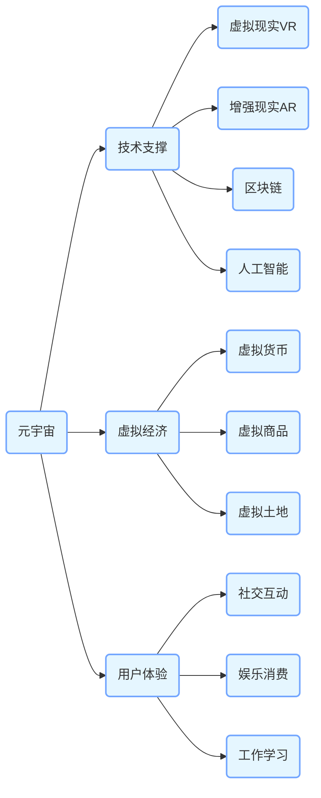

# 巴菲特 - 芒格的元宇宙投资观：虚拟经济的潜力与风险

> 关键词：巴菲特；芒格；元宇宙投资观；虚拟经济；潜力；风险

> 摘要：本文深入探讨了巴菲特 - 芒格的元宇宙投资观，剖析虚拟经济在元宇宙背景下的潜力与风险。通过阐述相关核心概念、算法原理、数学模型，结合项目实战案例，分析元宇宙投资在实际应用场景中的表现。同时，提供了学习资源、开发工具框架以及相关论文著作的推荐。最后，总结元宇宙投资的未来发展趋势与挑战，并解答常见问题，为投资者和相关从业者提供全面而深入的参考。

## 1. 背景介绍
### 1.1 目的和范围
本文章旨在深入研究巴菲特和芒格对于元宇宙投资的观点，全面分析虚拟经济在元宇宙领域所蕴含的潜力以及可能面临的风险。通过综合多方面的研究，包括核心概念、算法原理、数学模型等，为投资者、研究者和相关从业者提供一个系统的视角，帮助他们更好地理解元宇宙投资这一新兴领域。研究范围涵盖了元宇宙的基本概念、虚拟经济的构成要素、投资决策的理论基础以及实际应用场景等多个方面。

### 1.2 预期读者
本文预期读者主要包括对元宇宙投资感兴趣的投资者，无论是个人投资者还是机构投资者，都可以从本文中获取有价值的信息和决策参考。同时，从事金融、科技领域研究的学者和研究人员也能在文中找到相关理论和实践的探讨，为他们的研究提供新的思路。此外，科技行业的从业者，如元宇宙相关项目的开发者、运营者等，也可以通过本文了解投资视角下的元宇宙发展情况。

### 1.3 文档结构概述
本文将按照以下结构进行阐述：首先介绍核心概念与联系，明确元宇宙、虚拟经济等关键概念的定义和相互关系，并通过文本示意图和 Mermaid 流程图进行直观展示。接着讲解核心算法原理和具体操作步骤，使用 Python 源代码详细说明相关算法。然后介绍数学模型和公式，结合具体例子进行深入讲解。在项目实战部分，详细介绍开发环境搭建、源代码实现和代码解读。之后分析实际应用场景，探讨元宇宙投资在不同领域的应用。再推荐相关的工具和资源，包括学习资源、开发工具框架和论文著作。最后总结未来发展趋势与挑战，解答常见问题，并提供扩展阅读和参考资料。

### 1.4 术语表
#### 1.4.1 核心术语定义
- **元宇宙**：元宇宙是一个整合了多种技术，如虚拟现实（VR）、增强现实（AR）、区块链、人工智能等，构建出的一个虚拟的、与现实世界相互映射的数字世界。在元宇宙中，用户可以通过虚拟身份进行社交、工作、娱乐、消费等各种活动。
- **虚拟经济**：虚拟经济是指在虚拟世界中产生的经济活动和经济关系的总和。它以数字化的资产和交易为主要形式，包括虚拟货币、虚拟商品、虚拟土地等的交易和流通。
- **巴菲特 - 芒格投资理念**：以价值投资为核心，强调对企业内在价值的深入分析和评估。注重企业的长期稳定发展、优秀的管理团队、持续的盈利能力和合理的估值等因素。

#### 1.4.2 相关概念解释
- **虚拟现实（VR）**：通过计算机技术创建一个完全沉浸式的虚拟环境，用户佩戴 VR 设备后可以身临其境地体验这个虚拟世界。
- **增强现实（AR）**：将虚拟信息与现实场景相结合，通过手机、眼镜等设备，用户可以在现实环境中看到叠加的虚拟元素。
- **区块链**：一种去中心化的分布式账本技术，具有不可篡改、可追溯等特点，为元宇宙中的数字资产提供了安全可靠的交易和管理方式。

#### 1.4.3 缩略词列表
- **VR**：Virtual Reality（虚拟现实）
- **AR**：Augmented Reality（增强现实）
- **NFT**：Non - Fungible Token（非同质化代币）

## 2. 核心概念与联系
### 核心概念原理
元宇宙是一个融合了多种前沿技术的复杂概念。其核心原理在于通过虚拟现实、增强现实等技术为用户提供沉浸式的体验，让用户仿佛置身于一个全新的数字世界。在这个世界中，用户可以拥有自己的虚拟身份，与其他用户进行互动和交流。

虚拟经济则是元宇宙的重要组成部分。它基于数字化的资产和交易，通过区块链技术实现资产的确权和流通。虚拟货币作为虚拟经济的交易媒介，用于购买虚拟商品和服务。虚拟商品包括虚拟服装、虚拟艺术品等，而虚拟土地则是元宇宙中的一种稀缺资源，具有一定的投资价值。

巴菲特 - 芒格的投资理念强调对企业内在价值的判断。在元宇宙投资中，这意味着要评估元宇宙相关企业的盈利能力、市场竞争力、技术创新能力等因素，而不是仅仅关注市场的短期波动。

### 架构的文本示意图
```plaintext
元宇宙
|-- 技术支撑
|   |-- 虚拟现实（VR）
|   |-- 增强现实（AR）
|   |-- 区块链
|   |-- 人工智能
|-- 虚拟经济
|   |-- 虚拟货币
|   |-- 虚拟商品
|   |-- 虚拟土地
|-- 用户体验
|   |-- 社交互动
|   |-- 娱乐消费
|   |-- 工作学习
```

### Mermaid 流程图


## 3. 核心算法原理 & 具体操作步骤
### 算法原理讲解
在元宇宙投资中，一个重要的算法原理是基于财务数据的企业估值算法。这里我们以常见的现金流折现法（DCF）为例进行讲解。现金流折现法的核心思想是将企业未来的现金流按照一定的折现率折现到当前时刻，从而得到企业的内在价值。

### Python 源代码实现
```python
def dcf_valuation(free_cash_flows, discount_rate, terminal_growth_rate):
    """
    现金流折现法计算企业内在价值
    :param free_cash_flows: 未来各期的自由现金流列表
    :param discount_rate: 折现率
    :param terminal_growth_rate: 终期增长率
    :return: 企业内在价值
    """
    n = len(free_cash_flows)
    present_value = 0
    # 计算前 n 期现金流的现值
    for i in range(n):
        present_value += free_cash_flows[i] / ((1 + discount_rate) ** (i + 1))
    # 计算终值
    terminal_value = free_cash_flows[-1] * (1 + terminal_growth_rate) / (discount_rate - terminal_growth_rate)
    terminal_present_value = terminal_value / ((1 + discount_rate) ** n)
    # 计算企业内在价值
    intrinsic_value = present_value + terminal_present_value
    return intrinsic_value

# 示例数据
free_cash_flows = [100, 120, 150, 180, 200]
discount_rate = 0.1
terminal_growth_rate = 0.03

# 计算企业内在价值
intrinsic_value = dcf_valuation(free_cash_flows, discount_rate, terminal_growth_rate)
print(f"企业内在价值: {intrinsic_value}")
```
### 具体操作步骤
1. **数据收集**：收集元宇宙相关企业的财务报表，从中提取未来各期的自由现金流数据。自由现金流是指企业在满足了所有运营成本和资本支出后剩余的现金流量。
2. **确定折现率**：折现率反映了投资者对投资风险的预期。一般来说，元宇宙投资具有较高的风险，因此折现率也相对较高。可以参考市场上类似风险投资的回报率来确定折现率。
3. **确定终期增长率**：终期增长率是指企业在长期内的增长率。对于元宇宙企业，可以根据行业的发展趋势、市场规模等因素来估计终期增长率。
4. **计算内在价值**：将收集到的自由现金流数据、确定的折现率和终期增长率代入现金流折现法的公式中，计算企业的内在价值。
5. **投资决策**：将计算得到的内在价值与企业的当前市场价值进行比较。如果内在价值大于市场价值，则认为该企业被低估，具有投资价值；反之，则认为该企业被高估，不建议投资。

## 4. 数学模型和公式 & 详细讲解 & 举例说明
### 现金流折现法公式
现金流折现法的基本公式为：
$$V = \sum_{t = 1}^{n}\frac{FCF_t}{(1 + r)^t}+\frac{FCF_n(1 + g)}{(r - g)(1 + r)^n}$$
其中：
- $V$ 表示企业的内在价值
- $FCF_t$ 表示第 $t$ 期的自由现金流
- $r$ 表示折现率
- $n$ 表示预测期数
- $g$ 表示终期增长率

### 详细讲解
公式的前半部分 $\sum_{t = 1}^{n}\frac{FCF_t}{(1 + r)^t}$ 表示前 $n$ 期自由现金流的现值之和。通过将每一期的自由现金流按照折现率 $r$ 折现到当前时刻，考虑了货币的时间价值。

公式的后半部分 $\frac{FCF_n(1 + g)}{(r - g)(1 + r)^n}$ 表示终值的现值。终值是指企业在预测期结束后，按照终期增长率 $g$ 持续增长的价值。将终值按照折现率 $r$ 折现到当前时刻，得到终值的现值。

### 举例说明
假设一家元宇宙企业未来 5 年的自由现金流分别为 100 万元、120 万元、150 万元、180 万元和 200 万元，折现率为 10%，终期增长率为 3%。

首先，计算前 5 期自由现金流的现值：
- 第 1 期：$\frac{100}{(1 + 0.1)^1}\approx90.91$ 万元
- 第 2 期：$\frac{120}{(1 + 0.1)^2}\approx99.17$ 万元
- 第 3 期：$\frac{150}{(1 + 0.1)^3}\approx112.69$ 万元
- 第 4 期：$\frac{180}{(1 + 0.1)^4}\approx122.94$ 万元
- 第 5 期：$\frac{200}{(1 + 0.1)^5}\approx124.18$ 万元

前 5 期自由现金流现值之和为：$90.91 + 99.17 + 112.69 + 122.94 + 124.18 = 549.89$ 万元

然后，计算终值：
终值 $=\frac{200\times(1 + 0.03)}{0.1 - 0.03}\approx2942.86$ 万元

终值的现值为：$\frac{2942.86}{(1 + 0.1)^5}\approx1823.53$ 万元

最后，计算企业的内在价值：
内在价值 $= 549.89 + 1823.53 = 2373.42$ 万元

## 5. 项目实战：代码实际案例和详细解释说明
### 5.1 开发环境搭建
#### 安装 Python
首先，需要安装 Python 环境。可以从 Python 官方网站（https://www.python.org/downloads/）下载适合自己操作系统的 Python 安装包，并按照安装向导进行安装。

#### 安装必要的库
在本项目中，我们只使用了 Python 的内置库，因此不需要额外安装其他库。

### 5.2 源代码详细实现和代码解读
```python
def dcf_valuation(free_cash_flows, discount_rate, terminal_growth_rate):
    """
    现金流折现法计算企业内在价值
    :param free_cash_flows: 未来各期的自由现金流列表
    :param discount_rate: 折现率
    :param terminal_growth_rate: 终期增长率
    :return: 企业内在价值
    """
    n = len(free_cash_flows)
    present_value = 0
    # 计算前 n 期现金流的现值
    for i in range(n):
        present_value += free_cash_flows[i] / ((1 + discount_rate) ** (i + 1))
    # 计算终值
    terminal_value = free_cash_flows[-1] * (1 + terminal_growth_rate) / (discount_rate - terminal_growth_rate)
    terminal_present_value = terminal_value / ((1 + discount_rate) ** n)
    # 计算企业内在价值
    intrinsic_value = present_value + terminal_present_value
    return intrinsic_value

# 示例数据
free_cash_flows = [100, 120, 150, 180, 200]
discount_rate = 0.1
terminal_growth_rate = 0.03

# 计算企业内在价值
intrinsic_value = dcf_valuation(free_cash_flows, discount_rate, terminal_growth_rate)
print(f"企业内在价值: {intrinsic_value}")
```
#### 代码解读
1. **函数定义**：`dcf_valuation` 函数接受三个参数：`free_cash_flows` 表示未来各期的自由现金流列表，`discount_rate` 表示折现率，`terminal_growth_rate` 表示终期增长率。
2. **计算前 n 期现金流的现值**：通过 `for` 循环遍历自由现金流列表，将每一期的自由现金流按照折现率折现到当前时刻，并累加到 `present_value` 中。
3. **计算终值**：根据公式计算终值，并将终值折现到当前时刻，得到终值的现值。
4. **计算企业内在价值**：将前 n 期现金流的现值和终值的现值相加，得到企业的内在价值。
5. **示例数据和计算**：定义了示例数据，调用 `dcf_valuation` 函数计算企业的内在价值，并将结果打印输出。

### 5.3 代码解读与分析
#### 优点
- **简单易懂**：代码结构清晰，逻辑简单，易于理解和实现。
- **通用性强**：可以应用于不同的企业和行业，只需要提供相应的自由现金流数据、折现率和终期增长率即可。

#### 缺点
- **数据准确性要求高**：计算结果的准确性依赖于自由现金流数据、折现率和终期增长率的准确性。如果这些数据不准确，计算结果可能会有较大偏差。
- **假设条件较多**：现金流折现法基于一些假设条件，如企业的现金流会按照一定的增长率持续增长等。在实际情况中，这些假设可能并不成立。

## 6. 实际应用场景
### 投资决策
投资者可以使用现金流折现法等方法评估元宇宙相关企业的内在价值，从而做出投资决策。例如，如果计算得到的企业内在价值大于当前市场价值，投资者可以考虑买入该企业的股票；反之，则可以考虑卖出或不投资。

### 企业估值
在企业并购、重组等场景中，需要对元宇宙相关企业进行估值。现金流折现法可以作为一种重要的估值方法，帮助企业确定合理的交易价格。

### 项目评估
对于元宇宙相关的项目，如虚拟土地开发、虚拟商品交易平台等，可以使用现金流折现法评估项目的可行性和投资回报率。通过预测项目未来的现金流，计算项目的内在价值，判断项目是否值得投资。

## 7. 工具和资源推荐
### 7.1 学习资源推荐
#### 7.1.1 书籍推荐
- 《价值投资：从格雷厄姆到巴菲特》：这本书系统地介绍了价值投资的理论和方法，包括巴菲特和芒格的投资理念，对于理解元宇宙投资中的价值评估有很大帮助。
- 《区块链技术指南》：深入讲解了区块链的原理、技术和应用，元宇宙中的虚拟经济很大程度上依赖于区块链技术，这本书可以帮助读者了解相关技术背景。
- 《虚拟现实：从入门到精通》：详细介绍了虚拟现实技术的发展、原理和应用，对于理解元宇宙的沉浸式体验有重要意义。

#### 7.1.2 在线课程
- Coursera 上的“投资学原理”课程：由知名教授授课，涵盖了投资的基本理论和方法，包括企业估值、风险评估等内容。
- edX 上的“区块链基础”课程：全面介绍了区块链的基础知识和应用场景，对于了解元宇宙中的数字资产交易有很大帮助。
- Udemy 上的“元宇宙开发实战”课程：通过实际项目案例，讲解元宇宙的开发技术和流程。

#### 7.1.3 技术博客和网站
- Medium 上有很多关于元宇宙、区块链和投资的技术博客，作者们会分享最新的技术动态和投资观点。
- CoinDesk 是一个专注于区块链和加密货币的新闻网站，提供了丰富的行业资讯和分析报告。
- Metaverse Insider 专门关注元宇宙领域的发展，提供元宇宙项目的评测、分析和投资建议。

### 7.2 开发工具框架推荐
#### 7.2.1 IDE和编辑器
- PyCharm：是一款专业的 Python 集成开发环境，提供了丰富的代码编辑、调试和测试功能，适合用于开发基于 Python 的元宇宙投资分析工具。
- Visual Studio Code：是一款轻量级的代码编辑器，支持多种编程语言，具有丰富的插件扩展功能，可以满足不同的开发需求。

#### 7.2.2 调试和性能分析工具
- Python 的 `pdb` 模块：是 Python 内置的调试工具，可以帮助开发者在代码中设置断点、查看变量值等，方便调试代码。
- `cProfile` 模块：用于分析 Python 代码的性能，找出代码中的性能瓶颈，优化代码的执行效率。

#### 7.2.3 相关框架和库
- Pandas：是一个强大的数据分析库，提供了丰富的数据结构和数据处理功能，适合用于处理和分析元宇宙相关企业的财务数据。
- NumPy：是 Python 的一个基础科学计算库，提供了高效的数组操作和数学函数，可用于数值计算和算法实现。

### 7.3 相关论文著作推荐
#### 7.3.1 经典论文
- 《有效市场假说》：该论文提出了有效市场的概念，对于理解股票市场的定价机制和投资策略有重要意义。
- 《资本资产定价模型》：介绍了资本资产定价模型（CAPM），用于计算资产的预期回报率，在投资领域有广泛的应用。

#### 7.3.2 最新研究成果
- 《元宇宙：从概念到现实》：探讨了元宇宙的发展现状、技术挑战和未来趋势，是关于元宇宙研究的最新成果之一。
- 《虚拟经济与实体经济的互动关系研究》：研究了虚拟经济与实体经济之间的相互影响和作用机制，对于理解元宇宙中的虚拟经济有重要参考价值。

#### 7.3.3 应用案例分析
- 《元宇宙投资案例分析》：通过实际案例分析了元宇宙投资的策略、风险和回报，为投资者提供了实际操作的参考。
- 《虚拟土地开发项目案例研究》：详细介绍了虚拟土地开发项目的规划、运营和盈利模式，对于参与元宇宙项目开发的人员有很大的借鉴意义。

## 8. 总结：未来发展趋势与挑战
### 未来发展趋势
- **技术融合加速**：元宇宙将不断融合虚拟现实、增强现实、区块链、人工智能等多种技术，为用户提供更加丰富、真实的体验。例如，人工智能技术可以实现虚拟角色的智能交互，区块链技术可以保障数字资产的安全交易。
- **应用场景拓展**：元宇宙的应用场景将不断拓展，除了娱乐、社交领域，还将在教育、医疗、金融等领域得到广泛应用。例如，在教育领域，元宇宙可以提供沉浸式的学习环境，提高学习效果。
- **市场规模扩大**：随着技术的发展和用户认知度的提高，元宇宙市场规模将不断扩大。越来越多的企业和投资者将进入元宇宙领域，推动虚拟经济的繁荣发展。

### 挑战
- **技术瓶颈**：目前，元宇宙的发展还面临着一些技术瓶颈，如虚拟现实设备的沉浸感不够、网络延迟较高等问题。这些问题需要技术的不断创新和突破来解决。
- **法律法规不完善**：元宇宙中的虚拟经济涉及到数字资产交易、虚拟身份认证等问题，目前相关的法律法规还不完善。这可能导致一些违法行为的发生，如虚拟货币的非法集资、数字资产的侵权等。
- **投资风险高**：元宇宙是一个新兴领域，市场不确定性较大，投资风险较高。投资者需要具备较强的风险意识和专业知识，才能做出合理的投资决策。

## 9. 附录：常见问题与解答
### 问题 1：巴菲特和芒格对元宇宙投资持什么态度？
解答：巴菲特和芒格一直秉持价值投资理念，他们更关注企业的内在价值和长期盈利能力。目前，他们对元宇宙投资持谨慎态度，认为元宇宙行业还处于发展初期，存在较多不确定性和风险。

### 问题 2：现金流折现法适用于所有元宇宙企业吗？
解答：现金流折现法并不是适用于所有元宇宙企业。该方法基于企业未来现金流的预测，对于一些处于初创期、尚未实现盈利或现金流不稳定的元宇宙企业，该方法的适用性可能较差。在这种情况下，可以考虑使用其他估值方法，如市场比较法、成本法等。

### 问题 3：元宇宙中的虚拟货币投资有哪些风险？
解答：元宇宙中的虚拟货币投资存在多种风险。首先，虚拟货币市场波动较大，价格容易受到市场情绪、政策法规等因素的影响。其次，虚拟货币的交易缺乏有效的监管，容易出现市场操纵、诈骗等违法行为。此外，虚拟货币的技术安全性也存在一定风险，如黑客攻击、钱包被盗等。

## 10. 扩展阅读 & 参考资料
### 扩展阅读
- 《人类简史：从动物到上帝》：虽然这本书并非直接关于元宇宙投资，但它从宏观的角度探讨了人类的发展历程和未来趋势，有助于读者从更广阔的视野理解元宇宙的出现和发展。
- 《失控：全人类的最终命运和结局》：书中提出了许多关于技术、社会和生物系统的深刻见解，对于思考元宇宙的未来发展具有一定的启示作用。

### 参考资料
- [1] 巴菲特致股东的信. 机械工业出版社.
- [2] 查理·芒格的智慧：投资的格栅理论. 中信出版社.
- [3] 元宇宙发展白皮书. 中国信息通信研究院.

作者：AI天才研究院/AI Genius Institute & 禅与计算机程序设计艺术 /Zen And The Art of Computer Programming