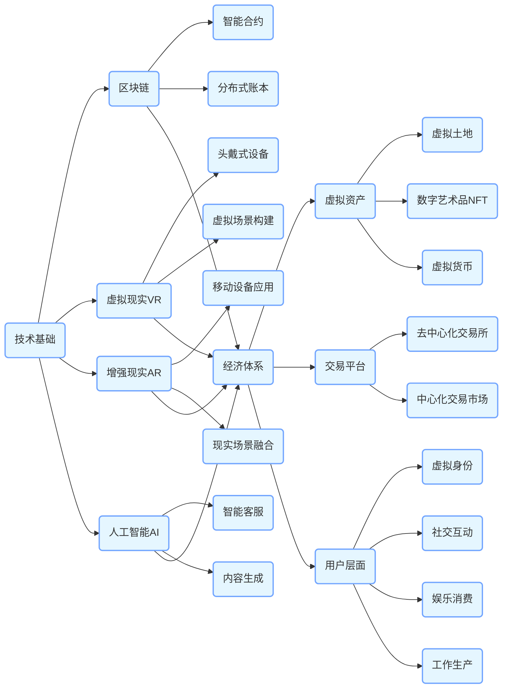

# 巴菲特 - 芒格的元宇宙经济投资策略：虚拟与现实的融合

> 关键词：巴菲特、芒格、元宇宙经济、投资策略、虚拟与现实融合

> 摘要：本文聚焦于巴菲特 - 芒格的投资理念在元宇宙经济领域的应用与拓展。通过深入剖析元宇宙经济的核心概念、运行机制，探讨如何将巴菲特和芒格传统的价值投资策略与元宇宙这一新兴领域相结合。文章详细阐述了元宇宙经济中的核心算法原理、数学模型，通过实际项目案例展示投资策略的具体实施，并分析其在不同场景下的应用。同时，推荐了相关的学习资源、开发工具和研究论文，最后对元宇宙经济投资的未来发展趋势与挑战进行总结，旨在为投资者提供全面且深入的参考。

## 1. 背景介绍 

### 1.1 目的和范围
本文章的主要目的是探讨在元宇宙经济这一新兴领域中，如何借鉴巴菲特和芒格的经典投资策略进行投资决策。元宇宙经济作为融合了虚拟现实、区块链、人工智能等多种前沿技术的全新经济形态，蕴含着巨大的投资潜力，但同时也伴随着较高的不确定性和风险。我们将分析巴菲特和芒格投资理念的核心要素，并研究如何将其应用于元宇宙经济中的虚拟资产、数字服务、平台建设等各个方面，以寻找具有长期价值的投资机会。文章的范围涵盖元宇宙经济的基本概念、核心算法、数学模型、实际应用案例，以及相关的学习资源和工具推荐等内容。

### 1.2 预期读者
本文预期读者主要包括对元宇宙经济投资感兴趣的个人投资者、金融机构从业者、科技行业的创业者和投资者，以及对投资理论和新兴技术有研究需求的学者和学生。无论您是初涉投资领域，希望了解元宇宙经济投资的基础知识，还是有一定投资经验，想探索如何将传统投资策略应用于新兴领域，都能从本文中获得有价值的信息和启发。

### 1.3 文档结构概述
本文将按照以下结构进行阐述：首先介绍元宇宙经济的背景知识，包括核心概念、相关术语和文档整体结构；接着深入探讨元宇宙经济中的核心概念及其相互联系，通过文本示意图和 Mermaid 流程图进行清晰展示；然后详细讲解核心算法原理和具体操作步骤，并使用 Python 代码进行示例；随后介绍元宇宙经济中的数学模型和公式，并通过具体例子进行说明；再通过实际项目案例展示投资策略的具体实施和代码解读；分析元宇宙经济的实际应用场景；推荐相关的学习资源、开发工具和研究论文；最后对元宇宙经济投资的未来发展趋势与挑战进行总结，并提供常见问题解答和扩展阅读参考资料。

### 1.4 术语表

#### 1.4.1 核心术语定义
- **元宇宙（Metaverse）**：是一个基于虚拟现实、增强现实、区块链等技术构建的，与现实世界相互映射、相互影响的虚拟世界，用户可以在其中进行社交、娱乐、工作、交易等各种活动。
- **价值投资（Value Investing）**：巴菲特和芒格所倡导的投资理念，强调通过分析企业的内在价值，寻找被市场低估的股票或资产进行长期投资。
- **虚拟资产（Virtual Assets）**：存在于元宇宙中的数字化资产，如虚拟土地、数字艺术品、虚拟货币等，具有一定的经济价值和交易属性。
- **智能合约（Smart Contracts）**：一种基于区块链技术的自动化合约，能够在满足预设条件时自动执行，确保交易的透明性和公正性。
- **NFT（Non - Fungible Token）**：非同质化代币，用于表示元宇宙中独特的数字资产，每个 NFT 都具有唯一的标识和不可替代性。

#### 1.4.2 相关概念解释
- **虚拟现实（VR）**：利用计算机技术生成的一种模拟环境，用户通过佩戴特定设备可以身临其境地体验虚拟世界。
- **增强现实（AR）**：将虚拟信息与现实场景相结合，通过手机、眼镜等设备呈现给用户，增强用户对现实世界的感知和交互。
- **区块链（Blockchain）**：一种分布式账本技术，具有去中心化、不可篡改、可追溯等特点，为元宇宙中的资产交易和数据安全提供保障。
- **人工智能（AI）**：赋予计算机系统智能，使其能够模拟人类的思维和行为，在元宇宙中可用于实现智能客服、内容生成、场景交互等功能。

#### 1.4.3 缩略词列表
- **VR**：Virtual Reality
- **AR**：Augmented Reality
- **NFT**：Non - Fungible Token
- **AI**：Artificial Intelligence

## 2. 核心概念与联系 

### 核心概念原理
元宇宙经济的核心概念主要围绕虚拟世界与现实世界的融合展开。在元宇宙中，用户可以拥有自己的虚拟身份，参与各种虚拟活动，并通过虚拟资产的交易和增值实现经济收益。其原理基于多种技术的协同作用，包括区块链技术确保资产的所有权和交易记录的安全透明，虚拟现实和增强现实技术提供沉浸式的体验环境，人工智能技术实现智能交互和内容生成。

巴菲特和芒格的价值投资理念强调寻找具有持续竞争优势和稳定现金流的企业进行投资。在元宇宙经济中，这意味着要关注那些在虚拟世界中具有强大用户基础、创新商业模式和可持续发展能力的项目和平台。例如，一个拥有大量活跃用户的元宇宙社交平台，通过提供广告、虚拟商品销售等多元化的盈利模式，就可能具有较高的投资价值。

### 架构的文本示意图
```plaintext
元宇宙经济架构
|-- 技术基础
|   |-- 区块链
|   |   |-- 智能合约
|   |   |-- 分布式账本
|   |-- 虚拟现实（VR）
|   |   |-- 头戴式设备
|   |   |-- 虚拟场景构建
|   |-- 增强现实（AR）
|   |   |-- 移动设备应用
|   |   |-- 现实场景融合
|   |-- 人工智能（AI）
|       |-- 智能客服
|       |-- 内容生成
|-- 经济体系
|   |-- 虚拟资产
|   |   |-- 虚拟土地
|   |   |-- 数字艺术品（NFT）
|   |   |-- 虚拟货币
|   |-- 交易平台
|       |-- 去中心化交易所
|       |-- 中心化交易市场
|-- 用户层面
|   |-- 虚拟身份
|   |-- 社交互动
|   |-- 娱乐消费
|   |-- 工作生产
```

### Mermaid 流程图


这个流程图展示了元宇宙经济的整体架构，从技术基础出发，支撑起经济体系的构建，最终服务于用户层面的各种需求。各个部分之间相互关联，共同构成了元宇宙经济的生态系统。

## 3. 核心算法原理 & 具体操作步骤 

### 核心算法原理
在元宇宙经济投资中，一个重要的算法原理是基于数据分析和机器学习的价值评估算法。其核心思想是通过收集和分析元宇宙项目的各种数据，如用户活跃度、交易数据、社区影响力等，来评估项目的内在价值和发展潜力。

以下是一个简化的价值评估算法原理：
- **数据收集**：收集元宇宙项目的相关数据，包括用户注册数量、日活跃用户数、月留存率、虚拟资产交易量、交易金额等。
- **特征提取**：从收集到的数据中提取有代表性的特征，例如用户增长速度、交易频率、资产价格波动等。
- **模型训练**：使用机器学习算法，如线性回归、决策树、神经网络等，对提取的特征进行训练，建立价值评估模型。
- **价值预测**：将新的项目数据输入到训练好的模型中，预测项目的价值得分。

### 具体操作步骤及 Python 代码实现

#### 步骤 1：数据收集
假设我们已经从某个元宇宙项目的 API 接口获取了用户注册数量、日活跃用户数和虚拟资产交易量的数据，并存储在一个 CSV 文件中。以下是读取数据的 Python 代码：
```python
import pandas as pd

# 读取数据
data = pd.read_csv('metaverse_project_data.csv')
print(data.head())
```

#### 步骤 2：特征提取
我们提取用户注册数量的增长率、日活跃用户数的占比和虚拟资产交易量的变化率作为特征。
```python
# 计算用户注册数量的增长率
data['registration_growth_rate'] = data['registration_count'].pct_change()

# 计算日活跃用户数的占比
data['active_user_ratio'] = data['active_user_count'] / data['registration_count']

# 计算虚拟资产交易量的变化率
data['transaction_volume_change_rate'] = data['transaction_volume'].pct_change()

# 去除包含 NaN 值的行
data = data.dropna()

# 提取特征和目标变量
features = data[['registration_growth_rate', 'active_user_ratio', 'transaction_volume_change_rate']]
target = data['project_value']
```

#### 步骤 3：模型训练
使用线性回归模型进行训练。
```python
from sklearn.model_selection import train_test_split
from sklearn.linear_model import LinearRegression

# 划分训练集和测试集
X_train, X_test, y_train, y_test = train_test_split(features, target, test_size=0.2, random_state=42)

# 创建线性回归模型
model = LinearRegression()

# 训练模型
model.fit(X_train, y_train)
```

#### 步骤 4：价值预测
使用训练好的模型对测试集进行预测。
```python
# 预测
predictions = model.predict(X_test)

# 输出预测结果
print("预测结果：", predictions)
```

通过以上步骤，我们可以利用机器学习算法对元宇宙项目的价值进行评估和预测，为投资决策提供参考。

## 4. 数学模型和公式 & 详细讲解 & 举例说明 

### 数学模型和公式
在元宇宙经济投资中，我们可以使用多种数学模型来评估项目的价值和风险。这里介绍一个基于现金流折现模型（DCF）的简化版本。

现金流折现模型的基本公式为：
$$V = \sum_{t = 1}^{n} \frac{CF_t}{(1 + r)^t}$$
其中：
- $V$ 表示项目的内在价值
- $CF_t$ 表示第 $t$ 期的现金流
- $r$ 表示折现率
- $n$ 表示预测的期数

### 详细讲解
现金流折现模型的核心思想是将项目未来各期的现金流按照一定的折现率折现到当前时刻，以反映资金的时间价值。折现率 $r$ 通常考虑了市场利率、项目的风险水平等因素。较高的折现率意味着对未来现金流的估值较低，因为未来的现金流存在更大的不确定性。

在元宇宙经济中，现金流 $CF_t$ 可以包括虚拟资产的销售收入、广告收入、平台服务费用等。预测的期数 $n$ 可以根据项目的发展阶段和预期寿命来确定。

### 举例说明
假设我们要评估一个元宇宙社交平台项目的价值。根据市场调研和项目规划，我们预测该平台在未来 3 年的现金流分别为：第 1 年 $CF_1 = 100$ 万元，第 2 年 $CF_2 = 200$ 万元，第 3 年 $CF_3 = 300$ 万元。同时，考虑到元宇宙项目的高风险性，我们确定折现率 $r = 20\%$。

根据现金流折现模型，该项目的内在价值为：
$$
\begin{align*}
V &= \frac{CF_1}{(1 + r)^1} + \frac{CF_2}{(1 + r)^2} + \frac{CF_3}{(1 + r)^3}\\
&= \frac{100}{(1 + 0.2)^1} + \frac{200}{(1 + 0.2)^2} + \frac{300}{(1 + 0.2)^3}\\
&= \frac{100}{1.2} + \frac{200}{1.44} + \frac{300}{1.728}\\
&\approx 83.33 + 138.89 + 173.61\\
&= 395.83 \text{（万元）}
\end{align*}
$$

通过计算得到该元宇宙社交平台项目的内在价值约为 395.83 万元。如果该项目的市场价格低于这个价值，那么从价值投资的角度来看，可能是一个具有投资价值的项目。

## 5. 项目实战：代码实际案例和详细解释说明 

### 5.1 开发环境搭建
在进行元宇宙经济投资项目实战时，我们需要搭建相应的开发环境。以下是具体的搭建步骤：

#### 安装 Python
Python 是一种广泛使用的编程语言，在数据分析、机器学习等领域有很多强大的库。我们可以从 Python 官方网站（https://www.python.org/downloads/）下载并安装适合自己操作系统的 Python 版本。建议安装 Python 3.7 及以上版本。

#### 安装必要的 Python 库
我们需要安装一些常用的 Python 库，如 Pandas、NumPy、Scikit - learn 等。可以使用以下命令进行安装：
```sh
pip install pandas numpy scikit-learn
```

#### 选择开发工具
可以选择使用 Jupyter Notebook 或 PyCharm 等开发工具。Jupyter Notebook 适合进行交互式的数据探索和模型开发，而 PyCharm 则是一个功能强大的 Python 集成开发环境，适合进行大型项目的开发。

### 5.2 源代码详细实现和代码解读
以下是一个完整的元宇宙项目价值评估的代码示例：
```python
import pandas as pd
import numpy as np
from sklearn.model_selection import train_test_split
from sklearn.linear_model import LinearRegression
from sklearn.metrics import mean_squared_error

# 步骤 1：数据收集
data = pd.read_csv('metaverse_project_data.csv')

# 步骤 2：数据预处理
# 计算用户注册数量的增长率
data['registration_growth_rate'] = data['registration_count'].pct_change()

# 计算日活跃用户数的占比
data['active_user_ratio'] = data['active_user_count'] / data['registration_count']

# 计算虚拟资产交易量的变化率
data['transaction_volume_change_rate'] = data['transaction_volume'].pct_change()

# 去除包含 NaN 值的行
data = data.dropna()

# 提取特征和目标变量
features = data[['registration_growth_rate', 'active_user_ratio', 'transaction_volume_change_rate']]
target = data['project_value']

# 步骤 3：划分训练集和测试集
X_train, X_test, y_train, y_test = train_test_split(features, target, test_size=0.2, random_state=42)

# 步骤 4：创建并训练线性回归模型
model = LinearRegression()
model.fit(X_train, y_train)

# 步骤 5：模型预测
predictions = model.predict(X_test)

# 步骤 6：模型评估
mse = mean_squared_error(y_test, predictions)
rmse = np.sqrt(mse)
print(f"均方误差 (MSE): {mse}")
print(f"均方根误差 (RMSE): {rmse}")

# 步骤 7：可视化预测结果（可选）
import matplotlib.pyplot as plt

plt.scatter(y_test, predictions)
plt.xlabel('实际值')
plt.ylabel('预测值')
plt.title('实际值 vs 预测值')
plt.show()
```

### 代码解读与分析
- **数据收集**：使用 Pandas 库的 `read_csv` 函数从 CSV 文件中读取元宇宙项目的数据。
- **数据预处理**：计算用户注册数量的增长率、日活跃用户数的占比和虚拟资产交易量的变化率，并去除包含 NaN 值的行，以确保数据的质量。
- **划分训练集和测试集**：使用 `train_test_split` 函数将数据集划分为训练集和测试集，其中测试集占比为 20%。
- **模型训练**：创建线性回归模型并使用训练集进行训练。
- **模型预测**：使用训练好的模型对测试集进行预测。
- **模型评估**：使用均方误差（MSE）和均方根误差（RMSE）来评估模型的性能。均方误差衡量了预测值与实际值之间的平均误差平方，均方根误差则是均方误差的平方根，更直观地反映了预测误差的大小。
- **可视化预测结果**：使用 Matplotlib 库绘制实际值与预测值的散点图，帮助我们直观地观察模型的预测效果。

## 6. 实际应用场景 
### 虚拟土地投资
在元宇宙中，虚拟土地是一种重要的虚拟资产。投资者可以购买虚拟土地，然后通过开发建设，如建造商业建筑、娱乐设施等，吸引用户和商家入驻，从而实现土地价值的增值。例如，Decentraland 是一个知名的元宇宙平台，用户可以在其中购买和开发虚拟土地。一些投资者通过购买具有地理位置优势或开发潜力的虚拟土地，在土地价格上涨后出售，获得了可观的收益。

### 数字艺术品收藏与交易
NFT 的出现使得数字艺术品在元宇宙中具有了独特的价值和交易属性。艺术家可以将自己的作品以 NFT 的形式发布到元宇宙平台上，投资者可以购买和收藏这些数字艺术品。随着数字艺术市场的发展和艺术品知名度的提高，其价值可能会大幅增长。例如，一些知名艺术家的 NFT 作品在拍卖会上拍出了数百万美元的高价。

### 虚拟品牌营销
现实世界中的品牌可以在元宇宙中建立自己的虚拟形象和店铺，开展营销活动。例如，一些时尚品牌在元宇宙中举办虚拟时装秀，吸引用户参与和购买虚拟服装。通过这种方式，品牌可以扩大影响力，开拓新的市场，同时投资者也可以关注那些在元宇宙营销方面具有创新能力和发展潜力的品牌项目。

### 元宇宙游戏投资
元宇宙游戏是元宇宙经济的重要组成部分。投资者可以关注那些具有优质游戏内容、庞大用户基础和良好经济系统的元宇宙游戏项目。一些游戏允许玩家在游戏中通过完成任务、交易物品等方式获得虚拟资产，这些虚拟资产可以在游戏内或外部市场进行交易。例如，Axie Infinity 是一款热门的元宇宙游戏，玩家可以通过繁殖和战斗 Axie 宠物来赚取游戏内代币，这些代币可以兑换成现实货币。

## 7. 工具和资源推荐

### 7.1 学习资源推荐

#### 7.1.1 书籍推荐
- 《巴菲特致股东的信：投资者和公司高管教程》：这本书收录了巴菲特多年来致股东的信，详细阐述了他的投资理念和方法，是价值投资领域的经典之作。
- 《穷查理宝典：查理·芒格的智慧箴言录》：介绍了芒格的投资哲学、思维模型和人生经验，对于理解如何进行理性投资和决策具有重要的启示作用。
- 《元宇宙通证》：全面介绍了元宇宙的概念、技术、经济体系和投资机会，是了解元宇宙经济的入门书籍。

#### 7.1.2 在线课程
- Coursera 上的 “投资学原理” 课程：由知名大学教授授课，系统讲解投资学的基本原理和方法，包括价值投资、风险评估等内容。
- Udemy 上的 “元宇宙开发与投资” 课程：专门针对元宇宙领域，介绍元宇宙的技术架构、商业模式和投资策略。

#### 7.1.3 技术博客和网站
- 36氪：提供科技行业的最新资讯和深度分析，包括元宇宙领域的动态和投资机会。
- 巴比特：专注于区块链和加密货币领域，对元宇宙经济中的区块链技术和虚拟资产交易有深入报道。
- Medium 上的一些科技博客：如 Towards Data Science 等，经常发布关于数据分析、机器学习在投资领域应用的文章。

### 7.2 开发工具框架推荐

#### 7.2.1 IDE和编辑器
- Jupyter Notebook：适合进行交互式的数据探索和模型开发，支持多种编程语言，方便进行数据分析和机器学习实验。
- PyCharm：功能强大的 Python 集成开发环境，提供代码编辑、调试、版本控制等一系列功能，适合进行大型 Python 项目的开发。

#### 7.2.2 调试和性能分析工具
- NumPy 和 Pandas 的内置调试功能：在进行数据处理和分析时，NumPy 和 Pandas 提供了一些方便的调试工具，如数据查看、统计分析等。
- Scikit - learn 的模型评估工具：可以用于评估机器学习模型的性能，如计算准确率、召回率、均方误差等指标。

#### 7.2.3 相关框架和库
- TensorFlow 和 PyTorch：用于构建和训练深度学习模型，在元宇宙经济的数据分析和预测中具有广泛的应用。
- Web3.py：一个 Python 库，用于与以太坊区块链进行交互，方便开发基于区块链的元宇宙应用。

### 7.3 相关论文著作推荐

#### 7.3.1 经典论文
- “The Intelligent Investor” by Benjamin Graham：本杰明·格雷厄姆的经典著作，奠定了价值投资的理论基础，对巴菲特和芒格的投资理念产生了深远影响。
- “Efficient Capital Markets: A Review of Theory and Empirical Work” by Eugene F. Fama：探讨了资本市场的有效性问题，对投资决策和市场分析具有重要的指导意义。

#### 7.3.2 最新研究成果
- 关于元宇宙经济的学术论文：可以通过 Google Scholar、IEEE Xplore 等学术数据库搜索，了解元宇宙经济的最新研究进展和理论模型。
- 区块链和人工智能在元宇宙中的应用研究：关注这些领域的最新研究成果，有助于理解元宇宙经济的技术支撑和发展趋势。

#### 7.3.3 应用案例分析
- 一些知名元宇宙项目的案例研究：如 Decentraland、The Sandbox 等项目的分析报告，了解它们的商业模式、运营策略和投资价值。
- 传统企业进军元宇宙的案例分析：研究现实世界中的企业如何在元宇宙中开展业务，以及面临的机遇和挑战。

## 8. 总结：未来发展趋势与挑战

### 未来发展趋势
- **技术融合加速**：元宇宙经济将不断融合更多的前沿技术，如 5G、物联网、量子计算等。5G 技术的高速稳定传输将提升元宇宙的实时交互体验，物联网技术可以实现虚拟世界与现实世界的更紧密连接，量子计算则可能为元宇宙中的复杂计算和数据处理提供强大支持。
- **应用场景拓展**：元宇宙的应用场景将不断拓展，除了现有的游戏、社交、艺术等领域，还将在教育、医疗、工业等领域得到广泛应用。例如，在教育领域，元宇宙可以提供沉浸式的学习环境，提高学习效果；在医疗领域，元宇宙可以用于远程医疗、手术模拟等。
- **监管逐步完善**：随着元宇宙经济的发展，监管机构将加强对其的监管。未来可能会出台一系列相关的法律法规，规范虚拟资产交易、用户权益保护等方面的行为，促进元宇宙经济的健康有序发展。
- **投资多元化**：投资者对元宇宙经济的关注度将不断提高，投资方式也将更加多元化。除了直接投资虚拟资产和元宇宙项目，还可能出现基于元宇宙经济的基金、衍生品等投资产品。

### 挑战
- **技术瓶颈**：目前元宇宙技术还存在一些瓶颈，如虚拟现实设备的舒适度和沉浸感有待提高，区块链技术的性能和可扩展性需要进一步优化。解决这些技术问题需要大量的研发投入和时间。
- **安全风险**：元宇宙经济涉及大量的虚拟资产和用户数据，安全风险不容忽视。虚拟资产的交易安全、用户隐私保护等问题需要得到有效解决，否则可能会影响投资者的信心和元宇宙经济的发展。
- **市场泡沫**：由于元宇宙概念的火爆，市场上可能会出现一些炒作和泡沫现象。一些项目可能缺乏实际的商业价值和可持续发展能力，投资者需要谨慎辨别，避免陷入投资陷阱。
- **社会伦理问题**：元宇宙的发展可能会带来一些社会伦理问题，如虚拟身份的滥用、虚拟世界与现实世界的界限模糊等。如何引导元宇宙的健康发展，使其符合社会伦理和道德规范，是一个需要解决的重要问题。

## 9. 附录：常见问题与解答

### 问题 1：元宇宙经济投资与传统投资有什么区别？
元宇宙经济投资主要针对虚拟世界中的资产和项目，具有较高的创新性和不确定性。与传统投资相比，元宇宙经济投资的市场波动性更大，技术依赖性更强，投资标的的价值评估也更加复杂。例如，传统投资中的股票、债券等有较为成熟的估值方法和市场体系，而元宇宙中的虚拟资产和项目可能还没有形成统一的估值标准。

### 问题 2：如何评估元宇宙项目的投资价值？
可以从多个方面评估元宇宙项目的投资价值，包括项目的技术实力、团队背景、用户基础、商业模式、市场前景等。同时，可以使用一些数据分析和机器学习算法，如本文介绍的价值评估算法和现金流折现模型，来辅助评估项目的内在价值。此外，还需要关注项目的合规性和可持续发展能力。

### 问题 3：投资元宇宙经济有哪些风险？
投资元宇宙经济的风险主要包括技术风险、市场风险、监管风险和安全风险等。技术风险是指元宇宙技术可能无法达到预期的发展水平，影响项目的推进和应用；市场风险表现为市场的波动性和不确定性，可能导致虚拟资产价格大幅波动；监管风险是指政府可能出台相关政策对元宇宙经济进行监管，影响项目的发展；安全风险涉及虚拟资产的交易安全和用户数据的保护。

### 问题 4：普通人如何参与元宇宙经济投资？
普通人可以通过多种方式参与元宇宙经济投资。例如，可以购买一些与元宇宙相关的股票或基金，间接参与元宇宙经济的发展；也可以关注一些元宇宙平台上的虚拟资产交易，如购买虚拟土地、数字艺术品等，但需要注意投资风险。此外，还可以参与一些元宇宙项目的早期投资，但这需要具备一定的专业知识和风险承受能力。

## 10. 扩展阅读 & 参考资料
- 《元宇宙：通往无限可能的未来》
- 《区块链技术原理与应用》
- 36氪官网（https://36kr.com/）
- 巴比特官网（https://www.8btc.com/）
- Google Scholar（https://scholar.google.com/）
- IEEE Xplore（https://ieeexplore.ieee.org/）

作者：AI天才研究院/AI Genius Institute & 禅与计算机程序设计艺术 /Zen And The Art of Computer Programming