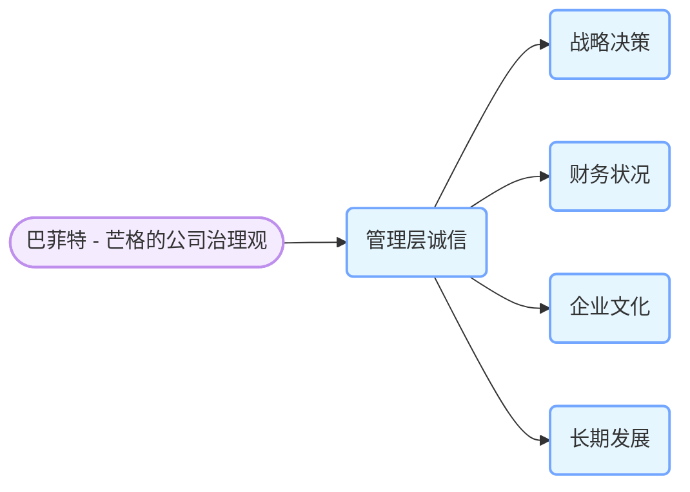

# 巴菲特 - 芒格的公司治理观：管理层诚信的重要性

> 关键词：巴菲特、芒格、公司治理观、管理层诚信、企业价值

> 摘要：本文深入探讨了巴菲特和芒格的公司治理观中管理层诚信的重要性。通过对背景知识的介绍，阐述了核心概念及联系，分析了管理层诚信影响公司治理的原理和步骤，结合数学模型进行解释，并给出项目实战案例。同时，介绍了管理层诚信在实际中的应用场景，推荐了相关学习资源、开发工具和论文著作。最后总结了未来发展趋势与挑战，解答常见问题并提供扩展阅读和参考资料，旨在让读者全面理解巴菲特 - 芒格公司治理观中管理层诚信的关键意义。

## 1. 背景介绍 
### 1.1 目的和范围
本文旨在深入剖析巴菲特和芒格所倡导的公司治理观中管理层诚信的重要性。研究范围涵盖了管理层诚信在公司治理各个层面的体现，包括对公司战略决策、财务状况、企业文化以及长期发展的影响。通过对相关理论和实际案例的分析，揭示管理层诚信与企业成功之间的内在联系，为企业管理者、投资者以及对公司治理感兴趣的人士提供有价值的参考。

### 1.2 预期读者
本文的预期读者主要包括企业管理层，他们可以从巴菲特和芒格的公司治理观中汲取经验，提升自身管理水平和企业治理质量；投资者，有助于他们在选择投资对象时，将管理层诚信作为重要的考量因素；以及对公司治理、商业伦理等领域感兴趣的学者和研究人员，为他们的学术研究提供新的视角和思路。

### 1.3 文档结构概述
本文首先介绍了研究的背景信息，包括目的、预期读者和文档结构。接着阐述了核心概念，即巴菲特 - 芒格的公司治理观以及管理层诚信的定义和两者之间的联系，并通过文本示意图和 Mermaid 流程图进行展示。然后详细讲解了管理层诚信影响公司治理的核心算法原理和具体操作步骤，同时运用数学模型和公式进行深入分析，并举例说明。之后通过项目实战案例，介绍了开发环境搭建、源代码实现和代码解读。再探讨了管理层诚信在实际中的应用场景。随后推荐了相关的学习资源、开发工具和论文著作。最后总结了未来发展趋势与挑战，解答常见问题并提供扩展阅读和参考资料。

### 1.4 术语表
#### 1.4.1 核心术语定义
- **巴菲特 - 芒格的公司治理观**：由沃伦·巴菲特（Warren Buffett）和查理·芒格（Charlie Munger）提出的一套关于公司治理的理念和方法，强调股东利益最大化、管理层的诚信和能力、企业的长期稳定发展等重要原则。
- **管理层诚信**：指公司管理层在经营管理过程中，遵守道德规范和法律法规，秉持诚实、守信、正直的态度，如实披露公司信息，不进行欺诈、舞弊等不当行为。

#### 1.4.2 相关概念解释
- **公司治理**：是指通过一套包括正式或非正式的、内部或外部的制度或机制来协调公司与所有利益相关者之间的利益关系，以保证公司决策的科学性和公正性，从而最终维护公司各方面的利益。
- **股东利益最大化**：企业的经营目标是使股东的财富达到最大，通过合理的经营决策和资源配置，提高公司的盈利能力和市场价值。

#### 1.4.3 缩略词列表
无

## 2. 核心概念与联系 
### 核心概念原理
巴菲特和芒格认为，公司治理是确保企业长期稳定发展的关键因素，而管理层诚信则是公司治理的基石。管理层作为公司的核心决策和执行团队，其诚信与否直接影响到公司的各个方面。

诚信的管理层会以股东利益为出发点，做出符合公司长远利益的决策。他们会如实披露公司的财务状况和经营情况，让投资者能够准确了解公司的真实情况，从而做出合理的投资决策。同时，诚信的管理层能够建立良好的企业文化，吸引和留住优秀的员工，提高团队的凝聚力和战斗力。

相反，不诚信的管理层可能会为了个人私利而进行财务造假、内幕交易等违法行为，损害股东的利益。这种行为不仅会导致公司的声誉受损，还可能引发法律风险，最终影响公司的生存和发展。

### 文本示意图
```plaintext
巴菲特 - 芒格的公司治理观
        |
        |  核心要素
        |
        |----------------- 管理层诚信
        |                   |
        |                   |  影响方面
        |                   |
        |                   |---------------- 战略决策
        |                   |---------------- 财务状况
        |                   |---------------- 企业文化
        |                   |---------------- 长期发展
```

### Mermaid 流程图


## 3. 核心算法原理 & 具体操作步骤 
### 核心算法原理
我们可以将管理层诚信对公司治理的影响看作一个复杂的系统，其中涉及多个变量和相互关系。为了简化分析，我们可以建立一个基于评分的模型。假设我们用 $I$ 表示管理层诚信指数，其取值范围为 $[0, 1]$，$0$ 表示完全不诚信，$1$ 表示完全诚信。

同时，我们定义几个关键的公司治理指标，如战略决策质量 $Q_s$、财务透明度 $T_f$、企业文化凝聚力 $C_c$ 和长期发展潜力 $P_l$。这些指标的取值范围也为 $[0, 1]$。

我们可以认为这些指标与管理层诚信指数之间存在线性关系，即：

$Q_s = a_1I + b_1$

$T_f = a_2I + b_2$

$C_c = a_3I + b_3$

$P_l = a_4I + b_4$

其中，$a_1, a_2, a_3, a_4$ 为系数，反映了管理层诚信对各指标的影响程度；$b_1, b_2, b_3, b_4$ 为常数项。

### Python 源代码实现
```python
# 定义管理层诚信指数
I = 0.8

# 定义系数和常数项
a1 = 0.7
b1 = 0.1
a2 = 0.8
b2 = 0.1
a3 = 0.6
b3 = 0.2
a4 = 0.7
b4 = 0.1

# 计算各公司治理指标
Q_s = a1 * I + b1
T_f = a2 * I + b2
C_c = a3 * I + b3
P_l = a4 * I + b4

# 输出结果
print(f"战略决策质量: {Q_s}")
print(f"财务透明度: {T_f}")
print(f"企业文化凝聚力: {C_c}")
print(f"长期发展潜力: {P_l}")
```

### 具体操作步骤
1. **确定管理层诚信指数**：通过对管理层的行为、历史记录、声誉等方面进行评估，确定管理层诚信指数 $I$ 的值。
2. **确定系数和常数项**：根据行业经验、历史数据等，确定系数 $a_1, a_2, a_3, a_4$ 和常数项 $b_1, b_2, b_3, b_4$ 的值。
3. **计算公司治理指标**：将管理层诚信指数代入上述公式，计算战略决策质量 $Q_s$、财务透明度 $T_f$、企业文化凝聚力 $C_c$ 和长期发展潜力 $P_l$ 的值。
4. **分析结果**：根据计算结果，分析管理层诚信对公司治理各方面的影响，为公司的决策提供参考。

## 4. 数学模型和公式 & 详细讲解 & 举例说明 
### 数学模型和公式
如前面所述，我们建立的数学模型为：

$Q_s = a_1I + b_1$

$T_f = a_2I + b_2$

$C_c = a_3I + b_3$

$P_l = a_4I + b_4$

其中，$I$ 为管理层诚信指数，$Q_s$ 为战略决策质量，$T_f$ 为财务透明度，$C_c$ 为企业文化凝聚力，$P_l$ 为长期发展潜力，$a_1, a_2, a_3, a_4$ 为系数，$b_1, b_2, b_3, b_4$ 为常数项。

### 详细讲解
- **系数的意义**：系数 $a_1, a_2, a_3, a_4$ 反映了管理层诚信对各公司治理指标的影响程度。例如，$a_1$ 越大，说明管理层诚信对战略决策质量的影响越大。
- **常数项的意义**：常数项 $b_1, b_2, b_3, b_4$ 表示即使管理层诚信指数为 $0$，各公司治理指标仍然存在的基础值。这可能是由于公司的其他因素，如行业环境、市场竞争等的影响。

### 举例说明
假设我们有两家公司 A 和 B，其管理层诚信指数分别为 $I_A = 0.9$ 和 $I_B = 0.3$。同时，我们假设系数和常数项的值如下：

$a_1 = 0.7$，$b_1 = 0.1$

$a_2 = 0.8$，$b_2 = 0.1$

$a_3 = 0.6$，$b_3 = 0.2$

$a_4 = 0.7$，$b_4 = 0.1$

对于公司 A：

$Q_{sA} = 0.7 \times 0.9 + 0.1 = 0.73$

$T_{fA} = 0.8 \times 0.9 + 0.1 = 0.82$

$C_{cA} = 0.6 \times 0.9 + 0.2 = 0.74$

$P_{lA} = 0.7 \times 0.9 + 0.1 = 0.73$

对于公司 B：

$Q_{sB} = 0.7 \times 0.3 + 0.1 = 0.31$

$T_{fB} = 0.8 \times 0.3 + 0.1 = 0.34$

$C_{cB} = 0.6 \times 0.3 + 0.2 = 0.38$

$P_{lB} = 0.7 \times 0.3 + 0.1 = 0.31$

从上述计算结果可以看出，公司 A 由于管理层诚信指数较高，其战略决策质量、财务透明度、企业文化凝聚力和长期发展潜力都明显高于公司 B。这表明管理层诚信对公司治理有着重要的影响。

## 5. 项目实战：代码实际案例和详细解释说明 
### 5.1  开发环境搭建
为了运行上述 Python 代码，我们需要搭建一个基本的 Python 开发环境。以下是具体步骤：

1. **安装 Python**：访问 Python 官方网站（https://www.python.org/downloads/），下载并安装适合你操作系统的 Python 版本。建议安装 Python 3.x 版本。
2. **安装开发工具**：可以选择安装 PyCharm、Visual Studio Code 等集成开发环境（IDE），也可以使用简单的文本编辑器，如 Sublime Text 等。这里以 Visual Studio Code 为例，访问 Visual Studio Code 官方网站（https://code.visualstudio.com/），下载并安装。
3. **安装 Python 扩展**：打开 Visual Studio Code，在扩展市场中搜索“Python”，安装 Microsoft 提供的 Python 扩展。

### 5.2  源代码详细实现和代码解读
```python
# 定义管理层诚信指数
I = 0.8

# 定义系数和常数项
a1 = 0.7
b1 = 0.1
a2 = 0.8
b2 = 0.1
a3 = 0.6
b3 = 0.2
a4 = 0.7
b4 = 0.1

# 计算各公司治理指标
Q_s = a1 * I + b1
T_f = a2 * I + b2
C_c = a3 * I + b3
P_l = a4 * I + b4

# 输出结果
print(f"战略决策质量: {Q_s}")
print(f"财务透明度: {T_f}")
print(f"企业文化凝聚力: {C_c}")
print(f"长期发展潜力: {P_l}")
```

### 代码解读与分析
- **变量定义**：首先，我们定义了管理层诚信指数 $I$，并设置其值为 $0.8$。然后，定义了系数 $a_1, a_2, a_3, a_4$ 和常数项 $b_1, b_2, b_3, b_4$。
- **计算公司治理指标**：根据前面介绍的数学模型，使用乘法和加法运算计算战略决策质量 $Q_s$、财务透明度 $T_f$、企业文化凝聚力 $C_c$ 和长期发展潜力 $P_l$ 的值。
- **输出结果**：使用 `print` 函数将计算结果输出到控制台，方便我们查看。

通过这个代码案例，我们可以直观地看到管理层诚信指数对公司治理各指标的影响。我们可以修改管理层诚信指数的值，观察各指标的变化情况，进一步深入理解管理层诚信的重要性。

## 6. 实际应用场景 
### 投资者决策
投资者在选择投资对象时，管理层诚信是一个重要的考量因素。诚信的管理层能够提供真实可靠的财务信息，做出合理的战略决策，有利于公司的长期稳定发展。投资者可以通过分析公司的管理层背景、历史记录、信息披露情况等，评估管理层的诚信程度，从而做出更明智的投资决策。

### 企业招聘和选拔管理层
企业在招聘和选拔管理层时，应该将诚信作为重要的考核标准之一。诚信的管理层能够树立良好的企业形象，建立积极向上的企业文化，吸引优秀的人才加入。企业可以通过背景调查、面试等方式，了解候选人的诚信情况，选拔出诚信可靠的管理层。

### 监管机构监督
监管机构在对企业进行监管时，应该重点关注管理层的诚信问题。不诚信的管理层可能会进行财务造假、内幕交易等违法行为，损害投资者的利益。监管机构可以通过加强信息披露要求、加大处罚力度等方式，促使管理层保持诚信，维护市场的公平公正。

### 企业战略规划
企业在制定战略规划时，管理层的诚信至关重要。诚信的管理层能够客观地评估企业的优势和劣势，制定出符合企业实际情况的战略规划。同时，诚信的管理层能够赢得合作伙伴和客户的信任，为企业的战略实施提供有力的支持。

## 7. 工具和资源推荐
### 7.1 学习资源推荐
#### 7.1.1 书籍推荐
- 《穷查理宝典：查理·芒格的智慧箴言录》：这本书收录了查理·芒格的演讲、文章等内容，全面展示了他的投资理念、思维方式和公司治理观，对于理解巴菲特 - 芒格的思想非常有帮助。
- 《巴菲特致股东的信：投资者和公司高管教程》：书中包含了巴菲特多年来致股东的信，详细阐述了他的投资策略、公司治理原则等，是学习巴菲特投资和管理思想的经典之作。
- 《基业长青：企业永续经营的准则》：通过对大量优秀企业的研究，探讨了企业长期发展的关键因素，其中包括管理层的诚信和领导力等方面，对企业管理者有很大的启示。

#### 7.1.2 在线课程
- Coursera 上的“投资学原理”：该课程由知名教授授课，涵盖了投资的基本理论和方法，同时也涉及到公司治理、管理层诚信等方面的内容。
- edX 上的“商业伦理与企业社会责任”：课程主要探讨了商业活动中的伦理问题，包括管理层诚信的重要性，以及企业如何在经营中履行社会责任。

#### 7.1.3 技术博客和网站
- 价值投资网：提供了大量关于价值投资的文章和分析，其中不乏对巴菲特 - 芒格投资思想和公司治理观的解读。
- 雪球网：是一个投资交流社区，投资者可以在上面分享自己的投资经验和观点，也可以了解到关于公司治理、管理层诚信等方面的讨论。

### 7.2 开发工具框架推荐
#### 7.2.1 IDE和编辑器
- PyCharm：是一款专门为 Python 开发设计的集成开发环境，具有代码自动补全、调试、版本控制等功能，非常适合 Python 开发者使用。
- Visual Studio Code：是一款轻量级的代码编辑器，支持多种编程语言，通过安装 Python 扩展，可以方便地进行 Python 开发。

#### 7.2.2 调试和性能分析工具
- pdb：是 Python 自带的调试工具，可以在代码中设置断点，逐步执行代码，查看变量的值，帮助开发者找出代码中的问题。
- cProfile：是 Python 的性能分析工具，可以分析代码的执行时间和函数调用情况，帮助开发者优化代码性能。

#### 7.2.3 相关框架和库
- NumPy：是 Python 的一个科学计算库，提供了高效的数组操作和数学函数，在进行数据处理和数学计算时非常有用。
- Pandas：是 Python 的一个数据处理库，提供了数据结构和数据分析工具，方便对数据进行清洗、整理和分析。

### 7.3 相关论文著作推荐
#### 7.3.1 经典论文
- Jensen, M. C., & Meckling, W. H. (1976). Theory of the firm: managerial behavior, agency costs and ownership structure. Journal of financial economics, 3(4), 305 - 360. 该论文提出了代理理论，探讨了管理层与股东之间的利益冲突问题，对理解公司治理有重要的理论意义。
- Fama, E. F., & Jensen, M. C. (1983). Separation of ownership and control. Journal of law and economics, 26(2), 301 - 325. 论文分析了所有权和控制权分离对公司治理的影响，为公司治理研究提供了重要的理论基础。

#### 7.3.2 最新研究成果
- 可以通过学术数据库，如 Google Scholar、Web of Science 等，搜索关于公司治理、管理层诚信的最新研究论文，了解该领域的前沿动态。

#### 7.3.3 应用案例分析
- 可以参考一些商业案例书籍，如《哈佛商业评论案例集》等，其中包含了许多关于公司治理、管理层诚信的实际案例分析，通过学习这些案例，可以更好地理解理论知识在实际中的应用。

## 8. 总结：未来发展趋势与挑战
### 未来发展趋势
- **更加重视管理层诚信**：随着市场竞争的加剧和投资者对企业质量要求的提高，未来企业将更加重视管理层的诚信问题。管理层诚信将成为企业核心竞争力的重要组成部分，有助于企业在市场中树立良好的形象，赢得投资者和客户的信任。
- **加强监管和制度建设**：监管机构将进一步加强对企业管理层诚信的监管，完善相关法律法规和制度，加大对不诚信行为的处罚力度。同时，企业也将建立健全内部管理制度，加强对管理层的监督和约束。
- **数字化和智能化应用**：随着数字化和智能化技术的发展，企业可以利用大数据、人工智能等技术手段，对管理层的行为进行实时监测和分析，及时发现潜在的诚信问题。同时，也可以通过数字化平台提高信息披露的透明度，增强投资者对企业的信心。

### 挑战
- **诚信评估的难度**：准确评估管理层的诚信程度是一个具有挑战性的问题。诚信是一个主观的概念，难以用具体的指标进行量化。目前的评估方法主要基于历史记录和公开信息，可能存在一定的局限性。
- **文化差异的影响**：不同国家和地区的文化背景和商业习惯存在差异，对管理层诚信的理解和要求也不尽相同。在跨国企业中，如何协调不同文化背景下的管理层诚信标准，是一个需要解决的问题。
- **利益冲突的挑战**：管理层在决策过程中可能会面临各种利益冲突，如个人利益与股东利益、短期利益与长期利益等。如何确保管理层在面对利益冲突时能够保持诚信，做出符合公司和股东利益的决策，是企业治理面临的一个重要挑战。

## 9. 附录：常见问题与解答
### 问题 1：如何评估管理层的诚信程度？
解答：可以从以下几个方面进行评估：一是查看管理层的历史记录，包括是否有违法违规行为、是否有不良信用记录等；二是分析公司的信息披露情况，诚信的管理层会如实披露公司的财务状况和经营情况；三是了解管理层的口碑和声誉，通过与行业内人士、合作伙伴等交流，获取他们对管理层的评价；四是观察管理层的决策行为，是否以股东利益为出发点，是否具有长远的战略眼光。

### 问题 2：管理层诚信对公司股价有影响吗？
解答：有影响。诚信的管理层能够提供真实可靠的财务信息，做出合理的战略决策，有利于公司的长期稳定发展。这会增强投资者对公司的信心，吸引更多的投资者买入公司股票，从而推动股价上涨。相反，不诚信的管理层可能会导致公司出现财务造假、内幕交易等问题，损害公司的声誉和形象，引发投资者的恐慌，导致股价下跌。

### 问题 3：企业如何培养管理层的诚信意识？
解答：企业可以从以下几个方面培养管理层的诚信意识：一是加强企业文化建设，树立诚信、正直的价值观，让管理层在良好的文化氛围中受到熏陶；二是建立健全内部管理制度，明确管理层的职责和行为规范，加强对管理层的监督和约束；三是提供培训和教育机会，让管理层了解诚信的重要性和相关法律法规，提高他们的道德水平和法律意识；四是建立激励机制，对诚信的管理层给予奖励，对不诚信的行为进行惩罚。

## 10. 扩展阅读 & 参考资料
### 扩展阅读
- 《从优秀到卓越》：探讨了企业如何从优秀走向卓越的问题，其中涉及到管理层的领导力、企业文化等方面的内容，与公司治理和管理层诚信密切相关。
- 《竞争战略》：介绍了企业在市场竞争中的战略选择，管理层的诚信和决策能力对企业的竞争战略实施有着重要的影响。

### 参考资料
- 巴菲特历年致股东的信，可从伯克希尔·哈撒韦公司官方网站获取。
- 查理·芒格的演讲和文章，可在相关书籍和网络资源中查找。
- 学术数据库中的相关研究论文，如 Google Scholar、Web of Science 等。

作者：AI天才研究院/AI Genius Institute & 禅与计算机程序设计艺术 /Zen And The Art of Computer Programming