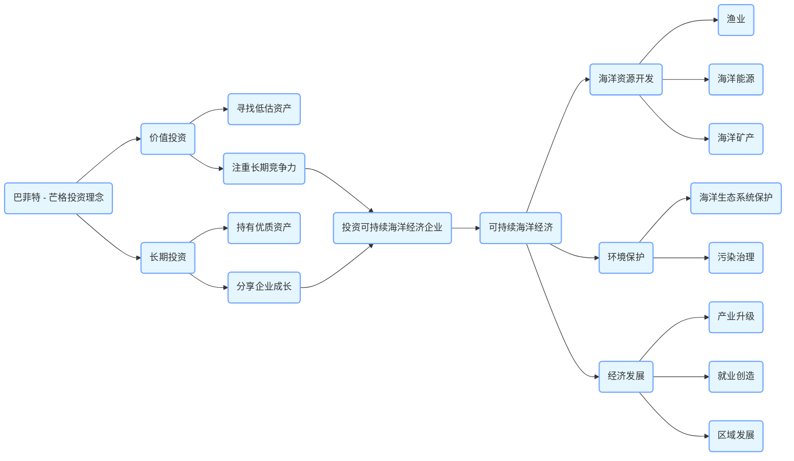

# 巴菲特 - 芒格的可持续海洋经济投资：蓝色经济的未来

> 关键词：巴菲特、芒格、可持续海洋经济、蓝色经济、投资策略、未来趋势

> 摘要：本文聚焦于巴菲特和芒格在可持续海洋经济领域的投资理念与实践。深入探讨可持续海洋经济即蓝色经济的核心概念、相关算法原理、数学模型，通过实际项目案例分析其投资的具体操作。同时，介绍该领域的实际应用场景、可利用的工具和资源，最后总结蓝色经济的未来发展趋势与挑战，并提供常见问题解答和扩展阅读参考资料，旨在为读者全面呈现蓝色经济投资的全貌。

## 1. 背景介绍 
### 1.1 目的和范围
本文章旨在深入剖析巴菲特 - 芒格在可持续海洋经济投资方面的理念、策略及影响。我们将探讨可持续海洋经济的核心概念、相关技术原理、实际应用案例以及未来发展趋势。范围涵盖了可持续海洋经济的各个领域，包括海洋渔业、海洋能源、海洋旅游等，同时分析巴菲特和芒格的投资决策对这些领域的推动作用。

### 1.2 预期读者
本文的预期读者包括对投资领域感兴趣的专业人士，如投资者、基金经理、金融分析师等；关注可持续发展和海洋经济的学者、研究人员；以及希望了解新兴投资领域和未来经济趋势的普通读者。

### 1.3 文档结构概述
本文将按照以下结构展开：首先介绍可持续海洋经济的核心概念及其与巴菲特 - 芒格投资理念的联系；接着阐述相关的核心算法原理和具体操作步骤；然后介绍数学模型和公式，并通过举例进行详细讲解；之后通过项目实战案例分析投资的实际应用；再探讨可持续海洋经济的实际应用场景；推荐相关的工具和资源；总结未来发展趋势与挑战；提供常见问题解答；最后列出扩展阅读和参考资料。

### 1.4 术语表
#### 1.4.1 核心术语定义
- **可持续海洋经济（蓝色经济）**：指在可持续发展原则下，对海洋资源进行开发、利用和保护，以实现经济增长、社会福祉和环境保护的协调发展。
- **巴菲特 - 芒格投资理念**：强调价值投资，即寻找被低估的优质资产，注重企业的长期竞争力和稳定现金流。

#### 1.4.2 相关概念解释
- **海洋生态系统服务**：指海洋生态系统为人类提供的各种利益，如食物供应、气候调节、海岸保护等。
- **循环经济**：一种以资源的高效利用和循环利用为核心，以“减量化、再利用、资源化”为原则的经济发展模式。

#### 1.4.3 缩略词列表
- **SDGs**：Sustainable Development Goals，可持续发展目标
- **ESG**：Environmental, Social and Governance，环境、社会和治理

## 2. 核心概念与联系 

### 可持续海洋经济的原理
可持续海洋经济的核心原理在于实现经济发展与环境保护的平衡。海洋是地球上最大的生态系统，拥有丰富的资源，如渔业资源、海洋能源、矿产资源等。然而，过度开发和不合理利用会导致海洋生态系统的破坏，进而影响经济的可持续性。因此，可持续海洋经济强调在开发海洋资源的同时，要保护海洋生态环境，确保资源的长期可持续利用。

### 巴菲特 - 芒格投资理念与可持续海洋经济的联系
巴菲特和芒格的投资理念强调价值投资和长期投资。在可持续海洋经济领域，他们可能会寻找那些具有长期竞争优势、能够为社会创造价值的企业进行投资。例如，一些致力于海洋环境保护和可持续渔业发展的企业，可能符合他们的投资标准。这些企业不仅能够在经济上取得成功，还能为海洋生态系统的保护做出贡献，实现经济与环境的双赢。

### 文本示意图
```plaintext
可持续海洋经济
|-- 海洋资源开发
|   |-- 渔业
|   |-- 海洋能源
|   |-- 海洋矿产
|-- 环境保护
|   |-- 海洋生态系统保护
|   |-- 污染治理
|-- 经济发展
|   |-- 产业升级
|   |-- 就业创造
|   |-- 区域发展

巴菲特 - 芒格投资理念
|-- 价值投资
|   |-- 寻找低估资产
|   |-- 注重长期竞争力
|-- 长期投资
|   |-- 持有优质资产
|   |-- 分享企业成长

联系：巴菲特 - 芒格投资理念推动可持续海洋经济中具有长期价值和社会责任感的企业发展
```

### Mermaid 流程图


## 3. 核心算法原理 & 具体操作步骤 

### 投资价值评估算法原理
在评估可持续海洋经济领域的投资价值时，可以使用现金流折现模型（DCF）。该模型的基本原理是将企业未来的现金流折现到当前，以确定企业的内在价值。

以下是使用 Python 实现现金流折现模型的代码示例：
```python
def dcf_valuation(free_cash_flows, discount_rate):
    """
    现金流折现模型计算企业内在价值
    :param free_cash_flows: 未来各期自由现金流列表
    :param discount_rate: 折现率
    :return: 企业内在价值
    """
    present_value = 0
    for i, fcf in enumerate(free_cash_flows):
        present_value += fcf / ((1 + discount_rate) ** (i + 1))
    return present_value

# 示例数据
free_cash_flows = [100, 120, 150, 180, 200]  # 未来五年的自由现金流
discount_rate = 0.1  # 折现率为 10%

intrinsic_value = dcf_valuation(free_cash_flows, discount_rate)
print(f"企业内在价值: {intrinsic_value}")
```
### 具体操作步骤
1. **数据收集**：收集目标企业的财务数据，包括历史自由现金流、营收、利润等。
2. **预测未来现金流**：根据企业的历史数据和行业发展趋势，预测未来各期的自由现金流。
3. **确定折现率**：折现率反映了投资的风险和机会成本。一般可以使用企业的加权平均资本成本（WACC）作为折现率。
4. **计算内在价值**：使用现金流折现模型计算企业的内在价值。
5. **比较内在价值和市场价格**：如果内在价值高于市场价格，则认为该企业被低估，具有投资价值。

## 4. 数学模型和公式 & 详细讲解 & 举例说明 

### 现金流折现模型公式
现金流折现模型的基本公式为：
$$
V = \sum_{t=1}^{n} \frac{FCF_t}{(1 + r)^t}
$$
其中：
- $V$ 表示企业的内在价值
- $FCF_t$ 表示第 $t$ 期的自由现金流
- $r$ 表示折现率
- $n$ 表示预测期数

### 详细讲解
该公式的核心思想是将未来各期的自由现金流按照折现率折现到当前。折现率反映了资金的时间价值和投资的风险。由于未来的现金流具有不确定性，因此需要通过折现率将其调整为当前的价值。

### 举例说明
假设一家可持续海洋经济企业未来五年的自由现金流分别为 100 万元、120 万元、150 万元、180 万元和 200 万元，折现率为 10%。则该企业的内在价值为：
$$
\begin{align*}
V &= \frac{100}{(1 + 0.1)^1} + \frac{120}{(1 + 0.1)^2} + \frac{150}{(1 + 0.1)^3} + \frac{180}{(1 + 0.1)^4} + \frac{200}{(1 + 0.1)^5}\\
&= \frac{100}{1.1} + \frac{120}{1.21} + \frac{150}{1.331} + \frac{180}{1.4641} + \frac{200}{1.61051}\\
&\approx 90.91 + 99.17 + 112.69 + 122.94 + 124.18\\
&= 549.89
\end{align*}
$$
即该企业的内在价值约为 549.89 万元。如果该企业的市场价格低于 549.89 万元，则认为该企业被低估，具有投资价值。

## 5. 项目实战：代码实际案例和详细解释说明 

### 5.1  开发环境搭建
为了实现上述投资价值评估的代码，我们需要搭建 Python 开发环境。以下是具体步骤：
1. **安装 Python**：从 Python 官方网站（https://www.python.org/downloads/）下载并安装适合你操作系统的 Python 版本。建议选择 Python 3.7 及以上版本。
2. **安装开发工具**：可以选择使用 PyCharm、VS Code 等集成开发环境（IDE），或者使用 Jupyter Notebook 进行代码开发和测试。
3. **安装必要的库**：在命令行中使用以下命令安装 `numpy` 和 `pandas` 库，用于数据处理和分析：
```sh
pip install numpy pandas
```

### 5.2  源代码详细实现和代码解读
以下是一个更完整的投资价值评估代码示例，包括数据读取、预测未来现金流、计算内在价值等步骤：
```python
import numpy as np
import pandas as pd

def read_financial_data(file_path):
    """
    读取财务数据
    :param file_path: 财务数据文件路径
    :return: 财务数据 DataFrame
    """
    data = pd.read_csv(file_path)
    return data

def forecast_free_cash_flows(data, growth_rate, forecast_period):
    """
    预测未来自由现金流
    :param data: 历史财务数据 DataFrame
    :param growth_rate: 现金流增长率
    :param forecast_period: 预测期数
    :return: 未来自由现金流列表
    """
    last_fcf = data['Free Cash Flow'].iloc[-1]
    free_cash_flows = []
    for i in range(forecast_period):
        fcf = last_fcf * ((1 + growth_rate) ** (i + 1))
        free_cash_flows.append(fcf)
    return free_cash_flows

def dcf_valuation(free_cash_flows, discount_rate):
    """
    现金流折现模型计算企业内在价值
    :param free_cash_flows: 未来各期自由现金流列表
    :param discount_rate: 折现率
    :return: 企业内在价值
    """
    present_value = 0
    for i, fcf in enumerate(free_cash_flows):
        present_value += fcf / ((1 + discount_rate) ** (i + 1))
    return present_value

# 示例数据文件路径
file_path = 'financial_data.csv'

# 读取财务数据
data = read_financial_data(file_path)

# 假设现金流增长率为 5%，预测期为 5 年
growth_rate = 0.05
forecast_period = 5

# 预测未来自由现金流
free_cash_flows = forecast_free_cash_flows(data, growth_rate, forecast_period)

# 假设折现率为 10%
discount_rate = 0.1

# 计算企业内在价值
intrinsic_value = dcf_valuation(free_cash_flows, discount_rate)

print(f"企业内在价值: {intrinsic_value}")
```
### 代码解读与分析
1. **read_financial_data 函数**：该函数用于读取财务数据文件，返回一个 Pandas DataFrame 对象。
2. **forecast_free_cash_flows 函数**：该函数根据历史财务数据和设定的现金流增长率，预测未来各期的自由现金流。
3. **dcf_valuation 函数**：该函数实现了现金流折现模型，计算企业的内在价值。
4. **主程序**：读取财务数据，预测未来自由现金流，设定折现率，最后计算企业的内在价值并输出结果。

## 6. 实际应用场景 
### 海洋渔业
在海洋渔业领域，可持续投资可以用于支持可持续渔业养殖和捕捞。例如，投资建设现代化的渔业养殖场，采用生态友好型的养殖技术，减少对环境的影响；投资研发先进的渔业捕捞设备和技术，提高捕捞效率的同时保护海洋生态资源。此外，还可以投资渔业加工企业，提高渔业产品的附加值。

### 海洋能源
海洋能源是可持续海洋经济的重要组成部分，包括潮汐能、波浪能、海流能等。巴菲特 - 芒格式的投资可以支持海洋能源项目的开发和建设。例如，投资建设潮汐能发电站，利用潮汐的涨落产生电能；投资研发高效的波浪能转换装置，将波浪能转化为电能。海洋能源的开发不仅可以提供清洁能源，减少对传统化石能源的依赖，还能促进海洋经济的发展。

### 海洋旅游
可持续海洋旅游也是一个重要的应用场景。投资可以用于开发环保型的海洋旅游项目，如生态潜水、海洋探险等。同时，支持海洋旅游基础设施的建设，如环保型的酒店、码头等。通过可持续海洋旅游的发展，可以促进当地经济增长，提高居民收入，同时保护海洋生态环境。

### 海洋环境保护
投资还可以用于海洋环境保护项目，如海洋污染治理、海洋生态修复等。例如，投资研发高效的海洋垃圾清理设备，减少海洋垃圾对海洋生态系统的危害；投资建设海洋生态保护区，保护海洋生物多样性。

## 7. 工具和资源推荐
### 7.1 学习资源推荐
#### 7.1.1 书籍推荐
- 《价值投资：从格雷厄姆到巴菲特》：这本书系统介绍了价值投资的理论和实践，包括巴菲特和芒格的投资理念和方法。
- 《海洋经济学》：全面阐述了海洋经济的基本概念、理论和应用，对于了解可持续海洋经济具有重要参考价值。
- 《可持续发展经济学》：探讨了经济发展与环境保护的关系，为可持续海洋经济的研究提供了理论基础。

#### 7.1.2 在线课程
- Coursera 上的“投资学原理”：该课程由知名大学教授授课，涵盖了投资的基本原理和方法，包括价值投资。
- edX 上的“海洋科学与可持续发展”：介绍了海洋科学的基础知识和可持续发展的相关内容，有助于了解可持续海洋经济的背景和挑战。

#### 7.1.3 技术博客和网站
- Seeking Alpha：提供了丰富的投资分析和研究报告，包括对可持续海洋经济领域企业的分析。
- Ocean Conservancy：专注于海洋保护和可持续发展的网站，提供了大量关于海洋经济和环境保护的信息。

### 7.2 开发工具框架推荐
#### 7.2.1 IDE和编辑器
- PyCharm：一款功能强大的 Python 集成开发环境，提供了代码编辑、调试、版本控制等功能。
- VS Code：轻量级的代码编辑器，支持多种编程语言，具有丰富的插件扩展功能。

#### 7.2.2 调试和性能分析工具
- PDB：Python 自带的调试器，可以帮助开发者定位代码中的问题。
- cProfile：Python 标准库中的性能分析工具，可以分析代码的运行时间和性能瓶颈。

#### 7.2.3 相关框架和库
- Pandas：用于数据处理和分析的 Python 库，提供了高效的数据结构和数据分析工具。
- NumPy：Python 的数值计算库，提供了高性能的多维数组对象和数学函数。

### 7.3 相关论文著作推荐
#### 7.3.1 经典论文
- “The Tragedy of the Commons”：探讨了公共资源的管理问题，对于理解海洋资源的可持续利用具有重要启示。
- “Sustainable Development and the Ocean Economy”：分析了可持续发展与海洋经济的关系，提出了实现海洋经济可持续发展的策略。

#### 7.3.2 最新研究成果
- 关注 Science、Nature 等顶级科学期刊上关于海洋经济和可持续发展的研究论文，了解该领域的最新进展。

#### 7.3.3 应用案例分析
- 一些专业的商业和经济期刊会发表关于可持续海洋经济投资的应用案例分析，这些案例可以为投资者提供实际操作的参考。

## 8. 总结：未来发展趋势与挑战
### 未来发展趋势
- **技术创新驱动**：随着科技的不断进步，海洋经济领域将迎来更多的技术创新。例如，更高效的海洋能源转换技术、智能化的渔业养殖系统、先进的海洋环境监测技术等，这些技术将推动可持续海洋经济的快速发展。
- **政策支持加强**：各国政府对可持续发展的重视程度不断提高，将出台更多的政策支持可持续海洋经济的发展。例如，提供财政补贴、税收优惠等，鼓励企业投资海洋经济领域。
- **产业融合加速**：可持续海洋经济将与其他产业实现更深度的融合，如海洋旅游与文化产业、海洋科技与制造业等。这种产业融合将创造更多的经济增长点和就业机会。

### 挑战
- **环境风险**：海洋生态系统的复杂性和脆弱性使得可持续海洋经济面临着环境风险。例如，海洋污染、气候变化等问题可能会影响海洋资源的可持续利用，对海洋经济的发展造成威胁。
- **投资回报周期长**：可持续海洋经济项目通常需要较大的前期投资，且投资回报周期较长。这对于投资者来说是一个挑战，需要具备足够的资金实力和耐心。
- **法律法规不完善**：目前，可持续海洋经济领域的法律法规还不够完善，存在监管漏洞和政策空白。这可能会导致市场秩序混乱，影响投资者的信心。

## 9. 附录：常见问题与解答
### 问题 1：可持续海洋经济投资的风险有哪些？
解答：可持续海洋经济投资的风险包括环境风险、市场风险、政策风险等。环境风险如海洋污染、气候变化等可能影响海洋资源的可持续利用；市场风险包括市场需求波动、价格变化等；政策风险则是指政策的不确定性可能对投资项目产生不利影响。

### 问题 2：如何评估可持续海洋经济企业的投资价值？
解答：可以使用现金流折现模型等方法评估企业的内在价值。同时，还需要考虑企业的市场竞争力、技术创新能力、环境和社会责任等因素。

### 问题 3：巴菲特和芒格在可持续海洋经济领域有哪些具体投资案例？
解答：截至目前，巴菲特和芒格在可持续海洋经济领域的具体投资案例相对较少。但他们的投资理念强调价值投资和长期投资，未来可能会关注那些具有长期竞争优势、能够为社会创造价值的可持续海洋经济企业。

### 问题 4：可持续海洋经济与传统海洋经济有什么区别？
解答：可持续海洋经济强调在开发海洋资源的同时，要保护海洋生态环境，实现经济、社会和环境的协调发展。而传统海洋经济更注重经济增长，可能忽视了环境保护和资源的可持续利用。

## 10. 扩展阅读 & 参考资料
### 扩展阅读
- 《蓝色经济：海洋的未来》：深入探讨了蓝色经济的发展前景和挑战，提供了丰富的案例和数据。
- 《投资的艺术》：介绍了投资的技巧和策略，对于理解巴菲特 - 芒格的投资理念有很大帮助。

### 参考资料
- United Nations. Sustainable Development Goals. https://sdgs.un.org/goals
- World Bank. The Ocean Economy in 2030. https://www.worldbank.org/en/topic/oceans/publication/the-ocean-economy-in-2030

作者：AI天才研究院/AI Genius Institute & 禅与计算机程序设计艺术 /Zen And The Art of Computer Programming