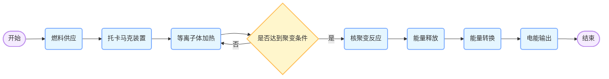

# 巴菲特 - 芒格的可控核聚变投资：未来能源的终极解决方案

> 关键词：巴菲特；芒格；可控核聚变；能源投资；未来能源解决方案

> 摘要：本文聚焦于巴菲特 - 芒格对可控核聚变的投资这一热点话题。从可控核聚变的背景知识出发，深入剖析其核心概念、算法原理、数学模型。通过项目实战案例，展示可控核聚变相关技术在实际中的应用。探讨可控核聚变在不同领域的实际应用场景，推荐学习和开发所需的工具与资源。最后对可控核聚变的未来发展趋势与挑战进行总结，并给出常见问题解答及扩展阅读参考资料，旨在全面解读可控核聚变作为未来能源终极解决方案的潜力与价值。

## 1. 背景介绍 
### 1.1 目的和范围
本文旨在全面探讨巴菲特 - 芒格对可控核聚变的投资行为及其背后的意义。研究范围涵盖可控核聚变的基本原理、技术发展现状、投资前景以及对未来能源格局的影响。通过分析这一投资案例，为读者呈现可控核聚变作为未来能源终极解决方案的可行性和潜在价值。

### 1.2 预期读者
本文适合对能源投资、科技前沿以及未来能源发展趋势感兴趣的读者。包括投资者、能源行业从业者、科研人员以及关注能源问题的普通大众。

### 1.3 文档结构概述
本文将按照以下结构展开：首先介绍可控核聚变的背景知识，包括目的、预期读者和文档结构；接着阐述核心概念与联系，展示其原理和架构；然后详细讲解核心算法原理及具体操作步骤，并用 Python 代码说明；再介绍数学模型和公式，并举例说明；之后通过项目实战案例展示代码实现和解读；探讨实际应用场景；推荐相关的学习工具和资源；最后总结未来发展趋势与挑战，提供常见问题解答和扩展阅读参考资料。

### 1.4 术语表
#### 1.4.1 核心术语定义
- **可控核聚变**：是指在人为控制的条件下，使轻原子核（如氢的同位素氘和氚）发生聚变反应，释放出巨大能量的过程。与不可控的核聚变（如氢弹爆炸）不同，可控核聚变需要精确控制反应的速率和条件，以实现持续、稳定的能量输出。
- **托卡马克装置**：是一种利用磁约束来实现受控核聚变的环形装置。它通过强大的磁场将高温等离子体约束在环形真空室内，使其能够达到核聚变所需的高温和密度条件。
- **等离子体**：是物质的第四态，由大量的自由电子和离子组成。在可控核聚变中，等离子体是参与聚变反应的物质状态，需要被加热到极高的温度（通常超过 1 亿摄氏度）。

#### 1.4.2 相关概念解释
- **核聚变反应**：是指两个轻原子核结合成一个较重原子核的过程，同时释放出巨大的能量。这是太阳和其他恒星发光发热的能量来源。常见的核聚变反应是氘和氚聚变成氦的反应。
- **能源密度**：是指单位质量或单位体积的能源所包含的能量。核聚变的能源密度非常高，远高于传统的化石能源和核裂变能源。
- **磁约束**：是一种利用磁场来约束等离子体的方法。在可控核聚变中，磁约束可以防止高温等离子体与装置壁接触，从而避免能量损失和装置损坏。

#### 1.4.3 缩略词列表
- **ITER**：国际热核聚变实验堆（International Thermonuclear Experimental Reactor），是一个正在建设中的大型国际合作项目，旨在验证可控核聚变的科学和技术可行性。
- **NIF**：国家点火装置（National Ignition Facility），是美国的一个大型激光核聚变实验装置，用于研究惯性约束核聚变。

## 2. 核心概念与联系 

### 可控核聚变的原理
可控核聚变的基本原理是基于轻原子核的聚变反应。在极高的温度和压力下，轻原子核（如氘和氚）具有足够的动能克服它们之间的静电排斥力，从而靠近并发生聚变反应，结合成一个较重的原子核（如氦），同时释放出巨大的能量。这个过程可以用以下的反应式表示：

$${}_1^2H + {}_1^3H \rightarrow {}_2^4He + {}_0^1n + 17.6 MeV$$

其中，${}_1^2H$ 表示氘核，${}_1^3H$ 表示氚核，${}_2^4He$ 表示氦核，${}_0^1n$ 表示中子，$17.6 MeV$ 表示反应释放的能量。

### 磁约束核聚变的架构
磁约束核聚变是目前最有希望实现可控核聚变的方法之一，其核心设备是托卡马克装置。托卡马克装置的基本架构包括以下几个部分：

- **环形真空室**：用于容纳高温等离子体，通常由不锈钢或其他耐高温材料制成。
- **磁体系统**：包括环向磁体和极向磁体，用于产生强大的磁场，将等离子体约束在环形真空室内。
- **加热系统**：用于将等离子体加热到核聚变所需的高温，常见的加热方法包括中性束注入加热、射频加热等。
- **诊断系统**：用于监测等离子体的参数，如温度、密度、压力等，以便实时控制核聚变反应。

### 文本示意图
```plaintext
可控核聚变系统
|-- 托卡马克装置
|   |-- 环形真空室
|   |-- 磁体系统
|   |   |-- 环向磁体
|   |   |-- 极向磁体
|   |-- 加热系统
|   |   |-- 中性束注入加热
|   |   |-- 射频加热
|   |-- 诊断系统
|       |-- 温度监测
|       |-- 密度监测
|       |-- 压力监测
|-- 燃料供应系统
|   |-- 氘供应
|   |-- 氚供应
|-- 能量转换系统
|   |-- 热能转换
|   |-- 电能转换
```

### Mermaid 流程图


## 3. 核心算法原理 & 具体操作步骤 

### 等离子体温度控制算法原理
在可控核聚变中，等离子体的温度是一个关键参数，需要精确控制以维持核聚变反应的稳定进行。一种常用的等离子体温度控制算法是基于比例 - 积分 - 微分（PID）控制器的算法。

PID 控制器的基本原理是根据当前温度与设定温度之间的误差，计算出控制量，通过调节加热系统的功率来控制等离子体的温度。PID 控制器的输出 $u(t)$ 可以表示为：

$$u(t) = K_p e(t) + K_i \int_{0}^{t} e(\tau) d\tau + K_d \frac{de(t)}{dt}$$

其中，$e(t)$ 是当前温度与设定温度之间的误差，$K_p$ 是比例系数，$K_i$ 是积分系数，$K_d$ 是微分系数。

### Python 代码实现
```python
class PIDController:
    def __init__(self, Kp, Ki, Kd):
        self.Kp = Kp
        self.Ki = Ki
        self.Kd = Kd
        self.prev_error = 0
        self.integral = 0

    def update(self, setpoint, current_value):
        error = setpoint - current_value
        self.integral += error
        derivative = error - self.prev_error
        output = self.Kp * error + self.Ki * self.integral + self.Kd * derivative
        self.prev_error = error
        return output

# 示例参数
Kp = 1.0
Ki = 0.1
Kd = 0.01
setpoint = 100000000  # 设定温度，单位：摄氏度
current_value = 90000000  # 当前温度，单位：摄氏度

# 创建 PID 控制器实例
pid = PIDController(Kp, Ki, Kd)

# 计算控制量
control_output = pid.update(setpoint, current_value)
print(f"控制量: {control_output}")
```

### 具体操作步骤
1. **初始化 PID 控制器**：设置比例系数 $K_p$、积分系数 $K_i$ 和微分系数 $K_d$。
2. **获取当前温度**：通过诊断系统测量等离子体的当前温度。
3. **计算误差**：计算当前温度与设定温度之间的误差 $e(t)$。
4. **更新积分项**：将误差 $e(t)$ 累加到积分项中。
5. **计算微分项**：计算误差的变化率 $\frac{de(t)}{dt}$。
6. **计算控制量**：根据 PID 控制器的公式计算控制量 $u(t)$。
7. **调节加热系统功率**：根据控制量 $u(t)$ 调节加热系统的功率，以控制等离子体的温度。
8. **重复步骤 2 - 7**：不断循环，直到等离子体的温度达到并稳定在设定温度附近。

## 4. 数学模型和公式 & 详细讲解 & 举例说明 

### 核聚变反应率公式
核聚变反应率是指单位时间、单位体积内发生核聚变反应的次数。对于氘 - 氚核聚变反应，反应率 $R_{DT}$ 可以用以下公式表示：

$$R_{DT} = n_D n_T \langle \sigma v \rangle_{DT}$$

其中，$n_D$ 和 $n_T$ 分别是氘和氚的粒子数密度，$\langle \sigma v \rangle_{DT}$ 是氘 - 氚核聚变反应的平均截面 - 速度乘积。

### 详细讲解
- **粒子数密度**：$n_D$ 和 $n_T$ 表示单位体积内氘和氚粒子的数量。粒子数密度越高，发生核聚变反应的概率就越大。
- **平均截面 - 速度乘积**：$\langle \sigma v \rangle_{DT}$ 是一个与等离子体温度和粒子能量分布有关的物理量。它表示在给定的等离子体条件下，氘和氚粒子发生核聚变反应的有效截面与它们相对速度的乘积的平均值。$\langle \sigma v \rangle_{DT}$ 随着等离子体温度的升高而增大，当温度达到一定值时，反应率会迅速增加。

### 举例说明
假设在一个托卡马克装置中，氘的粒子数密度 $n_D = 10^{20} m^{-3}$，氚的粒子数密度 $n_T = 10^{20} m^{-3}$，在某一温度下，氘 - 氚核聚变反应的平均截面 - 速度乘积 $\langle \sigma v \rangle_{DT} = 10^{-22} m^3/s$。则该装置内的核聚变反应率为：

$$R_{DT} = n_D n_T \langle \sigma v \rangle_{DT} = 10^{20} m^{-3} \times 10^{20} m^{-3} \times 10^{-22} m^3/s = 10^{18} s^{-1} m^{-3}$$

这意味着在每立方米的等离子体中，每秒会发生 $10^{18}$ 次氘 - 氚核聚变反应。

### 能量约束时间公式
能量约束时间 $\tau_E$ 是衡量等离子体能量损失快慢的一个重要参数。它表示等离子体中的能量在没有外部加热的情况下，由于各种能量损失机制（如热传导、辐射等）而减少到初始值的 $1/e$ 所需的时间。能量约束时间可以用以下公式表示：

$$\tau_E = \frac{W}{P_{loss}}$$

其中，$W$ 是等离子体中的总能量，$P_{loss}$ 是等离子体的能量损失功率。

### 详细讲解
- **等离子体总能量**：$W$ 包括等离子体的热能、磁能等各种形式的能量。它与等离子体的温度、密度和体积有关。
- **能量损失功率**：$P_{loss}$ 表示等离子体通过各种途径损失能量的速率。常见的能量损失机制包括热传导、辐射、粒子逃逸等。能量损失功率越小，能量约束时间就越长，核聚变反应就越容易维持。

### 举例说明
假设一个托卡马克装置中的等离子体总能量 $W = 10^9 J$，能量损失功率 $P_{loss} = 10^7 W$。则该等离子体的能量约束时间为：

$$\tau_E = \frac{W}{P_{loss}} = \frac{10^9 J}{10^7 W} = 100 s$$

这意味着在没有外部加热的情况下，等离子体中的能量会在 100 秒内减少到初始值的 $1/e$。

## 5. 项目实战：代码实际案例和详细解释说明 

### 5.1  开发环境搭建
#### 操作系统
推荐使用 Linux 操作系统，如 Ubuntu 或 CentOS，因为它们对科学计算和开发工具的支持较好。

#### 编程语言
使用 Python 作为开发语言，Python 具有丰富的科学计算库和易于学习的语法。

#### 开发工具
- **Anaconda**：是一个开源的 Python 发行版本，包含了许多常用的科学计算库和工具。可以从 Anaconda 官方网站下载并安装。
- **Jupyter Notebook**：是一个交互式的开发环境，适合进行代码编写、数据分析和可视化。安装 Anaconda 后，Jupyter Notebook 会自动安装。

#### 科学计算库
- **NumPy**：用于进行高效的数值计算和数组操作。
- **SciPy**：提供了许多科学计算的算法和工具，如优化、积分、插值等。
- **Matplotlib**：用于绘制各种类型的图表和可视化数据。

可以使用以下命令安装这些库：
```sh
pip install numpy scipy matplotlib
```

### 5.2  源代码详细实现和代码解读
#### 模拟等离子体温度变化
以下是一个简单的 Python 代码示例，用于模拟等离子体温度随时间的变化，并使用 PID 控制器进行温度控制。

```python
import numpy as np
import matplotlib.pyplot as plt

# PID 控制器类
class PIDController:
    def __init__(self, Kp, Ki, Kd):
        self.Kp = Kp
        self.Ki = Ki
        self.Kd = Kd
        self.prev_error = 0
        self.integral = 0

    def update(self, setpoint, current_value):
        error = setpoint - current_value
        self.integral += error
        derivative = error - self.prev_error
        output = self.Kp * error + self.Ki * self.integral + self.Kd * derivative
        self.prev_error = error
        return output

# 模拟参数
Kp = 1.0
Ki = 0.1
Kd = 0.01
setpoint = 100000000  # 设定温度，单位：摄氏度
initial_temperature = 90000000  # 初始温度，单位：摄氏度
time_steps = 100
dt = 1  # 时间步长，单位：秒

# 创建 PID 控制器实例
pid = PIDController(Kp, Ki, Kd)

# 初始化温度数组
temperatures = [initial_temperature]

# 模拟温度变化
for _ in range(time_steps):
    current_temperature = temperatures[-1]
    control_output = pid.update(setpoint, current_temperature)
    
    # 简单的温度变化模型：温度变化与控制输出成正比
    temperature_change = control_output * 0.1
    new_temperature = current_temperature + temperature_change
    
    temperatures.append(new_temperature)

# 绘制温度变化曲线
time = np.arange(0, (time_steps + 1) * dt, dt)
plt.plot(time, temperatures)
plt.axhline(y=setpoint, color='r', linestyle='--', label='设定温度')
plt.xlabel('时间 (秒)')
plt.ylabel('温度 (摄氏度)')
plt.title('等离子体温度变化模拟')
plt.legend()
plt.show()
```

#### 代码解读
1. **PID 控制器类**：定义了一个 `PIDController` 类，用于实现 PID 控制算法。该类包含了初始化方法 `__init__` 和更新方法 `update`。
2. **模拟参数设置**：设置了 PID 控制器的参数 $K_p$、$K_i$ 和 $K_d$，以及设定温度、初始温度、时间步数和时间步长。
3. **创建 PID 控制器实例**：创建了一个 `PIDController` 类的实例 `pid`。
4. **初始化温度数组**：初始化一个列表 `temperatures`，用于存储每个时间步的等离子体温度。
5. **模拟温度变化**：使用一个循环模拟等离子体温度随时间的变化。在每个时间步，计算当前温度与设定温度之间的误差，通过 PID 控制器计算控制量，根据控制量更新温度。
6. **绘制温度变化曲线**：使用 `matplotlib` 库绘制等离子体温度随时间的变化曲线，并标注设定温度。

### 5.3  代码解读与分析
#### 温度控制效果
从绘制的温度变化曲线可以看出，随着时间的推移，等离子体温度逐渐接近设定温度。PID 控制器通过不断调整控制量，使得温度误差逐渐减小，最终实现了对等离子体温度的稳定控制。

#### 参数调整
PID 控制器的性能取决于比例系数 $K_p$、积分系数 $K_i$ 和微分系数 $K_d$ 的选择。如果 $K_p$ 过大，系统可能会出现振荡；如果 $K_i$ 过大，系统可能会出现积分饱和；如果 $K_d$ 过大，系统可能会对噪声过于敏感。因此，需要根据实际情况调整这些参数，以达到最佳的控制效果。

#### 模型局限性
本代码示例中使用的温度变化模型是一个简单的线性模型，实际的等离子体温度变化要复杂得多，受到多种因素的影响，如能量损失、核聚变反应率等。因此，在实际应用中，需要使用更精确的物理模型来模拟等离子体温度变化。

## 6. 实际应用场景 
### 电力生产
可控核聚变一旦实现商业化，将成为一种可持续的、清洁的能源来源，用于大规模的电力生产。与传统的化石能源相比，核聚变能源不会产生温室气体排放和放射性废料，对环境友好。与核裂变能源相比，核聚变能源更加安全，不会发生核泄漏事故。

### 航天推进
在航天领域，可控核聚变可以为航天器提供强大的动力。核聚变发动机具有高比冲、高推力的特点，可以大大缩短航天器的飞行时间，提高航天任务的效率。例如，使用核聚变发动机的航天器可以在更短的时间内到达火星等遥远的行星。

### 海水淡化
海水淡化需要消耗大量的能源。可控核聚变提供的廉价、清洁的能源可以降低海水淡化的成本，使得海水淡化技术更加普及。这对于解决全球水资源短缺问题具有重要意义。

### 工业供热
在工业生产中，许多工艺需要大量的热能。可控核聚变能源可以为工业提供高温、稳定的热源，替代传统的化石能源，减少工业生产对环境的影响。

## 7. 工具和资源推荐
### 7.1 学习资源推荐
#### 7.1.1 书籍推荐
- 《核聚变原理》：系统介绍了核聚变的基本原理、物理过程和技术方法，是学习核聚变的经典教材。
- 《等离子体物理学》：全面阐述了等离子体的基本性质、运动规律和相互作用，对于理解可控核聚变中的等离子体现象非常有帮助。
- 《能源未来：从化石燃料到可再生能源》：探讨了全球能源发展的趋势和挑战，介绍了包括可控核聚变在内的各种未来能源技术。

#### 7.1.2 在线课程
- Coursera 上的“核聚变能源导论”：由知名大学的教授授课，讲解了核聚变能源的基本概念、技术现状和发展前景。
- edX 上的“等离子体物理学基础”：提供了等离子体物理学的基础知识和相关的数学模型，适合初学者学习。

#### 7.1.3 技术博客和网站
- 核聚变能源协会（Fusion Energy Association）官网：提供了关于可控核聚变的最新研究进展、政策动态和行业资讯。
- ITER 官网：国际热核聚变实验堆项目的官方网站，包含了 ITER 项目的详细信息和最新动态。

### 7.2 开发工具框架推荐
#### 7.2.1 IDE和编辑器
- PyCharm：是一款专业的 Python 集成开发环境，具有强大的代码编辑、调试和分析功能，适合开发可控核聚变相关的 Python 代码。
- Visual Studio Code：是一个轻量级的代码编辑器，支持多种编程语言和插件扩展，可用于编写和调试各种类型的代码。

#### 7.2.2 调试和性能分析工具
- IPython：是一个交互式的 Python 解释器，提供了丰富的调试和分析功能，如代码自动补全、变量查看、性能分析等。
- cProfile：是 Python 标准库中的一个性能分析工具，可以帮助开发者找出代码中的性能瓶颈。

#### 7.2.3 相关框架和库
- OpenMC：是一个开源的蒙特卡罗中子输运模拟软件，可用于模拟核聚变反应堆中的中子行为和能量分布。
- SOFT：是一个用于模拟等离子体中软 X 射线辐射的软件包，可用于研究等离子体的温度和密度分布。

### 7.3 相关论文著作推荐
#### 7.3.1 经典论文
- “Controlled thermonuclear reactions” by Lyman Spitzer Jr.：这篇论文是可控核聚变领域的经典之作，提出了磁约束核聚变的基本概念和方法。
- “The ITER project: a path to fusion energy” by the ITER Organization：介绍了国际热核聚变实验堆项目的目标、技术方案和研究进展。

#### 7.3.2 最新研究成果
- 关注《Nuclear Fusion》、《Plasma Physics and Controlled Fusion》等学术期刊，这些期刊发表了可控核聚变领域的最新研究成果。
- 参加国际核聚变会议，如国际原子能机构（IAEA）举办的核聚变能源会议，了解最新的研究动态和技术突破。

#### 7.3.3 应用案例分析
- 分析 ITER 项目和其他核聚变实验装置的设计、运行和实验结果，了解可控核聚变技术在实际应用中的挑战和解决方案。
- 研究一些关于核聚变能源商业应用的可行性研究报告，了解核聚变能源在不同领域的应用前景和经济分析。

## 8. 总结：未来发展趋势与挑战
### 未来发展趋势
- **技术突破**：随着科研投入的增加和技术的不断进步，可控核聚变有望在未来几十年内实现商业化。新的材料、加热方法和控制技术将不断涌现，提高核聚变反应的效率和稳定性。
- **国际合作加强**：可控核聚变是一个全球性的挑战，需要各国之间的合作和共享资源。未来，国际合作项目将继续加强，共同推动可控核聚变技术的发展。
- **能源结构调整**：可控核聚变能源的商业化将对全球能源结构产生重大影响。它将逐渐取代传统的化石能源和核裂变能源，成为未来能源的主要来源。

### 挑战
- **技术难题**：目前，可控核聚变技术还面临着许多技术难题，如等离子体的稳定约束、高效加热、材料的抗辐射性能等。解决这些技术难题需要长期的研究和实验。
- **经济成本**：建设和运行核聚变反应堆的成本非常高。如何降低成本，提高核聚变能源的经济性，是实现商业化的关键。
- **社会接受度**：虽然核聚变能源具有许多优点，但公众对核技术仍然存在一定的担忧。提高社会对可控核聚变的接受度，需要加强科普宣传和沟通。

## 9. 附录：常见问题与解答
### 问题 1：可控核聚变会像氢弹一样爆炸吗？
解答：不会。氢弹爆炸是不可控的核聚变反应，瞬间释放出巨大的能量。而可控核聚变是在人为控制的条件下进行的，通过精确控制反应的速率和条件，使核聚变反应能够持续、稳定地进行，不会发生像氢弹那样的爆炸。

### 问题 2：可控核聚变的燃料从哪里来？
解答：可控核聚变主要使用氘和氚作为燃料。氘可以从海水中提取，海水中含有丰富的氘资源，几乎可以说是取之不尽、用之不竭。氚可以通过锂 - 6 与中子的反应来产生，锂也是一种相对丰富的资源。

### 问题 3：可控核聚变会产生放射性废料吗？
解答：可控核聚变产生的放射性废料比核裂变要少得多。核聚变反应主要产生氦和中子，氦是一种稳定的、无害的气体。中子会与反应堆的结构材料发生反应，使材料具有一定的放射性，但这种放射性的半衰期相对较短，处理起来比核裂变产生的高放射性废料要容易得多。

### 问题 4：可控核聚变什么时候能够实现商业化？
解答：目前还很难确定可控核聚变实现商业化的具体时间。虽然近年来可控核聚变技术取得了很大的进展，但仍然面临着许多技术和经济上的挑战。一些专家预测，可控核聚变可能在 2050 年左右实现商业化，但这只是一个大致的估计，实际时间可能会有所不同。

## 10. 扩展阅读 & 参考资料
### 扩展阅读
- 《千亿个太阳：恒星的诞生、演变和衰亡》：这本书介绍了恒星内部的核聚变过程，对于理解可控核聚变的原理有一定的帮助。
- 《能源的未来：清洁、充足的能源从何而来》：探讨了未来能源的发展方向和各种能源技术的前景，包括可控核聚变。

### 参考资料
- ITER 官方网站：https://www.iter.org/
- 核聚变能源协会官网：https://fusionenergyassociation.org/
- 《Nuclear Fusion》期刊：https://iopscience.iop.org/journal/0029-5515
- 《Plasma Physics and Controlled Fusion》期刊：https://iopscience.iop.org/journal/0741-3335

作者：AI天才研究院/AI Genius Institute & 禅与计算机程序设计艺术 /Zen And The Art of Computer Programming