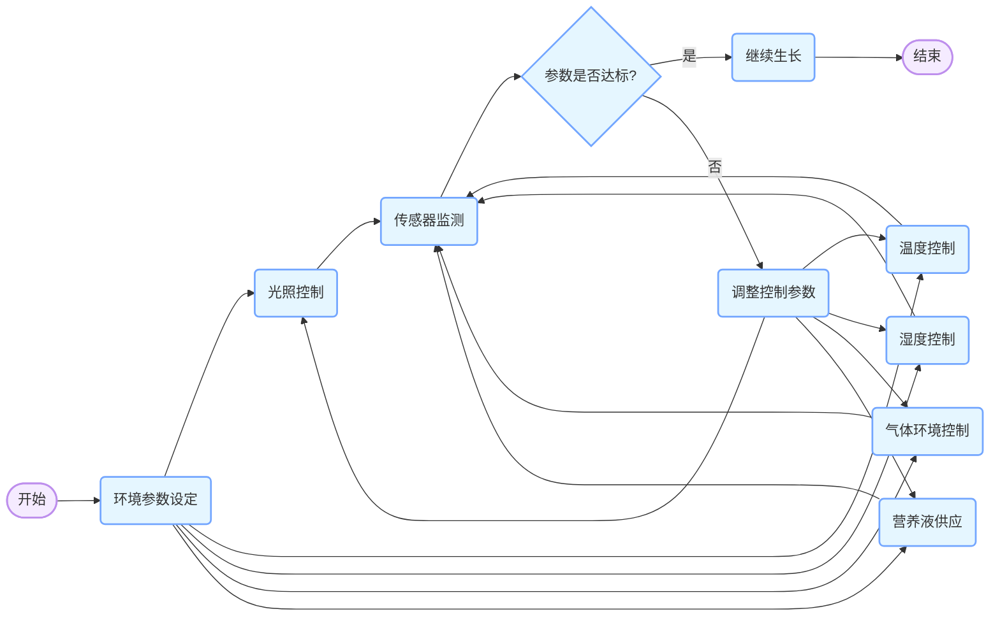

# 巴菲特 - 芒格的垂直农业投资：未来食品生产的新模式

> 关键词：巴菲特 - 芒格、垂直农业、未来食品生产、投资模式、农业科技

> 摘要：本文聚焦于巴菲特 - 芒格对垂直农业的投资，深入探讨垂直农业作为未来食品生产新模式的潜力与价值。首先介绍垂直农业的背景，包括其产生的原因和发展现状；接着阐述垂直农业的核心概念、架构及相关算法原理；通过数学模型分析其经济效益和可行性；结合实际项目案例，详细讲解开发环境搭建、代码实现与解读；分析垂直农业在不同场景下的实际应用；推荐学习、开发相关的工具和资源；最后总结垂直农业未来的发展趋势与挑战，并解答常见问题，提供扩展阅读和参考资料。

## 1. 背景介绍 
### 1.1 目的和范围
本文章旨在全面剖析巴菲特 - 芒格投资垂直农业这一事件背后的深层逻辑，深入探究垂直农业作为未来食品生产新模式的各个方面。范围涵盖垂直农业的基本概念、技术原理、经济效益、实际应用案例，以及与之相关的学习资源、开发工具等，力图为读者呈现一个完整的垂直农业图景，帮助读者理解其在未来食品生产领域的重要地位和发展潜力。

### 1.2 预期读者
本文预期读者包括对农业科技、投资领域感兴趣的专业人士，如农业从业者、投资者、金融分析师等；也适合关注未来食品生产模式、环境可持续发展的普通读者；同时，对于从事计算机科学、农业工程等相关专业的学生和研究人员，本文也能提供有价值的参考信息。

### 1.3 文档结构概述
本文按照以下结构展开：首先介绍垂直农业的背景知识，包括目的、预期读者和文档结构；接着阐述垂直农业的核心概念与联系，通过文本示意图和 Mermaid 流程图展示其原理和架构；详细讲解核心算法原理和具体操作步骤，并使用 Python 源代码进行说明；运用数学模型和公式分析垂直农业的经济效益和可行性，并举例说明；通过实际项目案例，介绍开发环境搭建、源代码实现和代码解读；分析垂直农业在不同场景下的实际应用；推荐学习、开发相关的工具和资源；总结垂直农业未来的发展趋势与挑战；解答常见问题；提供扩展阅读和参考资料。

### 1.4 术语表
#### 1.4.1 核心术语定义
- **垂直农业**：垂直农业是一种在多层建筑或垂直结构中进行农业生产的模式，通过利用人工光照、营养液循环等技术，实现农作物的高效、高密度种植，不受传统土地和气候条件的限制。
- **无土栽培**：无土栽培是指不用天然土壤而用基质或仅育苗时用基质，在定植以后用营养液进行灌溉的栽培方法。常见的无土栽培方式有水培、雾培等。
- **智能农业系统**：智能农业系统是利用传感器、物联网、大数据、人工智能等技术，对农业生产过程进行实时监测、控制和管理的系统，以提高农业生产的效率和质量。

#### 1.4.2 相关概念解释
- **营养液膜技术（NFT）**：营养液膜技术是一种水培方式，将植物种植在浅层流动的营养液中，营养液在栽培槽中循环流动，为植物提供水分和养分。
- **气培技术**：气培技术是将植物根系悬挂于栽培容器内，通过喷雾装置将营养液雾化后直接喷射到植物根系上，为植物提供水分和养分的一种无土栽培技术。

#### 1.4.3 缩略词列表
- **IoT**：Internet of Things，物联网
- **AI**：Artificial Intelligence，人工智能
- **LED**：Light Emitting Diode，发光二极管

## 2. 核心概念与联系 
### 核心概念原理
垂直农业的核心原理是通过人工控制环境条件，为农作物创造最优的生长环境。其主要包括以下几个方面：
- **光照控制**：采用人工光源，如 LED 灯，根据不同农作物的生长需求，精确控制光照强度、光照时间和光谱组成，以促进农作物的光合作用和生长发育。
- **温度和湿度控制**：通过空调、加湿器、除湿器等设备，调节种植环境的温度和湿度，使其保持在农作物生长的适宜范围内。
- **营养液供应**：利用无土栽培技术，通过营养液循环系统，为农作物提供所需的水分和养分。营养液的成分和浓度可以根据不同农作物的需求进行精确调配。
- **气体环境控制**：调节种植环境中的二氧化碳浓度、氧气含量等气体成分，以满足农作物光合作用和呼吸作用的需求。

### 架构的文本示意图
垂直农业系统通常由以下几个部分组成：
- **种植模块**：包括种植架、栽培容器、基质等，用于种植农作物。
- **环境控制模块**：包括光照系统、温度控制系统、湿度控制系统、气体环境控制系统等，用于调节种植环境的各项参数。
- **营养液供应模块**：包括营养液储存罐、水泵、管道等，用于为农作物提供营养液。
- **监测与控制系统**：包括传感器、控制器、计算机等，用于实时监测种植环境的各项参数，并根据预设的参数值自动控制环境控制模块和营养液供应模块的运行。

### Mermaid 流程图


## 3. 核心算法原理 & 具体操作步骤 
### 光照控制算法原理
光照控制是垂直农业中非常重要的一环，其目的是根据农作物的生长阶段和需求，精确控制光照强度、光照时间和光谱组成。以下是一个简单的光照控制算法的 Python 实现：

```python
class LightControl:
    def __init__(self, growth_stage, crop_type):
        self.growth_stage = growth_stage
        self.crop_type = crop_type
        self.light_intensity = 0
        self.light_duration = 0
        self.spectrum = []

    def set_light_parameters(self):
        # 根据农作物类型和生长阶段设置光照参数
        if self.crop_type == "lettuce":
            if self.growth_stage == "seedling":
                self.light_intensity = 200  # μmol/m²/s
                self.light_duration = 16  # 小时
                self.spectrum = [660, 450]  # 红光和蓝光波长
            elif self.growth_stage == "vegetative":
                self.light_intensity = 300  # μmol/m²/s
                self.light_duration = 18  # 小时
                self.spectrum = [660, 450]
            elif self.growth_stage == "flowering":
                self.light_intensity = 400  # μmol/m²/s
                self.light_duration = 12  # 小时
                self.spectrum = [660, 450]
        elif self.crop_type == "tomato":
            if self.growth_stage == "seedling":
                self.light_intensity = 250  # μmol/m²/s
                self.light_duration = 14  # 小时
                self.spectrum = [660, 450]
            elif self.growth_stage == "vegetative":
                self.light_intensity = 400  # μmol/m²/s
                self.light_duration = 16  # 小时
                self.spectrum = [660, 450]
            elif self.growth_stage == "flowering":
                self.light_intensity = 500  # μmol/m²/s
                self.light_duration = 12  # 小时
                self.spectrum = [660, 450]

    def get_light_parameters(self):
        return self.light_intensity, self.light_duration, self.spectrum


# 示例使用
crop = LightControl("seedling", "lettuce")
crop.set_light_parameters()
intensity, duration, spectrum = crop.get_light_parameters()
print(f"光照强度: {intensity} μmol/m²/s")
print(f"光照时间: {duration} 小时")
print(f"光谱组成: {spectrum}")
```

### 具体操作步骤
1. **确定农作物类型和生长阶段**：根据实际种植的农作物种类和其所处的生长阶段，作为光照控制的基础参数。
2. **设置光照参数**：调用 `set_light_parameters` 方法，根据农作物类型和生长阶段，自动设置光照强度、光照时间和光谱组成。
3. **获取光照参数**：调用 `get_light_parameters` 方法，获取设置好的光照参数，用于控制光照系统的运行。

## 4. 数学模型和公式 & 详细讲解 & 举例说明 
### 经济效益模型
垂直农业的经济效益主要受到生产成本、销售收入等因素的影响。以下是一个简单的经济效益模型：

#### 成本模型
生产成本主要包括固定成本和可变成本两部分。固定成本 $C_f$ 包括土地租赁、建筑设施建设、设备购置等费用；可变成本 $C_v$ 包括种子、肥料、水电费、劳动力等费用。总成本 $C$ 可以表示为：

$$C = C_f + C_v$$

#### 收入模型
销售收入 $R$ 主要取决于农作物的产量 $Q$ 和市场价格 $P$。假设农作物的产量与种植面积 $A$、单位面积产量 $q$ 有关，则销售收入可以表示为：

$$R = P \times Q = P \times A \times q$$

#### 利润模型
利润 $\pi$ 等于销售收入减去总成本，即：

$$\pi = R - C = P \times A \times q - (C_f + C_v)$$

### 详细讲解
- **固定成本**：固定成本在垂直农业项目的初期投入较大，如建设多层种植架、安装环境控制设备等。这些成本在项目的运营过程中相对稳定，不会随着产量的增加而显著变化。
- **可变成本**：可变成本与农作物的种植规模和生长周期有关。例如，种子和肥料的费用会随着种植面积的增加而增加；水电费和劳动力成本会随着生长周期的延长而增加。
- **销售收入**：销售收入取决于市场需求和农作物的品质。在垂直农业中，由于可以精确控制生长环境，农作物的品质通常较高，市场价格也相对较高。
- **利润**：利润是衡量垂直农业项目经济效益的重要指标。通过优化种植方案、降低成本、提高产量和品质，可以提高项目的利润水平。

### 举例说明
假设一个垂直农业项目的固定成本 $C_f = 100,000$ 元，种植面积 $A = 100$ 平方米，单位面积产量 $q = 10$ 千克/平方米，市场价格 $P = 20$ 元/千克，可变成本 $C_v = 50,000$ 元。则该项目的销售收入为：

$$R = P \times A \times q = 20 \times 100 \times 10 = 20,000 \text{ 元}$$

总成本为：

$$C = C_f + C_v = 100,000 + 50,000 = 150,000 \text{ 元}$$

利润为：

$$\pi = R - C = 20,000 - 150,000 = -130,000 \text{ 元}$$

从这个例子可以看出，该项目目前处于亏损状态。为了提高利润，可以考虑降低成本、提高产量或市场价格等措施。例如，通过优化营养液配方降低肥料成本，采用先进的种植技术提高单位面积产量等。

## 5. 项目实战：代码实际案例和详细解释说明 
### 5.1  开发环境搭建
#### 硬件环境
- **服务器**：选择一台性能稳定的服务器，如阿里云、腾讯云等云服务器，或者使用本地服务器。服务器的配置根据项目的规模和需求进行选择，建议至少具备 4GB 内存和 500GB 硬盘空间。
- **传感器和执行器**：根据垂直农业系统的需求，选择合适的传感器和执行器。例如，光照传感器、温度传感器、湿度传感器、二氧化碳传感器、水泵、风机等。传感器和执行器需要与服务器进行通信，可以通过串口、以太网、Wi-Fi 等方式连接。
- **开发板**：如果需要对传感器和执行器进行控制，可以选择一款开发板，如 Arduino、Raspberry Pi 等。开发板可以通过编程语言（如 Python）对传感器和执行器进行编程控制。

#### 软件环境
- **操作系统**：选择适合服务器的操作系统，如 Linux（Ubuntu、CentOS 等）或 Windows Server。
- **数据库**：选择一款适合存储传感器数据和控制参数的数据库，如 MySQL、PostgreSQL 等。
- **编程语言**：选择一种适合开发智能农业系统的编程语言，如 Python。Python 具有丰富的库和框架，如 Flask、Django 等，可以方便地开发 Web 应用程序和进行数据处理。
- **开发工具**：选择一款适合的开发工具，如 PyCharm、VS Code 等。开发工具可以提高开发效率，方便代码的编写、调试和管理。

### 5.2  源代码详细实现和代码解读
以下是一个简单的垂直农业智能控制系统的 Python 代码示例：

```python
import time
import random
import mysql.connector

# 连接数据库
mydb = mysql.connector.connect(
    host="localhost",
    user="your_username",
    password="your_password",
    database="vertical_farming"
)

mycursor = mydb.cursor()

# 模拟传感器数据
def get_sensor_data():
    temperature = random.uniform(20, 30)  # 温度范围 20 - 30°C
    humidity = random.uniform(60, 80)  # 湿度范围 60 - 80%
    light_intensity = random.uniform(200, 400)  # 光照强度范围 200 - 400 μmol/m²/s
    co2_concentration = random.uniform(400, 1000)  # 二氧化碳浓度范围 400 - 1000 ppm
    return temperature, humidity, light_intensity, co2_concentration

# 存储传感器数据到数据库
def save_sensor_data(temperature, humidity, light_intensity, co2_concentration):
    sql = "INSERT INTO sensor_data (temperature, humidity, light_intensity, co2_concentration) VALUES (%s, %s, %s, %s)"
    val = (temperature, humidity, light_intensity, co2_concentration)
    mycursor.execute(sql, val)
    mydb.commit()
    print(mycursor.rowcount, "record inserted.")

# 模拟执行器控制
def control_actuators(temperature, humidity, light_intensity, co2_concentration):
    if temperature > 25:
        print("开启制冷设备")
    else:
        print("关闭制冷设备")

    if humidity < 70:
        print("开启加湿设备")
    else:
        print("关闭加湿设备")

    if light_intensity < 300:
        print("开启光照设备")
    else:
        print("关闭光照设备")

    if co2_concentration < 600:
        print("开启二氧化碳发生器")
    else:
        print("关闭二氧化碳发生器")

# 主循环
while True:
    temperature, humidity, light_intensity, co2_concentration = get_sensor_data()
    save_sensor_data(temperature, humidity, light_intensity, co2_concentration)
    control_actuators(temperature, humidity, light_intensity, co2_concentration)
    time.sleep(60)  # 每隔 60 秒采集一次数据
```

### 代码解读与分析
- **数据库连接**：使用 `mysql.connector` 库连接到 MySQL 数据库，创建游标对象用于执行 SQL 语句。
- **模拟传感器数据**：`get_sensor_data` 函数模拟传感器采集温度、湿度、光照强度和二氧化碳浓度等数据。
- **存储传感器数据**：`save_sensor_data` 函数将采集到的传感器数据存储到数据库中。
- **模拟执行器控制**：`control_actuators` 函数根据传感器数据判断是否需要开启或关闭制冷设备、加湿设备、光照设备和二氧化碳发生器等执行器。
- **主循环**：使用 `while True` 循环不断采集传感器数据，存储到数据库中，并根据数据控制执行器的运行。每隔 60 秒采集一次数据，以模拟实时监测和控制。

## 6. 实际应用场景 
### 城市农业
在城市中，土地资源有限，传统农业难以大规模开展。垂直农业可以利用城市中的闲置建筑、地下室等空间，进行农作物的种植。例如，在城市的高楼大厦中建设垂直农场，为城市居民提供新鲜的蔬菜和水果，减少农产品的运输成本和碳排放。

### 太空农业
随着人类对太空探索的不断深入，太空农业成为解决宇航员食物供应的重要途径。垂直农业可以在太空舱等有限空间内，通过人工控制环境条件，实现农作物的种植。例如，国际空间站已经开展了一些太空植物种植实验，为未来的深空探测和太空移民提供了技术支持。

### 灾害救援
在自然灾害或紧急情况下，传统农业生产可能会受到严重影响，导致粮食短缺。垂直农业可以在临时搭建的设施中快速开展农作物种植，为受灾地区提供应急粮食供应。例如，在地震、洪水等灾害发生后，利用垂直农业技术可以在短时间内生产出新鲜的蔬菜和水果，满足受灾群众的基本生活需求。

### 高端农产品生产
垂直农业可以精确控制农作物的生长环境，生产出高品质、无污染的农产品。这些农产品可以满足高端市场的需求，如有机蔬菜、特色水果等。例如，一些垂直农场专门生产高端的有机生菜、草莓等农产品，供应给高档餐厅和超市，获得较高的经济效益。

## 7. 工具和资源推荐
### 7.1 学习资源推荐
#### 7.1.1 书籍推荐
- 《垂直农业：养活世界的革命》：本书详细介绍了垂直农业的概念、技术和发展趋势，是了解垂直农业的经典著作。
- 《智能农业：物联网与大数据时代的农业革命》：本书介绍了智能农业的相关技术和应用，包括传感器、物联网、大数据、人工智能等，对垂直农业的智能化发展具有重要的参考价值。
- 《无土栽培技术手册》：本书系统介绍了无土栽培的原理、方法和技术，是从事垂直农业种植的必备工具书。

#### 7.1.2 在线课程
- Coursera 上的 “Smart Agriculture: Internet of Things and Big Data for Farming”：该课程介绍了智能农业的相关技术和应用，包括物联网、大数据、人工智能等在农业生产中的应用。
- edX 上的 “Vertical Farming: Technology and Innovation”：该课程深入探讨了垂直农业的技术和创新，包括光照控制、营养液管理、环境监测等方面的内容。
- Udemy 上的 “Hydroponics: Grow Your Own Food at Home”：该课程介绍了水培技术的原理和实践，适合初学者学习无土栽培技术。

#### 7.1.3 技术博客和网站
- FarmTechDaily：该网站提供了最新的农业科技资讯和技术文章，包括垂直农业、智能农业等方面的内容。
- AgFunderNews：该网站专注于农业科技投资领域，提供了大量的农业科技项目和投资信息，对了解垂直农业的投资趋势具有重要的参考价值。
- VerticalFarmSystems：该网站是垂直农业系统的专业网站，提供了垂直农业系统的设计、安装和维护等方面的技术支持和解决方案。

### 7.2 开发工具框架推荐
#### 7.2.1 IDE和编辑器
- PyCharm：一款专业的 Python 集成开发环境，具有代码编辑、调试、代码分析等功能，适合开发垂直农业智能控制系统等 Python 项目。
- VS Code：一款轻量级的代码编辑器，支持多种编程语言，具有丰富的插件扩展功能，可用于开发垂直农业相关的 Web 应用程序和脚本。
- Arduino IDE：一款专门用于 Arduino 开发板的集成开发环境，提供了简单易用的代码编辑和上传功能，适合开发基于 Arduino 的传感器和执行器控制程序。

#### 7.2.2 调试和性能分析工具
- GDB：一款强大的调试工具，可用于调试 C、C++ 等编程语言编写的垂直农业相关程序。
- Py-Spy：一款用于 Python 程序性能分析的工具，可帮助开发者找出程序中的性能瓶颈。
- Wireshark：一款网络协议分析工具，可用于分析垂直农业系统中传感器和执行器与服务器之间的通信数据。

#### 7.2.3 相关框架和库
- Flask：一款轻量级的 Python Web 框架，适合快速开发垂直农业智能控制系统的 Web 应用程序。
- Django：一款功能强大的 Python Web 框架，提供了丰富的组件和工具，可用于开发复杂的垂直农业管理系统。
- NumPy 和 Pandas：Python 中用于科学计算和数据处理的库，可用于处理垂直农业系统中的传感器数据和分析农作物生长情况。

### 7.3 相关论文著作推荐
#### 7.3.1 经典论文
- "Vertical Farming: A Solution for Sustainable Urban Agriculture?"：该论文探讨了垂直农业作为可持续城市农业解决方案的可行性和挑战。
- "The Potential of Vertical Farming to Contribute to Food Security and Environmental Sustainability"：该论文分析了垂直农业在保障粮食安全和环境可持续发展方面的潜力。
- "Advances in Vertical Farming Technology: A Review"：该论文对垂直农业技术的最新进展进行了综述，包括光照控制、营养液管理、环境监测等方面的内容。

#### 7.3.2 最新研究成果
- 关注《Journal of Agricultural and Food Chemistry》、《Agricultural and Forest Meteorology》等农业科学领域的顶级期刊，获取垂直农业相关的最新研究成果。
- 参加国际农业科技会议，如国际智能农业大会（International Conference on Smart Agriculture）等，了解垂直农业领域的最新研究动态和技术创新。

#### 7.3.3 应用案例分析
- 参考一些成功的垂直农业项目案例，如美国的 AeroFarms、日本的 Mirai 等，分析它们的商业模式、技术应用和运营管理经验，为自己的垂直农业项目提供借鉴。

## 8. 总结：未来发展趋势与挑战
### 未来发展趋势
- **智能化和自动化程度不断提高**：随着传感器、物联网、大数据、人工智能等技术的不断发展，垂直农业系统将实现更加智能化和自动化的管理。例如，通过人工智能算法对传感器数据进行分析和预测，自动调整环境参数和营养液供应，提高农作物的产量和品质。
- **与其他产业的融合发展**：垂直农业将与食品加工、物流配送、电商等产业进行深度融合，形成完整的产业链。例如，垂直农场可以直接与食品加工厂合作，将新鲜的农产品进行加工和包装，然后通过电商平台销售给消费者，减少中间环节，提高经济效益。
- **技术创新和成本降低**：随着技术的不断创新，垂直农业的设备和运营成本将不断降低。例如，新型的 LED 光源、节能的环境控制设备等的出现，将降低垂直农业的能源消耗和生产成本，提高其市场竞争力。

### 挑战
- **技术瓶颈**：目前，垂直农业在光照控制、营养液管理、病虫害防治等方面还存在一些技术瓶颈。例如，如何实现更加精确的光照控制，提高农作物的光合作用效率；如何优化营养液配方，满足不同农作物的生长需求等。
- **投资成本高**：垂直农业的初期投资成本较高，包括土地租赁、建筑设施建设、设备购置等费用。对于一些小型投资者来说，难以承担如此高的投资成本。
- **市场认知度低**：由于垂直农业是一种新兴的农业模式，消费者对其认知度和接受度还比较低。如何提高消费者对垂直农业产品的认知度和信任度，拓展市场需求，是垂直农业发展面临的一个重要挑战。

## 9. 附录：常见问题与解答
### 垂直农业的产量能达到传统农业的水平吗？
在理想的环境条件下，垂直农业的单位面积产量可以达到甚至超过传统农业。这是因为垂直农业可以通过人工控制环境条件，为农作物创造最优的生长环境，提高农作物的生长速度和产量。然而，实际产量还受到种植技术、管理水平等因素的影响。

### 垂直农业的农产品安全吗？
垂直农业通常采用无土栽培技术，不使用土壤，减少了土壤污染和病虫害的影响。同时，通过精确控制营养液的成分和浓度，可以避免农药和化肥的滥用，生产出高品质、无污染的农产品。因此，垂直农业的农产品相对比较安全。

### 垂直农业的能源消耗大吗？
垂直农业需要使用人工光照、空调、水泵等设备，能源消耗相对较大。然而，随着技术的不断进步，新型的节能设备和智能控制系统的应用，可以有效降低垂直农业的能源消耗。例如，采用 LED 光源代替传统的白炽灯和荧光灯，可以降低光照能耗；通过智能控制系统根据农作物的需求自动调节环境参数，也可以减少能源浪费。

### 垂直农业适合哪些农作物种植？
垂直农业适合种植一些对环境条件要求较高、生长周期较短的农作物，如叶菜类蔬菜（生菜、菠菜、小白菜等）、草本植物（香草、薄荷等）、草莓等。这些农作物在垂直农业系统中可以实现高效、高密度种植，获得较高的经济效益。

## 10. 扩展阅读 & 参考资料
### 扩展阅读
- 《未来农业：科技驱动的农业革命》
- 《农业 4.0：数字化农业的未来》
- 《可持续农业发展战略研究》

### 参考资料
- 相关学术论文、研究报告和行业标准
- 垂直农业企业的官方网站和宣传资料
- 农业科技媒体和资讯平台的报道

作者：AI天才研究院/AI Genius Institute & 禅与计算机程序设计艺术 /Zen And The Art of Computer Programming