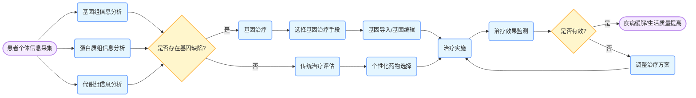

# 巴菲特 - 芒格的基因治疗投资：个性化医疗的未来

> 关键词：巴菲特；芒格；基因治疗投资；个性化医疗；医疗科技未来

> 摘要：本文围绕巴菲特和芒格的基因治疗投资展开探讨，深入分析基因治疗与个性化医疗的核心概念、技术原理，结合实际案例展示其应用，探讨在医疗领域的实际应用场景，推荐相关学习资源、开发工具与论文著作，最后总结基因治疗推动个性化医疗的未来发展趋势与挑战，旨在为读者全面呈现这一新兴领域的发展全貌。

## 1. 背景介绍 
### 1.1 目的和范围
本文旨在深入剖析巴菲特和芒格对基因治疗领域进行投资这一行为背后的战略意义，以及基因治疗投资与个性化医疗未来发展之间的紧密联系。范围涵盖基因治疗和个性化医疗的核心概念、技术原理、实际应用场景，以及相关的学习资源、开发工具和研究论文等多个方面。通过全面的分析，为读者呈现这一新兴领域的发展现状和未来趋势。

### 1.2 预期读者
本文预期读者包括对医疗科技投资感兴趣的投资者，如股票投资者、风险投资家等；从事基因治疗、个性化医疗相关研究的科研人员；关注医疗行业发展动态的医疗从业者；以及对前沿科技和未来医疗趋势有浓厚兴趣的普通读者。

### 1.3 文档结构概述
本文首先介绍基因治疗和个性化医疗的核心概念及其相互联系，通过文本示意图和 Mermaid 流程图进行直观展示。接着详细阐述基因治疗的核心算法原理，并给出具体操作步骤，配以 Python 源代码进行说明。然后介绍基因治疗相关的数学模型和公式，并举例说明其应用。通过实际的项目实战案例，详细解释代码实现和解读。之后探讨基因治疗在实际中的应用场景。推荐相关的学习资源、开发工具和论文著作。最后总结基因治疗推动个性化医疗的未来发展趋势与挑战，并对常见问题进行解答，提供扩展阅读和参考资料。

### 1.4 术语表
#### 1.4.1 核心术语定义
- **基因治疗**：指将外源正常基因导入靶细胞，以纠正或补偿因基因缺陷和异常引起的疾病，以达到治疗目的。也就是将外源基因通过基因转移技术将其插入病人的适当的受体细胞中，使外源基因制造的产物能治疗某种疾病。
- **个性化医疗**：是以个人基因组信息为基础，结合蛋白质组、代谢组等相关内环境信息，为病人量身设计出最佳治疗方案，以期达到治疗效果最大化和副作用最小化的一门定制医疗模式。
- **基因编辑**：指对基因组进行定点修饰的一项新技术。利用该技术，可以精确地定位到基因组的某一位点上，在这位点上剪断靶标 DNA 片段并插入新的基因片段。

#### 1.4.2 相关概念解释
- **基因载体**：在基因治疗中，需要将治疗性基因导入细胞，基因载体就是携带治疗性基因进入细胞的工具，常见的有病毒载体和非病毒载体。
- **生物标志物**：是指可以标记系统、器官、组织、细胞及亚细胞结构或功能的改变或可能发生的改变的生化指标，在个性化医疗中可用于疾病的诊断、治疗监测和预后评估。

#### 1.4.3 缩略词列表
- **CRISPR/Cas9**：成簇的规律间隔的短回文重复序列及其相关蛋白 9，是一种基因编辑技术。
- **RNAi**：RNA 干扰，是一种通过小分子 RNA 介导的基因表达调控机制。

## 2. 核心概念与联系 
### 核心概念原理
基因治疗的核心原理是通过向患者体内导入正常的基因，来纠正或补偿因基因缺陷或异常导致的疾病。这可以通过多种方式实现，如使用病毒载体将治疗性基因递送到目标细胞中，或者利用基因编辑技术对患者自身的基因进行修复或改造。

个性化医疗则是基于患者的个体基因信息、蛋白质组学特征、代谢组学特征等多组学数据，为患者制定个性化的治疗方案。通过分析患者的基因信息，可以了解患者对特定药物的反应、疾病的遗传易感性等，从而选择最适合患者的治疗方法。

### 架构的文本示意图
```plaintext
基因治疗与个性化医疗架构

患者个体信息
|-- 基因组信息
|-- 蛋白质组信息
|-- 代谢组信息

基因治疗手段
|-- 基因导入（病毒载体、非病毒载体）
|-- 基因编辑（CRISPR/Cas9 等）

个性化医疗方案制定
|-- 疾病诊断（基于生物标志物）
|-- 治疗选择（药物、治疗手段）
|-- 预后评估

最终治疗效果
|-- 疾病缓解
|-- 生活质量提高
```

### Mermaid 流程图


## 3. 核心算法原理 & 具体操作步骤 
### 核心算法原理
在基因治疗中，一个重要的算法应用是基因序列分析。例如，在使用 CRISPR/Cas9 进行基因编辑时，需要准确地识别目标基因序列，这就涉及到序列比对算法。其中，最经典的序列比对算法是 Needleman - Wunsch 算法，它用于全局序列比对。

### Python 代码实现 Needleman - Wunsch 算法
```python
import numpy as np

def needleman_wunsch(seq1, seq2, match_score=1, mismatch_score=-1, gap_penalty=-1):
    m = len(seq1)
    n = len(seq2)
    
    # 创建得分矩阵
    score_matrix = np.zeros((m + 1, n + 1))
    
    # 初始化第一行和第一列
    for i in range(m + 1):
        score_matrix[i][0] = i * gap_penalty
    for j in range(n + 1):
        score_matrix[0][j] = j * gap_penalty
    
    # 填充得分矩阵
    for i in range(1, m + 1):
        for j in range(1, n + 1):
            match = score_matrix[i - 1][j - 1] + (match_score if seq1[i - 1] == seq2[j - 1] else mismatch_score)
            delete = score_matrix[i - 1][j] + gap_penalty
            insert = score_matrix[i][j - 1] + gap_penalty
            score_matrix[i][j] = max(match, delete, insert)
    
    # 回溯路径
    aligned_seq1 = ""
    aligned_seq2 = ""
    i = m
    j = n
    while i > 0 or j > 0:
        if i > 0 and j > 0 and score_matrix[i][j] == score_matrix[i - 1][j - 1] + (match_score if seq1[i - 1] == seq2[j - 1] else mismatch_score):
            aligned_seq1 = seq1[i - 1] + aligned_seq1
            aligned_seq2 = seq2[j - 1] + aligned_seq2
            i -= 1
            j -= 1
        elif i > 0 and score_matrix[i][j] == score_matrix[i - 1][j] + gap_penalty:
            aligned_seq1 = seq1[i - 1] + aligned_seq1
            aligned_seq2 = "-" + aligned_seq2
            i -= 1
        else:
            aligned_seq1 = "-" + aligned_seq1
            aligned_seq2 = seq2[j - 1] + aligned_seq2
            j -= 1
    
    return aligned_seq1, aligned_seq2, score_matrix[m][n]

# 示例使用
seq1 = "AGTACGCA"
seq2 = "TATGC"
aligned_seq1, aligned_seq2, score = needleman_wunsch(seq1, seq2)
print(f"Aligned Seq1: {aligned_seq1}")
print(f"Aligned Seq2: {aligned_seq2}")
print(f"Score: {score}")
```

### 具体操作步骤
1. **数据准备**：获取待比对的基因序列，将其存储为字符串形式。
2. **初始化得分矩阵**：创建一个二维矩阵，用于存储每个位置的比对得分。矩阵的第一行和第一列根据空位罚分进行初始化。
3. **填充得分矩阵**：从矩阵的第二行第二列开始，根据当前位置的字符匹配情况、空位罚分，计算三种可能的得分（匹配、删除、插入），并选择最大值填充当前位置。
4. **回溯路径**：从得分矩阵的右下角开始，根据得分的来源回溯，构建比对后的序列。
5. **输出结果**：输出比对后的序列和最终得分。

## 4. 数学模型和公式 & 详细讲解 & 举例说明 
### Needleman - Wunsch 算法的数学模型和公式
设 $S$ 是得分矩阵，$m$ 和 $n$ 分别是两个序列的长度，$match$ 表示匹配得分，$mismatch$ 表示不匹配得分，$gap$ 表示空位罚分。

- **初始化**：
  - $S(i, 0)=i\times gap$，其中 $i = 0, 1, \cdots, m$
  - $S(0, j)=j\times gap$，其中 $j = 0, 1, \cdots, n$

- **填充得分矩阵**：
  对于 $i = 1, 2, \cdots, m$ 和 $j = 1, 2, \cdots, n$，有
  $$S(i, j)=\max\begin{cases}S(i - 1, j - 1)+
  \begin{cases}match, & \text{if } seq1[i - 1]=seq2[j - 1]\\mismatch, & \text{otherwise}\end{cases}\\S(i - 1, j)+gap\\S(i, j - 1)+gap\end{cases}$$

### 详细讲解
- 初始化阶段：第一行和第一列的得分表示一个序列与空序列进行比对时的得分，因此随着序列长度的增加，得分不断减去空位罚分。
- 填充得分矩阵阶段：对于每个位置 $(i, j)$，考虑三种可能的操作：
  - **匹配或不匹配**：如果当前位置的字符相同，则加上匹配得分；否则加上不匹配得分。
  - **删除**：表示在第一个序列中删除一个字符，得分为上一行同一列的得分加上空位罚分。
  - **插入**：表示在第二个序列中插入一个字符，得分为同一行上一列的得分加上空位罚分。选择得分最大的操作更新当前位置的得分。

### 举例说明
假设我们有两个序列 $seq1 = "AGT"$ 和 $seq2 = "AC"$，匹配得分 $match = 1$，不匹配得分 $mismatch=-1$，空位罚分 $gap=-1$。

- **初始化得分矩阵**：
  $$
  S = 
  \begin{bmatrix}
  0 & -1 & -2 \\
  -1 & 0 & 0 \\
  -2 & 0 & 0 \\
  -3 & 0 & 0
  \end{bmatrix}
  $$

- **填充得分矩阵**：
  - 当 $i = 1, j = 1$ 时，$seq1[0] = 'A'$，$seq2[0] = 'A'$，匹配，$S(1, 1)=\max\{S(0, 0)+1, S(0, 1)-1, S(1, 0)-1\}=\max\{0 + 1, -1 - 1, -1 - 1\}=1$
  - 当 $i = 1, j = 2$ 时，$seq1[0] = 'A'$，$seq2[1] = 'C'$，不匹配，$S(1, 2)=\max\{S(0, 1)-1, S(0, 2)-1, S(1, 1)-1\}=\max\{-1 - 1, -2 - 1, 1 - 1\}=0$
  以此类推，最终得到完整的得分矩阵。

## 5. 项目实战：代码实际案例和详细解释说明 
### 5.1  开发环境搭建
- **操作系统**：推荐使用 Linux 系统，如 Ubuntu 18.04 及以上版本，也可以使用 Windows 10 或 macOS。
- **Python 环境**：安装 Python 3.7 及以上版本。可以从 Python 官方网站（https://www.python.org/downloads/）下载安装包进行安装。
- **依赖库**：上述的 Needleman - Wunsch 算法仅使用了 Python 的内置库 `numpy`，可以使用以下命令进行安装：
```bash
pip install numpy
```

### 5.2  源代码详细实现和代码解读
```python
import numpy as np

def needleman_wunsch(seq1, seq2, match_score=1, mismatch_score=-1, gap_penalty=-1):
    # 获取两个序列的长度
    m = len(seq1)
    n = len(seq2)
    
    # 创建得分矩阵，初始值都为 0
    score_matrix = np.zeros((m + 1, n + 1))
    
    # 初始化第一行和第一列
    for i in range(m + 1):
        score_matrix[i][0] = i * gap_penalty
    for j in range(n + 1):
        score_matrix[0][j] = j * gap_penalty
    
    # 填充得分矩阵
    for i in range(1, m + 1):
        for j in range(1, n + 1):
            # 计算匹配或不匹配的得分
            match = score_matrix[i - 1][j - 1] + (match_score if seq1[i - 1] == seq2[j - 1] else mismatch_score)
            # 计算删除操作的得分
            delete = score_matrix[i - 1][j] + gap_penalty
            # 计算插入操作的得分
            insert = score_matrix[i][j - 1] + gap_penalty
            # 选择得分最大的操作更新当前位置的得分
            score_matrix[i][j] = max(match, delete, insert)
    
    # 回溯路径
    aligned_seq1 = ""
    aligned_seq2 = ""
    i = m
    j = n
    while i > 0 or j > 0:
        if i > 0 and j > 0 and score_matrix[i][j] == score_matrix[i - 1][j - 1] + (match_score if seq1[i - 1] == seq2[j - 1] else mismatch_score):
            # 如果是匹配或不匹配操作，将对应字符添加到比对后的序列中
            aligned_seq1 = seq1[i - 1] + aligned_seq1
            aligned_seq2 = seq2[j - 1] + aligned_seq2
            i -= 1
            j -= 1
        elif i > 0 and score_matrix[i][j] == score_matrix[i - 1][j] + gap_penalty:
            # 如果是删除操作，将第一个序列的字符添加到比对后的序列中，第二个序列添加空位
            aligned_seq1 = seq1[i - 1] + aligned_seq1
            aligned_seq2 = "-" + aligned_seq2
            i -= 1
        else:
            # 如果是插入操作，将第二个序列的字符添加到比对后的序列中，第一个序列添加空位
            aligned_seq1 = "-" + aligned_seq1
            aligned_seq2 = seq2[j - 1] + aligned_seq2
            j -= 1
    
    return aligned_seq1, aligned_seq2, score_matrix[m][n]

# 示例使用
seq1 = "AGTACGCA"
seq2 = "TATGC"
aligned_seq1, aligned_seq2, score = needleman_wunsch(seq1, seq2)
print(f"Aligned Seq1: {aligned_seq1}")
print(f"Aligned Seq2: {aligned_seq2}")
print(f"Score: {score}")
```

### 5.3  代码解读与分析
- **导入库**：导入 `numpy` 库，用于创建和操作得分矩阵。
- **函数定义**：`needleman_wunsch` 函数接受两个序列 `seq1` 和 `seq2`，以及匹配得分 `match_score`、不匹配得分 `mismatch_score` 和空位罚分 `gap_penalty` 作为参数。
- **初始化得分矩阵**：创建一个 $(m + 1)\times(n + 1)$ 的矩阵，其中 $m$ 和 $n$ 分别是两个序列的长度。第一行和第一列根据空位罚分进行初始化。
- **填充得分矩阵**：通过双重循环遍历矩阵的每个位置，计算匹配、删除和插入三种操作的得分，并选择最大值更新当前位置的得分。
- **回溯路径**：从得分矩阵的右下角开始，根据得分的来源回溯，构建比对后的序列。
- **示例使用**：定义两个示例序列 `seq1` 和 `seq2`，调用 `needleman_wunsch` 函数进行比对，并输出比对后的序列和最终得分。

## 6. 实际应用场景 
### 罕见病治疗
许多罕见病是由单个基因突变引起的，基因治疗可以针对这些突变基因进行修复或补偿，为罕见病患者带来治愈的希望。例如，某些遗传性视网膜疾病是由特定基因缺陷导致的，通过基因治疗将正常基因导入视网膜细胞，可以改善患者的视力。

### 癌症治疗
个性化医疗在癌症治疗中具有重要应用。通过分析患者肿瘤细胞的基因信息，可以了解肿瘤的基因突变情况、免疫逃逸机制等，从而选择最适合患者的治疗方案，如靶向治疗、免疫治疗等。基因治疗也可以用于增强患者自身的免疫系统对肿瘤的攻击能力。

### 药物研发
基因治疗和个性化医疗可以为药物研发提供新的思路和方法。通过对患者基因信息的分析，可以筛选出更有针对性的药物靶点，提高药物研发的效率和成功率。同时，个性化医疗可以根据患者的基因特征预测药物的疗效和不良反应，实现精准用药。

### 疾病预防
通过对人群进行基因检测，可以了解个体的疾病遗传易感性，提前采取预防措施。例如，对于携带某些癌症易感基因的人群，可以进行定期筛查和预防性干预，降低疾病的发生风险。

## 7. 工具和资源推荐
### 7.1 学习资源推荐
#### 7.1.1 书籍推荐
- 《基因治疗基础与临床》：全面介绍了基因治疗的基本原理、技术方法和临床应用，是基因治疗领域的经典教材。
- 《个性化医疗：基因组学时代的医学革命》：探讨了个性化医疗的概念、技术和应用，以及其对未来医学的影响。
- 《生物信息学概论》：介绍了生物信息学的基本概念、算法和工具，对于理解基因序列分析等相关技术有很大帮助。

#### 7.1.2 在线课程
- Coursera 上的 “Genomic Data Science” 课程：由约翰霍普金斯大学开设，介绍了基因组学数据的分析方法和技术。
- edX 上的 “Personalized Medicine: Transforming Healthcare” 课程：讲解了个性化医疗的原理、技术和应用案例。
- 中国大学 MOOC 上的 “生物信息学” 课程：国内多所高校联合开设，系统介绍了生物信息学的基础知识和常用工具。

#### 7.1.3 技术博客和网站
- 生物谷（https://www.bioon.com.cn/）：提供生物医学领域的最新研究动态、技术进展和行业资讯。
- 基因谷（https://www.genegood.com/）：专注于基因技术和基因治疗领域的信息分享和交流。
- 科学网（https://www.sciencenet.cn/）：涵盖了生命科学、医学等多个领域的科研动态和学术观点。

### 7.2 开发工具框架推荐
#### 7.2.1 IDE和编辑器
- PyCharm：功能强大的 Python 集成开发环境，提供代码编辑、调试、版本控制等功能，适合开发基因序列分析等 Python 程序。
- Jupyter Notebook：交互式的开发环境，支持 Python、R 等多种编程语言，方便进行数据分析和可视化。
- Visual Studio Code：轻量级的代码编辑器，支持多种编程语言和插件扩展，可用于基因治疗相关代码的开发。

#### 7.2.2 调试和性能分析工具
- PDB：Python 内置的调试器，可以帮助开发者逐步执行代码、查看变量值和调试程序中的错误。
- cProfile：Python 标准库中的性能分析工具，可以统计代码的运行时间和函数调用次数，帮助优化代码性能。
- Py-Spy：一个用于分析 Python 程序性能的工具，可以实时查看程序的 CPU 使用率和函数调用情况。

#### 7.2.3 相关框架和库
- Biopython：一个专门用于生物信息学的 Python 库，提供了许多处理生物序列、结构和数据库的工具和函数。
- Scikit-learn：一个广泛使用的机器学习库，可用于基因数据的分类、聚类和预测等任务。
- TensorFlow 和 PyTorch：深度学习框架，可用于构建和训练基因治疗相关的深度学习模型，如基因表达预测模型。

### 7.3 相关论文著作推荐
#### 7.3.1 经典论文
- "A general method applicable to the search for similarities in the amino acid sequence of two proteins" by Saul B. Needleman and Christian D. Wunsch：介绍了 Needleman - Wunsch 算法，是序列比对领域的经典论文。
- "CRISPR/Cas9, the next generation of genome editing technology" by Feng Zhang：阐述了 CRISPR/Cas9 基因编辑技术的原理和应用前景。
- "The Human Genome Project: Lessons from Large - Scale Biology" by Eric S. Lander et al.：介绍了人类基因组计划的成果和意义，为基因治疗和个性化医疗奠定了基础。

#### 7.3.2 最新研究成果
- 定期关注《Nature》《Science》《Cell》等顶级学术期刊上关于基因治疗和个性化医疗的研究论文，了解该领域的最新研究动态和技术突破。
- 参加国际基因治疗大会（ASGCT）等学术会议，获取最新的研究成果和行业趋势。

#### 7.3.3 应用案例分析
- 《基因治疗临床应用案例集》：收集了多个基因治疗的临床应用案例，详细介绍了治疗方案、疗效评估和不良反应等方面的内容。
- 相关医学期刊上的病例报告和临床研究论文，分析基因治疗和个性化医疗在实际临床中的应用效果和挑战。

## 8. 总结：未来发展趋势与挑战
### 未来发展趋势
- **技术不断创新**：基因编辑技术将不断发展和完善，如 CRISPR/Cas9 技术的优化和新型基因编辑工具的出现，将提高基因治疗的准确性和效率。同时，基因测序技术的成本将不断降低，测序速度将不断提高，为个性化医疗提供更丰富的数据支持。
- **多组学数据整合**：未来的个性化医疗将不仅仅依赖于基因组信息，还将整合蛋白质组、代谢组、转录组等多组学数据，实现更全面、准确的疾病诊断和治疗方案制定。
- **药物研发变革**：基因治疗和个性化医疗将推动药物研发模式的变革，从传统的“一刀切”药物研发向个性化药物研发转变。基于患者基因特征的靶向药物和个性化疫苗将成为研发热点。
- **医疗模式转变**：个性化医疗将逐渐改变传统的医疗模式，从以疾病治疗为中心向以疾病预防和健康管理为中心转变。通过基因检测和个性化健康干预，实现疾病的早期发现和精准预防。

### 挑战
- **技术安全性**：基因治疗涉及到对人体基因的操作，存在一定的安全风险，如脱靶效应、免疫反应等。如何确保基因治疗的安全性是该领域面临的重要挑战之一。
- **伦理和法律问题**：基因治疗和个性化医疗引发了一系列伦理和法律问题，如基因隐私保护、基因编辑的伦理界限、基因治疗的费用和公平性等。需要建立健全相关的伦理和法律制度，规范该领域的发展。
- **数据管理和分析**：随着多组学数据的不断积累，如何高效地管理和分析这些数据成为挑战。需要开发先进的数据存储、处理和分析技术，挖掘数据背后的生物学意义。
- **医疗成本和可及性**：目前基因治疗的成本较高，限制了其在临床上的广泛应用。如何降低基因治疗的成本，提高其可及性，是实现个性化医疗普及的关键。

## 9. 附录：常见问题与解答
### 基因治疗会改变人类的基因库吗？
目前的基因治疗主要是针对体细胞进行操作，不会改变生殖细胞的基因，因此不会直接改变人类的基因库。但如果进行生殖细胞的基因编辑，可能会对人类基因库产生影响，这也是生殖细胞基因编辑面临严格伦理和法律限制的原因。

### 个性化医疗是否适用于所有疾病？
个性化医疗在许多疾病的诊断和治疗中具有重要应用价值，但并不是适用于所有疾病。对于一些由环境因素主导的疾病，如传染病，个性化医疗的作用相对有限。然而，即使对于这类疾病，个性化医疗也可以根据患者的个体免疫状态等因素制定更合适的治疗方案。

### 基因治疗的效果能持续多久？
基因治疗的效果持续时间因治疗方法、疾病类型和个体差异而异。有些基因治疗可以实现长期甚至永久性的治疗效果，如某些遗传性疾病的基因治疗；而对于一些需要持续表达治疗性基因的情况，可能需要多次治疗或采用长效表达的载体来维持治疗效果。

### 如何保障基因数据的隐私安全？
保障基因数据的隐私安全需要从多个方面入手。首先，医疗机构和科研机构应建立严格的数据管理制度，对基因数据进行加密存储和访问控制。其次，加强法律法规建设，明确基因数据的使用规范和隐私保护责任。此外，患者也应增强自我保护意识，了解基因数据的使用情况和隐私保护措施。

## 10. 扩展阅读 & 参考资料
### 扩展阅读
- 《未来医疗：智能时代的个体医疗革命》：探讨了未来医疗的发展趋势和技术创新，包括基因治疗、人工智能在医疗领域的应用等。
- 《生命的未来：生物技术革命将如何改变我们的生活》：介绍了生物技术的最新进展和应用前景，以及对人类社会的影响。

### 参考资料
- 相关学术期刊和会议论文，如《Nature Biotechnology》《Journal of Gene Medicine》等。
- 政府部门和行业协会发布的报告和政策文件，如美国食品药品监督管理局（FDA）关于基因治疗的审批指南。
- 基因治疗和个性化医疗相关的企业网站和产品说明书。

作者：AI天才研究院/AI Genius Institute & 禅与计算机程序设计艺术 /Zen And The Art of Computer Programming