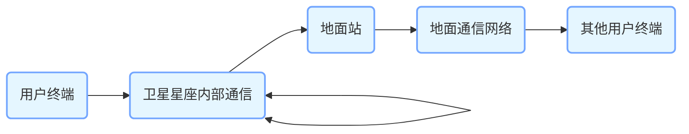

# 巴菲特 - 芒格的太空互联网投资：全球连接的新纪元

> 关键词：巴菲特；芒格；太空互联网；全球连接；投资策略；卫星通信；太空经济

> 摘要：本文聚焦于巴菲特和芒格对太空互联网领域的投资，深入剖析这一投资背后的战略意义和潜在影响。通过详细介绍太空互联网的核心概念、技术原理、数学模型，结合实际项目案例，探讨其在全球连接方面带来的新纪元。同时，分析太空互联网的实际应用场景，推荐相关学习资源、开发工具和研究论文，最后总结该领域的未来发展趋势与挑战，并解答常见问题，为读者全面呈现太空互联网投资这一前沿话题。

## 1. 背景介绍 
### 1.1 目的和范围
本文旨在深入探讨巴菲特和芒格对太空互联网进行投资这一事件背后的逻辑和影响。通过对太空互联网相关技术、商业应用、市场前景等多方面的分析，揭示这一投资所代表的全球连接新纪元的内涵。范围涵盖太空互联网的核心概念、技术原理、数学模型、实际项目案例、应用场景以及未来发展趋势等内容。

### 1.2 预期读者
本文预期读者包括对投资领域感兴趣的专业人士、科技爱好者、从事卫星通信和太空经济相关研究的学者以及关注全球连接和通信技术发展的普通读者。通过本文，读者可以了解太空互联网这一新兴领域的基本知识、投资价值和发展前景。

### 1.3 文档结构概述
本文将按照以下结构进行阐述：首先介绍太空互联网的核心概念与联系，包括其原理和架构；接着详细讲解核心算法原理和具体操作步骤，并给出 Python 源代码示例；然后介绍相关的数学模型和公式，并举例说明；通过实际项目案例展示太空互联网的应用和实现；分析太空互联网的实际应用场景；推荐相关的学习资源、开发工具和研究论文；总结该领域的未来发展趋势与挑战；解答常见问题；最后提供扩展阅读和参考资料。

### 1.4 术语表
#### 1.4.1 核心术语定义
- **太空互联网**：利用卫星网络构建的全球性互联网通信系统，通过卫星与地面站、用户终端之间的通信，实现全球范围内的高速数据传输和网络连接。
- **低地球轨道卫星（LEO）**：运行轨道高度在 200 - 2000 公里之间的卫星，具有通信延迟低、信号强度高的特点，是太空互联网的主要组成部分。
- **卫星星座**：由多颗卫星组成的卫星系统，通过合理的轨道布局和协同工作，实现对地球表面的全面覆盖和高效通信。
- **卫星通信**：利用人造地球卫星作为中继站进行的无线电通信，包括卫星与地面站之间、卫星与卫星之间的通信。

#### 1.4.2 相关概念解释
- **全球连接**：指通过太空互联网等技术手段，实现全球各个地区之间的无缝网络连接，消除地理和基础设施限制，使信息能够在全球范围内自由流动。
- **太空经济**：涵盖太空探索、卫星应用、太空旅游等多个领域的经济活动，太空互联网是太空经济的重要组成部分，具有巨大的商业潜力。
- **通信延迟**：指信息从发送端到接收端所经历的时间延迟，低通信延迟对于实时通信和高速数据传输至关重要。

#### 1.4.3 缩略词列表
- **LEO**：Low Earth Orbit，低地球轨道
- **GEO**：Geostationary Earth Orbit，地球静止轨道
- **MEO**：Medium Earth Orbit，中地球轨道
- **IoT**：Internet of Things，物联网

## 2. 核心概念与联系 
### 2.1 太空互联网的原理
太空互联网的核心原理是利用卫星星座构建一个全球性的通信网络。卫星作为中继站，接收来自地面站或用户终端的信号，并将其转发到其他卫星或地面目标。通过卫星之间的星际链路和卫星与地面站的通信链路，实现全球范围内的信息传输。

太空互联网的优势在于能够覆盖全球各个角落，包括偏远地区、海洋和空中等传统通信难以到达的区域。与传统的地面通信网络相比，太空互联网具有通信延迟低、带宽高、不受地理条件限制等优点。

### 2.2 太空互联网的架构
太空互联网的架构主要由卫星星座、地面站和用户终端三部分组成。

#### 2.2.1 卫星星座
卫星星座是太空互联网的核心组成部分，通常由大量的低地球轨道卫星组成。这些卫星按照一定的轨道布局和组网方式运行，实现对地球表面的全面覆盖。卫星星座的设计需要考虑多个因素，如卫星数量、轨道高度、轨道倾角、卫星间的通信链路等。

#### 2.2.2 地面站
地面站是太空互联网与地面通信网络的接口，负责与卫星进行通信，并将卫星传输的信号转发到地面通信网络。地面站通常包括天线、发射机、接收机等设备，具有高增益、高灵敏度的特点。

#### 2.2.3 用户终端
用户终端是太空互联网的最终使用设备，包括智能手机、平板电脑、笔记本电脑、物联网设备等。用户终端通过与卫星进行通信，实现接入太空互联网的目的。

### 2.3 文本示意图
太空互联网的架构可以用以下文本示意图表示：

```plaintext
             +-------------------+
             |    卫星星座      |
             +-------------------+
             /         |         \
            /          |          \
 +---------+     +---------+     +---------+
 |  地面站  |     |  地面站  |     |  地面站  |
 +---------+     +---------+     +---------+
       |               |               |
       |               |               |
 +---------+     +---------+     +---------+
 | 用户终端 |     | 用户终端 |     | 用户终端 |
 +---------+     +---------+     +---------+
```

### 2.4 Mermaid 流程图


## 3. 核心算法原理 & 具体操作步骤 
### 3.1 卫星轨道计算算法
卫星轨道计算是太空互联网中的重要环节，它涉及到卫星的位置、速度和轨道参数的计算。常用的卫星轨道计算算法有开普勒定律和牛顿万有引力定律。

#### 3.1.1 开普勒定律
开普勒定律描述了行星绕太阳运动的规律，同样适用于卫星绕地球运动。开普勒第一定律指出，卫星的轨道是一个椭圆，地球位于椭圆的一个焦点上；开普勒第二定律指出，卫星在单位时间内扫过的面积相等；开普勒第三定律指出，卫星绕地球运动的周期的平方与轨道半长轴的立方成正比。

#### 3.1.2 牛顿万有引力定律
牛顿万有引力定律描述了物体之间的引力作用，卫星绕地球运动的向心力就是由地球对卫星的引力提供的。根据牛顿万有引力定律，可以计算出卫星的轨道参数和运动状态。

### 3.2 Python 代码实现
以下是一个简单的 Python 代码示例，用于计算卫星的轨道参数：

```python
import math

# 地球的引力常数 (m^3/s^2)
G = 6.67430e-11
# 地球的质量 (kg)
M = 5.972e24

def calculate_orbit_period(semi_major_axis):
    """
    计算卫星的轨道周期
    :param semi_major_axis: 轨道半长轴 (m)
    :return: 轨道周期 (s)
    """
    period = 2 * math.pi * math.sqrt((semi_major_axis ** 3) / (G * M))
    return period

# 示例：计算轨道半长轴为 7000000 米的卫星的轨道周期
semi_major_axis = 7000000
period = calculate_orbit_period(semi_major_axis)
print(f"卫星的轨道周期为: {period} 秒")
```

### 3.3 具体操作步骤
#### 3.3.1 确定卫星的轨道参数
在进行卫星轨道计算之前，需要确定卫星的轨道参数，如轨道半长轴、轨道倾角、偏心率等。这些参数可以通过卫星的设计要求和任务需求来确定。

#### 3.3.2 选择合适的计算方法
根据卫星的轨道类型和计算精度要求，选择合适的计算方法，如开普勒定律、牛顿万有引力定律或其他更复杂的计算方法。

#### 3.3.3 编写代码并进行计算
使用 Python 等编程语言编写代码，实现卫星轨道计算算法。将确定的轨道参数输入到代码中，进行计算并输出结果。

#### 3.3.4 验证和优化计算结果
对计算结果进行验证，确保其符合实际情况。如果计算结果存在误差，可以对计算方法和参数进行优化，提高计算精度。

## 4. 数学模型和公式 & 详细讲解 & 举例说明 
### 4.1 开普勒定律的数学模型
#### 4.1.1 开普勒第一定律
开普勒第一定律可以用以下数学公式表示：

$$\frac{x^2}{a^2} + \frac{y^2}{b^2} = 1$$

其中，$x$ 和 $y$ 是卫星在轨道平面上的坐标，$a$ 是轨道半长轴，$b$ 是轨道半短轴。

#### 4.1.2 开普勒第二定律
开普勒第二定律可以用以下数学公式表示：

$$\frac{dA}{dt} = \frac{1}{2} r^2 \frac{d\theta}{dt} = \text{常数}$$

其中，$A$ 是卫星在单位时间内扫过的面积，$r$ 是卫星到地球的距离，$\theta$ 是卫星的真近点角。

#### 4.1.3 开普勒第三定律
开普勒第三定律可以用以下数学公式表示：

$$\frac{T^2}{a^3} = \frac{4\pi^2}{GM}$$

其中，$T$ 是卫星的轨道周期，$a$ 是轨道半长轴，$G$ 是地球的引力常数，$M$ 是地球的质量。

### 4.2 牛顿万有引力定律的数学模型
牛顿万有引力定律可以用以下数学公式表示：

$$F = G \frac{m_1 m_2}{r^2}$$

其中，$F$ 是两个物体之间的引力，$G$ 是引力常数，$m_1$ 和 $m_2$ 是两个物体的质量，$r$ 是两个物体之间的距离。

对于卫星绕地球运动的情况，卫星所受的向心力等于地球对卫星的引力，即：

$$m \frac{v^2}{r} = G \frac{Mm}{r^2}$$

其中，$m$ 是卫星的质量，$v$ 是卫星的线速度，$r$ 是卫星到地球的距离，$M$ 是地球的质量。

### 4.3 举例说明
假设我们要计算一颗轨道半长轴为 7000000 米的卫星的轨道周期。根据开普勒第三定律：

$$T = 2\pi \sqrt{\frac{a^3}{GM}}$$

将 $a = 7000000$ 米，$G = 6.67430e-11$ $m^3/s^2$，$M = 5.972e24$ kg 代入上式，可得：

$$T = 2\pi \sqrt{\frac{(7000000)^3}{6.67430e-11 \times 5.972e24}} \approx 5800 \text{ 秒}$$

这与我们在 Python 代码中计算的结果是一致的。

## 5. 项目实战：代码实际案例和详细解释说明 
### 5.1  开发环境搭建
#### 5.1.1 安装 Python
首先，需要安装 Python 编程语言。可以从 Python 官方网站（https://www.python.org/downloads/）下载适合自己操作系统的 Python 安装包，并按照安装向导进行安装。

#### 5.1.2 安装必要的库
在进行太空互联网项目开发时，可能需要使用一些第三方库，如 `numpy`、`matplotlib` 等。可以使用以下命令来安装这些库：

```sh
pip install numpy matplotlib
```

### 5.2  源代码详细实现和代码解读
以下是一个更复杂的 Python 代码示例，用于模拟卫星星座的运行和通信：

```python
import numpy as np
import matplotlib.pyplot as plt
from mpl_toolkits.mplot3d import Axes3D

# 地球的半径 (m)
EARTH_RADIUS = 6371000
# 卫星轨道高度 (m)
ORBIT_ALTITUDE = 550000
# 卫星数量
NUM_SATELLITES = 66
# 轨道面数量
NUM_PLANES = 6
# 每个轨道面的卫星数量
SATELLITES_PER_PLANE = NUM_SATELLITES // NUM_PLANES

# 计算卫星轨道半径
ORBIT_RADIUS = EARTH_RADIUS + ORBIT_ALTITUDE

# 初始化卫星位置
satellite_positions = []
for i in range(NUM_PLANES):
    for j in range(SATELLITES_PER_PLANE):
        # 计算轨道面倾角
        inclination = 53 * np.pi / 180
        # 计算卫星在轨道面上的位置
        true_anomaly = 2 * np.pi * j / SATELLITES_PER_PLANE
        # 计算卫星的直角坐标
        x = ORBIT_RADIUS * np.cos(true_anomaly) * np.cos(inclination)
        y = ORBIT_RADIUS * np.sin(true_anomaly)
        z = ORBIT_RADIUS * np.cos(true_anomaly) * np.sin(inclination)
        satellite_positions.append([x, y, z])

satellite_positions = np.array(satellite_positions)

# 绘制卫星星座
fig = plt.figure()
ax = fig.add_subplot(111, projection='3d')
# 绘制地球
u, v = np.mgrid[0:2*np.pi:20j, 0:np.pi:10j]
x = EARTH_RADIUS * np.cos(u) * np.sin(v)
y = EARTH_RADIUS * np.sin(u) * np.sin(v)
z = EARTH_RADIUS * np.cos(v)
ax.plot_wireframe(x, y, z, color='b')
# 绘制卫星
ax.scatter(satellite_positions[:, 0], satellite_positions[:, 1], satellite_positions[:, 2], c='r', marker='o')
ax.set_xlabel('X (m)')
ax.set_ylabel('Y (m)')
ax.set_zlabel('Z (m)')
plt.show()
```

### 5.3  代码解读与分析
#### 5.3.1 代码功能概述
这段代码的主要功能是模拟一个由 66 颗卫星组成的卫星星座的运行和通信，并使用 3D 图形进行可视化展示。

#### 5.3.2 代码详细解读
- **参数定义**：定义了地球的半径、卫星轨道高度、卫星数量、轨道面数量等参数。
- **卫星位置计算**：通过循环计算每个卫星在轨道面上的位置，并将其转换为直角坐标。
- **绘制地球和卫星**：使用 `matplotlib` 库的 `Axes3D` 模块绘制地球和卫星的 3D 图形。

#### 5.3.3 代码分析
这段代码通过简单的数学模型和编程实现，模拟了卫星星座的运行和通信。通过可视化展示，可以直观地观察卫星星座的布局和分布情况。在实际应用中，还需要考虑更多的因素，如卫星的运动规律、通信链路的建立和维护等。

## 6. 实际应用场景 
### 6.1 全球宽带互联网接入
太空互联网可以为全球各个地区提供高速、稳定的宽带互联网接入服务，尤其是在偏远地区、海洋和空中等传统通信难以覆盖的区域。通过太空互联网，这些地区的居民和企业可以享受到与城市地区相同的网络服务，促进信息的流通和经济的发展。

### 6.2 物联网通信
物联网是未来信息技术发展的重要方向，太空互联网可以为物联网设备提供全球范围内的通信支持。通过太空互联网，物联网设备可以实现实时数据传输和远程控制，提高物联网系统的可靠性和效率。

### 6.3 航空和航海通信
在航空和航海领域，太空互联网可以为飞机和船舶提供可靠的通信服务。通过太空互联网，飞机和船舶可以实时获取气象信息、导航数据和其他重要信息，提高飞行和航行的安全性和效率。

### 6.4 应急通信
在自然灾害和其他紧急情况下，传统的通信网络可能会受到破坏，导致通信中断。太空互联网可以作为应急通信的备份手段，为救援人员和受灾群众提供通信支持，保障救援工作的顺利进行。

## 7. 工具和资源推荐
### 7.1 学习资源推荐
#### 7.1.1 书籍推荐
- 《卫星通信系统工程》：本书系统地介绍了卫星通信系统的基本原理、设计方法和工程实践，是学习卫星通信的经典教材。
- 《太空经济学》：本书探讨了太空经济的发展现状、趋势和挑战，对于了解太空互联网的商业前景和投资价值具有重要参考意义。
- 《天体力学基础》：本书介绍了天体力学的基本理论和方法，对于学习卫星轨道计算和卫星运动规律具有重要帮助。

#### 7.1.2 在线课程
- Coursera 上的“卫星通信与网络”课程：该课程由知名高校的教授授课，系统地介绍了卫星通信的基本原理、技术和应用。
- edX 上的“太空探索与开发”课程：该课程涵盖了太空探索的历史、现状和未来发展趋势，以及太空经济、太空政策等方面的内容。

#### 7.1.3 技术博客和网站
- 航天爱好者网：该网站提供了丰富的航天资讯、技术文章和论坛交流平台，是航天爱好者学习和交流的好去处。
- IEEE 航天与电子系统协会官网：该网站发布了航天和电子系统领域的最新研究成果和技术动态，对于了解太空互联网的前沿技术具有重要参考价值。

### 7.2 开发工具框架推荐
#### 7.2.1 IDE和编辑器
- PyCharm：一款功能强大的 Python 集成开发环境，提供了代码编辑、调试、版本控制等功能，适合进行太空互联网项目的开发。
- Visual Studio Code：一款轻量级的代码编辑器，支持多种编程语言和插件扩展，具有良好的开发体验。

#### 7.2.2 调试和性能分析工具
- Py-Spy：一款 Python 性能分析工具，可以实时监测 Python 程序的性能指标，帮助开发者优化代码性能。
- Wireshark：一款网络协议分析工具，可以捕获和分析网络数据包，帮助开发者调试和优化太空互联网通信系统。

#### 7.2.3 相关框架和库
- NumPy：一个用于科学计算的 Python 库，提供了高效的数组操作和数学函数，适合进行卫星轨道计算和数据分析。
- Matplotlib：一个用于数据可视化的 Python 库，提供了丰富的绘图函数和工具，适合进行卫星星座的可视化展示。

### 7.3 相关论文著作推荐
#### 7.3.1 经典论文
- “A Survey on Satellite Internet of Things”：该论文对卫星物联网的研究现状、关键技术和应用场景进行了全面的综述，对于了解卫星互联网的发展趋势具有重要参考价值。
- “Low Earth Orbit Satellite Constellations for 5G and Beyond: A Survey”：该论文探讨了低地球轨道卫星星座在 5G 及未来通信中的应用和挑战，对于研究太空互联网与 5G 通信的融合具有重要意义。

#### 7.3.2 最新研究成果
- 可以通过 IEEE Xplore、ACM Digital Library 等学术数据库搜索太空互联网领域的最新研究论文，了解该领域的前沿技术和研究动态。

#### 7.3.3 应用案例分析
- 可以参考 SpaceX 的 Starlink 项目、OneWeb 的卫星星座计划等实际应用案例，了解太空互联网项目的实施过程、技术挑战和商业运营模式。

## 8. 总结：未来发展趋势与挑战
### 8.1 未来发展趋势
#### 8.1.1 卫星星座规模不断扩大
为了实现全球更广泛的覆盖和更高的通信质量，未来的卫星星座规模将不断扩大。例如，SpaceX 的 Starlink 项目计划发射数万颗卫星，构建一个庞大的卫星互联网网络。

#### 8.1.2 与 5G 和 6G 通信融合
太空互联网将与 5G 和 6G 通信技术深度融合，形成天地一体化的通信网络。通过卫星与地面基站的协同工作，实现全球无缝覆盖和高速数据传输。

#### 8.1.3 应用场景不断拓展
随着技术的不断发展，太空互联网的应用场景将不断拓展。除了现有的全球宽带互联网接入、物联网通信、航空和航海通信等领域，还将在智能交通、智慧城市、远程教育等领域发挥重要作用。

### 8.2 挑战
#### 8.2.1 技术挑战
太空互联网涉及到卫星设计、发射、运行管理等多个环节，面临着许多技术挑战。例如，卫星的轨道控制、通信链路的建立和维护、卫星间的干扰协调等问题都需要进一步研究和解决。

#### 8.2.2 空间碎片问题
随着卫星数量的不断增加，空间碎片问题日益严重。空间碎片可能会对卫星造成撞击和损坏，影响太空互联网的正常运行。因此，需要采取有效的措施来减少空间碎片的产生和对卫星的威胁。

#### 8.2.3 商业运营挑战
太空互联网项目的建设和运营需要大量的资金投入，并且面临着市场竞争和政策法规等方面的挑战。如何实现商业盈利和可持续发展是太空互联网企业需要解决的重要问题。

## 9. 附录：常见问题与解答
### 9.1 太空互联网的通信延迟是多少？
太空互联网的通信延迟主要取决于卫星的轨道高度和信号传输路径。一般来说，低地球轨道卫星的通信延迟可以控制在几十毫秒以内，与传统的地面通信网络相当。

### 9.2 太空互联网的覆盖范围有多大？
太空互联网可以实现全球覆盖，包括偏远地区、海洋和空中等传统通信难以到达的区域。通过合理的卫星星座设计和轨道布局，可以确保全球各个地区都能接收到卫星信号。

### 9.3 太空互联网的成本高吗？
太空互联网项目的建设和运营成本相对较高，主要包括卫星制造、发射、运行管理等方面的费用。但是，随着技术的不断进步和规模效应的显现，太空互联网的成本有望逐渐降低。

### 9.4 太空互联网会对传统通信网络造成冲击吗？
太空互联网和传统通信网络可以相互补充，共同为用户提供更好的通信服务。太空互联网在全球覆盖和偏远地区通信方面具有优势，而传统通信网络在城市地区和室内覆盖方面具有优势。两者的结合将形成更加完善的通信网络体系。

## 10. 扩展阅读 & 参考资料
- [SpaceX Starlink 官方网站](https://www.starlink.com/)
- [OneWeb 官方网站](https://www.oneweb.world/)
- 《航天工程概论》，北京航空航天大学出版社
- 《通信原理》，国防工业出版社

作者：AI天才研究院/AI Genius Institute & 禅与计算机程序设计艺术 /Zen And The Art of Computer Programming