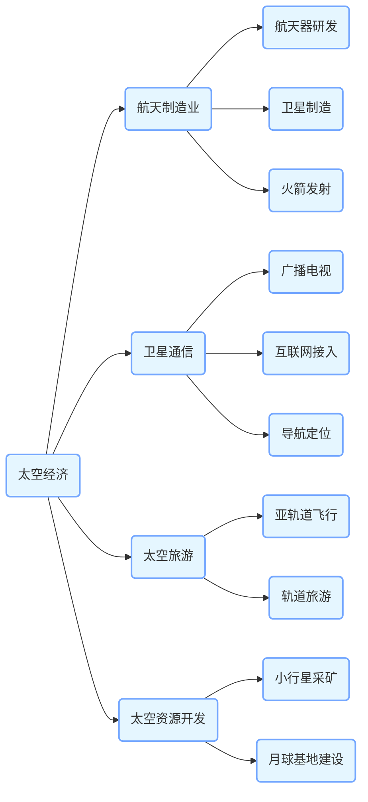

# 巴菲特 - 芒格的太空经济投资：探索未来增长 frontier

> 关键词：巴菲特；芒格；太空经济投资；未来增长前沿；投资策略

> 摘要：本文聚焦于巴菲特和芒格在太空经济领域的投资探索，旨在深入剖析这一新兴投资方向背后的逻辑、原理及实际应用。通过介绍太空经济的核心概念与联系、核心算法原理、数学模型和公式，结合项目实战案例，探讨太空经济投资在实际应用场景中的表现。同时，推荐相关的学习资源、开发工具框架以及论文著作，最后总结太空经济投资的未来发展趋势与挑战，并提供常见问题解答和扩展阅读参考资料，帮助读者全面了解巴菲特 - 芒格的太空经济投资理念及该领域的发展前景。

## 1. 背景介绍 
### 1.1 目的和范围
本文章的目的在于深入研究巴菲特和芒格在太空经济投资领域的策略和决策，为投资者、金融从业者以及对太空经济感兴趣的人士提供全面且深入的分析。范围涵盖太空经济的核心概念、投资算法原理、数学模型、实际应用案例等多个方面，旨在从理论和实践两个维度剖析太空经济投资的可行性和潜在价值。

### 1.2 预期读者
预期读者包括但不限于专业投资者、金融分析师、科技爱好者、太空经济领域的创业者以及对巴菲特和芒格投资理念感兴趣的人群。文章将以深入浅出的方式阐述复杂的投资理论和技术原理，使不同专业背景的读者都能从中获得有价值的信息。

### 1.3 文档结构概述
本文将按照以下结构展开：首先介绍太空经济投资的核心概念与联系，包括相关的原理和架构示意图；接着详细阐述核心算法原理及具体操作步骤，并使用 Python 源代码进行说明；然后讲解数学模型和公式，并通过举例进行详细说明；之后通过项目实战案例，展示太空经济投资在实际中的应用；再探讨太空经济投资的实际应用场景；推荐相关的学习资源、开发工具框架和论文著作；最后总结太空经济投资的未来发展趋势与挑战，提供常见问题解答和扩展阅读参考资料。

### 1.4 术语表
#### 1.4.1 核心术语定义
- **太空经济**：指与太空活动相关的一切经济活动的总和，包括航天制造业、卫星通信、太空旅游、太空资源开发等多个领域。
- **巴菲特 - 芒格投资理念**：强调价值投资，即寻找具有长期竞争优势和稳定现金流的企业，以合理的价格买入并长期持有。
- **投资前沿（frontier）**：指具有高增长潜力但同时也伴随着高风险的新兴投资领域。

#### 1.4.2 相关概念解释
- **价值投资**：基于对企业内在价值的评估，而非市场短期波动进行投资决策。投资者通过分析企业的财务状况、竞争优势、管理团队等因素，寻找被低估的股票。
- **风险 - 回报权衡**：在投资过程中，投资者需要在追求高回报的同时，考虑所承担的风险。通常情况下，高回报伴随着高风险，投资者需要根据自己的风险承受能力做出合理的投资决策。

#### 1.4.3 缩略词列表
- **ROI**：Return on Investment，投资回报率
- **NPV**：Net Present Value，净现值
- **DCF**：Discounted Cash Flow，现金流折现法

## 2. 核心概念与联系 
### 2.1 太空经济的核心概念
太空经济是一个涵盖广泛领域的新兴经济概念，它主要包括以下几个方面：
- **航天制造业**：涉及航天器、卫星、火箭等的研发、制造和销售。例如，SpaceX 公司通过不断创新和降低成本，在火箭制造和发射领域取得了显著成就。
- **卫星通信**：利用卫星进行通信服务，包括广播电视、互联网接入、导航定位等。全球卫星通信市场规模不断扩大，为人们的生活和工作带来了极大的便利。
- **太空旅游**：提供太空旅行体验的服务，吸引了众多富豪和冒险家的关注。维珍银河公司致力于开发太空旅游业务，计划为游客提供亚轨道飞行体验。
- **太空资源开发**：探索和开发太空资源，如小行星采矿、月球基地建设等。虽然目前仍处于早期阶段，但具有巨大的发展潜力。

### 2.2 太空经济与巴菲特 - 芒格投资理念的联系
巴菲特和芒格一直秉持价值投资理念，注重寻找具有长期竞争优势和稳定现金流的企业。太空经济领域虽然具有较高的风险和不确定性，但也存在一些符合他们投资标准的企业。例如，一些卫星通信企业具有稳定的客户群体和现金流，同时受益于行业的长期增长趋势。此外，太空经济的发展也需要大量的基础设施建设和技术创新，这为一些具有核心竞争力的企业提供了发展机遇。

### 2.3 核心概念原理和架构的文本示意图
```plaintext
太空经济
|-- 航天制造业
|   |-- 航天器研发
|   |-- 卫星制造
|   |-- 火箭发射
|-- 卫星通信
|   |-- 广播电视
|   |-- 互联网接入
|   |-- 导航定位
|-- 太空旅游
|   |-- 亚轨道飞行
|   |-- 轨道旅游
|-- 太空资源开发
|   |-- 小行星采矿
|   |-- 月球基地建设
```

### 2.4 Mermaid 流程图


## 3. 核心算法原理 & 具体操作步骤 
### 3.1 核心算法原理
在太空经济投资中，常用的算法原理包括现金流折现法（DCF）和投资回报率（ROI）分析。

#### 3.1.1 现金流折现法（DCF）
现金流折现法是一种基于未来现金流预测的估值方法，其核心思想是将企业未来的现金流按照一定的折现率折现到当前时刻，以评估企业的内在价值。计算公式如下：
$$NPV = \sum_{t=1}^{n} \frac{CF_t}{(1 + r)^t} - I_0$$
其中，$NPV$ 表示净现值，$CF_t$ 表示第 $t$ 期的现金流，$r$ 表示折现率，$I_0$ 表示初始投资。

#### 3.1.2 投资回报率（ROI）分析
投资回报率是指投资收益与投资成本的比率，用于衡量投资的盈利能力。计算公式如下：
$$ROI = \frac{投资收益 - 投资成本}{投资成本} \times 100\%$$

### 3.2 具体操作步骤
#### 3.2.1 数据收集
收集太空经济相关企业的财务报表、行业报告、市场数据等信息，包括企业的收入、利润、现金流、市场份额等。

#### 3.2.2 现金流预测
根据收集到的数据，对企业未来的现金流进行预测。预测过程中需要考虑行业发展趋势、企业竞争优势、市场需求等因素。

#### 3.2.3 折现率确定
折现率反映了投资的风险程度，通常根据市场利率、行业风险等因素确定。一般来说，太空经济领域的投资风险较高，折现率也相对较高。

#### 3.2.4 净现值计算
将预测的现金流按照确定的折现率折现到当前时刻，计算净现值。如果净现值大于零，则说明该投资具有价值；如果净现值小于零，则说明该投资不具有价值。

#### 3.2.5 投资回报率计算
根据投资收益和投资成本，计算投资回报率。投资回报率越高，说明投资的盈利能力越强。

### 3.3 Python 源代码实现
```python
import numpy as np

def dcf(cash_flows, discount_rate, initial_investment):
    """
    计算现金流折现法的净现值
    :param cash_flows: 未来各期的现金流列表
    :param discount_rate: 折现率
    :param initial_investment: 初始投资
    :return: 净现值
    """
    periods = len(cash_flows)
    discounted_cash_flows = [cf / ((1 + discount_rate) ** (i + 1)) for i, cf in enumerate(cash_flows)]
    npv = sum(discounted_cash_flows) - initial_investment
    return npv

def roi(investment_income, investment_cost):
    """
    计算投资回报率
    :param investment_income: 投资收益
    :param investment_cost: 投资成本
    :return: 投资回报率
    """
    return ((investment_income - investment_cost) / investment_cost) * 100

# 示例数据
cash_flows = [100, 200, 300, 400, 500]
discount_rate = 0.1
initial_investment = 1000
investment_income = 2000
investment_cost = 1000

# 计算净现值
npv = dcf(cash_flows, discount_rate, initial_investment)
print(f"净现值: {npv}")

# 计算投资回报率
roi_value = roi(investment_income, investment_cost)
print(f"投资回报率: {roi_value}%")
```

## 4. 数学模型和公式 & 详细讲解 & 举例说明 
### 4.1 现金流折现法（DCF）数学模型和公式
现金流折现法的数学模型基于货币的时间价值原理，即未来的一元钱价值低于当前的一元钱。其核心公式为：
$$NPV = \sum_{t=1}^{n} \frac{CF_t}{(1 + r)^t} - I_0$$
其中：
- $NPV$（Net Present Value）：净现值，用于衡量投资项目的价值。如果 $NPV > 0$，则项目具有投资价值；如果 $NPV < 0$，则项目不具有投资价值。
- $CF_t$（Cash Flow at time t）：第 $t$ 期的现金流，包括现金流入和现金流出。现金流的预测需要考虑企业的经营状况、市场环境等因素。
- $r$（Discount Rate）：折现率，反映了投资的风险程度。折现率越高，说明投资的风险越大。
- $I_0$（Initial Investment）：初始投资，即项目开始时的投资成本。

### 4.2 详细讲解
#### 4.2.1 现金流预测
现金流预测是 DCF 模型的关键步骤之一。在太空经济投资中，需要考虑以下因素：
- **行业发展趋势**：太空经济是一个新兴领域，行业发展迅速。需要分析行业的增长趋势、市场规模、竞争格局等因素，以预测企业未来的现金流。
- **企业竞争优势**：评估企业在技术、市场份额、客户资源等方面的竞争优势，这些因素将影响企业未来的盈利能力和现金流。
- **政策环境**：政府的政策支持对太空经济的发展至关重要。需要关注政府的航天政策、税收政策等，以评估政策环境对企业现金流的影响。

#### 4.2.2 折现率确定
折现率的确定需要考虑投资的风险程度。在太空经济投资中，由于行业的不确定性较高，折现率通常较高。一般来说，可以参考市场利率、行业平均回报率等因素来确定折现率。

#### 4.2.3 净现值计算
将预测的现金流按照确定的折现率折现到当前时刻，然后减去初始投资，即可得到净现值。净现值越大，说明投资项目的价值越高。

### 4.3 举例说明
假设我们要评估一家太空通信企业的投资价值。该企业的初始投资为 $I_0 = 5000$ 万元，预计未来 5 年的现金流分别为 $CF_1 = 1000$ 万元，$CF_2 = 1500$ 万元，$CF_3 = 2000$ 万元，$CF_4 = 2500$ 万元，$CF_5 = 3000$ 万元。折现率 $r = 0.1$。

根据 DCF 公式，计算净现值：
$$
\begin{align*}
NPV &= \frac{1000}{(1 + 0.1)^1} + \frac{1500}{(1 + 0.1)^2} + \frac{2000}{(1 + 0.1)^3} + \frac{2500}{(1 + 0.1)^4} + \frac{3000}{(1 + 0.1)^5} - 5000\\
&= \frac{1000}{1.1} + \frac{1500}{1.21} + \frac{2000}{1.331} + \frac{2500}{1.4641} + \frac{3000}{1.61051} - 5000\\
&\approx 909.09 + 1239.67 + 1502.63 + 1707.53 + 1862.76 - 5000\\
&= 7221.68 - 5000\\
&= 2221.68
\end{align*}
$$

由于净现值 $NPV = 2221.68$ 万元大于零，说明该投资项目具有价值。

### 4.4 投资回报率（ROI）数学模型和公式
投资回报率的数学模型较为简单，其公式为：
$$ROI = \frac{投资收益 - 投资成本}{投资成本} \times 100\%$$
其中：
- $ROI$（Return on Investment）：投资回报率，用于衡量投资的盈利能力。
- 投资收益：指投资项目在一定时期内获得的收益。
- 投资成本：指投资项目的初始投资成本。

### 4.5 举例说明
假设我们投资了一家太空旅游企业，投资成本为 $1000$ 万元，经过一段时间后，该企业的估值增长到 $2000$ 万元。则投资收益为 $2000 - 1000 = 1000$ 万元。

根据 ROI 公式，计算投资回报率：
$$ROI = \frac{1000 - 1000}{1000} \times 100\% = 100\%$$

这说明该投资的回报率为 $100\%$，具有较高的盈利能力。

## 5. 项目实战：代码实际案例和详细解释说明 
### 5.1 开发环境搭建
#### 5.1.1 安装 Python
首先，需要安装 Python 编程语言。可以从 Python 官方网站（https://www.python.org/downloads/）下载适合自己操作系统的 Python 版本，并按照安装向导进行安装。

#### 5.1.2 安装必要的库
在本项目中，我们使用了 `numpy` 库来进行数值计算。可以使用以下命令来安装 `numpy` 库：
```sh
pip install numpy
```

### 5.2 源代码详细实现和代码解读
```python
import numpy as np

def dcf(cash_flows, discount_rate, initial_investment):
    """
    计算现金流折现法的净现值
    :param cash_flows: 未来各期的现金流列表
    :param discount_rate: 折现率
    :param initial_investment: 初始投资
    :return: 净现值
    """
    periods = len(cash_flows)
    discounted_cash_flows = [cf / ((1 + discount_rate) ** (i + 1)) for i, cf in enumerate(cash_flows)]
    npv = sum(discounted_cash_flows) - initial_investment
    return npv

def roi(investment_income, investment_cost):
    """
    计算投资回报率
    :param investment_income: 投资收益
    :param investment_cost: 投资成本
    :return: 投资回报率
    """
    return ((investment_income - investment_cost) / investment_cost) * 100

# 示例数据
cash_flows = [100, 200, 300, 400, 500]
discount_rate = 0.1
initial_investment = 1000
investment_income = 2000
investment_cost = 1000

# 计算净现值
npv = dcf(cash_flows, discount_rate, initial_investment)
print(f"净现值: {npv}")

# 计算投资回报率
roi_value = roi(investment_income, investment_cost)
print(f"投资回报率: {roi_value}%")
```

#### 5.2.1 代码解读
- **`dcf` 函数**：该函数用于计算现金流折现法的净现值。首先，获取现金流的期数 `periods`。然后，使用列表推导式计算各期现金流的折现值，并将其存储在 `discounted_cash_flows` 列表中。最后，将折现值求和并减去初始投资，得到净现值 `npv`。
- **`roi` 函数**：该函数用于计算投资回报率。根据投资收益和投资成本，按照 ROI 公式计算投资回报率。
- **示例数据**：定义了示例的现金流列表 `cash_flows`、折现率 `discount_rate`、初始投资 `initial_investment`、投资收益 `investment_income` 和投资成本 `investment_cost`。
- **计算净现值和投资回报率**：调用 `dcf` 函数和 `roi` 函数分别计算净现值和投资回报率，并将结果打印输出。

### 5.3 代码解读与分析
#### 5.3.1 优点
- **简单易懂**：代码结构清晰，使用了 Python 的基本语法和列表推导式，易于理解和维护。
- **可扩展性**：可以根据实际需求修改现金流列表、折现率、初始投资等参数，以适应不同的投资项目。
- **灵活性**：代码中定义了两个独立的函数 `dcf` 和 `roi`，可以分别用于计算净现值和投资回报率，具有较高的灵活性。

#### 5.3.2 局限性
- **数据准确性**：代码的计算结果依赖于输入数据的准确性。如果现金流预测不准确或折现率确定不合理，可能会导致计算结果偏差较大。
- **缺乏风险评估**：代码仅考虑了净现值和投资回报率，没有对投资项目的风险进行评估。在实际投资中，需要综合考虑风险因素。

## 6. 实际应用场景 
### 6.1 卫星通信领域投资
卫星通信是太空经济的重要组成部分，具有广阔的市场前景。巴菲特 - 芒格式的投资可以关注以下几个方面：
- **成熟企业投资**：投资具有稳定客户群体和现金流的卫星通信企业，如 Intelsat、SES 等。这些企业在卫星通信领域具有丰富的经验和技术实力，能够提供可靠的通信服务。
- **新兴技术投资**：关注卫星通信领域的新兴技术，如低轨卫星星座、高通量卫星等。这些技术的发展将为卫星通信市场带来新的机遇和挑战。例如，SpaceX 的星链计划旨在构建全球卫星互联网，具有巨大的发展潜力。

### 6.2 太空旅游领域投资
太空旅游是近年来兴起的一个新兴领域，吸引了众多投资者的关注。巴菲特 - 芒格式的投资可以考虑以下策略：
- **基础设施投资**：投资太空旅游相关的基础设施建设，如太空港、航天器制造等。这些基础设施是太空旅游发展的基础，具有较高的投资价值。
- **旅游服务提供商投资**：关注太空旅游服务提供商的发展，如维珍银河、蓝色起源等。这些企业致力于开发太空旅游业务，提供太空旅行体验。随着技术的不断进步和成本的降低，太空旅游市场有望迎来快速发展。

### 6.3 太空资源开发领域投资
太空资源开发是一个具有巨大潜力的领域，包括小行星采矿、月球基地建设等。巴菲特 - 芒格式的投资可以从以下角度进行考虑：
- **技术研发投资**：投资太空资源开发相关的技术研发企业，如 Planetary Resources、Deep Space Industries 等。这些企业致力于开发小行星采矿技术、月球资源利用技术等，具有较高的技术含量和发展潜力。
- **资源勘探投资**：参与太空资源勘探项目，获取太空资源的勘探权和开发权。随着太空资源勘探技术的不断进步，有望发现更多有价值的太空资源。

## 7. 工具和资源推荐
### 7.1 学习资源推荐
#### 7.1.1 书籍推荐
- 《聪明的投资者》（The Intelligent Investor）：作者是本杰明·格雷厄姆（Benjamin Graham），这本书是价值投资的经典之作，对巴菲特和芒格的投资理念产生了深远影响。
- 《巴菲特致股东的信：股份公司教程》（Letters to Shareholders of Berkshire Hathaway）：这本书收录了巴菲特历年致股东的信，通过阅读这些信件，可以深入了解巴菲特的投资思想和决策过程。
- 《太空经济：从探索到繁荣》（The Space Economy: From Exploration to Prosperity）：这本书介绍了太空经济的发展现状和未来趋势，是了解太空经济领域的重要参考书籍。

#### 7.1.2 在线课程
- Coursera 平台上的“投资学原理”（Principles of Investing）课程：该课程由知名教授授课，系统地介绍了投资学的基本原理和方法。
- edX 平台上的“太空商业与投资”（Space Business and Investment）课程：该课程聚焦于太空经济领域的商业和投资机会，适合对太空经济投资感兴趣的人士学习。

#### 7.1.3 技术博客和网站
- Seeking Alpha（https://seekingalpha.com/）：这是一个知名的金融投资博客网站，提供了大量的投资分析和研究报告，包括太空经济领域的相关内容。
- SpaceNews（https://spacenews.com/）：这是一个专注于太空行业的新闻网站，提供了太空经济领域的最新动态和市场信息。

### 7.2 开发工具框架推荐
#### 7.2.1 IDE 和编辑器
- PyCharm：这是一款专业的 Python 集成开发环境（IDE），具有强大的代码编辑、调试和分析功能，适合 Python 开发人员使用。
- Visual Studio Code：这是一款轻量级的代码编辑器，支持多种编程语言，具有丰富的插件生态系统，可以根据需要进行扩展。

#### 7.2.2 调试和性能分析工具
- PySnooper：这是一个简单易用的 Python 调试工具，可以自动记录函数的调用过程和变量的值，方便调试代码。
- cProfile：这是 Python 内置的性能分析工具，可以分析代码的执行时间和函数调用次数，帮助优化代码性能。

#### 7.2.3 相关框架和库
- NumPy：这是一个用于科学计算的 Python 库，提供了高效的多维数组对象和各种数学函数，适用于数值计算和数据分析。
- Pandas：这是一个用于数据处理和分析的 Python 库，提供了数据结构和数据分析工具，方便处理和分析投资数据。

### 7.3 相关论文著作推荐
#### 7.3.1 经典论文
- “The Theory of Investment Value”（投资价值理论）：作者是约翰·伯尔·威廉姆斯（John Burr Williams），这篇论文提出了现金流折现法的基本思想，是价值投资理论的重要基石。
- “Security Analysis”（证券分析）：作者是本杰明·格雷厄姆（Benjamin Graham）和戴维·多德（David Dodd），这篇论文系统地阐述了价值投资的理论和方法，对投资界产生了深远影响。

#### 7.3.2 最新研究成果
- “The Economic Potential of Space Resources”（太空资源的经济潜力）：该研究报告分析了太空资源开发的经济潜力和发展前景，为太空经济投资提供了重要的参考依据。
- “Investment Strategies in the Space Economy”（太空经济投资策略）：这篇论文探讨了在太空经济领域的投资策略和风险评估方法，对投资者具有一定的指导意义。

#### 7.3.3 应用案例分析
- “Case Studies in Space Economy Investment”（太空经济投资案例分析）：该案例集收录了多个太空经济投资的实际案例，通过分析这些案例，可以了解太空经济投资的实践经验和教训。

## 8. 总结：未来发展趋势与挑战
### 8.1 未来发展趋势
- **市场规模持续增长**：随着技术的不断进步和成本的降低，太空经济市场规模有望持续增长。卫星通信、太空旅游、太空资源开发等领域将迎来更多的发展机遇。
- **技术创新推动发展**：太空经济领域的技术创新将不断涌现，如可重复使用火箭技术、人工智能在太空领域的应用等。这些技术创新将提高太空活动的效率和安全性，推动太空经济的发展。
- **国际合作加强**：太空活动具有全球性和高风险性，需要各国之间加强合作。未来，国际间的太空合作将更加紧密，共同推动太空经济的发展。

### 8.2 挑战
- **技术风险**：太空经济领域的技术研发具有较高的风险，如航天器发射失败、卫星故障等。这些技术风险可能会导致投资损失。
- **政策法规不确定性**：太空经济的发展需要相应的政策法规支持，但目前相关的政策法规还不够完善。政策法规的不确定性可能会影响投资者的信心。
- **市场竞争激烈**：随着太空经济市场的不断扩大，竞争也将日益激烈。企业需要不断提高自身的竞争力，才能在市场中立足。

## 9. 附录：常见问题与解答
### 9.1 太空经济投资的风险有哪些？
太空经济投资的风险主要包括技术风险、政策法规风险、市场竞争风险等。技术风险如航天器发射失败、卫星故障等；政策法规风险如政策法规不完善、监管不到位等；市场竞争风险如市场份额争夺、价格战等。

### 9.2 如何评估太空经济企业的投资价值？
可以使用现金流折现法（DCF）和投资回报率（ROI）分析等方法来评估太空经济企业的投资价值。同时，还需要考虑企业的技术实力、市场份额、客户资源、管理团队等因素。

### 9.3 太空经济投资适合普通投资者吗？
太空经济投资具有较高的风险和不确定性，不适合普通投资者。普通投资者可以通过投资相关的基金或ETF来间接参与太空经济投资。

### 9.4 未来太空经济的发展趋势如何？
未来太空经济市场规模有望持续增长，技术创新将推动发展，国际合作将加强。但同时也面临着技术风险、政策法规不确定性和市场竞争激烈等挑战。

## 10. 扩展阅读 & 参考资料
### 10.1 扩展阅读
- 《太空探索简史》：了解人类太空探索的历史和发展过程。
- 《星际穿越》：通过科幻电影了解太空科学的一些概念和想象。
- 《未来太空旅行指南》：探讨太空旅游的未来发展和可能的体验。

### 10.2 参考资料
- 相关上市公司的年报和财务报告。
- 行业研究机构发布的太空经济研究报告。
- 政府部门发布的航天政策和规划文件。

作者：AI天才研究院/AI Genius Institute & 禅与计算机程序设计艺术 /Zen And The Art of Computer Programming