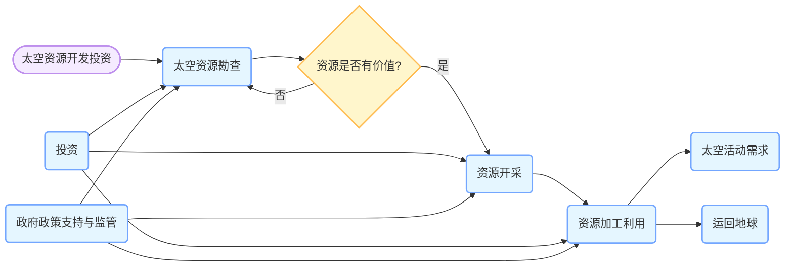

# 巴菲特 - 芒格的太空资源开发投资：星际经济的先行者

> 关键词：巴菲特；芒格；太空资源开发投资；星际经济；投资策略

> 摘要：本文聚焦于巴菲特和芒格在太空资源开发领域的投资行为，将其视为星际经济的先行者进行深入探讨。首先介绍了研究的背景、目的、预期读者、文档结构和相关术语。接着阐述太空资源开发投资的核心概念、联系以及相关原理架构，用流程图展示其逻辑关系。详细讲解了涉及的核心算法原理并给出 Python 代码示例。引入数学模型和公式，通过具体例子说明其应用。结合实际开发环境搭建，给出项目实战的代码案例并进行详细解读。分析了太空资源开发投资的实际应用场景，推荐了学习资源、开发工具框架和相关论文著作。最后总结了该领域未来的发展趋势与挑战，解答常见问题，并提供扩展阅读和参考资料。

## 1. 背景介绍 
### 1.1 目的和范围
随着人类科技的不断进步，太空探索不再仅仅是科学研究的范畴，太空资源开发逐渐成为具有巨大经济潜力的新兴领域。巴菲特和芒格作为投资界的传奇人物，他们在太空资源开发领域的投资决策具有重要的参考价值。本文旨在深入剖析巴菲特 - 芒格的太空资源开发投资策略，研究其对星际经济发展的引领作用。研究范围涵盖太空资源开发的各个方面，包括小行星采矿、太空能源利用、太空旅游等，以及巴菲特 - 芒格在这些领域的投资布局和决策逻辑。

### 1.2 预期读者
本文的预期读者包括对投资领域感兴趣的专业人士，如投资经理、分析师等，他们可以从巴菲特 - 芒格的投资案例中获取新的投资思路和策略。同时，对于从事太空科技研究和开发的科研人员和企业管理者，了解投资界的动态有助于他们更好地规划项目和获取资金支持。此外，普通投资者和对太空经济有兴趣的大众也可以通过本文了解太空资源开发投资的相关知识和前景。

### 1.3 文档结构概述
本文将按照以下结构进行阐述：首先介绍背景信息，包括目的、预期读者、文档结构和术语表。接着深入探讨太空资源开发投资的核心概念和联系，展示其原理架构和流程图。然后详细讲解核心算法原理和具体操作步骤，给出 Python 代码示例。引入数学模型和公式，并通过具体例子进行说明。结合实际项目，介绍开发环境搭建、源代码实现和代码解读。分析太空资源开发投资的实际应用场景，推荐相关的学习资源、开发工具框架和论文著作。最后总结未来发展趋势与挑战，解答常见问题，并提供扩展阅读和参考资料。

### 1.4 术语表
#### 1.4.1 核心术语定义
- **太空资源开发**：指人类对地球大气层以外的宇宙空间中的各种资源进行勘查、开采、利用和管理的一系列活动，包括小行星上的矿产资源、太阳能等能源资源的开发利用。
- **星际经济**：是以太空资源开发和利用为基础，在星际空间中形成的经济活动和经济体系，涉及贸易、投资、生产等多个方面。
- **小行星采矿**：是太空资源开发的一种重要形式，指对小行星上蕴含的丰富矿产资源，如稀有金属、贵金属等进行开采和提取的过程。

#### 1.4.2 相关概念解释
- **太空旅游**：是指为游客提供前往太空进行旅行体验的服务，包括亚轨道飞行、轨道飞行等不同形式，是太空资源开发在旅游领域的应用。
- **太空能源利用**：主要是指对太空中丰富的太阳能等能源进行收集、转化和利用，为太空活动和地球提供能源支持。

#### 1.4.3 缩略词列表
- **NASA**：美国国家航空航天局（National Aeronautics and Space Administration）
- **ESA**：欧洲航天局（European Space Agency）

## 2. 核心概念与联系 
太空资源开发投资涉及多个核心概念，它们之间相互关联，共同构成了星际经济的基础。以下是核心概念的原理和架构示意图：

**原理和架构文本示意图**：
太空资源开发投资的核心是通过对太空资源的勘查、开采和利用来获取经济回报。首先，需要进行太空资源的勘查，确定资源的种类、分布和储量。这需要借助先进的航天技术和探测设备，如卫星、探测器等。一旦发现有价值的资源，就可以进行开采活动。开采过程需要研发和应用专门的采矿技术和设备，确保在太空环境下高效、安全地获取资源。开采得到的资源可以进行加工和利用，一部分用于太空活动的需求，如太空站的建设、航天器的燃料等；另一部分可以运回地球，满足地球上对稀有资源的需求。

投资在整个过程中起着关键作用。投资者需要评估太空资源开发项目的可行性和潜在回报，选择合适的项目进行投资。投资可以用于支持资源勘查、技术研发、设备制造等各个环节。同时，政府的政策支持和监管也对太空资源开发投资至关重要，政策可以提供税收优惠、补贴等激励措施，监管可以确保开发活动的合法性和安全性。

**Mermaid 流程图**：


这个流程图展示了太空资源开发投资的主要流程。从投资开始，首先进行太空资源勘查，判断资源是否有价值。如果有价值，则进行开采和加工利用，资源可用于太空活动或运回地球。投资和政府的政策支持与监管贯穿整个过程，确保项目的顺利进行。

## 3. 核心算法原理 & 具体操作步骤 
在太空资源开发投资中，有一个重要的算法是资源价值评估算法，用于评估太空资源的潜在经济价值。以下是该算法的原理和具体操作步骤，并用 Python 代码进行详细阐述。

### 算法原理
资源价值评估算法主要考虑以下几个因素：资源的种类、储量、市场价格以及开采和运输成本。其基本原理是通过计算资源的预期收益减去开采和运输成本，得到资源的净现值。净现值越高，说明该资源的投资价值越大。

### 具体操作步骤
1. **确定资源种类和储量**：通过太空勘查数据，确定目标资源的种类和储量。
2. **获取市场价格**：查询当前地球上该资源的市场价格。
3. **估算开采和运输成本**：根据太空开采和运输的技术和成本模型，估算开采和运输该资源的成本。
4. **计算预期收益**：预期收益等于资源储量乘以市场价格。
5. **计算净现值**：净现值等于预期收益减去开采和运输成本。

### Python 代码实现
```python
def resource_value_evaluation(resource_type, reserve, market_price, mining_cost, transportation_cost):
    """
    资源价值评估函数
    :param resource_type: 资源种类
    :param reserve: 资源储量
    :param market_price: 市场价格
    :param mining_cost: 开采成本
    :param transportation_cost: 运输成本
    :return: 资源的净现值
    """
    # 计算预期收益
    expected_revenue = reserve * market_price
    # 计算总成本
    total_cost = mining_cost + transportation_cost
    # 计算净现值
    net_present_value = expected_revenue - total_cost
    return net_present_value

# 示例数据
resource_type = "稀有金属"
reserve = 1000  # 储量为 1000 吨
market_price = 10000  # 市场价格为每吨 10000 元
mining_cost = 2000000  # 开采成本为 200 万元
transportation_cost = 1000000  # 运输成本为 100 万元

# 调用函数进行评估
npv = resource_value_evaluation(resource_type, reserve, market_price, mining_cost, transportation_cost)
print(f"{resource_type} 的净现值为: {npv} 元")
```

### 代码解释
这段 Python 代码定义了一个名为 `resource_value_evaluation` 的函数，用于评估太空资源的价值。函数接受资源种类、储量、市场价格、开采成本和运输成本作为输入参数，通过计算预期收益和总成本，得到资源的净现值。最后，使用示例数据调用该函数并输出评估结果。

## 4. 数学模型和公式 & 详细讲解 & 举例说明 
### 数学模型和公式
在太空资源开发投资的资源价值评估中，我们可以用以下数学模型和公式来表示：

设 $R$ 为资源的预期收益，$S$ 为资源储量，$P$ 为市场价格，则预期收益的计算公式为：
$$R = S \times P$$

设 $C_m$ 为开采成本，$C_t$ 为运输成本，$C$ 为总成本，则总成本的计算公式为：
$$C = C_m + C_t$$

设 $NPV$ 为资源的净现值，则净现值的计算公式为：
$$NPV = R - C = S \times P - (C_m + C_t)$$

### 详细讲解
- **预期收益 ($R$)**：预期收益是指如果将所有储量的资源在市场上出售所能获得的收入。它取决于资源的储量和市场价格，储量越大、市场价格越高，预期收益就越高。
- **总成本 ($C$)**：总成本包括开采成本和运输成本。开采成本涉及到太空采矿设备的研发、制造、运行和维护等费用；运输成本则包括将开采得到的资源从太空运回地球的费用，如航天器的燃料、发射和返回成本等。
- **净现值 ($NPV$)**：净现值是评估资源投资价值的重要指标。如果净现值大于零，说明该资源的投资在经济上是可行的，预期收益大于总成本；如果净现值小于零，则说明该资源的投资可能不划算。

### 举例说明
假设我们要评估一颗小行星上的稀有金属资源。通过太空勘查，确定该稀有金属的储量 $S = 500$ 吨，当前地球上该稀有金属的市场价格 $P = 8000$ 元/吨。经过估算，开采该资源的成本 $C_m = 1500000$ 元，运输成本 $C_t = 800000$ 元。

首先，计算预期收益：
$$R = S \times P = 500 \times 8000 = 4000000$$（元）

然后，计算总成本：
$$C = C_m + C_t = 1500000 + 800000 = 2300000$$（元）

最后，计算净现值：
$$NPV = R - C = 4000000 - 2300000 = 1700000$$（元）

由于净现值 $NPV = 1700000$ 元大于零，说明对该小行星上的稀有金属资源进行投资开发在经济上是可行的。

## 5. 项目实战：代码实际案例和详细解释说明 
### 5.1  开发环境搭建
为了实现太空资源开发投资的相关代码，我们可以使用 Python 语言进行开发。以下是搭建开发环境的具体步骤：

1. **安装 Python**：访问 Python 官方网站（https://www.python.org/downloads/），根据自己的操作系统选择合适的 Python 版本进行下载和安装。建议安装 Python 3.7 及以上版本。
2. **安装开发工具**：可以选择使用集成开发环境（IDE），如 PyCharm、Visual Studio Code 等。这里以 Visual Studio Code 为例，访问 Visual Studio Code 官方网站（https://code.visualstudio.com/）进行下载和安装。安装完成后，在 Visual Studio Code 中安装 Python 扩展，以便更好地支持 Python 开发。
3. **创建虚拟环境（可选）**：为了避免不同项目之间的依赖冲突，建议创建虚拟环境。在命令行中执行以下命令创建和激活虚拟环境：
```bash
# 创建虚拟环境
python -m venv myenv
# 激活虚拟环境（Windows）
myenv\Scripts\activate
# 激活虚拟环境（Linux/Mac）
source myenv/bin/activate
```

### 5.2  源代码详细实现和代码解读
我们将实现一个更复杂的太空资源开发投资模拟程序，该程序可以模拟多个资源项目的评估和投资决策。以下是源代码：
```python
class ResourceProject:
    def __init__(self, resource_type, reserve, market_price, mining_cost, transportation_cost):
        """
        初始化资源项目
        :param resource_type: 资源种类
        :param reserve: 资源储量
        :param market_price: 市场价格
        :param mining_cost: 开采成本
        :param transportation_cost: 运输成本
        """
        self.resource_type = resource_type
        self.reserve = reserve
        self.market_price = market_price
        self.mining_cost = mining_cost
        self.transportation_cost = transportation_cost

    def calculate_net_present_value(self):
        """
        计算资源项目的净现值
        :return: 净现值
        """
        expected_revenue = self.reserve * self.market_price
        total_cost = self.mining_cost + self.transportation_cost
        net_present_value = expected_revenue - total_cost
        return net_present_value

    def is_investable(self):
        """
        判断该资源项目是否值得投资
        :return: True 或 False
        """
        npv = self.calculate_net_present_value()
        return npv > 0

# 创建资源项目列表
projects = [
    ResourceProject("稀有金属", 1000, 10000, 2000000, 1000000),
    ResourceProject("贵金属", 500, 15000, 1200000, 800000),
    ResourceProject("普通金属", 2000, 3000, 1800000, 1200000)
]

# 进行投资决策
investable_projects = []
for project in projects:
    if project.is_investable():
        investable_projects.append(project)
        print(f"{project.resource_type} 项目值得投资，净现值为: {project.calculate_net_present_value()} 元")
    else:
        print(f"{project.resource_type} 项目不值得投资，净现值为: {project.calculate_net_present_value()} 元")

# 输出可投资项目列表
print("可投资项目列表:")
for project in investable_projects:
    print(f"{project.resource_type}: 储量 {project.reserve} 吨，市场价格 {project.market_price} 元/吨")
```

### 5.3  代码解读与分析
- **`ResourceProject` 类**：该类用于表示一个资源项目，包含资源种类、储量、市场价格、开采成本和运输成本等属性。`__init__` 方法用于初始化这些属性。`calculate_net_present_value` 方法用于计算该项目的净现值，`is_investable` 方法用于判断该项目是否值得投资，即净现值是否大于零。
- **资源项目列表**：创建了一个包含三个资源项目的列表，每个项目具有不同的资源种类、储量、市场价格、开采成本和运输成本。
- **投资决策**：遍历资源项目列表，调用 `is_investable` 方法判断每个项目是否值得投资，并将可投资项目添加到 `investable_projects` 列表中。最后输出每个项目的投资决策结果和可投资项目列表。

通过这个模拟程序，我们可以对多个太空资源开发项目进行评估和投资决策，帮助投资者更好地选择有价值的项目进行投资。

## 6. 实际应用场景 
太空资源开发投资在多个实际应用场景中具有重要意义，以下是一些主要的应用场景：

### 小行星采矿
小行星蕴含着丰富的矿产资源，如稀有金属、贵金属等。对小行星进行采矿可以满足地球上对这些资源日益增长的需求，同时减少对地球有限资源的依赖。例如，某些小行星上富含铂族金属，这些金属在电子、化工、航空航天等领域具有重要的应用价值。通过太空资源开发投资，可以支持小行星采矿技术的研发和项目的实施，将开采得到的资源运回地球进行利用。

### 太空能源利用
太空中拥有丰富的太阳能等能源资源。太空能源利用可以为太空活动提供持续的能源支持，如为太空站、航天器等提供电力。同时，也可以将太空中收集的能源转化为电能传输回地球，为地球提供清洁能源。例如，在太空中建设太阳能电站，利用太阳能电池板收集太阳能，然后通过无线能量传输技术将电能传输到地球。太空资源开发投资可以推动太空能源利用技术的发展和商业化应用。

### 太空旅游
太空旅游是近年来兴起的一个新兴领域，吸引了越来越多的游客。太空旅游可以为游客提供独特的太空体验，如亚轨道飞行、轨道飞行等。通过太空资源开发投资，可以支持太空旅游公司的发展，建设太空旅游设施，如太空酒店、太空飞船等，推动太空旅游产业的繁荣。

### 太空基础设施建设
太空基础设施建设是太空资源开发的基础，包括太空站、卫星通信网络、太空运输系统等。太空资源开发投资可以用于支持这些基础设施的建设和维护，提高太空活动的效率和安全性。例如，建设更多的太空站可以为宇航员提供更好的生活和工作环境，也可以作为太空科学研究和资源开发的基地。

## 7. 工具和资源推荐
### 7.1 学习资源推荐
#### 7.1.1 书籍推荐
- 《太空资源：行星采矿、空间探索与人类的未来》：这本书全面介绍了太空资源开发的各个方面，包括小行星采矿、太空能源利用等，对太空资源开发的技术、经济和法律问题进行了深入探讨。
- 《星际经济：太空商业的未来》：探讨了星际经济的概念、发展趋势和商业模式，分析了太空资源开发在星际经济中的重要作用。
- 《投资学》：虽然不是专门针对太空资源开发投资的书籍，但它提供了投资的基本理论和方法，对于理解太空资源开发投资的决策过程具有重要的参考价值。

#### 7.1.2 在线课程
- Coursera 上的“太空探索与开发”课程：该课程由知名高校的教授授课，介绍了太空探索的历史、现状和未来发展趋势，以及太空资源开发的相关技术和经济问题。
- edX 上的“投资原理与实践”课程：提供了投资的基本原理和方法，包括投资组合理论、风险管理等，有助于学习者掌握投资分析的技巧。

#### 7.1.3 技术博客和网站
- NASA 官方网站（https://www.nasa.gov/）：提供了大量关于太空探索和太空资源开发的最新信息和研究成果。
- 太空新闻网（https://spacenews.com/）：专注于太空行业的新闻和分析，涵盖了太空资源开发、太空旅游等多个领域。
- 投资界网站（https://www.investopedia.com/）：提供投资领域的知识和资讯，包括投资策略、市场分析等内容。

### 7.2 开发工具框架推荐
#### 7.2.1 IDE和编辑器
- PyCharm：是一款专业的 Python 集成开发环境，具有代码编辑、调试、自动完成等功能，适合开发太空资源开发投资相关的 Python 代码。
- Visual Studio Code：是一款轻量级的代码编辑器，支持多种编程语言，通过安装 Python 扩展可以很好地支持 Python 开发。

#### 7.2.2 调试和性能分析工具
- PDB：是 Python 自带的调试器，可以帮助开发者在代码中设置断点、单步执行等，方便调试代码。
- cProfile：是 Python 的性能分析工具，可以分析代码的运行时间和函数调用情况，帮助开发者优化代码性能。

#### 7.2.3 相关框架和库
- NumPy：是 Python 的一个科学计算库，提供了高效的数组操作和数学函数，可用于处理太空资源开发投资中的数据计算。
- Pandas：是 Python 的一个数据处理库，提供了数据结构和数据分析工具，可用于处理和分析太空资源开发投资的相关数据。

### 7.3 相关论文著作推荐
#### 7.3.1 经典论文
- "The Economic Potential of Asteroid Mining"：该论文分析了小行星采矿的经济潜力，探讨了小行星采矿的技术、市场和投资等问题。
- "Space Resources and the Future of Human Civilization"：讨论了太空资源开发对人类文明未来发展的重要意义，以及面临的挑战和机遇。

#### 7.3.2 最新研究成果
- 定期关注《Acta Astronautica》《Journal of Spacecraft and Rockets》等学术期刊，这些期刊发表了太空资源开发领域的最新研究成果。

#### 7.3.3 应用案例分析
- 可以关注一些太空资源开发公司的案例分析报告，如 Planetary Resources、Deep Space Industries 等公司的项目案例，了解它们在太空资源开发投资方面的实践经验和教训。

## 8. 总结：未来发展趋势与挑战
### 未来发展趋势
- **技术创新推动**：随着航天技术、材料科学、人工智能等领域的不断发展，太空资源开发的技术将不断创新和进步。例如，更先进的太空采矿技术将提高资源开采的效率和安全性，无线能量传输技术将使太空能源利用更加便捷。
- **商业投资增加**：太空资源开发的巨大经济潜力将吸引越来越多的商业投资。除了传统的投资机构，一些科技巨头也可能涉足该领域，推动太空资源开发项目的商业化进程。
- **国际合作加强**：太空资源开发是一个全球性的挑战，需要各国之间加强合作。未来，国际间的合作将更加紧密，共同开展太空资源勘查、开采和利用等项目，实现资源共享和互利共赢。
- **星际经济体系逐步形成**：随着太空资源开发的不断深入，星际经济体系将逐步形成。太空贸易、太空金融等领域将得到发展，为人类经济的发展开辟新的空间。

### 挑战
- **技术难题**：太空资源开发面临着许多技术难题，如太空采矿技术、太空运输技术、太空能源利用技术等。这些技术的研发和应用需要大量的资金和时间投入。
- **法律和政策问题**：目前，国际上关于太空资源开发的法律和政策还不完善。例如，太空资源的所有权、开采权等问题还存在争议。需要建立健全相关的法律和政策体系，保障太空资源开发的合法性和规范性。
- **环境影响**：太空资源开发可能会对太空环境造成一定的影响，如太空垃圾的产生、对天体的破坏等。需要采取有效的措施来减少太空资源开发对环境的影响，保护太空环境的可持续性。
- **投资风险**：太空资源开发是一个高风险的领域，投资项目的成功率较低。投资者需要充分评估投资风险，制定合理的投资策略。

## 9. 附录：常见问题与解答
### 问题 1：太空资源开发投资的回报率如何？
解答：太空资源开发投资的回报率目前还难以准确估计，因为该领域仍处于发展初期，存在许多不确定性。回报率受到多种因素的影响，如资源的种类、储量、市场价格、开采和运输成本等。如果能够成功开发出有价值的太空资源，并将其商业化利用，回报率可能会非常高。但同时，投资风险也很大，需要投资者具备较强的风险承受能力和专业的投资分析能力。

### 问题 2：普通人如何参与太空资源开发投资？
解答：普通人可以通过以下几种方式参与太空资源开发投资：
- **投资相关企业的股票**：关注一些涉足太空资源开发领域的企业，购买它们的股票。但需要注意股票投资的风险。
- **参与投资基金**：一些投资基金可能会将部分资金投向太空资源开发项目，普通人可以通过购买这些基金份额间接参与投资。
- **关注众筹项目**：有些太空资源开发项目可能会通过众筹的方式筹集资金，普通人可以根据自己的情况参与众筹。

### 问题 3：太空资源开发会对地球环境产生影响吗？
解答：太空资源开发可能会对地球环境产生一定的影响。一方面，如果太空资源开发项目能够成功提供清洁能源，如太空太阳能，将有助于减少地球上对传统化石能源的依赖，从而对地球环境产生积极影响。另一方面，太空资源开发过程中可能会产生一些废弃物和污染物，如果处理不当，可能会对地球环境造成一定的危害。因此，需要在太空资源开发过程中采取有效的环境管理措施，减少对地球环境的负面影响。

## 10. 扩展阅读 & 参考资料
### 扩展阅读
- 《太空探索简史》：了解人类太空探索的历史和发展过程，有助于更好地理解太空资源开发的背景和意义。
- 《未来宇宙：人类太空探索的新征程》：探讨了未来人类在太空探索和开发方面的前景和挑战。

### 参考资料
- 相关学术期刊和会议论文，如《Advances in Space Research》《International Astronautical Congress Proceedings》等。
- 政府和国际组织发布的报告，如 NASA 的年度报告、联合国和平利用外层空间委员会的相关报告等。
- 太空资源开发公司的官方网站和公开资料，如 Blue Origin、SpaceX 等公司的网站。

作者：AI天才研究院/AI Genius Institute & 禅与计算机程序设计艺术 /Zen And The Art of Computer Programming