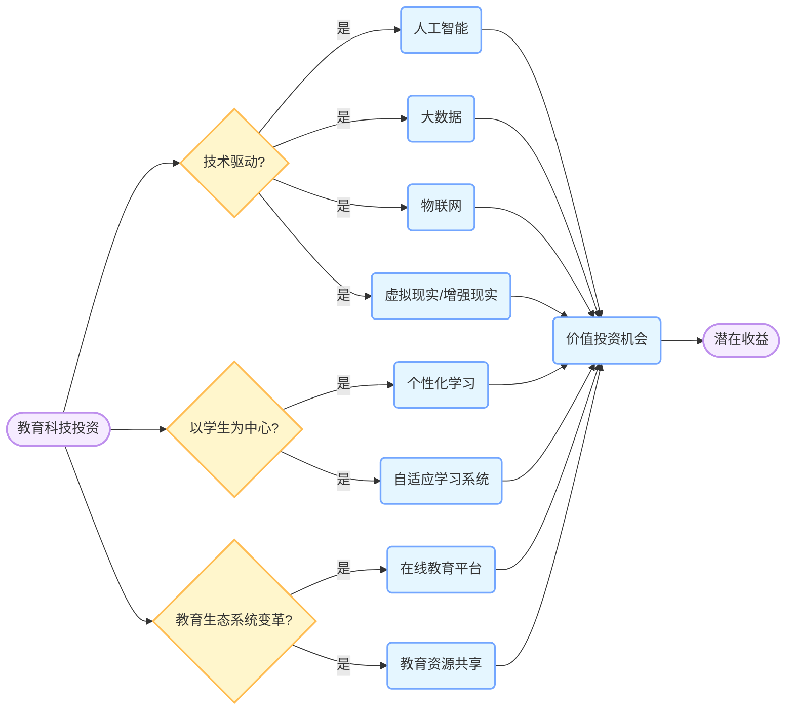

# 巴菲特 - 芒格的教育科技投资观：未来的机遇

> 关键词：巴菲特、芒格、教育科技投资、未来机遇、价值投资

> 摘要：本文深入探讨了巴菲特和芒格的投资理念在教育科技领域的应用，分析了教育科技行业的背景、核心概念、算法原理、数学模型等。通过项目实战案例，阐述了教育科技投资的具体操作和代码实现。同时，介绍了教育科技的实际应用场景，推荐了相关的工具和资源。最后总结了教育科技投资的未来发展趋势与挑战，并提供了常见问题解答和扩展阅读资料，旨在为投资者和从业者提供全面的参考，挖掘教育科技投资的未来机遇。

## 1. 背景介绍 
### 1.1 目的和范围
本文的目的是将巴菲特和芒格的价值投资理念引入教育科技投资领域，深入剖析该领域的投资机遇。我们将探讨教育科技行业的发展现状、核心技术和商业模式，分析投资该领域的潜在收益和风险。范围涵盖教育科技的各个细分领域，包括在线教育平台、智能教育硬件、教育数据分析等。通过对这些领域的研究，为投资者提供有价值的决策参考。

### 1.2 预期读者
本文预期读者包括对投资领域感兴趣的个人投资者、专业投资机构的从业者、教育科技行业的创业者和管理者，以及关注教育科技发展趋势的研究人员。无论您是想了解教育科技投资的基础知识，还是寻求深入的行业分析和投资策略，本文都将为您提供有价值的信息。

### 1.3 文档结构概述
本文将按照以下结构展开：首先介绍核心概念和联系，明确教育科技的定义和相关技术架构；接着阐述核心算法原理和具体操作步骤，结合Python代码进行详细说明；然后介绍数学模型和公式，通过举例加深理解；之后进行项目实战，包括开发环境搭建、源代码实现和代码解读；再分析实际应用场景；推荐相关的工具和资源；最后总结未来发展趋势与挑战，提供常见问题解答和扩展阅读资料。

### 1.4 术语表
#### 1.4.1 核心术语定义
- **教育科技（EdTech）**：指利用科技手段来改善教育过程和提高教育质量的领域，包括硬件、软件和服务等多个方面。
- **价值投资**：由巴菲特和芒格倡导的投资理念，强调寻找被低估的优质资产，长期持有以获取价值增长。
- **在线教育平台**：通过互联网提供教育课程和服务的平台，用户可以在任何时间、任何地点进行学习。
- **智能教育硬件**：集成了人工智能、传感器等技术的教育设备，如智能学习平板、智能笔等，能够提供个性化的学习体验。
- **教育数据分析**：对教育过程中产生的数据进行收集、整理和分析，以了解学生的学习情况和教师的教学效果，为教育决策提供支持。

#### 1.4.2 相关概念解释
- **个性化学习**：根据学生的学习能力、兴趣和需求，为其提供定制化的学习内容和学习路径，提高学习效率和效果。
- **自适应学习系统**：利用人工智能技术，根据学生的学习表现自动调整学习内容和难度，实现个性化学习。
- **区块链在教育中的应用**：利用区块链的去中心化、不可篡改等特性，实现学历认证、学习成果存储和共享等功能。

#### 1.4.3 缩略词列表
- **AI**：人工智能（Artificial Intelligence）
- **ML**：机器学习（Machine Learning）
- **NLP**：自然语言处理（Natural Language Processing）
- **VR**：虚拟现实（Virtual Reality）
- **AR**：增强现实（Augmented Reality）

## 2. 核心概念与联系 
### 2.1 教育科技的核心概念
教育科技是科技与教育的融合，旨在利用先进的技术手段解决教育领域的问题，提高教育的质量和效率。其核心概念包括以下几个方面：
- **技术驱动的创新**：教育科技依赖于各种新兴技术，如人工智能、大数据、物联网、虚拟现实等。这些技术为教育带来了新的可能性，如个性化学习、智能辅导、虚拟实验室等。
- **以学生为中心**：强调满足学生的个性化需求，提供定制化的学习体验。通过数据分析和人工智能算法，了解学生的学习进度、兴趣和能力，为其推荐合适的学习内容和学习方法。
- **教育生态系统的变革**：教育科技不仅仅是技术的应用，还涉及到教育生态系统的变革。它打破了传统教育的时空限制，促进了教育资源的共享和交流，推动了教育模式的创新。

### 2.2 教育科技与价值投资的联系
巴菲特和芒格的价值投资理念强调寻找具有长期竞争优势和稳定现金流的企业。教育科技行业具有以下特点，符合价值投资的理念：
- **稳定的需求**：教育是人类社会发展的基石，无论经济形势如何，人们对教育的需求始终存在。随着科技的发展，人们对优质教育资源的需求不断增加，为教育科技行业提供了广阔的市场空间。
- **技术创新带来的竞争优势**：在教育科技领域，技术创新是企业获得竞争优势的关键。拥有先进技术和创新能力的企业能够提供更好的产品和服务，吸引更多的用户，从而实现长期的增长。
- **现金流稳定**：教育科技企业通常具有稳定的现金流，尤其是一些提供订阅服务或付费课程的企业。这些企业的收入相对稳定，能够为投资者带来持续的回报。

### 2.3 核心概念原理和架构的文本示意图
```plaintext
教育科技核心概念架构

|-- 技术驱动
|   |-- 人工智能
|   |   |-- 机器学习
|   |   |-- 自然语言处理
|   |-- 大数据
|   |   |-- 数据收集
|   |   |-- 数据分析
|   |-- 物联网
|   |   |-- 智能设备连接
|   |-- 虚拟现实/增强现实
|       |-- 沉浸式学习体验
|-- 以学生为中心
|   |-- 个性化学习
|   |   |-- 学习路径规划
|   |   |-- 学习内容推荐
|   |-- 自适应学习系统
|       |-- 智能辅导
|-- 教育生态系统变革
|   |-- 在线教育平台
|   |   |-- 课程发布
|   |   |-- 学习社区
|   |-- 教育资源共享
|   |   |-- 开放课程
|   |   |-- 学习资料分享
```

### 2.4 Mermaid 流程图


## 3. 核心算法原理 & 具体操作步骤 
### 3.1 个性化学习推荐算法原理
个性化学习推荐算法的核心目标是根据学生的学习历史、兴趣和能力，为其推荐最适合的学习内容。常见的算法包括基于内容的推荐算法和协同过滤算法。

#### 3.1.1 基于内容的推荐算法
基于内容的推荐算法通过分析学习内容的特征和学生的兴趣偏好，为学生推荐相关的学习内容。其基本步骤如下：
1. **特征提取**：对学习内容进行特征提取，如课程主题、难度级别、知识点等。
2. **学生兴趣建模**：根据学生的学习历史和行为数据，建立学生的兴趣模型。
3. **相似度计算**：计算学习内容与学生兴趣模型之间的相似度。
4. **推荐生成**：根据相似度排序，为学生推荐最相关的学习内容。

以下是一个基于Python的简单示例代码：
```python
import pandas as pd
from sklearn.feature_extraction.text import TfidfVectorizer
from sklearn.metrics.pairwise import cosine_similarity

# 假设我们有一个课程数据集，包含课程标题和描述
courses = [
    {"id": 1, "title": "Python编程入门", "description": "学习Python编程的基础知识"},
    {"id": 2, "title": "数据分析实战", "description": "使用Python进行数据分析的实战课程"},
    {"id": 3, "title": "机器学习基础", "description": "介绍机器学习的基本概念和算法"},
    {"id": 4, "title": "人工智能导论", "description": "了解人工智能的发展和应用"}
]

# 学生的学习历史
student_history = ["Python编程入门", "数据分析实战"]

# 提取课程描述的特征
vectorizer = TfidfVectorizer()
course_descriptions = [course["description"] for course in courses]
course_features = vectorizer.fit_transform(course_descriptions)

# 计算学生学习历史的特征
student_features = vectorizer.transform(student_history)

# 计算相似度
similarities = cosine_similarity(student_features, course_features)

# 对相似度进行排序
recommended_indices = similarities.argsort()[0][::-1]

# 生成推荐列表
recommended_courses = []
for index in recommended_indices:
    if courses[index]["title"] not in student_history:
        recommended_courses.append(courses[index])

# 输出推荐结果
print("推荐课程：")
for course in recommended_courses:
    print(course["title"])
```

#### 3.1.2 协同过滤算法
协同过滤算法通过分析用户之间的行为相似度，为用户推荐其他用户喜欢的内容。其基本步骤如下：
1. **用户行为数据收集**：收集用户的学习历史、评分等行为数据。
2. **相似度计算**：计算用户之间的相似度，常用的相似度度量方法包括皮尔逊相关系数、余弦相似度等。
3. **邻居选择**：选择与目标用户相似度较高的邻居用户。
4. **推荐生成**：根据邻居用户的学习历史，为目标用户推荐未学习过的内容。

### 3.2 自适应学习系统算法原理
自适应学习系统根据学生的学习表现自动调整学习内容和难度，以实现个性化学习。常见的算法包括贝叶斯知识追踪算法和强化学习算法。

#### 3.2.1 贝叶斯知识追踪算法
贝叶斯知识追踪算法通过建立学生的知识状态模型，根据学生的答题结果更新知识状态的概率分布。其基本步骤如下：
1. **知识状态建模**：将学生的知识状态表示为一个概率分布，每个知识点对应一个掌握概率。
2. **答题结果观测**：记录学生的答题结果，包括答对和答错。
3. **知识状态更新**：根据答题结果，使用贝叶斯定理更新学生的知识状态概率分布。
4. **学习内容调整**：根据更新后的知识状态，为学生推荐合适的学习内容。

以下是一个简化的贝叶斯知识追踪算法的Python示例代码：
```python
import numpy as np

# 初始化学生的知识状态
knowledge_states = {
    "知识点1": 0.5,
    "知识点2": 0.5,
    "知识点3": 0.5
}

# 答题结果
answers = [
    {"question": "知识点1", "correct": True},
    {"question": "知识点2", "correct": False},
    {"question": "知识点3", "correct": True}
]

# 学习率和遗忘率
learning_rate = 0.2
forgetting_rate = 0.1

# 更新知识状态
for answer in answers:
    question = answer["question"]
    correct = answer["correct"]
    if correct:
        knowledge_states[question] = knowledge_states[question] + (1 - knowledge_states[question]) * learning_rate
    else:
        knowledge_states[question] = knowledge_states[question] * (1 - forgetting_rate)

# 输出更新后的知识状态
print("更新后的知识状态：")
for key, value in knowledge_states.items():
    print(f"{key}: {value}")
```

#### 3.2.2 强化学习算法
强化学习算法通过让智能体在环境中不断尝试和学习，以最大化累积奖励。在自适应学习系统中，智能体可以是学习内容的选择器，环境可以是学生的学习表现，奖励可以是学生的学习进步。

### 3.3 具体操作步骤
#### 3.3.1 数据收集
收集学生的学习历史数据，包括学习的课程、答题结果、学习时间等。同时，收集学习内容的相关信息，如课程标题、描述、难度级别等。

#### 3.3.2 数据预处理
对收集到的数据进行清洗、转换和归一化处理，以提高算法的性能。例如，将文本数据转换为数值特征，处理缺失值和异常值等。

#### 3.3.3 算法选择和训练
根据具体的应用场景和需求，选择合适的算法进行训练。在训练过程中，使用一部分数据作为训练集，另一部分数据作为测试集，评估算法的性能。

#### 3.3.4 模型部署和优化
将训练好的模型部署到实际应用中，并根据用户的反馈不断优化模型。例如，调整算法的参数，增加新的特征等。

## 4. 数学模型和公式 & 详细讲解 & 举例说明 
### 4.1 基于内容的推荐算法数学模型
#### 4.1.1 TF-IDF 模型
TF-IDF（Term Frequency - Inverse Document Frequency）是一种常用的文本特征提取方法，用于衡量一个词在文档中的重要性。其计算公式如下：
$$
TF - IDF(t, d, D) = TF(t, d) \times IDF(t, D)
$$
其中，$TF(t, d)$ 表示词 $t$ 在文档 $d$ 中的词频，即词 $t$ 在文档 $d$ 中出现的次数；$IDF(t, D)$ 表示词 $t$ 的逆文档频率，计算公式为：
$$
IDF(t, D) = \log\frac{|D|}{|d \in D: t \in d| + 1}
$$
其中，$|D|$ 表示文档集合 $D$ 中的文档总数，$|d \in D: t \in d|$ 表示包含词 $t$ 的文档数量。

#### 4.1.2 余弦相似度
余弦相似度用于计算两个向量之间的相似度，取值范围为 $[-1, 1]$，值越接近 1 表示两个向量越相似。其计算公式如下：
$$
\cos(\mathbf{A}, \mathbf{B}) = \frac{\mathbf{A} \cdot \mathbf{B}}{\|\mathbf{A}\| \|\mathbf{B}\|}
$$
其中，$\mathbf{A}$ 和 $\mathbf{B}$ 是两个向量，$\mathbf{A} \cdot \mathbf{B}$ 表示向量的点积，$\|\mathbf{A}\|$ 和 $\|\mathbf{B}\|$ 分别表示向量的模。

**举例说明**：假设我们有两个文档 $d_1$ 和 $d_2$，其 TF-IDF 特征向量分别为 $\mathbf{A} = [0.2, 0.3, 0.5]$ 和 $\mathbf{B} = [0.1, 0.4, 0.5]$，则它们的余弦相似度为：
$$
\cos(\mathbf{A}, \mathbf{B}) = \frac{0.2 \times 0.1 + 0.3 \times 0.4 + 0.5 \times 0.5}{\sqrt{0.2^2 + 0.3^2 + 0.5^2} \sqrt{0.1^2 + 0.4^2 + 0.5^2}} \approx 0.95
$$

### 4.2 贝叶斯知识追踪算法数学模型
#### 4.2.1 贝叶斯定理
贝叶斯定理用于根据新的证据更新先验概率，得到后验概率。其计算公式如下：
$$
P(H|E) = \frac{P(E|H)P(H)}{P(E)}
$$
其中，$P(H|E)$ 表示在证据 $E$ 出现的情况下，假设 $H$ 成立的概率；$P(E|H)$ 表示在假设 $H$ 成立的情况下，证据 $E$ 出现的概率；$P(H)$ 表示假设 $H$ 成立的先验概率；$P(E)$ 表示证据 $E$ 出现的概率。

#### 4.2.2 知识状态更新公式
在贝叶斯知识追踪算法中，假设学生对某个知识点的掌握状态为 $K$（掌握或未掌握），答题结果为 $R$（答对或答错），则根据贝叶斯定理，知识状态的更新公式如下：
- **答对时**：
$$
P(K = 1|R = 1) = \frac{P(R = 1|K = 1)P(K = 1)}{P(R = 1|K = 1)P(K = 1) + P(R = 1|K = 0)P(K = 0)}
$$
- **答错时**：
$$
P(K = 1|R = 0) = \frac{P(R = 0|K = 1)P(K = 1)}{P(R = 0|K = 1)P(K = 1) + P(R = 0|K = 0)P(K = 0)}
$$

**举例说明**：假设学生对某个知识点的初始掌握概率 $P(K = 1) = 0.5$，答对的概率 $P(R = 1|K = 1) = 0.8$，答错的概率 $P(R = 0|K = 1) = 0.2$，猜测答对的概率 $P(R = 1|K = 0) = 0.2$，猜测答错的概率 $P(R = 0|K = 0) = 0.8$。如果学生答对了一道题，则更新后的掌握概率为：
$$
P(K = 1|R = 1) = \frac{0.8 \times 0.5}{0.8 \times 0.5 + 0.2 \times 0.5} = 0.8
$$

## 5. 项目实战：代码实际案例和详细解释说明 
### 5.1  开发环境搭建
#### 5.1.1 安装 Python
首先，需要安装 Python 编程语言。可以从 Python 官方网站（https://www.python.org/downloads/）下载适合自己操作系统的 Python 版本，并按照安装向导进行安装。

#### 5.1.2 安装必要的库
在命令行中使用以下命令安装必要的 Python 库：
```sh
pip install pandas scikit-learn numpy
```
- `pandas`：用于数据处理和分析。
- `scikit-learn`：提供了各种机器学习算法和工具。
- `numpy`：用于科学计算。

### 5.2  源代码详细实现和代码解读
#### 5.2.1 基于内容的推荐系统实现
```python
import pandas as pd
from sklearn.feature_extraction.text import TfidfVectorizer
from sklearn.metrics.pairwise import cosine_similarity

# 课程数据集
courses = [
    {"id": 1, "title": "Python编程入门", "description": "学习Python编程的基础知识"},
    {"id": 2, "title": "数据分析实战", "description": "使用Python进行数据分析的实战课程"},
    {"id": 3, "title": "机器学习基础", "description": "介绍机器学习的基本概念和算法"},
    {"id": 4, "title": "人工智能导论", "description": "了解人工智能的发展和应用"}
]

# 学生的学习历史
student_history = ["Python编程入门", "数据分析实战"]

# 提取课程描述的特征
vectorizer = TfidfVectorizer()
course_descriptions = [course["description"] for course in courses]
course_features = vectorizer.fit_transform(course_descriptions)

# 计算学生学习历史的特征
student_features = vectorizer.transform(student_history)

# 计算相似度
similarities = cosine_similarity(student_features, course_features)

# 对相似度进行排序
recommended_indices = similarities.argsort()[0][::-1]

# 生成推荐列表
recommended_courses = []
for index in recommended_indices:
    if courses[index]["title"] not in student_history:
        recommended_courses.append(courses[index])

# 输出推荐结果
print("推荐课程：")
for course in recommended_courses:
    print(course["title"])
```
**代码解读**：
1. **数据准备**：定义了课程数据集和学生的学习历史。
2. **特征提取**：使用 `TfidfVectorizer` 对课程描述进行特征提取，将文本数据转换为数值特征。
3. **相似度计算**：使用 `cosine_similarity` 计算学生学习历史与课程之间的相似度。
4. **排序和推荐**：对相似度进行排序，选择未学习过的课程作为推荐结果。

#### 5.2.2 贝叶斯知识追踪系统实现
```python
import numpy as np

# 初始化学生的知识状态
knowledge_states = {
    "知识点1": 0.5,
    "知识点2": 0.5,
    "知识点3": 0.5
}

# 答题结果
answers = [
    {"question": "知识点1", "correct": True},
    {"question": "知识点2", "correct": False},
    {"question": "知识点3", "correct": True}
]

# 学习率和遗忘率
learning_rate = 0.2
forgetting_rate = 0.1

# 更新知识状态
for answer in answers:
    question = answer["question"]
    correct = answer["correct"]
    if correct:
        knowledge_states[question] = knowledge_states[question] + (1 - knowledge_states[question]) * learning_rate
    else:
        knowledge_states[question] = knowledge_states[question] * (1 - forgetting_rate)

# 输出更新后的知识状态
print("更新后的知识状态：")
for key, value in knowledge_states.items():
    print(f"{key}: {value}")
```
**代码解读**：
1. **初始化知识状态**：定义了学生对各个知识点的初始掌握概率。
2. **答题结果处理**：遍历答题结果，根据答对或答错情况更新知识状态。
3. **知识状态更新**：使用学习率和遗忘率更新知识状态的概率。

### 5.3  代码解读与分析
#### 5.3.1 基于内容的推荐系统分析
- **优点**：基于内容的推荐系统可以根据学习内容的特征进行推荐，不需要大量的用户行为数据。它可以为新用户提供个性化的推荐，并且解释性较强。
- **缺点**：该系统依赖于学习内容的特征提取，如果特征提取不准确，可能会影响推荐的质量。此外，它无法考虑用户之间的相似性，可能会导致推荐的多样性不足。

#### 5.3.2 贝叶斯知识追踪系统分析
- **优点**：贝叶斯知识追踪系统可以根据学生的答题结果动态更新知识状态，实现个性化学习。它考虑了学生的学习过程和不确定性，具有较强的适应性。
- **缺点**：该系统需要对学生的答题结果进行准确记录，并且需要合理设置学习率和遗忘率等参数。如果参数设置不合理，可能会导致知识状态更新不准确。

## 6. 实际应用场景 
### 6.1 在线教育平台
在线教育平台可以利用教育科技的技术和算法，为学生提供个性化的学习体验。例如，通过个性化学习推荐算法，根据学生的学习历史和兴趣，为其推荐合适的课程和学习内容；通过自适应学习系统，根据学生的学习表现自动调整学习难度和进度。

### 6.2 智能教育硬件
智能教育硬件如智能学习平板、智能笔等，可以集成教育科技的功能，为学生提供更加便捷和高效的学习方式。例如，智能学习平板可以通过语音识别和图像识别技术，实现智能辅导和互动学习；智能笔可以记录学生的书写轨迹和笔记，为学生提供个性化的学习反馈。

### 6.3 企业培训
企业可以利用教育科技的平台和工具，开展员工培训和发展计划。例如，通过在线培训平台，为员工提供定制化的培训课程和学习资源；通过学习分析系统，了解员工的学习情况和培训效果，为企业的人力资源管理提供决策支持。

### 6.4 职业教育
职业教育机构可以利用教育科技的技术和方法，提高职业教育的质量和效率。例如，通过虚拟现实和增强现实技术，为学生提供真实的职业场景模拟和实践机会；通过数据分析和人工智能算法，为学生提供个性化的职业规划和就业指导。

## 7. 工具和资源推荐
### 7.1 学习资源推荐
#### 7.1.1 书籍推荐
- 《人工智能：一种现代的方法》（Artificial Intelligence: A Modern Approach）：这是一本经典的人工智能教材，涵盖了人工智能的各个领域，包括机器学习、自然语言处理、知识表示等。
- 《Python机器学习》（Python Machine Learning）：本书介绍了如何使用Python进行机器学习，包括各种机器学习算法的原理和实现。
- 《教育技术学导论》：这本书系统地介绍了教育技术的基本概念、理论和方法，是学习教育科技的入门书籍。

#### 7.1.2 在线课程
- Coursera（https://www.coursera.org/）：提供了各种与教育科技相关的在线课程，如人工智能、机器学习、数据分析等。
- edX（https://www.edx.org/）：与全球顶尖高校合作，提供高质量的在线课程，包括计算机科学、教育学等领域。
- 中国大学MOOC（https://www.icourse163.org/）：国内知名的在线课程平台，提供了丰富的教育科技相关课程。

#### 7.1.3 技术博客和网站
- Medium（https://medium.com/）：有许多技术专家和学者在上面分享教育科技的最新研究成果和实践经验。
- Towards Data Science（https://towardsdatascience.com/）：专注于数据分析和机器学习领域，提供了大量的技术文章和教程。
- 教育技术网（https://www.etthink.com/）：国内专业的教育技术网站，提供了教育科技的行业动态、研究报告和案例分析等。

### 7.2 开发工具框架推荐
#### 7.2.1 IDE和编辑器
- PyCharm：一款专门为Python开发设计的集成开发环境，提供了丰富的功能和插件，方便开发和调试。
- Jupyter Notebook：一种交互式的开发环境，适合进行数据分析和机器学习实验。它支持多种编程语言，并且可以实时显示代码的运行结果。
- Visual Studio Code：一款轻量级的代码编辑器，支持多种编程语言和插件扩展。它具有强大的代码编辑和调试功能，是开发者的常用工具之一。

#### 7.2.2 调试和性能分析工具
- pdb：Python自带的调试工具，可以帮助开发者定位和解决代码中的问题。
- cProfile：Python的性能分析工具，可以分析代码的运行时间和内存使用情况，帮助开发者优化代码性能。
- TensorBoard：TensorFlow的可视化工具，可以帮助开发者监控模型的训练过程和性能指标。

#### 7.2.3 相关框架和库
- TensorFlow：一个开源的机器学习框架，提供了丰富的工具和接口，方便开发者构建和训练各种机器学习模型。
- PyTorch：另一个流行的机器学习框架，具有简洁易用的接口和高效的计算性能，广泛应用于深度学习领域。
- Scikit-learn：一个简单易用的机器学习库，提供了各种机器学习算法和工具，适合初学者和快速原型开发。

### 7.3 相关论文著作推荐
#### 7.3.1 经典论文
- "Learning Representations by Back-propagating Errors"：这篇论文介绍了反向传播算法，是神经网络发展的重要里程碑。
- "A Mathematical Theory of Communication"：香农的这篇论文奠定了信息论的基础，对教育科技中的数据传输和处理有重要影响。
- "The Promise of Educational Data Mining"：该论文探讨了教育数据挖掘的潜力和应用，为教育科技的研究提供了重要的思路。

#### 7.3.2 最新研究成果
- 关注顶级学术会议如ACM SIGKDD、NeurIPS、EDM等的论文，这些会议汇聚了教育科技领域的最新研究成果。
- 阅读相关学术期刊如《Journal of Educational Data Mining》《Artificial Intelligence in Education》等的文章，了解教育科技的前沿研究动态。

#### 7.3.3 应用案例分析
- 《教育科技应用案例集》：收集了国内外教育科技领域的优秀应用案例，通过实际案例分析，了解教育科技在不同场景下的应用和效果。
- 各大教育科技公司的官方博客和报告，如Coursera、Udemy等，会分享他们在教育科技领域的实践经验和成果。

## 8. 总结：未来发展趋势与挑战
### 8.1 未来发展趋势
#### 8.1.1 人工智能与教育的深度融合
人工智能技术将在教育领域得到更广泛的应用，如智能辅导、个性化学习、自动评分等。通过人工智能算法，可以实现对学生学习过程的精准分析和预测，为学生提供更加个性化的学习支持。

#### 8.1.2 虚拟现实和增强现实技术的应用
虚拟现实和增强现实技术将为教育带来更加沉浸式的学习体验。例如，在历史、地理等学科中，通过虚拟现实技术可以让学生身临其境地感受历史场景和地理环境；在医学、工程等学科中，通过增强现实技术可以提供更加真实的实践操作机会。

#### 8.1.3 区块链技术在教育中的应用
区块链技术可以实现学历认证、学习成果存储和共享等功能，提高教育的可信度和透明度。例如，学生的学习记录和证书可以存储在区块链上，不可篡改且易于验证，方便用人单位和教育机构进行查询和认可。

#### 8.1.4 教育大数据的应用
教育大数据将为教育决策提供更加科学的依据。通过对学生的学习数据、行为数据等进行分析，可以了解学生的学习需求和特点，优化教学内容和方法，提高教育质量。

### 8.2 挑战
#### 8.2.1 技术应用的难度
教育科技涉及到多种技术的融合，如人工智能、大数据、虚拟现实等。这些技术的应用需要具备专业的技术知识和技能，对于教育机构和教师来说，掌握和应用这些技术存在一定的难度。

#### 8.2.2 数据隐私和安全问题
教育科技的发展需要收集和处理大量的学生数据，如个人信息、学习记录等。这些数据的隐私和安全问题是一个重要的挑战。需要建立完善的数据保护机制，确保学生数据的安全和隐私。

#### 8.2.3 教育公平问题
教育科技的发展可能会加剧教育公平问题。一方面，技术的应用需要一定的设备和网络条件，对于一些贫困地区和弱势群体来说，可能无法享受到教育科技带来的红利；另一方面，个性化学习可能会导致学生之间的差距进一步扩大。

#### 8.2.4 教师角色的转变
教育科技的发展将对教师的角色产生重大影响。教师需要从传统的知识传授者转变为学习的引导者和促进者，需要具备更多的技术能力和教育创新能力。这对于教师的专业发展提出了更高的要求。

## 9. 附录：常见问题与解答
### 9.1 教育科技投资的风险有哪些？
教育科技投资的风险主要包括技术风险、市场风险、竞争风险等。技术风险是指技术更新换代快，投资的技术可能很快被淘汰；市场风险是指市场需求变化不确定，投资的产品或服务可能无法满足市场需求；竞争风险是指教育科技行业竞争激烈，投资的企业可能无法在竞争中脱颖而出。

### 9.2 如何评估教育科技企业的投资价值？
评估教育科技企业的投资价值可以从以下几个方面入手：一是企业的技术实力和创新能力，包括是否拥有先进的技术和专利；二是企业的市场份额和用户基础，了解企业在市场中的竞争力；三是企业的商业模式和盈利能力，评估企业的盈利模式是否可持续；四是企业的管理团队和发展战略，考察管理团队的能力和企业的发展规划。

### 9.3 教育科技投资的回报周期一般有多长？
教育科技投资的回报周期因项目而异。一般来说，早期投资的回报周期较长，可能需要3 - 5年甚至更长时间；而后期投资的回报周期相对较短，可能在1 - 3年左右。此外，回报周期还受到市场环境、企业发展情况等因素的影响。

### 9.4 教育科技与传统教育有哪些区别？
教育科技与传统教育的区别主要体现在以下几个方面：一是教学方式，教育科技可以实现个性化学习和在线教学，打破了传统教育的时空限制；二是教学资源，教育科技可以整合全球的优质教育资源，为学生提供更加丰富的学习内容；三是教学评价，教育科技可以通过数据分析和人工智能算法，实现对学生学习过程的全面评价，而传统教育主要依赖于考试成绩。

### 9.5 如何选择适合的教育科技投资项目？
选择适合的教育科技投资项目需要考虑以下几个因素：一是项目的市场前景，了解项目所针对的市场需求和规模；二是项目的技术创新性，评估项目的技术是否具有竞争力和发展潜力；三是项目的团队实力，考察项目团队的专业背景和经验；四是项目的商业模式，分析项目的盈利模式和可持续性。

## 10. 扩展阅读 & 参考资料
### 10.1 扩展阅读
- 《智能时代》：这本书探讨了人工智能对社会各个领域的影响，包括教育领域，为我们理解教育科技的发展趋势提供了宏观的视角。
- 《未来学校》：书中提出了未来学校的设想和构建方式，强调了教育科技在未来教育中的重要作用。
- 《数字化生存》：虽然出版时间较早，但书中对数字化时代的预言和思考，对于我们理解教育科技的发展仍然具有启示意义。

### 10.2 参考资料
- 相关行业报告，如艾瑞咨询、德勤等发布的教育科技行业研究报告，提供了行业的最新数据和发展趋势。
- 各大教育科技公司的官方网站和年报，了解企业的发展情况和业务模式。
- 学术数据库，如IEEE Xplore、ACM Digital Library等，查找教育科技领域的学术论文和研究成果。

作者：AI天才研究院/AI Genius Institute & 禅与计算机程序设计艺术 /Zen And The Art of Computer Programming