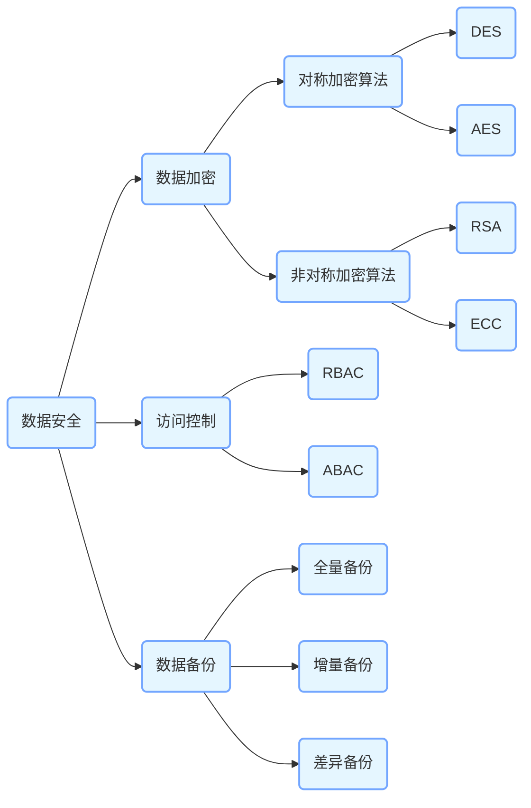

# 巴菲特 - 芒格的数据安全投资：数字时代的新机遇

> 关键词：巴菲特；芒格；数据安全投资；数字时代；新机遇

> 摘要：本文聚焦于巴菲特和芒格在数字时代对数据安全领域的投资视角与理念。首先介绍数据安全投资的背景，涵盖目的范围、预期读者等信息。接着阐述数据安全的核心概念及内在联系，剖析核心算法原理和操作步骤，借助数学模型和公式进行深入讲解。通过项目实战案例，详细说明开发环境搭建、源代码实现与解读。分析数据安全在实际场景中的应用，推荐相关学习资源、开发工具和论文著作。最后总结数据安全投资的未来发展趋势与挑战，解答常见问题，并提供扩展阅读和参考资料，为投资者和从业者在数字时代把握数据安全投资新机遇提供全面的指导。

## 1. 背景介绍 
### 1.1 目的和范围
在当今数字化浪潮席卷全球的背景下，数据已成为企业和社会发展的核心资产。然而，随着数据的大量产生和广泛应用，数据安全问题日益凸显，成为各界关注的焦点。巴菲特和芒格作为投资界的传奇人物，他们的投资理念和决策一直备受瞩目。本文旨在深入探讨巴菲特 - 芒格的数据安全投资策略，分析数字时代数据安全领域所蕴含的新机遇。

文章的范围将涵盖数据安全的基本概念、核心算法原理、数学模型、实际应用场景等方面。通过对这些内容的详细阐述，揭示数据安全投资的内在逻辑和潜在价值，为投资者、企业管理者以及相关领域的从业者提供有价值的参考。

### 1.2 预期读者
本文的预期读者主要包括以下几类人群：
1. **投资者**：无论是个人投资者还是机构投资者，都希望在数字时代找到具有潜力的投资领域。数据安全作为新兴且前景广阔的行业，吸引了众多投资者的目光。本文将帮助投资者了解数据安全投资的特点、风险和机遇，为他们的投资决策提供依据。
2. **企业管理者**：在数字化转型的过程中，企业面临着日益严峻的数据安全挑战。了解巴菲特 - 芒格的数据安全投资理念，有助于企业管理者制定合理的数据安全战略，保护企业的核心数据资产，提升企业的竞争力。
3. **技术从业者**：数据安全领域的技术发展日新月异，技术从业者需要不断学习和掌握新的知识和技能。本文对数据安全的核心算法原理和技术进行了详细讲解，为技术从业者提供了深入学习和研究的参考。
4. **学术研究人员**：数据安全是一个跨学科的研究领域，涉及计算机科学、数学、管理学等多个学科。本文的研究成果和分析方法可以为学术研究人员提供新的思路和方向，促进数据安全领域的学术研究发展。

### 1.3 文档结构概述
本文将按照以下结构进行组织：
1. **背景介绍**：阐述文章的目的和范围、预期读者、文档结构概述以及相关术语表。
2. **核心概念与联系**：介绍数据安全的核心概念，包括数据加密、访问控制、数据备份等，并分析它们之间的内在联系。通过文本示意图和 Mermaid 流程图，直观地展示数据安全的架构和工作原理。
3. **核心算法原理 & 具体操作步骤**：详细讲解数据安全领域的核心算法，如对称加密算法、非对称加密算法等，并使用 Python 源代码进行实现和解释。同时，给出具体的操作步骤，指导读者如何应用这些算法进行数据安全保护。
4. **数学模型和公式 & 详细讲解 & 举例说明**：引入数据安全领域的数学模型和公式，如信息熵、密码学中的数学原理等，并进行详细讲解。通过具体的例子，说明这些数学模型和公式在数据安全中的应用。
5. **项目实战：代码实际案例和详细解释说明**：通过一个实际的数据安全项目案例，介绍开发环境的搭建、源代码的详细实现和代码解读。分析代码的功能和实现思路，帮助读者理解如何将理论知识应用到实际项目中。
6. **实际应用场景**：探讨数据安全在不同行业和领域的实际应用场景，如金融、医疗、电子商务等。分析每个场景中数据安全的特点和需求，以及相应的解决方案。
7. **工具和资源推荐**：推荐数据安全领域的学习资源，包括书籍、在线课程、技术博客和网站等；介绍开发工具框架，如 IDE 和编辑器、调试和性能分析工具、相关框架和库等；推荐相关的论文著作，包括经典论文、最新研究成果和应用案例分析等。
8. **总结：未来发展趋势与挑战**：总结数据安全投资的现状和发展趋势，分析未来可能面临的挑战和机遇。提出应对挑战的建议和策略，为读者提供前瞻性的思考。
9. **附录：常见问题与解答**：解答读者在阅读过程中可能遇到的常见问题，如数据安全投资的风险如何评估、如何选择合适的数据安全技术等。
10. **扩展阅读 & 参考资料**：提供与数据安全投资相关的扩展阅读材料和参考资料，方便读者进一步深入学习和研究。

### 1.4 术语表
#### 1.4.1 核心术语定义
- **数据安全**：指保护数据免受未经授权的访问、使用、披露、破坏、更改或泄露的过程和措施。
- **数据加密**：将数据转换为密文的过程，只有拥有正确密钥的用户才能将密文还原为明文。
- **访问控制**：限制对数据资源的访问权限，确保只有授权用户能够访问特定的数据。
- **数据备份**：将数据复制到另一个存储介质上，以防止数据丢失或损坏。
- **信息熵**：用于衡量数据的不确定性和随机性的指标。

#### 1.4.2 相关概念解释
- **对称加密算法**：使用相同的密钥进行加密和解密的算法，如 DES、AES 等。
- **非对称加密算法**：使用一对密钥（公钥和私钥）进行加密和解密的算法，如 RSA、ECC 等。
- **哈希函数**：将任意长度的数据映射为固定长度的哈希值的函数，常用于数据完整性验证。
- **防火墙**：一种网络安全设备，用于监控和控制网络流量，防止未经授权的访问。

#### 1.4.3 缩略词列表
- **DES**：Data Encryption Standard，数据加密标准
- **AES**：Advanced Encryption Standard，高级加密标准
- **RSA**：Rivest - Shamir - Adleman，一种非对称加密算法
- **ECC**：Elliptic Curve Cryptography，椭圆曲线密码学
- **VPN**：Virtual Private Network，虚拟专用网络

## 2. 核心概念与联系 

### 核心概念原理
数据安全是一个综合性的概念，涉及多个方面的技术和措施。以下是数据安全的几个核心概念及其原理：

#### 数据加密
数据加密是数据安全的核心技术之一。其基本原理是将明文数据通过加密算法转换为密文，只有拥有正确密钥的用户才能将密文还原为明文。加密算法可以分为对称加密算法和非对称加密算法。

对称加密算法使用相同的密钥进行加密和解密，加密速度快，但密钥管理比较困难。常见的对称加密算法有 DES、AES 等。非对称加密算法使用一对密钥（公钥和私钥），公钥可以公开，用于加密数据，私钥只有用户自己拥有，用于解密数据。非对称加密算法的安全性较高，但加密和解密速度相对较慢。常见的非对称加密算法有 RSA、ECC 等。

#### 访问控制
访问控制是指限制对数据资源的访问权限，确保只有授权用户能够访问特定的数据。访问控制可以分为基于角色的访问控制（RBAC）、基于属性的访问控制（ABAC）等。

在 RBAC 中，用户被分配到不同的角色，每个角色具有不同的权限。系统根据用户的角色来决定其是否有权限访问特定的数据资源。在 ABAC 中，访问决策基于用户的属性、资源的属性和环境条件等多个因素。

#### 数据备份
数据备份是为了防止数据丢失或损坏而采取的措施。数据备份可以分为全量备份、增量备份和差异备份等。

全量备份是指备份所有的数据，备份时间较长，但恢复数据时比较方便。增量备份只备份自上次备份以来发生变化的数据，备份时间较短，但恢复数据时需要依次恢复所有的增量备份。差异备份备份自上次全量备份以来发生变化的数据，备份时间和恢复时间介于全量备份和增量备份之间。

### 架构的文本示意图
```plaintext
数据安全架构
|-- 数据加密
|   |-- 对称加密算法
|   |   |-- DES
|   |   |-- AES
|   |-- 非对称加密算法
|       |-- RSA
|       |-- ECC
|-- 访问控制
|   |-- 基于角色的访问控制（RBAC）
|   |-- 基于属性的访问控制（ABAC）
|-- 数据备份
|   |-- 全量备份
|   |-- 增量备份
|   |-- 差异备份
```

### Mermaid 流程图


从这个流程图可以清晰地看到数据安全的各个组成部分及其相互关系。数据安全主要由数据加密、访问控制和数据备份三个核心部分构成。数据加密又分为对称加密算法和非对称加密算法，每种算法都有具体的实现方式。访问控制包括基于角色和基于属性的两种控制方式。数据备份则有全量、增量和差异三种备份类型。

## 3. 核心算法原理 & 具体操作步骤 

### 对称加密算法 - AES
#### 算法原理
AES（Advanced Encryption Standard）是一种对称加密算法，它采用分组密码体制，将明文分成固定长度的块进行加密。AES 支持 128 位、192 位和 256 位的密钥长度。

AES 的加密过程主要包括以下几个步骤：
1. **密钥扩展**：将输入的密钥扩展为多个轮密钥，每个轮密钥用于一轮加密操作。
2. **初始轮**：将明文与第一个轮密钥进行异或操作。
3. **多轮加密**：进行多轮（10 轮、12 轮或 14 轮，取决于密钥长度）的加密操作，每轮包括字节替换、行移位、列混合和轮密钥加四个步骤。
4. **最终轮**：最后一轮不进行列混合操作。

#### Python 源代码实现
```python
from Crypto.Cipher import AES
from Crypto.Util.Padding import pad, unpad
import base64

# 加密函数
def aes_encrypt(plaintext, key):
    # 创建 AES 加密对象
    cipher = AES.new(key.encode('utf-8'), AES.MODE_ECB)
    # 对明文进行填充
    padded_plaintext = pad(plaintext.encode('utf-8'), AES.block_size)
    # 加密
    ciphertext = cipher.encrypt(padded_plaintext)
    # 将加密结果进行 base64 编码
    encrypted_text = base64.b64encode(ciphertext).decode('utf-8')
    return encrypted_text

# 解密函数
def aes_decrypt(encrypted_text, key):
    # 对 base64 编码的密文进行解码
    ciphertext = base64.b64decode(encrypted_text)
    # 创建 AES 解密对象
    cipher = AES.new(key.encode('utf-8'), AES.MODE_ECB)
    # 解密
    decrypted_text = cipher.decrypt(ciphertext)
    # 去除填充
    unpadded_decrypted_text = unpad(decrypted_text, AES.block_size)
    return unpadded_decrypted_text.decode('utf-8')

# 测试
plaintext = "Hello, World!"
key = "0123456789abcdef"  # 16 字节密钥
encrypted_text = aes_encrypt(plaintext, key)
decrypted_text = aes_decrypt(encrypted_text, key)

print(f"明文: {plaintext}")
print(f"加密后: {encrypted_text}")
print(f"解密后: {decrypted_text}")
```

### 非对称加密算法 - RSA
#### 算法原理
RSA 是一种非对称加密算法，它基于大整数分解的困难性。RSA 的密钥对包括公钥和私钥，公钥用于加密数据，私钥用于解密数据。

RSA 的密钥生成过程如下：
1. 选择两个大素数 $p$ 和 $q$。
2. 计算 $n = p \times q$ 和 $\varphi(n) = (p - 1) \times (q - 1)$。
3. 选择一个整数 $e$，使得 $1 < e < \varphi(n)$ 且 $\gcd(e, \varphi(n)) = 1$。
4. 计算 $d$，使得 $d \times e \equiv 1 \pmod{\varphi(n)}$。

公钥为 $(n, e)$，私钥为 $(n, d)$。

加密过程：$c = m^e \pmod{n}$，其中 $m$ 是明文，$c$ 是密文。

解密过程：$m = c^d \pmod{n}$。

#### Python 源代码实现
```python
from Crypto.PublicKey import RSA
from Crypto.Cipher import PKCS1_OAEP
import base64

# 生成 RSA 密钥对
key = RSA.generate(2048)
private_key = key.export_key()
public_key = key.publickey().export_key()

# 加密函数
def rsa_encrypt(plaintext, public_key):
    recipient_key = RSA.import_key(public_key)
    cipher = PKCS1_OAEP.new(recipient_key)
    ciphertext = cipher.encrypt(plaintext.encode('utf-8'))
    encrypted_text = base64.b64encode(ciphertext).decode('utf-8')
    return encrypted_text

# 解密函数
def rsa_decrypt(encrypted_text, private_key):
    key = RSA.import_key(private_key)
    cipher = PKCS1_OAEP.new(key)
    ciphertext = base64.b64decode(encrypted_text)
    decrypted_text = cipher.decrypt(ciphertext)
    return decrypted_text.decode('utf-8')

# 测试
plaintext = "Hello, RSA!"
encrypted_text = rsa_encrypt(plaintext, public_key)
decrypted_text = rsa_decrypt(encrypted_text, private_key)

print(f"明文: {plaintext}")
print(f"加密后: {encrypted_text}")
print(f"解密后: {decrypted_text}")
```

### 具体操作步骤
#### 对称加密（AES）操作步骤
1. **选择密钥**：选择一个合适长度的密钥（16 字节、24 字节或 32 字节）。
2. **填充明文**：将明文填充到 AES 块大小的整数倍。
3. **创建加密对象**：使用密钥和加密模式（如 ECB）创建 AES 加密对象。
4. **加密**：对填充后的明文进行加密。
5. **编码**：将加密结果进行 base64 编码，方便传输和存储。
6. **解密时**：先对 base64 编码的密文进行解码，再创建解密对象，进行解密，最后去除填充。

#### 非对称加密（RSA）操作步骤
1. **生成密钥对**：使用 RSA 算法生成公钥和私钥。
2. **加密**：使用公钥创建加密对象，对明文进行加密，并将加密结果进行 base64 编码。
3. **解密**：使用私钥创建解密对象，对 base64 解码后的密文进行解密。

## 4. 数学模型和公式 & 详细讲解 & 举例说明 

### 信息熵
#### 数学公式
信息熵是用于衡量数据的不确定性和随机性的指标。对于一个离散随机变量 $X$，其取值为 $x_1, x_2, \cdots, x_n$，对应的概率为 $p(x_1), p(x_2), \cdots, p(x_n)$，则信息熵 $H(X)$ 的计算公式为：
$$H(X) = -\sum_{i = 1}^{n} p(x_i) \log_2 p(x_i)$$

#### 详细讲解
信息熵的值越大，表示数据的不确定性越大，随机性越强。当所有的概率 $p(x_i)$ 相等时，信息熵达到最大值。例如，对于一个公平的硬币，正面和反面出现的概率都是 0.5，则其信息熵为：
$$H(X) = - (0.5 \log_2 0.5 + 0.5 \log_2 0.5) = 1$$

#### 举例说明
假设有一个随机变量 $X$，其取值为 $\{A, B, C\}$，对应的概率分别为 $p(A) = 0.2$，$p(B) = 0.3$，$p(C) = 0.5$。则其信息熵为：
$$H(X) = - (0.2 \log_2 0.2 + 0.3 \log_2 0.3 + 0.5 \log_2 0.5) \approx 1.485$$

### 密码学中的数学原理 - RSA
#### 数学公式
RSA 算法基于大整数分解的困难性，其核心数学公式如下：

**密钥生成**：
1. 选择两个大素数 $p$ 和 $q$。
2. 计算 $n = p \times q$ 和 $\varphi(n) = (p - 1) \times (q - 1)$。
3. 选择一个整数 $e$，使得 $1 < e < \varphi(n)$ 且 $\gcd(e, \varphi(n)) = 1$。
4. 计算 $d$，使得 $d \times e \equiv 1 \pmod{\varphi(n)}$。

**加密**：$c = m^e \pmod{n}$，其中 $m$ 是明文，$c$ 是密文。

**解密**：$m = c^d \pmod{n}$。

#### 详细讲解
在 RSA 算法中，$n$ 是公钥和私钥的一部分，$e$ 是公钥指数，$d$ 是私钥指数。加密过程是将明文 $m$ 进行 $e$ 次幂运算，然后对 $n$ 取模得到密文 $c$。解密过程是将密文 $c$ 进行 $d$ 次幂运算，然后对 $n$ 取模得到明文 $m$。

#### 举例说明
假设 $p = 3$，$q = 11$，则：
1. 计算 $n = p \times q = 3 \times 11 = 33$。
2. 计算 $\varphi(n) = (p - 1) \times (q - 1) = 2 \times 10 = 20$。
3. 选择 $e = 3$，因为 $\gcd(3, 20) = 1$。
4. 计算 $d$，使得 $d \times 3 \equiv 1 \pmod{20}$，通过扩展欧几里得算法可得 $d = 7$。

公钥为 $(n = 33, e = 3)$，私钥为 $(n = 33, d = 7)$。

假设明文 $m = 5$，则加密过程为：
$$c = m^e \pmod{n} = 5^3 \pmod{33} = 125 \pmod{33} = 26$$

解密过程为：
$$m = c^d \pmod{n} = 26^7 \pmod{33} = 8031810176 \pmod{33} = 5$$

## 5. 项目实战：代码实际案例和详细解释说明 

### 5.1  开发环境搭建
#### 操作系统
可以选择 Windows、Linux 或 macOS 操作系统。这里以 Ubuntu 18.04 为例进行说明。

#### Python 安装
在 Ubuntu 上安装 Python 3 可以使用以下命令：
```bash
sudo apt update
sudo apt install python3 python3-pip
```

#### 依赖库安装
使用 `pip` 安装所需的依赖库，包括 `pycryptodome`：
```bash
pip3 install pycryptodome
```

### 5.2  源代码详细实现和代码解读
#### 项目需求
实现一个简单的数据安全管理系统，包括数据加密、解密和存储功能。

#### 源代码实现
```python
from Crypto.Cipher import AES
from Crypto.Util.Padding import pad, unpad
import base64
import os

# 加密函数
def aes_encrypt(plaintext, key):
    cipher = AES.new(key.encode('utf-8'), AES.MODE_ECB)
    padded_plaintext = pad(plaintext.encode('utf-8'), AES.block_size)
    ciphertext = cipher.encrypt(padded_plaintext)
    encrypted_text = base64.b64encode(ciphertext).decode('utf-8')
    return encrypted_text

# 解密函数
def aes_decrypt(encrypted_text, key):
    ciphertext = base64.b64decode(encrypted_text)
    cipher = AES.new(key.encode('utf-8'), AES.MODE_ECB)
    decrypted_text = cipher.decrypt(ciphertext)
    unpadded_decrypted_text = unpad(decrypted_text, AES.block_size)
    return unpadded_decrypted_text.decode('utf-8')

# 数据存储函数
def save_encrypted_data(encrypted_text, filename):
    with open(filename, 'w') as f:
        f.write(encrypted_text)

# 数据读取函数
def read_encrypted_data(filename):
    if os.path.exists(filename):
        with open(filename, 'r') as f:
            encrypted_text = f.read()
        return encrypted_text
    return None

# 主函数
def main():
    plaintext = "This is a secret message."
    key = "0123456789abcdef"  # 16 字节密钥
    encrypted_text = aes_encrypt(plaintext, key)
    filename = "encrypted_data.txt"
    save_encrypted_data(encrypted_text, filename)
    print(f"加密后的数据已保存到 {filename}")

    read_encrypted_text = read_encrypted_data(filename)
    if read_encrypted_text:
        decrypted_text = aes_decrypt(read_encrypted_text, key)
        print(f"从文件中读取并解密后的数据: {decrypted_text}")

if __name__ == "__main__":
    main()
```

#### 代码解读
1. **加密函数 `aes_encrypt`**：该函数接受明文和密钥作为输入，使用 AES 算法对明文进行加密，并将加密结果进行 base64 编码后返回。
2. **解密函数 `aes_decrypt`**：该函数接受 base64 编码的密文和密钥作为输入，先对密文进行 base64 解码，然后使用 AES 算法进行解密，最后去除填充并返回解密后的明文。
3. **数据存储函数 `save_encrypted_data`**：该函数将加密后的文本保存到指定的文件中。
4. **数据读取函数 `read_encrypted_data`**：该函数从指定的文件中读取加密后的文本，如果文件存在则返回读取的内容，否则返回 `None`。
5. **主函数 `main`**：在主函数中，定义了明文和密钥，调用加密函数对明文进行加密，将加密结果保存到文件中，然后从文件中读取加密数据并进行解密，最后输出解密后的明文。

### 5.3  代码解读与分析
#### 安全性分析
- **密钥管理**：在这个示例中，密钥是硬编码在代码中的，这在实际应用中是不安全的。在实际项目中，应该使用安全的密钥管理机制，如密钥库、密钥管理系统等。
- **加密模式**：使用的是 ECB 模式，ECB 模式存在一定的安全风险，因为相同的明文块会加密成相同的密文块。在实际应用中，建议使用更安全的加密模式，如 CBC、CFB 等。

#### 性能分析
- **加密和解密速度**：AES 算法是一种高效的对称加密算法，加密和解密速度较快。在处理大量数据时，可以考虑使用多线程或并行计算来提高性能。
- **存储和读取性能**：使用文件存储加密数据，对于小数据量是可行的。但对于大数据量，建议使用数据库或分布式存储系统来提高存储和读取性能。

## 6. 实际应用场景 

### 金融行业
在金融行业，数据安全至关重要。银行、证券、保险等金融机构需要保护客户的个人信息、交易记录、账户余额等敏感数据。数据安全技术可以用于以下方面：
- **客户信息保护**：使用加密算法对客户的姓名、身份证号码、银行卡号等信息进行加密存储，防止信息泄露。
- **交易安全**：在网上银行、移动支付等交易过程中，使用加密技术对交易数据进行加密传输，确保交易的安全性和完整性。
- **访问控制**：通过访问控制技术，限制员工对敏感数据的访问权限，防止内部人员泄露数据。

### 医疗行业
医疗行业涉及大量的患者个人信息和医疗记录，这些数据的安全直接关系到患者的隐私和权益。数据安全技术在医疗行业的应用包括：
- **电子病历安全**：对电子病历进行加密存储和传输，防止病历信息被非法获取和篡改。
- **医疗设备安全**：确保医疗设备（如心电图仪、血糖仪等）的数据安全，防止设备被攻击导致患者信息泄露或设备故障。
- **远程医疗安全**：在远程医疗过程中，使用加密技术对视频、音频和数据进行加密传输，保障远程医疗的安全性。

### 电子商务行业
电子商务行业每天都处理大量的用户订单、支付信息等敏感数据，数据安全是电子商务企业生存和发展的基础。数据安全技术在电子商务行业的应用如下：
- **用户信息保护**：对用户的注册信息、收货地址、支付密码等进行加密存储，防止用户信息被窃取。
- **支付安全**：在支付过程中，使用加密技术对支付信息进行加密传输，确保支付的安全性。
- **交易防欺诈**：通过数据分析和机器学习技术，对交易行为进行实时监测，识别和防范欺诈交易。

### 政府和公共事业
政府和公共事业部门掌握着大量的公民个人信息和国家机密数据，数据安全是保障国家安全和社会稳定的重要手段。数据安全技术在政府和公共事业领域的应用包括：
- **政务数据安全**：对政务数据进行分类分级管理，使用加密、访问控制等技术保障数据的安全性和保密性。
- **公共服务系统安全**：确保公共服务系统（如社保系统、交通管理系统等）的安全性，防止系统被攻击导致服务中断或数据泄露。
- **应急响应和灾难恢复**：建立应急响应机制和灾难恢复计划，在数据安全事件发生时能够及时恢复数据和系统。

## 7. 工具和资源推荐
### 7.1 学习资源推荐
#### 7.1.1 书籍推荐
- 《密码学原理与实践》：全面介绍了密码学的基本原理和实践应用，包括对称加密、非对称加密、哈希函数等内容。
- 《网络安全基础教程：应用与标准》：涵盖了网络安全的各个方面，包括数据安全、访问控制、防火墙等，适合初学者学习。
- 《Python 密码学编程》：通过 Python 语言实现各种密码学算法，帮助读者深入理解密码学原理和应用。

#### 7.1.2 在线课程
- Coursera 上的“密码学基础”课程：由知名教授授课，系统地介绍了密码学的基础知识和应用。
- edX 上的“网络安全基础”课程：提供了网络安全的全面概述，包括数据安全、网络攻击与防御等内容。
- 网易云课堂上的“Python 数据安全实战”课程：结合实际项目，讲解如何使用 Python 实现数据安全保护。

#### 7.1.3 技术博客和网站
- 安全客（https://www.anquanke.com/）：提供最新的安全资讯、技术文章和漏洞报告，是安全从业者交流和学习的平台。
- FreeBuf（https://www.freebuf.com/）：专注于网络安全领域，有丰富的技术文章、工具分享和行业动态。
- 开源中国（https://www.oschina.net/）：不仅有开源项目的介绍和分享，也有很多关于数据安全的技术文章和案例。

### 7.2 开发工具框架推荐
#### 7.2.1 IDE和编辑器
- PyCharm：一款专业的 Python IDE，提供代码编辑、调试、代码分析等功能，适合 Python 开发。
- Visual Studio Code：一款轻量级的代码编辑器，支持多种编程语言，有丰富的插件扩展，可用于数据安全项目开发。
- Sublime Text：简洁高效的文本编辑器，具有快速的启动速度和丰富的插件生态，适合快速编写代码。

#### 7.2.2 调试和性能分析工具
- PDB：Python 自带的调试工具，可以在代码中设置断点，逐行调试代码，帮助定位问题。
- cProfile：Python 标准库中的性能分析工具，可以统计代码的运行时间和函数调用次数，找出性能瓶颈。
- Py-Spy：一个轻量级的 Python 性能分析工具，可以实时监测 Python 程序的性能，无需修改代码。

#### 7.2.3 相关框架和库
- PyCryptodome：一个功能强大的 Python 密码学库，支持多种加密算法和模式，可用于实现数据加密、解密等功能。
- OpenSSL：一个开源的密码学库，提供了丰富的加密算法和工具，可用于开发安全的网络应用和系统。
- Django - Cryptography：Django 框架的扩展库，提供了简单易用的加密功能，可用于 Django 项目中的数据安全保护。

### 7.3 相关论文著作推荐
#### 7.3.1 经典论文
- “A Method for Obtaining Digital Signatures and Public - Key Cryptosystems”（RSA 算法的原始论文）：介绍了 RSA 非对称加密算法的原理和实现。
- “The Data Encryption Standard and Its Strength Against Attacks”：对 DES 对称加密算法进行了详细分析，探讨了其安全性和抗攻击能力。
- “On the Security of Public Key Protocols”：研究了公钥密码协议的安全性，提出了一些安全分析方法和模型。

#### 7.3.2 最新研究成果
- 关注顶级学术会议（如 ACM SIGSAC、IEEE Security & Privacy 等）上发表的关于数据安全的研究论文，了解最新的技术和研究趋势。
- 查阅知名学术期刊（如 IEEE Transactions on Information Forensics and Security、ACM Transactions on Privacy and Security 等）上的数据安全研究成果。

#### 7.3.3 应用案例分析
- 分析各大企业（如 Google、Microsoft 等）发布的数据安全报告和案例，了解他们在数据安全方面的实践经验和解决方案。
- 参考行业报告（如 Gartner、IDC 等发布的报告），了解数据安全市场的发展趋势和应用案例。

## 8. 总结：未来发展趋势与挑战
### 未来发展趋势
#### 零信任架构的广泛应用
传统的网络安全架构基于“默认信任，边界防御”的理念，而零信任架构则遵循“默认不信任，始终验证”的原则。在数字时代，企业的网络边界越来越模糊，零信任架构可以更好地应对复杂多变的网络环境，保护数据安全。未来，零信任架构将在企业和政府机构中得到更广泛的应用。

#### 人工智能与数据安全的深度融合
人工智能技术可以用于数据安全领域的多个方面，如威胁检测、异常行为分析、漏洞预测等。通过机器学习和深度学习算法，能够自动识别和防范潜在的安全威胁。同时，数据安全技术也可以为人工智能系统提供保障，防止人工智能模型被攻击和数据泄露。未来，人工智能与数据安全的融合将更加深入，形成智能化的数据安全防护体系。

#### 量子计算对数据安全的影响与应对
量子计算技术的发展对传统的密码学算法构成了威胁。量子计算机可以在短时间内破解目前广泛使用的 RSA、ECC 等非对称加密算法。为了应对量子计算的挑战，量子密码学应运而生。量子密码学利用量子力学的原理实现无条件安全的通信，未来将成为数据安全领域的重要研究方向。

#### 数据安全法规和合规要求的加强
随着数据安全问题的日益严重，各国政府纷纷出台相关的法规和政策，加强对数据安全的监管。例如，欧盟的《通用数据保护条例》（GDPR）对企业的数据处理和保护提出了严格的要求。未来，数据安全法规和合规要求将更加严格，企业需要加强数据安全管理，确保符合相关法规和标准。

### 挑战
#### 数据安全人才短缺
数据安全领域需要具备专业知识和技能的人才，但目前市场上的数据安全人才供应不足。培养一名合格的数据安全人才需要较长的时间和大量的实践经验，因此数据安全人才短缺是制约数据安全行业发展的重要因素。

#### 数据安全技术的复杂性
数据安全技术涉及多个领域的知识，如密码学、网络安全、机器学习等。随着技术的不断发展，数据安全技术也越来越复杂。企业和组织在选择和应用数据安全技术时，需要具备一定的技术能力和专业知识，这对他们来说是一个挑战。

#### 数据安全与业务发展的平衡
在企业的数字化转型过程中，数据安全与业务发展之间存在一定的矛盾。企业需要在保证数据安全的前提下，提高业务效率和创新能力。如何平衡数据安全与业务发展的关系，是企业面临的一个重要挑战。

#### 跨境数据流动的安全问题
随着全球化的发展，跨境数据流动越来越频繁。不同国家和地区的数据安全法规和标准存在差异，这给跨境数据流动带来了安全隐患。如何保障跨境数据流动的安全，是国际社会面临的共同挑战。

## 9. 附录：常见问题与解答
### 数据安全投资的风险如何评估？
数据安全投资的风险评估可以从以下几个方面进行：
1. **技术风险**：评估所投资的技术是否成熟、是否具有竞争力，是否容易被新技术替代。
2. **市场风险**：分析数据安全市场的需求和竞争情况，评估所投资的产品或服务是否有市场前景。
3. **法律风险**：了解相关的数据安全法规和政策，评估投资项目是否符合法规要求，是否存在法律风险。
4. **运营风险**：考察投资企业的管理团队、运营能力和财务状况，评估企业的运营风险。

### 如何选择合适的数据安全技术？
选择合适的数据安全技术需要考虑以下因素：
1. **业务需求**：根据企业的业务特点和数据安全需求，选择适合的技术。例如，如果需要保护大量的敏感数据，可以选择加密技术；如果需要监控网络流量，防止攻击，可以选择入侵检测系统。
2. **技术成熟度**：优先选择成熟、稳定的技术，避免选择过于新颖或未经充分验证的技术。
3. **兼容性**：确保所选技术与企业现有的 IT 系统和业务流程兼容，避免出现集成问题。
4. **成本效益**：综合考虑技术的采购成本、实施成本和维护成本，评估技术的成本效益。

### 数据安全项目的实施步骤有哪些？
数据安全项目的实施步骤一般包括以下几个方面：
1. **需求分析**：了解企业的数据安全需求，明确项目的目标和范围。
2. **规划设计**：根据需求分析的结果，制定数据安全策略和方案，设计安全架构和技术方案。
3. **系统建设**：按照设计方案进行系统建设，包括采购安全设备、部署安全软件、配置安全策略等。
4. **测试评估**：对建设好的系统进行测试和评估，确保系统的安全性和稳定性。
5. **上线运行**：将测试通过的系统上线运行，并进行监控和维护。
6. **持续改进**：定期对数据安全状况进行评估和审计，根据评估结果进行持续改进。

### 如何提高员工的数据安全意识？
提高员工的数据安全意识可以采取以下措施：
1. **培训教育**：定期组织数据安全培训，向员工传授数据安全知识和技能，提高员工的安全意识。
2. **制定规章制度**：制定完善的数据安全规章制度，明确员工的数据安全责任和义务，规范员工的行为。
3. **宣传推广**：通过内部宣传、案例分享等方式，向员工宣传数据安全的重要性，营造良好的数据安全文化氛围。
4. **监督考核**：建立监督考核机制，对员工的数据安全行为进行监督和考核，对违反规定的行为进行处罚。

## 10. 扩展阅读 & 参考资料
### 扩展阅读
- 《数据安全治理实践指南》：详细介绍了数据安全治理的方法和实践经验，帮助企业建立完善的数据安全管理体系。
- 《网络空间安全概论》：涵盖了网络空间安全的各个方面，包括数据安全、网络攻击与防御、安全管理等，是一本全面的网络安全科普读物。
- 《数据隐私保护与安全》：深入探讨了数据隐私保护的技术和法律问题，为数据隐私保护提供了理论和实践指导。

### 参考资料
- 中华人民共和国网络安全法
- 欧盟通用数据保护条例（GDPR）
- NIST 数据安全框架
- ISO/IEC 27001 信息安全管理体系标准

作者：AI天才研究院/AI Genius Institute & 禅与计算机程序设计艺术 /Zen And The Art of Computer Programming