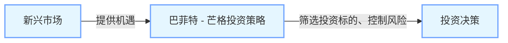

# 巴菲特 - 芒格的新兴市场投资策略：机遇与风险的平衡

> 关键词：巴菲特、芒格、新兴市场投资策略、机遇、风险平衡

> 摘要：本文深入探讨了巴菲特和芒格的新兴市场投资策略，分析了新兴市场所蕴含的机遇以及伴随的风险。通过阐述核心概念、算法原理、数学模型等内容，结合实际案例和应用场景，为投资者提供了全面且深入的视角。同时，推荐了相关的学习资源、开发工具以及论文著作，最后对新兴市场投资的未来发展趋势与挑战进行了总结，并解答了常见问题，为在新兴市场进行投资的人士提供有价值的参考。

## 1. 背景介绍 
### 1.1 目的和范围
随着全球经济格局的不断演变，新兴市场在世界经济舞台上的地位日益重要。巴菲特和芒格作为投资界的传奇人物，他们的投资理念和策略一直备受关注。本文章的目的在于深入剖析巴菲特 - 芒格的新兴市场投资策略，研究他们如何在新兴市场的机遇与风险之间找到平衡。范围涵盖了新兴市场的定义、特点，巴菲特 - 芒格投资策略的核心要素，以及该策略在实际新兴市场投资中的应用和效果。

### 1.2 预期读者
本文预期读者包括对投资领域感兴趣的个人投资者、金融行业从业者、投资研究人员以及关注全球经济发展和新兴市场动态的人士。无论是初学者希望了解投资基本理念，还是有一定经验的投资者寻求在新兴市场的投资指导，都能从本文中获得有价值的信息。

### 1.3 文档结构概述
本文首先介绍相关背景知识，包括目的、预期读者和文档结构。接着阐述核心概念，明确新兴市场和巴菲特 - 芒格投资策略的定义和联系。然后详细讲解核心算法原理和具体操作步骤，通过 Python 代码示例进行说明。再引入数学模型和公式，结合实际例子深入分析。之后通过项目实战展示代码案例并进行详细解读。随后探讨实际应用场景，推荐相关的工具和资源。最后总结未来发展趋势与挑战，解答常见问题，并提供扩展阅读和参考资料。

### 1.4 术语表
#### 1.4.1 核心术语定义
- **新兴市场**：指那些经济发展速度较快、市场潜力较大，但金融市场和监管体系相对不够成熟的国家和地区的市场。通常具有较高的经济增长率、较低的人均收入水平以及正在进行的经济改革和结构调整等特点。
- **巴菲特 - 芒格投资策略**：以沃伦·巴菲特和查理·芒格为代表的价值投资策略，强调通过深入研究公司的基本面，寻找具有长期竞争优势和稳定现金流的企业，在价格低于其内在价值时进行投资，并长期持有。

#### 1.4.2 相关概念解释
- **价值投资**：一种基于对公司内在价值评估的投资方法，认为股票价格最终会反映公司的真实价值。投资者通过分析公司的财务报表、行业地位、管理层能力等因素，确定公司的内在价值，当股票价格低于内在价值时买入，等待价格回归价值。
- **安全边际**：指股票的市场价格低于其内在价值的幅度。安全边际为投资者提供了一定的缓冲，降低了投资风险。即使公司未来的发展不如预期，由于存在安全边际，投资者也有可能避免损失。

#### 1.4.3 缩略词列表
- **PE**：市盈率（Price - Earnings Ratio），是股票价格除以每股收益的比率，用于衡量股票的估值水平。
- **ROE**：净资产收益率（Return on Equity），是净利润与平均股东权益的百分比，反映了公司运用自有资本的效率。

## 2. 核心概念与联系 

### 新兴市场的特点和机遇
新兴市场通常具有以下特点：
- **高经济增长率**：新兴市场国家往往处于经济快速发展阶段，国内生产总值（GDP）增长率较高。例如，过去几十年中，中国、印度等新兴市场国家的经济保持了高速增长，为企业的发展提供了广阔的空间。
- **庞大的消费市场**：随着经济的发展和居民收入水平的提高，新兴市场的消费需求不断增长。例如，新兴市场国家的中产阶级规模逐渐扩大，对消费品、服务业等的需求日益增加，为相关企业带来了巨大的商机。
- **产业结构升级**：新兴市场国家正在进行产业结构调整和升级，从传统的农业和制造业向高端制造业、服务业等领域转型。这为投资者提供了参与新兴产业发展的机会，如科技、医疗、金融科技等领域。

### 巴菲特 - 芒格投资策略的核心要素
- **关注公司基本面**：巴菲特和芒格非常注重对公司基本面的研究，包括公司的商业模式、财务状况、竞争优势等。他们会分析公司的收入、利润、现金流等财务指标，评估公司的盈利能力和偿债能力。例如，他们喜欢投资那些具有稳定现金流和高净资产收益率的公司。
- **寻找具有护城河的企业**：“护城河”是指企业具有的可持续竞争优势，如品牌优势、成本优势、技术优势等。具有护城河的企业能够在市场竞争中保持领先地位，抵御竞争对手的挑战。例如，可口可乐公司的品牌优势就是其重要的护城河，使其在全球饮料市场占据主导地位。
- **长期投资理念**：巴菲特和芒格主张长期投资，他们认为股票投资是对企业的长期所有权投资，而不是短期的投机行为。他们会选择那些具有长期发展潜力的企业，并长期持有其股票，分享企业成长带来的收益。

### 核心概念的联系
新兴市场的机遇为巴菲特 - 芒格投资策略提供了广阔的应用空间。新兴市场中存在着许多具有潜力的企业，通过运用巴菲特 - 芒格的投资策略，投资者可以筛选出那些具有竞争优势和内在价值的企业进行投资。同时，新兴市场的风险也需要投资者运用该策略中的安全边际等概念来进行控制。例如，在新兴市场中，由于市场波动较大，投资者可以通过寻找具有足够安全边际的股票来降低投资风险。

### 文本示意图
```plaintext
新兴市场（高经济增长、庞大消费市场、产业结构升级）
    |
    | 提供机遇
    v
巴菲特 - 芒格投资策略（关注基本面、寻找护城河企业、长期投资）
    |
    | 筛选投资标的、控制风险
    v
投资决策（选择有价值企业进行投资）
```

### Mermaid 流程图


## 3. 核心算法原理 & 具体操作步骤 

### 核心算法原理
在运用巴菲特 - 芒格的投资策略进行新兴市场投资时，可以使用一些量化的方法来筛选投资标的。其中一个重要的指标是市盈率（PE）和净资产收益率（ROE）。一般来说，我们希望选择那些市盈率较低、净资产收益率较高的公司。可以通过以下公式来计算一个综合得分：
$$Score = \frac{ROE}{PE}$$
得分越高，说明公司的性价比越高，越具有投资价值。

### Python 代码实现
```python
import pandas as pd

# 假设我们有一个包含公司名称、PE 和 ROE 的 DataFrame
data = {
    'Company': ['Company A', 'Company B', 'Company C', 'Company D'],
    'PE': [10, 15, 20, 5],
    'ROE': [0.2, 0.15, 0.1, 0.25]
}
df = pd.DataFrame(data)

# 计算得分
df['Score'] = df['ROE'] / df['PE']

# 按照得分降序排序
df = df.sort_values(by='Score', ascending=False)

print(df)
```

### 具体操作步骤
1. **数据收集**：收集新兴市场中各个公司的财务数据，包括市盈率、净资产收益率等。可以通过金融数据提供商、公司年报等渠道获取这些数据。
2. **数据处理**：将收集到的数据整理成合适的格式，例如使用 Pandas 库将数据存储在 DataFrame 中。
3. **计算得分**：根据上述公式计算每个公司的得分。
4. **筛选投资标的**：选择得分较高的公司作为潜在的投资标的。可以根据自己的投资目标和风险承受能力，设置一个得分阈值，只选择得分高于该阈值的公司。
5. **深入研究**：对筛选出的公司进行深入的基本面研究，包括分析公司的商业模式、竞争优势、管理层能力等，以确定是否适合投资。

## 4. 数学模型和公式 & 详细讲解 & 举例说明 

### 数学模型和公式
除了上述的得分公式 $Score = \frac{ROE}{PE}$ 外，还有一个重要的公式用于计算公司的内在价值，即现金流折现模型（DCF）。

现金流折现模型的基本公式为：
$$V = \sum_{t = 1}^{n}\frac{CF_t}{(1 + r)^t}+\frac{TV}{(1 + r)^n}$$
其中：
- $V$ 表示公司的内在价值
- $CF_t$ 表示第 $t$ 期的自由现金流
- $r$ 表示折现率
- $n$ 表示预测期数
- $TV$ 表示终值

### 详细讲解
现金流折现模型的核心思想是将公司未来的自由现金流折现到当前时刻，以确定公司的内在价值。自由现金流是指公司在满足了所有必要的资本支出后剩余的现金流量，它反映了公司实际可用于分配给股东或进行再投资的现金。折现率是投资者要求的最低回报率，通常根据市场利率、公司的风险水平等因素确定。终值是指预测期结束后公司的价值，通常使用永续增长模型来计算。

### 举例说明
假设我们要评估一家新兴市场公司的内在价值。我们预测该公司未来 5 年的自由现金流分别为 100 万元、120 万元、140 万元、160 万元和 180 万元。预测期结束后，公司的自由现金流将以每年 3% 的增长率永续增长。折现率为 10%。

首先，计算前 5 年自由现金流的现值：
$$PV_1=\frac{100}{(1 + 0.1)^1}\approx90.91\text{ 万元}$$
$$PV_2=\frac{120}{(1 + 0.1)^2}\approx99.17\text{ 万元}$$
$$PV_3=\frac{140}{(1 + 0.1)^3}\approx105.18\text{ 万元}$$
$$PV_4=\frac{160}{(1 + 0.1)^4}\approx109.28\text{ 万元}$$
$$PV_5=\frac{180}{(1 + 0.1)^5}\approx111.74\text{ 万元}$$

然后，计算终值：
$$TV=\frac{180\times(1 + 0.03)}{0.1 - 0.03}\approx2657.14\text{ 万元}$$

终值的现值为：
$$PV_{TV}=\frac{2657.14}{(1 + 0.1)^5}\approx1653.34\text{ 万元}$$

最后，计算公司的内在价值：
$$V = PV_1+PV_2+PV_3+PV_4+PV_5+PV_{TV}$$
$$V\approx90.91 + 99.17+105.18+109.28+111.74+1653.34\approx2169.62\text{ 万元}$$

如果该公司的当前市场价值低于 2169.62 万元，那么根据现金流折现模型，该公司可能被低估，具有投资价值。

## 5. 项目实战：代码实际案例和详细解释说明 

### 5.1  开发环境搭建
- **安装 Python**：首先需要安装 Python 环境，建议使用 Python 3.7 及以上版本。可以从 Python 官方网站（https://www.python.org/downloads/）下载并安装。
- **安装必要的库**：使用以下命令安装所需的库：
```sh
pip install pandas numpy matplotlib
```
其中，`pandas` 用于数据处理和分析，`numpy` 用于数值计算，`matplotlib` 用于数据可视化。

### 5.2  源代码详细实现和代码解读
```python
import pandas as pd
import numpy as np
import matplotlib.pyplot as plt

# 模拟收集到的新兴市场公司数据
data = {
    'Company': ['Company A', 'Company B', 'Company C', 'Company D', 'Company E'],
    'PE': [12, 18, 22, 8, 15],
    'ROE': [0.18, 0.15, 0.12, 0.25, 0.16],
    'FreeCashFlow': [100, 120, 150, 80, 130]
}
df = pd.DataFrame(data)

# 计算得分
df['Score'] = df['ROE'] / df['PE']

# 按照得分降序排序
df = df.sort_values(by='Score', ascending=False)

# 绘制得分柱状图
plt.bar(df['Company'], df['Score'])
plt.xlabel('Company')
plt.ylabel('Score')
plt.title('Company Investment Score')
plt.show()

# 选择得分最高的公司作为潜在投资标的
top_company = df.iloc[0]['Company']
print(f"潜在投资标的: {top_company}")
```

### 代码解读与分析
1. **数据模拟**：使用字典 `data` 模拟收集到的新兴市场公司数据，包括公司名称、市盈率、净资产收益率和自由现金流。然后使用 `pandas` 的 `DataFrame` 将数据存储为表格形式。
2. **得分计算**：根据公式 $Score = \frac{ROE}{PE}$ 计算每个公司的得分，并将结果存储在新的列 `Score` 中。
3. **排序**：使用 `sort_values` 方法按照得分降序排序，以便找到得分最高的公司。
4. **数据可视化**：使用 `matplotlib` 库绘制得分柱状图，直观地展示各个公司的得分情况。
5. **选择投资标的**：选择得分最高的公司作为潜在投资标的，并打印输出。

通过这个项目实战，我们可以看到如何运用 Python 代码实现巴菲特 - 芒格投资策略的量化筛选过程，帮助我们在新兴市场中找到具有投资价值的公司。

## 6. 实际应用场景 
### 个人投资者
对于个人投资者来说，巴菲特 - 芒格的新兴市场投资策略可以帮助他们在众多的新兴市场股票中筛选出具有投资价值的标的。个人投资者可以通过研究公司的基本面，运用量化指标进行筛选，找到那些被低估的股票进行长期投资。例如，个人投资者可以关注新兴市场国家的消费、科技等行业，寻找具有品牌优势和成长潜力的企业。

### 机构投资者
机构投资者如基金公司、保险公司等，在进行新兴市场投资时，也可以借鉴巴菲特 - 芒格的投资策略。机构投资者可以利用专业的研究团队和数据分析工具，对新兴市场的公司进行深入研究和评估。他们可以通过构建投资组合，分散投资风险，同时选择具有长期竞争优势的企业进行投资，以实现资产的保值增值。

### 跨国公司
跨国公司在新兴市场进行投资和扩张时，也可以运用巴菲特 - 芒格的投资理念。跨国公司可以通过分析新兴市场的市场需求、竞争环境等因素，选择具有潜力的合作伙伴或投资项目。例如，跨国公司可以关注新兴市场国家的基础设施建设、新能源等领域，寻找投资机会。

## 7. 工具和资源推荐
### 7.1 学习资源推荐
#### 7.1.1 书籍推荐
- 《聪明的投资者》（The Intelligent Investor）：本杰明·格雷厄姆著，被誉为投资界的圣经，介绍了价值投资的基本理念和方法。
- 《巴菲特致股东的信》（Letters to Shareholders）：沃伦·巴菲特著，通过巴菲特写给股东的信，了解他的投资思想和决策过程。
- 《穷查理宝典》（Poor Charlie's Almanack）：查理·芒格著，收录了芒格的演讲和文章，展现了他的多元思维模型和投资智慧。

#### 7.1.2 在线课程
- Coursera 上的“投资学原理”（Principles of Investing）课程：由知名教授授课，系统介绍投资学的基本原理和方法。
- edX 上的“价值投资基础”（Foundations of Value Investing）课程：专注于价值投资的理论和实践。

#### 7.1.3 技术博客和网站
- Seeking Alpha：提供全球金融市场的分析和研究报告，包括新兴市场的投资机会和风险。
- ValueWalk：专注于价值投资领域，分享价值投资者的观点和研究成果。

### 7.2 开发工具框架推荐
#### 7.2.1 IDE和编辑器
- PyCharm：一款专业的 Python 集成开发环境，提供代码编辑、调试、版本控制等功能，适合开发 Python 投资分析程序。
- Jupyter Notebook：一种交互式的开发环境，支持 Python、R 等多种编程语言，方便进行数据分析和可视化。

#### 7.2.2 调试和性能分析工具
- pdb：Python 内置的调试器，可以帮助开发者定位和解决代码中的问题。
- cProfile：Python 的性能分析工具，可以分析代码的运行时间和函数调用情况，帮助优化代码性能。

#### 7.2.3 相关框架和库
- Pandas：用于数据处理和分析的 Python 库，提供了高效的数据结构和数据分析工具。
- NumPy：用于数值计算的 Python 库，提供了多维数组对象和各种数学函数。
- Matplotlib：用于数据可视化的 Python 库，可以绘制各种类型的图表。

### 7.3 相关论文著作推荐
#### 7.3.1 经典论文
- “The Superinvestors of Graham - and - Doddsville”：沃伦·巴菲特著，阐述了价值投资的有效性和成功案例。
- “Security Analysis”：本杰明·格雷厄姆和大卫·多德著，奠定了价值投资的理论基础。

#### 7.3.2 最新研究成果
- 可以关注《Journal of Finance》《Review of Financial Studies》等金融领域的顶级学术期刊，了解新兴市场投资的最新研究成果。

#### 7.3.3 应用案例分析
- 可以参考一些投资机构的研究报告和案例分析，了解巴菲特 - 芒格投资策略在新兴市场的实际应用情况和效果。

## 8. 总结：未来发展趋势与挑战
### 未来发展趋势
- **新兴市场的重要性不断提升**：随着全球经济的发展，新兴市场在世界经济中的份额将继续增加。新兴市场国家的经济增长和消费升级将为投资者带来更多的机会。
- **科技和创新的推动**：新兴市场国家在科技和创新领域的投入不断增加，涌现出了许多具有创新能力的企业。科技和创新将成为新兴市场投资的重要方向。
- **可持续投资的兴起**：投资者越来越关注企业的社会责任和可持续发展。在新兴市场，可持续投资将成为一种趋势，投资者将更加倾向于投资那些具有良好环境、社会和治理（ESG）表现的企业。

### 挑战
- **政治和政策风险**：新兴市场国家的政治环境和政策稳定性相对较差，政治事件和政策变化可能会对投资产生不利影响。例如，政府的税收政策、监管政策等的变化可能会影响企业的盈利能力。
- **市场波动风险**：新兴市场的金融市场相对不够成熟，市场波动较大。投资者需要具备较强的风险承受能力和风险管理能力。
- **信息不对称风险**：在新兴市场，由于信息披露制度不够完善，投资者可能面临信息不对称的问题。这增加了投资者评估企业价值和风险的难度。

为了应对这些挑战，投资者需要加强对新兴市场的研究和了解，制定合理的投资策略，同时注重风险管理。

## 9. 附录：常见问题与解答
### 问题 1：巴菲特 - 芒格的投资策略是否适用于所有新兴市场？
解答：巴菲特 - 芒格的投资策略的核心思想是价值投资，其基本原理在大多数新兴市场都是适用的。然而，不同的新兴市场具有不同的特点和风险，投资者需要根据具体市场的情况进行调整。例如，一些新兴市场的金融市场不够成熟，信息披露不够完善，投资者在运用该策略时需要更加谨慎地进行基本面分析和风险评估。

### 问题 2：如何确定新兴市场公司的内在价值？
解答：可以使用现金流折现模型（DCF）等方法来确定新兴市场公司的内在价值。在使用 DCF 模型时，需要预测公司未来的自由现金流、确定折现率和预测期数等参数。这些参数的确定需要综合考虑公司的基本面、行业发展趋势、宏观经济环境等因素。同时，也可以参考同行业其他公司的估值水平进行比较和调整。

### 问题 3：在新兴市场投资时，如何控制风险？
解答：可以通过以下方法控制风险：
- **分散投资**：构建投资组合，投资于不同行业、不同公司的股票，降低单一股票的风险。
- **设置安全边际**：选择那些股票价格低于其内在价值的公司进行投资，为投资提供一定的缓冲。
- **加强研究和分析**：深入了解新兴市场的政治、经济、社会等环境，以及公司的基本面和竞争优势，做出更加明智的投资决策。

## 10. 扩展阅读 & 参考资料
### 扩展阅读
- 《金融炼金术》（The Alchemy of Finance）：乔治·索罗斯著，探讨了金融市场的运行规律和投资者的心理行为。
- 《黑天鹅》（The Black Swan）：纳西姆·尼古拉斯·塔勒布著，介绍了不可预测的重大事件对金融市场的影响。

### 参考资料
- 巴菲特和芒格的官方网站和公开演讲资料。
- 金融数据提供商如 Bloomberg、Wind 等提供的新兴市场数据和研究报告。

作者：AI天才研究院/AI Genius Institute & 禅与计算机程序设计艺术 /Zen And The Art of Computer Programming