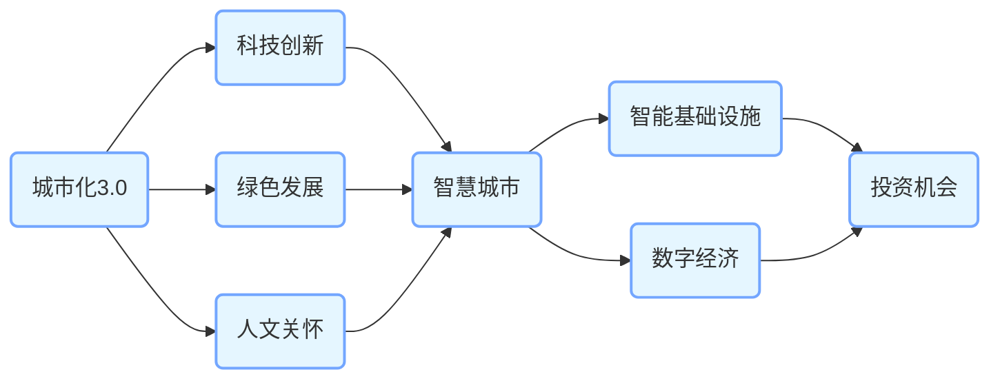

# 巴菲特 - 芒格的智慧城市投资：城市化3.0的投资机会

> 关键词：巴菲特；芒格；智慧城市投资；城市化3.0；投资机会

> 摘要：本文聚焦于巴菲特和芒格的投资理念在智慧城市投资领域的应用，深入探讨城市化3.0背景下的投资机会。首先介绍了文章的背景，包括目的、预期读者、文档结构和相关术语。接着阐述了智慧城市、城市化3.0等核心概念及其联系，并通过文本示意图和Mermaid流程图展示。详细讲解了在智慧城市投资中可能涉及的核心算法原理及具体操作步骤，同时给出了相应的数学模型和公式。通过项目实战案例，对代码实现和解读进行了说明。分析了智慧城市投资的实际应用场景，推荐了学习、开发工具和相关论文著作等资源。最后总结了未来发展趋势与挑战，提供常见问题解答和扩展阅读参考资料，旨在为投资者和相关从业者提供全面深入的指导。

## 1. 背景介绍 
### 1.1 目的和范围
本文的主要目的是分析巴菲特 - 芒格的投资哲学如何应用于智慧城市投资，探索城市化3.0进程中潜藏的投资机会。我们将研究智慧城市的各个方面，包括基础设施、技术创新、社会服务等，以确定具有长期增长潜力的投资领域。范围涵盖了智慧城市的理论基础、技术应用、市场趋势以及实际投资案例。通过全面的研究，为投资者提供有关智慧城市投资的深入见解和实用建议。

### 1.2 预期读者
本文预期读者包括投资者、金融分析师、城市规划者、科技爱好者以及对智慧城市发展和投资感兴趣的各界人士。对于投资者而言，希望能从本文中找到有价值的投资方向和策略；城市规划者可以了解投资趋势对城市发展的影响；科技爱好者能进一步认识智慧城市的技术内涵；而其他读者则可借此拓宽对城市化3.0和智慧城市投资的认知。

### 1.3 文档结构概述
本文将按照以下结构展开：首先介绍核心概念与联系，明确智慧城市、城市化3.0等关键概念及其相互关系；接着阐述核心算法原理和具体操作步骤，为投资决策提供技术支持；然后给出数学模型和公式，以量化分析投资机会；通过项目实战案例，详细说明代码实现和解读；分析实际应用场景，展示投资机会的具体体现；推荐学习、开发工具和相关论文著作等资源；最后总结未来发展趋势与挑战，提供常见问题解答和扩展阅读参考资料。

### 1.4 术语表
#### 1.4.1 核心术语定义
- **智慧城市**：利用信息技术和通信技术手段感测、分析、整合城市运行核心系统的各项关键信息，从而对包括民生、环保、公共安全、城市服务、工商业活动在内的各种需求做出智能响应的城市形态。
- **城市化3.0**：区别于传统城市化和工业化驱动的城市化2.0，城市化3.0是以科技创新、绿色发展和人文关怀为核心驱动力，注重城市的智能化、可持续性和居民生活质量提升的城市化阶段。
- **投资机会**：指在特定的市场环境和经济条件下，能够为投资者带来潜在收益的投资领域或项目。

#### 1.4.2 相关概念解释
- **智能基础设施**：包括智能交通系统、智能能源网络、智能建筑等，通过物联网、大数据、人工智能等技术实现设施的智能化管理和运行。
- **数字经济**：以数字化的知识和信息作为关键生产要素，以数字技术为核心驱动力，以现代信息网络为重要载体，通过数字技术与实体经济深度融合，不断提高经济社会的数字化、网络化、智能化水平的经济形态。

#### 1.4.3 缩略词列表
- **IoT**：Internet of Things，物联网
- **AI**：Artificial Intelligence，人工智能
- **Big Data**：大数据

## 2. 核心概念与联系 

### 核心概念原理
#### 智慧城市
智慧城市的核心原理在于通过全面的感知、可靠的传输和智能的处理，实现城市运行的高效、便捷和可持续。利用物联网技术，城市中的各种设备和传感器能够实时采集数据，如交通流量、能源消耗、环境质量等。这些数据通过网络传输到数据中心，经过大数据分析和人工智能算法处理，为城市管理者和决策者提供有价值的信息，从而实现智能决策和精准管理。

#### 城市化3.0
城市化3.0强调科技创新、绿色发展和人文关怀。科技创新是推动城市化3.0的核心动力，通过引入先进的技术，如人工智能、物联网、区块链等，提高城市的运行效率和服务质量。绿色发展要求城市在建设和发展过程中注重环境保护和资源节约，实现经济发展与生态保护的良性互动。人文关怀则关注居民的需求和体验，营造宜居、宜业、宜游的城市环境。

### 架构的文本示意图
智慧城市架构可以分为四个层次：感知层、网络层、平台层和应用层。感知层由各种传感器和设备组成，负责采集城市运行的数据；网络层包括有线和无线网络，用于数据的传输；平台层提供数据存储、处理和分析的能力；应用层则是基于平台层的数据分析结果，为城市管理、公共服务、商业运营等提供具体的应用。

城市化3.0的架构则围绕科技创新、绿色发展和人文关怀三个核心要素展开。科技创新为城市发展提供技术支撑，绿色发展确保城市的可持续性，人文关怀则是城市发展的根本目标。这三个要素相互关联、相互促进，共同推动城市的高质量发展。

### Mermaid流程图


## 3. 核心算法原理 & 具体操作步骤 

### 核心算法原理
在智慧城市投资中，我们可以运用机器学习算法来评估投资项目的风险和收益。以线性回归算法为例，线性回归是一种用于建立自变量和因变量之间线性关系的统计方法。在投资分析中，我们可以将影响投资项目收益的因素作为自变量，如市场需求、技术创新水平、政策环境等，将投资项目的预期收益作为因变量，通过线性回归算法建立模型，预测投资项目的收益情况。

### Python源代码详细阐述
```python
import numpy as np
from sklearn.linear_model import LinearRegression

# 假设我们有一些投资项目的数据，X是自变量矩阵，y是因变量向量
# 这里我们假设X有三个特征：市场需求、技术创新水平、政策环境
X = np.array([[100, 80, 60], [120, 90, 70], [150, 95, 80], [180, 100, 90]])
y = np.array([200, 250, 300, 350])

# 创建线性回归模型
model = LinearRegression()

# 拟合模型
model.fit(X, y)

# 预测新的投资项目的收益
new_X = np.array([[200, 110, 95]])
predicted_y = model.predict(new_X)

print("预测的投资项目收益为:", predicted_y[0])
```

### 具体操作步骤
1. **数据收集**：收集与投资项目相关的数据，包括市场需求、技术创新水平、政策环境等因素的数据，以及投资项目的历史收益数据。
2. **数据预处理**：对收集到的数据进行清洗、归一化等预处理操作，以提高模型的准确性。
3. **模型选择**：根据数据的特点和问题的性质，选择合适的机器学习算法，如线性回归、决策树、神经网络等。
4. **模型训练**：使用预处理后的数据对模型进行训练，调整模型的参数，使其能够准确地预测投资项目的收益。
5. **模型评估**：使用测试数据对训练好的模型进行评估，计算模型的准确率、召回率、均方误差等指标，评估模型的性能。
6. **投资决策**：根据模型的预测结果，结合投资者的风险偏好和投资目标，做出投资决策。

## 4. 数学模型和公式 & 详细讲解 & 举例说明 

### 线性回归数学模型和公式
线性回归的数学模型可以表示为：

$$y = \beta_0 + \beta_1x_1 + \beta_2x_2 + \cdots + \beta_nx_n + \epsilon$$

其中，$y$ 是因变量，即投资项目的预期收益；$x_1, x_2, \cdots, x_n$ 是自变量，即影响投资项目收益的因素；$\beta_0, \beta_1, \beta_2, \cdots, \beta_n$ 是模型的参数；$\epsilon$ 是误差项，表示模型无法解释的随机因素。

线性回归的目标是找到一组最优的参数 $\beta_0, \beta_1, \beta_2, \cdots, \beta_n$，使得模型的预测值与实际值之间的误差最小。常用的方法是最小二乘法，即最小化误差平方和：

$$\min_{\beta_0, \beta_1, \cdots, \beta_n} \sum_{i=1}^{m} (y_i - (\beta_0 + \beta_1x_{i1} + \beta_2x_{i2} + \cdots + \beta_nx_{in}))^2$$

其中，$m$ 是样本数量，$y_i$ 是第 $i$ 个样本的实际值，$x_{i1}, x_{i2}, \cdots, x_{in}$ 是第 $i$ 个样本的自变量值。

### 详细讲解
线性回归是一种简单而有效的预测方法，它通过建立自变量和因变量之间的线性关系，来预测因变量的值。在投资分析中，线性回归可以帮助我们评估投资项目的风险和收益，为投资决策提供参考。

最小二乘法是求解线性回归参数的常用方法，它的基本思想是通过最小化误差平方和，找到一组最优的参数，使得模型的预测值与实际值之间的误差最小。最小二乘法具有简单、直观、易于实现等优点，在实际应用中得到了广泛的应用。

### 举例说明
假设我们要评估一个智慧城市交通项目的投资收益，我们可以选择市场需求、技术创新水平、政策环境等因素作为自变量，投资项目的预期收益作为因变量。收集相关的数据后，我们可以使用线性回归模型进行分析。

假设我们收集到了以下数据：

| 市场需求（$x_1$） | 技术创新水平（$x_2$） | 政策环境（$x_3$） | 预期收益（$y$） |
| --- | --- | --- | --- |
| 100 | 80 | 60 | 200 |
| 120 | 90 | 70 | 250 |
| 150 | 95 | 80 | 300 |
| 180 | 100 | 90 | 350 |

使用上述数据，我们可以建立线性回归模型：

$$y = \beta_0 + \beta_1x_1 + \beta_2x_2 + \beta_3x_3 + \epsilon$$

通过最小二乘法求解模型的参数，得到：

$$\beta_0 = -100, \beta_1 = 1.5, \beta_2 = 1, \beta_3 = 0.5$$

因此，线性回归模型为：

$$y = -100 + 1.5x_1 + x_2 + 0.5x_3$$

假设我们要预测一个新的交通项目的预期收益，该项目的市场需求为 200，技术创新水平为 110，政策环境为 95，则将这些值代入模型中，得到：

$$y = -100 + 1.5\times200 + 110 + 0.5\times95 = 457.5$$

因此，我们预测该交通项目的预期收益为 457.5。

## 5. 项目实战：代码实际案例和详细解释说明 

### 5.1  开发环境搭建
为了实现上述的线性回归模型，我们需要搭建一个Python开发环境。以下是具体的步骤：
1. **安装Python**：从Python官方网站（https://www.python.org/downloads/）下载并安装Python 3.x版本。
2. **安装必要的库**：使用pip命令安装NumPy和Scikit-learn库，这两个库分别用于数值计算和机器学习。
```bash
pip install numpy scikit-learn
```
3. **选择开发工具**：可以选择使用Jupyter Notebook、PyCharm等开发工具来编写和运行Python代码。

### 5.2  源代码详细实现和代码解读
```python
import numpy as np
from sklearn.linear_model import LinearRegression

# 假设我们有一些投资项目的数据，X是自变量矩阵，y是因变量向量
# 这里我们假设X有三个特征：市场需求、技术创新水平、政策环境
X = np.array([[100, 80, 60], [120, 90, 70], [150, 95, 80], [180, 100, 90]])
y = np.array([200, 250, 300, 350])

# 创建线性回归模型
model = LinearRegression()

# 拟合模型
model.fit(X, y)

# 预测新的投资项目的收益
new_X = np.array([[200, 110, 95]])
predicted_y = model.predict(new_X)

print("预测的投资项目收益为:", predicted_y[0])
```

### 代码解读与分析
1. **导入必要的库**：使用`import`语句导入NumPy和Scikit-learn库。
2. **定义数据**：使用NumPy数组定义自变量矩阵`X`和因变量向量`y`。
3. **创建线性回归模型**：使用`LinearRegression()`函数创建线性回归模型。
4. **拟合模型**：使用`fit()`方法将数据拟合到模型中，即求解模型的参数。
5. **预测新的投资项目的收益**：使用`predict()`方法对新的投资项目的收益进行预测。
6. **输出结果**：使用`print()`函数输出预测的投资项目收益。

通过上述代码，我们可以看到如何使用Python和Scikit-learn库实现线性回归模型，以及如何使用该模型进行投资项目的收益预测。

## 6. 实际应用场景 
### 智能交通领域
在智能交通领域，智慧城市投资可以用于建设智能交通系统，包括智能信号灯、智能停车系统、智能公交系统等。通过投资这些项目，可以提高交通效率，减少交通拥堵，降低交通事故发生率，从而为投资者带来可观的收益。例如，投资智能停车系统可以通过收取停车费用获得收益，同时也可以提高城市的停车管理效率。

### 智能能源领域
智能能源领域也是智慧城市投资的重要方向。投资智能电网、分布式能源系统、能源管理系统等项目，可以提高能源利用效率，降低能源消耗，减少环境污染。例如，投资分布式能源系统可以通过向用户出售电力获得收益，同时也可以提高能源的可靠性和稳定性。

### 智能建筑领域
智能建筑领域包括智能办公大楼、智能住宅小区等。投资智能建筑项目可以提高建筑的智能化水平，提供更加舒适、便捷、安全的居住和办公环境。例如，投资智能办公大楼可以通过提高租金收益和降低运营成本获得收益，同时也可以提高企业的形象和竞争力。

### 数字政务领域
数字政务领域是智慧城市建设的重要组成部分。投资数字政务项目可以提高政府的管理效率和服务质量，促进政务公开和透明。例如，投资电子政务平台可以通过提供政务服务获得收益，同时也可以提高政府的公信力和执行力。

## 7. 工具和资源推荐
### 7.1 学习资源推荐
#### 7.1.1 书籍推荐
- 《智慧城市：大数据、物联网和云计算之应用》：本书详细介绍了智慧城市的概念、技术和应用，包括大数据、物联网、云计算等方面的内容。
- 《投资中最简单的事》：本书由巴菲特的合作伙伴芒格推荐，作者从投资的基本原理出发，介绍了投资的方法和策略。
- 《人工智能：一种现代的方法》：本书是人工智能领域的经典教材，涵盖了人工智能的各个方面，包括机器学习、自然语言处理、计算机视觉等。

#### 7.1.2 在线课程
- Coursera上的“智慧城市技术与应用”课程：该课程由知名大学的教授授课，介绍了智慧城市的技术和应用，包括物联网、大数据、人工智能等方面的内容。
- edX上的“投资学原理”课程：该课程由知名商学院的教授授课，介绍了投资的基本原理和方法，包括股票投资、债券投资、基金投资等方面的内容。
- Udemy上的“Python机器学习实战”课程：该课程由经验丰富的讲师授课，介绍了Python在机器学习中的应用，包括线性回归、决策树、神经网络等方面的内容。

#### 7.1.3 技术博客和网站
- 智慧城市网（https://www.smartcitychina.cn/）：该网站是国内领先的智慧城市资讯平台，提供智慧城市的最新动态、技术应用、项目案例等方面的内容。
- 投资界（https://www.pedaily.cn/）：该网站是国内知名的投资资讯平台，提供投资的最新动态、行业分析、项目推荐等方面的内容。
- 机器学习算法与Python实战（https://blog.csdn.net/column/details/20210.html）：该博客是国内知名的机器学习技术博客，提供机器学习的算法原理、代码实现、应用案例等方面的内容。

### 7.2 开发工具框架推荐
#### 7.2.1 IDE和编辑器
- PyCharm：是一款专门为Python开发设计的集成开发环境，具有代码编辑、调试、版本控制等功能。
- Jupyter Notebook：是一款基于Web的交互式计算环境，支持多种编程语言，包括Python、R等，适合进行数据分析和机器学习实验。
- Visual Studio Code：是一款轻量级的代码编辑器，支持多种编程语言和插件，具有代码高亮、自动补全、调试等功能。

#### 7.2.2 调试和性能分析工具
- Py-Spy：是一款用于Python代码性能分析的工具，可以实时监测Python程序的CPU使用率、内存使用率等指标。
- cProfile：是Python标准库中的一个性能分析工具，可以统计Python程序中各个函数的执行时间和调用次数。
- PDB：是Python标准库中的一个调试工具，可以在Python程序中设置断点，单步执行代码，查看变量的值等。

#### 7.2.3 相关框架和库
- Scikit-learn：是一个用于机器学习的Python库，提供了各种机器学习算法的实现，包括线性回归、决策树、神经网络等。
- TensorFlow：是一个开源的机器学习框架，由Google开发，支持深度学习算法的实现，包括卷积神经网络、循环神经网络等。
- PyTorch：是一个开源的深度学习框架，由Facebook开发，支持动态计算图，适合进行深度学习研究和开发。

### 7.3 相关论文著作推荐
#### 7.3.1 经典论文
- 《The Wisdom of Crowds》：该论文提出了群体智慧的概念，认为群体的决策往往比个体的决策更加准确。
- 《Efficient Capital Markets: A Review of Theory and Empirical Work》：该论文提出了有效市场假说，认为市场价格已经反映了所有可用的信息。
- 《Machine Learning: A Probabilistic Perspective》：该论文是机器学习领域的经典论文，介绍了机器学习的概率模型和算法。

#### 7.3.2 最新研究成果
- 《Smart City Index 2023》：该报告是由知名咨询公司发布的智慧城市研究报告，评估了全球各个城市的智慧城市发展水平。
- 《Investment Opportunities in Smart Cities: A Global Perspective》：该论文是由知名学者发表的关于智慧城市投资机会的研究论文，分析了全球智慧城市投资的现状和趋势。
- 《The Impact of Artificial Intelligence on Smart City Development》：该论文是由知名学者发表的关于人工智能对智慧城市发展影响的研究论文，探讨了人工智能在智慧城市建设中的应用和挑战。

#### 7.3.3 应用案例分析
- 《Case Studies in Smart City Investment》：该书籍收集了全球各个城市的智慧城市投资案例，分析了这些案例的投资策略、实施效果和经验教训。
- 《Smart City Projects: Success Stories and Lessons Learned》：该报告是由知名咨询公司发布的智慧城市项目研究报告，介绍了全球各个城市的智慧城市项目的成功案例和经验教训。
- 《Investment Analysis of Smart City Projects in China》：该论文是由国内学者发表的关于中国智慧城市项目投资分析的研究论文，分析了中国智慧城市项目的投资现状和趋势。

## 8. 总结：未来发展趋势与挑战
### 未来发展趋势
- **技术创新推动**：随着人工智能、物联网、区块链等技术的不断发展，智慧城市的智能化水平将不断提高。未来，智慧城市将实现更加高效的资源管理、更加精准的决策支持和更加个性化的服务提供。
- **绿色可持续发展**：城市化3.0强调绿色发展，未来智慧城市将更加注重环境保护和资源节约。投资项目将更多地集中在可再生能源、绿色建筑、循环经济等领域。
- **融合发展**：智慧城市将与数字经济、共享经济等新兴经济形态深度融合，创造出更多的商业模式和投资机会。例如，智慧城市与共享出行的结合将提高交通资源的利用效率，降低出行成本。

### 挑战
- **技术安全**：智慧城市依赖于大量的信息技术和通信技术，技术安全问题将成为一个重要的挑战。例如，黑客攻击、数据泄露等问题可能会影响城市的正常运行和居民的隐私安全。
- **数据隐私**：智慧城市建设需要收集和处理大量的居民数据，数据隐私问题将引起广泛关注。如何在保护居民数据隐私的前提下，实现数据的有效利用，是智慧城市建设面临的一个重要问题。
- **投资回报**：智慧城市投资项目通常具有投资大、周期长、回报慢等特点，如何确保投资项目的回报，是投资者面临的一个重要挑战。

## 9. 附录：常见问题与解答
### 问题1：智慧城市投资的风险有哪些？
解答：智慧城市投资的风险包括技术风险、市场风险、政策风险等。技术风险主要指技术创新失败、技术应用不成熟等问题；市场风险主要指市场需求不足、市场竞争激烈等问题；政策风险主要指政策变化、政策支持不足等问题。

### 问题2：如何评估智慧城市投资项目的价值？
解答：可以从多个方面评估智慧城市投资项目的价值，包括市场需求、技术创新水平、政策环境、投资回报率等。可以使用财务分析方法，如净现值法、内部收益率法等，来评估投资项目的财务价值；也可以使用非财务分析方法，如社会效益评估、环境效益评估等，来评估投资项目的综合价值。

### 问题3：智慧城市投资的资金来源有哪些？
解答：智慧城市投资的资金来源包括政府财政资金、社会资本、金融机构贷款等。政府财政资金可以用于基础设施建设、公共服务提供等方面；社会资本可以通过PPP模式、股权投资等方式参与智慧城市投资；金融机构贷款可以为投资项目提供资金支持。

## 10. 扩展阅读 & 参考资料
### 扩展阅读
- 《未来城市：智能、绿色与可持续发展》
- 《科技金融：创新与实践》
- 《人工智能时代的投资策略》

### 参考资料
- 世界银行. 《世界发展报告》
- 联合国人居署. 《世界城市状况报告》
- 中国智慧城市发展研究中心. 《中国智慧城市发展报告》

作者：AI天才研究院/AI Genius Institute & 禅与计算机程序设计艺术 /Zen And The Art of Computer Programming