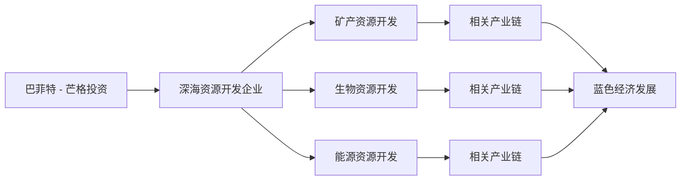

# 巴菲特 - 芒格的深海资源开发投资：蓝色经济的新前沿

> 关键词：巴菲特；芒格；深海资源开发；蓝色经济；投资策略

> 摘要：本文聚焦于巴菲特和芒格在深海资源开发领域的投资，深入探讨这一投资行为对蓝色经济发展的意义。通过对深海资源开发的背景、核心概念、算法原理、数学模型等方面的分析，结合实际案例阐述其投资逻辑和潜在影响。同时，介绍了相关的工具和资源，最后对该领域的未来发展趋势与挑战进行总结，并提供常见问题解答和扩展阅读资料。

## 1. 背景介绍 
### 1.1 目的和范围
本文旨在全面剖析巴菲特和芒格对深海资源开发的投资行为，探究其背后的投资理念和战略布局。通过研究深海资源开发这一新兴领域，分析其在蓝色经济中的重要地位和发展潜力。范围涵盖深海资源的种类、开发技术、市场前景，以及巴菲特和芒格投资决策的影响因素等方面。

### 1.2 预期读者
本文预期读者包括金融投资领域的从业者、关注海洋经济发展的研究人员、对巴菲特和芒格投资理念感兴趣的投资者，以及希望了解新兴投资领域的普通读者。

### 1.3 文档结构概述
本文首先介绍深海资源开发的背景知识，包括目的、预期读者和文档结构。接着阐述核心概念与联系，展示相关的原理和架构示意图。然后详细讲解核心算法原理和具体操作步骤，结合数学模型和公式进行分析。通过实际案例展示项目实战过程，包括开发环境搭建、源代码实现和代码解读。之后介绍深海资源开发的实际应用场景和相关的工具资源。最后总结未来发展趋势与挑战，提供常见问题解答和扩展阅读资料。

### 1.4 术语表
#### 1.4.1 核心术语定义
- **深海资源开发**：指对水深超过200米的海洋区域内的各种资源进行勘探、开采和利用的活动，包括矿产资源、生物资源、能源资源等。
- **蓝色经济**：是以海洋为基础的经济活动，涵盖海洋渔业、海洋交通运输业、海洋能源开发、海洋旅游业等多个领域，强调可持续发展和环境保护。
- **投资策略**：投资者为实现投资目标而采取的一系列决策和方法，包括资产配置、选股标准、风险控制等。

#### 1.4.2 相关概念解释
- **深海矿产资源**：主要包括多金属结核、富钴结壳、热液硫化物等，这些矿产资源富含铜、镍、钴、锰等多种金属元素，具有重要的经济价值。
- **海洋生物资源**：指海洋中各种生物的总和，包括鱼类、贝类、藻类等，可用于食品、医药、化妆品等行业。
- **海洋能源资源**：包括潮汐能、波浪能、海流能、温差能等可再生能源，具有清洁、可持续的特点。

#### 1.4.3 缩略词列表
- **GDP**：国内生产总值（Gross Domestic Product）
- **ROI**：投资回报率（Return on Investment）
- **EIA**：环境影响评估（Environmental Impact Assessment）

## 2. 核心概念与联系 

### 核心概念原理
深海资源开发是基于对海洋深处丰富资源的认识和利用需求而发展起来的领域。随着陆地资源的逐渐枯竭和科技的不断进步，人类将目光投向了广阔的海洋。深海资源具有种类丰富、储量巨大的特点，但开发难度也相对较高，需要先进的技术和设备支持。

蓝色经济则强调海洋经济的可持续发展，注重经济、社会和环境效益的统一。深海资源开发作为蓝色经济的重要组成部分，其发展需要遵循可持续发展的原则，减少对海洋生态环境的影响。

巴菲特和芒格的投资理念强调价值投资，即寻找具有长期竞争优势和稳定现金流的企业进行投资。他们对深海资源开发的投资，可能是基于对该领域未来发展潜力的看好，认为相关企业具有较高的投资价值。

### 架构的文本示意图
```plaintext
           巴菲特 - 芒格投资
                 |
                 v
       深海资源开发企业
         /        |        \
        /         |         \
  矿产资源开发  生物资源开发  能源资源开发
       |           |           |
       v           v           v
  相关产业链  相关产业链  相关产业链
       |           |           |
       v           v           v
    蓝色经济发展
```

### Mermaid 流程图


## 3. 核心算法原理 & 具体操作步骤 

### 核心算法原理
在评估深海资源开发项目的投资价值时，可以使用一些常见的财务分析算法，如净现值（NPV）法和内部收益率（IRR）法。

#### 净现值（NPV）法
净现值是指投资项目在未来各期现金流量的现值之和与初始投资之间的差额。计算公式为：
$$NPV=\sum_{t=0}^{n}\frac{CF_t}{(1+r)^t}-I_0$$
其中，$CF_t$ 表示第 $t$ 期的现金流量，$r$ 表示折现率，$I_0$ 表示初始投资，$n$ 表示项目的寿命期。

如果 $NPV>0$，则说明项目具有投资价值；如果 $NPV<0$，则说明项目不值得投资。

#### 内部收益率（IRR）法
内部收益率是指使投资项目的净现值等于零的折现率。计算公式为：
$$\sum_{t=0}^{n}\frac{CF_t}{(1+IRR)^t}-I_0=0$$
求解 $IRR$ 的过程通常需要使用迭代法或插值法。

内部收益率越高，说明项目的盈利能力越强。一般来说，如果 $IRR$ 大于投资者要求的最低收益率，则项目具有投资价值。

### 具体操作步骤
#### 步骤 1：收集项目信息
收集深海资源开发项目的相关信息，包括项目的规模、预计投资金额、预计开采年限、预计产量、市场价格等。

#### 步骤 2：预测现金流量
根据收集到的信息，预测项目在未来各期的现金流量。现金流量包括销售收入、成本支出、税收等。

#### 步骤 3：确定折现率
折现率是反映投资者对投资项目风险和收益要求的指标。一般可以参考市场利率、行业平均收益率等因素来确定折现率。

#### 步骤 4：计算净现值和内部收益率
使用上述公式计算项目的净现值和内部收益率。

#### 步骤 5：进行投资决策
根据计算结果，判断项目是否具有投资价值。如果 $NPV>0$ 且 $IRR$ 大于投资者要求的最低收益率，则可以考虑投资该项目。

### Python 代码实现
```python
import numpy as np
from scipy.optimize import fsolve

def npv(cash_flows, discount_rate):
    """
    计算净现值
    :param cash_flows: 现金流量列表，第一个元素为初始投资（负数）
    :param discount_rate: 折现率
    :return: 净现值
    """
    n = len(cash_flows)
    t = np.arange(n)
    pv = cash_flows / (1 + discount_rate) ** t
    return np.sum(pv)

def irr(cash_flows):
    """
    计算内部收益率
    :param cash_flows: 现金流量列表，第一个元素为初始投资（负数）
    :return: 内部收益率
    """
    def equation(r):
        return npv(cash_flows, r)
    guess = 0.1
    result = fsolve(equation, guess)
    return result[0]

# 示例数据
cash_flows = [-1000, 200, 300, 400, 500]  # 初始投资 1000，后续各期现金流量
discount_rate = 0.1

# 计算净现值
npv_value = npv(cash_flows, discount_rate)
print(f"净现值: {npv_value}")

# 计算内部收益率
irr_value = irr(cash_flows)
print(f"内部收益率: {irr_value * 100:.2f}%")
```

## 4. 数学模型和公式 & 详细讲解 & 举例说明 

### 数学模型和公式
#### 净现值（NPV）模型
如前文所述，净现值的计算公式为：
$$NPV=\sum_{t=0}^{n}\frac{CF_t}{(1+r)^t}-I_0$$
其中，$CF_t$ 表示第 $t$ 期的现金流量，$r$ 表示折现率，$I_0$ 表示初始投资，$n$ 表示项目的寿命期。

#### 内部收益率（IRR）模型
内部收益率的计算公式为：
$$\sum_{t=0}^{n}\frac{CF_t}{(1+IRR)^t}-I_0=0$$

### 详细讲解
#### 净现值（NPV）
净现值的原理是将未来各期的现金流量按照一定的折现率折现到当前时刻，然后减去初始投资。折现率反映了资金的时间价值和投资风险。如果净现值大于零，说明项目的收益超过了资金的成本，具有投资价值；如果净现值小于零，说明项目的收益不足以弥补资金的成本，不值得投资。

#### 内部收益率（IRR）
内部收益率是指使项目净现值等于零的折现率。它反映了项目的实际盈利能力。当内部收益率大于投资者要求的最低收益率时，项目具有投资价值；当内部收益率小于投资者要求的最低收益率时，项目不值得投资。

### 举例说明
假设一个深海资源开发项目的初始投资为 $1000$ 万元，预计在未来 $4$ 年的现金流量分别为 $200$ 万元、$300$ 万元、$400$ 万元和 $500$ 万元，折现率为 $10\%$。

#### 计算净现值
根据净现值公式：
$$NPV=-1000+\frac{200}{(1 + 0.1)^1}+\frac{300}{(1 + 0.1)^2}+\frac{400}{(1 + 0.1)^3}+\frac{500}{(1 + 0.1)^4}$$
```python
import numpy as np

cash_flows = [-1000, 200, 300, 400, 500]
discount_rate = 0.1
n = len(cash_flows)
t = np.arange(n)
pv = cash_flows / (1 + discount_rate) ** t
npv_value = np.sum(pv)
print(f"净现值: {npv_value:.2f} 万元")
```
计算结果显示，净现值约为 $167.60$ 万元，大于零，说明该项目具有投资价值。

#### 计算内部收益率
使用 Python 的 `fsolve` 函数求解内部收益率：
```python
from scipy.optimize import fsolve

def equation(r):
    return np.sum(cash_flows / (1 + r) ** np.arange(len(cash_flows)))

guess = 0.1
irr_value = fsolve(equation, guess)[0]
print(f"内部收益率: {irr_value * 100:.2f}%")
```
计算结果显示，内部收益率约为 $16.87\%$，大于折现率 $10\%$，进一步说明该项目具有投资价值。

## 5. 项目实战：代码实际案例和详细解释说明 

### 5.1  开发环境搭建
#### 安装 Python
首先，需要安装 Python 环境。可以从 Python 官方网站（https://www.python.org/downloads/）下载适合自己操作系统的 Python 安装包，并按照安装向导进行安装。

#### 安装必要的库
在命令行中使用 `pip` 命令安装所需的库：
```sh
pip install numpy scipy
```

### 5.2  源代码详细实现和代码解读
```python
import numpy as np
from scipy.optimize import fsolve

def npv(cash_flows, discount_rate):
    """
    计算净现值
    :param cash_flows: 现金流量列表，第一个元素为初始投资（负数）
    :param discount_rate: 折现率
    :return: 净现值
    """
    n = len(cash_flows)
    t = np.arange(n)
    pv = cash_flows / (1 + discount_rate) ** t
    return np.sum(pv)

def irr(cash_flows):
    """
    计算内部收益率
    :param cash_flows: 现金流量列表，第一个元素为初始投资（负数）
    :return: 内部收益率
    """
    def equation(r):
        return npv(cash_flows, r)
    guess = 0.1
    result = fsolve(equation, guess)
    return result[0]

# 示例数据
cash_flows = [-1000, 200, 300, 400, 500]  # 初始投资 1000，后续各期现金流量
discount_rate = 0.1

# 计算净现值
npv_value = npv(cash_flows, discount_rate)
print(f"净现值: {npv_value}")

# 计算内部收益率
irr_value = irr(cash_flows)
print(f"内部收益率: {irr_value * 100:.2f}%")
```

### 代码解读与分析
#### 净现值计算函数 `npv`
- `n = len(cash_flows)`：获取现金流量列表的长度，即项目的期数。
- `t = np.arange(n)`：生成一个从 $0$ 到 $n - 1$ 的数组，表示各期的时间。
- `pv = cash_flows / (1 + discount_rate) ** t`：计算各期现金流量的现值。
- `return np.sum(pv)`：返回各期现值之和，即净现值。

#### 内部收益率计算函数 `irr`
- `def equation(r)`：定义一个内部函数，用于计算净现值。
- `guess = 0.1`：设置初始猜测值为 $0.1$。
- `result = fsolve(equation, guess)`：使用 `fsolve` 函数求解使净现值等于零的折现率。
- `return result[0]`：返回求解得到的内部收益率。

#### 主程序
- `cash_flows`：定义现金流量列表，第一个元素为初始投资（负数）。
- `discount_rate`：定义折现率。
- `npv_value = npv(cash_flows, discount_rate)`：调用 `npv` 函数计算净现值。
- `irr_value = irr(cash_flows)`：调用 `irr` 函数计算内部收益率。
- `print` 语句：输出计算结果。

## 6. 实际应用场景 
### 深海矿产资源开发
深海中蕴藏着丰富的矿产资源，如多金属结核、富钴结壳、热液硫化物等。这些矿产资源富含铜、镍、钴、锰等多种金属元素，具有重要的经济价值。巴菲特和芒格的投资可能会推动深海矿产资源开发技术的进步，提高资源开采效率，满足全球对金属资源的需求。

### 海洋生物资源开发
海洋生物资源是一个巨大的宝库，可用于食品、医药、化妆品等行业。深海中的生物具有独特的生态环境和生理特性，可能蕴含着许多新的生物活性物质。通过投资海洋生物资源开发项目，可以促进海洋生物技术的发展，开发出更多的高附加值产品。

### 海洋能源资源开发
海洋能源资源包括潮汐能、波浪能、海流能、温差能等可再生能源，具有清洁、可持续的特点。随着全球对清洁能源的需求不断增加，深海能源资源开发具有广阔的市场前景。巴菲特和芒格的投资可能会加速海洋能源技术的研发和应用，推动海洋能源产业的发展。

## 7. 工具和资源推荐
### 7.1 学习资源推荐
#### 7.1.1 书籍推荐
- 《海洋资源开发与管理》：系统介绍了海洋资源的种类、开发技术和管理方法，对深海资源开发有深入的阐述。
- 《价值投资：从格雷厄姆到巴菲特》：详细讲解了巴菲特和芒格的价值投资理念和方法，有助于理解他们的投资决策。
- 《海洋经济学》：介绍了海洋经济的基本概念、理论和政策，对蓝色经济的发展有全面的分析。

#### 7.1.2 在线课程
- Coursera 上的“海洋资源与可持续发展”课程：由知名高校的教授授课，内容涵盖海洋资源的开发、保护和管理等方面。
- edX 上的“价值投资原理”课程：深入讲解价值投资的理论和实践，帮助学习者掌握投资分析的方法。

#### 7.1.3 技术博客和网站
- 海洋在线（https://www.oceanol.com/）：提供海洋领域的最新资讯、研究成果和技术动态。
- 雪球网（https://xueqiu.com/）：是一个投资者交流平台，有很多关于价值投资和金融市场的讨论和分析。

### 7.2 开发工具框架推荐
#### 7.2.1 IDE和编辑器
- PyCharm：是一款专业的 Python 集成开发环境，具有代码编辑、调试、版本控制等功能，适合开发 Python 项目。
- Jupyter Notebook：是一个交互式的开发环境，支持多种编程语言，方便进行数据分析和代码演示。

#### 7.2.2 调试和性能分析工具
- Py-Spy：是一个用于分析 Python 程序性能的工具，可以实时监测程序的 CPU 使用率和函数调用情况。
- PDB：是 Python 自带的调试器，可以帮助开发者定位和解决代码中的问题。

#### 7.2.3 相关框架和库
- NumPy：是 Python 中用于科学计算的基础库，提供了高效的数组操作和数学函数。
- SciPy：是一个基于 NumPy 的科学计算库，提供了优化、积分、插值等功能，可用于求解内部收益率等问题。

### 7.3 相关论文著作推荐
#### 7.3.1 经典论文
- “The Economics of Deep - Sea Mineral Resources”：探讨了深海矿产资源开发的经济可行性和政策建议。
- “Value Investing: The Use of Historical Financial Statement Information to Separate Winners from Losers”：阐述了价值投资的理论基础和分析方法。

#### 7.3.2 最新研究成果
- 关注《Marine Policy》《Journal of Ocean and Coastal Economics》等期刊上的最新研究论文，了解深海资源开发和蓝色经济领域的前沿动态。

#### 7.3.3 应用案例分析
- 分析一些成功的深海资源开发项目案例，如挪威的海洋石油开发项目、中国的深海科考和资源勘探项目等，学习其经验和教训。

## 8. 总结：未来发展趋势与挑战
### 未来发展趋势
- **技术创新推动**：随着科技的不断进步，深海资源开发技术将不断创新，提高资源开采效率和安全性。例如，无人潜水器、智能机器人等技术的应用将使深海作业更加自动化和智能化。
- **可持续发展导向**：蓝色经济强调可持续发展，未来深海资源开发将更加注重环境保护和生态平衡。开发企业将采取更加环保的开采方式，减少对海洋生态环境的影响。
- **国际合作加强**：深海资源开发需要大量的资金、技术和人力投入，国际合作将成为未来的发展趋势。各国将加强在深海资源勘探、开发和管理等方面的合作，实现资源共享和互利共赢。

### 挑战
- **技术难题**：深海环境复杂，水压高、温度低、光线暗等因素给资源开发带来了很大的技术难题。如何开发出适应深海环境的技术和设备，是当前面临的主要挑战之一。
- **环境风险**：深海资源开发可能会对海洋生态环境造成一定的影响，如破坏海底生态系统、污染海洋环境等。如何有效评估和控制环境风险，是确保可持续发展的关键。
- **政策法规不完善**：目前，深海资源开发的政策法规还不够完善，存在一些监管空白和漏洞。如何建立健全相关的政策法规体系，规范开发行为，是亟待解决的问题。

## 9. 附录：常见问题与解答
### 问题 1：深海资源开发的成本高吗？
解答：深海资源开发的成本相对较高。一方面，开发需要先进的技术和设备，这些设备的研发、制造和维护成本都很高；另一方面，深海环境复杂，开采作业难度大，需要投入大量的人力和物力。但是，随着技术的进步和规模效应的显现，开发成本有望逐渐降低。

### 问题 2：深海资源开发对海洋生态环境有哪些影响？
解答：深海资源开发可能会对海洋生态环境造成多方面的影响。例如，开采过程中产生的废弃物和废水可能会污染海洋环境，破坏海底生态系统；噪音和振动可能会干扰海洋生物的生活和繁殖。为了减少这些影响，开发企业需要采取一系列的环保措施，如进行环境影响评估、采用环保型开采技术等。

### 问题 3：巴菲特和芒格为什么会投资深海资源开发领域？
解答：巴菲特和芒格一直秉持价值投资理念，他们可能认为深海资源开发领域具有长期的发展潜力。随着陆地资源的逐渐枯竭，深海资源的重要性将日益凸显。此外，他们可能也看好相关企业的技术实力和管理团队，认为这些企业能够在该领域取得成功。

## 10. 扩展阅读 & 参考资料
### 扩展阅读
- 《海洋强国战略研究》
- 《巴菲特致股东的信：股份公司教程》
- 《海洋生态经济学》

### 参考资料
- 相关行业报告和统计数据，如《中国海洋经济统计年鉴》《全球海洋资源开发报告》等。
- 新闻媒体报道，如《华尔街日报》《金融时报》等对巴菲特和芒格投资行为的相关报道。

作者：AI天才研究院/AI Genius Institute & 禅与计算机程序设计艺术 /Zen And The Art of Computer Programming