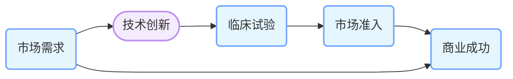

# 巴菲特 - 芒格的生物科技投资观：高风险高回报的平衡

> 关键词：巴菲特；芒格；生物科技投资；高风险高回报；投资平衡

> 摘要：本文深入探讨了巴菲特和芒格的生物科技投资观，旨在揭示他们如何在生物科技投资领域实现高风险与高回报的平衡。首先介绍了背景信息，包括目的、预期读者、文档结构和相关术语。接着阐述了生物科技投资的核心概念与联系，分析了核心算法原理和具体操作步骤。通过数学模型和公式进一步理解投资决策过程，并给出实际案例。同时探讨了生物科技投资的实际应用场景，推荐了学习、开发相关的工具和资源，最后总结了未来发展趋势与挑战，还包含常见问题解答和扩展阅读参考资料，以帮助读者全面理解巴菲特 - 芒格的生物科技投资理念。

## 1. 背景介绍 
### 1.1 目的和范围
本文章的主要目的是深入剖析巴菲特和芒格在生物科技投资领域的观点和策略，探讨他们如何在高风险的生物科技投资中实现高回报的平衡。研究范围将涵盖生物科技投资的基本概念、核心算法原理、实际应用案例以及未来发展趋势等方面。通过对巴菲特和芒格投资理念的研究，为投资者提供有价值的参考和指导，帮助他们更好地理解生物科技投资的特点和规律。

### 1.2 预期读者
本文的预期读者包括对投资领域感兴趣的个人投资者、专业投资机构的从业者、金融领域的研究人员以及对巴菲特和芒格投资理念有深入了解需求的人群。无论您是投资新手还是经验丰富的投资者，都可以从本文中获取关于生物科技投资的新见解和思路。

### 1.3 文档结构概述
本文将按照以下结构进行阐述：首先介绍生物科技投资的背景信息，包括目的、预期读者、文档结构和相关术语。接着详细讲解生物科技投资的核心概念与联系，通过文本示意图和 Mermaid 流程图进行直观展示。然后分析核心算法原理和具体操作步骤，并使用 Python 源代码进行详细阐述。之后通过数学模型和公式深入理解投资决策过程，并给出具体的举例说明。再通过实际案例展示生物科技投资的实际应用，包括开发环境搭建、源代码实现和代码解读。接着探讨生物科技投资的实际应用场景，推荐相关的学习、开发工具和资源。最后总结未来发展趋势与挑战，提供常见问题解答和扩展阅读参考资料。

### 1.4 术语表
#### 1.4.1 核心术语定义
- **生物科技投资**：指投资者将资金投入到生物科技领域的企业或项目中，以获取经济回报的行为。生物科技领域包括生物技术研发、制药、医疗器械等多个方面。
- **高风险高回报**：在投资领域，高风险通常意味着投资项目面临较大的不确定性和可能的损失，但同时也可能带来较高的收益。生物科技投资由于其技术研发的不确定性和市场竞争的激烈性，往往具有高风险高回报的特点。
- **投资平衡**：指投资者在追求高回报的同时，通过合理的资产配置和风险控制，使投资组合的风险和回报达到一种相对稳定的状态。在生物科技投资中，实现投资平衡意味着在高风险的项目中寻找潜在的高回报机会，同时降低整体投资组合的风险。

#### 1.4.2 相关概念解释
- **生物技术研发**：是指利用生物体（包括微生物、动物细胞、植物细胞）或其组成部分（细胞器和酶）来生产有用物质，或为人类提供某种服务的技术。生物技术研发是生物科技领域的核心，包括基因工程、细胞工程、发酵工程等多个方面。
- **临床试验**：是指任何在人体（病人或健康志愿者）进行药物的系统性研究，以证实或揭示试验药物的作用、不良反应及/或试验药物的吸收、分布、代谢和排泄，目的是确定试验药物的疗效与安全性。临床试验是生物科技企业研发新药的重要环节，分为多个阶段，每个阶段都有不同的目的和要求。
- **市场准入**：是指企业的产品或服务进入目标市场所需要满足的条件和程序。在生物科技领域，市场准入包括药品注册、医疗器械认证等多个方面，是生物科技企业将产品推向市场的关键环节。

#### 1.4.3 缩略词列表
- **FDA**：美国食品药品监督管理局（Food and Drug Administration），是国际医疗审核权威机构，负责对食品、药品、医疗器械等产品的安全性和有效性进行监管。
- **IPO**：首次公开募股（Initial Public Offering），是指一家企业第一次将它的股份向公众出售。生物科技企业通过 IPO 可以筹集资金，扩大业务规模。
- **R & D**：研究与开发（Research and Development），指在科学技术领域，为增加知识总量（包括人类文化和社会知识的总量），以及运用这些知识去创造新的应用进行的系统的创造性的活动，包括基础研究、应用研究、试验发展三类活动。

## 2. 核心概念与联系 
### 生物科技投资的核心概念
生物科技投资主要围绕着生物科技企业的研发、生产和销售活动展开。生物科技企业通常致力于开发新的药物、医疗器械或生物技术服务，以满足医疗市场的需求。投资者通过购买生物科技企业的股票、债券或参与风险投资等方式，为企业提供资金支持，期望在企业成功实现产品商业化后获得高额回报。

生物科技投资的核心概念包括以下几个方面：
- **技术创新**：生物科技领域的技术创新是推动企业发展的核心动力。新的基因编辑技术、药物研发平台等不断涌现，为生物科技企业带来了新的机遇和挑战。投资者需要关注企业的技术创新能力，评估其研发项目的前景和潜力。
- **临床试验**：临床试验是生物科技企业研发新药的关键环节。通过临床试验，企业可以验证药物的安全性和有效性，为产品的上市提供依据。投资者需要了解临床试验的进展情况，包括试验阶段、样本数量、试验结果等，以评估企业的研发风险和成功概率。
- **市场需求**：生物科技产品的市场需求是决定企业商业成功的重要因素。投资者需要分析市场需求的规模、增长趋势和竞争格局，评估企业产品的市场潜力和竞争力。

### 核心概念之间的联系
这些核心概念之间存在着密切的联系。技术创新是推动生物科技企业发展的基础，它为临床试验提供了新的药物和技术手段。临床试验的成功与否直接影响着企业产品的市场准入和商业价值。而市场需求则是企业研发和生产的导向，决定了企业的投资价值和发展前景。

以下是一个简单的 Mermaid 流程图，展示了生物科技投资核心概念之间的联系：

从流程图中可以看出，技术创新推动了临床试验的进行，临床试验的成功是产品获得市场准入的前提，而市场准入则是实现商业成功的关键。同时，市场需求也会引导企业进行技术创新和产品研发，以满足市场的需求。

## 3. 核心算法原理 & 具体操作步骤 
### 核心算法原理
在生物科技投资中，核心算法原理主要涉及到风险评估和回报预测。投资者需要通过对生物科技企业的各种信息进行分析和评估，来预测企业的未来发展前景和投资回报。以下是一个简单的风险评估和回报预测的算法原理：

#### 风险评估
风险评估主要考虑以下几个因素：
- **技术风险**：评估企业的技术创新能力和研发项目的可行性。可以通过分析企业的研发团队、专利技术、研发投入等因素来评估技术风险。
- **临床试验风险**：评估临床试验的进展情况和成功概率。可以通过分析临床试验的阶段、样本数量、试验结果等因素来评估临床试验风险。
- **市场风险**：评估市场需求的规模、增长趋势和竞争格局。可以通过分析市场调研报告、行业数据等因素来评估市场风险。

风险评估的公式可以表示为：
$R = w_1R_t + w_2R_c + w_3R_m$
其中，$R$ 表示总风险，$R_t$ 表示技术风险，$R_c$ 表示临床试验风险，$R_m$ 表示市场风险，$w_1$、$w_2$、$w_3$ 分别表示技术风险、临床试验风险和市场风险的权重。

#### 回报预测
回报预测主要考虑以下几个因素：
- **产品销售收入**：预测企业产品在市场上的销售情况和收入规模。可以通过分析市场需求、产品定价、竞争格局等因素来预测产品销售收入。
- **成本费用**：预测企业的研发成本、生产成本、销售成本等费用。可以通过分析企业的财务报表、预算计划等因素来预测成本费用。
- **投资回报率**：根据产品销售收入和成本费用，计算投资回报率。投资回报率的公式可以表示为：
$ROI = \frac{I - C}{C}$
其中，$ROI$ 表示投资回报率，$I$ 表示投资收益，$C$ 表示投资成本。

### 具体操作步骤
以下是使用 Python 实现风险评估和回报预测的具体操作步骤：

```python
# 定义风险评估函数
def risk_assessment(tech_risk, clinical_risk, market_risk, weights):
    """
    计算总风险
    :param tech_risk: 技术风险
    :param clinical_risk: 临床试验风险
    :param market_risk: 市场风险
    :param weights: 风险权重列表，依次为技术风险、临床试验风险、市场风险的权重
    :return: 总风险
    """
    total_risk = weights[0] * tech_risk + weights[1] * clinical_risk + weights[2] * market_risk
    return total_risk

# 定义回报预测函数
def return_prediction(sales_revenue, cost, investment):
    """
    计算投资回报率
    :param sales_revenue: 产品销售收入
    :param cost: 成本费用
    :param investment: 投资成本
    :return: 投资回报率
    """
    investment_income = sales_revenue - cost
    roi = (investment_income - investment) / investment
    return roi

# 示例数据
tech_risk = 0.3
clinical_risk = 0.4
market_risk = 0.3
weights = [0.3, 0.4, 0.3]
sales_revenue = 1000000
cost = 500000
investment = 200000

# 计算总风险
total_risk = risk_assessment(tech_risk, clinical_risk, market_risk, weights)
print(f"总风险: {total_risk}")

# 计算投资回报率
roi = return_prediction(sales_revenue, cost, investment)
print(f"投资回报率: {roi}")
```

### 代码解释
- `risk_assessment` 函数：该函数接受技术风险、临床试验风险、市场风险和风险权重列表作为输入，根据风险评估公式计算总风险。
- `return_prediction` 函数：该函数接受产品销售收入、成本费用和投资成本作为输入，根据投资回报率公式计算投资回报率。
- 示例数据：定义了技术风险、临床试验风险、市场风险、风险权重列表、产品销售收入、成本费用和投资成本等示例数据。
- 计算总风险和投资回报率：调用 `risk_assessment` 函数和 `return_prediction` 函数，计算总风险和投资回报率，并将结果打印输出。

通过以上步骤，投资者可以使用 Python 实现生物科技投资的风险评估和回报预测，为投资决策提供参考。

## 4. 数学模型和公式 & 详细讲解 & 举例说明 
### 风险评估数学模型和公式
在前面的章节中，我们已经介绍了风险评估的公式：
$$R = w_1R_t + w_2R_c + w_3R_m$$
其中，$R$ 表示总风险，$R_t$ 表示技术风险，$R_c$ 表示临床试验风险，$R_m$ 表示市场风险，$w_1$、$w_2$、$w_3$ 分别表示技术风险、临床试验风险和市场风险的权重。

#### 详细讲解
- **技术风险 $R_t$**：技术风险主要考虑企业的技术创新能力和研发项目的可行性。技术风险的评估可以通过分析企业的研发团队、专利技术、研发投入等因素来进行。例如，一个企业的研发团队实力较弱，专利技术较少，研发投入不足，那么该企业的技术风险就相对较高。
- **临床试验风险 $R_c$**：临床试验风险主要考虑临床试验的进展情况和成功概率。临床试验风险的评估可以通过分析临床试验的阶段、样本数量、试验结果等因素来进行。例如，一个企业的临床试验处于早期阶段，样本数量较少，试验结果不稳定，那么该企业的临床试验风险就相对较高。
- **市场风险 $R_m$**：市场风险主要考虑市场需求的规模、增长趋势和竞争格局。市场风险的评估可以通过分析市场调研报告、行业数据等因素来进行。例如，一个市场需求规模较小，增长趋势缓慢，竞争格局激烈的行业，企业面临的市场风险就相对较高。
- **权重 $w_1$、$w_2$、$w_3$**：权重表示各个风险因素在总风险中的重要程度。权重的确定需要根据投资者的风险偏好和投资策略来进行。例如，一个风险偏好较高的投资者可能会给予技术风险较高的权重，而一个风险偏好较低的投资者可能会给予市场风险较高的权重。

#### 举例说明
假设一个生物科技企业的技术风险 $R_t = 0.4$，临床试验风险 $R_c = 0.3$，市场风险 $R_m = 0.3$，投资者根据自己的风险偏好和投资策略，确定技术风险的权重 $w_1 = 0.3$，临床试验风险的权重 $w_2 = 0.4$，市场风险的权重 $w_3 = 0.3$。则该企业的总风险为：
$$R = 0.3\times0.4 + 0.4\times0.3 + 0.3\times0.3 = 0.33$$

### 回报预测数学模型和公式
在前面的章节中，我们已经介绍了回报预测的公式：
$$ROI = \frac{I - C}{C}$$
其中，$ROI$ 表示投资回报率，$I$ 表示投资收益，$C$ 表示投资成本。

#### 详细讲解
- **投资收益 $I$**：投资收益主要考虑企业产品的销售收入和成本费用。投资收益的计算可以通过预测企业产品在市场上的销售情况和收入规模，以及预测企业的研发成本、生产成本、销售成本等费用来进行。例如，一个企业的产品销售收入为 $1000$ 万元，成本费用为 $500$ 万元，则该企业的投资收益为 $1000 - 500 = 500$ 万元。
- **投资成本 $C$**：投资成本主要考虑投资者投入的资金和其他资源。投资成本的计算可以通过分析投资者的投资金额、投资期限、投资方式等因素来进行。例如，一个投资者投入 $200$ 万元资金购买生物科技企业的股票，则该投资者的投资成本为 $200$ 万元。

#### 举例说明
假设一个投资者投入 $200$ 万元资金购买生物科技企业的股票，该企业的产品销售收入为 $1000$ 万元，成本费用为 $500$ 万元。则该投资者的投资收益为 $1000 - 500 = 500$ 万元，投资回报率为：
$$ROI = \frac{500 - 200}{200} = 1.5$$
即投资回报率为 $150\%$。

通过以上数学模型和公式，投资者可以更加准确地评估生物科技投资的风险和回报，为投资决策提供科学依据。

## 5. 项目实战：代码实际案例和详细解释说明 
### 5.1  开发环境搭建
在进行生物科技投资项目实战之前，需要搭建相应的开发环境。以下是搭建开发环境的详细步骤：

#### 安装 Python
Python 是一种广泛使用的编程语言，在数据分析、机器学习等领域有着广泛的应用。可以从 Python 官方网站（https://www.python.org/downloads/）下载适合自己操作系统的 Python 安装包，并按照安装向导进行安装。

#### 安装必要的库
在生物科技投资项目中，需要使用一些 Python 库来进行数据处理、分析和可视化。以下是一些常用的库及其安装方法：
- **NumPy**：用于科学计算和数组操作。可以使用以下命令进行安装：
```sh
pip install numpy
```
- **Pandas**：用于数据处理和分析。可以使用以下命令进行安装：
```sh
pip install pandas
```
- **Matplotlib**：用于数据可视化。可以使用以下命令进行安装：
```sh
pip install matplotlib
```

#### 安装开发工具
可以选择使用 PyCharm、Jupyter Notebook 等开发工具来进行项目开发。PyCharm 是一款专业的 Python 集成开发环境，提供了丰富的功能和工具。Jupyter Notebook 是一个交互式的开发环境，适合进行数据分析和可视化。

### 5.2  源代码详细实现和代码解读
以下是一个简单的生物科技投资项目实战的源代码示例：

```python
import numpy as np
import pandas as pd
import matplotlib.pyplot as plt

# 模拟生物科技企业的数据
data = {
    '企业名称': ['企业 A', '企业 B', '企业 C', '企业 D'],
    '技术风险': [0.3, 0.4, 0.2, 0.5],
    '临床试验风险': [0.4, 0.3, 0.5, 0.2],
    '市场风险': [0.3, 0.3, 0.3, 0.3],
    '产品销售收入': [1000000, 1500000, 800000, 1200000],
    '成本费用': [500000, 700000, 400000, 600000],
    '投资成本': [200000, 300000, 150000, 250000]
}

# 创建 DataFrame
df = pd.DataFrame(data)

# 定义风险评估函数
def risk_assessment(tech_risk, clinical_risk, market_risk, weights):
    """
    计算总风险
    :param tech_risk: 技术风险
    :param clinical_risk: 临床试验风险
    :param market_risk: 市场风险
    :param weights: 风险权重列表，依次为技术风险、临床试验风险、市场风险的权重
    :return: 总风险
    """
    total_risk = weights[0] * tech_risk + weights[1] * clinical_risk + weights[2] * market_risk
    return total_risk

# 定义回报预测函数
def return_prediction(sales_revenue, cost, investment):
    """
    计算投资回报率
    :param sales_revenue: 产品销售收入
    :param cost: 成本费用
    :param investment: 投资成本
    :return: 投资回报率
    """
    investment_income = sales_revenue - cost
    roi = (investment_income - investment) / investment
    return roi

# 定义风险权重
weights = [0.3, 0.4, 0.3]

# 计算总风险和投资回报率
df['总风险'] = df.apply(lambda row: risk_assessment(row['技术风险'], row['临床试验风险'], row['市场风险'], weights), axis=1)
df['投资回报率'] = df.apply(lambda row: return_prediction(row['产品销售收入'], row['成本费用'], row['投资成本']), axis=1)

# 输出结果
print(df)

# 可视化结果
plt.figure(figsize=(10, 6))
plt.bar(df['企业名称'], df['总风险'], label='总风险')
plt.bar(df['企业名称'], df['投资回报率'], bottom=df['总风险'], label='投资回报率')
plt.xlabel('企业名称')
plt.ylabel('风险和回报率')
plt.title('生物科技企业风险和回报率对比')
plt.legend()
plt.show()
```

### 5.3  代码解读与分析
#### 数据模拟
使用字典 `data` 模拟了四个生物科技企业的数据，包括企业名称、技术风险、临床试验风险、市场风险、产品销售收入、成本费用和投资成本。然后使用 `pandas` 库的 `DataFrame` 函数将字典数据转换为 DataFrame 对象。

#### 风险评估和回报预测函数
定义了 `risk_assessment` 函数和 `return_prediction` 函数，分别用于计算总风险和投资回报率。这两个函数的实现与前面章节中介绍的算法原理一致。

#### 计算总风险和投资回报率
使用 `DataFrame` 的 `apply` 方法，将 `risk_assessment` 函数和 `return_prediction` 函数应用到每一行数据上，计算每个企业的总风险和投资回报率，并将结果添加到 DataFrame 中。

#### 输出结果
使用 `print` 函数输出包含总风险和投资回报率的 DataFrame。

#### 可视化结果
使用 `matplotlib` 库绘制柱状图，将每个企业的总风险和投资回报率进行可视化展示。通过柱状图可以直观地比较不同企业之间的风险和回报率差异。

通过以上代码实际案例，投资者可以更加直观地了解生物科技投资的风险评估和回报预测过程，为投资决策提供参考。

## 6. 实际应用场景 
### 个人投资者
对于个人投资者来说，生物科技投资可以作为资产配置的一部分，以追求高回报。个人投资者可以通过购买生物科技企业的股票、基金等方式参与生物科技投资。在进行投资决策时，个人投资者可以使用本文介绍的风险评估和回报预测方法，对不同的生物科技企业进行评估和比较，选择具有潜力的投资标的。

例如，个人投资者可以关注一些处于研发阶段的生物科技企业，这些企业可能具有较高的技术创新能力和研发潜力，但同时也面临着较高的风险。通过对企业的技术风险、临床试验风险和市场风险进行评估，个人投资者可以判断企业的研发项目是否具有成功的可能性，并根据自己的风险偏好和投资策略决定是否进行投资。

### 专业投资机构
专业投资机构如风险投资公司、私募股权投资基金等在生物科技投资领域扮演着重要的角色。专业投资机构通常具有较强的资金实力和专业的投资团队，能够对生物科技企业进行深入的调研和分析。

专业投资机构在进行生物科技投资时，除了使用风险评估和回报预测方法外，还会考虑企业的管理团队、商业模式、市场竞争力等因素。例如，风险投资公司可能会在生物科技企业的早期阶段进行投资，帮助企业进行研发和市场推广。私募股权投资基金可能会在企业发展到一定阶段后进行投资，通过参与企业的管理和运营，推动企业的发展和上市。

### 制药企业
制药企业在生物科技投资领域也有广泛的应用。制药企业可以通过投资生物科技企业，获取新的技术和研发项目，以增强自身的研发实力和市场竞争力。

例如，制药企业可以与生物科技企业进行合作研发，共同开发新的药物。制药企业可以提供资金和市场渠道，生物科技企业可以提供技术和研发团队。通过合作研发，制药企业可以降低研发成本和风险，提高研发效率和成功率。

### 政府和科研机构
政府和科研机构在生物科技投资领域也发挥着重要的作用。政府可以通过制定相关政策和提供资金支持，鼓励生物科技企业的发展。科研机构可以开展生物科技领域的基础研究和应用研究，为生物科技企业提供技术支持和创新动力。

例如，政府可以设立生物科技产业基金，为生物科技企业提供融资支持。科研机构可以与生物科技企业合作，开展产学研项目，促进科技成果的转化和应用。

## 7. 工具和资源推荐
### 7.1 学习资源推荐
#### 7.1.1 书籍推荐
- 《聪明的投资者》（The Intelligent Investor）：作者是本杰明·格雷厄姆（Benjamin Graham），这本书是价值投资领域的经典之作，介绍了投资的基本原则和方法，对巴菲特和芒格的投资理念产生了深远的影响。
- 《巴菲特致股东的信：投资者和公司高管教程》（Letters to Shareholders of Berkshire Hathaway）：作者是沃伦·巴菲特（Warren Buffett），这本书收录了巴菲特历年致股东的信，详细阐述了他的投资理念、策略和方法，是学习巴菲特投资思想的重要资料。
- 《穷查理宝典：查理·芒格的智慧箴言录》（Poor Charlie's Almanack: The Wit and Wisdom of Charles T. Munger）：作者是彼得·考夫曼（Peter D. Kaufman），这本书收录了查理·芒格的演讲、文章和访谈，介绍了他的多元思维模型、投资哲学和人生智慧。
- 《生物技术药物研究开发和质量控制》：本书全面介绍了生物技术药物的研究开发、生产工艺、质量控制等方面的知识，对于了解生物科技领域的专业知识有很大的帮助。

#### 7.1.2 在线课程
- Coursera 上的 “Investment Management Specialization”：该课程由哥伦比亚大学教授授课，介绍了投资管理的基本理论和方法，包括资产配置、风险管理、投资组合优化等内容。
- edX 上的 “Financial Markets”：该课程由耶鲁大学教授授课，介绍了金融市场的基本概念、运行机制和投资策略，对于了解金融市场和投资有很大的帮助。
- 中国大学 MOOC 上的 “生物制药工艺学”：该课程介绍了生物制药的基本原理、生产工艺和质量控制等方面的知识，对于了解生物科技领域的专业知识有很大的帮助。

#### 7.1.3 技术博客和网站
- Seeking Alpha：这是一个投资研究平台，提供了大量的投资分析文章和研究报告，包括生物科技投资领域的内容。
- BioSpace：这是一个生物科技行业的新闻和信息网站，提供了生物科技企业的最新动态、研发进展、市场趋势等方面的信息。
- 雪球：这是一个国内的投资社区，提供了股票、基金等投资产品的分析和讨论，也有很多关于生物科技投资的内容。

### 7.2 开发工具框架推荐
#### 7.2.1 IDE和编辑器
- PyCharm：这是一款专业的 Python 集成开发环境，提供了丰富的功能和工具，如代码编辑、调试、版本控制等，适合进行生物科技投资项目的开发。
- Jupyter Notebook：这是一个交互式的开发环境，适合进行数据分析和可视化。可以使用 Jupyter Notebook 进行生物科技投资数据的处理和分析。
- Visual Studio Code：这是一款轻量级的代码编辑器，支持多种编程语言和插件扩展。可以使用 Visual Studio Code 进行生物科技投资项目的开发和调试。

#### 7.2.2 调试和性能分析工具
- Py-Spy：这是一个 Python 性能分析工具，可以实时监测 Python 程序的运行状态和性能指标，帮助开发者找出程序中的性能瓶颈。
- PDB：这是 Python 自带的调试工具，可以在代码中设置断点，逐步执行代码，查看变量的值和程序的执行流程，帮助开发者调试程序。
- cProfile：这是 Python 自带的性能分析工具，可以统计 Python 程序中各个函数的调用次数、执行时间等信息，帮助开发者找出程序中的性能瓶颈。

#### 7.2.3 相关框架和库
- NumPy：这是一个用于科学计算和数组操作的 Python 库，提供了高效的多维数组对象和各种数学函数，适合进行生物科技投资数据的处理和分析。
- Pandas：这是一个用于数据处理和分析的 Python 库，提供了 DataFrame 和 Series 等数据结构，方便进行数据的读取、清洗、转换和分析。
- Matplotlib：这是一个用于数据可视化的 Python 库，提供了各种绘图函数和工具，适合进行生物科技投资数据的可视化展示。

### 7.3 相关论文著作推荐
#### 7.3.1 经典论文
- “The Capital Asset Pricing Model: Theory and Evidence”：这篇论文由 Eugene F. Fama 和 Kenneth R. French 发表，介绍了资本资产定价模型的理论和实证研究，对于理解投资风险和回报的关系有很大的帮助。
- “Efficient Capital Markets: A Review of Theory and Empirical Work”：这篇论文由 Eugene F. Fama 发表，介绍了有效市场假说的理论和实证研究，对于理解金融市场的运行机制和投资策略有很大的帮助。
- “The Value of Information in Biotech R & D”：这篇论文由 Thomas H. Keil 等人发表，探讨了生物科技研发中信息的价值和作用，对于理解生物科技投资的风险和回报有很大的帮助。

#### 7.3.2 最新研究成果
- 可以关注《Nature Biotechnology》、《Science Translational Medicine》等生物科技领域的顶级期刊，了解生物科技领域的最新研究成果和发展趋势。
- 可以关注《Journal of Financial Economics》、《Review of Financial Studies》等金融领域的顶级期刊，了解投资领域的最新研究成果和发展趋势。

#### 7.3.3 应用案例分析
- 可以关注一些知名的投资机构和投资者的案例分析，如巴菲特和芒格的投资案例、红杉资本的投资案例等，了解他们在生物科技投资领域的投资策略和方法。
- 可以关注一些生物科技企业的上市招股说明书和年报，了解企业的发展历程、研发项目、市场表现等信息，分析企业的投资价值和风险。

## 8. 总结：未来发展趋势与挑战
### 未来发展趋势
#### 技术创新驱动
生物科技领域的技术创新将继续推动行业的发展。基因编辑技术、细胞治疗技术、人工智能在生物科技领域的应用等将不断涌现，为生物科技企业带来新的机遇和挑战。投资者需要关注技术创新的发展趋势，寻找具有技术优势的生物科技企业进行投资。

#### 个性化医疗兴起
随着基因检测技术和生物信息学的发展，个性化医疗将成为未来生物科技领域的重要发展方向。个性化医疗可以根据患者的基因信息和生理特征，为患者提供更加精准的诊断和治疗方案。投资者可以关注个性化医疗领域的生物科技企业，如基因检测公司、生物制药企业等。

#### 国际化合作加强
生物科技领域的研发和生产需要大量的资金和技术支持，国际化合作将成为未来生物科技企业发展的重要趋势。生物科技企业可以通过与国际知名企业和科研机构的合作，获取先进的技术和研发资源，提高自身的研发实力和市场竞争力。投资者可以关注具有国际化合作背景的生物科技企业。

### 挑战
#### 技术研发风险
生物科技领域的技术研发具有较高的不确定性和风险。新药研发需要经过漫长的临床试验过程，成功率较低。投资者需要对生物科技企业的技术研发能力和研发项目进行深入的评估和分析，降低投资风险。

#### 政策法规风险
生物科技领域受到严格的政策法规监管，政策法规的变化可能会对生物科技企业的发展产生重大影响。例如，药品审批政策的变化、医保政策的调整等都可能会影响生物科技企业的产品销售和市场份额。投资者需要关注政策法规的变化，及时调整投资策略。

#### 市场竞争风险
生物科技领域的市场竞争日益激烈，企业需要不断创新和提高自身的竞争力才能在市场中立足。投资者需要关注生物科技企业的市场竞争力，包括产品质量、价格、品牌等方面，选择具有竞争优势的企业进行投资。

## 9. 附录：常见问题与解答
### 问题 1：生物科技投资的风险真的很高吗？
解答：生物科技投资确实具有较高的风险。生物科技企业的研发项目通常需要大量的资金和时间投入，而且研发过程中存在很多不确定性。新药研发需要经过多个阶段的临床试验，只有少数药物能够最终获得批准上市。此外，生物科技企业还面临着市场竞争、政策法规等方面的风险。因此，投资者在进行生物科技投资时需要充分认识到风险，并做好风险控制。

### 问题 2：如何评估生物科技企业的技术创新能力？
解答：评估生物科技企业的技术创新能力可以从以下几个方面入手：
- **研发团队**：了解企业的研发团队成员的背景和经验，包括科研人员的学历、专业领域、发表的论文等。
- **专利技术**：查看企业拥有的专利技术数量和质量，专利技术是企业技术创新的重要体现。
- **研发投入**：分析企业的研发投入情况，研发投入的多少反映了企业对技术创新的重视程度。
- **合作项目**：了解企业与其他科研机构、高校等的合作项目，合作项目可以为企业带来新的技术和研发资源。

### 问题 3：生物科技投资的回报周期一般有多长？
解答：生物科技投资的回报周期通常较长。新药研发从实验室研究到获得批准上市一般需要 10 - 15 年的时间，而且在这个过程中需要投入大量的资金。即使药物获得批准上市，还需要一定的时间来开拓市场，实现盈利。因此，生物科技投资的回报周期可能会达到 10 年以上。投资者需要有足够的耐心和长期投资的理念。

### 问题 4：个人投资者适合进行生物科技投资吗？
解答：个人投资者可以进行生物科技投资，但需要谨慎对待。生物科技投资具有较高的风险，需要投资者具备一定的专业知识和风险承受能力。个人投资者可以通过购买生物科技基金等方式间接参与生物科技投资，这样可以分散风险。同时，个人投资者在进行生物科技投资时，需要做好充分的研究和分析，了解企业的基本面和发展前景，避免盲目投资。

## 10. 扩展阅读 & 参考资料
### 扩展阅读
- 《创新者的窘境》（The Innovator's Dilemma）：作者是克莱顿·克里斯坦森（Clayton M. Christensen），这本书探讨了创新对企业发展的影响，对于理解生物科技领域的创新和发展有很大的帮助。
- 《黑天鹅：如何应对不可预知的未来》（The Black Swan: The Impact of the Highly Improbable）：作者是纳西姆·尼古拉斯·塔勒布（Nassim Nicholas Taleb），这本书介绍了黑天鹅事件的概念和影响，对于理解生物科技投资中的不确定性和风险有很大的帮助。

### 参考资料
- Warren Buffett's annual letters to shareholders: https://www.berkshirehathaway.com/letters/letters.html
- Charlie Munger's speeches and articles: https://fs.blog/charles-t-munger/
- BioSpace: https://www.biospace.com/
- Seeking Alpha: https://seekingalpha.com/

作者：AI天才研究院/AI Genius Institute & 禅与计算机程序设计艺术 /Zen And The Art of Computer Programming