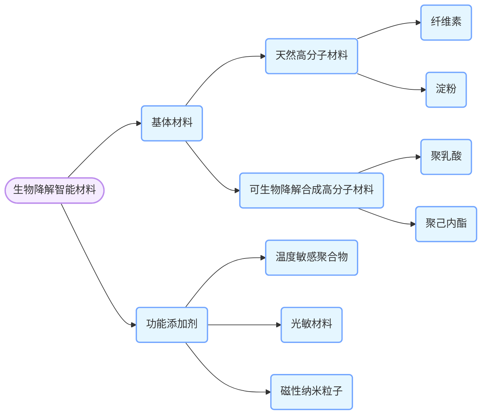

# 巴菲特 - 芒格的生物降解智能材料投资：可持续科技的新方向

> 关键词：巴菲特、芒格、生物降解智能材料、可持续科技、投资方向、材料科学、环保科技

> 摘要：本文聚焦于巴菲特和芒格对生物降解智能材料的投资行为，深入探讨这一投资背后所蕴含的可持续科技新方向。首先介绍生物降解智能材料的背景知识，包括其定义、发展现状和重要性；接着剖析核心概念与联系，阐述其工作原理和架构；然后讲解核心算法原理及具体操作步骤，并辅以数学模型和公式进行说明；通过项目实战展示代码案例及详细解读；探讨该材料的实际应用场景；推荐相关学习工具和资源；最后总结未来发展趋势与挑战，解答常见问题并提供扩展阅读与参考资料，旨在全面展现生物降解智能材料作为可持续科技新方向的巨大潜力和价值。

## 1. 背景介绍 
### 1.1 目的和范围
本文的目的在于深入研究巴菲特 - 芒格对生物降解智能材料的投资决策，全面分析这一投资背后的战略意义和可持续科技的发展趋势。范围涵盖生物降解智能材料的基本概念、技术原理、实际应用、市场前景等多个方面，旨在为读者提供一个全面且深入的视角，帮助其理解这一新兴领域的投资价值和发展潜力。

### 1.2 预期读者
预期读者包括对投资领域感兴趣的专业人士，如投资者、基金经理、分析师等；从事材料科学、环保科技、可持续发展等相关领域的科研人员、工程师；以及关注新兴科技发展趋势、对可持续发展理念有兴趣的普通读者。

### 1.3 文档结构概述
本文将按照以下结构展开：首先介绍生物降解智能材料的背景知识，包括目的、读者群体、文档结构和相关术语；接着阐述核心概念与联系，展示其原理和架构；然后讲解核心算法原理和具体操作步骤，并辅以数学模型和公式；通过项目实战展示代码案例和详细解释；探讨实际应用场景；推荐相关工具和资源；最后总结未来发展趋势与挑战，解答常见问题并提供扩展阅读与参考资料。

### 1.4 术语表
#### 1.4.1 核心术语定义
- **生物降解智能材料**：是一种能够在自然环境中通过生物作用逐渐分解为无害物质的智能材料。它具有感知外界环境变化并做出相应响应的能力，同时具备可降解性，对环境友好。
- **可持续科技**：指在满足当前社会需求的同时，不会对未来世代的资源和环境造成损害的科技。其核心目标是实现经济、社会和环境的可持续发展。
- **智能响应**：材料能够根据外界环境的变化，如温度、湿度、光照、酸碱度等，自动调整自身的物理或化学性质，以适应环境变化。

#### 1.4.2 相关概念解释
- **生物降解机制**：生物降解是指材料在微生物（如细菌、真菌等）的作用下，被分解为小分子物质的过程。这个过程通常涉及酶的催化作用，微生物通过分泌特定的酶来分解材料的化学键，使其逐渐降解。
- **智能材料的分类**：智能材料可以分为形状记忆材料、压电材料、光电材料、磁致伸缩材料等。这些材料都具有不同的智能响应特性，可应用于不同的领域。

#### 1.4.3 缩略词列表
- **SMA**：Shape Memory Alloy，形状记忆合金
- **PZT**：Lead Zirconate Titanate，锆钛酸铅（一种压电材料）

## 2. 核心概念与联系 
### 生物降解智能材料的原理
生物降解智能材料结合了生物降解性和智能响应特性。其生物降解性源于材料的化学组成和结构，通常采用天然高分子材料或可生物降解的合成高分子材料作为基体。这些材料在自然环境中能够被微生物识别和分解。

智能响应特性则是通过在材料中引入功能基团或添加功能性纳米粒子来实现的。例如，在材料中添加对温度敏感的聚合物，当温度变化时，聚合物的分子链会发生构象变化，从而导致材料的物理性质（如形状、颜色、导电性等）发生改变。

### 架构示意图

这个流程图展示了生物降解智能材料的基本架构，它由基体材料和功能添加剂组成。基体材料包括天然高分子材料和可生物降解合成高分子材料，而功能添加剂则有温度敏感聚合物、光敏材料、磁性纳米粒子等。这些不同的组成部分相互协作，赋予了材料生物降解性和智能响应特性。

## 3. 核心算法原理 & 具体操作步骤 
### 智能响应算法原理
以温度敏感的生物降解智能材料为例，其智能响应的核心算法基于聚合物的热力学性质。当温度变化时，聚合物的自由能发生变化，导致分子链的构象发生改变。我们可以使用 Flory - Huggins 理论来描述聚合物在不同温度下的状态。

以下是一个简单的 Python 代码示例，用于模拟温度敏感聚合物的体积分数随温度的变化：
```python
import numpy as np
import matplotlib.pyplot as plt

# 定义参数
chi = 0.5  # 相互作用参数
N = 100    # 聚合度
T_range = np.linspace(200, 400, 100)  # 温度范围

# 计算不同温度下的体积分数
phi_range = []
for T in T_range:
    # Flory - Huggins 自由能方程
    def free_energy(phi):
        return (np.log(phi) / N) + np.log(1 - phi) + chi * phi * (1 - phi)
    
    # 寻找自由能最小的体积分数
    from scipy.optimize import minimize
    result = minimize(free_energy, 0.5)
    phi_range.append(result.x[0])

# 绘制体积分数随温度的变化曲线
plt.plot(T_range, phi_range)
plt.xlabel('Temperature (K)')
plt.ylabel('Volume Fraction')
plt.title('Volume Fraction of Temperature - Sensitive Polymer vs Temperature')
plt.show()
```
### 具体操作步骤
1. **材料选择**：根据应用需求选择合适的基体材料和功能添加剂。例如，如果需要制备温度敏感的生物降解智能材料，可以选择聚乳酸作为基体材料，添加温度敏感的聚合物作为功能添加剂。
2. **材料制备**：将基体材料和功能添加剂按照一定的比例混合，采用溶液浇铸、熔融共混等方法制备成所需的材料形状。
3. **性能测试**：对制备好的材料进行性能测试，包括生物降解性能、智能响应性能等。例如，通过测量材料在不同温度下的尺寸变化来评估其温度响应性能。
4. **优化调整**：根据性能测试结果，对材料的组成和制备工艺进行优化调整，以提高材料的性能。

## 4. 数学模型和公式 & 详细讲解 & 举例说明 
### Flory - Huggins 理论
Flory - Huggins 理论是描述聚合物溶液热力学性质的经典理论。其自由能方程为：
$$\Delta G_{mix} = kT\left(n_1\ln\phi_1 + n_2\ln\phi_2 + \chi n_1\phi_2\right)$$
其中，$\Delta G_{mix}$ 是混合自由能，$k$ 是 Boltzmann 常数，$T$ 是温度，$n_1$ 和 $n_2$ 分别是溶剂和聚合物的摩尔数，$\phi_1$ 和 $\phi_2$ 分别是溶剂和聚合物的体积分数，$\chi$ 是相互作用参数。

### 详细讲解
这个公式描述了聚合物溶液在混合过程中的自由能变化。其中，$n_1\ln\phi_1 + n_2\ln\phi_2$ 项表示混合过程中的熵变，而 $\chi n_1\phi_2$ 项表示混合过程中的焓变。相互作用参数 $\chi$ 反映了溶剂和聚合物分子之间的相互作用强度。

### 举例说明
假设我们有一个聚合物溶液，其中溶剂的摩尔数 $n_1 = 1$，聚合物的摩尔数 $n_2 = 0.1$，相互作用参数 $\chi = 0.5$，温度 $T = 300$ K。我们可以计算不同体积分数下的混合自由能。

```python
import numpy as np

k = 1.38e-23  # Boltzmann 常数
n1 = 1
n2 = 0.1
chi = 0.5
T = 300

phi2_range = np.linspace(0.1, 0.9, 100)
free_energy_range = []

for phi2 in phi2_range:
    phi1 = 1 - phi2
    free_energy = k * T * (n1 * np.log(phi1) + n2 * np.log(phi2) + chi * n1 * phi2)
    free_energy_range.append(free_energy)

import matplotlib.pyplot as plt
plt.plot(phi2_range, free_energy_range)
plt.xlabel('Volume Fraction of Polymer')
plt.ylabel('Mixing Free Energy')
plt.title('Mixing Free Energy vs Volume Fraction of Polymer')
plt.show()
```
通过这个例子，我们可以看到混合自由能随聚合物体积分数的变化情况。在某些体积分数下，混合自由能达到最小值，此时溶液处于稳定状态。

## 5. 项目实战：代码实际案例和详细解释说明 
### 5.1  开发环境搭建
- **硬件环境**：一台普通的个人计算机，建议配备 Intel Core i5 及以上处理器，8GB 及以上内存。
- **软件环境**：安装 Python 3.7 及以上版本，推荐使用 Anaconda 进行 Python 环境的管理。安装相关的 Python 库，如 `numpy`、`matplotlib`、`scipy` 等，可以使用以下命令进行安装：
```sh
pip install numpy matplotlib scipy
```

### 5.2  源代码详细实现和代码解读
以下是一个完整的 Python 代码示例，用于模拟生物降解智能材料在温度和湿度共同作用下的智能响应：
```python
import numpy as np
import matplotlib.pyplot as plt
from scipy.optimize import minimize

# 定义参数
chi_T = 0.5  # 温度相关的相互作用参数
chi_H = 0.3  # 湿度相关的相互作用参数
N = 100      # 聚合度
T_range = np.linspace(200, 400, 100)  # 温度范围
H_range = np.linspace(0.1, 0.9, 100)  # 湿度范围

# 计算不同温度和湿度下的体积分数
phi_matrix = np.zeros((len(T_range), len(H_range)))
for i, T in enumerate(T_range):
    for j, H in enumerate(H_range):
        # 综合自由能方程，考虑温度和湿度的影响
        def free_energy(phi):
            return (np.log(phi) / N) + np.log(1 - phi) + chi_T * phi * (1 - phi) + chi_H * H * phi * (1 - phi)
        
        # 寻找自由能最小的体积分数
        result = minimize(free_energy, 0.5)
        phi_matrix[i, j] = result.x[0]

# 绘制体积分数随温度和湿度的变化曲面图
from mpl_toolkits.mplot3d import Axes3D
fig = plt.figure()
ax = fig.add_subplot(111, projection='3d')
T_grid, H_grid = np.meshgrid(T_range, H_range)
ax.plot_surface(T_grid, H_grid, phi_matrix.T, cmap='viridis')
ax.set_xlabel('Temperature (K)')
ax.set_ylabel('Humidity')
ax.set_zlabel('Volume Fraction')
plt.title('Volume Fraction of Biodegradable Smart Material vs Temperature and Humidity')
plt.show()
```
### 5.3  代码解读与分析
1. **参数定义**：定义了温度相关的相互作用参数 `chi_T`、湿度相关的相互作用参数 `chi_H`、聚合度 `N`，以及温度范围 `T_range` 和湿度范围 `H_range`。
2. **自由能方程**：在 `free_energy` 函数中，综合考虑了温度和湿度的影响，构建了一个新的自由能方程。
3. **优化求解**：使用 `scipy.optimize.minimize` 函数寻找自由能最小的体积分数。
4. **绘制曲面图**：使用 `matplotlib` 的 3D 绘图功能，绘制体积分数随温度和湿度的变化曲面图，直观地展示了生物降解智能材料在不同温度和湿度条件下的智能响应特性。

## 6. 实际应用场景 
### 包装领域
生物降解智能材料在包装领域具有广阔的应用前景。传统的塑料包装材料难以降解，对环境造成了严重的污染。而生物降解智能材料可以在完成包装任务后，在自然环境中逐渐分解，减少对环境的负担。同时，其智能响应特性可以用于监测包装内物品的状态，如温度、湿度等，确保物品的质量和安全。例如，在食品包装中，可以使用温度敏感的生物降解智能材料，当食品温度超过安全范围时，材料的颜色会发生变化，提醒消费者食品可能已经变质。

### 医疗领域
在医疗领域，生物降解智能材料可以用于制备可降解的医疗器械和药物载体。例如，可降解的缝合线可以在伤口愈合后自动降解，无需拆线，减少了患者的痛苦和感染的风险。智能药物载体可以根据人体内部环境的变化，如酸碱度、温度等，自动释放药物，提高药物的疗效和安全性。

### 农业领域
在农业领域，生物降解智能材料可以用于制备农膜和肥料载体。传统的农膜难以降解，会残留在土壤中，影响土壤的透气性和水分渗透。而生物降解农膜可以在使用后自然分解，不会对土壤造成污染。智能肥料载体可以根据土壤的养分状况和作物的生长需求，自动释放肥料，提高肥料的利用率，减少环境污染。

## 7. 工具和资源推荐
### 7.1 学习资源推荐
#### 7.1.1 书籍推荐
- 《智能材料与结构》：全面介绍了智能材料的基本概念、原理、制备方法和应用领域，是学习智能材料的经典教材。
- 《生物降解高分子材料》：详细阐述了生物降解高分子材料的合成、性能、降解机制和应用，对于深入了解生物降解智能材料的基体材料具有重要的参考价值。

#### 7.1.2 在线课程
- Coursera 上的 “智能材料与系统” 课程：由知名高校的教授授课，讲解了智能材料的前沿知识和研究进展。
- edX 上的 “生物材料科学与工程” 课程：涵盖了生物材料的基本原理、制备技术和应用，对于理解生物降解智能材料在医疗领域的应用有很大帮助。

#### 7.1.3 技术博客和网站
- 材料人网：提供了丰富的材料科学领域的资讯、技术文章和研究成果，对于关注生物降解智能材料的最新动态非常有帮助。
- 科学网：汇聚了众多科研人员的博客和研究论文，是获取生物降解智能材料相关学术信息的重要渠道。

### 7.2 开发工具框架推荐
#### 7.2.1 IDE和编辑器
- PyCharm：一款专业的 Python 集成开发环境，具有强大的代码编辑、调试和分析功能，适合开发生物降解智能材料相关的 Python 代码。
- Jupyter Notebook：一种交互式的编程环境，支持代码、文本、图像等多种形式的展示，非常适合进行数据探索和模型验证。

#### 7.2.2 调试和性能分析工具
- `pdb`：Python 内置的调试工具，可以帮助开发者定位代码中的错误和问题。
- `cProfile`：Python 标准库中的性能分析工具，可以分析代码的运行时间和资源消耗情况，帮助优化代码性能。

#### 7.2.3 相关框架和库
- `numpy`：用于科学计算的基础库，提供了高效的数组操作和数学函数。
- `matplotlib`：用于数据可视化的库，可以绘制各种类型的图表，直观地展示生物降解智能材料的性能数据。
- `scipy`：提供了丰富的科学计算和优化算法，可用于求解生物降解智能材料相关的数学模型。

### 7.3 相关论文著作推荐
#### 7.3.1 经典论文
- “Flory - Huggins Theory: A Review”：对 Flory - Huggins 理论进行了全面的回顾和总结，对于理解聚合物溶液的热力学性质具有重要的参考价值。
- “Biodegradable Polymers: Principles and Applications”：系统地介绍了生物降解聚合物的基本原理、制备方法和应用领域，是生物降解智能材料领域的经典文献。

#### 7.3.2 最新研究成果
- 关注《Nature Materials》、《Advanced Materials》等顶级学术期刊上发表的关于生物降解智能材料的最新研究论文，了解该领域的前沿动态和研究热点。

#### 7.3.3 应用案例分析
- 参考相关的专利文献和企业报告，了解生物降解智能材料在实际应用中的案例和经验，为项目开发和应用提供参考。

## 8. 总结：未来发展趋势与挑战
### 未来发展趋势
- **多功能化**：未来的生物降解智能材料将朝着多功能化的方向发展，不仅具备生物降解性和智能响应特性，还可能集成其他功能，如抗菌、自修复等，以满足不同领域的需求。
- **智能化程度提高**：随着传感器技术和人工智能的发展，生物降解智能材料的智能化程度将不断提高。材料可以实时感知和分析环境信息，并做出更加精准和复杂的响应。
- **大规模应用**：随着技术的不断进步和成本的降低，生物降解智能材料将逐渐实现大规模应用。在包装、医疗、农业等领域，生物降解智能材料有望取代传统材料，成为主流选择。

### 挑战
- **性能优化**：目前生物降解智能材料的性能还存在一些不足之处，如智能响应的灵敏度、生物降解速度的可控性等。需要进一步研究和开发新的材料体系和制备工艺，以提高材料的性能。
- **成本控制**：生物降解智能材料的制备成本相对较高，限制了其大规模应用。需要通过技术创新和产业规模化，降低材料的制备成本，提高其市场竞争力。
- **标准和法规**：目前生物降解智能材料的相关标准和法规还不完善，需要建立统一的标准和规范，确保材料的质量和安全性，促进产业的健康发展。

## 9. 附录：常见问题与解答
### 问题 1：生物降解智能材料的降解时间可以控制吗？
解答：可以。通过选择合适的基体材料、调整材料的组成和结构，以及添加特定的添加剂等方法，可以在一定程度上控制生物降解智能材料的降解时间。例如，选择不同分子量的聚合物作为基体材料，其降解速度会有所不同。

### 问题 2：生物降解智能材料在不同环境下的智能响应性能稳定吗？
解答：生物降解智能材料的智能响应性能在一定程度上会受到环境因素的影响。例如，温度、湿度、光照等环境因素可能会导致材料的性能发生变化。但是，通过优化材料的设计和制备工艺，可以提高材料在不同环境下的稳定性和可靠性。

### 问题 3：生物降解智能材料的制备工艺复杂吗？
解答：生物降解智能材料的制备工艺相对复杂，需要综合考虑材料的生物降解性、智能响应特性和加工性能等多个因素。但是，随着技术的不断进步，制备工艺也在不断简化和优化，一些新的制备方法和技术正在不断涌现。

## 10. 扩展阅读 & 参考资料
- 相关学术期刊：《Journal of Materials Chemistry》、《Polymer》、《Biomacromolecules》等。
- 行业报告：市场研究机构发布的关于生物降解智能材料的市场调研报告，了解市场需求和发展趋势。
- 企业官网：关注从事生物降解智能材料研发和生产的企业官网，获取最新的产品信息和技术动态。

作者：AI天才研究院/AI Genius Institute & 禅与计算机程序设计艺术 /Zen And The Art of Computer Programming