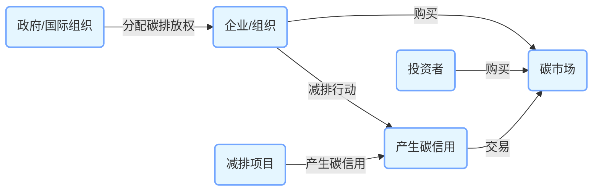

# 巴菲特 - 芒格的碳信用投资：环保与经济效益的结合

> 关键词：巴菲特；芒格；碳信用投资；环保；经济效益；碳市场

> 摘要：本文聚焦于巴菲特和芒格的碳信用投资策略，深入探讨了碳信用投资如何实现环保与经济效益的结合。首先介绍了相关背景知识，包括目的范围、预期读者等。接着阐述了碳信用的核心概念及其联系，分析了碳信用投资的核心算法原理和具体操作步骤，并给出了相应的数学模型和公式。通过实际案例展示了碳信用投资在项目中的应用，探讨了其实际应用场景。同时推荐了相关的学习资源、开发工具框架和论文著作。最后总结了碳信用投资的未来发展趋势与挑战，并提供了常见问题解答和扩展阅读参考资料。

## 1. 背景介绍 
### 1.1 目的和范围
本文旨在深入剖析巴菲特 - 芒格的碳信用投资模式，全面探讨碳信用投资如何达成环保与经济效益的有机统一。具体范围涵盖碳信用的基本概念、投资算法原理、数学模型、实际应用案例等多个方面，通过对这些内容的详细分析，为投资者、环保从业者以及对碳市场感兴趣的人士提供全面且深入的参考。

### 1.2 预期读者
预期读者包括金融投资者，他们希望了解新的投资领域和策略以实现资产增值；环保行业从业者，期望借助金融手段推动环保事业发展；政策制定者，需要从投资角度思考如何更好地引导碳减排工作；以及对可持续发展和碳市场有兴趣的研究人员和学生。

### 1.3 文档结构概述
本文首先介绍相关背景知识，为读者建立基础认知。接着阐述碳信用的核心概念及其内在联系，让读者理解碳信用的本质。然后详细讲解碳信用投资的核心算法原理和具体操作步骤，同时给出相应的数学模型和公式，进行理论层面的深入分析。通过实际案例展示碳信用投资在项目中的具体应用和效果。探讨碳信用投资的实际应用场景，展现其广泛的应用前景。推荐相关的学习资源、开发工具框架和论文著作，为读者提供进一步学习和研究的方向。最后总结碳信用投资的未来发展趋势与挑战，并提供常见问题解答和扩展阅读参考资料，使读者对整个主题有全面且系统的了解。

### 1.4 术语表
#### 1.4.1 核心术语定义
- **碳信用（Carbon Credit）**：是一种可交易的许可证或证书，代表着特定数量的温室气体减排量。一个单位的碳信用通常相当于减少排放一吨二氧化碳当量（tCO₂e）。
- **碳市场（Carbon Market）**：是一个基于市场机制的交易平台，允许碳排放权和碳信用进行买卖。通过市场机制，促使企业和组织采取措施减少碳排放。
- **碳排放权（Emission Allowance）**：是政府或相关机构分配给企业或组织的在一定时期内允许排放的温室气体数量。
- **碳抵消（Carbon Offset）**：指通过投资于减排项目，如可再生能源项目、森林保护项目等，来抵消自身的碳排放。

#### 1.4.2 相关概念解释
- **碳中和（Carbon Neutrality）**：是指企业、团体或个人测算在一定时间内直接或间接产生的温室气体排放总量，然后通过植树造林、节能减排等形式，以抵消自身产生的二氧化碳排放量，实现二氧化碳“零排放”。
- **碳足迹（Carbon Footprint）**：指企业机构、活动、产品或个人通过交通运输、食品生产和消费以及各类生产过程等引起的温室气体排放的集合。

#### 1.4.3 缩略词列表
- **tCO₂e**：吨二氧化碳当量（Tonnes of Carbon Dioxide Equivalent）
- **CDM**：清洁发展机制（Clean Development Mechanism）
- **VER**：自愿减排量（Voluntary Emission Reduction）

## 2. 核心概念与联系 
### 核心概念原理
碳信用的核心原理基于全球应对气候变化的需求。为了限制温室气体排放，各国政府和国际组织设定了减排目标，并通过分配碳排放权和建立碳市场来实现这些目标。企业和组织如果能够减少其碳排放，使其低于分配的碳排放权，就可以将剩余的碳排放权转化为碳信用，并在碳市场上出售。相反，如果企业的碳排放超过了分配的额度，就需要从市场上购买碳信用来弥补差额。

例如，一家工厂原本被分配了每年排放 1000 吨二氧化碳的权利，但通过采用新技术和改进生产流程，实际每年只排放了 800 吨二氧化碳。那么，该工厂就产生了 200 吨的碳减排量，这 200 吨就可以转化为 200 个碳信用。

### 架构的文本示意图
碳信用投资的架构可以描述如下：

政府或国际组织设定减排目标并分配碳排放权给企业和组织。企业通过自身的减排行动产生碳信用，这些碳信用可以在碳市场上进行交易。投资者可以在碳市场上购买碳信用，一方面为减排项目提供资金支持，另一方面期望碳信用价格上涨获得经济收益。同时，企业为了满足自身的碳排放需求，也会在市场上购买碳信用。此外，碳信用的产生还与各种减排项目相关，如可再生能源项目、能效提升项目等。

### Mermaid 流程图


## 3. 核心算法原理 & 具体操作步骤 
### 核心算法原理
碳信用投资的核心算法主要涉及对碳信用价格的预测和投资组合的优化。以下是一个简化的碳信用价格预测算法示例，基于线性回归模型。

线性回归模型的基本公式为：

$y = \beta_0 + \beta_1x_1 + \beta_2x_2 + \cdots + \beta_nx_n + \epsilon$

其中，$y$ 是碳信用价格，$x_1, x_2, \cdots, x_n$ 是影响碳信用价格的因素，如碳排放总量、经济增长指标、政策变化等，$\beta_0, \beta_1, \cdots, \beta_n$ 是模型的系数，$\epsilon$ 是误差项。

### Python 源代码实现
```python
import numpy as np
from sklearn.linear_model import LinearRegression

# 模拟影响碳信用价格的因素数据
# 假设有两个影响因素：碳排放总量和经济增长指标
X = np.array([[100, 5], [120, 6], [110, 5.5], [130, 6.5], [140, 7]])
# 对应的碳信用价格
y = np.array([10, 12, 11, 13, 14])

# 创建线性回归模型
model = LinearRegression()

# 拟合模型
model.fit(X, y)

# 预测新的碳信用价格
new_X = np.array([[150, 8]])
predicted_price = model.predict(new_X)

print("预测的碳信用价格:", predicted_price[0])
```

### 具体操作步骤
1. **数据收集**：收集影响碳信用价格的各种因素的数据，如历史碳信用价格、碳排放总量、经济增长指标、政策变化等。
2. **数据预处理**：对收集到的数据进行清洗、归一化等处理，以提高模型的准确性。
3. **模型选择**：根据数据的特点和问题的性质，选择合适的预测模型，如线性回归、时间序列分析、机器学习算法等。
4. **模型训练**：使用历史数据对模型进行训练，调整模型的参数，使其能够准确地预测碳信用价格。
5. **投资决策**：根据模型的预测结果，结合投资者的风险偏好和投资目标，制定投资策略，如确定投资金额、投资时机等。
6. **投资组合优化**：考虑多种碳信用投资产品和其他资产，优化投资组合，以降低风险并提高收益。

## 4. 数学模型和公式 & 详细讲解 & 举例说明 
### 线性回归模型
线性回归模型的基本公式为：

$y = \beta_0 + \beta_1x_1 + \beta_2x_2 + \cdots + \beta_nx_n + \epsilon$

其中，$y$ 是因变量，即碳信用价格；$x_1, x_2, \cdots, x_n$ 是自变量，即影响碳信用价格的因素；$\beta_0, \beta_1, \cdots, \beta_n$ 是模型的系数，需要通过训练数据来估计；$\epsilon$ 是误差项，代表模型无法解释的随机因素。

### 系数估计
线性回归模型的系数可以通过最小二乘法来估计。最小二乘法的目标是使预测值与实际值之间的误差平方和最小。具体公式如下：

$\min_{\beta_0, \beta_1, \cdots, \beta_n} \sum_{i=1}^{m} (y_i - (\beta_0 + \beta_1x_{i1} + \beta_2x_{i2} + \cdots + \beta_nx_{in}))^2$

其中，$m$ 是样本数量，$y_i$ 是第 $i$ 个样本的实际值，$x_{i1}, x_{i2}, \cdots, x_{in}$ 是第 $i$ 个样本的自变量值。

### 举例说明
假设我们有以下数据：

| 碳排放总量（吨） | 经济增长指标 | 碳信用价格（元） |
| --- | --- | --- |
| 100 | 5 | 10 |
| 120 | 6 | 12 |
| 110 | 5.5 | 11 |
| 130 | 6.5 | 13 |
| 140 | 7 | 14 |

我们可以使用线性回归模型来预测碳信用价格。首先，将数据整理成矩阵形式：

$X = \begin{bmatrix} 1 & 100 & 5 \\ 1 & 120 & 6 \\ 1 & 110 & 5.5 \\ 1 & 130 & 6.5 \\ 1 & 140 & 7 \end{bmatrix}$

$y = \begin{bmatrix} 10 \\ 12 \\ 11 \\ 13 \\ 14 \end{bmatrix}$

然后，使用最小二乘法估计系数：

$\beta = (X^T X)^{-1} X^T y$

计算得到：

$\beta = \begin{bmatrix} \beta_0 \\ \beta_1 \\ \beta_2 \end{bmatrix}$

最后，我们可以使用估计的系数来预测新的碳信用价格。例如，当碳排放总量为 150 吨，经济增长指标为 8 时，预测的碳信用价格为：

$y = \beta_0 + \beta_1 \times 150 + \beta_2 \times 8$

## 5. 项目实战：代码实际案例和详细解释说明 
### 5.1  开发环境搭建
为了实现碳信用投资的项目实战，我们需要搭建以下开发环境：

1. **Python 环境**：建议使用 Python 3.7 及以上版本。可以从 Python 官方网站（https://www.python.org/downloads/）下载并安装。
2. **开发工具**：推荐使用 Jupyter Notebook 或 PyCharm 作为开发工具。Jupyter Notebook 可以方便地进行代码编写、调试和文档记录，PyCharm 是一款功能强大的 Python 集成开发环境。
3. **必要的库**：需要安装以下 Python 库：
    - `numpy`：用于数值计算和数组操作。
    - `pandas`：用于数据处理和分析。
    - `scikit-learn`：用于机器学习模型的实现和训练。
    - `matplotlib`：用于数据可视化。

可以使用以下命令安装这些库：

```sh
pip install numpy pandas scikit-learn matplotlib
```

### 5.2  源代码详细实现和代码解读
以下是一个完整的碳信用投资项目实战代码示例：

```python
import numpy as np
import pandas as pd
from sklearn.linear_model import LinearRegression
import matplotlib.pyplot as plt

# 读取数据
data = pd.read_csv('carbon_credit_data.csv')

# 提取特征和目标变量
X = data[['carbon_emission', 'economic_growth']].values
y = data['carbon_credit_price'].values

# 创建线性回归模型
model = LinearRegression()

# 拟合模型
model.fit(X, y)

# 预测新的碳信用价格
new_X = np.array([[150, 8]])
predicted_price = model.predict(new_X)

print("预测的碳信用价格:", predicted_price[0])

# 可视化结果
plt.scatter(data['carbon_emission'], data['carbon_credit_price'], label='Actual Data')
plt.plot(data['carbon_emission'], model.predict(X), color='red', label='Predicted Line')
plt.xlabel('Carbon Emission')
plt.ylabel('Carbon Credit Price')
plt.title('Carbon Credit Price Prediction')
plt.legend()
plt.show()
```

### 代码解读
1. **数据读取**：使用 `pandas` 库的 `read_csv` 函数读取存储碳信用数据的 CSV 文件。
2. **特征提取**：从数据中提取影响碳信用价格的特征（碳排放总量和经济增长指标）和目标变量（碳信用价格）。
3. **模型创建**：使用 `scikit-learn` 库的 `LinearRegression` 类创建线性回归模型。
4. **模型训练**：使用 `fit` 方法对模型进行训练，将特征数据和目标数据作为输入。
5. **预测**：使用训练好的模型对新的特征数据进行预测，得到预测的碳信用价格。
6. **可视化**：使用 `matplotlib` 库将实际数据和预测结果进行可视化，以便直观地观察模型的拟合效果。

### 5.3  代码解读与分析
- **优点**：线性回归模型简单易懂，计算效率高，适用于处理线性关系的数据。通过可视化结果，我们可以直观地观察模型的拟合效果，判断模型是否能够准确地预测碳信用价格。
- **局限性**：线性回归模型假设特征和目标变量之间存在线性关系，对于复杂的非线性关系可能无法很好地拟合。此外，模型的准确性还受到数据质量和特征选择的影响。

## 6. 实际应用场景 
### 企业减排与合规
企业为了满足政府的碳排放限制要求，需要对自身的碳排放进行管理。通过参与碳信用投资，企业可以购买碳信用来抵消自身的碳排放，避免因超排而面临罚款。同时，企业也可以通过实施减排项目，产生碳信用并在市场上出售，获得额外的经济收益。

例如，一家电力企业通过投资建设风力发电项目，减少了煤炭发电的使用，从而降低了碳排放。该企业可以将减少的碳排放转化为碳信用，并在碳市场上出售，获得经济回报。

### 投资组合多元化
投资者可以将碳信用作为一种新的资产类别，纳入投资组合中，以实现多元化投资。碳信用的价格波动与传统资产（如股票、债券）的价格波动可能存在较低的相关性，因此可以降低投资组合的整体风险。

例如，一位投资者持有股票和债券组合，通过投资碳信用，可以在市场波动时，平衡投资组合的收益和风险。

### 环保项目融资
碳信用投资可以为环保项目提供资金支持。投资者购买碳信用，实际上是为减排项目提供了资金，促进了可再生能源、能效提升等环保项目的发展。

例如，一个太阳能发电项目需要资金进行建设和运营。项目方可以通过向投资者出售该项目产生的碳信用，获得资金支持，推动项目的实施。

### 政策驱动的市场需求
政府为了推动减排目标的实现，会出台一系列政策来鼓励碳信用市场的发展。例如，设定碳排放上限、实施碳税等政策，会增加企业对碳信用的需求，从而推动碳信用市场的繁荣。

例如，某国家政府规定企业的碳排放必须逐年减少一定比例，否则将面临高额罚款。这将促使企业积极参与碳信用市场，购买碳信用以满足减排要求，从而增加了碳信用的市场需求。

## 7. 工具和资源推荐
### 7.1 学习资源推荐
#### 7.1.1 书籍推荐
- 《气候变化经济学》：全面介绍了气候变化的经济影响、政策措施以及碳市场的相关理论和实践。
- 《碳金融：环境金融前沿》：详细讲解了碳金融的概念、市场机制、投资策略等内容，是学习碳信用投资的重要参考书籍。
- 《可持续投资：环境、社会与治理（ESG）投资策略》：探讨了可持续投资的理念和方法，包括碳信用投资在可持续投资中的应用。

#### 7.1.2 在线课程
- Coursera 上的“气候变化经济学与政策”课程：由知名教授授课，系统介绍了气候变化的经济分析和政策制定，包括碳市场的设计和运行。
- edX 上的“碳金融与投资”课程：专注于碳金融领域的知识和技能，涵盖碳信用投资的原理、策略和实践案例。
- 中国大学 MOOC 上的“环境经济学”课程：讲解了环境经济学的基本理论和方法，以及碳市场在环境治理中的应用。

#### 7.1.3 技术博客和网站
- 碳交易网（https://www.tanjiaoyi.com/）：提供碳市场的实时行情、政策法规、项目动态等信息，是了解碳市场的重要平台。
- 能源与环境经济研究中心（https://www.ceeerc.org/）：发布能源与环境经济领域的研究成果和政策分析，对碳信用投资有深入的探讨。
- 国际排放交易协会（IETA）官方网站（https://ieta.org/）：是全球碳市场的行业组织，提供碳市场的最新动态、研究报告和行业标准。

### 7.2 开发工具框架推荐
#### 7.2.1 IDE和编辑器
- Jupyter Notebook：是一个交互式的开发环境，适合进行数据探索、模型开发和文档编写。
- PyCharm：是一款专业的 Python 集成开发环境，具有强大的代码编辑、调试和分析功能。
- Visual Studio Code：是一款轻量级的代码编辑器，支持多种编程语言，通过安装 Python 扩展可以方便地进行 Python 开发。

#### 7.2.2 调试和性能分析工具
- `pdb`：是 Python 自带的调试工具，可以帮助开发者定位代码中的错误和问题。
- `cProfile`：是 Python 的性能分析工具，可以分析代码的运行时间和函数调用情况，帮助开发者优化代码性能。
- `memory_profiler`：可以监测 Python 代码的内存使用情况，帮助开发者发现内存泄漏和优化内存使用。

#### 7.2.3 相关框架和库
- `numpy`：用于数值计算和数组操作，是 Python 科学计算的基础库。
- `pandas`：用于数据处理和分析，提供了高效的数据结构和数据分析工具。
- `scikit-learn`：是一个强大的机器学习库，提供了各种机器学习算法和工具，可用于碳信用价格预测和投资组合优化。
- `tensorflow` 和 `pytorch`：是深度学习框架，可用于处理复杂的非线性关系，提高碳信用价格预测的准确性。

### 7.3 相关论文著作推荐
#### 7.3.1 经典论文
- “The Economics of Climate Change: The Stern Review”：由尼古拉斯·斯特恩（Nicholas Stern）撰写，全面分析了气候变化的经济影响和应对策略，对碳市场的发展具有重要的指导意义。
- “Market-Based Mechanisms for Climate Change Mitigation”：探讨了市场机制在气候变化减缓中的作用，包括碳交易市场的设计和运行。
- “Carbon Pricing and Investment in Low-Carbon Technologies”：研究了碳定价对低碳技术投资的影响，为碳信用投资提供了理论支持。

#### 7.3.2 最新研究成果
- 国际能源署（IEA）发布的《全球能源展望》报告：定期更新全球能源市场的发展趋势和政策动态，对碳信用市场的发展有重要的参考价值。
- 世界银行发布的《碳定价机制报告》：分析了全球碳定价机制的现状和发展趋势，提供了各国碳市场的案例和经验。
- 学术期刊《Energy Economics》和《Environmental and Resource Economics》上发表的相关研究论文，反映了碳信用投资领域的最新研究成果。

#### 7.3.3 应用案例分析
- 欧盟碳排放交易体系（EU ETS）的相关案例分析：欧盟碳排放交易体系是全球最大的碳市场，其运行机制和经验对其他国家和地区具有重要的借鉴意义。
- 中国碳市场的试点项目案例分析：中国在多个省市开展了碳市场试点工作，这些项目的实践经验为中国全国碳市场的建设提供了宝贵的参考。
- 企业参与碳信用投资的成功案例分析：通过分析企业在碳信用投资中的策略和实践经验，为其他企业提供参考和借鉴。

## 8. 总结：未来发展趋势与挑战
### 未来发展趋势
- **市场规模扩大**：随着全球对气候变化问题的关注度不断提高，越来越多的国家和地区将建立碳市场，碳信用投资的市场规模将不断扩大。
- **技术创新推动**：人工智能、大数据、区块链等技术的发展将为碳信用投资带来新的机遇。例如，利用人工智能算法可以更准确地预测碳信用价格，区块链技术可以提高碳信用交易的透明度和安全性。
- **与可持续发展目标融合**：碳信用投资将与可持续发展目标更加紧密地结合，不仅关注碳排放的减少，还将考虑社会和环境的综合效益。例如，投资于同时具有减碳和扶贫效果的项目。
- **国际合作加强**：碳信用市场的国际化程度将不断提高，各国之间的合作将更加紧密。例如，开展碳市场的互联互通，促进碳信用的跨国交易。

### 挑战
- **政策不确定性**：碳信用市场的发展高度依赖于政府的政策支持。政策的变化可能导致碳信用价格的波动，增加投资风险。例如，政府可能调整碳排放上限或碳税政策。
- **数据质量和透明度**：碳信用的计量和监测需要准确的数据支持。然而，目前碳数据的质量和透明度存在一定问题，可能影响投资者对碳信用的评估和决策。
- **市场操纵和欺诈风险**：随着碳信用市场的发展，可能会出现市场操纵和欺诈行为。例如，企业可能虚报减排量，骗取碳信用。这需要加强市场监管和执法力度。
- **技术应用挑战**：虽然新技术为碳信用投资带来了机遇，但也面临技术应用的挑战。例如，人工智能算法的准确性和可靠性需要进一步验证，区块链技术的大规模应用还需要解决技术和法律等方面的问题。

## 9. 附录：常见问题与解答
### 1. 碳信用投资的风险有哪些？
碳信用投资的风险主要包括政策风险、市场风险、信用风险等。政策风险是指政府政策的变化可能导致碳信用价格的波动；市场风险是指碳信用市场的供求关系变化可能影响价格；信用风险是指项目方可能无法按照约定产生预期的碳信用。

### 2. 如何评估碳信用项目的质量？
评估碳信用项目的质量可以从多个方面进行，包括项目的减排效果、技术可行性、环境和社会影响、监测和报告机制等。可以参考相关的标准和认证体系，如清洁发展机制（CDM）、自愿减排标准（VER）等。

### 3. 个人投资者可以参与碳信用投资吗？
目前，个人投资者参与碳信用投资的渠道相对有限。但随着碳市场的发展，一些金融机构可能会推出面向个人投资者的碳信用投资产品，如碳基金、碳期货等。

### 4. 碳信用投资与传统投资有什么区别？
碳信用投资与传统投资的主要区别在于投资对象和投资目的。碳信用投资的对象是碳信用，其投资目的不仅是为了获得经济收益，还关注环境保护和可持续发展。而传统投资主要关注金融资产的增值。

### 5. 碳信用市场的未来发展前景如何？
碳信用市场的未来发展前景广阔。随着全球对气候变化问题的重视，碳市场将不断扩大和完善。碳信用投资将成为一种重要的投资领域，为投资者带来新的机遇，同时也将为全球减排目标的实现做出贡献。

## 10. 扩展阅读 & 参考资料
### 扩展阅读
- 《低碳经济：绿色革命与全球创新竞争大格局》：深入探讨了低碳经济的发展趋势和影响，为碳信用投资提供了宏观的背景知识。
- 《碳足迹评估与管理》：介绍了碳足迹的评估方法和管理策略，有助于理解碳信用的产生和计量。
- 《可持续金融：理论与实践》：研究了可持续金融的理论和实践，包括碳金融在可持续金融中的地位和作用。

### 参考资料
- 政府发布的碳市场相关政策文件和法规。
- 国际组织（如联合国气候变化框架公约、世界银行等）发布的研究报告和统计数据。
- 学术期刊上发表的关于碳信用投资的研究论文。

作者：AI天才研究院/AI Genius Institute & 禅与计算机程序设计艺术 /Zen And The Art of Computer Programming