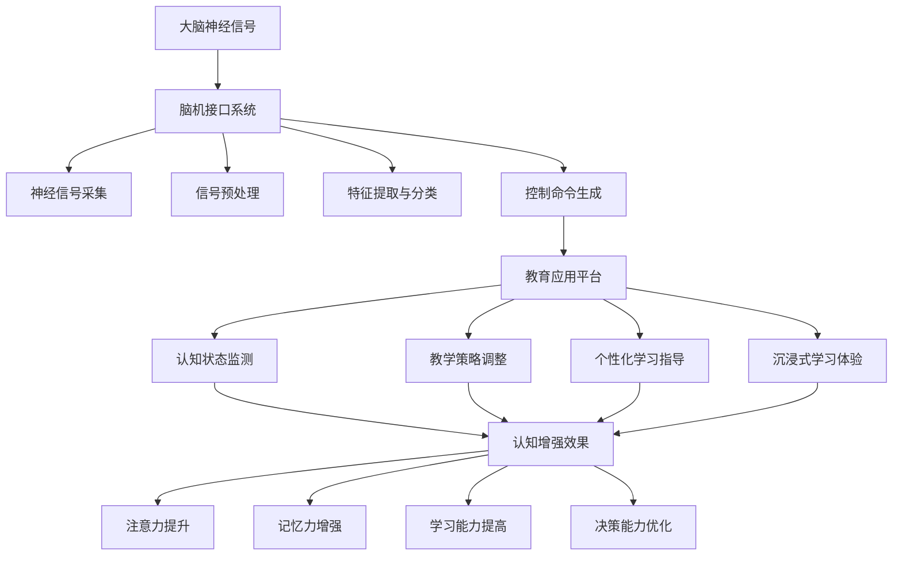

# 巴菲特 - 芒格的脑机接口教育应用投资：认知增强的新范式

> 关键词：巴菲特 - 芒格、脑机接口、教育应用、认知增强、投资新范式

> 摘要：本文聚焦于巴菲特 - 芒格对脑机接口教育应用的投资，深入探讨这一投资背后所蕴含的认知增强新范式。首先介绍了研究的背景，包括目的、预期读者、文档结构和相关术语。接着阐述脑机接口、教育应用和认知增强的核心概念及其联系，并给出相应的示意图和流程图。详细剖析核心算法原理，通过 Python 代码进行说明，同时介绍相关数学模型和公式。以实际项目为例，展示开发环境搭建、源代码实现与解读。探讨脑机接口教育应用的实际场景，推荐学习资源、开发工具框架和相关论文著作。最后总结未来发展趋势与挑战，解答常见问题并提供扩展阅读和参考资料，旨在全面展现脑机接口教育应用在投资和教育领域的潜力与价值。

## 1. 背景介绍 
### 1.1 目的和范围
近年来，科技领域的创新不断涌现，脑机接口技术作为其中一项具有革命性的技术，正逐渐展现出巨大的发展潜力。巴菲特和芒格作为投资界的传奇人物，他们对脑机接口教育应用的投资引起了广泛关注。本文的目的在于深入分析这一投资背后的逻辑和意义，探讨脑机接口技术在教育领域的应用如何形成认知增强的新范式。研究范围涵盖脑机接口技术的基本原理、教育应用的具体场景、认知增强的理论基础，以及投资决策所涉及的市场前景和风险评估等方面。

### 1.2 预期读者
本文预期读者包括科技投资者、教育行业从业者、脑机接口技术研究人员、认知科学领域的学者以及对新兴科技应用感兴趣的普通读者。对于投资者而言，可从中了解脑机接口教育应用投资的潜在价值和风险；教育从业者能获取关于如何将新技术融入教育教学的思路；技术研究人员可关注技术在教育场景中的具体需求和发展方向；认知科学学者能探讨认知增强在教育中的应用机制；普通读者则可以拓宽对新兴科技的认知视野。

### 1.3 文档结构概述
本文将按照以下结构展开：首先介绍相关背景信息，让读者了解研究的基础和目标。接着阐述脑机接口、教育应用和认知增强的核心概念及其相互联系，通过示意图和流程图进行直观展示。详细讲解核心算法原理和具体操作步骤，并给出 Python 代码示例。介绍相关的数学模型和公式，并结合实际例子进行说明。通过实际项目案例，展示开发环境搭建、源代码实现和代码解读。探讨脑机接口教育应用的实际场景。推荐学习资源、开发工具框架和相关论文著作。最后总结未来发展趋势与挑战，解答常见问题并提供扩展阅读和参考资料。

### 1.4 术语表
#### 1.4.1 核心术语定义
- **脑机接口（Brain - Computer Interface, BCI）**：一种不依赖于常规的大脑外周神经与肌肉输出通道的通信系统，它可以将大脑活动产生的神经信号转化为可被计算机识别和处理的命令，从而实现大脑与外部设备的直接交互。
- **认知增强（Cognitive Enhancement）**：指通过各种手段（如药物、技术、训练等）来改善人类的认知功能，包括注意力、记忆力、学习能力、决策能力等方面，以提高个体在认知任务中的表现。
- **教育应用（Educational Application）**：将特定的技术、方法或理念应用于教育领域，以实现教学目标、提高教育质量、促进学生学习和发展的各类实践活动。

#### 1.4.2 相关概念解释
- **神经信号（Neural Signal）**：大脑神经元活动时产生的电信号或化学信号，这些信号包含了大脑处理信息的相关内容，是脑机接口技术获取和分析的对象。
- **机器学习（Machine Learning）**：一门多领域交叉学科，涉及概率论、统计学、逼近论、凸分析、算法复杂度理论等多门学科。它专门研究计算机怎样模拟或实现人类的学习行为，以获取新的知识或技能，重新组织已有的知识结构使之不断改善自身的性能。在脑机接口中，机器学习可用于对神经信号进行分类、识别和预测。
- **沉浸式学习（Immersive Learning）**：一种让学习者身临其境地参与学习过程的教学方法，通过虚拟现实（VR）、增强现实（AR）等技术，为学习者创造一个高度逼真的学习环境，使其能够更加深入地理解和掌握知识。

#### 1.4.3 缩略词列表
- **BCI**：Brain - Computer Interface（脑机接口）
- **VR**：Virtual Reality（虚拟现实）
- **AR**：Augmented Reality（增强现实）
- **ML**：Machine Learning（机器学习）

## 2. 核心概念与联系 

### 核心概念原理
#### 脑机接口原理
脑机接口技术的核心在于获取和解读大脑产生的神经信号。大脑中的神经元通过电活动进行信息传递，这些电活动会产生微弱的生物电信号，可通过头皮电极（非侵入式）或植入式电极（侵入式）进行采集。采集到的神经信号经过放大、滤波等预处理后，需要进行特征提取和分类识别。常用的特征包括时域特征（如均值、方差等）、频域特征（如功率谱密度）等。通过机器学习算法，如支持向量机（SVM）、神经网络等，对这些特征进行训练和分类，从而将神经信号转化为具体的控制命令，实现大脑与外部设备的交互。

#### 教育应用原理
在教育领域，脑机接口技术的应用主要基于其能够实时监测学生的认知状态和学习过程。通过分析学生大脑的神经信号，可以了解学生的注意力集中程度、学习负荷、知识掌握情况等信息。根据这些信息，教育者可以调整教学策略，如改变教学内容的难度、节奏，提供个性化的学习指导等。此外，脑机接口还可以与虚拟现实、增强现实等技术结合，为学生创造更加沉浸式的学习体验，提高学习效果。

#### 认知增强原理
认知增强的原理是通过对大脑的刺激或调节，改善大脑的神经活动和功能。脑机接口技术可以作为一种认知增强的手段，通过向大脑反馈特定的信息或刺激，引导大脑进行自我调节和优化。例如，当检测到学生注意力不集中时，脑机接口系统可以通过声音、图像等方式给予提示，促使学生重新集中注意力。同时，通过长期的训练和反馈，大脑可以逐渐适应这种调节方式，从而提高认知能力。

### 架构的文本示意图
```plaintext
             +---------------------+
             |     脑机接口系统    |
             |---------------------|
             | 神经信号采集模块    |
             | 信号预处理模块      |
             | 特征提取与分类模块  |
             | 控制命令生成模块    |
             +---------------------+
                      |
                      v
             +---------------------+
             |   教育应用平台      |
             |---------------------|
             | 认知状态监测模块    |
             | 教学策略调整模块    |
             | 个性化学习指导模块  |
             | 沉浸式学习体验模块  |
             +---------------------+
                      |
                      v
             +---------------------+
             |   认知增强效果      |
             |---------------------|
             | 注意力提升          |
             | 记忆力增强          |
             | 学习能力提高        |
             | 决策能力优化        |
             +---------------------+
```

### Mermaid 流程图


## 3. 核心算法原理 & 具体操作步骤 

### 核心算法原理
在脑机接口教育应用中，核心算法主要涉及神经信号的特征提取和分类识别。这里以支持向量机（SVM）为例进行说明。支持向量机是一种二分类模型，其基本思想是在特征空间中找到一个最优的超平面，使得不同类别的样本能够被最大程度地分开。

对于给定的训练数据集 $D = \{(x_1, y_1), (x_2, y_2), \cdots, (x_n, y_n)\}$，其中 $x_i \in \mathbb{R}^d$ 是第 $i$ 个样本的特征向量，$y_i \in \{-1, +1\}$ 是对应的类别标签。支持向量机的目标是找到一个超平面 $w^T x + b = 0$，使得对于所有的正类样本 $y_i = +1$，有 $w^T x_i + b \geq 1$；对于所有的负类样本 $y_i = -1$，有 $w^T x_i + b \leq -1$。同时，要使得超平面到最近样本点的距离（即间隔）最大。

为了求解这个最优超平面，需要构建一个优化问题：
$$
\begin{aligned}
\min_{w, b} &\quad \frac{1}{2} \|w\|^2 \\
\text{s.t.} &\quad y_i(w^T x_i + b) \geq 1, \quad i = 1, 2, \cdots, n
\end{aligned}
$$

通过引入拉格朗日乘子 $\alpha_i \geq 0$，可以将上述优化问题转化为其对偶问题：
$$
\begin{aligned}
\max_{\alpha} &\quad \sum_{i=1}^{n} \alpha_i - \frac{1}{2} \sum_{i=1}^{n} \sum_{j=1}^{n} \alpha_i \alpha_j y_i y_j x_i^T x_j \\
\text{s.t.} &\quad \sum_{i=1}^{n} \alpha_i y_i = 0 \\
&\quad \alpha_i \geq 0, \quad i = 1, 2, \cdots, n
\end{aligned}
$$

求解对偶问题得到最优的拉格朗日乘子 $\alpha^*$，进而可以得到最优的权重向量 $w^*$ 和偏置 $b^*$。对于新的样本 $x$，可以通过计算 $f(x) = w^{*T} x + b^*$ 的符号来进行分类。

### 具体操作步骤

#### 步骤 1：数据采集
使用脑电采集设备（如脑电图仪）采集学生在学习过程中的脑电信号。采集时需要确保电极与头皮的良好接触，以获得清晰、稳定的信号。

#### 步骤 2：数据预处理
对采集到的原始脑电信号进行预处理，主要包括滤波、去噪和降采样等操作。以下是一个使用 Python 的 `scipy` 库进行滤波的示例代码：
```python
import numpy as np
from scipy import signal

def preprocess_eeg(eeg_signal, fs, lowcut, highcut, order=4):
    """
    对脑电信号进行带通滤波预处理
    :param eeg_signal: 原始脑电信号
    :param fs: 采样频率
    :param lowcut: 低频截止频率
    :param highcut: 高频截止频率
    :param order: 滤波器阶数
    :return: 预处理后的脑电信号
    """
    nyquist = 0.5 * fs
    low = lowcut / nyquist
    high = highcut / nyquist
    b, a = signal.butter(order, [low, high], btype='band')
    filtered_signal = signal.lfilter(b, a, eeg_signal)
    return filtered_signal

# 示例用法
fs = 250  # 采样频率
lowcut = 1  # 低频截止频率
highcut = 50  # 高频截止频率
eeg_signal = np.random.randn(1000)  # 模拟原始脑电信号
filtered_signal = preprocess_eeg(eeg_signal, fs, lowcut, highcut)
```

#### 步骤 3：特征提取
从预处理后的脑电信号中提取特征，常用的特征包括时域特征和频域特征。以下是一个计算时域均值和方差特征的示例代码：
```python
def extract_features(eeg_signal):
    """
    提取脑电信号的时域均值和方差特征
    :param eeg_signal: 预处理后的脑电信号
    :return: 特征向量
    """
    mean_value = np.mean(eeg_signal)
    var_value = np.var(eeg_signal)
    features = [mean_value, var_value]
    return features

# 示例用法
features = extract_features(filtered_signal)
```

#### 步骤 4：模型训练
使用提取的特征和对应的类别标签，训练支持向量机模型。以下是一个使用 `sklearn` 库进行模型训练的示例代码：
```python
from sklearn import svm
from sklearn.model_selection import train_test_split

# 假设已经有了特征矩阵 X 和标签向量 y
X = np.random.randn(100, 2)  # 模拟特征矩阵
y = np.random.randint(0, 2, 100)  # 模拟标签向量

# 划分训练集和测试集
X_train, X_test, y_train, y_test = train_test_split(X, y, test_size=0.2, random_state=42)

# 创建支持向量机模型
clf = svm.SVC(kernel='linear')

# 训练模型
clf.fit(X_train, y_train)

# 评估模型
accuracy = clf.score(X_test, y_test)
print(f"模型准确率: {accuracy}")
```

#### 步骤 5：分类预测
使用训练好的模型对新的脑电信号特征进行分类预测，根据预测结果调整教学策略或提供个性化学习指导。
```python
# 假设已经有了新的特征向量 new_features
new_features = np.random.randn(1, 2)

# 进行预测
prediction = clf.predict(new_features)
print(f"预测结果: {prediction}")
```

## 4. 数学模型和公式 & 详细讲解 & 举例说明 

### 支持向量机数学模型和公式详细讲解
#### 原始优化问题
支持向量机的原始优化问题为：
$$
\begin{aligned}
\min_{w, b} &\quad \frac{1}{2} \|w\|^2 \\
\text{s.t.} &\quad y_i(w^T x_i + b) \geq 1, \quad i = 1, 2, \cdots, n
\end{aligned}
$$
其中，$\frac{1}{2} \|w\|^2$ 是目标函数，其目的是使得超平面的法向量 $w$ 的模长最小，从而保证间隔最大。约束条件 $y_i(w^T x_i + b) \geq 1$ 表示所有样本点都要被正确分类，并且到超平面的距离至少为 $\frac{1}{\|w\|}$。

#### 拉格朗日函数
为了求解原始优化问题，引入拉格朗日乘子 $\alpha_i \geq 0$，构建拉格朗日函数：
$$
L(w, b, \alpha) = \frac{1}{2} \|w\|^2 - \sum_{i=1}^{n} \alpha_i (y_i(w^T x_i + b) - 1)
$$

#### 对偶问题
通过对拉格朗日函数分别关于 $w$ 和 $b$ 求偏导并令其为零，可以得到：
$$
\begin{cases}
\nabla_w L(w, b, \alpha) = w - \sum_{i=1}^{n} \alpha_i y_i x_i = 0 \\
\nabla_b L(w, b, \alpha) = -\sum_{i=1}^{n} \alpha_i y_i = 0
\end{cases}
$$
将 $w = \sum_{i=1}^{n} \alpha_i y_i x_i$ 代入拉格朗日函数 $L(w, b, \alpha)$ 中，消去 $w$ 和 $b$，得到对偶问题：
$$
\begin{aligned}
\max_{\alpha} &\quad \sum_{i=1}^{n} \alpha_i - \frac{1}{2} \sum_{i=1}^{n} \sum_{j=1}^{n} \alpha_i \alpha_j y_i y_j x_i^T x_j \\
\text{s.t.} &\quad \sum_{i=1}^{n} \alpha_i y_i = 0 \\
&\quad \alpha_i \geq 0, \quad i = 1, 2, \cdots, n
\end{aligned}
$$

#### 求解最优解
通过求解对偶问题得到最优的拉格朗日乘子 $\alpha^*$，然后可以计算出最优的权重向量 $w^*$ 和偏置 $b^*$：
$$
w^* = \sum_{i=1}^{n} \alpha_i^* y_i x_i
$$
对于支持向量 $x_s$（即 $\alpha_s^* > 0$ 的样本点），可以计算偏置 $b^*$：
$$
b^* = y_s - w^{*T} x_s
$$

### 举例说明
假设有一个二维的数据集，包含两个类别，样本点如下：
$$
\begin{aligned}
\text{正类样本}: &\quad x_1 = [1, 2]^T, \quad x_2 = [2, 3]^T \\
\text{负类样本}: &\quad x_3 = [-1, -1]^T, \quad x_4 = [-2, -2]^T
\end{aligned}
$$
对应的类别标签为 $y_1 = y_2 = +1$，$y_3 = y_4 = -1$。

首先，计算样本之间的内积矩阵 $K$：
$$
K_{ij} = x_i^T x_j
$$
例如，$K_{11} = x_1^T x_1 = 1^2 + 2^2 = 5$，$K_{12} = x_1^T x_2 = 1\times2 + 2\times3 = 8$，以此类推。

然后，构建对偶问题：
$$
\begin{aligned}
\max_{\alpha} &\quad \sum_{i=1}^{4} \alpha_i - \frac{1}{2} \sum_{i=1}^{4} \sum_{j=1}^{4} \alpha_i \alpha_j y_i y_j K_{ij} \\
\text{s.t.} &\quad \sum_{i=1}^{4} \alpha_i y_i = 0 \\
&\quad \alpha_i \geq 0, \quad i = 1, 2, 3, 4
\end{aligned}
$$

通过求解对偶问题得到最优的拉格朗日乘子 $\alpha^*$，进而计算出最优的权重向量 $w^*$ 和偏置 $b^*$。最后，对于新的样本点 $x = [0, 0]^T$，可以计算 $f(x) = w^{*T} x + b^*$ 的符号，从而判断其类别。

## 5. 项目实战：代码实际案例和详细解释说明 

### 5.1  开发环境搭建
#### 硬件环境
- **脑电采集设备**：选择合适的脑电采集设备，如 Emotiv Insight、NeuroSky MindWave 等。这些设备可以采集头皮脑电信号，并通过 USB 接口将数据传输到计算机。
- **计算机**：需要一台性能较好的计算机，建议配备 Intel Core i5 及以上处理器、8GB 及以上内存和 Windows 10 或 macOS 操作系统。

#### 软件环境
- **Python 环境**：安装 Python 3.7 及以上版本，可以从 Python 官方网站（https://www.python.org/downloads/）下载安装包进行安装。
- **Python 库**：安装必要的 Python 库，如 `numpy`、`scipy`、`sklearn`、`matplotlib` 等。可以使用 `pip` 命令进行安装：
```sh
pip install numpy scipy sklearn matplotlib
```

### 5.2  源代码详细实现和代码解读
以下是一个完整的脑机接口教育应用项目的源代码示例，包括数据采集、预处理、特征提取、模型训练和分类预测的全过程。

```python
import numpy as np
from scipy import signal
from sklearn import svm
from sklearn.model_selection import train_test_split
import matplotlib.pyplot as plt

# 模拟脑电数据采集
def simulate_eeg_data(num_samples, fs, duration):
    """
    模拟脑电数据采集
    :param num_samples: 样本数量
    :param fs: 采样频率
    :param duration: 信号持续时间
    :return: 模拟脑电信号
    """
    t = np.linspace(0, duration, num_samples * fs)
    eeg_signal = np.random.randn(num_samples * fs)
    return eeg_signal

# 数据预处理
def preprocess_eeg(eeg_signal, fs, lowcut, highcut, order=4):
    """
    对脑电信号进行带通滤波预处理
    :param eeg_signal: 原始脑电信号
    :param fs: 采样频率
    :param lowcut: 低频截止频率
    :param highcut: 高频截止频率
    :param order: 滤波器阶数
    :return: 预处理后的脑电信号
    """
    nyquist = 0.5 * fs
    low = lowcut / nyquist
    high = highcut / nyquist
    b, a = signal.butter(order, [low, high], btype='band')
    filtered_signal = signal.lfilter(b, a, eeg_signal)
    return filtered_signal

# 特征提取
def extract_features(eeg_signal):
    """
    提取脑电信号的时域均值和方差特征
    :param eeg_signal: 预处理后的脑电信号
    :return: 特征向量
    """
    mean_value = np.mean(eeg_signal)
    var_value = np.var(eeg_signal)
    features = [mean_value, var_value]
    return features

# 模型训练和预测
def train_and_predict(X, y):
    """
    训练支持向量机模型并进行预测
    :param X: 特征矩阵
    :param y: 标签向量
    :return: 训练好的模型和预测准确率
    """
    # 划分训练集和测试集
    X_train, X_test, y_train, y_test = train_test_split(X, y, test_size=0.2, random_state=42)

    # 创建支持向量机模型
    clf = svm.SVC(kernel='linear')

    # 训练模型
    clf.fit(X_train, y_train)

    # 评估模型
    accuracy = clf.score(X_test, y_test)

    return clf, accuracy

# 主函数
def main():
    # 模拟脑电数据采集
    num_samples = 100
    fs = 250
    duration = 1
    eeg_signal = simulate_eeg_data(num_samples, fs, duration)

    # 数据预处理
    lowcut = 1
    highcut = 50
    filtered_signal = preprocess_eeg(eeg_signal, fs, lowcut, highcut)

    # 特征提取
    features = extract_features(filtered_signal)

    # 模拟特征矩阵和标签向量
    X = np.random.randn(100, 2)
    y = np.random.randint(0, 2, 100)

    # 模型训练和预测
    clf, accuracy = train_and_predict(X, y)

    # 打印结果
    print(f"特征向量: {features}")
    print(f"模型准确率: {accuracy}")

    # 可视化滤波前后的信号
    t = np.linspace(0, duration, num_samples * fs)
    plt.figure(figsize=(12, 6))
    plt.subplot(2, 1, 1)
    plt.plot(t, eeg_signal)
    plt.title('原始脑电信号')
    plt.xlabel('时间 (s)')
    plt.ylabel('幅值')
    plt.subplot(2, 1, 2)
    plt.plot(t, filtered_signal)
    plt.title('滤波后的脑电信号')
    plt.xlabel('时间 (s)')
    plt.ylabel('幅值')
    plt.tight_layout()
    plt.show()

if __name__ == "__main__":
    main()
```

### 5.3  代码解读与分析
#### 模拟脑电数据采集
`simulate_eeg_data` 函数用于模拟脑电数据的采集过程，生成随机的脑电信号。在实际应用中，需要使用真实的脑电采集设备进行数据采集。

#### 数据预处理
`preprocess_eeg` 函数对原始脑电信号进行带通滤波预处理，去除低频和高频噪声，保留感兴趣的频率成分。使用 `scipy.signal.butter` 函数设计巴特沃斯滤波器，然后使用 `scipy.signal.lfilter` 函数进行滤波操作。

#### 特征提取
`extract_features` 函数从预处理后的脑电信号中提取时域均值和方差特征。这些特征可以反映脑电信号的基本统计特性，用于后续的分类任务。

#### 模型训练和预测
`train_and_predict` 函数使用 `sklearn.svm.SVC` 类创建支持向量机模型，并使用训练数据进行训练。然后使用测试数据评估模型的准确率。

#### 主函数
`main` 函数是程序的入口，依次调用上述函数完成数据采集、预处理、特征提取、模型训练和预测的全过程。最后，使用 `matplotlib` 库可视化滤波前后的脑电信号。

## 6. 实际应用场景 
### 个性化学习
脑机接口技术可以实时监测学生的认知状态，如注意力、学习负荷等。根据这些信息，教育应用平台可以为学生提供个性化的学习方案。例如，当检测到学生在某个知识点上注意力不集中时，系统可以自动调整教学内容的难度或提供额外的辅导资料；当学生学习负荷过大时，系统可以安排适当的休息时间。

### 沉浸式学习体验
结合虚拟现实（VR）和增强现实（AR）技术，脑机接口可以为学生创造更加沉浸式的学习环境。学生可以通过大脑控制虚拟场景中的物体和动作，增强学习的参与感和趣味性。例如，在历史课程中，学生可以通过脑机接口控制自己在虚拟的历史场景中漫步，与历史人物进行互动，更加深入地了解历史事件。

### 特殊教育
对于有学习障碍或特殊需求的学生，脑机接口技术可以提供针对性的帮助。例如，对于自闭症儿童，脑机接口可以帮助他们更好地表达自己的情感和需求；对于学习困难的学生，系统可以通过监测他们的大脑活动，发现学习障碍的根源，并提供个性化的训练方案。

### 教师培训
脑机接口技术也可以应用于教师培训领域。通过监测教师在教学过程中的大脑活动，了解教师的认知状态和教学效果。例如，当教师在讲解某个知识点时注意力不集中或情绪不稳定，系统可以及时给予反馈，帮助教师调整教学状态。同时，教师可以通过分析自己的大脑活动数据，不断优化教学方法和策略。

## 7. 工具和资源推荐
### 7.1 学习资源推荐
#### 7.1.1 书籍推荐
- 《脑机接口：原理与应用》：本书系统地介绍了脑机接口的基本原理、技术方法和应用领域，是学习脑机接口技术的经典教材。
- 《认知心理学》：深入探讨了人类的认知过程，包括注意力、记忆、学习等方面的内容，为理解脑机接口在认知增强方面的应用提供了理论基础。
- 《机器学习》：由周志华教授编写，全面介绍了机器学习的基本概念、算法和应用，对于理解脑机接口中的信号处理和分类算法非常有帮助。

#### 7.1.2 在线课程
- Coursera 上的 “Brain - Computer Interfaces” 课程：由国际知名专家授课，详细介绍了脑机接口的技术原理和应用案例。
- edX 上的 “Cognitive Science” 课程：从认知科学的角度出发，讲解了人类认知的基本原理和研究方法，与脑机接口在教育领域的应用密切相关。
- 中国大学 MOOC 上的 “机器学习基础” 课程：适合初学者学习机器学习的基本概念和算法，为脑机接口技术中的数据处理和模型训练提供了必要的知识储备。

#### 7.1.3 技术博客和网站
- BCI Society（https://bcisociety.org/）：国际脑机接口协会的官方网站，提供了脑机接口领域的最新研究成果、会议信息和技术资源。
- NeurotechX（https://neurotechx.com/）：专注于神经技术的社区网站，涵盖了脑机接口、神经反馈等多个领域的内容，有很多技术文章和项目案例可供学习。
- 知乎上的 “脑机接口” 话题：聚集了很多脑机接口领域的专家和爱好者，他们分享了自己的研究经验、技术见解和行业动态。

### 7.2 开发工具框架推荐
#### 7.2.1 IDE和编辑器
- PyCharm：一款专业的 Python 集成开发环境，提供了代码编辑、调试、版本控制等丰富的功能，适合开发脑机接口相关的 Python 项目。
- Jupyter Notebook：一种交互式的开发环境，支持 Python、R 等多种编程语言。可以方便地进行代码编写、数据可视化和结果展示，非常适合进行脑机接口数据的分析和模型训练。
- Visual Studio Code：一款轻量级的代码编辑器，支持多种编程语言和插件扩展。可以安装 Python 相关的插件，实现代码编辑、调试和运行的功能。

#### 7.2.2 调试和性能分析工具
- PySnooper：一个简单易用的 Python 调试工具，可以自动记录函数的调用过程和变量的值，方便调试复杂的代码。
- cProfile：Python 内置的性能分析工具，可以统计程序中各个函数的执行时间和调用次数，帮助优化代码性能。
- TensorBoard：一个用于可视化深度学习模型训练过程的工具，可以展示模型的损失函数、准确率等指标的变化情况，方便调试和优化模型。

#### 7.2.3 相关框架和库
- MNE - Python：一个用于脑电信号处理和分析的 Python 库，提供了丰富的信号处理算法和可视化工具，可用于脑机接口数据的预处理和特征提取。
- scikit - learn：一个常用的机器学习库，提供了各种机器学习算法的实现，如支持向量机、决策树、神经网络等，可用于脑机接口中的信号分类和预测任务。
- PyTorch：一个开源的深度学习框架，具有动态图的特点，易于使用和调试。可以用于构建和训练复杂的神经网络模型，如卷积神经网络（CNN）、循环神经网络（RNN）等，在脑机接口中的应用越来越广泛。

### 7.3 相关论文著作推荐
#### 7.3.1 经典论文
- Wolpaw, J. R., Birbaumer, N., McFarland, D. J., Pfurtscheller, G., & Vaughan, T. M. (2002). Brain - computer interfaces for communication and control. Clinical neurophysiology, 113(6), 767 - 791. 这篇论文是脑机接口领域的经典之作，系统地介绍了脑机接口的基本概念、技术方法和应用前景。
- Norman, D. A., & Shallice, T. (1986). Attention to action: Willed and automatic control of behavior. Consciousness in contemporary science, 1, 1 - 18. 该论文探讨了人类注意力和行为控制的机制，为理解脑机接口在认知增强方面的应用提供了理论基础。

#### 7.3.2 最新研究成果
- Wang, Y., & Krusienski, D. J. (2021). Deep learning for brain - computer interfaces: A review. Journal of Neural Engineering, 18(4), 041001. 这篇论文对深度学习在脑机接口中的应用进行了全面的综述，介绍了最新的研究进展和挑战。
- Palaniappan, R. (2020). A review of mental workload assessment in the brain - computer interface (BCI) domain. Frontiers in neuroscience, 14, 61. 该论文对脑机接口领域中精神负荷评估的研究进行了总结，为教育应用中监测学生的学习负荷提供了参考。

#### 7.3.3 应用案例分析
- Leeb, R., Müller --Putz, G. R., Pfurtscheller, G., & Schlögl, A. (2007). Brain - computer communication: motivation, aim, and impact of exploring a virtual apartment. IEEE Transactions on Neural Systems and Rehabilitation Engineering, 15(3), 473 - 482. 这篇论文介绍了脑机接口在虚拟环境中的应用案例，展示了脑机接口技术在创造沉浸式体验方面的潜力。
- Allison, B. Z., & Neuper, C. (2010). Brain - computer interfaces: principles and practice. CRC Press. 本书通过多个实际应用案例，详细介绍了脑机接口的技术原理和实现方法，对于理解脑机接口在教育领域的应用具有重要的参考价值。

## 8. 总结：未来发展趋势与挑战
### 未来发展趋势
#### 技术融合
脑机接口技术将与虚拟现实、增强现实、人工智能等技术深度融合，创造更加沉浸式、智能化的教育体验。例如，结合 VR/AR 技术，学生可以身临其境地参与历史事件、探索科学奥秘；利用人工智能算法，可以对学生的大脑活动数据进行更深入的分析和挖掘，提供更加个性化的学习建议。

#### 应用拓展
脑机接口教育应用将从传统的学校教育扩展到职业培训、终身学习等领域。在职业培训中，脑机接口可以帮助学员更快地掌握专业技能；在终身学习中，它可以为学习者提供更加高效、便捷的学习方式，满足不同人群的学习需求。

#### 产业发展
随着脑机接口技术的不断成熟和应用推广，相关产业将迎来快速发展。教育科技企业将加大在脑机接口教育应用领域的研发投入，推出更多创新的产品和服务。同时，产业链上下游的企业也将加强合作，形成完整的产业生态系统。

### 挑战
#### 技术瓶颈
目前，脑机接口技术还存在一些技术瓶颈，如信号采集的准确性和稳定性、特征提取的有效性、模型的泛化能力等。这些问题限制了脑机接口教育应用的进一步发展，需要不断进行技术创新和改进。

#### 伦理和法律问题
脑机接口技术涉及到人类大脑的隐私和安全问题，引发了一系列伦理和法律争议。例如，如何保护用户的大脑数据不被泄露和滥用，如何确保脑机接口技术的使用符合伦理道德规范等。需要建立健全相关的伦理和法律制度，加强对脑机接口技术的监管。

#### 社会接受度
脑机接口技术作为一种新兴技术，公众对其了解和接受程度还相对较低。一些人可能对使用脑机接口设备存在担忧和恐惧，担心会对自己的身体和大脑造成伤害。需要加强对脑机接口技术的科普宣传，提高公众的认知水平和接受度。

## 9. 附录：常见问题与解答
### 问题 1：脑机接口技术是否会对大脑造成伤害？
答：目前的非侵入式脑机接口技术，如通过头皮电极采集脑电信号，不会对大脑造成伤害。这些技术只是检测大脑产生的微弱生物电信号，不会对大脑组织进行直接干预。而侵入式脑机接口技术，虽然可以获得更精确的神经信号，但需要进行手术将电极植入大脑，存在一定的手术风险和感染风险。不过，随着技术的不断发展，侵入式脑机接口的安全性也在不断提高。

### 问题 2：脑机接口教育应用是否会取代教师？
答：脑机接口教育应用不会取代教师。虽然脑机接口技术可以提供个性化的学习方案和实时的学习反馈，但教师在教育过程中具有不可替代的作用。教师不仅可以传授知识，还可以培养学生的情感、价值观和社会交往能力。脑机接口教育应用可以作为教师的辅助工具，帮助教师更好地了解学生的学习状态，提高教学效果。

### 问题 3：脑机接口技术的准确率有多高？
答：脑机接口技术的准确率受到多种因素的影响，如信号采集的质量、特征提取的方法、模型的选择和训练等。目前，在一些简单的分类任务中，脑机接口的准确率可以达到 80% 以上，但在复杂的认知任务中，准确率还需要进一步提高。随着技术的不断发展和研究的深入，脑机接口的准确率有望不断提升。

### 问题 4：脑机接口设备的价格是否昂贵？
答：脑机接口设备的价格因类型和功能而异。一些消费级的脑机接口设备，如 NeuroSky MindWave，价格相对较低，几百元到一千多元不等。而专业级的脑机接口设备，如 Emotiv Insight、g.tec 等，价格则相对较高，可能需要数千元到数万元。随着技术的普及和市场竞争的加剧，脑机接口设备的价格有望逐渐降低。

## 10. 扩展阅读 & 参考资料
### 扩展阅读
- 《未来简史：从智人到智神》：这本书探讨了科技发展对人类未来的影响，其中涉及到脑机接口等新兴技术的发展趋势和可能带来的社会变革。
- 《人工智能时代与人类未来》：分析了人工智能和脑机接口等技术对人类社会、经济和文化的影响，引发读者对未来的思考。
- 《科技想要什么》：从宏观的角度探讨了科技发展的内在规律和趋势，对于理解脑机接口技术在科技发展中的地位和作用具有一定的启发意义。

### 参考资料
- 相关学术期刊文章，如《Journal of Neural Engineering》、《IEEE Transactions on Neural Systems and Rehabilitation Engineering》等。
- 脑机接口设备制造商的官方网站，如 Emotiv（https://www.emotiv.com/）、NeuroSky（https://neurosky.com/）等。
- 教育科技领域的行业报告和研究机构的分析报告。

作者：AI天才研究院/AI Genius Institute & 禅与计算机程序设计艺术 /Zen And The Art of Computer Programming