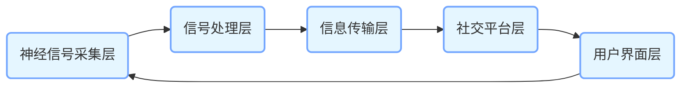

# 巴菲特 - 芒格的脑机接口社交平台投资：思维互联的社交革命

> 关键词：巴菲特；芒格；脑机接口；社交平台；思维互联；投资；社交革命

> 摘要：本文围绕巴菲特和芒格对脑机接口社交平台的投资展开探讨。深入剖析脑机接口社交平台的核心概念、技术原理及数学模型，通过项目实战展示其代码实现与应用。阐述该投资在社交领域引发的思维互联社交革命，分析其实际应用场景，推荐相关学习工具和资源，最后总结其未来发展趋势与挑战，并解答常见问题。

## 1. 背景介绍 
### 1.1 目的和范围
本文旨在全面解析巴菲特 - 芒格投资脑机接口社交平台这一事件背后的意义和影响。从技术层面深入探讨脑机接口社交平台的原理、实现方式，以及其在社交领域引发的变革。同时，分析这一投资决策的潜在价值和未来发展趋势。范围涵盖脑机接口技术的基本概念、相关算法和数学模型、实际应用案例，以及投资所涉及的市场前景和挑战。

### 1.2 预期读者
本文预期读者包括对金融投资、科技前沿领域尤其是脑机接口技术和社交平台发展感兴趣的专业人士，如投资者、科技分析师、程序员、软件架构师等。同时，也适合对新兴科技有好奇心的普通大众，帮助他们了解这一前沿技术和投资决策的相关知识。

### 1.3 文档结构概述
本文将按照以下结构进行阐述：首先介绍脑机接口社交平台的核心概念和相关联系，包括其原理和架构；接着详细讲解核心算法原理和具体操作步骤，并给出 Python 源代码示例；然后阐述数学模型和公式，并进行详细讲解和举例说明；通过项目实战展示代码实际案例和详细解释；分析脑机接口社交平台的实际应用场景；推荐相关的学习工具和资源；最后总结未来发展趋势与挑战，解答常见问题，并提供扩展阅读和参考资料。

### 1.4 术语表
#### 1.4.1 核心术语定义
- **脑机接口（Brain - Computer Interface, BCI）**：一种不依赖于正常的由外围神经和肌肉组成的输出通路的通讯系统，它允许大脑直接与外部设备进行通信和控制。
- **社交平台（Social Platform）**：为用户提供社交互动功能的网络平台，用户可以在上面分享信息、交流互动。
- **思维互联（Thought Interconnection）**：通过脑机接口技术实现不同个体之间思维信息的直接传递和共享。

#### 1.4.2 相关概念解释
- **神经信号采集**：通过电极等设备从大脑中获取神经电信号的过程。
- **信号处理**：对采集到的神经信号进行滤波、特征提取等处理，以便后续分析和解读。
- **模式识别**：根据处理后的信号特征，识别出不同的思维模式或意图。

#### 1.4.3 缩略词列表
- **BCI**：Brain - Computer Interface（脑机接口）
- **EEG**：Electroencephalogram（脑电图）

## 2. 核心概念与联系 
### 核心概念原理
脑机接口社交平台的核心原理是将脑机接口技术与社交平台相结合。首先，通过脑机接口设备采集用户大脑的神经信号，这些信号包含了用户的思维、情感等信息。然后，对采集到的神经信号进行处理和分析，提取出有意义的信息。最后，将这些信息通过社交平台进行传输和共享，实现用户之间的思维互联。

### 架构的文本示意图
脑机接口社交平台的架构主要包括以下几个部分：
1. **神经信号采集层**：由脑机接口设备组成，如脑电图（EEG）头盔等，用于采集用户大脑的神经信号。
2. **信号处理层**：对采集到的神经信号进行预处理、特征提取和模式识别等操作，将神经信号转化为计算机能够理解的信息。
3. **信息传输层**：将处理后的信息通过网络传输到社交平台的服务器。
4. **社交平台层**：服务器端负责管理用户信息、存储和处理社交数据，并提供社交互动功能，如消息推送、好友关系管理等。
5. **用户界面层**：用户通过终端设备（如手机、电脑）访问社交平台，接收和发送信息，实现社交互动。

### Mermaid 流程图


## 3. 核心算法原理 & 具体操作步骤 
### 核心算法原理
脑机接口社交平台的核心算法主要包括神经信号处理算法和模式识别算法。

#### 神经信号处理算法
神经信号处理的目的是去除噪声、增强信号特征，以便后续的模式识别。常用的神经信号处理算法包括滤波算法和特征提取算法。

##### 滤波算法
滤波算法用于去除神经信号中的噪声，常用的滤波器有低通滤波器、高通滤波器和带通滤波器。以下是一个使用 Python 的 `scipy` 库实现低通滤波器的示例代码：
```python
import numpy as np
from scipy.signal import butter, filtfilt

def butter_lowpass(cutoff, fs, order=5):
    nyquist = 0.5 * fs
    normal_cutoff = cutoff / nyquist
    b, a = butter(order, normal_cutoff, btype='low', analog=False)
    return b, a

def butter_lowpass_filter(data, cutoff, fs, order=5):
    b, a = butter_lowpass(cutoff, fs, order=order)
    y = filtfilt(b, a, data)
    return y

# 示例使用
fs = 100.0  # 采样频率
cutoff = 30.0  # 截止频率
order = 5  # 滤波器阶数
data = np.random.randn(1000)  # 模拟神经信号
filtered_data = butter_lowpass_filter(data, cutoff, fs, order)
```

##### 特征提取算法
特征提取算法用于从滤波后的神经信号中提取有意义的特征，常用的特征包括时域特征（如均值、方差）和频域特征（如功率谱密度）。以下是一个计算信号均值和方差的示例代码：
```python
import numpy as np

def extract_features(data):
    mean_value = np.mean(data)
    variance = np.var(data)
    return mean_value, variance

# 示例使用
features = extract_features(filtered_data)
print("Mean:", features[0])
print("Variance:", features[1])
```

#### 模式识别算法
模式识别算法用于根据提取的特征识别出不同的思维模式或意图。常用的模式识别算法包括支持向量机（SVM）、神经网络等。以下是一个使用 `scikit - learn` 库实现支持向量机分类的示例代码：
```python
from sklearn import svm
from sklearn.model_selection import train_test_split
import numpy as np

# 生成示例数据
X = np.random.randn(100, 2)
y = np.random.randint(0, 2, 100)

# 划分训练集和测试集
X_train, X_test, y_train, y_test = train_test_split(X, y, test_size=0.2, random_state=42)

# 创建 SVM 分类器
clf = svm.SVC(kernel='linear')

# 训练模型
clf.fit(X_train, y_train)

# 预测
y_pred = clf.predict(X_test)

# 计算准确率
accuracy = np.mean(y_pred == y_test)
print("Accuracy:", accuracy)
```

### 具体操作步骤
1. **神经信号采集**：用户佩戴脑机接口设备，设备采集大脑的神经信号。
2. **信号预处理**：对采集到的神经信号进行滤波等预处理操作，去除噪声。
3. **特征提取**：从预处理后的信号中提取有意义的特征。
4. **模式识别**：根据提取的特征，使用模式识别算法识别出用户的思维模式或意图。
5. **信息传输**：将识别结果通过网络传输到社交平台的服务器。
6. **社交互动**：社交平台根据接收到的信息，为用户提供相应的社交互动功能。

## 4. 数学模型和公式 & 详细讲解 & 举例说明 
### 神经信号模型
神经信号可以用一个时间序列 $x(t)$ 来表示，其中 $t$ 表示时间。在实际应用中，神经信号通常是离散的，因此可以用离散时间序列 $x[n]$ 来表示，其中 $n$ 表示离散时间点。

#### 滤波算法的数学模型
低通滤波器的数学模型可以用差分方程来表示。对于一个 $N$ 阶的低通滤波器，其差分方程为：
$$y[n] = \sum_{k = 0}^{M} b[k]x[n - k]-\sum_{k = 1}^{N} a[k]y[n - k]$$
其中，$x[n]$ 是输入信号，$y[n]$ 是输出信号，$b[k]$ 和 $a[k]$ 是滤波器的系数。

例如，对于一个一阶低通滤波器，其差分方程为：
$$y[n] = b[0]x[n]+b[1]x[n - 1]-a[1]y[n - 1]$$

#### 特征提取的数学模型
时域特征的计算通常基于信号的统计特性。例如，信号的均值 $\mu$ 可以用以下公式计算：
$$\mu=\frac{1}{N}\sum_{n = 0}^{N - 1}x[n]$$
其中，$N$ 是信号的长度。

信号的方差 $\sigma^2$ 可以用以下公式计算：
$$\sigma^2=\frac{1}{N}\sum_{n = 0}^{N - 1}(x[n]-\mu)^2$$

#### 模式识别的数学模型
支持向量机（SVM）的目标是找到一个最优的超平面，将不同类别的样本分开。对于线性可分的情况，SVM 的优化问题可以表示为：
$$\min_{\mathbf{w},b}\frac{1}{2}\|\mathbf{w}\|^2$$
$$\text{s.t. } y_i(\mathbf{w}^T\mathbf{x}_i + b)\geq1, i = 1,\cdots,N$$
其中，$\mathbf{w}$ 是超平面的法向量，$b$ 是偏置，$\mathbf{x}_i$ 是样本点，$y_i\in\{- 1,1\}$ 是样本的类别标签，$N$ 是样本的数量。

### 举例说明
假设我们有一个长度为 $N = 10$ 的离散神经信号 $x[n]=\{1,2,3,4,5,6,7,8,9,10\}$。

#### 计算均值
根据均值的计算公式，可得：
$$\mu=\frac{1}{10}\sum_{n = 0}^{9}x[n]=\frac{1 + 2+3+4+5+6+7+8+9+10}{10}=5.5$$

#### 计算方差
首先计算 $(x[n]-\mu)^2$ 的值：
$$(x[0] - 5.5)^2=(1 - 5.5)^2 = 20.25$$
$$(x[1] - 5.5)^2=(2 - 5.5)^2 = 12.25$$
$$\cdots$$
$$(x[9] - 5.5)^2=(10 - 5.5)^2 = 20.25$$

然后根据方差的计算公式，可得：
$$\sigma^2=\frac{1}{10}\sum_{n = 0}^{9}(x[n] - 5.5)^2=\frac{20.25+12.25+\cdots+20.25}{10}=8.25$$

## 5. 项目实战：代码实际案例和详细解释说明 
### 5.1  开发环境搭建
#### 硬件环境
- **脑机接口设备**：可以选择开源的脑机接口设备，如 OpenBCI 等。
- **计算机**：配置要求较高，建议使用多核处理器和较大的内存。

#### 软件环境
- **操作系统**：可以选择 Windows、Linux 或 macOS。
- **编程语言**：Python 3.x
- **开发库**：`numpy`、`scipy`、`scikit - learn`、`matplotlib` 等

可以使用以下命令安装所需的库：
```bash
pip install numpy scipy scikit-learn matplotlib
```

### 5.2  源代码详细实现和代码解读
以下是一个简单的脑机接口社交平台模拟代码示例：

```python
import numpy as np
from scipy.signal import butter, filtfilt
from sklearn import svm

# 模拟神经信号采集
def simulate_signal_collection():
    # 生成随机神经信号
    signal = np.random.randn(1000)
    return signal

# 神经信号滤波处理
def butter_lowpass(cutoff, fs, order=5):
    nyquist = 0.5 * fs
    normal_cutoff = cutoff / nyquist
    b, a = butter(order, normal_cutoff, btype='low', analog=False)
    return b, a

def butter_lowpass_filter(data, cutoff, fs, order=5):
    b, a = butter_lowpass(cutoff, fs, order=order)
    y = filtfilt(b, a, data)
    return y

# 特征提取
def extract_features(data):
    mean_value = np.mean(data)
    variance = np.var(data)
    return [mean_value, variance]

# 模式识别
def pattern_recognition(features):
    # 生成示例训练数据
    X_train = np.random.randn(100, 2)
    y_train = np.random.randint(0, 2, 100)

    # 创建 SVM 分类器
    clf = svm.SVC(kernel='linear')

    # 训练模型
    clf.fit(X_train, y_train)

    # 预测
    prediction = clf.predict([features])
    return prediction

# 主函数
def main():
    # 采集神经信号
    signal = simulate_signal_collection()

    # 信号滤波处理
    fs = 100.0  # 采样频率
    cutoff = 30.0  # 截止频率
    order = 5  # 滤波器阶数
    filtered_signal = butter_lowpass_filter(signal, cutoff, fs, order)

    # 特征提取
    features = extract_features(filtered_signal)

    # 模式识别
    prediction = pattern_recognition(features)

    print("Prediction:", prediction)

if __name__ == "__main__":
    main()
```

### 代码解读与分析
1. **模拟神经信号采集**：`simulate_signal_collection` 函数生成一个长度为 1000 的随机神经信号。
2. **神经信号滤波处理**：`butter_lowpass` 和 `butter_lowpass_filter` 函数实现了低通滤波器，用于去除信号中的噪声。
3. **特征提取**：`extract_features` 函数计算信号的均值和方差作为特征。
4. **模式识别**：`pattern_recognition` 函数使用支持向量机（SVM）对特征进行分类，预测用户的思维模式。
5. **主函数**：`main` 函数依次调用上述函数，完成神经信号采集、滤波处理、特征提取和模式识别的整个流程。

## 6. 实际应用场景 
### 社交互动
脑机接口社交平台可以实现更加自然和高效的社交互动。用户可以直接通过思维表达自己的想法和情感，无需使用语言或文字输入。例如，用户在与朋友聊天时，可以直接将自己的想法传递给对方，实现更加实时和深入的交流。

### 特殊人群交流
对于一些语言障碍或肢体残疾的人群，脑机接口社交平台提供了一种新的交流方式。他们可以通过大脑信号与他人进行沟通，提高生活质量和社交能力。

### 虚拟现实社交
在虚拟现实（VR）环境中，脑机接口社交平台可以增强用户的沉浸感和互动体验。用户可以通过思维控制自己的虚拟角色，与其他用户进行更加真实的社交互动。

### 团队协作
在工作场景中，脑机接口社交平台可以促进团队成员之间的信息共享和协作。团队成员可以直接分享自己的想法和创意，提高工作效率和创新能力。

## 7. 工具和资源推荐
### 7.1 学习资源推荐
#### 7.1.1 书籍推荐
- 《脑机接口技术：原理、设计与应用》：全面介绍了脑机接口技术的基本原理、设计方法和实际应用。
- 《神经网络与深度学习》：深入讲解了神经网络和深度学习的基本理论和算法，对于理解脑机接口中的模式识别算法有很大帮助。
- 《社交网络分析》：介绍了社交网络的结构、动态和分析方法，有助于理解社交平台的设计和运营。

#### 7.1.2 在线课程
- Coursera 上的“Brain - Computer Interfaces”课程：由知名教授授课，系统介绍脑机接口技术的各个方面。
- edX 上的“Deep Learning Specialization”课程：深入学习深度学习的理论和实践，对于脑机接口中的模式识别有重要意义。
- Udemy 上的“Social Media Marketing Masterclass”课程：了解社交平台的营销策略和运营模式。

#### 7.1.3 技术博客和网站
- NeurotechX：专注于神经技术领域的博客，提供脑机接口技术的最新研究成果和应用案例。
- Medium 上的“Towards Data Science”：有很多关于机器学习和数据分析的文章，对于理解脑机接口中的算法有帮助。
- TechCrunch：关注科技行业的动态，提供脑机接口和社交平台领域的最新消息。

### 7.2 开发工具框架推荐
#### 7.2.1 IDE和编辑器
- PyCharm：功能强大的 Python 集成开发环境，提供代码编辑、调试、版本控制等功能。
- Jupyter Notebook：交互式编程环境，适合进行数据分析和算法实验。
- Visual Studio Code：轻量级的代码编辑器，支持多种编程语言和插件扩展。

#### 7.2.2 调试和性能分析工具
- `pdb`：Python 自带的调试器，可以帮助定位代码中的错误。
- `cProfile`：Python 标准库中的性能分析工具，可以分析代码的运行时间和函数调用情况。
- TensorBoard：用于可视化深度学习模型的训练过程和性能指标。

#### 7.2.3 相关框架和库
- OpenBCI：开源的脑机接口硬件和软件平台，提供了丰富的工具和文档。
- MNE - Python：用于处理和分析脑电图（EEG）和脑磁图（MEG）数据的 Python 库。
- Django 或 Flask：用于开发 Web 应用的 Python 框架，可以用于构建社交平台的服务器端。

### 7.3 相关论文著作推荐
#### 7.3.1 经典论文
- “Brain - computer interfaces for communication and control”：由 Joaquin M. Millán 等人发表的经典论文，全面介绍了脑机接口的基本概念和应用。
- “Support - vector networks”：由 Corinna Cortes 和 Vladimir Vapnik 发表的论文，首次提出了支持向量机的概念。
- “A logical calculus of the ideas immanent in nervous activity”：由 Warren S. McCulloch 和 Walter Pitts 发表的论文，奠定了神经网络的理论基础。

#### 7.3.2 最新研究成果
- 关注 IEEE Transactions on Neural Systems and Rehabilitation Engineering、Journal of Neural Engineering 等期刊，获取脑机接口领域的最新研究成果。
- 参加神经信息处理系统大会（NeurIPS）、国际脑机接口会议（BCI Conference）等学术会议，了解最新的研究动态。

#### 7.3.3 应用案例分析
- 分析 Facebook、Twitter 等社交平台的发展历程和技术架构，了解社交平台的设计和运营经验。
- 研究 OpenBCI 等开源项目的应用案例，学习如何将脑机接口技术应用到实际项目中。

## 8. 总结：未来发展趋势与挑战
### 未来发展趋势
- **技术进步**：随着脑机接口技术的不断发展，神经信号采集的精度和可靠性将不断提高，信号处理和模式识别算法也将更加先进，从而实现更加准确和高效的思维互联。
- **应用拓展**：脑机接口社交平台的应用场景将不断拓展，除了社交互动、特殊人群交流、虚拟现实社交和团队协作等领域，还可能应用于教育、医疗、娱乐等更多领域。
- **产业融合**：脑机接口技术将与人工智能、物联网、虚拟现实等技术深度融合，形成更加庞大和复杂的产业生态系统。

### 挑战
- **技术瓶颈**：目前脑机接口技术还存在一些技术瓶颈，如神经信号采集的侵入性、信号处理的复杂性、模式识别的准确性等，需要进一步的研究和突破。
- **伦理和法律问题**：脑机接口社交平台涉及到用户的隐私和思维信息安全，需要建立相应的伦理和法律规范，保障用户的合法权益。
- **社会接受度**：脑机接口社交平台的出现可能会对人们的社交方式和生活习惯产生重大影响，需要一定的时间来让社会接受和适应。

## 9. 附录：常见问题与解答
### 问题 1：脑机接口社交平台是否会侵犯用户的隐私？
解答：脑机接口社交平台涉及到用户的思维信息，确实存在隐私风险。为了保障用户的隐私，需要采取一系列的技术和管理措施，如加密传输、访问控制、匿名化处理等。同时，也需要建立相应的法律和伦理规范，对数据的收集、使用和共享进行严格的监管。

### 问题 2：脑机接口技术是否安全？
解答：目前脑机接口技术还存在一定的安全风险，如电磁干扰、信号泄露等。为了提高脑机接口技术的安全性，需要在硬件设计、软件算法和系统架构等方面采取相应的措施，如屏蔽电磁干扰、加强数据加密等。同时，也需要进行严格的安全测试和评估。

### 问题 3：脑机接口社交平台是否会取代传统社交方式？
解答：脑机接口社交平台不会完全取代传统社交方式。虽然脑机接口社交平台可以提供更加自然和高效的社交互动方式，但传统社交方式如面对面交流、语音通话等仍然具有不可替代的优势，如情感交流、身体语言表达等。未来，脑机接口社交平台将与传统社交方式相互补充，共同满足人们的社交需求。

## 10. 扩展阅读 & 参考资料
- 《神经科学原理》
- 《人工智能：一种现代的方法》
- IEEE 相关会议论文集
- ACM 相关期刊文章

作者：AI天才研究院/AI Genius Institute & 禅与计算机程序设计艺术 /Zen And The Art of Computer Programming