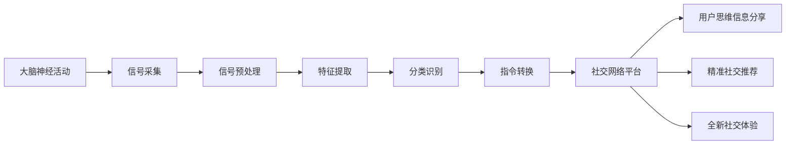

# 巴菲特 - 芒格的脑机接口社交网络投资：思维互联的未来

> 关键词：巴菲特；芒格；脑机接口；社交网络；思维互联；投资；未来趋势

> 摘要：本文围绕巴菲特和芒格对脑机接口社交网络的投资展开探讨。首先介绍了相关背景，包括目的范围、预期读者、文档结构和术语定义等。接着阐述了脑机接口和社交网络的核心概念及其联系，通过示意图和流程图直观呈现。详细讲解了脑机接口的核心算法原理和操作步骤，结合 Python 代码进行说明，并给出了相应的数学模型和公式。在项目实战部分，搭建了开发环境，实现并解读了源代码。分析了脑机接口社交网络的实际应用场景，推荐了学习资源、开发工具框架和相关论文著作。最后总结了未来发展趋势与挑战，解答了常见问题并提供了扩展阅读和参考资料，旨在深入剖析这一投资背后的技术和商业潜力，为相关领域的研究者和从业者提供全面的参考。

## 1. 背景介绍 

### 1.1 目的和范围
本文章旨在深入分析巴菲特 - 芒格对脑机接口社交网络的投资决策，探讨脑机接口技术与社交网络结合所带来的创新机遇和潜在影响。研究范围涵盖脑机接口技术的原理、社交网络的发展现状、二者融合的商业模式，以及这种投资对未来社会、经济和科技发展的可能影响。通过对相关技术、市场和投资策略的研究，为投资者、科技爱好者和行业从业者提供有价值的见解和参考。

### 1.2 预期读者
本文的预期读者包括对投资领域感兴趣的投资者，尤其是关注科技股和新兴产业投资的人群；从事脑机接口、社交网络、人工智能等相关技术研究的科研人员和工程师；对未来科技发展趋势有好奇心的科技爱好者；以及希望了解新兴技术对社会和经济影响的政策制定者和学者。

### 1.3 文档结构概述
本文将按照以下结构进行阐述：首先介绍脑机接口和社交网络的核心概念以及它们之间的联系，通过文本示意图和 Mermaid 流程图进行直观展示；接着详细讲解脑机接口的核心算法原理和具体操作步骤，并结合 Python 代码进行说明；然后给出相关的数学模型和公式，并举例说明；在项目实战部分，将搭建开发环境，实现源代码并进行详细解读；之后分析脑机接口社交网络的实际应用场景；推荐学习资源、开发工具框架和相关论文著作；最后总结未来发展趋势与挑战，解答常见问题并提供扩展阅读和参考资料。

### 1.4 术语表
#### 1.4.1 核心术语定义
- **脑机接口（Brain - Computer Interface，BCI）**：是一种不依赖于常规大脑信息输出通路（外周神经和肌肉组织）的通讯系统，它可以将大脑产生的神经信号转换为能够被计算机识别和处理的指令，从而实现大脑与外部设备的直接交互。
- **社交网络（Social Network）**：是指人与人之间通过互联网建立的各种关系网络，用户可以在其中进行信息分享、交流互动、建立社交关系等活动。
- **思维互联（Thought Interconnection）**：在脑机接口技术的支持下，实现不同个体之间大脑思维信息的直接传输和共享，突破传统语言和文字交流的限制。

#### 1.4.2 相关概念解释
- **神经信号**：是指大脑神经元在活动过程中产生的电信号或化学信号，这些信号包含了大脑的各种信息，如感知、思考、情感等。
- **机器学习**：是一门多领域交叉学科，涉及概率论、统计学、逼近论、凸分析、算法复杂度理论等多门学科。它专门研究计算机怎样模拟或实现人类的学习行为，以获取新的知识或技能，重新组织已有的知识结构使之不断改善自身的性能。
- **深度学习**：是机器学习的一个分支领域，它是一种基于对数据进行表征学习的方法。深度学习通过构建具有很多层的神经网络模型，自动从大量数据中学习特征和模式，从而实现对数据的分类、预测等任务。

#### 1.4.3 缩略词列表
- **BCI**：Brain - Computer Interface（脑机接口）
- **ANN**：Artificial Neural Network（人工神经网络）
- **CNN**：Convolutional Neural Network（卷积神经网络）
- **RNN**：Recurrent Neural Network（循环神经网络）

## 2. 核心概念与联系 

### 脑机接口的原理
脑机接口的基本原理是通过传感器采集大脑产生的神经信号，然后对这些信号进行预处理、特征提取和分类识别，最后将识别结果转换为计算机能够理解和执行的指令。其核心步骤包括：
1. **信号采集**：使用电极、光学传感器等设备记录大脑神经活动产生的电信号或其他生理信号。
2. **信号预处理**：对采集到的原始信号进行滤波、放大、去噪等处理，以提高信号的质量和可分析性。
3. **特征提取**：从预处理后的信号中提取能够反映大脑活动特征的信息，如频率、幅度、相位等。
4. **分类识别**：使用机器学习或深度学习算法对提取的特征进行分类，判断大脑的意图或状态。
5. **指令转换**：将分类识别的结果转换为具体的计算机指令，控制外部设备的运行。

### 社交网络的架构
社交网络通常由用户、内容、社交关系和平台四个要素组成。用户是社交网络的主体，他们在平台上创建和分享内容，建立和维护社交关系。内容可以是文字、图片、视频等各种形式的信息。社交关系包括好友关系、关注关系等，它们构成了社交网络的拓扑结构。平台则是提供社交服务的软件系统，负责用户管理、内容存储、信息传播等功能。

### 脑机接口与社交网络的联系
脑机接口与社交网络的结合将带来全新的社交体验。通过脑机接口技术，用户可以直接将自己的思维信息传输到社交网络平台上，实现更加高效、真实的交流。例如，用户无需通过键盘或语音输入，就可以将自己的想法、感受等以更加直观的方式分享给好友。同时，脑机接口还可以实现更加精准的社交推荐，根据用户的大脑活动特征和社交关系，为用户推荐更加符合其兴趣和需求的内容和好友。

### 文本示意图
```plaintext
脑机接口
|
|-- 信号采集（电极、光学传感器等）
|   |
|   |-- 原始神经信号
|
|-- 信号预处理（滤波、放大、去噪）
|   |
|   |-- 预处理后信号
|
|-- 特征提取（频率、幅度、相位等）
|   |
|   |-- 特征向量
|
|-- 分类识别（机器学习、深度学习）
|   |
|   |-- 大脑意图或状态
|
|-- 指令转换
|   |
|   |-- 计算机指令
|
|-- 社交网络平台
|   |
|   |-- 用户思维信息分享
|   |-- 精准社交推荐
|   |-- 全新社交体验
```

### Mermaid 流程图


## 3. 核心算法原理 & 具体操作步骤 

### 核心算法原理
在脑机接口中，常用的分类识别算法包括人工神经网络（ANN）、卷积神经网络（CNN）和循环神经网络（RNN）等。这里以人工神经网络为例进行介绍。

人工神经网络是一种模仿人类神经系统的计算模型，由大量的神经元组成。每个神经元接收输入信号，经过加权求和和非线性激活函数处理后，输出一个结果。多个神经元相互连接形成网络，通过调整神经元之间的连接权重，使得网络能够学习输入数据的特征和模式，从而实现分类识别任务。

### Python 代码实现
```python
import numpy as np

# 定义激活函数（这里使用 sigmoid 函数）
def sigmoid(x):
    return 1 / (1 + np.exp(-x))

# 定义人工神经网络类
class NeuralNetwork:
    def __init__(self, input_size, hidden_size, output_size):
        # 初始化权重
        self.weights_input_hidden = np.random.rand(input_size, hidden_size)
        self.weights_hidden_output = np.random.rand(hidden_size, output_size)

    def forward(self, X):
        # 前向传播
        self.hidden_input = np.dot(X, self.weights_input_hidden)
        self.hidden_output = sigmoid(self.hidden_input)
        self.final_input = np.dot(self.hidden_output, self.weights_hidden_output)
        self.final_output = sigmoid(self.final_input)
        return self.final_output

# 示例使用
input_size = 10
hidden_size = 5
output_size = 2
nn = NeuralNetwork(input_size, hidden_size, output_size)

# 生成随机输入数据
X = np.random.rand(1, input_size)

# 进行前向传播
output = nn.forward(X)
print("神经网络输出:", output)
```

### 具体操作步骤
1. **数据准备**：收集大脑神经信号数据，并进行标注，将其分为训练集和测试集。
2. **网络初始化**：根据输入数据的维度和分类任务的要求，确定神经网络的结构，包括输入层、隐藏层和输出层的神经元数量，并随机初始化神经元之间的连接权重。
3. **前向传播**：将输入数据传入神经网络，按照神经元的计算规则，依次计算隐藏层和输出层的输出。
4. **损失计算**：根据输出层的输出和标注数据，计算损失函数的值，常用的损失函数包括均方误差（MSE）、交叉熵损失等。
5. **反向传播**：根据损失函数的值，使用梯度下降等优化算法，计算每个权重的梯度，并更新权重，以减小损失函数的值。
6. **重复训练**：重复步骤 3 - 5，直到损失函数的值收敛或达到预设的训练次数。
7. **模型评估**：使用测试集对训练好的模型进行评估，计算分类准确率、召回率等指标，评估模型的性能。

## 4. 数学模型和公式 & 详细讲解 & 举例说明 

### 人工神经网络的数学模型
人工神经网络的数学模型可以用以下公式表示：

#### 神经元的输入输出计算
设第 $i$ 个神经元的输入为 $x_1, x_2, \cdots, x_n$，对应的权重为 $w_{i1}, w_{i2}, \cdots, w_{in}$，偏置为 $b_i$，则该神经元的净输入 $z_i$ 为：
$$z_i = \sum_{j = 1}^{n} w_{ij}x_j + b_i$$

经过激活函数 $\sigma$ 处理后，该神经元的输出 $a_i$ 为：
$$a_i = \sigma(z_i)$$

#### 多层神经网络的前向传播
对于一个包含输入层、隐藏层和输出层的多层神经网络，设输入层有 $n$ 个神经元，隐藏层有 $m$ 个神经元，输出层有 $k$ 个神经元。输入向量为 $\mathbf{x} = [x_1, x_2, \cdots, x_n]^T$，隐藏层的输入向量为 $\mathbf{z}^h$，输出向量为 $\mathbf{a}^h$，输出层的输入向量为 $\mathbf{z}^o$，输出向量为 $\mathbf{a}^o$。

隐藏层的输入计算：
$$\mathbf{z}^h = \mathbf{W}^h\mathbf{x} + \mathbf{b}^h$$
其中，$\mathbf{W}^h$ 是输入层到隐藏层的权重矩阵，$\mathbf{b}^h$ 是隐藏层的偏置向量。

隐藏层的输出计算：
$$\mathbf{a}^h = \sigma(\mathbf{z}^h)$$

输出层的输入计算：
$$\mathbf{z}^o = \mathbf{W}^o\mathbf{a}^h + \mathbf{b}^o$$
其中，$\mathbf{W}^o$ 是隐藏层到输出层的权重矩阵，$\mathbf{b}^o$ 是输出层的偏置向量。

输出层的输出计算：
$$\mathbf{a}^o = \sigma(\mathbf{z}^o)$$

### 损失函数
常用的损失函数有均方误差（MSE）和交叉熵损失。

#### 均方误差（MSE）
对于一个样本，设其真实标签为 $\mathbf{y}$，模型的预测输出为 $\mathbf{\hat{y}}$，则均方误差为：
$$MSE = \frac{1}{2}\sum_{i = 1}^{k}(y_i - \hat{y}_i)^2$$

对于 $N$ 个样本的数据集，均方误差为：
$$MSE = \frac{1}{2N}\sum_{n = 1}^{N}\sum_{i = 1}^{k}(y_{ni} - \hat{y}_{ni})^2$$

#### 交叉熵损失
对于二分类问题，设样本的真实标签为 $y \in \{0, 1\}$，模型的预测输出为 $\hat{y}$，则交叉熵损失为：
$$L = -y\log(\hat{y}) - (1 - y)\log(1 - \hat{y})$$

对于多分类问题，设样本的真实标签为 $\mathbf{y} = [y_1, y_2, \cdots, y_k]^T$（其中只有一个元素为 1，其余为 0），模型的预测输出为 $\mathbf{\hat{y}} = [\hat{y}_1, \hat{y}_2, \cdots, \hat{y}_k]^T$，则交叉熵损失为：
$$L = -\sum_{i = 1}^{k}y_i\log(\hat{y}_i)$$

### 举例说明
假设我们有一个简单的二分类问题，输入数据为 $\mathbf{x} = [0.5, 0.3]$，真实标签为 $y = 1$。我们使用一个包含 2 个输入神经元、3 个隐藏神经元和 1 个输出神经元的神经网络进行分类。

输入层到隐藏层的权重矩阵 $\mathbf{W}^h$ 和偏置向量 $\mathbf{b}^h$ 如下：
$$\mathbf{W}^h = \begin{bmatrix}
0.1 & 0.2 & 0.3\\
0.4 & 0.5 & 0.6
\end{bmatrix}$$
$$\mathbf{b}^h = \begin{bmatrix}
0.1\\
0.2\\
0.3
\end{bmatrix}$$

隐藏层到输出层的权重矩阵 $\mathbf{W}^o$ 和偏置向量 $\mathbf{b}^o$ 如下：
$$\mathbf{W}^o = \begin{bmatrix}
0.7\\
0.8\\
0.9
\end{bmatrix}$$
$$\mathbf{b}^o = [0.1]$$

#### 前向传播计算
隐藏层的输入：
$$\mathbf{z}^h = \mathbf{W}^h\mathbf{x} + \mathbf{b}^h = \begin{bmatrix}
0.1 & 0.2 & 0.3\\
0.4 & 0.5 & 0.6
\end{bmatrix}\begin{bmatrix}
0.5\\
0.3
\end{bmatrix} + \begin{bmatrix}
0.1\\
0.2\\
0.3
\end{bmatrix} = \begin{bmatrix}
0.1\times0.5 + 0.2\times0.3 + 0.1\\
0.4\times0.5 + 0.5\times0.3 + 0.2\\
0.3\times0.5 + 0.6\times0.3 + 0.3
\end{bmatrix} = \begin{bmatrix}
0.1 + 0.06 + 0.1\\
0.2 + 0.15 + 0.2\\
0.15 + 0.18 + 0.3
\end{bmatrix} = \begin{bmatrix}
0.26\\
0.55\\
0.63
\end{bmatrix}$$

隐藏层的输出（使用 sigmoid 激活函数）：
$$\mathbf{a}^h = \sigma(\mathbf{z}^h) = \begin{bmatrix}
\frac{1}{1 + e^{-0.26}}\\
\frac{1}{1 + e^{-0.55}}\\
\frac{1}{1 + e^{-0.63}}
\end{bmatrix} \approx \begin{bmatrix}
0.565\\
0.634\\
0.653
\end{bmatrix}$$

输出层的输入：
$$\mathbf{z}^o = \mathbf{W}^o\mathbf{a}^h + \mathbf{b}^o = \begin{bmatrix}
0.7\\
0.8\\
0.9
\end{bmatrix}^T\begin{bmatrix}
0.565\\
0.634\\
0.653
\end{bmatrix} + 0.1 = 0.7\times0.565 + 0.8\times0.634 + 0.9\times0.653 + 0.1 \approx 1.63$$

输出层的输出（使用 sigmoid 激活函数）：
$$\hat{y} = \sigma(\mathbf{z}^o) = \frac{1}{1 + e^{-1.63}} \approx 0.83$$

#### 损失计算（使用交叉熵损失）
$$L = -y\log(\hat{y}) - (1 - y)\log(1 - \hat{y}) = -1\times\log(0.83) - (1 - 1)\times\log(1 - 0.83) \approx 0.186$$

## 5. 项目实战：代码实际案例和详细解释说明 

### 5.1  开发环境搭建
#### 操作系统
可以选择 Windows、Linux 或 macOS 操作系统，这里以 Ubuntu 18.04 为例进行说明。

#### 编程语言和库
- **Python**：选择 Python 3.7 及以上版本，因为它具有丰富的科学计算和机器学习库。
- **NumPy**：用于数值计算和数组操作。
- **SciPy**：提供了许多科学计算的工具和算法。
- **Scikit - learn**：用于机器学习模型的构建和评估。
- **TensorFlow 或 PyTorch**：用于深度学习模型的开发。

#### 安装步骤
1. 安装 Python
```bash
sudo apt update
sudo apt install python3 python3-pip
```

2. 安装所需库
```bash
pip3 install numpy scipy scikit-learn tensorflow
```

### 5.2  源代码详细实现和代码解读
以下是一个使用 TensorFlow 实现的简单脑机接口分类模型的代码示例：

```python
import tensorflow as tf
from tensorflow.keras.models import Sequential
from tensorflow.keras.layers import Dense
import numpy as np

# 生成示例数据
np.random.seed(0)
X_train = np.random.rand(100, 10)  # 100 个样本，每个样本有 10 个特征
y_train = np.random.randint(0, 2, 100)  # 二分类标签

# 构建模型
model = Sequential([
    Dense(16, activation='relu', input_shape=(10,)),
    Dense(8, activation='relu'),
    Dense(1, activation='sigmoid')
])

# 编译模型
model.compile(optimizer='adam',
              loss='binary_crossentropy',
              metrics=['accuracy'])

# 训练模型
model.fit(X_train, y_train, epochs=10, batch_size=32)

# 生成测试数据
X_test = np.random.rand(20, 10)
y_pred = model.predict(X_test)
y_pred = (y_pred > 0.5).astype(int)
print("预测结果:", y_pred.flatten())
```

### 代码解读与分析
1. **数据生成**：使用 `numpy` 生成随机的训练数据 `X_train` 和对应的二分类标签 `y_train`，以及测试数据 `X_test`。
2. **模型构建**：使用 `Sequential` 模型构建一个简单的神经网络，包含一个输入层、两个隐藏层和一个输出层。输入层有 10 个神经元，对应输入数据的特征数量；第一个隐藏层有 16 个神经元，使用 ReLU 激活函数；第二个隐藏层有 8 个神经元，同样使用 ReLU 激活函数；输出层有 1 个神经元，使用 sigmoid 激活函数，用于二分类任务。
3. **模型编译**：使用 `adam` 优化器，`binary_crossentropy` 损失函数和 `accuracy` 评估指标编译模型。
4. **模型训练**：使用 `fit` 方法对模型进行训练，指定训练的轮数 `epochs` 为 10，批量大小 `batch_size` 为 32。
5. **模型预测**：使用训练好的模型对测试数据进行预测，将预测结果转换为 0 或 1 的二分类标签。

## 6. 实际应用场景 
### 社交沟通
脑机接口社交网络可以实现更加自然、高效的社交沟通。用户无需使用语言或文字，直接通过大脑思维信息进行交流，能够更加准确地表达自己的情感和想法。例如，在虚拟现实社交场景中，用户可以通过脑机接口与其他用户进行沉浸式的交流，仿佛面对面交谈一样。

### 教育领域
在教育领域，脑机接口社交网络可以为学生提供个性化的学习体验。教师可以通过监测学生的大脑活动，了解学生的学习状态和兴趣点，从而调整教学内容和方法。学生之间也可以通过脑机接口分享学习心得和思维过程，促进合作学习。

### 医疗康复
对于一些神经系统疾病患者，如瘫痪患者，脑机接口社交网络可以帮助他们恢复社交能力。通过脑机接口技术，患者可以使用大脑信号控制外部设备，与他人进行交流和互动，提高生活质量。

### 娱乐产业
在娱乐产业中，脑机接口社交网络可以带来全新的游戏和娱乐体验。例如，玩家可以通过大脑思维控制游戏角色的动作和行为，实现更加沉浸式的游戏体验。同时，玩家之间也可以通过脑机接口进行实时的社交互动，增加游戏的趣味性和社交性。

## 7. 工具和资源推荐
### 7.1 学习资源推荐
#### 7.1.1 书籍推荐
- 《深度学习》（Deep Learning）：由 Ian Goodfellow、Yoshua Bengio 和 Aaron Courville 所著，是深度学习领域的经典教材，全面介绍了深度学习的理论和实践。
- 《Python 神经网络编程》（Make Your Own Neural Network）：作者 Tariq Rashid，以通俗易懂的方式介绍了神经网络的基本原理和 Python 实现。
- 《脑机接口：原理与实践》（Brain - Computer Interfaces: Principles and Practice）：详细介绍了脑机接口技术的原理、方法和应用。

#### 7.1.2 在线课程
- Coursera 上的“深度学习专项课程”（Deep Learning Specialization）：由 Andrew Ng 教授授课，系统介绍了深度学习的各个方面。
- edX 上的“脑机接口基础”（Foundations of Brain - Computer Interfaces）：提供了脑机接口技术的基础知识和实践经验。
- 中国大学 MOOC 上的“人工智能基础”：涵盖了人工智能的基本概念、算法和应用，包括脑机接口相关内容。

#### 7.1.3 技术博客和网站
- Medium：上面有许多关于脑机接口、人工智能和社交网络的技术文章和研究成果分享。
- arXiv：提供了大量的学术论文预印本，包括脑机接口领域的最新研究进展。
- OpenBCI 官网：专注于开源脑机接口技术，提供了丰富的硬件和软件资源。

### 7.2 开发工具框架推荐
#### 7.2.1 IDE和编辑器
- PyCharm：是一款专业的 Python 集成开发环境，具有代码编辑、调试、自动补全等功能，适合开发脑机接口和机器学习项目。
- Jupyter Notebook：是一个交互式的开发环境，支持 Python、R 等多种编程语言，方便进行数据探索和模型实验。
- Visual Studio Code：是一款轻量级的代码编辑器，具有丰富的插件生态系统，可以用于 Python 代码的开发和调试。

#### 7.2.2 调试和性能分析工具
- TensorBoard：是 TensorFlow 提供的可视化工具，可以用于可视化模型的训练过程、损失函数变化、网络结构等信息。
- PyTorch Profiler：可以帮助用户分析 PyTorch 模型的性能瓶颈，找出需要优化的部分。
- cProfile：是 Python 自带的性能分析工具，可以统计函数的调用时间和次数，帮助用户优化代码性能。

#### 7.2.3 相关框架和库
- TensorFlow：是一个开源的深度学习框架，提供了丰富的神经网络模型和工具，支持大规模分布式训练。
- PyTorch：是另一个流行的深度学习框架，具有动态图特性，易于使用和调试。
- OpenBCI SDK：是 OpenBCI 提供的软件开发工具包，用于开发脑机接口应用程序。

### 7.3 相关论文著作推荐
#### 7.3.1 经典论文
- “Neural Networks and Deep Learning” by Michael Nielsen：介绍了神经网络和深度学习的基本原理和算法。
- “Brain - Computer Interfaces: Past, Present and Future” by José del R. Millán：回顾了脑机接口技术的发展历程，展望了未来的发展方向。
- “Deep Residual Learning for Image Recognition” by Kaiming He et al.：提出了残差网络（ResNet），在图像识别领域取得了巨大成功。

#### 7.3.2 最新研究成果
- 关注顶级学术会议如 NeurIPS、ICML、CVPR 等，这些会议上会有脑机接口和相关领域的最新研究成果发表。
- 查阅学术期刊如《Journal of Neural Engineering》《IEEE Transactions on Biomedical Engineering》等，获取最新的研究论文。

#### 7.3.3 应用案例分析
- 可以在 IEEE Xplore、ACM Digital Library 等数据库中搜索脑机接口社交网络的应用案例分析论文，了解实际应用中的技术挑战和解决方案。

## 8. 总结：未来发展趋势与挑战
### 未来发展趋势
- **技术融合**：脑机接口技术将与虚拟现实、增强现实、人工智能等技术深度融合，创造出更加沉浸式、智能化的社交体验。
- **应用拓展**：除了社交、教育、医疗等领域，脑机接口社交网络还将在金融、军事、工业等领域得到广泛应用。
- **个性化服务**：根据用户的大脑活动特征和社交行为，提供更加个性化的社交服务和内容推荐。
- **普及化**：随着技术的不断进步和成本的降低，脑机接口社交网络将逐渐走向普及，成为人们日常生活中不可或缺的一部分。

### 挑战
- **技术难题**：目前脑机接口技术还存在信号采集精度低、特征提取困难、分类识别准确率不高等问题，需要进一步提高技术水平。
- **伦理道德问题**：脑机接口社交网络涉及到个人隐私、思维安全等伦理道德问题，需要建立相应的法律法规和伦理准则来规范其发展。
- **社会接受度**：人们对脑机接口技术的接受程度存在差异，需要加强科普宣传，提高公众对该技术的认知和理解。
- **产业生态建设**：脑机接口社交网络的发展需要建立完善的产业生态，包括硬件设备制造商、软件开发商、内容提供商等，目前产业生态还不够成熟。

## 9. 附录：常见问题与解答
### 问题 1：脑机接口技术安全吗？
解答：脑机接口技术在信号采集和传输过程中可能存在一定的安全风险，如信号泄露、数据被篡改等。为了确保安全，需要采用加密技术、身份认证等手段对信号和数据进行保护。同时，还需要建立严格的安全管理制度，规范技术的使用和操作。

### 问题 2：脑机接口社交网络会取代传统社交方式吗？
解答：脑机接口社交网络不会完全取代传统社交方式。虽然它具有更加高效、真实的交流优势，但传统社交方式如面对面交流、电话沟通等也有其独特的情感表达和社交互动价值。未来，脑机接口社交网络将与传统社交方式相互补充，共同满足人们的社交需求。

### 问题 3：脑机接口技术对大脑有伤害吗？
解答：目前大多数脑机接口技术采用非侵入式的信号采集方法，如脑电图（EEG），对大脑没有明显的伤害。但对于一些侵入式的脑机接口技术，如植入电极，可能会对大脑组织造成一定的损伤，需要严格的医学评估和操作规范。

### 问题 4：脑机接口社交网络的开发成本高吗？
解答：脑机接口社交网络的开发成本相对较高，主要包括硬件设备的研发和生产、软件算法的开发和优化、数据的采集和标注等方面。但随着技术的不断进步和规模效应的显现，开发成本有望逐渐降低。

## 10. 扩展阅读 & 参考资料
### 扩展阅读
- 《未来简史：从智人到神人》（Homo Deus: A Brief History of Tomorrow）：作者尤瓦尔·赫拉利，探讨了未来科技发展对人类社会和人类自身的影响，包括脑机接口等新兴技术。
- 《奇点临近》（The Singularity Is Near）：作者雷·库兹韦尔，预测了未来科技发展的趋势，提出了奇点理论，与脑机接口等技术的发展密切相关。

### 参考资料
- 相关学术论文和研究报告，如 IEEE、ACM 等学术组织发表的关于脑机接口和社交网络的论文。
- 行业研究机构发布的市场调研报告，了解脑机接口社交网络的市场规模、发展趋势等信息。
- 科技媒体的报道和分析文章，关注脑机接口和社交网络领域的最新动态和创新成果。

作者：AI天才研究院/AI Genius Institute & 禅与计算机程序设计艺术 /Zen And The Art of Computer Programming