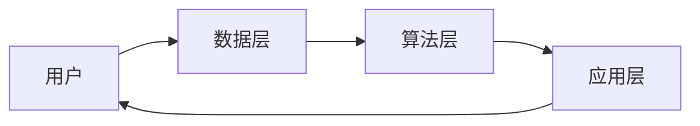
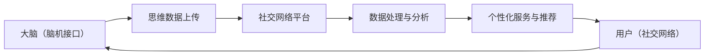

# 巴菲特 - 芒格的脑机接口社交网络投资：思维互联的未来

> 关键词：巴菲特；芒格；脑机接口；社交网络；思维互联；投资；未来趋势

> 摘要：本文聚焦于巴菲特 - 芒格的脑机接口社交网络投资这一前沿话题。深入探讨了脑机接口和社交网络的核心概念及其联系，剖析了相关核心算法原理和数学模型。通过实际案例展示了脑机接口社交网络在项目开发中的具体实现和代码解读。同时，介绍了该领域的实际应用场景、可利用的工具和资源，最后对其未来发展趋势与挑战进行了总结，并解答了常见问题。旨在全面呈现脑机接口社交网络投资背后的技术逻辑和商业潜力，为读者理解这一新兴领域提供深入的视角。

## 1. 背景介绍 
### 1.1 目的和范围
本文章旨在深入剖析巴菲特 - 芒格对脑机接口社交网络的投资行为，从技术、商业和社会影响等多个维度探讨这一投资背后的逻辑以及脑机接口社交网络的发展前景。文章将涵盖脑机接口和社交网络的核心概念、相关算法原理、数学模型、项目实战案例、实际应用场景、可利用的工具资源等内容，为读者全面了解这一新兴领域提供详细的信息。

### 1.2 预期读者
本文的预期读者包括对科技投资感兴趣的投资者、从事脑机接口和社交网络相关领域的技术人员、关注未来科技发展趋势的研究人员以及对新兴科技应用有好奇心的普通读者。通过阅读本文，不同背景的读者可以从各自的角度获取有价值的信息和见解。

### 1.3 文档结构概述
本文共分为十个部分。首先介绍背景信息，包括目的、预期读者和文档结构概述。接着阐述核心概念与联系，展示脑机接口和社交网络的原理及架构。然后详细讲解核心算法原理和数学模型，通过 Python 代码和公式进行说明。之后通过项目实战案例，介绍开发环境搭建、源代码实现和代码解读。再探讨实际应用场景，为读者展示该领域的实际用途。随后推荐相关的工具和资源，包括学习资源、开发工具框架和论文著作。最后总结未来发展趋势与挑战，解答常见问题，并提供扩展阅读和参考资料。

### 1.4 术语表
#### 1.4.1 核心术语定义
- **脑机接口（Brain - Computer Interface, BCI）**：一种在大脑和外部设备之间建立直接通信通道的技术，允许大脑信号被记录、分析和转换为控制命令，以实现对外部设备的操作。
- **社交网络（Social Network）**：基于互联网技术，将个体、组织或群体连接起来，通过信息传播和交互形成的网络结构，用于社交互动、信息共享等。
- **思维互联（Thought Interconnection）**：通过脑机接口技术实现不同个体之间大脑思维信息的直接交流和共享。

#### 1.4.2 相关概念解释
- **神经信号处理**：对从大脑记录到的神经信号进行滤波、特征提取、分类等操作，以获取有意义的信息。
- **深度学习**：一种基于人工神经网络的机器学习方法，能够自动从大量数据中学习特征和模式，在脑机接口和社交网络分析中有着广泛应用。
- **数据可视化**：将抽象的数据以图形、图像等直观的形式展示出来，便于用户理解和分析。

#### 1.4.3 缩略词列表
- **BCI**：Brain - Computer Interface（脑机接口）
- **ANN**：Artificial Neural Network（人工神经网络）
- **CNN**：Convolutional Neural Network（卷积神经网络）
- **RNN**：Recurrent Neural Network（循环神经网络）

## 2. 核心概念与联系 
### 2.1 脑机接口原理
脑机接口的核心原理是通过记录大脑产生的生物电信号，如脑电图（EEG）、脑磁图（MEG）等，对这些信号进行处理和分析，提取出与特定思维或意图相关的特征，然后将这些特征转换为控制外部设备的命令。

其基本架构可以分为信号采集、信号处理、特征提取和命令转换四个部分。信号采集设备（如 EEG 电极帽）负责记录大脑信号；信号处理模块对采集到的原始信号进行滤波、放大等预处理；特征提取模块从处理后的信号中提取出有代表性的特征；命令转换模块将提取的特征转换为具体的控制命令，如鼠标移动、键盘输入等。

以下是脑机接口原理的 Mermaid 流程图：


### 2.2 社交网络原理
社交网络基于用户之间的关系构建网络结构，用户通过注册账号、发布内容、关注其他用户等方式建立社交连接。社交网络平台通过算法对用户的行为数据进行分析，为用户推荐感兴趣的内容、好友等。

其基本架构包括用户层、数据层、算法层和应用层。用户层是社交网络的使用者；数据层负责存储用户的个人信息、行为数据等；算法层利用各种算法对数据进行分析和处理，如推荐算法、社交关系分析算法等；应用层为用户提供各种服务和功能，如消息传递、内容分享等。

以下是社交网络原理的 Mermaid 流程图：


### 2.3 脑机接口与社交网络的联系
脑机接口与社交网络的结合，将实现思维层面的社交互动。通过脑机接口技术，用户可以直接将自己的思维信息转化为数字信号，上传到社交网络平台，与其他用户进行交流和分享。这种方式打破了传统语言和文字交流的限制，实现了更加高效、直观的信息传递。

同时，社交网络平台可以利用脑机接口采集到的用户思维数据，为用户提供更加个性化的服务和推荐。例如，根据用户的思维偏好推荐感兴趣的话题、好友等。

以下是脑机接口与社交网络结合的 Mermaid 流程图：


## 3. 核心算法原理 & 具体操作步骤 
### 3.1 脑机接口信号处理算法
在脑机接口中，常用的信号处理算法包括滤波算法和特征提取算法。以下是使用 Python 实现的简单示例：

```python
import numpy as np
import scipy.signal as signal

# 模拟采集到的脑电信号
eeg_signal = np.random.randn(1000)

# 设计一个低通滤波器
def lowpass_filter(signal, cutoff_freq, fs, order=4):
    nyquist_freq = 0.5 * fs
    normal_cutoff = cutoff_freq / nyquist_freq
    b, a = signal.butter(order, normal_cutoff, btype='low', analog=False)
    filtered_signal = signal.lfilter(b, a, signal)
    return filtered_signal

# 应用低通滤波器
fs = 100  # 采样频率
cutoff_freq = 30  # 截止频率
filtered_eeg = lowpass_filter(eeg_signal, cutoff_freq, fs)

# 特征提取：计算信号的均值和方差
mean_value = np.mean(filtered_eeg)
variance = np.var(filtered_eeg)

print(f"滤波后信号的均值: {mean_value}")
print(f"滤波后信号的方差: {variance}")
```

### 3.2 社交网络推荐算法
社交网络中常用的推荐算法是基于协同过滤的算法。以下是一个简单的基于用户的协同过滤推荐算法的 Python 实现：

```python
import numpy as np

# 用户 - 物品评分矩阵
ratings = np.array([
    [5, 3, 0, 1],
    [4, 0, 0, 1],
    [1, 1, 0, 5],
    [1, 0, 0, 4],
    [0, 1, 5, 4]
])

# 计算用户之间的相似度（使用余弦相似度）
def cosine_similarity(user1, user2):
    dot_product = np.dot(user1, user2)
    norm_user1 = np.linalg.norm(user1)
    norm_user2 = np.linalg.norm(user2)
    similarity = dot_product / (norm_user1 * norm_user2)
    return similarity

# 找到与目标用户最相似的 k 个用户
def find_similar_users(target_user, ratings, k):
    num_users = ratings.shape[0]
    similarities = []
    for i in range(num_users):
        if i!= target_user:
            similarity = cosine_similarity(ratings[target_user], ratings[i])
            similarities.append((i, similarity))
    similarities.sort(key=lambda x: x[1], reverse=True)
    return similarities[:k]

# 为目标用户推荐物品
def recommend_items(target_user, ratings, k):
    similar_users = find_similar_users(target_user, ratings, k)
    num_items = ratings.shape[1]
    item_scores = np.zeros(num_items)
    for user, similarity in similar_users:
        for item in range(num_items):
            if ratings[target_user][item] == 0:
                item_scores[item] += similarity * ratings[user][item]
    recommended_items = np.argsort(item_scores)[::-1]
    return recommended_items

# 为用户 0 推荐物品
target_user = 0
k = 2
recommended_items = recommend_items(target_user, ratings, k)
print(f"为用户 {target_user} 推荐的物品编号: {recommended_items}")
```

### 3.3 具体操作步骤
#### 脑机接口部分
1. **信号采集**：使用合适的脑机接口设备（如 EEG 电极帽）采集大脑信号。
2. **信号预处理**：对采集到的原始信号进行滤波、放大等操作，去除噪声和干扰。
3. **特征提取**：从预处理后的信号中提取出与特定思维或意图相关的特征。
4. **特征分类**：使用机器学习或深度学习算法对提取的特征进行分类，确定用户的思维状态。
5. **命令转换**：将分类结果转换为控制外部设备的命令。

#### 社交网络部分
1. **用户注册与登录**：用户在社交网络平台上注册账号并登录。
2. **数据收集**：平台收集用户的个人信息、行为数据等。
3. **数据处理与分析**：使用各种算法对收集到的数据进行处理和分析，如推荐算法、社交关系分析算法等。
4. **个性化服务与推荐**：根据数据分析结果为用户提供个性化的服务和推荐，如推荐感兴趣的内容、好友等。
5. **用户交互**：用户与平台进行交互，如发布内容、评论、点赞等。

## 4. 数学模型和公式 & 详细讲解 & 举例说明 
### 4.1 脑机接口数学模型
#### 信号采集模型
脑机接口信号采集过程可以用以下线性模型表示：
$$x(t) = s(t) + n(t)$$
其中，$x(t)$ 是采集到的原始信号，$s(t)$ 是大脑产生的真实信号，$n(t)$ 是噪声信号。

#### 滤波模型
低通滤波器的传递函数可以用以下公式表示：
$$H(z)=\frac{b_0 + b_1z^{-1}+\cdots + b_Mz^{-M}}{1 + a_1z^{-1}+\cdots + a_Nz^{-N}}$$
其中，$b_i$ 和 $a_i$ 是滤波器的系数，$M$ 和 $N$ 分别是滤波器的分子和分母阶数。

#### 特征提取模型
常用的特征提取方法是计算信号的统计特征，如均值、方差等。信号 $x$ 的均值 $\mu$ 和方差 $\sigma^2$ 可以用以下公式计算：
$$\mu=\frac{1}{N}\sum_{i = 1}^{N}x_i$$
$$\sigma^2=\frac{1}{N}\sum_{i = 1}^{N}(x_i-\mu)^2$$
其中，$N$ 是信号的长度，$x_i$ 是信号的第 $i$ 个样本。

### 4.2 社交网络数学模型
#### 社交图模型
社交网络可以用图 $G=(V, E)$ 来表示，其中 $V$ 是节点集合，表示社交网络中的用户；$E$ 是边集合，表示用户之间的关系。边可以有权重，表示关系的强度。

#### 协同过滤模型
基于用户的协同过滤推荐算法中，用户 $u$ 对物品 $i$ 的预测评分 $\hat{r}_{ui}$ 可以用以下公式计算：
$$\hat{r}_{ui}=\bar{r}_u+\frac{\sum_{v\in N(u)}sim(u, v)(r_{vi}-\bar{r}_v)}{\sum_{v\in N(u)}|sim(u, v)|}$$
其中，$\bar{r}_u$ 是用户 $u$ 的平均评分，$N(u)$ 是与用户 $u$ 最相似的用户集合，$sim(u, v)$ 是用户 $u$ 和用户 $v$ 的相似度，$r_{vi}$ 是用户 $v$ 对物品 $i$ 的评分，$\bar{r}_v$ 是用户 $v$ 的平均评分。

### 4.3 举例说明
#### 脑机接口举例
假设我们采集到一段长度为 100 的脑电信号 $x=[1, 2, 3, \cdots, 100]$，我们可以计算其均值和方差：
$$\mu=\frac{1}{100}\sum_{i = 1}^{100}i=\frac{100\times(100 + 1)}{2\times100}=50.5$$
$$\sigma^2=\frac{1}{100}\sum_{i = 1}^{100}(i - 50.5)^2=\frac{1}{100}\times\left(\sum_{i = 1}^{100}i^2-101\times\sum_{i = 1}^{100}i + 100\times50.5^2\right)$$
根据平方和公式 $\sum_{i = 1}^{n}i^2=\frac{n(n + 1)(2n + 1)}{6}$，可得：
$$\sum_{i = 1}^{100}i^2=\frac{100\times(100 + 1)\times(2\times100 + 1)}{6}=338350$$
$$\sum_{i = 1}^{100}i = 5050$$
代入可得：
$$\sigma^2=\frac{1}{100}\times(338350-101\times5050 + 100\times50.5^2)=833.25$$

#### 社交网络举例
假设用户 - 物品评分矩阵如下：
$$
\begin{bmatrix}
5 & 3 & 0 & 1 \\
4 & 0 & 0 & 1 \\
1 & 1 & 0 & 5 \\
1 & 0 & 0 & 4 \\
0 & 1 & 5 & 4
\end{bmatrix}
$$
我们要为用户 0 推荐物品。首先计算用户 0 与其他用户的相似度，假设使用余弦相似度。以用户 0 和用户 1 为例：
$$sim(0, 1)=\frac{5\times4 + 3\times0+0\times0 + 1\times1}{\sqrt{5^2 + 3^2+0^2 + 1^2}\times\sqrt{4^2 + 0^2+0^2 + 1^2}}=\frac{21}{\sqrt{35}\times\sqrt{17}}\approx0.85$$
然后找到与用户 0 最相似的 $k$ 个用户，根据这些用户的评分计算用户 0 对未评分物品的预测评分，最后推荐预测评分高的物品。

## 5. 项目实战：代码实际案例和详细解释说明 
### 5.1  开发环境搭建
#### 硬件环境
- **脑机接口设备**：选择合适的脑机接口设备，如 OpenBCI、Emotiv Insight 等。这些设备可以采集大脑的生物电信号，并通过 USB 或蓝牙等接口将信号传输到计算机。
- **计算机**：需要一台性能较好的计算机，具备足够的内存和处理能力。建议使用 Windows、Linux 或 macOS 操作系统。

#### 软件环境
- **Python 环境**：安装 Python 3.x 版本，并使用 pip 安装必要的库，如 NumPy、SciPy、TensorFlow、Keras 等。
```bash
pip install numpy scipy tensorflow keras
```
- **开发工具**：可以使用 PyCharm、Jupyter Notebook 等开发工具进行代码编写和调试。

### 5.2  源代码详细实现和代码解读
#### 脑机接口信号处理与分类
```python
import numpy as np
import scipy.signal as signal
from sklearn.model_selection import train_test_split
from sklearn.svm import SVC

# 模拟采集到的脑电信号
def generate_eeg_data(num_samples, num_channels, num_classes):
    data = []
    labels = []
    for i in range(num_classes):
        class_data = np.random.randn(num_samples, num_channels)
        data.extend(class_data)
        labels.extend([i] * num_samples)
    data = np.array(data)
    labels = np.array(labels)
    return data, labels

# 信号预处理：低通滤波
def preprocess_signal(signal, cutoff_freq, fs, order=4):
    nyquist_freq = 0.5 * fs
    normal_cutoff = cutoff_freq / nyquist_freq
    b, a = signal.butter(order, normal_cutoff, btype='low', analog=False)
    filtered_signal = signal.lfilter(b, a, signal, axis=0)
    return filtered_signal

# 特征提取：计算信号的均值和方差
def extract_features(signal):
    mean_values = np.mean(signal, axis=0)
    variance_values = np.var(signal, axis=0)
    features = np.concatenate((mean_values, variance_values))
    return features

# 数据准备
num_samples = 100
num_channels = 8
num_classes = 2
data, labels = generate_eeg_data(num_samples, num_channels, num_classes)

# 信号预处理
fs = 100
cutoff_freq = 30
preprocessed_data = preprocess_signal(data, cutoff_freq, fs)

# 特征提取
features = []
for sample in preprocessed_data:
    feature = extract_features(sample)
    features.append(feature)
features = np.array(features)

# 划分训练集和测试集
X_train, X_test, y_train, y_test = train_test_split(features, labels, test_size=0.2, random_state=42)

# 训练分类器
clf = SVC(kernel='linear')
clf.fit(X_train, y_train)

# 测试分类器
accuracy = clf.score(X_test, y_test)
print(f"分类准确率: {accuracy}")
```

**代码解读**：
1. **数据生成**：`generate_eeg_data` 函数用于生成模拟的脑电信号数据，包含多个样本、多个通道和多个类别。
2. **信号预处理**：`preprocess_signal` 函数使用低通滤波器对信号进行滤波，去除高频噪声。
3. **特征提取**：`extract_features` 函数计算信号的均值和方差作为特征。
4. **数据划分**：使用 `train_test_split` 函数将数据划分为训练集和测试集。
5. **模型训练和测试**：使用支持向量机（SVM）作为分类器，训练模型并测试其准确率。

#### 社交网络推荐系统
```python
import numpy as np
from sklearn.metrics.pairwise import cosine_similarity

# 用户 - 物品评分矩阵
ratings = np.array([
    [5, 3, 0, 1],
    [4, 0, 0, 1],
    [1, 1, 0, 5],
    [1, 0, 0, 4],
    [0, 1, 5, 4]
])

# 计算用户之间的相似度
def compute_user_similarity(ratings):
    similarity_matrix = cosine_similarity(ratings)
    return similarity_matrix

# 为目标用户推荐物品
def recommend_items(target_user, ratings, similarity_matrix, k):
    num_items = ratings.shape[1]
    item_scores = np.zeros(num_items)
    similar_users = np.argsort(similarity_matrix[target_user])[::-1][1:k + 1]
    for user in similar_users:
        for item in range(num_items):
            if ratings[target_user][item] == 0:
                item_scores[item] += similarity_matrix[target_user][user] * ratings[user][item]
    recommended_items = np.argsort(item_scores)[::-1]
    return recommended_items

# 计算用户相似度矩阵
similarity_matrix = compute_user_similarity(ratings)

# 为用户 0 推荐物品
target_user = 0
k = 2
recommended_items = recommend_items(target_user, ratings, similarity_matrix, k)
print(f"为用户 {target_user} 推荐的物品编号: {recommended_items}")
```

**代码解读**：
1. **相似度计算**：`compute_user_similarity` 函数使用余弦相似度计算用户之间的相似度矩阵。
2. **物品推荐**：`recommend_items` 函数根据用户相似度矩阵为目标用户推荐未评分的物品。
3. **结果输出**：输出为目标用户推荐的物品编号。

### 5.3  代码解读与分析
#### 脑机接口部分
- **数据生成**：模拟生成的脑电信号数据可以帮助我们在没有实际采集设备的情况下进行算法测试和验证。
- **信号预处理**：低通滤波可以去除信号中的高频噪声，提高信号的质量。
- **特征提取**：计算均值和方差是一种简单有效的特征提取方法，可以将高维的信号数据转换为低维的特征向量。
- **模型训练和测试**：使用 SVM 作为分类器可以对不同类别的脑电信号进行分类，准确率可以反映算法的性能。

#### 社交网络部分
- **相似度计算**：余弦相似度可以衡量用户之间的兴趣相似度，为物品推荐提供基础。
- **物品推荐**：根据用户相似度和其他用户的评分，为目标用户推荐可能感兴趣的物品。
- **结果分析**：推荐的物品编号可以帮助我们了解推荐算法的效果，进一步优化算法。

## 6. 实际应用场景 
### 6.1 社交互动
脑机接口社交网络可以实现更加自然和高效的社交互动。用户可以直接通过思维与其他用户进行交流，无需使用语言或文字。例如，在虚拟现实社交场景中，用户可以通过脑机接口将自己的情感、想法等信息直接传递给其他用户，增强社交体验的真实感和沉浸感。

### 6.2 教育领域
在教育领域，脑机接口社交网络可以为学生提供个性化的学习体验。教师可以通过脑机接口了解学生的学习状态和思维过程，及时调整教学策略。学生之间也可以通过脑机接口分享学习心得和思维方法，促进学习效果的提升。

### 6.3 医疗康复
对于一些患有神经系统疾病或运动障碍的患者，脑机接口社交网络可以帮助他们恢复社交能力。患者可以通过脑机接口与外界进行交流，参与社交活动，缓解孤独感和心理压力。同时，医生可以通过脑机接口监测患者的大脑状态，制定更加有效的康复方案。

### 6.4 娱乐产业
在娱乐产业中，脑机接口社交网络可以为用户带来全新的娱乐体验。例如，在游戏中，玩家可以通过脑机接口控制游戏角色的行为，与其他玩家进行更加真实的互动。在影视创作中，创作者可以通过脑机接口获取观众的情感反馈，制作出更加符合观众需求的作品。

## 7. 工具和资源推荐
### 7.1 学习资源推荐
#### 7.1.1 书籍推荐
- 《脑机接口：原理、技术及应用》：全面介绍了脑机接口的基本原理、技术方法和应用领域，是学习脑机接口的经典书籍。
- 《社交网络分析》：详细讲解了社交网络的分析方法和模型，对于理解社交网络的结构和动态有很大帮助。
- 《深度学习》：深度学习在脑机接口和社交网络中都有广泛应用，这本书是深度学习领域的权威著作。

#### 7.1.2 在线课程
- Coursera 上的“Brain - Computer Interfaces”课程：由知名高校的教授授课，系统介绍了脑机接口的相关知识和技术。
- edX 上的“Social Network Analysis”课程：提供了丰富的社交网络分析案例和实践项目，帮助学习者掌握社交网络分析的方法和工具。
- Udemy 上的“Deep Learning A - Z™: Hands - On Artificial Neural Networks”课程：通过实际项目让学习者深入了解深度学习的应用和开发。

#### 7.1.3 技术博客和网站
- Brain - Computer Interface Society（BCIS）官网：提供了脑机接口领域的最新研究成果、会议信息和学术资源。
- Social Network Analysis Blog：分享了社交网络分析的最新技术和应用案例。
- Medium 上的深度学习和脑机接口相关博客：有很多开发者和研究者分享自己的经验和见解。

### 7.2 开发工具框架推荐
#### 7.2.1 IDE和编辑器
- PyCharm：功能强大的 Python 集成开发环境，支持代码调试、版本控制等功能，适合开发脑机接口和社交网络相关的 Python 项目。
- Jupyter Notebook：交互式的开发环境，适合进行数据分析、模型训练和实验验证。
- Visual Studio Code：轻量级的代码编辑器，支持多种编程语言和插件扩展，方便进行项目开发和管理。

#### 7.2.2 调试和性能分析工具
- TensorBoard：TensorFlow 提供的可视化工具，可以帮助开发者监控模型的训练过程、分析模型的性能。
- Py-Spy：用于分析 Python 代码的性能瓶颈，找出代码中的耗时操作。
- cProfile：Python 内置的性能分析工具，可以统计函数的调用次数和执行时间。

#### 7.2.3 相关框架和库
- TensorFlow：开源的深度学习框架，提供了丰富的神经网络模型和工具，可用于脑机接口信号处理和分类。
- Keras：基于 TensorFlow 的高级神经网络 API，简化了深度学习模型的开发过程。
- NetworkX：用于构建、操作和研究复杂网络的 Python 库，可用于社交网络分析。

### 7.3 相关论文著作推荐
#### 7.3.1 经典论文
- “A Practical Guide to Brain - Computer Interface Design”：为脑机接口的设计和开发提供了实用的指导原则。
- “The Structure and Dynamics of Online Social Networks”：深入研究了在线社交网络的结构和动态特性。
- “Deep Learning in Brain - Computer Interfaces: A Review”：综述了深度学习在脑机接口中的应用和研究进展。

#### 7.3.2 最新研究成果
- 关注 IEEE Transactions on Neural Systems and Rehabilitation Engineering、ACM Transactions on Intelligent Systems and Technology 等学术期刊，获取脑机接口和社交网络领域的最新研究成果。
- 参加相关的学术会议，如 IEEE International Conference on Brain - Computer Interfaces、ACM SIGKDD Conference on Knowledge Discovery and Data Mining，了解最新的研究动态和趋势。

#### 7.3.3 应用案例分析
- 一些科技公司的官方博客和研究报告中会分享脑机接口和社交网络的应用案例，如 Facebook 的脑机接口研究进展、Twitter 的社交网络分析案例等。
- 学术数据库中的案例研究论文，详细分析了脑机接口和社交网络在不同领域的应用效果和挑战。

## 8. 总结：未来发展趋势与挑战
### 8.1 未来发展趋势
#### 技术创新
脑机接口技术将不断创新，信号采集设备将更加小型化、便携化和高精度化。同时，深度学习、人工智能等技术将与脑机接口深度融合，提高信号处理和分类的准确率。社交网络平台也将不断优化算法，提供更加个性化、智能化的服务。

#### 应用拓展
脑机接口社交网络的应用领域将不断拓展，除了社交互动、教育、医疗康复和娱乐产业外，还可能应用于智能家居、智能交通、工业控制等领域。例如，用户可以通过脑机接口控制智能家居设备，实现更加便捷的生活方式。

#### 产业融合
脑机接口和社交网络产业将与其他产业深度融合，形成新的产业生态。例如，与医疗产业融合可以开发出更加先进的医疗设备和康复方案；与娱乐产业融合可以创造出更加沉浸式的娱乐体验。

### 8.2 挑战
#### 技术难题
脑机接口技术还面临一些技术难题，如信号采集的准确性和稳定性、信号处理的复杂性、大脑认知的解码等。这些问题需要进一步的研究和技术突破来解决。

#### 伦理和法律问题
脑机接口社交网络涉及到用户的隐私和个人信息安全等伦理和法律问题。例如，如何保护用户的思维数据不被泄露和滥用，如何规范脑机接口技术的使用等。

#### 社会接受度
脑机接口社交网络作为一种新兴技术，社会接受度可能是一个挑战。一些人可能对直接将大脑与外部设备连接存在担忧和恐惧，需要加强宣传和教育，提高社会对该技术的认知和接受度。

## 9. 附录：常见问题与解答
### 9.1 脑机接口社交网络安全吗？
脑机接口社交网络的安全性是一个重要问题。目前，研究人员正在采取多种措施来保障其安全性，如使用加密技术保护用户的思维数据、建立严格的访问控制机制等。然而，由于该技术还处于发展阶段，仍然存在一定的安全风险，需要不断加强技术研发和安全管理。

### 9.2 脑机接口社交网络会取代传统社交方式吗？
脑机接口社交网络不会完全取代传统社交方式。虽然它可以提供更加高效和直接的交流方式，但传统社交方式中的情感表达、身体语言等元素是无法被替代的。未来，脑机接口社交网络将与传统社交方式相互补充，共同满足人们的社交需求。

### 9.3 普通人可以使用脑机接口社交网络吗？
目前，脑机接口技术的成本较高，设备也相对复杂，普通人使用存在一定的困难。但随着技术的不断发展和成本的降低，脑机接口社交网络有望逐渐普及，普通人也可以使用。

### 9.4 脑机接口社交网络会对人类大脑产生影响吗？
目前的研究表明，正常使用脑机接口设备不会对人类大脑产生明显的负面影响。但长期使用脑机接口设备可能会对大脑的神经可塑性产生一定的影响，需要进一步的研究来评估。

## 10. 扩展阅读 & 参考资料
### 10.1 扩展阅读
- 《未来简史：从智人到智神》：探讨了科技发展对人类未来的影响，包括脑机接口等新兴技术。
- 《失控：全人类的最终命运和结局》：介绍了复杂系统的发展规律和趋势，对理解脑机接口社交网络的发展有一定的启示。

### 10.2 参考资料
- 相关学术期刊和会议论文，如 IEEE Transactions on Neural Systems and Rehabilitation Engineering、ACM SIGKDD Conference on Knowledge Discovery and Data Mining 等。
- 科技公司的官方网站和研究报告，如 Facebook、Neuralink 等公司的相关资料。
- 专业书籍和在线课程，如前文推荐的《脑机接口：原理、技术及应用》、Coursera 上的“Brain - Computer Interfaces”课程等。

作者：AI天才研究院/AI Genius Institute & 禅与计算机程序设计艺术 /Zen And The Art of Computer Programming