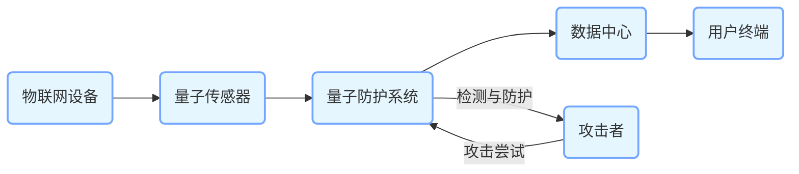

# 巴菲特 - 芒格的量子传感器网络安全投资：物联网的量子防护

> 关键词：巴菲特-芒格、量子传感器、网络安全、物联网、量子防护

> 摘要：本文聚焦于巴菲特 - 芒格在量子传感器网络安全领域的投资，深入探讨其与物联网量子防护的关联。首先介绍相关背景知识，包括目的、预期读者、文档结构和术语表。接着阐述核心概念与联系，剖析量子传感器和物联网量子防护的原理及架构，并通过 Mermaid 流程图展示。详细讲解核心算法原理，结合 Python 代码说明。分析相关数学模型和公式，并举例。通过项目实战，给出代码实际案例及详细解释。探讨该领域的实际应用场景，推荐学习资源、开发工具框架和相关论文著作。最后总结未来发展趋势与挑战，解答常见问题，并提供扩展阅读和参考资料。

## 1. 背景介绍 
### 1.1 目的和范围
随着物联网（IoT）技术的飞速发展，大量设备相互连接，形成了一个庞大而复杂的网络。然而，物联网设备的安全问题日益凸显，传统的网络安全防护手段在面对日益复杂的攻击时显得力不从心。量子技术的出现为物联网安全带来了新的希望。巴菲特 - 芒格的投资表明他们对量子传感器在网络安全领域的潜力充满信心。本文的目的是深入分析量子传感器如何为物联网提供量子防护，探讨相关技术原理、实际应用和发展趋势。范围涵盖量子传感器的基本原理、物联网面临的安全挑战、量子防护的具体实现以及巴菲特 - 芒格投资的意义和影响。

### 1.2 预期读者
本文的预期读者包括对投资、网络安全、量子技术和物联网感兴趣的专业人士，如投资者、网络安全工程师、量子物理学家、物联网开发者等。同时，也适合对新兴技术有一定了解，希望深入学习量子传感器和物联网安全相关知识的技术爱好者。

### 1.3 文档结构概述
本文将按照以下结构展开：首先介绍背景知识，包括目的、读者和文档结构等。然后详细阐述核心概念与联系，展示相关的原理和架构。接着讲解核心算法原理和具体操作步骤，结合 Python 代码进行说明。分析数学模型和公式，并举例加深理解。通过项目实战，给出代码实际案例和详细解释。探讨实际应用场景，推荐学习资源、开发工具框架和相关论文著作。最后总结未来发展趋势与挑战，解答常见问题，并提供扩展阅读和参考资料。

### 1.4 术语表
#### 1.4.1 核心术语定义
- **量子传感器**：基于量子力学原理设计的传感器，能够利用量子特性（如量子纠缠、量子叠加等）实现高灵敏度、高精度的测量。
- **物联网（IoT）**：通过各种信息传感设备，如射频识别（RFID）装置、红外感应器、全球定位系统、激光扫描器等，按约定的协议，把任何物品与互联网相连接，进行信息交换和通信，以实现智能化识别、定位、跟踪、监控和管理的一种网络。
- **量子防护**：利用量子技术（如量子密钥分发、量子加密等）为信息系统提供安全防护，抵御各种网络攻击。
- **网络安全**：保护网络系统中的硬件、软件和数据不受未经授权的访问、破坏、更改或泄露。

#### 1.4.2 相关概念解释
- **量子纠缠**：是指两个或多个量子系统之间存在的一种非定域、非经典的强关联现象。处于纠缠态的量子系统，无论它们之间的距离有多远，一个系统的状态变化会立即影响另一个系统的状态。
- **量子叠加**：量子系统可以同时处于多个不同的状态，直到被测量时才会坍缩到一个确定的状态。这种特性使得量子计算机能够同时处理多个计算任务，大大提高了计算效率。
- **量子密钥分发（QKD）**：基于量子力学原理，通过量子信道在通信双方之间安全地分发密钥。由于量子的不可克隆定理，任何试图窃取密钥的行为都会被发现，从而保证了密钥的安全性。

#### 1.4.3 缩略词列表
- **IoT**：Internet of Things（物联网）
- **QKD**：Quantum Key Distribution（量子密钥分发）
- **RFID**：Radio Frequency Identification（射频识别）

## 2. 核心概念与联系 
### 核心概念原理
#### 量子传感器原理
量子传感器利用量子系统的特性来实现高精度的测量。例如，基于原子的量子传感器可以利用原子的能级跃迁来检测外界物理量的变化。当外界物理量（如磁场、电场、温度等）发生变化时，原子的能级会发生相应的改变，通过测量原子能级的变化就可以得到外界物理量的信息。

量子传感器的高灵敏度和高精度得益于量子力学的基本原理。量子系统的量子态可以用波函数来描述，波函数的演化遵循薛定谔方程。在量子传感器中，通过精确控制量子系统的波函数，可以实现对微小物理量的检测。

#### 物联网安全原理
物联网设备通常通过无线通信网络连接到互联网，这使得它们容易受到各种网络攻击，如黑客入侵、数据泄露、拒绝服务攻击等。物联网安全的核心是保护设备和数据的机密性、完整性和可用性。

传统的物联网安全防护手段主要包括加密技术、访问控制、防火墙等。然而，随着量子计算机的发展，传统的加密算法可能会受到威胁。量子计算机具有强大的计算能力，可以在短时间内破解传统的加密算法，从而导致物联网设备和数据的安全受到严重威胁。

#### 量子防护原理
量子防护利用量子技术为物联网提供安全防护。其中，量子密钥分发是量子防护的重要手段之一。量子密钥分发基于量子力学的基本原理，如量子不可克隆定理和量子纠缠，能够在通信双方之间安全地分发密钥。由于任何试图窃取密钥的行为都会被发现，因此量子密钥分发可以保证密钥的安全性。

此外，量子加密技术也可以用于保护物联网设备和数据的安全。量子加密技术利用量子态的特性来实现加密，使得加密信息具有更高的安全性。

### 架构示意图


该架构图展示了量子传感器在物联网安全防护中的作用。物联网设备通过量子传感器采集数据，量子传感器将采集到的数据传输到量子防护系统进行处理和保护。量子防护系统可以检测和抵御来自攻击者的攻击，确保数据的安全传输到数据中心。最终，数据中心将处理后的数据发送到用户终端。

## 3. 核心算法原理 & 具体操作步骤 
### 量子密钥分发算法原理
量子密钥分发（QKD）的核心算法之一是 BB84 协议。BB84 协议是由 Bennett 和 Brassard 在 1984 年提出的，是最早的量子密钥分发协议之一。

#### 算法原理
BB84 协议基于量子比特的两种不同的基（如直角基和对角基）来编码信息。发送方（Alice）随机选择基和量子比特的状态，并将其发送给接收方（Bob）。Bob 也随机选择基来测量接收到的量子比特。然后，Alice 和 Bob 通过经典信道公开他们所选择的基，但不公开量子比特的状态。他们只保留那些选择相同基的测量结果，这些结果就构成了密钥。

由于量子的不可克隆定理，任何试图窃取密钥的行为都会改变量子比特的状态，从而被 Alice 和 Bob 发现。

#### Python 代码实现
```python
import random

# 定义量子比特的基
BASIS = ['rect', 'diag']

# 生成随机的基序列
def generate_basis(length):
    return [random.choice(BASIS) for _ in range(length)]

# 生成随机的比特序列
def generate_bits(length):
    return [random.randint(0, 1) for _ in range(length)]

# 编码量子比特
def encode_qubits(bits, bases):
    qubits = []
    for bit, basis in zip(bits, bases):
        if basis == 'rect':
            if bit == 0:
                qubits.append('|0>')
            else:
                qubits.append('|1>')
        else:
            if bit == 0:
                qubits.append('|+>')
            else:
                qubits.append('|->')
    return qubits

# 测量量子比特
def measure_qubits(qubits, bases):
    results = []
    for qubit, basis in zip(qubits, bases):
        if basis == 'rect':
            if qubit in ['|0>', '|+>']:
                results.append(0)
            else:
                results.append(1)
        else:
            if qubit in ['|0>', '|1>']:
                results.append(random.randint(0, 1))
            elif qubit == '|+>':
                results.append(0)
            else:
                results.append(1)
    return results

# 筛选相同基的结果
def sift_bits(bits, alice_bases, bob_bases):
    sifted_bits = []
    for i in range(len(bits)):
        if alice_bases[i] == bob_bases[i]:
            sifted_bits.append(bits[i])
    return sifted_bits

# 主函数
def bb84_protocol(length):
    # Alice 生成基和比特序列
    alice_bases = generate_basis(length)
    alice_bits = generate_bits(length)
    # Alice 编码量子比特
    qubits = encode_qubits(alice_bits, alice_bases)
    # Bob 生成基序列
    bob_bases = generate_basis(length)
    # Bob 测量量子比特
    bob_results = measure_qubits(qubits, bob_bases)
    # 筛选相同基的结果
    sifted_alice_bits = sift_bits(alice_bits, alice_bases, bob_bases)
    sifted_bob_bits = sift_bits(bob_results, alice_bases, bob_bases)
    return sifted_alice_bits, sifted_bob_bits

# 测试
length = 10
alice_key, bob_key = bb84_protocol(length)
print("Alice's key:", alice_key)
print("Bob's key:", bob_key)
```

### 具体操作步骤
1. **生成基和比特序列**：发送方（Alice）和接收方（Bob）分别随机生成基序列和比特序列。
2. **编码量子比特**：Alice 根据自己的基序列和比特序列编码量子比特，并将其发送给 Bob。
3. **测量量子比特**：Bob 根据自己的基序列测量接收到的量子比特。
4. **公开基信息**：Alice 和 Bob 通过经典信道公开他们所选择的基。
5. **筛选相同基的结果**：Alice 和 Bob 只保留那些选择相同基的测量结果，这些结果就构成了密钥。

## 4. 数学模型和公式 & 详细讲解 & 举例说明 
### 量子态的数学表示
量子态可以用希尔伯特空间中的向量来表示。例如，一个量子比特的状态可以用二维希尔伯特空间中的向量来表示：

$$
|\psi\rangle = \alpha|0\rangle + \beta|1\rangle
$$

其中，$|0\rangle$ 和 $|1\rangle$ 是量子比特的两个基态，$\alpha$ 和 $\beta$ 是复数，满足 $|\alpha|^2 + |\beta|^2 = 1$。$|\alpha|^2$ 表示测量量子比特得到 $|0\rangle$ 态的概率，$|\beta|^2$ 表示测量量子比特得到 $|1\rangle$ 态的概率。

### 量子测量的数学模型
量子测量可以用投影算符来描述。假设我们要测量一个量子比特的状态，测量算符可以表示为：

$$
M_0 = |0\rangle\langle0|
$$

$$
M_1 = |1\rangle\langle1|
$$

测量量子比特 $|\psi\rangle$ 得到 $|0\rangle$ 态的概率为：

$$
P(0) = \langle\psi|M_0|\psi\rangle = |\alpha|^2
$$

测量量子比特 $|\psi\rangle$ 得到 $|1\rangle$ 态的概率为：

$$
P(1) = \langle\psi|M_1|\psi\rangle = |\beta|^2
$$

### 举例说明
假设一个量子比特的状态为 $|\psi\rangle = \frac{1}{\sqrt{2}}|0\rangle + \frac{1}{\sqrt{2}}|1\rangle$，则测量该量子比特得到 $|0\rangle$ 态的概率为：

$$
P(0) = \left|\frac{1}{\sqrt{2}}\right|^2 = \frac{1}{2}
$$

测量该量子比特得到 $|1\rangle$ 态的概率为：

$$
P(1) = \left|\frac{1}{\sqrt{2}}\right|^2 = \frac{1}{2}
$$

### 量子密钥分发的安全性分析
量子密钥分发的安全性基于量子力学的基本原理，如量子不可克隆定理和海森堡不确定性原理。量子不可克隆定理表明，不可能精确地复制一个未知的量子态。这意味着任何试图窃取量子密钥的行为都会改变量子态，从而被通信双方发现。

海森堡不确定性原理表明，不可能同时精确地测量一个量子系统的多个互补物理量。在量子密钥分发中，这意味着攻击者无法同时精确地测量量子比特的状态和基，从而无法窃取密钥。

## 5. 项目实战：代码实际案例和详细解释说明 
### 5.1  开发环境搭建
#### 操作系统
建议使用 Linux 或 macOS 操作系统，因为它们对科学计算和量子计算的支持较好。Windows 系统也可以使用，但可能需要额外的配置。

#### Python 环境
安装 Python 3.7 或更高版本。可以从 Python 官方网站（https://www.python.org/downloads/）下载并安装。

#### 依赖库
安装以下 Python 库：
- `numpy`：用于数值计算。
- `matplotlib`：用于数据可视化。

可以使用以下命令安装这些库：
```sh
pip install numpy matplotlib
```

### 5.2  源代码详细实现和代码解读
#### 代码实现
```python
import numpy as np
import matplotlib.pyplot as plt

# 定义量子比特的基
BASIS = ['rect', 'diag']

# 生成随机的基序列
def generate_basis(length):
    return np.random.choice(BASIS, size=length)

# 生成随机的比特序列
def generate_bits(length):
    return np.random.randint(0, 2, size=length)

# 编码量子比特
def encode_qubits(bits, bases):
    qubits = []
    for bit, basis in zip(bits, bases):
        if basis == 'rect':
            if bit == 0:
                qubits.append('|0>')
            else:
                qubits.append('|1>')
        else:
            if bit == 0:
                qubits.append('|+>')
            else:
                qubits.append('|->')
    return qubits

# 测量量子比特
def measure_qubits(qubits, bases):
    results = []
    for qubit, basis in zip(qubits, bases):
        if basis == 'rect':
            if qubit in ['|0>', '|+>']:
                results.append(0)
            else:
                results.append(1)
        else:
            if qubit in ['|0>', '|1>']:
                results.append(np.random.randint(0, 2))
            elif qubit == '|+>':
                results.append(0)
            else:
                results.append(1)
    return np.array(results)

# 筛选相同基的结果
def sift_bits(bits, alice_bases, bob_bases):
    mask = (alice_bases == bob_bases)
    return bits[mask]

# 主函数
def bb84_protocol(length):
    # Alice 生成基和比特序列
    alice_bases = generate_basis(length)
    alice_bits = generate_bits(length)
    # Alice 编码量子比特
    qubits = encode_qubits(alice_bits, alice_bases)
    # Bob 生成基序列
    bob_bases = generate_basis(length)
    # Bob 测量量子比特
    bob_results = measure_qubits(qubits, bob_bases)
    # 筛选相同基的结果
    sifted_alice_bits = sift_bits(alice_bits, alice_bases, bob_bases)
    sifted_bob_bits = sift_bits(bob_results, alice_bases, bob_bases)
    return sifted_alice_bits, sifted_bob_bits

# 测试
length = 100
alice_key, bob_key = bb84_protocol(length)

# 验证密钥是否相同
if np.array_equal(alice_key, bob_key):
    print("密钥生成成功！")
else:
    print("密钥生成失败！")

# 绘制密钥对比图
plt.figure(figsize=(10, 5))
plt.plot(alice_key, label="Alice's Key")
plt.plot(bob_key, label="Bob's Key")
plt.xlabel('Index')
plt.ylabel('Bit Value')
plt.title('BB84 Quantum Key Distribution')
plt.legend()
plt.show()
```

#### 代码解读
1. **生成基和比特序列**：使用 `generate_basis` 和 `generate_bits` 函数分别生成随机的基序列和比特序列。
2. **编码量子比特**：使用 `encode_qubits` 函数根据基序列和比特序列编码量子比特。
3. **测量量子比特**：使用 `measure_qubits` 函数根据基序列测量接收到的量子比特。
4. **筛选相同基的结果**：使用 `sift_bits` 函数筛选出选择相同基的测量结果，这些结果构成了密钥。
5. **验证密钥**：比较 Alice 和 Bob 的密钥是否相同，如果相同则密钥生成成功。
6. **绘制密钥对比图**：使用 `matplotlib` 库绘制 Alice 和 Bob 的密钥对比图，直观展示密钥的生成情况。

### 5.3  代码解读与分析
#### 代码复杂度分析
- **时间复杂度**：代码的主要操作是生成随机序列、编码量子比特、测量量子比特和筛选结果，这些操作的时间复杂度都是 $O(n)$，其中 $n$ 是序列的长度。因此，代码的时间复杂度为 $O(n)$。
- **空间复杂度**：代码主要使用了几个数组来存储基序列、比特序列、量子比特和测量结果，这些数组的空间复杂度都是 $O(n)$。因此，代码的空间复杂度为 $O(n)$。

#### 代码优化建议
- **使用更高效的随机数生成器**：可以使用 Python 的 `secrets` 模块生成更安全的随机数。
- **并行计算**：对于大规模的量子密钥分发，可以使用并行计算技术来提高计算效率。

## 6. 实际应用场景 
### 工业物联网安全
在工业物联网中，大量的工业设备（如传感器、执行器、控制器等）相互连接，实现生产过程的自动化和智能化。然而，这些设备的安全问题直接关系到工业生产的安全和稳定。量子传感器可以用于检测工业设备的运行状态和环境参数，同时量子防护技术可以保护设备之间的通信安全，防止黑客攻击和数据泄露。

### 智能家居安全
智能家居系统中包含了各种智能设备（如智能门锁、智能摄像头、智能家电等），这些设备通过互联网连接到用户的手机或其他终端设备。量子传感器可以用于检测智能家居设备的异常行为，如非法入侵、设备故障等。量子防护技术可以保护用户的隐私和数据安全，防止智能家居设备被黑客攻击。

### 车联网安全
车联网是物联网在交通运输领域的应用，它将车辆、道路、行人等交通要素连接起来，实现智能交通管理和自动驾驶。量子传感器可以用于检测车辆的行驶状态和周围环境信息，同时量子防护技术可以保护车辆之间和车辆与基础设施之间的通信安全，防止车辆被黑客攻击和控制。

### 医疗物联网安全
医疗物联网中包含了各种医疗设备（如心电图仪、血糖仪、智能手环等），这些设备可以实时监测患者的健康状况，并将数据传输到医院的信息系统中。量子传感器可以用于检测医疗设备的运行状态和患者的生理参数，同时量子防护技术可以保护患者的隐私和医疗数据安全，防止医疗信息泄露。

## 7. 工具和资源推荐
### 7.1 学习资源推荐
#### 7.1.1 书籍推荐
- 《量子计算与量子信息》（*Quantum Computation and Quantum Information*）：由 Michael A. Nielsen 和 Isaac L. Chuang 所著，是量子计算领域的经典教材，全面介绍了量子计算和量子信息的基本原理和算法。
- 《量子力学原理》（*The Principles of Quantum Mechanics*）：由 Paul A. M. Dirac 所著，是量子力学领域的经典著作，对量子力学的基本原理和数学框架进行了深入的阐述。
- 《物联网安全：原理与实践》（*Internet of Things Security: Principles and Practice*）：由 Erez Zadok 和 Radha Poovendran 所著，介绍了物联网安全的基本原理、技术和实践案例。

#### 7.1.2 在线课程
- Coursera 上的 “量子计算基础”（*Fundamentals of Quantum Computing*）课程：由澳大利亚新南威尔士大学的教授授课，介绍了量子计算的基本概念、原理和算法。
- edX 上的 “物联网安全”（*Internet of Things Security*）课程：由美国加州大学欧文分校的教授授课，介绍了物联网安全的挑战、技术和解决方案。
- Udemy 上的 “量子传感器技术”（*Quantum Sensor Technology*）课程：介绍了量子传感器的基本原理、设计和应用。

#### 7.1.3 技术博客和网站
- Quantum Computing Report：提供量子计算领域的最新消息、技术分析和市场研究报告。
- IoT Agenda：关注物联网领域的技术趋势、应用案例和安全问题。
- Hacker Noon：分享各种技术领域的文章和教程，包括量子计算、物联网和网络安全等。

### 7.2 开发工具框架推荐
#### 7.2.1 IDE和编辑器
- PyCharm：是一款专业的 Python 集成开发环境，提供了丰富的代码编辑、调试和项目管理功能。
- Visual Studio Code：是一款轻量级的代码编辑器，支持多种编程语言和插件扩展，适合快速开发和调试。
- Jupyter Notebook：是一款交互式的笔记本环境，适合进行数据分析、科学计算和代码演示。

#### 7.2.2 调试和性能分析工具
- PDB：是 Python 自带的调试器，可以帮助开发者定位和解决代码中的问题。
- cProfile：是 Python 自带的性能分析工具，可以分析代码的运行时间和函数调用情况。
- Py-Spy：是一款轻量级的 Python 性能分析工具，可以实时监测 Python 程序的性能。

#### 7.2.3 相关框架和库
- Qiskit：是 IBM 开发的开源量子计算框架，提供了量子算法、量子电路设计和量子模拟等功能。
- Cirq：是 Google 开发的开源量子计算框架，支持多种量子硬件平台，适合进行量子算法的开发和测试。
- TensorFlow Quantum：是 Google 开发的量子机器学习框架，结合了 TensorFlow 和量子计算技术，用于开发量子机器学习模型。

### 7.3 相关论文著作推荐
#### 7.3.1 经典论文
- "Quantum cryptography based on Bell's theorem"：由 Artur K. Ekert 发表于 1991 年，提出了基于贝尔不等式的量子密码学方案。
- "A scheme for efficient quantum computation with linear optics"：由 Emanuel Knill、Raymond Laflamme 和 Gerard J. Milburn 发表于 2001 年，提出了基于线性光学的高效量子计算方案。
- "Internet of Things: A Survey on Enabling Technologies, Protocols, and Applications"：由 Jayavardhana Gubbi、Rajkumar Buyya、Slaven Marusic 和 Marimuthu Palaniswami 发表于 2013 年，对物联网的相关技术、协议和应用进行了全面的综述。

#### 7.3.2 最新研究成果
- 关注 arXiv 上的量子计算、量子信息和物联网安全领域的最新论文，了解该领域的最新研究动态。
- 参加国际学术会议，如 IEEE International Conference on Quantum Computing and Engineering（QCE）、ACM Conference on Embedded Networked Sensor Systems（SenSys）等，获取最新的研究成果和技术趋势。

#### 7.3.3 应用案例分析
- 分析一些实际的量子传感器和物联网安全应用案例，了解这些技术在实际场景中的应用效果和挑战。可以参考一些行业报告、技术博客和学术论文中的应用案例分析。

## 8. 总结：未来发展趋势与挑战
### 未来发展趋势
- **量子传感器技术的不断发展**：随着量子技术的不断进步，量子传感器的性能将不断提高，灵敏度和精度将进一步提升，应用范围也将不断扩大。
- **量子防护技术在物联网中的广泛应用**：随着物联网安全问题的日益突出，量子防护技术将在物联网中得到更广泛的应用，为物联网设备和数据提供更安全的保障。
- **量子计算与物联网的融合**：量子计算的强大计算能力将为物联网的数据分析和处理提供新的解决方案，同时物联网也将为量子计算提供更多的应用场景。
- **跨学科研究的加强**：量子传感器、量子防护和物联网涉及到量子力学、计算机科学、通信工程等多个学科领域，未来跨学科研究将加强，推动这些领域的共同发展。

### 挑战
- **量子技术的成本和可靠性**：目前，量子技术的成本较高，可靠性也有待提高。如何降低量子技术的成本，提高其可靠性，是量子传感器和量子防护技术在物联网中广泛应用的关键挑战之一。
- **量子安全标准和规范的制定**：随着量子防护技术的发展，需要制定相应的安全标准和规范，以确保量子安全技术的正确应用和互操作性。
- **人才短缺**：量子计算、量子信息和物联网安全是新兴的交叉学科领域，目前相关的专业人才短缺。如何培养和吸引更多的专业人才，是推动这些领域发展的重要挑战。
- **法律和监管问题**：量子技术的发展可能会带来一些法律和监管问题，如量子密钥的管理、量子通信的监管等。如何制定相应的法律和监管政策，是保障量子技术健康发展的重要问题。

## 9. 附录：常见问题与解答
### 量子传感器与传统传感器有什么区别？
量子传感器基于量子力学原理设计，利用量子特性（如量子纠缠、量子叠加等）实现高灵敏度、高精度的测量。与传统传感器相比，量子传感器具有更高的灵敏度、更低的噪声和更强的抗干扰能力。

### 量子密钥分发是否绝对安全？
量子密钥分发基于量子力学的基本原理，如量子不可克隆定理和海森堡不确定性原理，能够提供理论上的无条件安全性。然而，在实际应用中，由于量子信道的噪声、设备的不完善等因素，量子密钥分发的安全性可能会受到一定的影响。因此，需要采取一些措施来提高量子密钥分发的安全性，如进行量子密钥的后处理、采用多因素认证等。

### 量子防护技术能否完全替代传统的网络安全防护手段？
量子防护技术可以为物联网提供更高的安全保障，但不能完全替代传统的网络安全防护手段。传统的网络安全防护手段（如加密技术、访问控制、防火墙等）在保障物联网安全方面仍然发挥着重要的作用。量子防护技术可以与传统的网络安全防护手段相结合，形成多层次、全方位的安全防护体系。

### 量子计算对物联网安全有什么影响？
量子计算的强大计算能力可能会对传统的加密算法构成威胁。传统的加密算法（如 RSA、ECC 等）基于数学难题，如大整数分解和离散对数问题。量子计算机可以在短时间内破解这些数学难题，从而导致传统加密算法的安全性受到严重威胁。然而，量子计算也为物联网安全带来了新的机遇，如量子密钥分发和量子加密技术可以为物联网提供更安全的防护。

## 10. 扩展阅读 & 参考资料
### 扩展阅读
- 《量子霸权：从理论到实践》（*Quantum Supremacy: From Theory to Practice*）：深入探讨了量子霸权的概念、实现方法和应用前景。
- 《物联网：从技术到应用》（*Internet of Things: From Technology to Applications*）：介绍了物联网的技术架构、应用场景和发展趋势。
- 《网络安全技术与实践》（*Network Security: Principles and Practice*）：全面介绍了网络安全的基本原理、技术和实践案例。

### 参考资料
- Nielsen, M. A., & Chuang, I. L. (2000). *Quantum Computation and Quantum Information*. Cambridge University Press.
- Dirac, P. A. M. (1930). *The Principles of Quantum Mechanics*. Oxford University Press.
- Gubbi, J., Buyya, R., Marusic, S., & Palaniswami, M. (2013). Internet of Things: A Survey on Enabling Technologies, Protocols, and Applications. *IEEE Communications Surveys & Tutorials*, 14(1), 17-39.
- Ekert, A. K. (1991). Quantum cryptography based on Bell's theorem. *Physical Review Letters*, 67(6), 661-663.
- Knill, E., Laflamme, R., & Milburn, G. J. (2001). A scheme for efficient quantum computation with linear optics. *Nature*, 409(6816), 46-52.

作者：AI天才研究院/AI Genius Institute & 禅与计算机程序设计艺术 /Zen And The Art of Computer Programming