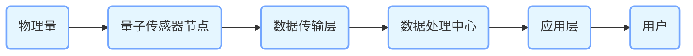

# 巴菲特 - 芒格的量子传感器网络投资：物联网的下一代

> 关键词：巴菲特、芒格、量子传感器网络、物联网、投资、下一代技术、传感器应用

> 摘要：本文聚焦于巴菲特和芒格对量子传感器网络的投资，深入探讨这一投资背后的逻辑以及量子传感器网络作为物联网下一代技术的潜力。文章将详细介绍量子传感器网络的核心概念、算法原理、数学模型，通过实际项目案例展示其应用，分析其在不同领域的实际应用场景，推荐相关学习资源、开发工具和论文著作，最后总结该技术的未来发展趋势与挑战，并解答常见问题。

## 1. 背景介绍 
### 1.1 目的和范围
本文旨在全面剖析巴菲特 - 芒格对量子传感器网络的投资决策，以及量子传感器网络在物联网领域的重要地位和发展前景。范围涵盖量子传感器网络的技术原理、实际应用、投资价值等多个方面，为读者提供一个系统、深入的了解。

### 1.2 预期读者
预期读者包括对投资领域感兴趣的人士，尤其是关注巴菲特和芒格投资策略的投资者；物联网、传感器技术相关的技术人员和研究人员；以及对新兴技术发展趋势有兴趣的普通读者。

### 1.3 文档结构概述
本文将按照以下结构展开：首先介绍量子传感器网络的核心概念与联系，包括其原理和架构；接着详细阐述核心算法原理和具体操作步骤，并使用 Python 代码进行说明；然后讲解相关的数学模型和公式，并举例说明；通过实际项目案例展示量子传感器网络的应用；分析其在不同领域的实际应用场景；推荐学习资源、开发工具和相关论文著作；总结未来发展趋势与挑战；最后解答常见问题并提供扩展阅读和参考资料。

### 1.4 术语表
#### 1.4.1 核心术语定义
- **量子传感器网络**：由多个量子传感器组成的网络系统，利用量子力学原理实现对物理量的高精度测量和信息传输。
- **物联网（IoT）**：通过各种信息传感器、射频识别技术、全球定位系统、红外感应器、激光扫描器等各种装置与技术，实时采集任何需要监控、 连接、互动的物体或过程，采集其声、光、热、电、力学、化学、生物、位置等各种需要的信息，通过各类可能的网络接入，实现物与物、物与人的泛在连接，实现对物品和过程的智能化感知、识别和管理。
- **量子力学**：研究微观粒子运动规律的物理学分支，为量子传感器的工作提供理论基础。

#### 1.4.2 相关概念解释
- **量子纠缠**：在量子力学里，当几个粒子在彼此相互作用后，由于各个粒子所拥有的特性已综合成为整体性质，无法单独描述各个粒子的性质，只能描述整体系统的性质，则称这现象为量子缠结或量子纠缠。量子传感器可利用量子纠缠实现更精确的测量。
- **量子态**：量子系统的状态，包括叠加态和纠缠态等，是量子传感器进行测量的基础。

#### 1.4.3 缩略词列表
- **IoT**：Internet of Things（物联网）
- **QSN**：Quantum Sensor Network（量子传感器网络）

## 2. 核心概念与联系 
### 核心概念原理
量子传感器网络基于量子力学原理工作。量子传感器利用量子态的特性，如量子叠加和量子纠缠，来实现对物理量的高精度测量。与传统传感器相比，量子传感器具有更高的灵敏度、分辨率和抗干扰能力。

在量子传感器网络中，多个量子传感器通过无线通信或有线连接组成网络，实现数据的采集、传输和处理。这些传感器可以分布在不同的地理位置，实时监测各种物理量，如温度、压力、磁场、电场等。

### 架构的文本示意图
量子传感器网络的架构主要包括以下几个部分：
1. **量子传感器节点**：负责对物理量进行测量，并将测量结果转换为电信号或光信号。
2. **数据传输层**：将传感器节点采集的数据传输到数据处理中心。可以采用无线通信技术（如 Wi-Fi、蓝牙、ZigBee 等）或有线通信技术（如以太网、光纤等）。
3. **数据处理中心**：对采集到的数据进行处理、分析和存储。可以采用云计算、边缘计算等技术。
4. **应用层**：根据处理后的数据，为用户提供各种应用服务，如环境监测、工业自动化、智能交通等。

### Mermaid 流程图


## 3. 核心算法原理 & 具体操作步骤 
### 核心算法原理
量子传感器网络中的核心算法主要包括量子态测量算法、数据融合算法和网络优化算法。

#### 量子态测量算法
量子态测量算法的目的是准确测量量子传感器的量子态，从而得到物理量的测量值。常用的量子态测量算法有量子层析算法和量子弱测量算法。

以下是一个简单的量子态测量算法的 Python 示例：
```python
import numpy as np

# 定义量子态
qubit_state = np.array([1, 0])  # 初始量子态为 |0>

# 定义测量算子
measurement_operator = np.array([[1, 0], [0, 0]])  # 测量 |0> 态

# 进行测量
measurement_result = np.dot(np.dot(qubit_state.conj().T, measurement_operator), qubit_state)

print("测量结果:", measurement_result)
```
在这个示例中，我们定义了一个初始量子态 `qubit_state` 和一个测量算子 `measurement_operator`，然后通过矩阵运算得到测量结果。

#### 数据融合算法
数据融合算法的目的是将多个传感器节点采集的数据进行融合，提高测量的准确性和可靠性。常用的数据融合算法有加权平均法、卡尔曼滤波法和神经网络法。

以下是一个简单的加权平均法的数据融合算法的 Python 示例：
```python
# 定义多个传感器的测量值
sensor_measurements = [1.2, 1.3, 1.1, 1.4]

# 定义每个传感器的权重
weights = [0.2, 0.3, 0.2, 0.3]

# 计算加权平均值
weighted_sum = sum([sensor_measurements[i] * weights[i] for i in range(len(sensor_measurements))])
weighted_average = weighted_sum / sum(weights)

print("加权平均融合结果:", weighted_average)
```
在这个示例中，我们定义了多个传感器的测量值和对应的权重，然后通过加权平均的方法得到融合结果。

#### 网络优化算法
网络优化算法的目的是优化量子传感器网络的拓扑结构和通信协议，提高网络的性能和效率。常用的网络优化算法有遗传算法、蚁群算法和粒子群算法。

以下是一个简单的粒子群算法的 Python 示例：
```python
import numpy as np

# 定义目标函数
def objective_function(x):
    return np.sum(x**2)

# 粒子群算法参数
num_particles = 20
dimensions = 2
max_iterations = 100
c1 = 1.4
c2 = 1.4
w = 0.7

# 初始化粒子位置和速度
particles_position = np.random.uniform(-5, 5, (num_particles, dimensions))
particles_velocity = np.random.uniform(-1, 1, (num_particles, dimensions))

# 初始化个体最优位置和全局最优位置
particles_best_position = particles_position.copy()
particles_best_fitness = np.array([objective_function(p) for p in particles_position])
global_best_index = np.argmin(particles_best_fitness)
global_best_position = particles_best_position[global_best_index]
global_best_fitness = particles_best_fitness[global_best_index]

# 粒子群算法迭代
for iteration in range(max_iterations):
    for i in range(num_particles):
        # 更新粒子速度
        r1, r2 = np.random.rand(2)
        particles_velocity[i] = (w * particles_velocity[i] +
                                 c1 * r1 * (particles_best_position[i] - particles_position[i]) +
                                 c2 * r2 * (global_best_position - particles_position[i]))
        
        # 更新粒子位置
        particles_position[i] += particles_velocity[i]
        
        # 计算新的适应度
        fitness = objective_function(particles_position[i])
        
        # 更新个体最优位置
        if fitness < particles_best_fitness[i]:
            particles_best_fitness[i] = fitness
            particles_best_position[i] = particles_position[i]
            
            # 更新全局最优位置
            if fitness < global_best_fitness:
                global_best_fitness = fitness
                global_best_position = particles_position[i]

print("全局最优位置:", global_best_position)
print("全局最优适应度:", global_best_fitness)
```
在这个示例中，我们使用粒子群算法来优化一个简单的目标函数，通过不断更新粒子的位置和速度，找到全局最优解。

### 具体操作步骤
1. **传感器部署**：根据实际应用需求，将量子传感器节点部署到合适的位置。
2. **数据采集**：量子传感器节点对物理量进行测量，并将测量结果传输到数据传输层。
3. **数据传输**：数据传输层将采集到的数据传输到数据处理中心。
4. **数据处理**：数据处理中心对采集到的数据进行处理和分析，包括量子态测量、数据融合和网络优化等操作。
5. **应用服务**：根据处理后的数据，为用户提供各种应用服务。

## 4. 数学模型和公式 & 详细讲解 & 举例说明 
### 量子态测量的数学模型
在量子力学中，量子态可以用波函数 $\psi$ 来描述。对于一个二能级量子系统，其波函数可以表示为：
$$\psi = \alpha |0\rangle + \beta |1\rangle$$
其中，$\alpha$ 和 $\beta$ 是复数，满足 $|\alpha|^2 + |\beta|^2 = 1$，$|0\rangle$ 和 $|1\rangle$ 是两个基态。

量子态的测量可以用测量算子 $\hat{M}$ 来描述。测量结果的概率可以表示为：
$$P(m) = \langle\psi|\hat{M}_m|\psi\rangle$$
其中，$\hat{M}_m$ 是对应测量结果 $m$ 的测量算子。

例如，对于一个简单的测量算子 $\hat{M}_0 = |0\rangle\langle0|$，测量结果为 $|0\rangle$ 的概率为：
$$P(0) = \langle\psi|\hat{M}_0|\psi\rangle = |\alpha|^2$$

### 数据融合的数学模型
加权平均法的数据融合公式为：
$$\bar{x} = \frac{\sum_{i=1}^{n} w_i x_i}{\sum_{i=1}^{n} w_i}$$
其中，$\bar{x}$ 是融合结果，$x_i$ 是第 $i$ 个传感器的测量值，$w_i$ 是第 $i$ 个传感器的权重，$n$ 是传感器的数量。

例如，假设有三个传感器的测量值分别为 $x_1 = 1.2$，$x_2 = 1.3$，$x_3 = 1.1$，对应的权重分别为 $w_1 = 0.2$，$w_2 = 0.3$，$w_3 = 0.5$，则融合结果为：
$$\bar{x} = \frac{0.2 \times 1.2 + 0.3 \times 1.3 + 0.5 \times 1.1}{0.2 + 0.3 + 0.5} = 1.18$$

### 网络优化的数学模型
粒子群算法的数学模型可以表示为：
$$v_{i}(t+1) = w v_{i}(t) + c_1 r_1 (p_{best_i} - x_{i}(t)) + c_2 r_2 (g_{best} - x_{i}(t))$$
$$x_{i}(t+1) = x_{i}(t) + v_{i}(t+1)$$
其中，$v_{i}(t)$ 是第 $i$ 个粒子在第 $t$ 代的速度，$x_{i}(t)$ 是第 $i$ 个粒子在第 $t$ 代的位置，$p_{best_i}$ 是第 $i$ 个粒子的个体最优位置，$g_{best}$ 是全局最优位置，$w$ 是惯性权重，$c_1$ 和 $c_2$ 是加速常数，$r_1$ 和 $r_2$ 是 $[0, 1]$ 之间的随机数。

## 5. 项目实战：代码实际案例和详细解释说明 
### 5.1  开发环境搭建
#### 硬件环境
- 量子传感器节点：根据实际需求选择合适的量子传感器节点，如基于超导量子比特的传感器、基于原子自旋的传感器等。
- 数据传输设备：如 Wi-Fi 模块、蓝牙模块、以太网交换机等。
- 数据处理服务器：可以选择云服务器或本地服务器，如阿里云 ECS、腾讯云 CVM 等。

#### 软件环境
- 操作系统：如 Linux（Ubuntu、CentOS 等）、Windows 等。
- 编程语言：Python，推荐使用 Anaconda 环境进行 Python 开发。
- 开发工具：如 PyCharm、Jupyter Notebook 等。

### 5.2  源代码详细实现和代码解读
以下是一个简单的量子传感器网络数据采集和处理的 Python 示例：
```python
import random
import time

# 模拟量子传感器节点
class QuantumSensor:
    def __init__(self, sensor_id):
        self.sensor_id = sensor_id
    
    def measure(self):
        # 模拟测量结果
        measurement = random.uniform(0, 10)
        return measurement

# 模拟数据传输层
class DataTransmissionLayer:
    def __init__(self):
        self.sensors = []
    
    def add_sensor(self, sensor):
        self.sensors.append(sensor)
    
    def transmit_data(self):
        data = []
        for sensor in self.sensors:
            measurement = sensor.measure()
            data.append(measurement)
        return data

# 模拟数据处理中心
class DataProcessingCenter:
    def __init__(self):
        self.data_transmission_layer = DataTransmissionLayer()
    
    def add_sensor(self, sensor):
        self.data_transmission_layer.add_sensor(sensor)
    
    def process_data(self):
        data = self.data_transmission_layer.transmit_data()
        # 简单的数据处理，计算平均值
        average = sum(data) / len(data)
        return average

# 主程序
if __name__ == "__main__":
    # 创建量子传感器节点
    sensor1 = QuantumSensor(1)
    sensor2 = QuantumSensor(2)
    sensor3 = QuantumSensor(3)
    
    # 创建数据处理中心
    data_processing_center = DataProcessingCenter()
    
    # 添加传感器到数据处理中心
    data_processing_center.add_sensor(sensor1)
    data_processing_center.add_sensor(sensor2)
    data_processing_center.add_sensor(sensor3)
    
    # 循环采集和处理数据
    for i in range(5):
        result = data_processing_center.process_data()
        print(f"第 {i+1} 次采集处理结果: {result}")
        time.sleep(1)
```
### 代码解读与分析
1. **QuantumSensor 类**：模拟量子传感器节点，包含一个 `measure` 方法，用于模拟测量结果。
2. **DataTransmissionLayer 类**：模拟数据传输层，包含一个 `add_sensor` 方法，用于添加传感器节点，以及一个 `transmit_data` 方法，用于传输传感器节点采集的数据。
3. **DataProcessingCenter 类**：模拟数据处理中心，包含一个 `add_sensor` 方法，用于添加传感器节点到数据传输层，以及一个 `process_data` 方法，用于处理采集到的数据。
4. **主程序**：创建量子传感器节点、数据处理中心，添加传感器节点到数据处理中心，然后循环采集和处理数据，并打印处理结果。

## 6. 实际应用场景 
### 环境监测
量子传感器网络可以用于环境监测，如空气质量监测、水质监测、土壤监测等。通过部署大量的量子传感器节点，可以实时监测环境参数的变化，及时发现环境问题，并采取相应的措施。

### 工业自动化
在工业自动化领域，量子传感器网络可以用于设备状态监测、生产过程控制等。通过实时监测设备的运行状态和生产过程中的各种参数，可以及时发现设备故障和生产异常，提高生产效率和产品质量。

### 智能交通
量子传感器网络可以用于智能交通系统，如交通流量监测、车辆定位、自动驾驶等。通过部署在道路和车辆上的量子传感器节点，可以实时监测交通流量和车辆位置，为交通管理和自动驾驶提供准确的数据支持。

### 医疗健康
在医疗健康领域，量子传感器网络可以用于生物医学检测、疾病诊断等。通过量子传感器可以实现对生物分子、细胞等的高精度检测，为疾病的早期诊断和治疗提供重要的依据。

## 7. 工具和资源推荐
### 7.1 学习资源推荐
#### 7.1.1 书籍推荐
- 《量子力学导论》：这本书是量子力学领域的经典教材，详细介绍了量子力学的基本原理和应用。
- 《物联网：技术、应用与创新》：全面介绍了物联网的技术体系、应用场景和发展趋势。
- 《传感器技术》：系统阐述了传感器的原理、设计和应用。

#### 7.1.2 在线课程
- Coursera 上的“量子计算与量子信息”课程：由知名高校教授授课，深入讲解量子计算和量子信息的基本概念和算法。
- edX 上的“物联网基础”课程：介绍物联网的基本原理、技术和应用。
- 中国大学 MOOC 上的“传感器原理与应用”课程：详细讲解传感器的原理、分类和应用。

#### 7.1.3 技术博客和网站
- IEEE Spectrum：提供最新的科技资讯和技术文章，包括量子技术、物联网等领域。
- Medium：有很多技术博主分享关于量子传感器网络和物联网的技术文章和经验。
- 量子比特：专注于量子技术领域的资讯和研究，提供量子传感器网络的最新动态。

### 7.2 开发工具框架推荐
#### 7.2.1 IDE和编辑器
- PyCharm：一款专业的 Python 集成开发环境，提供代码编辑、调试、版本控制等功能。
- Jupyter Notebook：一个交互式的编程环境，适合进行数据分析和算法验证。
- Visual Studio Code：一款轻量级的代码编辑器，支持多种编程语言，具有丰富的插件生态系统。

#### 7.2.2 调试和性能分析工具
- Py-Spy：一个 Python 性能分析工具，可以实时监测 Python 程序的性能。
- cProfile：Python 内置的性能分析模块，可以分析 Python 程序的运行时间和函数调用情况。
- Wireshark：一款网络协议分析工具，可以用于分析量子传感器网络的数据传输情况。

#### 7.2.3 相关框架和库
- Qiskit：IBM 开发的量子计算框架，提供量子算法的开发和模拟功能。
- TensorFlow：Google 开发的深度学习框架，可以用于数据处理和机器学习算法的实现。
- Scikit-learn：一个简单易用的机器学习库，提供各种机器学习算法和工具。

### 7.3 相关论文著作推荐
#### 7.3.1 经典论文
- “Quantum Sensors”：介绍了量子传感器的基本原理和应用。
- “Internet of Things: A Survey”：对物联网的发展现状和趋势进行了全面的综述。
- “Wireless Sensor Networks: A Survey”：详细介绍了无线传感器网络的技术和应用。

#### 7.3.2 最新研究成果
- 可以通过 IEEE Xplore、ACM Digital Library 等学术数据库搜索关于量子传感器网络和物联网的最新研究论文。
- 关注国际知名学术会议，如 IEEE INFOCOM、ACM MobiCom 等，了解最新的研究成果。

#### 7.3.3 应用案例分析
- 可以通过查阅行业报告和案例分析，了解量子传感器网络在不同领域的实际应用案例和经验。
- 关注科技媒体和行业论坛，了解企业在量子传感器网络和物联网领域的应用实践。

## 8. 总结：未来发展趋势与挑战
### 未来发展趋势
- **高精度和高灵敏度**：随着量子技术的不断发展，量子传感器的精度和灵敏度将不断提高，能够实现对更微弱物理量的测量。
- **集成化和微型化**：量子传感器将朝着集成化和微型化的方向发展，便于大规模部署和应用。
- **与人工智能的融合**：量子传感器网络将与人工智能技术深度融合，实现数据的智能分析和处理，提高系统的智能化水平。
- **跨领域应用**：量子传感器网络将在更多领域得到应用，如金融、能源、航空航天等，推动各行业的数字化转型。

### 挑战
- **技术难题**：量子传感器的制备和控制技术仍然面临许多挑战，如量子态的稳定性、量子噪声的抑制等。
- **成本问题**：目前量子传感器的制造成本较高，限制了其大规模应用。需要进一步降低成本，提高性价比。
- **标准和规范**：量子传感器网络的标准和规范尚未完善，需要建立统一的标准和规范，促进产业的健康发展。
- **安全和隐私**：量子传感器网络涉及大量的敏感数据，安全和隐私问题需要得到重视和解决。

## 9. 附录：常见问题与解答
### 问题 1：量子传感器网络与传统传感器网络有什么区别？
答：量子传感器网络基于量子力学原理工作，具有更高的灵敏度、分辨率和抗干扰能力。与传统传感器网络相比，量子传感器网络能够实现对更微弱物理量的测量，并且在复杂环境下具有更好的性能。

### 问题 2：巴菲特和芒格为什么会投资量子传感器网络？
答：巴菲特和芒格通常会投资具有长期增长潜力和竞争优势的项目。量子传感器网络作为物联网的下一代技术，具有广阔的应用前景和市场空间。他们可能认为量子传感器网络在未来的科技发展中将扮演重要角色，因此进行了投资。

### 问题 3：量子传感器网络的应用前景如何？
答：量子传感器网络的应用前景非常广阔，包括环境监测、工业自动化、智能交通、医疗健康等多个领域。随着技术的不断发展和成本的降低，量子传感器网络将在更多领域得到应用，推动各行业的数字化转型。

### 问题 4：学习量子传感器网络需要具备哪些知识？
答：学习量子传感器网络需要具备量子力学、传感器技术、物联网、通信技术等方面的知识。同时，还需要掌握编程语言（如 Python）和相关的开发工具。

## 10. 扩展阅读 & 参考资料
### 扩展阅读
- 《量子计算与量子信息原理》
- 《物联网安全技术》
- 《传感器网络协议与算法》

### 参考资料
- Nielsen, M. A., & Chuang, I. L. (2010). Quantum computation and quantum information. Cambridge University Press.
- Atzori, L., Iera, A., & Morabito, G. (2010). The Internet of Things: A survey. Computer networks, 54(15), 2787-2805.
- Akyildiz, I. F., Su, W., Sankarasubramaniam, Y., & Cayirci, E. (2002). Wireless sensor networks: A survey. Computer networks, 38(4), 393-422.

作者：AI天才研究院/AI Genius Institute & 禅与计算机程序设计艺术 /Zen And The Art of Computer Programming